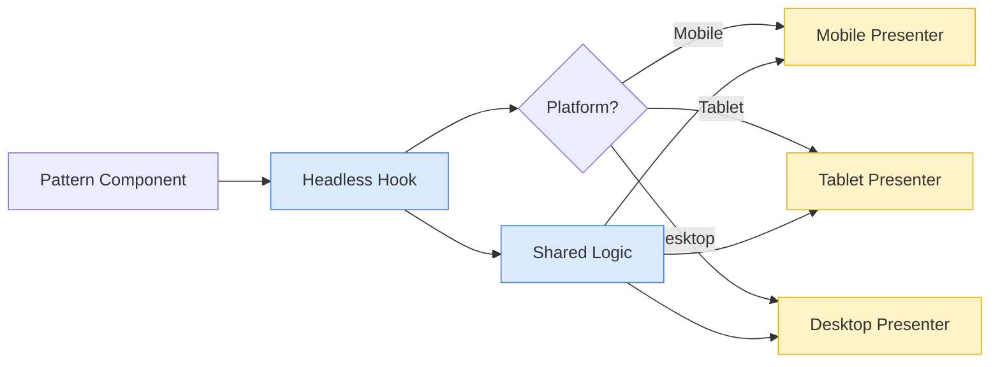

# Platform Presenter Pattern - Developer Guide

**Version:** 2.0  
**Last Updated:** January 20, 2026

Complete guide to implementing the Headless + Platform Presenter pattern in NasNetConnect.

---

## 🎯 What is the Platform Presenter Pattern?

**Problem:** Different devices need fundamentally different UIs, not just responsive scaling.
- **Mobile:** Compact, thumb-friendly, simplified
- **Tablet:** Balanced density, touch-optimized
- **Desktop:** Dense info, keyboard-optimized, power-user features

**Solution:** Separate behavior (logic) from presentation (UI), render optimally per platform.



---

## 🏗️ Architecture

### The Three Parts

1. **Headless Hook** - All behavior and state management
2. **Platform Presenters** - Three UI variants (Mobile/Tablet/Desktop)
3. **Main Component** - Automatic presenter selection

### Benefits

- **Write logic once** - Behavior in headless hook, not duplicated 3×
- **Optimal UX** - Each platform gets purpose-built UI
- **Bundle efficiency** - Platform presenters lazy-loaded (~33% reduction)
- **Easy testing** - Test hook once, visual test presenters separately
- **Maintainability** - Logic changes don't affect UI, UI changes don't affect logic

---

## 📝 Step-by-Step Implementation

### Step 1: Create Headless Hook

**File:** `useResourceCard.ts`

```typescript
import { useState, useCallback, useMemo } from 'react';
import type { ResourceCardProps, ResourceCardState } from './types';

export function useResourceCard<T extends Resource>(
  props: ResourceCardProps<T>
): ResourceCardState<T> {
  const { resource, onAction, defaultExpanded = false } = props;
  
  // 1. Define component state
  const [expanded, setExpanded] = useState(defaultExpanded);
  const [loading, setLoading] = useState(false);
  
  // 2. Create stable handlers with useCallback
  const handleToggle = useCallback(() => {
    setExpanded(prev => !prev);
  }, []);
  
  const handleAction = useCallback(async (action: string) => {
    if (!onAction) return;
    
    setLoading(true);
    try {
      await onAction(action, resource);
    } catch (error) {
      console.error('Action failed:', error);
    } finally {
      setLoading(false);
    }
  }, [onAction, resource]);
  
  const handleEdit = useCallback(() => {
    handleAction('edit');
  }, [handleAction]);
  
  const handleDelete = useCallback(() => {
    handleAction('delete');
  }, [handleAction]);
  
  // 3. Compute derived state with useMemo
  const isActive = useMemo(() => {
    return resource.status === 'active' || resource.status === 'online';
  }, [resource.status]);
  
  const statusColor = useMemo(() => {
    switch (resource.status) {
      case 'online': return 'success';
      case 'offline': return 'error';
      case 'warning': return 'warning';
      default: return 'neutral';
    }
  }, [resource.status]);
  
  // 4. Return everything presenters need
  return {
    // Original props
    resource,
    actions: props.actions,
    className: props.className,
    
    // State
    expanded,
    loading,
    isActive,
    statusColor,
    
    // Handlers
    handleToggle,
    handleAction,
    handleEdit,
    handleDelete,
  };
}
```

**Key Principles:**
- ✅ All state and logic here
- ✅ Stable callbacks with `useCallback`
- ✅ Derived state with `useMemo`
- ✅ No JSX or rendering logic
- ✅ Returns complete state for presenters

---

### Step 2: Create Mobile Presenter

**File:** `ResourceCard.Mobile.tsx`

```typescript
import { Card } from '@/ui/primitives/card';
import { Button } from '@/ui/primitives/button';
import { StatusBadge } from '@/ui/patterns/common/status-badge';
import { ActionMenu } from '@/ui/patterns/common/action-menu';
import type { ResourceCardState } from './types';

export function ResourceCardMobile<T extends Resource>(
  state: ResourceCardState<T>
) {
  const { 
    resource, 
    expanded, 
    loading, 
    isActive,
    statusColor,
    actions,
    handleToggle, 
    handleAction,
    className 
  } = state;
  
  return (
    <Card 
      className={`p-3 border-b ${className ?? ''}`}
      role="article"
      aria-label={resource.name}
    >
      {/* Main row - compact, tap to expand */}
      <div 
        className="flex items-center justify-between cursor-pointer"
        onClick={handleToggle}
        onKeyDown={(e) => {
          if (e.key === 'Enter' || e.key === ' ') {
            e.preventDefault();
            handleToggle();
          }
        }}
        tabIndex={0}
        role="button"
        aria-expanded={expanded}
      >
        {/* Content - simplified for mobile */}
        <div className="flex-1 min-w-0">
          <h4 className="font-medium text-base truncate">
            {resource.name}
          </h4>
          <div className="flex items-center gap-2 mt-1">
            <StatusBadge 
              status={statusColor} 
              size="sm" 
              live={isActive}
            />
            <span className="text-xs text-muted-foreground">
              {resource.type}
            </span>
          </div>
        </div>
        
        {/* Primary action - large touch target (44x44px minimum) */}
        <Button 
          size="lg" 
          onClick={(e) => {
            e.stopPropagation();
            handleAction('primary');
          }}
          disabled={loading}
          className="min-w-[44px] min-h-[44px] ml-2"
          aria-label={`Connect to ${resource.name}`}
        >
          {loading ? (
            <Icon name="lucide:loader" className="animate-spin" />
          ) : (
            <Icon name="lucide:plug" />
          )}
        </Button>
      </div>
      
      {/* Expanded details - slide down animation */}
      {expanded && (
        <motion.div
          initial={{ height: 0, opacity: 0 }}
          animate={{ height: 'auto', opacity: 1 }}
          exit={{ height: 0, opacity: 0 }}
          transition={{ duration: 0.15 }}  // Fast on mobile
          className="mt-3 pt-3 border-t"
        >
          {/* Additional details */}
          <div className="space-y-2 text-sm">
            <div>
              <span className="text-muted-foreground">ID:</span>{' '}
              <code className="text-xs">{resource.id}</code>
            </div>
            <div>
              <span className="text-muted-foreground">Status:</span>{' '}
              {resource.status}
            </div>
          </div>
          
          {/* Actions menu - bottom sheet on mobile */}
          {actions && actions.length > 0 && (
            <div className="mt-3">
              <ActionMenu actions={actions} position="bottom" />
            </div>
          )}
        </motion.div>
      )}
    </Card>
  );
}

ResourceCardMobile.displayName = 'ResourceCard.Mobile';
```

**Mobile Presenter Principles:**
- ✅ Compact layout (conserve screen space)
- ✅ Large touch targets (44px minimum)
- ✅ Tap to expand details
- ✅ Bottom sheet for action menus
- ✅ Fast animations (100-150ms)
- ✅ Single column layout
- ✅ Simplified information (essential only)

---

### Step 3: Create Tablet Presenter

**File:** `ResourceCard.Tablet.tsx`

```typescript
export function ResourceCardTablet<T extends Resource>(
  state: ResourceCardState<T>
) {
  const { 
    resource, 
    expanded, 
    loading, 
    statusColor,
    actions,
    handleToggle, 
    handleAction,
    handleEdit,
    handleDelete,
    className 
  } = state;
  
  return (
    <Card className={`p-4 ${className ?? ''}`}>
      <div className="flex items-start justify-between">
        {/* Content - balanced density */}
        <div className="flex-1">
          <div className="flex items-center gap-3">
            <h3 className="text-lg font-semibold">{resource.name}</h3>
            <StatusBadge status={statusColor} />
          </div>
          
          {/* Some info always visible */}
          <div className="mt-2 text-sm text-muted-foreground">
            <span>{resource.type}</span>
            <span className="mx-2">•</span>
            <span>{resource.id}</span>
          </div>
        </div>
        
        {/* Actions - exposed but compact */}
        <div className="flex gap-2">
          <Button 
            onClick={() => handleAction('primary')} 
            disabled={loading}
          >
            {loading ? 'Connecting...' : 'Connect'}
          </Button>
          <Button 
            variant="outline" 
            onClick={handleToggle}
            aria-expanded={expanded}
          >
            {expanded ? 'Less' : 'More'}
          </Button>
        </div>
      </div>
      
      {/* Collapsible details */}
      {expanded && (
        <motion.div
          initial={{ height: 0, opacity: 0 }}
          animate={{ height: 'auto', opacity: 1 }}
          transition={{ duration: 0.2 }}  // Medium speed on tablet
          className="mt-4 pt-4 border-t"
        >
          <div className="grid grid-cols-2 gap-4 text-sm">
            <div>
              <label className="font-medium text-muted-foreground">
                Created
              </label>
              <p>{resource.createdAt}</p>
            </div>
            <div>
              <label className="font-medium text-muted-foreground">
                Modified
              </label>
              <p>{resource.updatedAt}</p>
            </div>
          </div>
          
          {/* Additional actions when expanded */}
          {actions && actions.length > 0 && (
            <div className="mt-4 flex gap-2">
              <Button variant="outline" size="sm" onClick={handleEdit}>
                Edit
              </Button>
              <Button variant="danger" size="sm" onClick={handleDelete}>
                Delete
              </Button>
            </div>
          )}
        </motion.div>
      )}
    </Card>
  );
}

ResourceCardTablet.displayName = 'ResourceCard.Tablet';
```

**Tablet Presenter Principles:**
- ✅ Balanced information density
- ✅ Grid layouts (2 columns often)
- ✅ Collapsible details
- ✅ Optimized touch targets (larger than desktop)
- ✅ Medium animations (200ms)
- ✅ Some actions visible, more on expand

---

### Step 4: Create Desktop Presenter

**File:** `ResourceCard.Desktop.tsx`

```typescript
export function ResourceCardDesktop<T extends Resource>(
  state: ResourceCardState<T>
) {
  const { 
    resource, 
    loading, 
    statusColor,
    actions,
    handleAction,
    handleEdit,
    handleDelete,
    className 
  } = state;
  
  return (
    <Card 
      className={`p-6 hover:shadow-lg transition-shadow ${className ?? ''}`}
    >
      {/* Header with all info visible */}
      <div className="flex items-start justify-between mb-4">
        <div>
          <div className="flex items-center gap-3">
            <h2 className="text-xl font-bold">{resource.name}</h2>
            <StatusBadge status={statusColor} showLabel />
          </div>
          <div className="mt-1 text-sm text-muted-foreground">
            <code className="text-xs bg-muted px-2 py-1 rounded">
              {resource.id}
            </code>
          </div>
        </div>
        
        {/* All actions exposed - no menu needed */}
        <div className="flex gap-2">
          <Button 
            onClick={handleEdit}
            variant="outline"
            title="Edit (Cmd+E)"
          >
            <Icon name="lucide:pencil" size="sm" />
            Edit
          </Button>
          <Button 
            onClick={() => handleAction('primary')} 
            disabled={loading}
            title="Connect (Cmd+Enter)"
          >
            {loading ? (
              <>
                <Icon name="lucide:loader" className="animate-spin" size="sm" />
                Connecting...
              </>
            ) : (
              <>
                <Icon name="lucide:plug" size="sm" />
                Connect
              </>
            )}
          </Button>
          <Button 
            variant="danger" 
            onClick={handleDelete}
            title="Delete (Cmd+Backspace)"
          >
            <Icon name="lucide:trash-2" size="sm" />
            Delete
          </Button>
        </div>
      </div>
      
      {/* Details always visible on desktop - dense grid */}
      <div className="grid grid-cols-3 gap-6">
        <div>
          <label className="text-xs font-medium text-muted-foreground uppercase">
            Type
          </label>
          <p className="text-base mt-1">{resource.type}</p>
        </div>
        <div>
          <label className="text-xs font-medium text-muted-foreground uppercase">
            Created
          </label>
          <p className="text-base mt-1">
            {formatDate(resource.createdAt)}
          </p>
        </div>
        <div>
          <label className="text-xs font-medium text-muted-foreground uppercase">
            Modified
          </label>
          <p className="text-base mt-1">
            {formatDate(resource.updatedAt)}
          </p>
        </div>
      </div>
      
      {/* Additional metadata */}
      <div className="mt-4 pt-4 border-t">
        <dl className="grid grid-cols-2 gap-x-6 gap-y-2 text-sm">
          <div>
            <dt className="font-medium text-muted-foreground">UUID</dt>
            <dd className="mt-1">
              <code className="text-xs">{resource.uuid}</code>
            </dd>
          </div>
          {/* More metadata... */}
        </dl>
      </div>
    </Card>
  );
}

ResourceCardDesktop.displayName = 'ResourceCard.Desktop';
```

**Desktop Presenter Principles:**
- ✅ Dense information display (all details visible)
- ✅ Exposed actions (no hidden menus)
- ✅ Multi-column grids (2-3 columns)
- ✅ Hover states with tooltips
- ✅ Keyboard shortcuts (documented in title)
- ✅ Smooth animations (300ms)
- ✅ No expand/collapse (show all by default)

---

### Step 5: Main Component with Auto-Detection

**File:** `ResourceCard.tsx`

```typescript
import { usePlatform } from '@/core/hooks/usePlatform';
import { useResourceCard } from './useResourceCard';
import { ResourceCardMobile } from './ResourceCard.Mobile';
import { ResourceCardTablet } from './ResourceCard.Tablet';
import { ResourceCardDesktop } from './ResourceCard.Desktop';
import type { ResourceCardProps } from './types';

/**
 * ResourceCard - Platform-adaptive resource display
 * 
 * Automatically renders optimal UI for each platform:
 * - Mobile: Compact row, tap to expand
 * - Tablet: Grid card, collapsible details
 * - Desktop: Full card, all actions visible
 * 
 * @example
 * ```tsx
 * // Automatic platform detection (95% of cases)
 * <ResourceCard<VPNClient> resource={vpn} />
 * 
 * // Manual override (5% of cases)
 * <ResourceCard<VPNClient> resource={vpn} presenter="desktop" />
 * ```
 */
export function ResourceCard<T extends Resource>(props: ResourceCardProps<T>) {
  // Get component state from headless hook
  const state = useResourceCard(props);
  
  // Detect platform (or use manual override)
  const { platform } = usePlatform();
  const selectedPlatform = props.presenter ?? platform;
  
  // Select appropriate presenter
  const Presenter = {
    mobile: ResourceCardMobile,
    tablet: ResourceCardTablet,
    desktop: ResourceCardDesktop,
  }[selectedPlatform];
  
  return <Presenter {...state} />;
}

// Attach presenters for manual selection
ResourceCard.Mobile = ResourceCardMobile;
ResourceCard.Tablet = ResourceCardTablet;
ResourceCard.Desktop = ResourceCardDesktop;

ResourceCard.displayName = 'ResourceCard';
```

---

## 🔧 Platform Detection

### PlatformProvider

**File:** `PlatformProvider.tsx`

```typescript
import { createContext, useContext, useEffect, useState } from 'react';

type Platform = 'mobile' | 'tablet' | 'desktop';

interface PlatformContextValue {
  platform: Platform;
  isMobile: boolean;
  isTablet: boolean;
  isDesktop: boolean;
}

const PlatformContext = createContext<PlatformContextValue | null>(null);

export function PlatformProvider({ children }: { children: React.ReactNode }) {
  const [platform, setPlatform] = useState<Platform>(() => detectPlatform());
  
  useEffect(() => {
    const handleResize = () => {
      setPlatform(detectPlatform());
    };
    
    window.addEventListener('resize', handleResize);
    return () => window.removeEventListener('resize', handleResize);
  }, []);
  
  const value = {
    platform,
    isMobile: platform === 'mobile',
    isTablet: platform === 'tablet',
    isDesktop: platform === 'desktop',
  };
  
  return (
    <PlatformContext.Provider value={value}>
      {children}
    </PlatformContext.Provider>
  );
}

export function usePlatform() {
  const context = useContext(PlatformContext);
  if (!context) {
    throw new Error('usePlatform must be used within PlatformProvider');
  }
  return context;
}

function detectPlatform(): Platform {
  const width = window.innerWidth;
  
  // Multi-factor detection
  const isTouchDevice = 'ontouchstart' in window;
  const isIPad = /iPad/.test(navigator.userAgent);
  
  // iPad always tablet regardless of width
  if (isIPad) return 'tablet';
  
  // Width-based for non-iPad
  if (width < 640) return 'mobile';
  if (width < 1024) return 'tablet';
  return 'desktop';
}
```

---

## 📱 Platform-Specific Guidelines

### Mobile Presenter Requirements

**Layout:**
- Single column only
- Compact information
- Tap to expand for details
- Bottom sheet for action menus

**Interactions:**
- Touch targets: Minimum 44×44px
- Swipe gestures: Supported where appropriate
- Pull-to-refresh: For data updates
- No hover states (touch devices)

**Performance:**
- Fast animations (100-150ms)
- Lazy load heavy content
- Virtualize long lists

**Navigation:**
- Bottom tab bar (thumb-friendly)
- Full-screen modals
- Back button top-left

---

### Tablet Presenter Requirements

**Layout:**
- 2-column grids often
- Collapsible sidebars
- Master-detail patterns
- Balanced density

**Interactions:**
- Touch targets: 38-44px (slightly smaller ok)
- Both touch and mouse supported
- Context menus on long-press
- Hover states optional

**Performance:**
- Medium animations (200ms)
- Balance between mobile and desktop

**Navigation:**
- Collapsible sidebar
- Some keyboard shortcuts
- Swipe + click supported

---

### Desktop Presenter Requirements

**Layout:**
- Multi-column grids (2-3 columns)
- Dense information display
- No expand/collapse (show all)
- Fixed sidebars

**Interactions:**
- Standard click targets (32-38px)
- Hover states with additional info
- Context menus on right-click
- Drag-and-drop supported

**Performance:**
- Smooth animations (300ms)
- All features exposed
- Keyboard shortcuts everywhere

**Navigation:**
- Persistent sidebar
- Command palette (Cmd+K)
- Breadcrumbs
- Tab navigation

---

## 🎨 Styling Patterns

### Tailwind Classes Per Platform

```tsx
// Mobile
className="p-3 text-sm"           // Compact padding, smaller text

// Tablet
className="p-4 text-base"         // Medium padding, normal text

// Desktop
className="p-6 text-base"         // Generous padding
```

### Responsive Classes

```tsx
// Mobile-first approach
className="
  p-3          // Mobile: 12px padding
  md:p-4       // Tablet: 16px padding
  lg:p-6       // Desktop: 24px padding
  
  text-sm      // Mobile: 14px text
  md:text-base // Tablet: 16px text
  lg:text-lg   // Desktop: 18px text
  
  grid-cols-1  // Mobile: 1 column
  md:grid-cols-2  // Tablet: 2 columns
  lg:grid-cols-3  // Desktop: 3 columns
"
```

---

## 🧪 Testing Platform Presenters

### Unit Tests (Headless Hook)

```typescript
describe('useResourceCard', () => {
  it('should initialize with default state', () => {
    const { result } = renderHook(() => 
      useResourceCard({ resource: mockResource })
    );
    
    expect(result.current.expanded).toBe(false);
    expect(result.current.loading).toBe(false);
  });
  
  // Test all logic, no UI
});
```

### Component Tests (Presenters)

```typescript
describe('ResourceCard.Mobile', () => {
  it('should render in compact layout', () => {
    const state = { /* mock state */ };
    render(<ResourceCardMobile {...state} />);
    
    expect(screen.getByRole('button')).toHaveClass('min-w-[44px]');
  });
});

describe('ResourceCard.Desktop', () => {
  it('should show all details by default', () => {
    const state = { /* mock state */ };
    render(<ResourceCardDesktop {...state} />);
    
    expect(screen.getByText(/Created/i)).toBeVisible();
    expect(screen.getByText(/Modified/i)).toBeVisible();
  });
});
```

### Visual Tests (Storybook)

```typescript
export const Mobile: Story = {
  args: { /* ... */ },
  parameters: {
    viewport: { defaultViewport: 'mobile1' },  // Force mobile viewport
  },
};

export const Tablet: Story = {
  args: { presenter: 'tablet' },
  parameters: {
    viewport: { defaultViewport: 'tablet' },
  },
};

export const Desktop: Story = {
  args: { presenter: 'desktop' },
};
```

---

## 🚀 Performance Optimization

### Lazy Loading Presenters

```typescript
import { lazy } from 'react';

const ResourceCardMobile = lazy(() => import('./ResourceCard.Mobile'));
const ResourceCardTablet = lazy(() => import('./ResourceCard.Tablet'));
const ResourceCardDesktop = lazy(() => import('./ResourceCard.Desktop'));

export function ResourceCard<T>(props: ResourceCardProps<T>) {
  const state = useResourceCard(props);
  const { platform } = usePlatform();
  
  // Only load presenter for current platform
  const Presenter = {
    mobile: ResourceCardMobile,
    tablet: ResourceCardTablet,
    desktop: ResourceCardDesktop,
  }[platform];
  
  return (
    <Suspense fallback={<Skeleton className="h-24" />}>
      <Presenter {...state} />
    </Suspense>
  );
}
```

**Bundle Savings:**
- Without lazy loading: Load all 3 presenters (~15KB)
- With lazy loading: Load only 1 presenter (~5KB)
- **Savings:** ~67% reduction per component

---

## 🎯 When to Override Platform Detection

### Manual Override Scenarios

**95% of time:** Auto-detection works perfectly
```tsx
<ResourceCard resource={vpn} />  // Auto-detects platform
```

**5% of time:** Manual override needed
```tsx
// Force desktop view on tablet (power user preference)
<ResourceCard resource={vpn} presenter="desktop" />

// Force mobile view in screenshot/demo
<ResourceCard resource={vpn} presenter="mobile" />

// Responsive component in Storybook
<ResourceCard resource={vpn} presenter={selectedPresenter} />
```

---

## 📋 Quick Reference

### Implementation Checklist

- [ ] Headless hook created with all logic
- [ ] 3 platform presenters implemented
- [ ] Main component with auto-detection
- [ ] Presenters attached for manual selection
- [ ] Display names set for debugging
- [ ] TypeScript types defined
- [ ] Tests for hook and presenters
- [ ] Storybook stories for each platform

### Common Patterns

```typescript
// Standard pattern component structure
export function PatternName<T>(props: PatternProps<T>) {
  const state = usePatternName(props);
  const { platform } = usePlatform();
  const Presenter = presenters[props.presenter ?? platform];
  return <Presenter {...state} />;
}

PatternName.Mobile = PatternMobile;
PatternName.Tablet = PatternTablet;
PatternName.Desktop = PatternDesktop;
```

---

## 🎓 Learning Path

### For New Developers

1. **Read** [Component Pattern Template](./COMPONENT_PATTERN_TEMPLATE.md)
2. **Study** existing pattern: `ResourceCard` (good reference implementation)
3. **Implement** your first pattern following template
4. **Test** on all 3 platforms
5. **Review** with design team

### Resources

- [Component Library](./ux-design/6-component-library.md) - All 56 patterns
- [Design System Foundation](./ux-design/1-design-system-foundation.md) - Architecture
- [Component Pattern Template](./COMPONENT_PATTERN_TEMPLATE.md) - Step-by-step guide

---

**Questions?** Review the [Design System README](./README.md) or contact the UX Designer.
