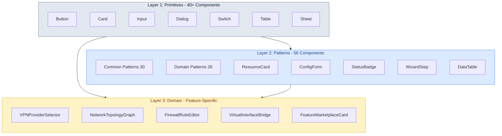
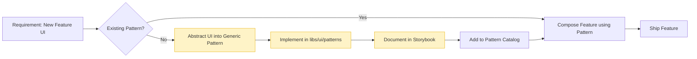
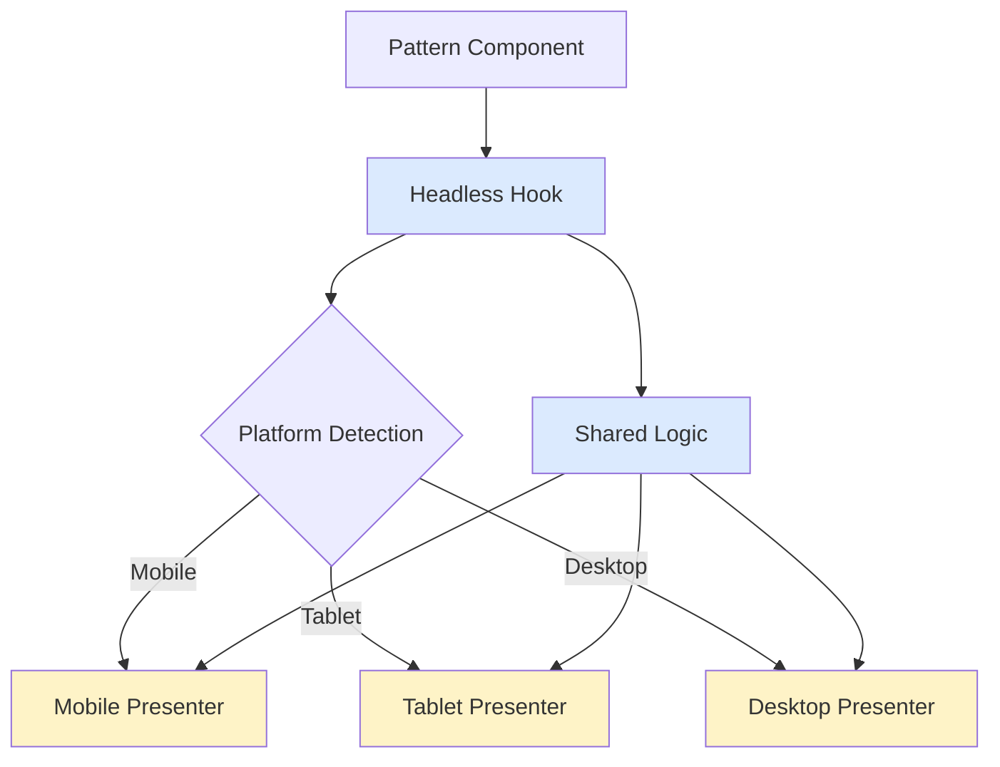

# 1. Design System Foundation

**Last Updated:** January 20, 2026  
**Version:** 2.0  
**Status:** Production-Ready Architecture

---

## 1.1 Design System Choice

**Chosen Stack:** 
*   **UI Framework:** shadcn/ui + Radix UI primitives + Tailwind CSS 3.4+
*   **Icons:** Lucide React (unified icon system)
*   **Animation:** Framer Motion 11+ (complex animations), CSS transitions (simple)
*   **Notifications:** Sonner (toast system)
*   **Data Tables:** TanStack Table 8 + TanStack Virtual 3
*   **Forms:** React Hook Form 7 + Zod 3

**Rationale:**

- **Mobile-first responsive design** out of the box with Tailwind
- **Lightweight bundles**: Tree-shakeable architecture (target: <250KB gzipped initial bundle)
- **Built-in dark mode support**: Seamless dual-theme switching via CSS variables
- **WCAG AAA accessibility compliant**: Radix primitives ensure ARIA attributes, 7:1 contrast ratio
- **Code ownership model**: Components copied into repo ("owned"), preventing dependency lock-in
- **Proven in production**: shadcn/ui is industry standard for React modern apps
- **Perfect fit**: Aligns with React 18 + Vite 5 + TypeScript 5+ stack
- **Platform-optimized**: Headless + Presenter pattern enables optimal rendering per device
- **Comprehensive theming**: 200+ design tokens (Primitive → Semantic → Component)

## 1.2 Three-Layer Architecture

The design system follows a strict hierarchical architecture ensuring consistency, scalability, and maintainability. This architecture emerged from comprehensive brainstorming sessions (Jan 2026) analyzing 120+ features across 14 categories.



### Layer 1: Primitives (libs/ui/primitives)
**Count:** ~40 components  
**Source:** shadcn/ui + Radix UI (code-owned)  
**Purpose:** Accessible, styled base components that are domain-agnostic

**Complete Component List:**
*   **Forms:** `Button`, `Input`, `Select`, `Checkbox`, `Switch`, `RadioGroup`, `Slider`, `Form`, `Label`
*   **Display:** `Card`, `Table`, `Avatar`, `Badge`, `Calendar`, `Accordion`
*   **Feedback:** `Alert`, `Progress`, `Skeleton`, `Sonner` (Toast)
*   **Overlay:** `Dialog`, `Sheet` (Drawer), `Popover`, `Tooltip`, `HoverCard`, `ContextMenu`
*   **Navigation:** `Tabs`, `DropdownMenu`, `NavigationMenu`, `Breadcrumb`, `Pagination`, `Command` (Cmd+K)
*   **Layout:** `Separator`, `ScrollArea`, `AspectRatio`, `Resizable`

**Responsibilities:**
- WCAG AAA accessibility compliance (7:1 contrast, keyboard navigation, screen reader support)
- Consistent styling via design tokens
- Event handling and state management
- Dark/light theme support

### Layer 2: Patterns (libs/ui/patterns)
**Count:** 56 pattern components (30 common + 26 domain)  
**Source:** Custom-built, consuming Layer 1 primitives  
**Purpose:** Enforce consistent UX patterns across all features

**Architecture:** **Headless + Platform Presenters**
- **Headless Hooks:** Behavior logic written once (e.g., `useResourceCard`)
- **Platform Presenters:** Three presenters per pattern
  - `Mobile` (<640px): Compact, thumb-friendly
  - `Tablet` (640-1024px): Balanced density
  - `Desktop` (>1024px): Full density, keyboard-optimized

**Common Patterns (30 components):**

**Forms (6):**
1. `ResourceForm` - CRUD operations with 4 field modes (editable/readonly/hidden/computed)
2. `WizardStep` - Multi-step flows with XState integration
3. `FieldGroup` - Grouped fields with labels
4. `ConfigurationPreview` - Before-apply diff view
5. `BulkEditForm` - Batch operations
6. `ImportExportForm` - Config import/export

**Displays (7):**
1. `ResourceCard` - List/grid views with platform presenters
2. `StatusBadge` - Unified status indicators with live pulse
3. `MetricDisplay` - Bandwidth, CPU, uptime metrics
4. `InfoPanel` - Read-only information display
5. `ConnectionIndicator` - Real-time connection status
6. `HealthScore` - 0-100 health visualization
7. `DependencyGraph` - Visual dependency relationships

**Data (6):**
1. `DataTable` - TanStack Table with virtualization (>20 items)
2. `Chart` - Traffic graphs, metrics (Recharts/uPlot)
3. `LogViewer` - Real-time log streaming
4. `Timeline` - Configuration history
5. `StatisticsPanel` - Aggregated metrics
6. `ComparisonView` - Before/after diff

**Navigation (5):**
1. `Sidebar` - Desktop navigation
2. `TabBar` - Mobile bottom navigation
3. `Breadcrumb` - Location hierarchy
4. `CommandPalette` - Cmd+K global search
5. `QuickActions` - Contextual action menu

**Feedback (6):**
1. `Alert` - Warnings, errors, info
2. `ConfirmDialog` - Dangerous operation confirmation
3. `ProgressTracker` - Multi-step operation progress
4. `Toast` - Ephemeral notifications (Sonner)
5. `LoadingSkeleton` - Content placeholders
6. `EmptyState` - No data placeholder with actions

**Domain Patterns (26 components):**

**Networking (10):**
1. `VPNProviderSelector` - 9 VPN provider presets
2. `NetworkTopologyVisualization` - Visual network map
3. `InterfaceStatusGrid` - Multi-interface status
4. `WANFailoverConfig` - Multi-WAN orchestration
5. `SubnetCalculator` - CIDR calculator widget
6. `DHCPLeaseTable` - Active leases management
7. `TunnelConnectionFlow` - Tunnel setup wizard
8. `VLANTaggingEditor` - VLAN configuration
9. `WireGuardPeerManager` - Peer list with QR codes
10. `BridgePortManager` - Bridge member management

**Security (6):**
1. `FirewallRuleEditor` - Drag-drop rule ordering
2. `AddressListManager` - IP list CRUD with import
3. `NATRuleBuilder` - Port forwarding wizard
4. `SecurityProfileSelector` - Preset security levels
5. `CertificateManager` - Upload, Let's Encrypt, renewal
6. `AccessControlMatrix` - Visual permission grid

**Monitoring (6):**
1. `TrafficChart` - Real-time bandwidth graphs
2. `DiagnosticToolPanel` - Ping, traceroute, DNS lookup
3. `DeviceDiscoveryTable` - Network scan results
4. `AlertRuleBuilder` - Alert configuration
5. `PerformanceMetricsGrid` - CPU, RAM, connections
6. `LogStreamViewer` - Filtered real-time logs

**Feature Marketplace (4):**
1. `FeatureCard` - Browse marketplace features
2. `InstallWizard` - Feature installation flow
3. `FeatureInstanceManager` - Multi-instance control
4. `DependencyResolver` - Dependency visualization

**Responsibilities:**
- Consistent UX across all features
- Platform-specific optimizations
- Form field mode handling (editable/readonly/hidden/computed)
- Accessibility validation (automatic WCAG AAA)
- Performance optimization (React.memo, lazy loading)

### Layer 3: Domain Components (libs/features/*/components)
**Count:** Feature-specific (60+ anticipated)  
**Source:** Feature modules  
**Purpose:** Business logic and feature-specific functionality

**Examples:**
- `VPNConnectionCard` - Extends `ResourceCard` with VPN-specific logic
- `VirtualInterfaceBridge` - Maps marketplace services to VLAN interfaces
- `RouterCapabilityMatrix` - Hardware support visualization
- `TimeTravelSlider` - Configuration history scrubber
- `ImpactAnalysisCard` - Pre-flight change impact visualization
- `DeploymentStatus` - 5-phase update lifecycle visualizer

**Responsibilities:**
- Feature-specific business logic
- GraphQL query/mutation integration
- State machine orchestration (XState)
- Data transformation and validation
- Feature-specific error handling

## 1.3 Patterns-First Philosophy

**Core Principle:** All UI must be built as reusable patterns first. No feature-specific components until patterns are abstracted.



**Development Workflow:**
1. **Analyze UI need** - What recurring pattern does this represent?
2. **Search pattern catalog** - Does a pattern already exist?
3. **If no:** Abstract into generic pattern (libs/ui/patterns)
4. **Create Storybook stories** - Document all states and platforms
5. **Write integration tests** - Testing Trophy approach
6. **If yes:** Compose feature using existing pattern
7. **Ship feature** - Feature code is minimal, mostly composition

**Benefits:**
1. **Consistency:** All wizards, forms, and cards behave identically
2. **Scalability:** 15-30 minute feature development time (validated in brainstorming)
3. **Maintainability:** Fix pattern once, update 20+ features automatically
4. **Testing:** Patterns tested in isolation (~450 Storybook stories)
5. **Performance:** Shared patterns = better bundle optimization
6. **Accessibility:** WCAG AAA built into patterns (multi-layer defense)

**Pattern Development Speed:**
- **Common patterns:** 80% of UI coverage
- **Domain patterns:** 15% of UI coverage  
- **Custom feature code:** Only 5% unique to each feature

---

## 1.4 Design Token System

**Architecture:** Three-tier token system with ~200 tokens following W3C Design Tokens specification.

### Tier 1: Primitive Tokens (~80 tokens)
Raw values without semantic meaning. The foundation of the design system.

**Categories:**
```typescript
{
  colors: {
    blue: { 50: '#eff6ff', 500: '#3b82f6', 900: '#1e3a8a' },
    red: { 50: '#fef2f2', 500: '#ef4444', 900: '#7f1d1d' },
    // ... full color palette
  },
  spacing: { 0: '0', 1: '0.25rem', 4: '1rem', 16: '4rem' },
  fontSize: { xs: '0.75rem', sm: '0.875rem', base: '1rem', xl: '1.25rem' },
  borderRadius: { sm: '0.125rem', md: '0.375rem', lg: '0.5rem' },
  shadows: { sm: '0 1px 2px...', md: '0 4px 6px...', lg: '0 10px 15px...' },
  fontWeight: { light: 300, normal: 400, medium: 500, semibold: 600, bold: 700 }
}
```

### Tier 2: Semantic Tokens (~70 tokens)
Tokens with meaning and purpose, mapped from primitives.

**Functional Semantics:**
```typescript
{
  // Functional colors
  colorPrimary: 'primitive.blue.500',
  colorSuccess: 'primitive.green.500',
  colorWarning: 'primitive.yellow.500',
  colorDanger: 'primitive.red.500',
  colorInfo: 'primitive.blue.400',
  colorNeutral: 'primitive.gray.500',
  
  // Category accent colors (14 feature categories)
  colorCategorySecurity: 'primitive.red.600',
  colorCategoryMonitoring: 'primitive.purple.500',
  colorCategoryNetworking: 'primitive.blue.600',
  colorCategoryVPN: 'primitive.green.600',
  colorCategoryWiFi: 'primitive.cyan.600',
  colorCategoryFirewall: 'primitive.orange.600',
  colorCategorySystem: 'primitive.gray.600',
  
  // Spacing semantics
  spacingComponentSm: 'primitive.spacing.2',
  spacingComponentMd: 'primitive.spacing.4',
  spacingComponentLg: 'primitive.spacing.6',
  spacingLayoutGap: 'primitive.spacing.6',
  spacingPageMargin: 'primitive.spacing.8',
  
  // Typography semantics
  fontDisplay: 'primitive.fontFamily.sans',
  fontBody: 'primitive.fontFamily.sans',
  fontMono: 'primitive.fontFamily.mono',
  lineHeightTight: '1.25',
  lineHeightNormal: '1.5',
  lineHeightRelaxed: '1.75'
}
```

### Tier 3: Component Tokens (~50 tokens)
Specific usage tokens for components, mapped from semantic or primitive tokens.

**Component-Specific:**
```typescript
{
  // Button tokens
  buttonBgPrimary: 'semantic.colorPrimary',
  buttonTextPrimary: 'primitive.white',
  buttonBorderRadius: 'primitive.borderRadius.md',
  buttonPaddingX: 'semantic.spacingComponentMd',
  buttonPaddingY: 'semantic.spacingComponentSm',
  
  // Card tokens
  cardBg: 'primitive.white',
  cardPadding: 'semantic.spacingComponentMd',
  cardBorderRadius: 'primitive.borderRadius.lg',
  cardShadow: 'primitive.shadows.md',
  
  // Pattern-specific tokens
  resourceCardHeaderHeight: '3rem',
  wizardStepIndicatorSize: '2rem',
  statusBadgePaddingX: '0.75rem',
  metricDisplayMinHeight: '4rem',
  
  // Platform-responsive tokens (CSS variables, runtime)
  animationDurationMobile: '150ms',
  animationDurationTablet: '200ms',
  animationDurationDesktop: '300ms',
  touchTargetMinSize: '44px',  // WCAG AAA requirement
  focusRingWidth: '3px'        // WCAG AAA requirement
}
```

**Implementation Strategy:**
- **Static tokens:** Tailwind configuration (compile-time)
- **Dynamic tokens:** CSS variables (runtime, theme switching)
- **Platform-responsive tokens:** CSS variables updated by `PlatformProvider`

**Theme Switching:**
```typescript
// Full theme objects with all 200 tokens
const lightTheme: Theme = { /* primitive + semantic + component */ }
const darkTheme: Theme = { /* primitive + semantic + component */ }

// Applied as CSS variables at :root
document.documentElement.style.setProperty('--color-primary', theme.colorPrimary)
```

---

## 1.5 Platform Presenter Pattern

**Architecture:** Headless logic + Platform-specific presenters for optimal UX per device.

### The Pattern



### Implementation Example

```tsx
// Headless hook (behavior, written once)
function useResourceCard<T extends Resource>({ resource }: { resource: T }) {
  const [expanded, setExpanded] = useState(false);
  const { mutate: deleteResource } = useDeleteResource();
  
  return {
    resource,
    expanded,
    toggleExpanded: () => setExpanded(!expanded),
    handleDelete: () => deleteResource(resource.id),
    // ... all logic
  };
}

// Pattern component with automatic presenter selection
export function ResourceCard<T extends Resource>(props: ResourceCardProps<T>) {
  const cardState = useResourceCard(props);
  const { platform } = usePlatform(); // Mobile/Tablet/Desktop
  
  // Auto-select presenter based on platform (unless manual override)
  const Presenter = props.presenter 
    ? ResourceCard[props.presenter]
    : ResourceCard[platform];
    
  return <Presenter {...cardState} />;
}

// Three platform presenters (thin layout wrappers)
ResourceCard.Mobile = function MobilePresenter(props) {
  // Compact row, tap to expand, bottom sheet for actions
  return (
    <div className="flex items-center justify-between p-3 border-b">
      <div onClick={props.toggleExpanded}>
        <h4 className="font-medium">{props.resource.name}</h4>
        <StatusBadge status={props.resource.status} size="sm" />
      </div>
      <ActionMenu actions={props.actions} position="bottom" />
    </div>
  );
};

ResourceCard.Tablet = function TabletPresenter(props) {
  // Balanced density, collapsible details
  return (
    <Card className="p-4">
      <div className="flex items-start justify-between">
        <div>
          <h3 className="text-lg font-semibold">{props.resource.name}</h3>
          <StatusBadge status={props.resource.status} />
        </div>
        <ActionMenu actions={props.actions} />
      </div>
      {props.expanded && <div className="mt-4">{/* Details */}</div>}
    </Card>
  );
};

ResourceCard.Desktop = function DesktopPresenter(props) {
  // Full density, exposed actions, inline editing
  return (
    <Card className="p-6 hover:shadow-lg transition-shadow">
      <div className="flex items-start justify-between mb-4">
        <div>
          <h2 className="text-xl font-bold">{props.resource.name}</h2>
          <StatusBadge status={props.resource.status} showLabel />
        </div>
        <div className="flex gap-2">
          <Button onClick={props.handleEdit}>Edit</Button>
          <Button variant="danger" onClick={props.handleDelete}>Delete</Button>
        </div>
      </div>
      {/* Always show details on desktop */}
      <div className="grid grid-cols-2 gap-4">{/* Full details */}</div>
    </Card>
  );
};
```

### Usage in Features

```tsx
// Automatic presenter selection (95% of cases)
<ResourceCard<VPNClient> resource={vpn} />

// Manual override (5% - force desktop view on tablet, etc.)
<ResourceCard<VPNClient> resource={vpn} presenter="desktop" />
```

**Benefits:**
- **Write logic once:** Behavior in headless hook, not duplicated 3×
- **Optimal UX:** Each platform gets purpose-built UI (not just responsive scaling)
- **Bundle efficiency:** Platform presenters lazy-loaded (~33% bundle reduction)
- **Maintainability:** Logic changes don't affect presenters, UI changes don't affect logic
- **Testing:** Test headless hook once, visual test presenters separately

---

## 1.6 Form Field Mode System

**Architecture:** Four field modes handle all form scenarios (discovery from brainstorming Jan 2026).

### The Four Modes

| Mode | Shown in UI? | User Editable? | Sent to API? | Value Source | Use Case |
|------|--------------|----------------|--------------|--------------|----------|
| **editable** | ✅ Yes | ✅ Yes | ✅ Yes | User input | Standard form fields |
| **readonly** | ✅ Yes | ❌ No | ❌ No | Server data | UUID, Status, Created Date |
| **hidden** | ❌ No | ❌ No | ✅ Yes | Context/Props | Router ID, User ID |
| **computed** | ✅ Yes | ❌ No | ❌ No | Derived | Total Bandwidth, IP Range |

### Implementation Example

```tsx
const vpnClientForm = defineConfigForm({
  // EDITABLE - User configures these
  name: {
    type: 'string',
    required: true,
    mode: 'editable',
    label: 'VPN Name',
    placeholder: 'My VPN Connection'
  },
  server: {
    type: 'string',
    mode: 'editable',
    label: 'Server Address',
    validation: z.string().url()
  },
  
  // READONLY - Displayed but not editable
  uuid: {
    type: 'string',
    mode: 'readonly',
    label: 'Connection ID'
  },
  status: {
    type: 'enum',
    values: ['connected', 'disconnected', 'connecting'],
    mode: 'readonly',
    label: 'Status'
  },
  lastConnected: {
    type: 'datetime',
    mode: 'readonly',
    label: 'Last Connected'
  },
  
  // HIDDEN - Auto-filled from context, not shown
  routerId: {
    type: 'string',
    mode: 'hidden',
    source: 'context.router.id'
  },
  createdBy: {
    type: 'string',
    mode: 'hidden',
    source: 'context.user.id'
  },
  
  // COMPUTED - Derived from other fields, display only
  isActive: {
    type: 'boolean',
    mode: 'computed',
    label: 'Currently Active',
    compute: (data) => data.status === 'connected'
  },
  connectionDuration: {
    type: 'string',
    mode: 'computed',
    label: 'Connected For',
    compute: (data) => formatDuration(data.lastConnected, new Date())
  }
});

// Generated outputs:
vpnForm.component      // React form (editable inputs + readonly displays)
vpnForm.schema         // Zod schema (validates editable + hidden fields only)
vpnForm.graphqlInput   // GraphQL mutation input (editable + hidden fields)
vpnForm.graphqlQuery   // GraphQL query type (all fields including readonly + computed)
```

**Benefits:**
- **Covers all scenarios:** No special-case form logic needed
- **Type safety:** Field modes generate correct types for API contracts
- **Separation of concerns:** Configuration vs. Status vs. Metadata clearly defined
- **Performance:** Computed fields only recalculate when dependencies change
- **UX clarity:** Users see context (readonly) without editing risk

---

## 1.7 Comprehensive Library Stack

### Core Framework
| Library | Version | Purpose | Size Impact |
|---------|---------|---------|-------------|
| React | 18+ | UI framework | ~45KB |
| TypeScript | 5+ | Type safety | 0 (compile-time) |
| Vite | 5+ | Build tool | 0 (dev-time) |

### Styling & Components
| Library | Version | Purpose | Size Impact |
|---------|---------|---------|-------------|
| Tailwind CSS | 3.4+ | Utility styles | ~10KB (purged) |
| shadcn/ui | latest | Base components | Variable (tree-shaken) |
| Radix UI | latest | Accessible primitives | ~25KB |
| Lucide React | latest | Icons | ~3KB (per icon) |
| Framer Motion | 11+ | Complex animations | ~35KB |

### State & Data
| Library | Version | Purpose | Size Impact |
|---------|---------|---------|-------------|
| TanStack Query | 5 | Server state, caching | ~15KB |
| Zustand | 4 | Client state | ~2KB |
| XState | 5 | Complex flow state machines | ~20KB |

### Routing & Navigation
| Library | Version | Purpose | Size Impact |
|---------|---------|---------|-------------|
| TanStack Router | 1+ | Type-safe routing | ~12KB |
| cmdk | latest | Command palette | ~8KB |

### Forms & Validation
| Library | Version | Purpose | Size Impact |
|---------|---------|---------|-------------|
| React Hook Form | 7 | Form state management | ~9KB |
| Zod | 3 | Schema validation | ~13KB |

### Data & Communication
| Library | Version | Purpose | Size Impact |
|---------|---------|---------|-------------|
| Axios | 1 | HTTP client | ~15KB |
| Socket.io Client | 4 | WebSocket real-time | ~25KB |
| TanStack Table | 8 | Data tables (headless) | ~15KB |
| TanStack Virtual | 3 | List virtualization | ~5KB |

### UX Enhancements
| Library | Version | Purpose | Size Impact |
|---------|---------|---------|-------------|
| Sonner | latest | Toast notifications | ~5KB |
| date-fns | 3 | Date manipulation | ~8KB (tree-shaken) |
| react-i18next | latest | Internationalization | ~12KB |

### Testing Stack (Dev Dependencies)
| Library | Version | Purpose |
|---------|---------|---------|
| Vitest | latest | Unit testing |
| React Testing Library | latest | Component testing |
| Playwright | latest | E2E testing |
| Storybook | 8 | Component development & docs |
| Chromatic | latest | Visual regression testing |
| MSW | latest | API mocking |
| axe-core | latest | Accessibility testing |

**Total Estimated Bundle Size:**
- **Initial:** ~240KB gzipped (target: <250KB)
- **With code splitting:** ~150KB initial, ~90KB per route
- **Heavy components lazy-loaded:** Chart (~50KB), NetworkTopology (~30KB)

---

## 1.8 Storybook Architecture

**Organization:** Unified Storybook instance with ~450 stories

### Structure

```
stories/
├── primitives/           # ~200 stories (shadcn/ui + Radix)
│   ├── button.stories.tsx
│   ├── card.stories.tsx
│   └── ...
├── patterns/
│   ├── common/          # ~150 stories (30 components × 5 stories avg)
│   │   ├── resource-card.stories.tsx
│   │   ├── config-form.stories.tsx
│   │   └── ...
│   └── domain/          # ~100 stories (26 components × 4 stories avg)
│       ├── vpn-provider-selector.stories.tsx
│       ├── firewall-rule-editor.stories.tsx
│       └── ...
└── compositions/        # ~30 stories (high-level assemblies)
    ├── dashboard-shell.stories.tsx
    ├── wizard-shell.stories.tsx
    └── ...
```

### Story Organization Per Component

Each component has ~5-8 curated stories:
1. **Default** - Standard state
2. **Mobile/Tablet/Desktop** - Three platform presenters
3. **States** - Loading, Error, Success
4. **Interactions** - Play functions for interaction testing
5. **Variants** - Different props/configurations
6. **Edge Cases** - Empty, Overflow, etc.

### Custom Storybook Addons

1. **theme-switcher** - Toggle light/dark themes in viewport
2. **platform-presenter** - Force mobile/tablet/desktop view
3. **design-tokens** - Inspect token values in real-time
4. **resource-type-selector** - Test patterns with different resource types (VPN, Interface, etc.)

**Benefits:**
- Fast builds (~3-5 minutes for 450 stories)
- Easy navigation (tree + tags + search)
- Interactive exploration via Storybook Controls
- Visual regression testing via Chromatic
- Documentation generation from JSDoc + PropTypes
