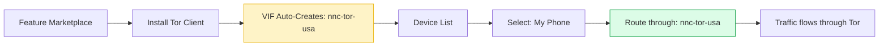
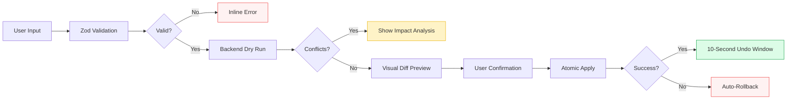
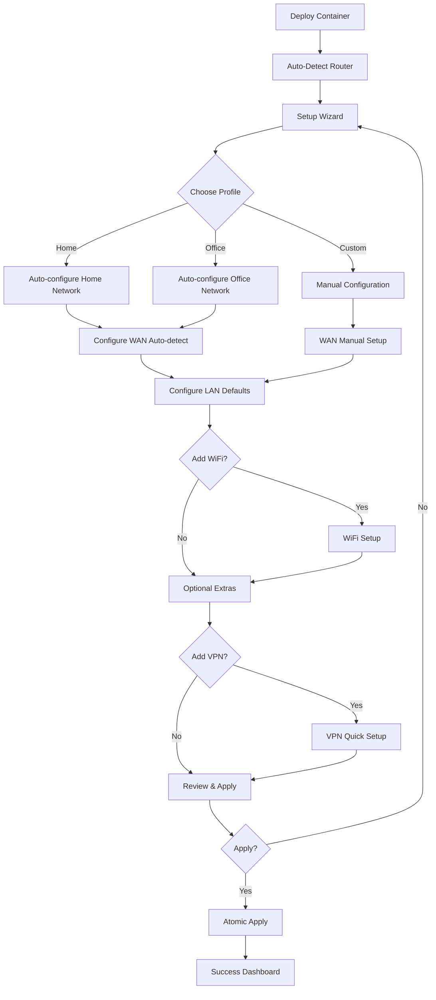
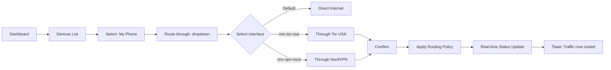
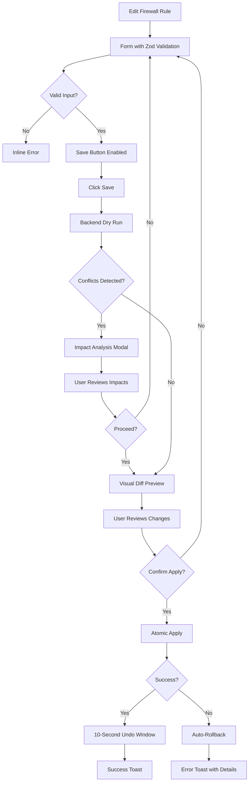

# 2. Core User Experience

**Last Updated:** January 20, 2026  
**Version:** 2.0  
**Aligned with:** Product Brief v4.0, PRD v1.1

---

## 2.1 User Personas

NasNetConnect serves a diverse user spectrum spanning from senior network engineers to phone-only novices. The platform addresses this diversity through three distinct interaction personas, each with Easy and Advanced sub-modes.

### 1. Wizard Mode
**Target:** First-time users, non-technical users, quick setup scenarios.

| Aspect | Easy Mode | Advanced Mode |
|--------|-----------|---------------|
| **Goal** | Get connected quickly with minimal decisions | Full control over initial configuration |
| **Flow** | Choose profile → Auto-configure → Done | Step-by-step wizard with all options exposed |
| **Decisions** | 3-5 high-level choices | 15-20 detailed configuration options |
| **Guidance** | Heavy hand-holding, templates, presets | Contextual help, full field explanations |
| **Typical Task** | "Set up my home network" | "Configure dual-WAN with failover and VPN" |

### 2. Dashboard Mode
**Target:** Day-to-day administrators, monitoring-focused users.

| Aspect | Easy Mode | Advanced Mode |
|--------|-----------|---------------|
| **Goal** | Quick status check and common actions | Deep monitoring and detailed management |
| **View** | Summary cards, health indicators | Detailed tables, graphs, live data |
| **Actions** | One-click operations, quick toggles | Full CRUD on all resources |
| **Information** | Essential metrics only | Complete telemetry and logs |
| **Typical Task** | "Is everything working?" | "Why is latency high on VPN tunnel #3?" |

### 3. Power Mode
**Target:** Network engineers, automation builders, CLI-lovers.

| Aspect | Easy Mode | Advanced Mode |
|--------|-----------|---------------|
| **Goal** | Efficient keyboard-driven workflows | Full RouterOS access through NNC |
| **Interface** | Command palette, shortcuts, TUI | Direct command execution, scripting |
| **Data** | Structured resource views | Raw RouterOS output, export formats |
| **Automation** | Template application, bulk actions | Script editor, API access |
| **Typical Task** | "Update firewall rules on 5 routers" | "Debug routing table with torch output" |

### User Spectrum Visualization

```
Senior Network Engineer ←───────────────────────────────→ Phone-Only Novice
       │                                                           │
       │  Power Mode (Advanced) - TUI, Scripts, Raw RouterOS      │
       │     ↓                                                     │
       │  Power Mode (Easy) - Command Palette, Keyboard Shortcuts │
       │     ↓                                                     │
       │  Dashboard Mode (Advanced) - Full CRUD, Data Tables      │
       │     ↓                                                     │
       │  Dashboard Mode (Easy) - Summary Cards, Quick Actions    │
       │     ↓                                                     │
       │  Wizard Mode (Advanced) - Full Configuration Options     │
       │     ↓                                                     │
       └──────────────────────── Wizard Mode (Easy) ──────────────┘
```

---

## 2.2 Defining Experience: Adaptive Complexity

The core experience is defined by **Adaptive Complexity**: the interface expands to meet the user's expertise level, rather than forcing a single view on everyone.

### For Different User Types

**For the Novice (Wizard Easy Mode):**
- Feels like a consumer app (Eero, Google Wifi, UniFi)
- Simple, friendly, reassuring
- "I don't need to understand networking, just make it work"
- Heavy hand-holding with templates and presets
- **Primary device:** Mobile phone
- **Key emotion:** "I feel safe trying this"

**For the Capable Non-Expert (Dashboard Easy Mode):**
- Small business owners, home power users
- Has goals (VPN, Guest WiFi) but fears breaking the network
- "I want to do it myself, but I need guard rails"
- One-click actions with visual feedback
- **Primary device:** Tablet or desktop web browser
- **Key emotion:** "I did that myself!"

**For the Efficient Pro (Dashboard Advanced Mode):**
- Sysadmins managing multiple routers
- Wants mobile-friendly, faster workflow than WinBox
- "Give me density and speed, skip the hand-holding"
- Data tables, batch operations, keyboard shortcuts
- **Primary device:** Desktop + mobile for monitoring
- **Key emotion:** "This saves me 15 minutes per router"

**For the Network Engineer (Power Mode):**
- Feels like a modern IDE (VS Code, Linear)
- Dense, efficient, keyboard-driven
- "I want the power of CLI with the clarity of GUI"
- Terminal UI (TUI) for SSH access, command palette (Cmd+K)
- **Primary device:** Desktop + SSH terminal
- **Key emotion:** "This is a serious tool, not a toy"

---

## 2.3 Novel UX Patterns

### Pattern 1: Virtual Interface Factory (VIF)

**The Innovation:** Transform network services into native-feeling router interfaces.

Instead of manually configuring VLANs, firewall rules, and routing tables for each service (Tor, VPN, MTProxy), the user simply:
1. Installs a service (e.g., "Tor Client" or "MTProxy")
2. A router interface (`nnc-tor` or `nnc-mtproxy`) automatically appears
3. Assigns devices to route through that interface with a single click

**UX Flow:**


**UI Components:**
- `VirtualInterfaceBridge` - Visual mapping of service to VLAN interface
- `DeviceRoutingSelector` - Dropdown: "Route through..." with virtual interfaces
- `ServiceInstanceCard` - Show service status + generated interface name
- `PolicyRoutingDiagram` - Visual flow: Device → VIF → Service → Internet

**User Impact:**
- **Before:** 30+ minutes to manually configure policy routing per device
- **After:** 3 clicks, 10 seconds
- **Confidence:** "I can't break the network, it's just changing a dropdown"

---

### Pattern 2: Intent-Based Configuration

Instead of asking *how* to configure a setting (e.g., "Set MSS clamping to 1400"), we ask *what* the user wants to achieve (e.g., "Fix unstable VPN connection").

**Implementation:**

**Wizard Recipes:**
- "Set up home network" → Auto-configures WAN (DHCP), LAN (192.168.1.0/24), WiFi
- "Enable Guest WiFi" → Creates VLAN, isolated network, DHCP, firewall rules
- "Add VPN for streaming" → Installs provider, creates tunnel, sets up split routing

**Troubleshooting Wizards:**
- "Internet is slow" → Runs diagnostics: bandwidth test, DNS latency, WAN health
- "Can't access device" → Tests: ping, firewall rules blocking, DHCP lease status
- "VPN won't connect" → Checks: credentials, firewall, MTU, routing table

**UI Components:**
- `IntentWizard` - Guided flow translating goals to RouterOS commands
- `DiagnosticRunner` - Automated troubleshooting with step-by-step results
- `RecipeSelector` - Browse common configurations as templates

**User Impact:**
- Users describe **problems**, not **solutions**
- System translates intent into correct technical configuration
- "I don't need to know what MSS clamping is"

---

### Pattern 3: Invisible Safety Pipeline

**Core Promise:** Every configuration change is validated, previewed, and reversible.

Complex or dangerous operations are wrapped in a multi-stage safety layer that prevents network outages.



**Five-Stage Pipeline:**

1. **Pre-flight (Zod Validation)**
   - Instant client-side validation
   - Field-level error messages
   - Prevents invalid inputs from reaching server

2. **Simulation (Dry Run)**
   - Backend checks for conflicts (IP collisions, rule overlaps)
   - Validates against actual router state
   - Returns impact analysis

3. **Impact Analysis**
   - Shows affected resources: "This will restart WAN link" (Red), "This will reload firewall" (Amber)
   - Lists dependencies: "VPN tunnel depends on this interface"
   - User acknowledges risks

4. **Visual Diff Preview**
   - **Text Diff:** Line-by-line changes (for advanced users)
   - **Visual Diagram:** Network topology before/after (for non-experts)
   - **Hybrid:** Change list + affected resources visualization

5. **Confirmation & Execution**
   - Atomic transaction (all-or-nothing)
   - **Watchdog timer:** Auto-rollback if router becomes unreachable
   - **10-second undo window:** "Undo" button after successful apply
   - Success toast: "Configuration applied successfully"

**UI Components:**
- `SafetyPipelineStepper` - Visual progress through 5 stages
- `ImpactAnalysisCard` - Lists affected resources with severity icons
- `ConfigDiffViewer` - Text diff + visual diagram toggle
- `UndoFloatingButton` - 10-second countdown button after apply
- `RollbackDialog` - Manual rollback to previous configurations

**User Impact:**
- **Zero fear:** "I can't accidentally break my network"
- **Transparency:** "I see exactly what will change before it happens"
- **Reversibility:** "If something goes wrong, I can undo it instantly"

---

### Pattern 4: Progressive Disclosure

**Principle:** Start simple by default, reveal complexity on demand.

**Implementation Tiers:**

| Tier | Visibility | Who Sees It | Example |
|------|-----------|-------------|---------|
| **Essential** | Always visible | Everyone | VPN status: Connected/Disconnected |
| **Common** | Click "Show more" | Most users | Bandwidth usage, IP address |
| **Advanced** | Toggle "Advanced mode" | Power users | MTU, MSS clamping, DSCP marking |
| **Expert** | "Raw config" link | Network engineers | RouterOS script export |

**UI Patterns:**
- **Accordion sections:** Collapsed by default, expand for details
- **"Advanced" toggle:** Global or per-form toggle to show expert fields
- **Inline "Why?"** links: Opens tooltip or modal with explanation
- **"See raw config"** button: Shows RouterOS script equivalent

**Example: VPN Configuration Form**

```
[Essential - Always Visible]
✓ VPN Name: My Home VPN
✓ Provider: NordVPN (preset)
✓ Server: Auto-select fastest

[Show more ▼]
  [Common - Click to reveal]
  → Protocol: WireGuard
  → Bandwidth limit: Unlimited
  → DNS: Use VPN provider DNS

  [Advanced ⚙️]
    [Expert - Toggle to show]
    → MTU: 1420
    → Persistent keepalive: 25s
    → Allowed IPs: 0.0.0.0/0

  [See raw config →]
```

**User Impact:**
- Beginners: See 3 fields, make 3 choices, done
- Intermediates: See 6 fields, still manageable
- Experts: See 15+ fields, full control
- Same component, adaptive complexity

---

### Pattern 5: Hybrid Real-Time Updates

**Strategy:** Live updates for critical data, polling for non-critical.

**Event-Driven (WebSocket Subscriptions):**
- Router connection status (critical)
- VPN tunnel state changes (critical)
- Interface up/down events (critical)
- Feature crash notifications (critical)
- Firewall rule hit counters (high-frequency)

**Polling (TanStack Query with smart intervals):**
- System metrics (CPU, RAM) - every 10s
- DHCP leases - every 30s
- Configuration history - on-demand
- Feature marketplace catalog - hourly

**Offline Graceful Degradation:**
- **Status:** Show last-known state with "Stale data" badge
- **Actions:** Disable mutations, show "Offline" toast
- **Queue:** Store attempted changes, apply on reconnect
- **UX:** Read-only mode, clear visual indicator

**UI Components:**
- `ConnectionStatusIndicator` - Live dot (green/amber/red) with tooltip
- `StaleDataBadge` - "Updated 2 minutes ago" with refresh button
- `OfflineBar` - Top banner: "You're offline. Viewing cached data."
- `MutationQueue` - Shows queued changes pending reconnection

**User Impact:**
- **Performance:** No unnecessary polling hammering router
- **Responsiveness:** Critical events update instantly
- **Reliability:** System works even when connection is flaky

---

## 2.4 Core Experience Principles

### 1. Visual Personality: Professional yet Approachable

**Goal:** Users should feel this is a serious, trustworthy tool while never feeling intimidated.

**Design Language:**
- **Clean minimalism:** Generous whitespace, clear hierarchy, no visual clutter
- **Purposeful color:** Status colors are meaningful and consistent
  - Green = Healthy, Active, Success
  - Amber/Yellow = Warning, Degraded
  - Red = Error, Offline, Danger
  - Blue = Informational, In Progress
  - Purple = Monitoring/Observability category
- **Subtle depth:** Light shadows and borders define card boundaries, no heavy skeuomorphism
- **Consistent iconography:** Lucide icons throughout, custom SVGs only for unique concepts
- **Typography:** 
  - Inter for UI text (clean, modern, highly legible)
  - JetBrains Mono for technical data (IPs, MACs, code, logs)

**Visual Hierarchy:**
1. **Status first:** Current state of critical systems always visible without scrolling
2. **Actions second:** Clear calls-to-action for common tasks
3. **Details on demand:** Complexity revealed progressively, not upfront

**Emotional Tone:**
- **Empowered:** "I did that myself."
- **Safe:** "It's okay to try this, I can undo it."
- **Professional:** "This is a serious tool, not a toy."

---

### 2. Key Interactions

**Quick Actions Pattern:**
- Common tasks (reboot, backup, check status) accessible in 1-2 clicks
- **Mobile:** Floating action button (FAB) for primary action per screen
- **Desktop:** Prominent buttons in page header
- **Keyboard:** Shortcuts for power users (`Cmd/Ctrl+K` for command palette)

**Status-at-a-Glance:**
- Dashboard cards showing health of each subsystem (VPN, Firewall, WiFi)
- Color-coded indicators visible without reading text
- **Live pulse animation** on status badges for real-time data
- No manual refresh needed (WebSocket subscriptions)

**Progressive Disclosure:**
- **Basic mode** shows essential options only (3-5 fields)
- **"Advanced" toggle** reveals power-user options (15-20 fields)
- **"Expert mode"** available for full RouterOS access (raw config)
- Forms adapt to user's selected complexity level

**Contextual Help:**
- **Inline tooltips:** Hover/tap on `(?)` icon for field explanation
- **"Learn more" links:** Opens documentation in side panel (no navigation away)
- **Example configurations:** "Try preset: Home Network" buttons
- **Troubleshooting hints:** "Internet slow? Run diagnostics →"

**Error Prevention & Recovery:**
- **Validation before applying:** Zod schema validation + backend dry-run
- **Preview of changes:** Visual diff view showing what will happen
- **One-click rollback:** "Undo" button for 10 seconds after apply
- **Clear error messages:** "WAN interface down" with remediation: "Check cable connection"

---

### 3. Adaptive Layouts

**Platform-Specific UI Paradigms** (not just responsive scaling):

**Mobile (<640px):**
- **Bottom tab navigation** (Home, VPN, Monitor, Settings) - thumb-friendly zone
- **Single column** layouts, no horizontal scrolling
- **Card-based UI** with tap to expand details
- **Swipe gestures:** Swipe left on card for actions menu
- **Pull-to-refresh** for data updates
- **Floating action button (FAB)** for primary action per screen
- **Simplified views:** Essential metrics only, "Show details" to expand
- **Touch targets:** Minimum 44×44px (WCAG AAA)

**Tablet (640-1024px):**
- **Collapsible sidebar** (toggle to maximize workspace)
- **Two-column layouts** where appropriate (list + details)
- **Master-detail pattern:** Tap item in list, details slide in from right
- **Optimized touch targets** while preserving information density
- **Landscape and portrait** orientations supported
- **Hybrid navigation:** Top bar + optional sidebar

**Desktop (>1024px):**
- **Persistent sidebar navigation** with categories
- **Multi-column layouts** with detail panels
- **Keyboard shortcuts** for power users (documented with `?` key)
- **Drag-and-drop** for reordering (firewall rules, routing priorities)
- **Context menus** with right-click
- **Hover states** with additional information (tooltips, previews)
- **Dense data tables** with sorting, filtering, virtualization
- **Command palette** (`Cmd+K`) for global navigation

---

### 4. Safety-First Interactions

**Dangerous Operations Protection:**

**Multi-Step Gates for High-Risk Actions:**
1. **Acknowledge:** Red warning banner with list of impacts
2. **Review:** Show affected resources (e.g., "This will disconnect WAN")
3. **Confirm:** Type confirmation phrase or slide-to-confirm (mobile)
4. **Countdown:** 3-second delay before execution (cancel button)
5. **Execute:** Atomic transaction with watchdog timer

**Visual Indicators:**
- **Red buttons:** Destructive actions (Delete, Reset, Force Reboot)
- **Amber buttons:** Risky actions (Restart Service, Apply Untested Config)
- **Safety Gate modal:** Full-screen overlay for dangerous confirmations
- **Impact badge:** Shows affected devices/services count

**Examples:**
- **Delete VPN:** Red button → "Are you sure?" modal → Type VPN name → Confirm
- **Reset router:** Red button → Impact analysis (all connections lost) → Acknowledge → Countdown (3s) → Confirm
- **Apply firewall rules:** Preview diff → Show affected traffic → Confirm → 10s undo window

---

### 5. Confidence-Building Patterns

**Always Show Current State:**
- **Status badges:** Online/Offline, Connected/Disconnected, Healthy/Degraded
- **Metric displays:** Bandwidth, uptime, connected clients (real-time)
- **Visual indicators:** Green checkmarks, red X's, amber warnings
- **Timestamp:** "Last updated: 2 seconds ago" for non-live data

**Transparent Feedback:**
- **Loading states:** Skeleton loaders (not blank screens or spinners)
- **Progress indicators:** "Applying configuration... 3 of 5 steps"
- **Success confirmations:** "VPN connected successfully" toast with green checkmark
- **Partial success:** "4 rules applied, 1 skipped (conflict)" with details

**Undo Capability:**
- **10-second undo window** after any configuration change
- **Floating undo button** with countdown timer
- **Configuration history:** "Time Travel" slider to view/restore previous states
- **Rollback to snapshot:** One-click restore to known-good configuration

**Help is Always Available:**
- **Contextual tooltips:** On every form field
- **Documentation links:** Embedded in panels (no navigation away)
- **Diagnostic tools:** Built-in ping, traceroute, DNS lookup
- **Troubleshooting wizards:** "Why is my internet slow?" automated diagnostics

---

## 2.5 Critical User Flows

### Flow 1: First-Time Setup (Wizard Mode Easy)

**Goal:** Transform a factory-reset router into a fully functional network in 5 minutes.



**UI Screens:**
1. **Welcome:** "Let's set up your network in 5 minutes"
2. **Profile selector:** Cards for Home/Office/Custom with descriptions
3. **WAN setup:** Auto-detect or manual (DHCP/Static/PPPoE)
4. **LAN setup:** Default 192.168.1.0/24 or custom subnet
5. **WiFi setup:** SSID, password, channel (with recommendations)
6. **Extras:** VPN, Guest WiFi, AdBlocking (quick toggles)
7. **Review:** Summary of all settings with "Edit" links
8. **Apply:** Progress indicator with "Applying..." states
9. **Success:** "Your network is ready!" with next steps

---

### Flow 2: Per-Device Routing via Virtual Interface Factory

**Goal:** Route specific device through Tor/VPN with 3 clicks, no manual configuration.



**UI Flow:**
1. **Devices list:** Shows all connected devices with current routing
2. **Select device:** Tap/click on device card
3. **Routing dropdown:** "Route through..." with available virtual interfaces
   - Default (Direct Internet)
   - nnc-tor-usa (Tor - USA Exit)
   - nnc-tor-de (Tor - Germany Exit)
   - nnc-vpn-nordvpn (NordVPN)
   - nnc-mtproxy (Telegram Proxy)
4. **Confirmation:** "Route 'iPhone 14' through Tor USA?"
5. **Apply:** Instant (no wizard, no multi-step)
6. **Feedback:** 
   - Real-time status update on device card
   - Toast: "iPhone 14 is now routing through Tor USA"
   - Visual indicator: Badge on device showing active VIF

---

### Flow 3: Emergency Recovery via Terminal UI (TUI)

**Goal:** When web UI is inaccessible, SSH into container and use text-based interface to recover.

```
SSH to container (port 2222) → TUI launches automatically

┌─ NasNetConnect Terminal UI ─────────────────────────────┐
│                                                           │
│  Router Status:  ● Online  (192.168.88.1)                │
│  Container:      ● Running (192.168.88.100)              │
│  Web UI:         ✗ Unreachable (Port 3000 down)          │
│                                                           │
│  [1] View System Status                                  │
│  [2] Restart Services                                    │
│  [3] Rollback Configuration                              │
│  [4] View Logs (Live)                                    │
│  [5] Network Diagnostics                                 │
│  [6] Emergency Recovery                                  │
│  [Q] Quit                                                │
│                                                           │
│  Selection: _                                            │
└───────────────────────────────────────────────────────────┘

Navigate: Arrow keys | Select: Enter | Quit: Q
```

**Features:**
- Arrow key navigation (no mouse needed)
- Live log streaming in TUI
- One-key rollback to last-known-good config
- Network diagnostics (ping, traceroute) in terminal
- Service restart (web, GraphQL, WebSocket)

---

### Flow 4: Configuration Change with Safety Pipeline

**Goal:** Change firewall rule with full safety pipeline preventing network breakage.



**UI Stages:**
1. **Form editing:** Real-time Zod validation with inline errors
2. **Save attempt:** Backend dry-run checks for conflicts
3. **Impact analysis** (if conflicts): 
   - "This rule will affect 12 existing connections"
   - "3 devices may lose internet access"
   - Acknowledge checkbox required
4. **Visual diff:**
   - Text view: Line-by-line changes
   - Diagram view: Visual firewall chain with highlighted change
5. **Final confirmation:** "Apply changes?" with Apply/Cancel
6. **Progress:** "Applying firewall rules... 3 of 5"
7. **Success:**
   - Toast: "Firewall rules updated successfully"
   - Floating undo button: "Undo (10s)" with countdown
8. **If error:**
   - Auto-rollback to previous state
   - Toast: "Update failed: [reason]. Configuration restored."

---

## 2.6 Emotional Design

**Target Emotions:**

| User Type | Current Feeling (Before NNC) | Target Feeling (After NNC) |
|-----------|------------------------------|---------------------------|
| **Novice** | Overwhelmed, scared | Empowered, confident |
| **Prosumer** | Frustrated, impatient | Productive, in control |
| **Expert** | Annoyed by slow tools | Efficient, professional |

**Design Techniques:**

**To Build Confidence:**
- Always show current state (no mystery)
- Undo button for every action
- "This is safe to try" messaging
- Success celebrations (green checkmarks, confetti micro-animations)

**To Enable Speed:**
- One-click common actions
- Keyboard shortcuts everywhere
- Command palette for instant navigation
- Bulk operations for repetitive tasks

**To Maintain Trust:**
- Transparent about what will change
- Never hide errors or failures
- Clear explanations for technical terms
- "Learn more" always available

**To Reduce Cognitive Load:**
- Progressive disclosure (simple by default)
- Consistent patterns across all features
- Predictable navigation
- Visual hierarchy (most important info first)
