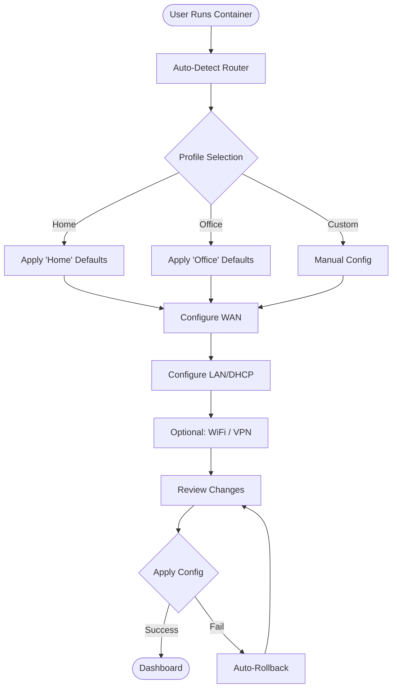
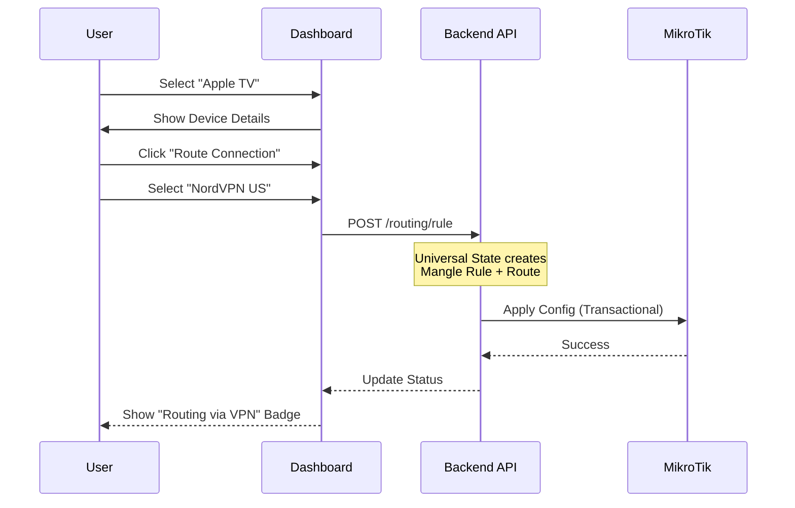
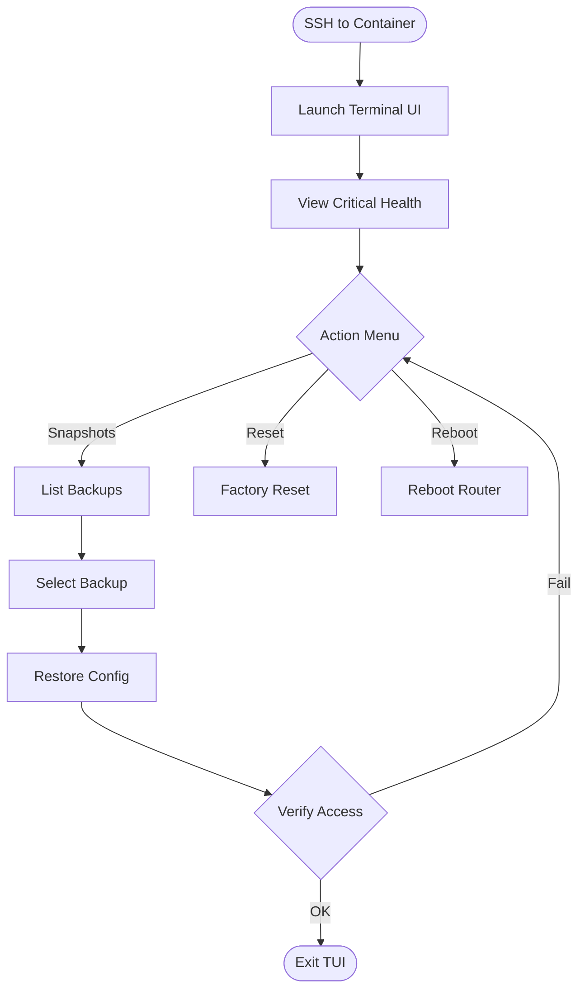
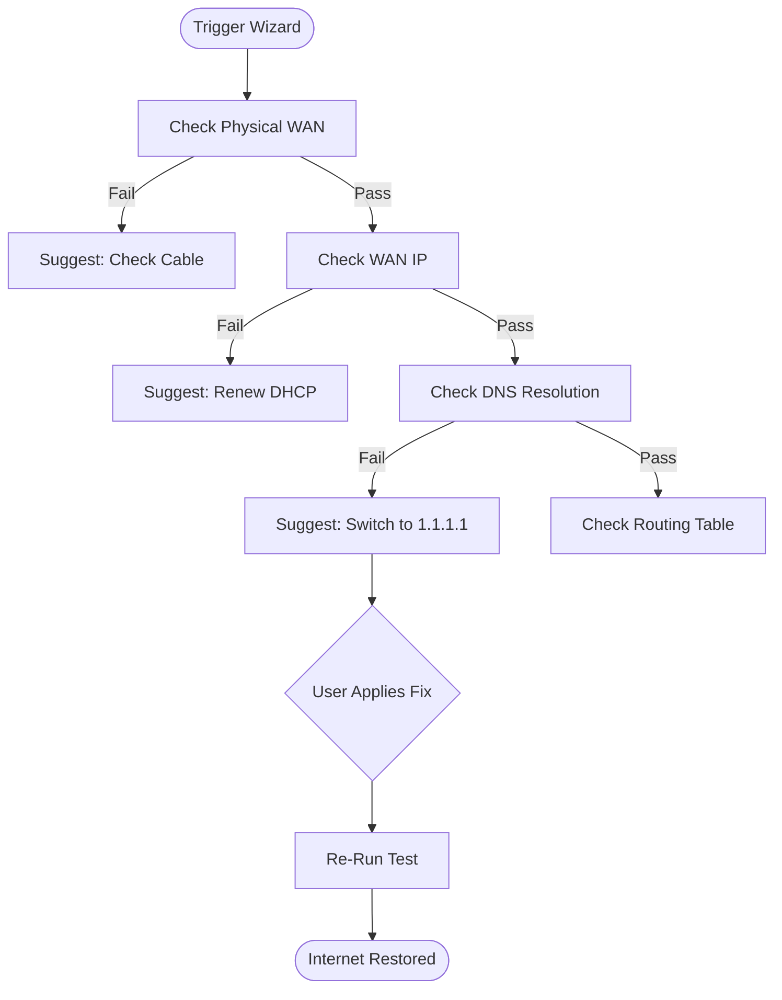
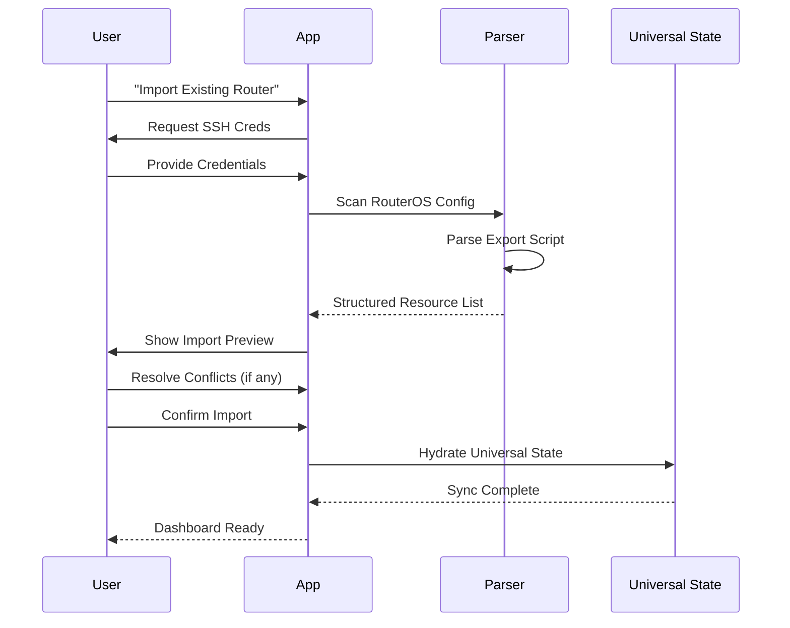

# 5. User Journey Flows

## 5.1 Critical User Paths

### Journey 1: First-Time Setup (Wizard)

**Goal:** Transform a factory-reset router into a secure, connected gateway in under 5 minutes.

1.  **Deployment:** User runs Docker container.
2.  **Auto-Detect:** App detects router on default IP (192.168.88.1).
3.  **Wizard Start:** User selects "Setup New Router".
4.  **Profile Selection:** "Home", "Small Office", or "Custom".
5.  **WAN Config:** Auto-detect (DHCP/PPPoE) or manual entry.
6.  **LAN Config:** Set IP range and DHCP server.
7.  **Extras:** Optional WiFi SSID setup or VPN Client.
8.  **Review:** Summary of changes.
9.  **Apply:** Animation of config application.
10. **Success:** Redirect to Dashboard.

### Journey 2: Per-Device Routing (VIF)

**Goal:** Route a specific device (e.g., Apple TV) through a VPN without affecting others.

1.  **Start:** Dashboard → "Devices" List.
2.  **Select:** Find "Living Room Apple TV" and click details.
3.  **Action:** Click "Route Connection".
4.  **Choice:** Select "NordVPN US" from dropdown (uses Virtual Interface Factory).
5.  **Confirm:** "Route 'Apple TV' through 'NordVPN US'?".
6.  **Feedback:** Status indicator updates to "Routing via VPN".
7.  **Result:** Device now uses VPN tunnel.

### Journey 3: Emergency Recovery (TUI)

**Goal:** Restore access when web UI is unreachable or misconfigured.

1.  **Access:** SSH into the NasNetConnect container.
2.  **Launch:** TUI (Terminal UI) launches automatically.
3.  **Status:** View "Critical Health" dashboard in ASCII.
4.  **Action:** Navigate to "Snapshots" using arrow keys.
5.  **Select:** Choose "Pre-Change Backup (10 mins ago)".
6.  **Restore:** Select "Restore Configuration".
7.  **Success:** Router reboots/reconfigures, Web UI becomes accessible.

### Journey 4: Multi-Router Management

**Goal:** Update firewall rules across 3 different locations.

1.  **Context:** Select "All Routers" in top bar.
2.  **Navigate:** Go to Security → Firewall.
3.  **Filter:** Filter by "Input Chain".
4.  **Edit:** Click "Add Rule".
5.  **Define:** Allow port 443 from specific IP.
6.  **Scope:** Check boxes for "Home", "Office", "Cabin".
7.  **Apply:** Click "Deploy to 3 Routers".
8.  **Progress:** View status bars for each router (Success/Fail).

### Journey 5: Troubleshooting Wizard

**Goal:** Diagnose and fix "No Internet" issue without technical knowledge.

1.  **Trigger:** User sees "Offline" badge or clicks "Help, Internet is down".
2.  **Wizard:** Launches "Connectivity Troubleshooter".
3.  **Step 1 (WAN):** Checks physical link. "Cable connected ✓".
4.  **Step 2 (IP):** Checks IP assignment. "WAN IP received ✓".
5.  **Step 3 (DNS):** Checks resolution. "DNS Lookup Failed ❌".
6.  **Diagnosis:** "Your DNS server is unreachable."
7.  **Fix:** "Switch to Cloudflare DNS (1.1.1.1)?"
8.  **Apply:** User clicks "Apply Fix".
9.  **Verify:** Wizard re-runs test. "Internet Restored ✓".

### Journey 6: VPN Provider Preset Setup

**Goal:** Setup NordVPN in 30 seconds (vs 30 mins manually).

1.  **Start:** Go to VPN → Add Client → "NordVPN".
2.  **Auth:** Enter username/password (saved securely).
3.  **Fetch:** App fetches server list from NordVPN API.
4.  **Select:** User filters by "USA" -> "Fastest".
5.  **Config:** App auto-generates WireGuard keys and Interface config.
6.  **Connect:** Click "Save & Connect".
7.  **Result:** VPN Interface created, routing rules applied, connection established.

### Journey 7: Import Existing Router

**Goal:** Onboard a router that is already configured (not factory reset).

1.  **Start:** "Add Router" → "Existing Device".
2.  **Connect:** Provide SSH credentials/API access.
3.  **Scan:** App scans current RouterOS config (Firewall, Interfaces, IPs).
4.  **Preview:** Shows "Import Preview":
    *   3 Interfaces found
    *   15 Firewall rules found
    *   1 DHCP Server found
5.  **Conflict:** "Warning: Ether1 has a custom script attached."
6.  **Resolve:** "Keep script" or "Overwrite".
7.  **Import:** App maps RouterOS config to NasNet Universal State.
8.  **Done:** Router appears in Dashboard, fully managed.

### Journey 8: Time Travel Restore

**Goal:** Revert a bad configuration change made 10 minutes ago.

1.  **Trigger:** User realizes network is unstable after recent changes.
2.  **Navigate:** Settings → History (or "Time Travel").
3.  **Timeline:** User scrolls back to "10:15 AM - Applied Firewall Rules".
4.  **Select:** Clicks on the event.
5.  **Preview:** App shows the configuration state *as it was* at 10:15 AM.
6.  **Diff:** User clicks "Compare with Now". Shows removed rules.
7.  **Restore:** Click "Restore this State".
8.  **Safety:** "This will restart the firewall. Confirm?" -> Confirm.
9.  **Result:** Router configuration reverts to 10:15 AM state.

### Journey 9: Failed Update & Rollback

**Goal:** User attempts to update NasNetConnect, but it fails. System recovers automatically.

1.  **Trigger:** User clicks "Update to v2.6.0".
2.  **Progress:** "Downloading..." -> "Migration..." -> "Swapping...".
3.  **Validation:** Watchdog timer starts (60s). App attempts to ping backend.
4.  **Failure:** Backend fails to start due to DB corruption. Ping fails.
5.  **Timeout:** 60s Watchdog expires.
6.  **Auto-Rollback:** System reverts binary swap and restores DB backup.
7.  **Restart:** Old version (v2.5.0) restarts.
8.  **Feedback:** Dashboard loads with banner: "Update failed. System recovered to v2.5.0. No data lost."

## 5.2 Secondary User Paths

*   **VPN Server Setup:** Wizard to enable WireGuard server for remote access.
*   **Guest WiFi:** One-click enable Guest Network with isolation.
*   **Log Investigation:** Search logs for "failed login" and ban IP.
*   **Backup Schedule:** Configure nightly backups to cloud.

## 5.3 Edge Cases & Error States

*   **Offline Mode:** Dashboard shows "Last updated: 5m ago" (cached). Actions disabled.
*   **Config Conflict:** "Router OS version mismatch" warning during feature install.
*   **Partial Failure:** "2 of 3 routers updated. 'Cabin' failed (Timeout)." -> Retry option.
