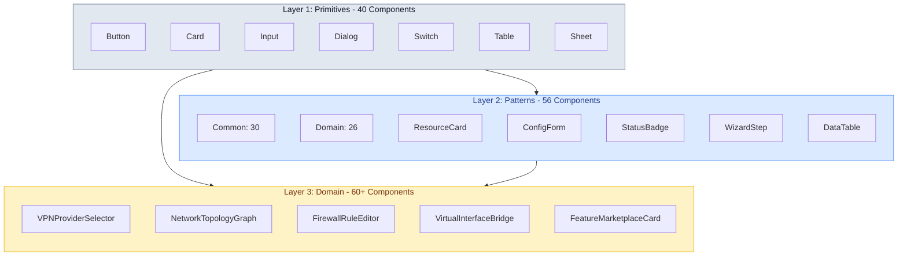
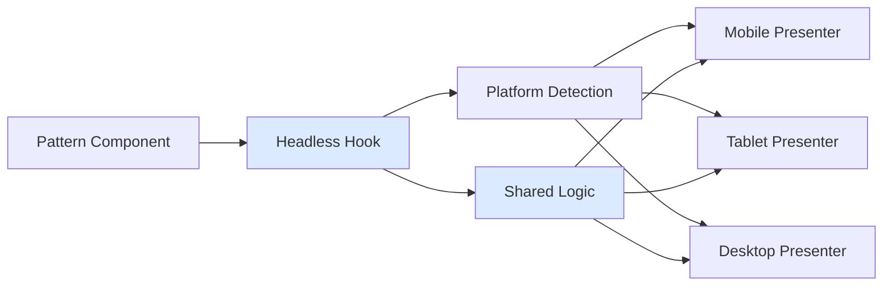

# 6. Component Library

**Last Updated:** January 20, 2026  
**Version:** 2.0  
**Total Components:** ~150 (40 Primitives + 56 Patterns + 60+ Domain)

---

## 6.1 Three-Layer Architecture

**Philosophy:** Strict hierarchical organization ensuring consistency, scalability, and maintainability across 120+ features and 14 categories.



---

## 6.2 Layer 1: Primitives (~40 Components)

**Location:** `libs/ui/primitives`  
**Source:** shadcn/ui + Radix UI (code-owned, customized for NasNetConnect)  
**Purpose:** Accessible, styled base components that are domain-agnostic

### Complete Primitive Catalog

**Forms & Inputs (9 components):**
1. `Button` - Primary, secondary, danger variants with loading states
2. `Input` - Text input with validation states
3. `Select` - Dropdown selection with search
4. `Checkbox` - Multi-select options
5. `Switch` - Toggle on/off states
6. `RadioGroup` - Single-select options
7. `Slider` - Range selection
8. `Form` - Form container with context
9. `Label` - Accessible field labels

**Display & Feedback (6 components):**
1. `Card` - Content container with header/footer slots
2. `Badge` - Status pills and tags
3. `Alert` - Contextual notifications
4. `Progress` - Linear progress bars
5. `Skeleton` - Loading placeholders
6. `Avatar` - User/device images with fallback

**Overlay & Dialogs (6 components):**
1. `Dialog` - Modal dialogs
2. `Sheet` - Side drawer (mobile bottom sheet)
3. `Popover` - Floating content
4. `Tooltip` - Hover/focus hints
5. `HoverCard` - Rich hover previews
6. `ContextMenu` - Right-click menus

**Navigation (7 components):**
1. `Tabs` - Content switching
2. `Menubar` - Top-level menu
3. `DropdownMenu` - Contextual actions
4. `NavigationMenu` - Primary navigation
5. `Breadcrumb` - Location hierarchy
6. `Pagination` - Page navigation
7. `Command` - Command palette (Cmd+K)

**Layout (6 components):**
1. `Separator` - Dividers
2. `ScrollArea` - Custom scrollbars
3. `AspectRatio` - Responsive containers
4. `Resizable` - Draggable panels
5. `Accordion` - Collapsible sections
6. `Collapsible` - Show/hide content

**Data Display (6 components):**
1. `Table` - Data tables (headless, TanStack Table)
2. `Calendar` - Date picker
3. `DataTable` - Full-featured table with sorting, filtering
4. `Combobox` - Searchable select
5. `DatePicker` - Date selection
6. `TimePicker` - Time selection

**All primitives include:**
- WCAG AAA accessibility (7:1 contrast, keyboard nav)
- Dark/light theme support via design tokens
- Platform-responsive sizing
- Consistent styling via Tailwind + CSS variables

---

## 6.3 Layer 2: UX Patterns (56 Components)

**Location:** `libs/ui/patterns`  
**Source:** Custom-built, consuming Layer 1 primitives  
**Architecture:** **Headless + Platform Presenters**

### The Headless + Presenter Pattern

All 56 patterns follow this architecture:



**Benefits:**
- Write logic once (headless hook)
- Optimal UX per platform (3 presenters)
- Bundle efficiency (~33% reduction via lazy loading)
- Easy testing (test hook once, visual test presenters)

---

### Common Patterns (30 Components)

These patterns are used across all features, ensuring consistency.

#### **Forms (6 components)**

1. **`ResourceForm<T>`** - Generic CRUD form for any resource type
   - **Features:** 4 field modes (editable/readonly/hidden/computed), Zod validation, auto-save drafts
   - **Presenters:** Mobile (single column, bottom sheet), Desktop (two-column with sidebar preview)
   - **Props:** `resource: T`, `schema: ZodSchema`, `onSubmit`, `fieldModes`

2. **`WizardStep`** - Multi-step flow component with XState integration
   - **Features:** Progress indicator, back/next navigation, step validation, data persistence
   - **Presenters:** Mobile (full screen, bottom nav), Desktop (sidebar stepper, main content)
   - **Props:** `steps: Step[]`, `currentStep: number`, `onNext`, `onBack`, `onComplete`

3. **`FieldGroup`** - Grouped fields with label and optional help text
   - **Features:** Collapsible groups, conditional visibility, field dependencies
   - **Props:** `label`, `fields: Field[]`, `collapsible?`, `helpText?`

4. **`ConfigurationPreview`** - Before-apply diff viewer
   - **Features:** Text diff, visual diagram, hybrid toggle, impact analysis
   - **Presenters:** Mobile (tabs: text/visual), Desktop (side-by-side or overlay toggle)
   - **Props:** `oldConfig`, `newConfig`, `viewMode: 'text' | 'visual' | 'hybrid'`

5. **`BulkEditForm`** - Batch operations on multiple resources
   - **Features:** Multi-select, field override, preview changes, apply atomically
   - **Props:** `resources: T[]`, `fields: Field[]`, `onBatchSubmit`

6. **`ImportExportForm`** - Config import/export interface
   - **Features:** File upload, format selection (JSON/YAML/RouterOS), validation
   - **Props:** `format: 'json' | 'yaml' | 'rsc'`, `onImport`, `onExport`

---

#### **Displays (7 components)**

1. **`ResourceCard<T>`** - Standard container for network resources
   - **Features:** Status badge, primary action, context menu, expandable details
   - **Presenters:**
     - Mobile: Compact row, tap to expand, bottom sheet for actions
     - Tablet: Grid card with collapsible details
     - Desktop: Full card with exposed actions, inline editing
   - **Props:** `resource: T`, `actions: Action[]`, `expanded?`, `onToggle`

2. **`StatusBadge`** - Unified status pill with live pulse animation
   - **Variants:** Online (green), Offline (red), Warning (amber), Info (blue), Loading (spinner)
   - **Features:** Real-time pulse for live data, tooltip with details
   - **Props:** `status: Status`, `showLabel?`, `live?`, `size: 'sm' | 'md' | 'lg'`

3. **`MetricDisplay`** - Bandwidth, CPU, uptime metrics
   - **Features:** Real-time updates, trend indicator (↑↓), sparkline chart, threshold alerts
   - **Props:** `metric: Metric`, `value: number`, `trend?`, `threshold?`

4. **`InfoPanel`** - Read-only information display
   - **Features:** Key-value pairs, collapsible sections, copyable values
   - **Props:** `data: Record<string, any>`, `collapsible?`, `copyable?`

5. **`ConnectionIndicator`** - Real-time connection status dot
   - **Features:** Pulsing animation for active, tooltip with latency, click to ping
   - **Props:** `status: 'online' | 'offline' | 'degraded'`, `latency?`, `onPing?`

6. **`HealthScore`** - 0-100 health visualization
   - **Features:** Radial gauge, color-coded thresholds, trend over time
   - **Props:** `score: number`, `history?: number[]`, `thresholds: { warning: 70, error: 40 }`

7. **`DependencyGraph`** - Visual dependency relationships
   - **Features:** Interactive nodes, expand/collapse, highlight paths
   - **Props:** `resources: Resource[]`, `edges: Edge[]`, `onNodeClick`

---

#### **Data (6 components)**

1. **`DataTable<T>`** - Full-featured data table
   - **Features:** TanStack Table (headless), sorting, filtering, pagination, virtualization (>20 rows)
   - **Presenters:** Mobile (cards), Desktop (table with fixed headers)
   - **Props:** `data: T[]`, `columns: Column[]`, `onRowClick?`, `virtualizeRows?`

2. **`Chart`** - Traffic graphs, metrics visualization
   - **Libraries:** Recharts (default), uPlot (high-performance alternative)
   - **Types:** Line, Bar, Area, Pie
   - **Props:** `type: ChartType`, `data: ChartData`, `xAxis`, `yAxis`, `legend?`

3. **`LogViewer`** - Real-time log streaming
   - **Features:** Virtualized list, filtering, search, color-coded levels, auto-scroll
   - **Props:** `logs: Log[]`, `filters: Filter[]`, `autoScroll?`, `maxLines: 1000`

4. **`Timeline`** - Configuration history, event timeline
   - **Features:** Chronological events, filtering by type, click to view details
   - **Props:** `events: Event[]`, `onEventClick`, `filters?`

5. **`StatisticsPanel`** - Aggregated metrics dashboard
   - **Features:** Grid of metrics, sparklines, percentages, comparisons
   - **Props:** `metrics: Metric[]`, `layout: 'grid' | 'list'`

6. **`ComparisonView`** - Before/after, diff visualization
   - **Features:** Side-by-side or overlay toggle, highlighting changes
   - **Props:** `before: any`, `after: any`, `mode: 'side-by-side' | 'overlay'`

---

#### **Navigation (5 components)**

1. **`Sidebar`** - Desktop navigation with categories
   - **Features:** Collapsible, categorized links, badge counts, search
   - **Props:** `items: NavItem[]`, `collapsible?`, `activeItem: string`

2. **`TabBar`** - Mobile bottom navigation (4-5 primary items)
   - **Features:** Icon + label, badge counts, haptic feedback
   - **Props:** `items: TabItem[]`, `activeTab: string`, `onTabChange`

3. **`Breadcrumb`** - Location hierarchy
   - **Features:** Clickable path segments, overflow handling, home shortcut
   - **Props:** `path: BreadcrumbItem[]`, `onNavigate`

4. **`CommandPalette`** - Cmd+K global search and navigation
   - **Features:** Fuzzy search, keyboard navigation, recent commands, grouped results
   - **Library:** cmdk
   - **Props:** `commands: Command[]`, `onExecute`, `shortcuts?`

5. **`QuickActions`** - Contextual action menu
   - **Features:** Icon grid (mobile), dropdown list (desktop), keyboard shortcuts
   - **Props:** `actions: Action[]`, `variant: 'grid' | 'dropdown'`

---

#### **Feedback (6 components)**

1. **`Alert`** - Contextual notifications
   - **Variants:** Success, Warning, Error, Info
   - **Features:** Dismissible, action button, auto-dismiss timer
   - **Props:** `variant: AlertVariant`, `title`, `message`, `action?`, `duration?`

2. **`ConfirmDialog`** - Dangerous operation confirmation
   - **Features:** Red button, type-to-confirm, countdown delay, impact list
   - **Props:** `title`, `message`, `impacts?: string[]`, `requireText?`, `onConfirm`

3. **`ProgressTracker`** - Multi-step operation progress
   - **Features:** Stepper UI, current step highlight, ETA, cancel button
   - **Props:** `steps: Step[]`, `currentStep: number`, `eta?`, `onCancel?`

4. **`Toast`** - Ephemeral notifications (Sonner library)
   - **Variants:** Success, Error, Info, Loading
   - **Features:** Auto-dismiss, action button, stacking
   - **Usage:** `toast.success('VPN connected')`, `toast.error('Failed to save')`

5. **`LoadingSkeleton`** - Content placeholders
   - **Features:** Animated gradient, shape variants (text, card, table), page-specific
   - **Props:** `variant: 'text' | 'card' | 'table' | 'custom'`, `count: number`

6. **`EmptyState`** - No data placeholder with call-to-action
   - **Features:** Icon, title, message, primary action button
   - **Props:** `icon`, `title`, `message`, `action: { label, onClick }`

---

### Domain Patterns (26 Components)

Feature-specific patterns for the 14 categories.

#### **Networking Domain (10 components)**

1. **`VPNProviderSelector`** - 9 VPN provider presets with one-click setup
2. **`NetworkTopologyVisualization`** - Interactive network map with device positions
3. **`InterfaceStatusGrid`** - Multi-interface status dashboard
4. **`WANFailoverConfig`** - Multi-WAN orchestration UI with health checks
5. **`SubnetCalculator`** - CIDR calculator widget with IP range preview
6. **`DHCPLeaseTable`** - Active leases with device identification
7. **`TunnelConnectionFlow`** - GRE/IPIP tunnel setup wizard
8. **`VLANTaggingEditor`** - VLAN configuration with port assignment
9. **`WireGuardPeerManager`** - Peer list with QR code generation
10. **`BridgePortManager`** - Bridge member management with STP settings

---

#### **Security Domain (6 components)**

1. **`FirewallRuleEditor`** - Drag-drop rule ordering with validation
2. **`AddressListManager`** - IP list CRUD with file import/export
3. **`NATRuleBuilder`** - Port forwarding wizard with presets
4. **`SecurityProfileSelector`** - Preset security levels (Basic/Strict/Paranoid)
5. **`CertificateManager`** - Upload, Let's Encrypt, auto-renewal UI
6. **`AccessControlMatrix`** - Visual permission grid (users × resources)

---

#### **Monitoring Domain (6 components)**

1. **`TrafficChart`** - Real-time bandwidth graphs (Recharts/uPlot)
2. **`DiagnosticToolPanel`** - Ping, traceroute, DNS lookup tools
3. **`DeviceDiscoveryTable`** - Network scan results with vendor lookup
4. **`AlertRuleBuilder`** - Alert configuration with threshold UI
5. **`PerformanceMetricsGrid`** - CPU, RAM, connections dashboard
6. **`LogStreamViewer`** - Filtered real-time logs with color coding

---

#### **Feature Marketplace Domain (4 components)**

1. **`FeatureCard`** - Browse marketplace with ratings, screenshots
2. **`InstallWizard`** - Feature installation flow with dependency resolution
3. **`FeatureInstanceManager`** - Multi-instance control panel (start/stop/configure)
4. **`DependencyResolver`** - Visual dependency tree before install

---

## 6.4 Layer 3: Domain Components (60+ Components)

**Location:** `libs/features/*/components`  
**Source:** Feature modules  
**Purpose:** Business logic and feature-specific functionality

### Architecture

Domain components are compositions of Layer 2 patterns + feature-specific logic:

```tsx
// Example: VPN Connection Card (Domain Component)
export function VPNConnectionCard({ vpn }: { vpn: VPNClient }) {
  // Feature-specific logic
  const { mutate: connect } = useConnectVPN();
  const { data: bandwidth } = useVPNBandwidth(vpn.id);
  
  // Compose Layer 2 patterns
  return (
    <ResourceCard<VPNClient>
      resource={vpn}
      actions={[
        { label: 'Connect', onClick: () => connect(vpn.id) },
        { label: 'Edit', onClick: () => navigate(`/vpn/${vpn.id}/edit`) },
        { label: 'Delete', onClick: () => deleteVPN(vpn.id), variant: 'danger' },
      ]}
    >
      <MetricDisplay label="Upload" value={bandwidth?.upload} trend="up" />
      <MetricDisplay label="Download" value={bandwidth?.download} trend="down" />
      <StatusBadge status={vpn.status} live />
    </ResourceCard>
  );
}
```

### Examples by Category

**Network & Connectivity:**
- `VPNConnectionCard` - VPN-specific resource card
- `InterfaceList` - Table of network interfaces with sparklines
- `WifiClientTable` - Connected devices with signal strength
- `VirtualInterfaceBridge` - VIF mapping UI (Marketplace services → VLAN)
- `NetworkScanner` - Device discovery with progress

**Security:**
- `FirewallRuleRow` - Accordion row with inline editing
- `ImpactAnalysisCard` - Pre-flight check showing affected resources
- `CertificateStatusCard` - SSL cert expiry with auto-renew

**Monitoring:**
- `DiagnosticTools` - Ping/traceroute/DNS in tabbed interface
- `TrafficMonitor` - Real-time WAN/LAN bandwidth graph
- `ResourceGauge` - Radial gauge for CPU/RAM with thresholds
- `LiveLogStream` - Compact log viewer for dashboard

**System:**
- `DeploymentStatus` - 5-phase update lifecycle visualizer (Staging → Migration → Switch → Validation → Commit)
- `RouterCapabilityCard` - Hardware support matrix (checkmarks/X's)
- `TimeTravelSlider` - Configuration history scrubber

---

## 6.5 Component Development Standards

### File Structure

```
libs/ui/patterns/
├── common/
│   ├── resource-card/
│   │   ├── ResourceCard.tsx           # Main component
│   │   ├── useResourceCard.ts         # Headless hook (logic)
│   │   ├── ResourceCard.Mobile.tsx    # Mobile presenter
│   │   ├── ResourceCard.Tablet.tsx    # Tablet presenter
│   │   ├── ResourceCard.Desktop.tsx   # Desktop presenter
│   │   ├── ResourceCard.test.tsx      # Tests
│   │   ├── ResourceCard.stories.tsx   # Storybook stories
│   │   └── index.ts                   # Exports
│   └── ...
├── domain/
│   └── ...
└── index.ts
```

### Testing Requirements

**Five-Layer Testing Pyramid:**
1. **Unit tests (Vitest)** - Test headless hooks in isolation
2. **Component tests (RTL)** - Test presenters with mocked hooks
3. **Storybook Play Functions** - Interaction testing in Storybook
4. **Visual regression (Chromatic)** - Automated screenshot comparison
5. **E2E tests (Playwright)** - Critical user flows with axe-core

### Documentation Requirements

Each pattern component must include:
1. **Description** - What it does, when to use
2. **Props table** - All props with types and defaults
3. **Examples** - 3-5 usage examples in Storybook
4. **Platform notes** - How presenters differ
5. **Accessibility notes** - ARIA, keyboard nav, screen reader
6. **Related components** - Other patterns commonly used together

---

## 6.6 Storybook Organization

**Total Stories:** ~450 across all components

### Story Structure Per Component

Each of 56 pattern components has ~5-8 stories:

1. **Default** - Standard state
2. **Mobile/Tablet/Desktop** - Three platform presenters
3. **States** - Loading, Error, Success, Empty
4. **Interactions** - Play functions for interaction testing
5. **Variants** - Different props/configurations
6. **Edge Cases** - Overflow, Long text, Many items

### Custom Storybook Addons

1. **Theme Switcher** - Toggle light/dark in viewport
2. **Platform Presenter** - Force mobile/tablet/desktop view
3. **Design Tokens** - Inspect token values in real-time
4. **Resource Type Selector** - Test patterns with different resource types

---

## 6.7 Performance Optimization

### Pattern-Level Optimizations

**Automatic:**
- All pattern components are `React.memo()`
- Headless hooks use `useMemo` / `useCallback`
- Event handlers are stable references

**Lazy Loading:**
```tsx
// Heavy patterns lazy-loaded
const Chart = lazy(() => import('@patterns/data/Chart'));
const NetworkTopology = lazy(() => import('@patterns/networking/NetworkTopology'));
```

**Virtualization:**
```tsx
// Lists > 20 items use TanStack Virtual
<DataTable data={items} virtualizeRows={items.length > 20} />
```

**Bundle Strategy:**
- **Tier 1:** Core patterns (~200KB) - Always loaded
- **Tier 2:** Heavy patterns (~50-150KB) - Lazy loaded
- **Tier 3:** Domain bundles - Loaded with features
- **Tier 4:** Platform presenters - Device-specific

---

## 6.8 Migration & Versioning

**Stability-First Policy:** Never break component APIs

### Component Versioning

When architectural improvements are needed:
1. Keep V1 stable indefinitely
2. Add V2 as separate component
3. Both exported, features choose version
4. Gradual migration over 6 months

```tsx
// V1 (stable)
import { ResourceCard } from '@patterns/displays/resource-card';

// V2 (new architecture)
import { ResourceCardV2 } from '@patterns/displays/resource-card-v2';
```

**Benefits:**
- Zero disruption to existing features
- Improved APIs available immediately
- Migration is optional, not forced
