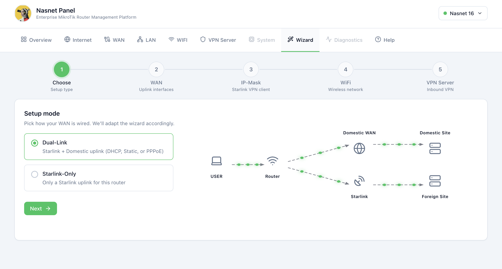
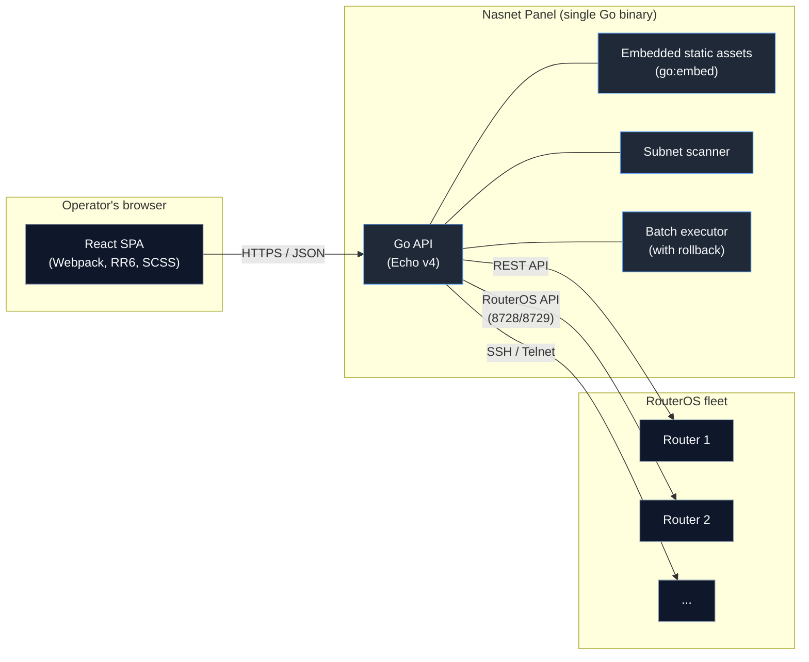

<div align="center">


# Nasnet Panel

**A modern web panel for managing MikroTik RouterOS devices.**
React SPA + Go API, shipped as a single small container that runs anywhere, including directly on the router itself.

[](https://github.com/nasnet-community/nasnet-panel/actions/workflows/pr-check.yml)
[](https://github.com/nasnet-community/nasnet-panel/actions/workflows/release.yml)
[](https://github.com/nasnet-community/nasnet-panel/releases)
[](LICENSE)
[](https://nodejs.org/)
[](https://golang.org/)
[](https://mikrotik.com/)
[](https://github.com/nasnet-community/nasnet-panel/pkgs/container/nasnet-panel)

[Features](#features) - [Architecture](#architecture) - [Install](#installation) - [Configuration](#configuration) - [Development](#development) - [Contributing](#contributing)

</div>

---

## Status

Active development, pre-1.0. Public APIs, configuration, and on-disk layout may change between releases. Pin to a tagged release in production.

## About

<div align="center">



</div>

Nasnet Panel (binary name `nasnet-panel`) is a self-hosted web UI for administering MikroTik RouterOS routers. It speaks to RouterOS over its REST API, native RouterOS API (8728/8729), SSH, and Telnet, with automatic protocol fallback. The frontend is a React SPA; the backend is a small Go service that proxies router calls, scans subnets for MikroTik devices, and orchestrates batch commands with optional rollback.

## Features

<table>
<tr>
<td width="50%">

### Real-time dashboard

Live system metrics, CPU and memory usage, traffic monitoring, and interface status at a glance.

### Network management

Interface configuration, ARP tables, IP addressing, routing, and DHCP server administration.

### VPN control center

IPsec, L2TP, PPTP, WireGuard, OpenVPN, and SSTP tunnels with peer and client monitoring.

### Wireless management

WiFi interface control, security profiles, connected client list, and signal monitoring.

</td>
<td width="50%">

### Firewall configuration

Filter, NAT, and mangle rules with a visual editor and live connection tracking.

### Router discovery

Subnet scanning to auto-detect MikroTik devices, with service identification on common ports.

### Batch operations

Bulk command execution with progress tracking, dry-run mode, and automatic rollback on failure.

### Multi-protocol support

REST API, RouterOS API (8728/8729), SSH, and Telnet with automatic fallback.

</td>
</tr>
</table>

## Architecture



The backend speaks multiple protocols to RouterOS and falls back automatically: REST API first, then native RouterOS API, then SSH/Telnet. The SPA is served by the same Go binary that exposes the JSON API, so there is only one process to run and one port to expose.

## Installation

Three supported paths, in order of expected use.

### 1. Docker (recommended)

The release CI publishes a multi-arch image to GitHub Container Registry on every tag.

```bash
docker run -d \
  --name nasnet \
  -p 8080:80 \
  --restart unless-stopped \
  ghcr.io/nasnet-community/nasnet-panel:latest
```

Open `http://localhost:8080`.

For host networking (so the container can reach routers on your LAN directly):

```bash
docker run -d --name nasnet --network=host --restart unless-stopped \
  ghcr.io/nasnet-community/nasnet-panel:latest
```

#### docker compose

```yaml
services:
  nasnet:
    image: ghcr.io/nasnet-community/nasnet-panel:latest
    container_name: nasnet
    network_mode: host
    environment:
      PORT: 80
    restart: unless-stopped
```

Supported platforms: `linux/amd64`, `linux/arm64`, `linux/arm/v7`. Image is built on busybox+musl with a UPX-compressed Go binary, optimised to stay small enough to run inside a RouterOS container. A `/health` endpoint backs the built-in `HEALTHCHECK`.

### 2. MikroTik RouterOS via `scripts/install.sh`

`scripts/install.sh` deploys Nasnet Panel inside a RouterOS v7 container end-to-end: checks, networking, image upload, container start, and health verification.

**Prerequisites**

- RouterOS v7.x with the `container` package installed and enabled.
- Container `device-mode` enabled (requires physical confirmation on first activation: reset button or cold reboot).
- External storage (the script defaults to `disk1/`).
- ≥ 30 MB free RAM on the router.
- Local tools: `bash`, `curl`, `ssh`, `scp`, `sha256sum` (or `shasum`).

**Run it**

```bash
# Interactive: prompts for router IP, user, password
bash scripts/install.sh

# Non-interactive: pass an env-style config
cat > router.env <<'EOF'
ROUTER_IP=192.168.88.1
ROUTER_USER=admin
ROUTER_PASS=secret
EOF
bash scripts/install.sh --config router.env

# Or via env var
SSHPASS=secret bash scripts/install.sh --config router.env
```

When it finishes, the panel is reachable at `http://<router-ip>:8080` (or whatever `--lan-port` you passed).

**Flags**

| Flag                 | Purpose                                                            |
| -------------------- | ------------------------------------------------------------------ |
| `--dry-run`          | Print every action the script would take, change nothing.          |
| `--uninstall`        | Remove the container, networking, NAT rules, and uploaded tarball. |
| `--config <file>`    | Env-style file with `ROUTER_IP=`, `ROUTER_USER=`, `ROUTER_PASS=`.  |
| `--version <tag>`    | Release tag to install (default `snapshot`).                       |
| `--image-tar <path>` | Use a local tar instead of downloading a release asset.            |
| `--lan-port <port>`  | LAN-facing port for the dst-nat rule (default `8080`).             |
| `--no-rollback`      | Do not undo partial state on failure (useful for debugging).       |
| `-v`, `--verbose`    | Verbose output.                                                    |
| `-h`, `--help`       | Show usage.                                                        |

**What the installer does, step by step**

1. Probes Winbox (8291) and SSH (22) on the router; collects credentials.
2. Checks RouterOS version, architecture (`arm` / `arm64` / `x86_64`), free RAM, `container` package, and `device-mode container`.
3. Downloads the prebuilt container tar for the detected arch (`amd64` / `arm64` / `armv7`) from the rolling `snapshot` release (or the tag passed to `--version`) and verifies its checksum.
4. Configures container networking: `veth-nasnet-panel` at `192.168.50.2/24`, `containers` bridge at `192.168.50.1/24`, `srcnat` masquerade for `192.168.50.0/24`, and `dstnat` from `--lan-port` to the veth.
5. SCPs the tarball to `disk1/`, adds the container with `start-on-boot=yes`, and starts it.
6. Polls `http://<router>:<lan-port>/health` for up to 120 s; dumps container logs on failure.

To remove everything: `bash scripts/install.sh --uninstall --config router.env`.

**Prefer to install by hand?**

See [`scripts/INSTALL.md`](scripts/INSTALL.md) for the full installation guide. It walks through both the automated script and a manual route via Winbox or the RouterOS terminal, reproducing every networking, firewall, and container command the installer runs.

### 3. From source (development)

```bash
git clone https://github.com/nasnet-community/nasnet-panel.git
cd nasnet-panel
npm install
npm run dev:all
```

Frontend: `http://localhost:3000`. Backend: `http://localhost:8080`. The dev server proxies API calls to the backend automatically.

Requires Node.js 20+ and Go 1.26+.

## Configuration

The backend reads its configuration from environment variables. See `backend/.env.example`.

| Variable      | Default                        | Purpose                                                                                                                |
| ------------- | ------------------------------ | ---------------------------------------------------------------------------------------------------------------------- |
| `PORT`        | `8080` (dev), `80` (container) | TCP port the API and embedded SPA listen on.                                                                           |
| `HOST`        | `0.0.0.0`                      | Bind address.                                                                                                          |
| `ENVIRONMENT` | `development`                  | `production` disables dev-only routes (notably Swagger UI).                                                            |
| `BACKEND_URL` | _empty_                        | Build-time. Empty means the SPA uses relative URLs to its own origin (the common case for the embedded build).         |
| `SENTRY_DSN`  | Nasnet project DSN             | Build-time. Where the panel UI sends crash reports. Set to an empty string to build with error reporting compiled out. |

## Error reporting

When the panel UI hits an unhandled error, it sends a crash report so we can find and fix bugs
that users never report. This is on by default and can be turned off at any time from the
Diagnostics page, per browser.

Three things worth being precise about:

- Reporting only runs in production builds, meaning the released container image. `npm run dev`
  builds in development mode and the SDK is never initialised, so local development never sends
  anything.
- The report is sent by your browser, not by the router. The MikroTik itself never connects to
  Sentry.
- A report contains the error, a stack trace, the app version, and your browser and OS name.
  The SDK is configured to drop everything else: no router address, no credentials, no
  configuration, no request or response bodies, no console output, no user identity. As a last
  line of defence, every string in the report is scanned for IPv4 and IPv6 addresses and they are
  replaced with `[ip]` before the report leaves the browser.

If you build a production bundle and want no reporting at all, build with `SENTRY_DSN=""` and the
SDK is never initialised.

## Development

### npm scripts

| Script                         | What it does                                   |
| ------------------------------ | ---------------------------------------------- |
| `npm run dev`                  | Frontend only (Webpack Dev Server, port 3000). |
| `npm run dev:backend`          | Backend only (`air` hot-reload, port 8080).    |
| `npm run dev:all`              | Both, with shared interrupt handling.          |
| `npm run build`                | Production frontend bundle to `frontend/dist`. |
| `npm run build:backend`        | `go build` to `backend/bin/api`.               |
| `npm run typecheck`            | `tsc -b`.                                      |
| `npm run lint` / `lint:fix`    | ESLint over `.ts` / `.tsx`.                    |
| `npm run format`               | Prettier write.                                |
| `npm run format:check`         | Prettier check (CI uses this).                 |
| `npm run e2e`                  | Playwright, headless.                          |
| `npm run e2e:headed`           | Playwright, headed.                            |
| `npm run e2e:install-browsers` | First-time Playwright browser install.         |

## Building from source

```bash
# Frontend bundle (output: frontend/dist/)
npm run build

# Backend binary with embedded SPA (output: backend/bin/api)
npm run build:backend

# Multi-arch container image
docker buildx build \
  --platform=linux/amd64,linux/arm64,linux/arm/v7 \
  -t nasnet-panel:local .
```

## Releases

Tagged releases are cut from `main`. Each release publishes:

- Multi-arch container images at `ghcr.io/nasnet-community/nasnet-panel:<tag>` and `:latest`.
- Per-architecture tarballs `nasnet-panel-<version>-<arch>.tar` plus matching `.sha256`, consumed by `scripts/install.sh`.

See the [Releases page](https://github.com/nasnet-community/nasnet-panel/releases).

## Contributing

Contributions are welcome. See [CONTRIBUTING.md](CONTRIBUTING.md) for setup, branch and PR conventions, and what reviewers look for.

## Security

If you find a vulnerability, please **do not** open a public issue. See [SECURITY.md](SECURITY.md) for the private reporting process.

## Code of conduct

By participating in this project you agree to abide by the [Code of Conduct](CODE_OF_CONDUCT.md).

## Changelog

Notable changes are tracked in [CHANGELOG.md](CHANGELOG.md), following the Keep a Changelog format.

## License

MIT. See [LICENSE](LICENSE).

---

<div align="center">

Built for the MikroTik community. Issues, ideas, and PRs welcome on [GitHub](https://github.com/nasnet-community/nasnet-panel).

</div>
