# Alert System

## Overview

The alert system evaluates domain events against user-defined rules and delivers notifications through multiple channels. It is built around a stateless evaluation loop: every event published on the event bus is matched against cached alert rules, filtered through suppression layers, and routed to notification channels with retry logic and dead-letter queuing.

Key design principles:

- **Rule evaluation is in-memory** — rules are cached on startup and refreshed on rule change events, avoiding database reads per event.
- **Three suppression layers** — storm detection (global rate limit), per-rule throttle windows, and quiet hours (time-of-day blocking) work independently and compose.
- **Channels are pluggable** — the `notifications.Channel` interface is the only contract; adding a channel requires implementing `Name()`, `Send()`, and `Test()`.
- **Digest vs. immediate delivery** — channels opt-in to digest mode; quiet hours silently queue notifications and flush them as grouped digests when quiet hours end.
- **Best-effort retry** — failed deliveries retry three times with exponential backoff; exhausted deliveries go to a dead-letter queue rather than being silently dropped.
- **Service alert bridge** — a separate bridge component listens to service lifecycle events and synthesises alert notifications using the same pipeline, with per-instance rate limiting and auto-provisioned default rules.

---

## Architecture


---

## Package Reference

### `internal/alerts` — Engine and Evaluation

#### Key Types

**`Engine`** (`engine.go`)

```go
type Engine struct {
    db               *ent.Client
    eventBus         events.EventBus
    throttleManager  *ThrottleManager
    quietHours       *QuietHoursFilter
    stormDetector    *StormDetector
    escalationEngine *EscalationEngine
    digestService    *DigestService
    alertQueue       *AlertQueue
    digestTicker     *time.Ticker
    log              *zap.SugaredLogger

    rulesCache   map[string]*ent.AlertRule  // keyed by rule.ID
    rulesCacheMu sync.RWMutex

    suppressionCounts  map[string]int    // rule ID → suppressed count
    suppressionReasons map[string]string // rule ID → last reason
    suppressionMu      sync.Mutex
}
```

**`EngineConfig`** (`engine.go`)

```go
type EngineConfig struct {
    DB               *ent.Client
    EventBus         events.EventBus
    Dispatcher       *notifications.Dispatcher
    EscalationEngine *EscalationEngine
    DigestService    *DigestService
    Logger           *zap.SugaredLogger
}
```

#### Key Functions

| Function | File | Description |
|---|---|---|
| `NewEngine(cfg EngineConfig) *Engine` | `engine.go` | Creates engine; builds escalation engine from dispatcher if not injected |
| `Engine.Start(ctx) error` | `engine.go` | Loads rule cache, subscribes to all events and rule-change events, starts throttle summary worker (5 min) and digest delivery worker (1 min) |
| `Engine.HandleEvent(ctx, Event) error` | `engine.go` | Entry point: storm check → rule lookup → per-rule `evaluateRule` |
| `Engine.Stop(ctx) error` | `engine.go` | Stops digest ticker, throttle manager, escalation engine |
| `Engine.getMatchingRules(eventType) []*ent.AlertRule` | `engine.go` | Read-locked scan of rules cache filtering by `rule.EventType` |
| `Engine.refreshRulesCache(ctx) error` | `engine.go` | Queries `alertrule.Enabled(true)`, replaces cache atomically |
| `Engine.handleRuleChange(ctx, Event) error` | `engine.go` | Subscribed to `alert.rule.{created,updated,deleted}`; calls `refreshRulesCache` |
| `Engine.trackSuppression(ruleID, reason)` | `engine.go` | Increments suppression counter under mutex |
| `Engine.getAndResetSuppression(ruleID) (count, reason)` | `engine.go` | Atomically reads and clears suppression state |
| `evaluateRule(ctx, rule, eventType, eventData, startTime)` | `engine_evaluate.go` | Condition parsing → throttle → quiet hours → `createAlert` |
| `createAlert(ctx, rule, eventType, eventData)` | `engine_evaluate.go` | Persists `AlertLog`, tracks with escalation engine, publishes `alert.created` event, dispatches notification |
| `handleQuietHoursCheck(ctx, rule, notification) bool` | `engine_evaluate.go` | Returns true (alert suppressed) if inside a quiet hours window |
| `queueForDigest(deviceID, alert)` | `engine_evaluate.go` | Enqueues into `AlertQueue` for batch delivery |
| `publishAlertEvent(ctx, alert)` | `engine_evaluate.go` | Publishes `alert.created` typed event on event bus |
| `runDigestDelivery(ctx)` | `engine_evaluate.go` | Background goroutine: ticks every 1 minute, calls `deliverQueuedAlerts` |
| `deliverQueuedAlerts(ctx)` | `engine_evaluate.go` | Drains `AlertQueue.DequeueAll()`, formats digest, dispatches via Dispatcher |
| `FormatDigest(alerts []QueuedAlert) string` | `engine_evaluate.go` | Groups by severity (CRITICAL → ERROR → WARNING → INFO), counts by event type, includes timestamp range |

#### Condition Evaluation

Rules carry a JSON condition blob that is evaluated against the event payload:

```go
// Simplified from evaluateRule
type Condition struct {
    Field    string      `json:"field"`
    Operator string      `json:"operator"` // "eq", "ne", "gt", "lt", "contains", "exists"
    Value    interface{} `json:"value"`
}
```

Evaluation iterates all conditions with AND semantics. A rule fires when all conditions are satisfied or when the rule has no conditions (unconditional match).

---

### `internal/alerts/throttle` — Rate Limiting and Quiet Hours Queuing

#### `alert_queue.go`

**`AlertQueue`** — thread-safe per-device alert grouping for digest delivery.

```go
type QueuedAlert struct {
    DeviceID  string
    RuleID    string
    EventType string
    Severity  string
    Message   string
    QueuedAt  time.Time
}

type AlertQueue struct {
    mu     sync.Mutex
    alerts map[string][]QueuedAlert // keyed by deviceID
}
```

| Function | Description |
|---|---|
| `NewAlertQueue() *AlertQueue` | Creates empty queue |
| `Enqueue(alert QueuedAlert)` | Appends to device bucket under mutex |
| `DequeueAll() map[string][]QueuedAlert` | Atomically drains and returns all queued alerts, resets internal map |
| `Count() int` | Total alerts across all devices |
| `Clear()` | Drops all queued alerts |
| `GetByDevice(deviceID) []QueuedAlert` | Read copy for a single device |
| `FormatDigest(deviceID) string` | Formats per-device digest as human-readable summary |

#### `quiet_hours_queue.go`

**`QuietHoursQueueManager`** — per-channel queues with TTL and background delivery.

```go
type QueuedNotification struct {
    Notification notifications.Notification
    QueuedAt     time.Time
}

type channelQueue struct {
    mu            sync.Mutex
    notifications []QueuedNotification
    maxSize       int           // 100
    ttl           time.Duration // 24 hours
}

type DeliveryCallback func(channelName string, notifications []QueuedNotification) error

type QuietHoursQueueManager struct {
    queues   map[string]*channelQueue  // keyed by channel name
    callback DeliveryCallback
    ticker   *time.Ticker             // 1-minute interval
    // ...
}
```

| Function | Description |
|---|---|
| `NewQuietHoursQueueManager(channels []string, callback DeliveryCallback) *QuietHoursQueueManager` | Creates per-channel queues, starts 1-minute background worker |
| `ShouldQueue(channelName string, quietHoursActive bool) bool` | Returns true when quiet hours are active and channel exists |
| `Enqueue(channelName string, notification Notification) error` | Appends to channel queue; returns error if full (max 100) |
| `processQueues(ctx)` | Background tick handler: purges expired notifications (TTL 24h), delivers queued notifications to channels whose quiet hours have ended |
| `FlushAll(ctx) error` | Forces delivery of all queued notifications regardless of quiet hours state; used on shutdown |

The manager does **not** evaluate quiet hours itself — the caller (`handleQuietHoursCheck`) determines whether quiet hours are active. The manager's background worker re-evaluates on each tick by calling `ShouldQueue` and delivering when it returns false.

---

### `internal/notifications` — Dispatcher and Channel Interface

#### `dispatcher.go`

**`Dispatcher`** — routes notifications to channels with retry and dead-letter queuing.

```go
type Dispatcher struct {
    channels       map[string]Channel
    digestService  *DigestService
    templateService TemplateService
    maxRetries     int           // 3
    initialBackoff time.Duration // 1 second
    deadLetterQueue []FailedDelivery
    dlqMu          sync.Mutex
}

type FailedDelivery struct {
    ChannelName  string
    Notification Notification
    LastError    error
    AttemptedAt  time.Time
    Attempts     int
}
```

| Function | Description |
|---|---|
| `NewDispatcher(channels []Channel, digestService *DigestService, templateService TemplateService) *Dispatcher` | Registers channels by name |
| `Dispatch(ctx, notification Notification) error` | Splits channels into immediate vs. digest; queues digests with `QuietHoursQueueManager`, sends immediate via `dispatchToChannel` |
| `TestChannel(ctx, channelName string, config map[string]interface{}) error` | Calls `channel.Test(ctx, config)` |
| `GetChannel(name string) (Channel, bool)` | Returns channel by name |
| `GetDeadLetterQueue() []FailedDelivery` | Returns snapshot of failed deliveries |

**`Channel` interface:**

```go
type Channel interface {
    Name() string
    Send(ctx context.Context, notification Notification) error
    Test(ctx context.Context, config map[string]interface{}) error
}
```

**`Notification` struct:**

```go
type Notification struct {
    Title    string
    Message  string
    Severity string                 // "CRITICAL", "WARNING", "INFO"
    Data     map[string]interface{} // arbitrary metadata for channel formatting
}
```

#### `dispatcher_routing.go`

| Function | Description |
|---|---|
| `dispatchToChannel(ctx, channel Channel, notification Notification) error` | Renders template then calls `deliverWithRetries` |
| `renderAlertTemplate(notification Notification) (Notification, error)` | Applies template service if `notification.Data["template_id"]` is set |
| `resolveAlert(ctx, alertID string) (*ent.AlertLog, error)` | Looks up alert from DB for enrichment |
| `deliverWithRetries(ctx, channel Channel, notification Notification) error` | Retry loop: attempts up to `maxRetries+1` times; backoff doubles each attempt starting from `initialBackoff` (1s → 2s → 4s); on exhaustion appends to dead-letter queue |
| `isRetryable(err error) bool` | Returns true for network errors, timeouts, and errors containing "temporary:"; returns false for invalid-config errors and "unauthorized" |
| `HandleAlertCreated(ctx, Event) error` | Event bus subscriber for `alert.created`; extracts alert ID, resolves alert, dispatches notification |

**Retry and backoff:**

```
Attempt 1  (immediate)
Attempt 2  (after 1s)
Attempt 3  (after 2s)
Attempt 4  (after 4s)
→ Dead Letter Queue
```

---

### `internal/notifications/channels/push` — Push Channels

#### `ntfy.go` — Ntfy Channel

**`NtfyChannel`** delivers notifications to a self-hosted or public ntfy server.

```go
type NtfyConfig struct {
    ServerURL string `json:"server_url"` // Must be HTTPS
    Topic     string `json:"topic"`
    Token     string `json:"token"`      // Optional bearer token
}
```

Security properties:
- Rejects non-HTTPS URLs at config parse time.
- Resolves server hostname and blocks private IP ranges (SSRF protection via `isPrivateIP`).

Priority mapping:

| Severity | ntfy Priority |
|---|---|
| `CRITICAL` | 5 (urgent) |
| `WARNING` | 4 (high) |
| default | 3 (default) |

Tags: `CRITICAL` → `["rotating_light"]`, `WARNING` → `["warning"]`, `INFO` → `["information_source"]`.

Key functions: `NewNtfyChannel`, `Send`, `Test`, `ParseNtfyConfig`, `isPrivateIP`.

#### `telegram.go` — Telegram Channel

**`TelegramChannel`** delivers to one or more Telegram chats via the Bot API.

```go
type TelegramConfig struct {
    BotToken string   `json:"bot_token"`
    ChatID   string   `json:"chat_id"`   // Deprecated: use ChatIDs
    ChatIDs  []string `json:"chat_ids"`  // Supports multiple targets
}
```

Delivery uses `errgroup` for parallel sends to all chat IDs. Partial success (some chats succeeded, some failed) returns a combined error while still recording the success count.

Message format:
- `MarkdownV2` parse mode with full character escaping (`markdownV2Replacer` covers all 19 special characters).
- Severity emoji prefix: CRITICAL = 🔴, WARNING = 🟠, INFO = 🟢, default = 🔔.
- Optional router name, event type, and triggered-at fields from `notification.Data`.
- Inline keyboard "View in NasNet" button constructed from `base_url` + `alert_id` in `notification.Data`.

Rate limiting: returns a `temporary:` prefixed error on HTTP 429 with `retry_after` seconds from Telegram's response; this makes the error retryable by `isRetryable`.

Key functions: `NewTelegramChannel`, `Send`, `sendMessageToChat`, `Test`, `formatMessage`, `escapeMarkdownV2`, `buildInlineKeyboard`, `ParseTelegramConfig`.

#### `pushover.go` — Pushover Channel

**`PushoverChannel`** delivers to Pushover users or groups.

```go
type PushoverConfig struct {
    UserKey  string `json:"user_key"`
    APIToken string `json:"api_token"`
}
```

Priority mapping:

| Severity | Pushover Priority | Behaviour |
|---|---|---|
| `CRITICAL` | 2 (emergency) | Requires acknowledgement; sends receipt token |
| `WARNING` | 1 (high) | Bypasses quiet hours on device |
| default | 0 (normal) | Standard delivery |

Emergency priority (CRITICAL) returns a receipt token stored in the response. This receipt can be cancelled via `CancelReceipt(ctx, receiptToken string) error` if the alert is acknowledged.

Usage tracking: Pushover API returns `X-Limit-App-Limit`, `X-Limit-App-Remaining`, `X-Limit-App-Reset` headers; these are extracted and available for monitoring.

`ValidateCredentials(ctx) error` sends a validation request without sending a message.

Key functions: `NewPushoverChannel`, `Send`, `Test`, `CancelReceipt`, `ValidateCredentials`, `ParsePushoverConfig`.

#### `inapp.go` — In-App Channel

**`InAppChannel`** delivers notifications through the event bus to GraphQL subscriptions.

```go
type InAppChannel struct {
    eventBus events.EventBus
}
```

`Send` creates an `AlertNotificationEvent` via `notifications.NewAlertNotificationEvent` and publishes it to the event bus. GraphQL subscription resolvers listen for this event type and push it to connected WebSocket clients.

This channel has no configuration fields and always succeeds unless the event bus is nil.

---

### `internal/notifications/channels/http` — HTTP Channels

#### `email.go` — Email Channel (SMTP)

**`EmailChannel`** delivers formatted HTML + plaintext multipart emails via SMTP.

```go
type EmailConfig struct {
    SMTPHost    string   `json:"smtp_host"`
    SMTPPort    int      `json:"smtp_port"`
    Username    string   `json:"username"`
    Password    string   `json:"password"`
    FromAddress string   `json:"from_address"`
    FromName    string   `json:"from_name"`
    UseTLS      bool     `json:"use_tls"`     // SMTPS (port 465)
    SkipVerify  bool     `json:"skip_verify"` // Skip TLS certificate verification
    ToAddresses []string `json:"to_addresses"`
}
```

Message construction:
1. `buildTemplateData` extracts device name, device IP, event type, rule name, severity, suggested actions, and alert ID from `notification.Data`.
2. `buildMultipartMessage` constructs a `multipart/alternative` MIME message with `text/plain` and `text/html` parts rendered from Go templates in the embedded `alerts` package (`email/default-body.txt` and `email/default-body.html`).
3. Custom headers: `X-NasNet-Alert-ID`, `X-NasNet-Severity`.
4. Subject format: `[NasNet Alert - <SEVERITY>] <Title>`.

TLS options:
- `UseTLS=false`: uses `smtp.SendMail` (STARTTLS if available).
- `UseTLS=true`: establishes a TLS connection via `tls.Dialer` before SMTP handshake (SMTPS/port 465).

Key functions: `NewEmailChannel`, `Send`, `buildTemplateData`, `buildMultipartMessage`, `renderTemplate`, `sendSMTP`, `sendWithTLS`, `Test`, `ParseEmailConfig`.

#### `webhook.go` — Webhook Channel

**`WebhookChannel`** delivers JSON payloads to an HTTPS endpoint with HMAC-SHA256 request signing.

```go
type WebhookConfig struct {
    URL       string `json:"url"`        // Must be HTTPS
    Secret    string `json:"secret"`     // HMAC-SHA256 signing secret
    Method    string `json:"method"`     // Default: POST
    Headers   map[string]string `json:"headers"` // Custom headers
}
```

Security properties:
- Rejects non-HTTPS URLs.
- Resolves URL hostname and blocks private IP ranges (same `isPrivateIP` helper as ntfy).
- Signs request body with HMAC-SHA256: `X-NasNet-Signature: sha256=<hex>`.

Slack-aware payload: if `notification.Data["slack_compatible"]` is true, `SendDigest` constructs a Slack Block Kit payload instead of the default JSON structure.

`ValidateWebhookURL(url string) error` performs hostname resolution and SSRF check without sending a request.

Key functions: `NewWebhookChannel`, `Send`, `SendDigest`, `ValidateWebhookURL`, `Test`, `ParseWebhookConfig`.

---

### `internal/alerts/bridge` — Service Alert Bridge

**`Bridge`** (`bridge.go`) connects the service orchestrator event stream to the alert notification pipeline.

```go
type Bridge struct {
    dispatcher     *notifications.Dispatcher
    eventBus       events.EventBus
    db             *ent.Client
    manifestCache  map[string]ManifestInfo  // service name → display info
    rateLimiter    map[string]*instanceBucket // instanceID → rate limit state
    rateLimiterMu  sync.Mutex
    quietHoursQueue *QuietHoursQueueManager
    log            *zap.SugaredLogger
}
```

**Subscribed event types:**

| Event Type | Severity | Default Behaviour |
|---|---|---|
| `service.started` | INFO | Notify |
| `service.stopped` | INFO | Notify |
| `service.failed` | CRITICAL | Notify |
| `service.updated` | INFO | Notify |
| `service.crashed` | CRITICAL | Notify |
| `service.error` | WARNING | Notify |
| `service.traffic.quota_exceeded` | WARNING | Notify |
| `service.killswitch_activated` | CRITICAL | Notify |
| `service.update.available` | INFO | Notify |
| `service.update.installed` | INFO | Notify |

**Rate limiting:** Each service instance gets a bucket of 100 events per 5-minute sliding window. Events exceeding the rate are silently dropped with a log warning. This prevents a crash-looping service from flooding notification channels.

**Event processing pipeline:**

```mermaid
graph TD
    A["service.* event"]
    A --> B["Extract instanceID, serviceType<br/>from event payload"]
    B --> C["Rate limit check<br/>per instanceID, 100/5min"]
    C --> C1["exceeded → drop + warn"]
    C --> C2["enrichEvent<br/>add service display name<br/>category from manifest cache"]
    C2 --> D["Quiet hours check"]
    D --> D1["in quiet hours<br/>→ queueNotification<br/>24h TTL + return"]
    D --> D2["Dispatcher.Dispatch"]
```



**`createDefaultRulesIfNeeded(ctx, serviceType string) error`** — called on `service.started`. Checks if any alert rules exist for the service. If none, creates 8 default rules:
1. Service started (INFO)
2. Service stopped (INFO)
3. Service failed (CRITICAL)
4. Service crashed (CRITICAL)
5. Traffic quota exceeded (WARNING)
6. Kill switch activated (CRITICAL)
7. Update available (INFO)
8. Update installed (INFO)

Default rules are created with throttle windows to avoid notification storms during repeated restarts.

---

### `internal/services/svcalert` — Digest History Service

**`svcalert.Service`** (`service_digest.go`) provides digest management APIs exposed through GraphQL resolvers.

| Function | Description |
|---|---|
| `GetDigestQueueCount(ctx) (int, error)` | Returns count of alerts currently queued in `AlertQueue` |
| `GetDigestHistory(ctx, limit int) ([]DigestRecord, error)` | Queries DB for past digest deliveries; groups by `digestID`; formats period as "X minutes", "X hours", or "X days" |
| `TriggerDigestNow(ctx) error` | Forces immediate delivery of all queued alerts, bypassing the 1-minute ticker |

`DigestRecord`:

```go
type DigestRecord struct {
    DigestID    string
    AlertCount  int
    Period      string    // "15 minutes", "2 hours", "3 days"
    DeliveredAt time.Time
    Channels    []string
}
```

---

## Data Flow

### Event → Notification (Normal Path)

```mermaid
graph TD
    A["1. Domain event published to EventBus<br/>e.g., events.NewServiceEvent<br/>service.failed, serviceInstance"]
    A --> B["2. Engine.HandleEvent receives event<br/>a. StormDetector.RecordAlert<br/>→ false if global rate exceeded<br/>default: 100 events/min; 60s cooldown<br/>b. getMatchingRules eventType<br/>→ reads from in-memory cache"]

    B --> C["3. evaluateRule per matching rule<br/>a. Parse rule.Conditions JSON array<br/>b. Evaluate each condition<br/>against event payload fields<br/>c. ThrottleManager.Allow ruleID<br/>→ checks per-rule cooldown window<br/>d. QuietHoursFilter.IsActive<br/>rule.QuietHours<br/>→ check time window<br/>→ active: queueForDigest<br/>deviceID, alert and return<br/>e. createAlert<br/>ctx, rule, eventType, eventData"]

    C --> D["4. createAlert<br/>a. Persist ent.AlertLog to database<br/>b. EscalationEngine.TrackAlert<br/>alertID, rule.EscalationPolicy<br/>c. publishAlertEvent<br/>alert.created on EventBus<br/>d. Dispatcher.Dispatch<br/>ctx, notification"]

    D --> E["5. Dispatcher.Dispatch<br/>a. Split channels: immediate vs. digest<br/>b. For digest channels:<br/>QuietHoursQueueManager.Enqueue<br/>c. For immediate channels:<br/>dispatchToChannel<br/>→ deliverWithRetries<br/>→ success: done<br/>→ failure after 3 retries:<br/>dead-letter queue"]
```



### Quiet Hours Path


### Service Event Path (Bridge)

```mermaid
graph TD
    A["1. Service orchestrator publishes<br/>service.failed or other service.* event"]
    A --> B["2. Bridge.handleServiceEvent<br/>receives event"]
    B --> C["3. Rate limit check per instanceID"]
    C --> D["4. enrichEvent adds manifest<br/>display name and category"]
    D --> E["5. Quiet hours check<br/>→ queue or dispatch immediately"]
    E --> F["6. Dispatcher.Dispatch<br/>→ same retry/DLQ pipeline<br/>as engine path"]
```



---

## Configuration

### Alert Rule Fields (`ent.AlertRule`)

| Field | Type | Description |
|---|---|---|
| `ID` | string (ULID) | Unique rule identifier |
| `Name` | string | Human-readable rule name |
| `Description` | string | Used as notification message if set |
| `EventType` | string | Exact event type string to match (e.g. `"service.failed"`) |
| `Conditions` | JSON | Array of `{field, operator, value}` condition objects |
| `Enabled` | bool | Only enabled rules are loaded into cache |
| `Severity` | string | `"CRITICAL"`, `"WARNING"`, `"INFO"` |
| `ThrottleWindow` | duration | Minimum time between firings of this rule |
| `QuietHours` | JSON | Time-of-day window(s) when notifications are suppressed |
| `EscalationPolicy` | JSON | Escalation chain configuration |
| `ChannelIDs` | []string | Which notification channels receive this alert |

### Storm Detector Configuration

`DefaultStormConfig()` returns:

| Parameter | Default | Description |
|---|---|---|
| `ThresholdRate` | 100 events/min | Global rate above which all alerts are suppressed |
| `CooldownPeriod` | 60 seconds | How long suppression continues after storm clears |
| `WindowSize` | 60 seconds | Sliding window for rate calculation |

Configurable via `NewStormDetector(config StormConfig, clock Clock)`. The `Clock` interface allows injection of a test clock.

### Notification Channel Configuration Examples

**Email (SMTP)**:
```json
{
  "smtp_host": "smtp.example.com",
  "smtp_port": 587,
  "username": "alerts@example.com",
  "password": "...",
  "from_address": "alerts@example.com",
  "from_name": "NasNet Alerts",
  "use_tls": false,
  "to_addresses": ["admin@example.com"]
}
```

**Telegram**:
```json
{
  "bot_token": "123456:ABC-DEF",
  "chat_ids": ["-1001234567890", "987654321"]
}
```

**ntfy**:
```json
{
  "server_url": "https://ntfy.example.com",
  "topic": "nasnet-alerts",
  "token": "tk_optional_bearer_token"
}
```

**Webhook**:
```json
{
  "url": "https://hooks.example.com/nasnet",
  "secret": "hmac-signing-secret",
  "method": "POST",
  "headers": {"X-Source": "nasnet"}
}
```

**Pushover**:
```json
{
  "user_key": "uXXXXX",
  "api_token": "aXXXXX"
}
```

---

## Error Handling

| Scenario | Behaviour |
|---|---|
| Storm detector threshold exceeded | All matching rules suppressed; suppression count tracked; logged at WARN |
| ThrottleManager blocks rule | Rule suppressed; suppression count tracked per rule ID |
| Quiet hours active | Alert persisted to DB; queued in AlertQueue; delivered as digest when quiet hours end |
| Channel `Send` returns error | Retry up to 3 times with exponential backoff (1s, 2s, 4s) |
| Error matches `isRetryable=false` | No retry; goes directly to dead-letter queue |
| All retries exhausted | Appended to `Dispatcher.deadLetterQueue` with attempt count and last error |
| Event payload unmarshal failure | Logged at WARN; `eventData` set to empty map; evaluation continues |
| Rule cache miss (rule deleted after cache load) | `getRuleByID` falls back to DB query |
| `createDefaultRulesIfNeeded` DB error | Logged at WARN; bridge continues processing; no rules created |
| Quiet hours queue full (>100 notifications per channel) | `Enqueue` returns error; notification silently dropped at bridge; logged |
| Notification TTL exceeded (>24h in quiet hours queue) | Purged by background worker; never delivered |
| Escalation engine nil | `createAlert` skips escalation tracking; notification still dispatched |
| In-app event bus nil | `InAppChannel.Send` returns error immediately (not retried as configuration error) |

---

## Testing

The alert system has several testable seams:

**Engine with mock event bus:**
```go
bus := events.NewTestBus()
engine := alerts.NewEngine(alerts.EngineConfig{
    DB:       testDB,
    EventBus: bus,
    Logger:   zaptest.NewLogger(t).Sugar(),
})
```

**Deterministic storm detection:**
```go
clock := &MockClock{now: time.Now()}
detector := alerts.NewStormDetector(alerts.StormConfig{
    ThresholdRate:  10,
    CooldownPeriod: 5 * time.Second,
    WindowSize:     10 * time.Second,
}, clock)
```

**Channel delivery verification:**
```go
type mockChannel struct {
    received []notifications.Notification
}
func (m *mockChannel) Send(ctx context.Context, n notifications.Notification) error {
    m.received = append(m.received, n)
    return nil
}
```

**Quiet hours queue flushing:**
```go
manager.FlushAll(ctx) // delivers all queued notifications immediately
```

**Dead-letter queue inspection:**
```go
failed := dispatcher.GetDeadLetterQueue()
assert.Len(t, failed, 1)
assert.Equal(t, "email", failed[0].ChannelName)
```

**Service bridge default rules:**
```go
// Trigger service.started event and verify 8 rules were created
bus.Publish(ctx, events.NewServiceEvent("service.started", instance))
rules := db.AlertRule.Query().Where(alertrule.ServiceType(instance.ServiceType)).AllX(ctx)
assert.Len(t, rules, 8)
```

---

## Cross-References

| Topic | Document |
|---|---|
| Event bus and event types | `event-system.md` |
| GraphQL alert subscriptions | `graphql-api.md` |
| Service orchestrator (emits service.* events) | `service-orchestrator.md` |
| Provisioning engine | `provisioning-engine.md` |
| Database schema (AlertRule, AlertLog) | `data-layer.md` |
| Bootstrap wiring (alert engine startup) | `application-bootstrap.md` |
