# Application Bootstrap

> How NasNet initializes from a blank slate to a fully-running system — the wiring of 13 service
> groups, dependency injection, and graceful shutdown.

**Packages:** `cmd/nnc/`, `internal/bootstrap/` **Key Files:** `cmd/nnc/main_prod.go`,
`cmd/nnc/services_prod.go`, `internal/bootstrap/*.go` **Prerequisites:**
[getting-started.md](./getting-started.md)

---

## Overview

Bootstrap is the layer that connects the domain services (auth, alerts, VIF, orchestrator, etc.) to
the HTTP server and to each other. It follows a deliberate initialization order to satisfy
dependencies: the database must be ready before services that write to it, event bus before services
that publish events, storage before the orchestrator, etc.

The bootstrap code lives in two places:

1. `cmd/nnc/` — the entry point and top-level wiring
2. `internal/bootstrap/` — reusable initialization functions (one per subsystem)

---

## Architecture

```mermaid
graph TD
    A["main.go"] -->|calls| B["run() (main_prod.go)"]
    B -->|ApplyRuntimeConfig| C["config.go"]
    B -->|InitializeEventBus| D["events.go"]
    B -->|InitializeDatabase| E["database.go"]
    B -->|Logger setup| F["zap.Logger"]
    B -->|NewMockAdapter| G["placeholder"]
    B -->|InitializeAlertSystem| H["alerts.go"]
    H -->|includes| H1["notifications"]
    H -->|includes| H2["dispatcher"]
    H -->|includes| H3["escalation"]
    H -->|includes| H4["digest"]
    H -->|includes| H5["alert engine"]
    B -->|initProdServices| I["services_prod.go"]
    I -->|initEncryptionService| I1["encryption"]
    I -->|initStorageAndVIF| I2["Storage + VIF"]
    I2 -->|InitializeStorage| I2A["storage.go"]
    I2 -->|InitializeVIF| I2B["vif.go"]
    I -->|initOrchestrator| I3["Orchestrator"]
    I3 -->|InitializeOrchestrator| I3A["orchestrator.go"]
    I -->|InitializeRouting| I4["routing.go"]
    I -->|initUpdateAndTemplates| I5["Updates + Templates"]
    I5 -->|InitializeUpdates| I5A["updates.go"]
    I5 -->|InitializeTemplates| I5B["templates.go"]
    I -->|initCoreAndDiagnostics| I6["Core + Diagnostics"]
    I6 -->|InitializeCoreServices| I6A["core.go"]
    I6 -->|InitializeDiagnostics| I6B["diagnostics.go"]
    I -->|initNetworkAndFirewall| I7["Network + Firewall"]
    I7 -->|InitializeNetwork| I7A["network.go"]
    I7 -->|InitializeFirewall| I7B["firewall.go"]
    I -->|initMonitoringAndTraffic| I8["Monitoring + Traffic"]
    I8 -->|InitializeMonitoring| I8A["monitoring.go"]
    I8 -->|InitializeTraffic| I8B["traffic.go"]
    I8 -->|InitializeScheduling| I8C["scheduling.go"]
    I -->|initIntegrationServices| I9["integration.go"]
    B -->|server.New| J["HTTP Server"]
    B -->|ApplyProdMiddleware| J
    B -->|NewFrontendHandler| J
    B -->|NewShutdownCoordinator| K["shutdown.go"]
    B -->|setupProdRoutes| L["routes_prod.go"]
    B -->|ExecuteBootSequence goroutine| M["Boot Sequence"]
    B -->|srv.Start| N["Listening"]
    style B fill:#4a90e2
    style M fill:#f5a623
    style N fill:#7ed321
```



---

## cmd/nnc/ Package

The application entry point.

### `main.go`

```go
func main() {
    healthCheck := flag.Bool("healthcheck", false, "Perform health check and exit")
    flag.Parse()
    if *healthCheck {
        performHealthCheck()
        return
    }
    run()
}
```

Parses the `--healthcheck` flag (used by Docker's HEALTHCHECK directive) and delegates to `run()`.

### `main_prod.go` (build tag: `!dev`)

The production `run()` function. Initializes all 13 service groups in order and starts the HTTP
server. Key steps:

| Step  | Code                                                    | Description                                                  |
| ----- | ------------------------------------------------------- | ------------------------------------------------------------ |
| 1     | `bootstrap.DefaultProdRuntimeConfig()`                  | Load Go runtime tuning (GOMAXPROCS, GC, memory limit)        |
| 2     | `bootstrap.InitializeEventBus()`                        | Create Watermill event bus (buffer=256)                      |
| 3     | `bootstrap.InitializeDatabase()`                        | Open SQLite system.db, run migrations                        |
| 4     | `zap.NewProductionConfig().Build()`                     | Create structured JSON logger                                |
| 5     | `router.NewMockAdapter()`                               | Placeholder router port (ClientFactory TODO)                 |
| 6     | Basic services                                          | `troubleshootPkg.NewService`, `services.NewInterfaceService` |
| 7     | `bootstrap.InitializeAlertSystem()`                     | Full alert stack                                             |
| 8     | `initProdServices()`                                    | All 13 service groups                                        |
| 9     | `server.New()` + `ApplyProdMiddleware()`                | HTTP server                                                  |
| 10    | `fs.Sub(frontendFiles, "dist")`                         | Embedded frontend                                            |
| 11-13 | `setupProdRoutes()`                                     | Route registration                                           |
| 14    | `bootstrap.NewShutdownCoordinator()`                    | Graceful shutdown wiring                                     |
| 15    | `BootSequenceManager.ExecuteBootSequence()` (goroutine) | Auto-start services                                          |
| 16    | `srv.Start(...)`                                        | Start serving (blocks)                                       |

### `main_dev.go` (build tag: `dev`)

Simpler, flatter initialization without the `bootstrap.*` abstraction. Initializes fewer services,
enables CORS, starts GraphQL Playground at `/playground`, uses debug-level logging.

### `handlers.go`

HTTP handlers for REST endpoints (not GraphQL):

| Handler                  | Route                   | Description                   |
| ------------------------ | ----------------------- | ----------------------------- |
| `echoHealthHandler`      | `GET /health`           | Memory stats, version, uptime |
| `echoScanHandler`        | `POST /api/scan`        | Start subnet scan             |
| `echoAutoScanHandler`    | `POST /api/scan/auto`   | Auto-detect subnet and scan   |
| `echoScanStatusHandler`  | `GET /api/scan/status`  | Get scan progress             |
| `echoScanStopHandler`    | `POST /api/scan/stop`   | Cancel active scan            |
| `echoRouterProxyHandler` | `ANY /api/router/proxy` | Proxy REST calls to MikroTik  |
| `echoBatchJobsHandler`   | `ANY /api/batch/jobs`   | Batch command execution       |
| `echoOUILookupHandler`   | `GET /api/oui/:mac`     | Vendor lookup by MAC          |
| `echoOUIBatchHandler`    | `POST /api/oui/batch`   | Batch MAC vendor lookup       |
| `echoOUIStatsHandler`    | `GET /api/oui/stats`    | OUI database stats            |

`ScannerPool` manages concurrent scan tasks with a worker pool:

```go
type ScannerPool struct {
    maxWorkers  int
    tasks       chan *ScanTask
    mu          sync.RWMutex
    activeTasks map[string]*ScanTask
}
```

### `routes_prod.go`

Aggregates all service dependencies into `prodRoutesDeps` (a struct with ~50 fields), creates the
`Resolver`, builds the GraphQL schema, wraps it with DataLoaders, and registers routes:

```go
// HTTP routes registered:
GET  /health
POST /graphql   ← DataLoader-wrapped GraphQL handler
GET  /graphql
GET  /query
POST /api/scan
POST /api/scan/auto
GET  /api/scan/status
POST /api/scan/stop
ANY  /api/router/proxy
ANY  /api/batch/jobs
ANY  /api/batch/jobs/*
GET  /api/oui/:mac
POST /api/oui/batch
GET  /api/oui/stats
GET  /*         ← SPA catch-all (frontend)
```

### `services_prod.go`

Top-level orchestration of 13 service groups via `initProdServices()`:

```go
type prodServices struct {
    storage      *bootstrap.StorageComponents
    vif          *bootstrap.VIFComponents
    orchestrator *bootstrap.OrchestratorComponents
    routing      *bootstrap.RoutingComponents
    updates      *bootstrap.UpdateComponents
    templates    *bootstrap.TemplateComponents
    core         *bootstrap.CoreComponents
    diagnostics  *bootstrap.DiagnosticsComponents
    network      *bootstrap.NetworkComponents
    firewall     *bootstrap.FirewallComponents
    monitoring   *bootstrap.MonitoringComponents
    traffic      *bootstrap.TrafficComponents
    scheduling   *bootstrap.SchedulingComponents
    integration  *bootstrap.IntegrationComponents
}
```

---

## internal/bootstrap/ Package

Each file in `internal/bootstrap/` corresponds to one subsystem and follows a consistent pattern:

1. Define a `XxxComponents` struct with all initialized values
2. Define an `InitializeXxx(deps...)` function that returns `(*XxxComponents, error)`

### `config.go` — RuntimeConfig

```go
type RuntimeConfig struct {
    GoMaxProcs         int    // OS threads
    GCPercent          int    // GC frequency (10=aggressive)
    MemoryLimitMB      int64  // Soft memory limit
    ScannerWorkers     int    // Concurrent scan workers
    EventBusBufferSize int    // Event bus channel buffer
}

func DefaultProdRuntimeConfig() RuntimeConfig  // GOMAXPROCS=1, GC=10%, MEM=32MB
func DefaultDevRuntimeConfig() RuntimeConfig   // GOMAXPROCS=2, GC=100%, MEM=128MB
func ApplyRuntimeConfig(cfg RuntimeConfig, logger) error
```

Applied in `init()` before `run()` to tune Go runtime for the constrained MikroTik environment
(`<50MB` RAM).

### `database.go` — Database Initialization

```go
type DatabaseConfig struct {
    DataDir     string
    IdleTimeout time.Duration
}

func InitializeDatabase(ctx, cfg) (*database.Manager, *ent.Client, error)
```

Opens `system.db` in `$NASNET_DATA_DIR`, runs migrations via `client.Schema.Create(ctx)`, and
validates integrity. Returns both the `Manager` (for shutdown) and `*ent.Client` (for service
injection).

[See: data-layer.md §Database Manager]

### `events.go` — Event Bus

```go
func InitializeEventBus(bufferSize int) (events.EventBus, error)
func CreatePublisher(bus events.EventBus, component string) *events.Publisher
```

Creates a Watermill in-process event bus. `CreatePublisher` is a helper used throughout bootstrap to
create typed publishers for each subsystem.

[See: event-system.md]

### `alerts.go` — Alert System

```go
type AlertComponents struct {
    Dispatcher               *notifications.Dispatcher
    EscalationEngine         *alerts.EscalationEngine
    DigestService            *alerts.DigestService
    DigestScheduler          *alerts.DigestScheduler
    AlertService             *services.AlertService
    AlertTemplateService     *services.AlertTemplateService
    TemplateService          notifications.TemplateRenderer
    AlertRuleTemplateService *alerts.AlertRuleTemplateService
    AlertEngine              *alerts.Engine
}

func InitializeAlertSystem(ctx, systemDB, eventBus, logger) (*AlertComponents, error)
```

Initializes the complete alert stack in sequence:

1. Notification channels (email, telegram, pushover, webhook, in-app)
2. Template service (notification message formatting)
3. Dispatcher (route alerts to channels, retry with backoff)
4. Escalation engine (auto-escalate unacknowledged alerts)
5. Digest service (batch notification delivery)
6. Digest scheduler (periodic digest delivery)
7. Alert service (CRUD + acknowledgement)
8. Alert rule template service (15 built-in rule templates)
9. Alert engine (evaluates rules against incoming events)

[See: alert-system.md]

### `storage.go` — Storage Infrastructure

```go
type StorageComponents struct {
    Detector      *storage.StorageDetector
    Service       *storage.StorageConfigService
    PathResolver  storage.PathResolverPort
    BootValidator *boot.BootValidator
}

func InitializeStorage(ctx, systemDB, eventBus, logger) (*StorageComponents, error)
```

1. `StorageDetector` — monitors mount points (`/data`, `/usb1`, `/disk1`, `/disk2`) for external
   storage
2. `StorageConfigService` — persists storage configuration in SQLite
3. `PathResolver` — resolves binary/config/data file paths dynamically (flash vs external storage)
4. `BootValidator` — validates that all enabled service instance binaries exist before boot

### `vif.go` — Virtual Interface Factory

```go
type VIFComponents struct {
    NetworkVLANAllocator *network.VLANAllocator
    VLANAllocator        vif.VLANAllocator      // adapter
    InterfaceFactory     *vif.InterfaceFactory
    GatewayManager       lifecycle.GatewayPort
    BridgeOrchestrator   *vif.BridgeOrchestrator
    IngressService       *ingress.Service
    KillSwitchManager    *isolation.KillSwitchManager
}

func InitializeVIF(ctx, systemDB, eventBus, pathResolver, routerPort, logger) (*VIFComponents, error)
```

1. DB-backed `network.VLANAllocator` (shared with orchestrator to avoid double-allocation)
2. `vif.NewNetworkVLANAllocatorAdapter` — wraps it for the VIF package interface
3. `InterfaceFactory` — creates VLAN interfaces on MikroTik router
4. `GatewayManager` — manages `hev-socks5-tunnel` processes
5. `dhcp.Server` — DHCP server for isolated VLANs
6. `ingress.Service` — ingress traffic routing
7. `BridgeOrchestrator` — end-to-end VIF creation coordinator
8. `KillSwitchManager` + `KillSwitchListener` — isolation kill switch

[See: virtual-interface-factory.md]

### `orchestrator.go` — Service Orchestrator

```go
type OrchestratorComponents struct {
    FeatureRegistry     *features.FeatureRegistry
    DownloadManager     *features.DownloadManager
    ProcessSupervisor   *supervisor.ProcessSupervisor
    PortRegistry        *network.PortRegistry
    VLANAllocator       *network.VLANAllocator      // same instance as VIF
    ConfigValidator     *isolation.ConfigValidatorAdapter
    IsolationVerifier   *isolation.IsolationVerifier
    ResourceLimiter     *resources.ResourceLimiter
    ResourceManager     *resources.ResourceManager
    ResourcePoller      *resources.ResourcePoller
    InstanceManager     *lifecycle.InstanceManager
    DependencyManager   *dependencies.DependencyManager
    BootSequenceManager *boot.BootSequenceManager
}

func InitializeOrchestrator(systemDB, eventBus, pathResolver, gatewayManager,
    bridgeOrchestrator, vlanAllocator, routerPort, logger) (*OrchestratorComponents, error)
```

11-step initialization:

1. `FeatureRegistry` — loads 6 feature manifests (Tor, sing-box, Xray, MTProxy, Psiphon, AdGuard)
2. `DownloadManager` — binary download with GPG verification
3. `ProcessSupervisor` — OS-level process management with auto-restart
4. `PortRegistry` — prevents port conflicts (reserves 22, 53, 80, 443, 8080, 8291, 8728, 8729)
5. VLAN allocator received (from VIF, not re-created)
6. `ConfigValidatorAdapter` — validates service-specific config bindings
7. `IsolationVerifier` — 4-layer isolation defense (IP/directory/port/process)
8. `ResourceLimiter` — cgroups v2 memory limits 8a. `ResourceManager` — system resource detection +
   pre-flight checks 8b. `ResourcePoller` — resource usage monitoring 8c. GitHub client — for
   fetching release binaries 8d. `IsolationStrategy` — detects best OS isolation strategy
9. `InstanceManager` — orchestrates complete service instance lifecycle
10. `DependencyManager` — manages service dependency relationships
11. `BootSequenceManager` — ordered startup on system boot

[See: service-orchestrator.md]

### `routing.go` — Routing Engine

```go
type RoutingComponents struct {
    ChainRouter          *routing.ChainRouter
    PBREngine            *routing.PBREngine
    RoutingMatrixSvc     *routing.RoutingMatrixService
    ChainLatencyMeasurer *routing.ChainLatencyMeasurer
}

func InitializeRouting(systemDB, eventBus, routerPort, featureRegistry, logger) (*RoutingComponents, error)
```

- `ChainRouter` — multi-hop chain routing
- `PBREngine` — policy-based routing via MikroTik mangle rules
- `RoutingMatrixSvc` — device routing assignment view
- `ChainLatencyMeasurer` — latency probes for chain hops

### `core.go` — Core Services

```go
type CoreComponents struct {
    AuthService       *auth.Service       // nil in prod (optional)
    ScannerService    *scanner.ScannerService
    CapabilityService *capability.Service
    RouterService     *services.RouterService
    CredentialService *credentials.Service
}

func InitializeCoreServices(systemDB, eventBus, routerPort, logger, encryptionService) (*CoreComponents, error)
```

### `integration.go` — Integration Services

```go
type IntegrationComponents struct {
    WebhookService    *integration.Service
    SharingService    *sharing.Service
    ConfigService     *config.Service
    CredentialService *credentials.Service
}

func InitializeIntegrationServices(...) (*IntegrationComponents, error)
```

Webhook service includes AES-256-GCM encryption for secrets and SSRF protection.

### `shutdown.go` — Graceful Shutdown

```go
type ShutdownCoordinator struct { ... }

func NewShutdownCoordinator(dbManager, eventBus, alertEngine, digestScheduler,
    updateScheduler, storageDetector, logger) *ShutdownCoordinator

func (s *ShutdownCoordinator) WithTrafficAggregator(agg) *ShutdownCoordinator
func (s *ShutdownCoordinator) Shutdown(ctx context.Context) error
```

Shutdown runs in two phases with a 15-second timeout:

**Phase 1: Stop event sources**

1. Alert engine (prevents new evaluations)
2. Update scheduler (cancels pending version checks)
3. Storage detector (stops mount monitoring)
4. Digest scheduler (cancels notification timers)
5. Traffic aggregator (flushes buffered traffic to DB)

**Phase 2: Drain and close** 6. Event bus (flush all pending events) 7. Database (close all
connections)

---

## Service Initialization Order

The order matters — services are listed from first to last, with the reason for ordering:

```
1.  RuntimeConfig       ← Must run in init() before anything else
2.  EventBus            ← All services need to publish/subscribe
3.  Database (SQLite)   ← All services write to it; must be ready first
4.  Logger (zap)        ← Needed by all services for structured logging
5.  MockRouterAdapter   ← Placeholder; services accept it as RouterPort
6.  AlertSystem         ← Started early; needs eventBus + DB
7.  EncryptionService   ← Needed by credentials and integration
8.  Storage + VIF       ← VIF VLAN allocator shared with orchestrator
9.  Orchestrator        ← Depends on storage.PathResolver + vif.BridgeOrchestrator
10. Routing             ← Depends on orchestrator.FeatureRegistry
11. Updates + Templates ← Depends on storage.PathResolver
12. Core + Diagnostics  ← Auth, scanner, capability (relatively independent)
13. Network + Firewall  ← IP address, WAN, bridge, VLAN services
14. Monitoring + Traffic + Scheduling ← Depends on VIF traffic components
15. Integration         ← Webhook, sharing, config (depends on encryption + orchestrator)
16. HTTP Server         ← Started after all services are ready
17. Boot Sequence       ← Goroutine; auto-starts enabled service instances
```

---

## Dependency Injection Pattern

NasNet uses **manual dependency injection** (no DI framework). The pattern is:

1. Each subsystem's `InitializeXxx()` function accepts its dependencies as parameters
2. Dependencies are initialized in order (parents before children)
3. The `prodRoutesDeps` struct aggregates everything before route registration

```go
// Example: Orchestrator receives pre-built dependencies
orchestrator, err := bootstrap.InitializeOrchestrator(
    systemDB,            // from InitializeDatabase
    eventBus,            // from InitializeEventBus
    storage.PathResolver, // from InitializeStorage
    vif.GatewayManager,  // from InitializeVIF
    vif.BridgeOrchestrator,
    vif.NetworkVLANAllocator, // shared VLAN allocator
    routerPort,
    logger,
)
```

The `wire_*.go` files in `internal/bootstrap/` are Wire-generated dependency injection helpers
(Google Wire). They describe the dependency graph declaratively and can regenerate the wiring code.

---

## Configuration Loading

| Config              | Source                        | Default                              |
| ------------------- | ----------------------------- | ------------------------------------ |
| `PORT`              | `$PORT` env var               | `80` (prod), `8080` (dev)            |
| `NASNET_DATA_DIR`   | `$NASNET_DATA_DIR` env var    | `/var/nasnet` (prod), `./data` (dev) |
| `DB_ENCRYPTION_KEY` | `$DB_ENCRYPTION_KEY` env var  | Auto dummy key (warns in log)        |
| `GOMAXPROCS`        | `RuntimeConfig.GoMaxProcs`    | `1` (prod), `2` (dev)                |
| `GCPercent`         | `RuntimeConfig.GCPercent`     | `10` (prod), `100` (dev)             |
| `MemoryLimit`       | `RuntimeConfig.MemoryLimitMB` | `32` MB (prod), `128` MB (dev)       |

---

## Error Handling

Bootstrap functions return `error` for fatal conditions. Any error in `run()` calls `log.Fatalf()`
or `sugar.Fatalw()`, which exits the process. Non-fatal issues (e.g., credential service failing due
to missing key) are logged as warnings and the service starts with reduced functionality.

---

## Testing

Bootstrap code is integration-tested. Unit tests for individual subsystems are in their respective
packages. The bootstrap layer itself is tested via:

```bash
go test -tags=dev ./internal/bootstrap/...
```

Some bootstrap functions have testable initialization paths — for example, `InitializeDatabase` can
be called with a temp directory in tests.

---

## Cross-References

- [See: getting-started.md §Step-by-Step Startup Sequence]
- [See: event-system.md §EventBus] — How the event bus works internally
- [See: service-orchestrator.md §BootSequenceManager] — Auto-start service ordering
- [See: virtual-interface-factory.md §VIFComponents] — VIF subsystem details
- [See: alert-system.md §AlertComponents] — Alert stack components
- [See: data-layer.md §Database Manager] — SQLite manager and migrations
- [See: security.md §Encryption] — Credential encryption details
