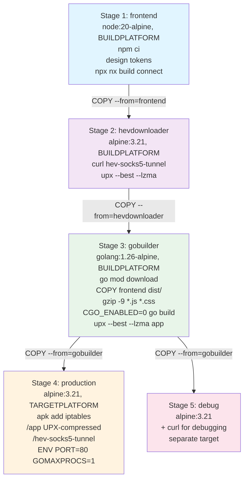

# Build and Deploy

> Documents the multi-stage Docker build pipeline, binary compression, embedded frontend serving,
> runtime tuning, and health-check mechanism that produce the `<10MB` NasNetConnect container image.

**Packages:** `cmd/nnc/`, `internal/server/`, `internal/bootstrap/`, `internal/common/health/` **Key
Files:** `Dockerfile`, `cmd/nnc/main_prod.go`, `internal/server/server.go`,
`internal/server/static.go`, `internal/bootstrap/config.go`, `project.json` **Prerequisites:**

- [See: getting-started.md] — development environment setup
- [See: application-bootstrap.md §Runtime Configuration] — service initialization sequence

---

## Overview

NasNetConnect ships as a **single Docker container that runs on the MikroTik router itself**. The
target constraints are strict: image `<10MB` compressed, runtime RAM `<50MB`, cold start `<5s`.
Achieving these requires a coordinated 5-stage build pipeline that compiles the frontend,
cross-compiles the Go binary for ARM/amd64, applies UPX compression, gzip-precompresses JS/CSS
assets, and bundles everything into a minimal Alpine runtime image.

The resulting `/app` binary is a fully self-contained HTTP server that embeds the React frontend via
Go's `//go:embed` directive. No external web server, no Node.js runtime, no separate static file
server — one binary, one process.

---

## Architecture / Diagram



---

## Stage 1: Frontend Build

**Base image:** `node:20-alpine` with `--platform=$BUILDPLATFORM` (always native for speed).

The entire Nx monorepo workspace is copied in, including `apps/`, `libs/`, and `shared/`. Build
steps:

1. `npm ci --no-audit --no-fund --legacy-peer-deps` — reproducible install from lockfile
2. `node libs/ui/tokens/build.js` — generates Tailwind CSS design tokens before Vite sees them
3. `npx nx build connect` — Vite production build, outputs to `dist/apps/connect/`

The compiled output (`dist/apps/connect/`) is passed forward to Stage 3 via `COPY --from=frontend`.

---

## Stage 2: hev-socks5-tunnel Download

**Base image:** `alpine:3.21` with `--platform=$BUILDPLATFORM`.

Downloads the `hev-socks5-tunnel` binary from GitHub releases. This binary provides the SOCKS-to-TUN
gateway used by the NAS-8.14 VIF gateway feature (connects service SOCKS5 proxies to the router's
TUN interface).

**Multi-arch resolution:**

| `$TARGETARCH` | `$TARGETVARIANT` | Downloaded binary suffix |
| ------------- | ---------------- | ------------------------ |
| `amd64`       | —                | `x86_64`                 |
| `arm64`       | —                | `arm64`                  |
| `arm`         | `v7`             | `arm32hf`                |

After download, UPX compression is applied (`upx --best --lzma`) saving ~2–3MB. The `|| true` suffix
prevents build failure on UPX errors (some ARM targets may be incompatible).

---

## Stage 3: Go Backend Build

**Base image:** `golang:1.26-alpine` with `--platform=$BUILDPLATFORM`.

**Dependency caching:** `go.mod` / `go.sum` are copied first, and `go mod download` runs before the
source copy. Docker layer caching means dependencies are only re-downloaded when `go.mod` changes.

**Embedding the frontend:** The Vite output is copied into `cmd/nnc/dist/`:

```
COPY --from=frontend /workspace/dist/apps/connect ./cmd/nnc/dist
```

The `//go:embed dist/**` directive in `main_prod.go` bundles this directory into the binary at
compile time.

**Asset pre-compression:** Before compilation, JS and CSS files are gzip-compressed at maximum
level:

```sh
find cmd/nnc/dist -type f \( -name "*.js" -o -name "*.css" \) -exec gzip -9 {} \;
```

`gzip` replaces originals (`.js` → `.js.gz`). The static file handler detects
`Accept-Encoding: gzip` and serves the pre-compressed variant with `Content-Encoding: gzip`. This
yields 70–80% asset size reduction **inside** the binary.

**Binary compilation:**

```sh
CGO_ENABLED=0 GOOS=$TARGETOS GOARCH=$TARGETARCH \
  go build -a \
  -ldflags="-w -s -extldflags '-static'" \
  -tags=netgo \
  -trimpath \
  -o app ./cmd/nnc/
```

| Flag                    | Effect                                    |
| ----------------------- | ----------------------------------------- |
| `CGO_ENABLED=0`         | No C dependencies, fully static binary    |
| `-ldflags="-w -s"`      | Strip DWARF debug info and symbol table   |
| `-extldflags '-static'` | Force static linking (no libc dependency) |
| `-tags=netgo`           | Use Go's pure-Go DNS resolver, no cgo     |
| `-trimpath`             | Remove absolute source paths from binary  |
| `-a`                    | Force rebuild of all packages             |

For `arm/v7`: `GOARM` is set to the variant number: `export GOARM=${TARGETVARIANT#v}` strips the `v`
prefix.

**UPX compression:** After compilation, the binary is compressed:

```sh
upx --best --lzma app || true
```

`--best --lzma` achieves maximum compression (typically 3–5x reduction on Go binaries). The
`|| true` prevents failure if UPX is unavailable for the target architecture.

---

## Stage 4: Production Runtime

**Base image:** `alpine:3.21` (final `$TARGETPLATFORM`).

Runtime dependencies:

- `iptables` — for NAT/firewall rules managed by the provisioning subsystem
- BusyBox tools (`udhcpd`, `udhcpc`, `ip`) — already included in Alpine's BusyBox

Only three files are copied from build stages:

1. `/etc/ssl/certs/ca-certificates.crt` — from `gobuilder` (needed for HTTPS to MikroTik REST API
   and registry downloads)
2. `/workspace/apps/backend/app` → `/app` — the UPX-compressed Go binary
3. `/tmp/hev-socks5-tunnel` → `/hev-socks5-tunnel` — the tunnel gateway binary

**Environment variables:**

```
PORT=80           # HTTP listen port (overridable)
GOMAXPROCS=1      # Single-threaded scheduler (router has 1 core)
GO_ENV=production # Controls debug mode, logging format
```

**Docker HEALTHCHECK:**

```dockerfile
HEALTHCHECK --interval=30s --timeout=5s --start-period=5s --retries=3 \
  CMD ["/app", "-healthcheck"]
```

This calls the binary with the `-healthcheck` flag, which performs an HTTP GET to
`http://localhost:$PORT/health` and exits 0 on success or 1 on failure. [See: §Health Check
CLI Flag] below.

---

## Stage 5: Debug Runtime

Identical to Stage 4 but adds `curl` for debugging. Built with `--target=debug` in buildx:

```sh
docker buildx build --target=debug ...
```

Not used in production deployments.

---

## Multi-Arch Support

The build is parameterized with Docker BuildKit's `--platform` argument:

```sh
docker buildx build \
  --platform linux/amd64,linux/arm64,linux/arm/v7 \
  -f apps/backend/Dockerfile \
  --tag ghcr.io/$GHCR_REPOSITORY:latest \
  --push .
```

Supported platforms:

| Platform       | MikroTik hardware              |
| -------------- | ------------------------------ |
| `linux/amd64`  | CHR (Cloud Hosted Router), x86 |
| `linux/arm64`  | RB5009, CCR2004                |
| `linux/arm/v7` | hAP, RB4011, most home routers |

The `$BUILDPLATFORM` annotation on stages 1–3 means compilation always runs on the host machine's
native architecture (fast), while the output binary targets `$TARGETPLATFORM`.

---

## Runtime Tuning

Production runtime settings are applied in `internal/bootstrap/config.go` via
`ApplyRuntimeConfig()`, called at program start in `main_prod.go`'s `init()`:

| Setting              | Production Value | Dev Value          | Rationale                                    |
| -------------------- | ---------------- | ------------------ | -------------------------------------------- |
| `GOMAXPROCS`         | `1`              | `4`                | RouterOS containers have 1 CPU core          |
| `GCPercent`          | `10`             | `100` (Go default) | Aggressive GC to stay under RAM limit        |
| `MemoryLimitMB`      | `32 MB`          | `128 MB`           | Hard soft-limit via `debug.SetMemoryLimit()` |
| `ScannerWorkers`     | `2`              | `4`                | Concurrent subnet scanning goroutines        |
| `EventBusBufferSize` | Configured       | Higher             | Async event delivery buffer                  |

`GCPercent=10` means the Go GC triggers when heap grows 10% beyond the live set — much more frequent
than default (100%) but keeps peak memory predictable. `SetMemoryLimit(32MB)` is a soft limit that
increases GC pressure further when approaching the threshold.

---

## Build Tags

NasNetConnect uses Go build tags to select production vs. development entry points:

| Tag                    | Entry point    | Frontend                          | CORS | Behavior                    |
| ---------------------- | -------------- | --------------------------------- | ---- | --------------------------- |
| `!dev` (default, prod) | `main_prod.go` | Embedded via `//go:embed dist/**` | Off  | Serves frontend from binary |
| `dev`                  | `main_dev.go`  | Served by Vite dev server         | On   | Proxies to `localhost:5173` |

Local Nx build uses explicit tag:

```sh
# From project.json "build" target:
go build -tags=prod -ldflags="-s -w" -o ../../dist/apps/backend/backend ./cmd/nnc/
```

Tests always run with `-tags=dev`:

```sh
# From project.json "test" target:
go test -tags=dev ./...
```

---

## Embedded Frontend Serving

The static file handler in `internal/server/static.go` implements SPA routing with pre-compressed
asset support:

```
Request for /some/path
    │
    ├─ Skip: /api/*, /graphql, /health
    │
    ├─ Accept-Encoding: gzip AND .js or .css?
    │   └─ Try fsys.Open(path + ".gz")
    │       ├─ Found → serve with Content-Encoding: gzip, Vary: Accept-Encoding
    │       └─ Not found → fall through
    │
    ├─ Try fsys.Open(path) directly
    │   ├─ Found → serve with content-type + cache headers
    │   └─ Not found → fall through
    │
    └─ SPA fallback → serve index.html (for React Router routes)
```

**Cache headers:**

| Path                          | Cache-Control                         |
| ----------------------------- | ------------------------------------- |
| `assets/*` (hashed filenames) | `public, max-age=31536000, immutable` |
| `index.html`                  | `no-cache, no-store, must-revalidate` |
| Other                         | `public, max-age=3600`                |

Directory traversal attacks are prevented by `path.Clean()` normalization and `..` detection before
any file is opened.

---

## Health Check CLI Flag

The Docker `HEALTHCHECK` runs `/app -healthcheck`. This flag is handled in `main_prod.go`:

```go
func performHealthCheck() {
    port := os.Getenv("PORT")  // defaults to "80"
    server.PerformHealthCheck(port, logger)
}
```

`server.PerformHealthCheck()` (`internal/server/server.go`) performs:

1. `http.NewRequestWithContext` to `http://localhost:{PORT}/health`
2. 10-second timeout
3. `exit(0)` on HTTP 200, `exit(1)` on error or non-200

The `/health` endpoint is registered separately from the GraphQL handler and skipped by the auth
middleware (`DefaultSkipper`). It always returns 200 when the server is running.

`internal/common/health/probes.go` provides reusable probe types (`TCPProbe`, `HTTPProbe`,
`ProcessProbe`, `CompositeProbe`) used by service health checking at the orchestrator level —
separate from the server-level health endpoint.

---

## Nx Build Targets

Key targets from `project.json`:

| Target               | Command                                                   | Notes                       |
| -------------------- | --------------------------------------------------------- | --------------------------- |
| `build`              | `node tools/copy-frontend.mjs && go build -tags=prod ...` | Depends on `connect:build`  |
| `serve`              | `air` (hot reload)                                        | Development only            |
| `test`               | `go test -tags=dev ./...`                                 | Dev build tag for all tests |
| `lint`               | custom `gcl` binary                                       | `.golangci.yml` config      |
| `typecheck`          | `go vet ./...`                                            | Static analysis             |
| `docker:build`       | `docker buildx build --platform=...`                      | Multi-arch, pushes to GHCR  |
| `docker:build-local` | `node tools/docker/cli.mjs build-local`                   | Single amd64 image for dev  |
| `docker:export-tar`  | Export `.tar.gz` for RouterOS import                      | For air-gapped deployments  |

---

## Image Size Budget

The `<10MB` target is achieved by layering these techniques:

| Technique                            | Savings                                 |
| ------------------------------------ | --------------------------------------- |
| Alpine base image                    | ~5MB vs. ubuntu/debian                  |
| CGO_ENABLED=0 + static binary        | Eliminates glibc                        |
| UPX compression on Go binary         | 3–5x reduction (typically 8MB → 2–3MB)  |
| UPX compression on hev-socks5-tunnel | ~2–3MB savings                          |
| `-w -s` ldflags                      | Strips debug/symbol tables              |
| `-trimpath`                          | Removes source paths                    |
| Gzip-precompressed JS/CSS in binary  | 70–80% asset reduction                  |
| Multi-stage build                    | No Node.js / build tools in final image |

---

## Cross-References

- [See: getting-started.md] — local development setup, `npm run dev:all`
- [See: application-bootstrap.md] — service initialization order after binary starts
- [See: graphql-api.md §Health] — `/health` endpoint registration
- [See: service-orchestrator.md] — orchestrator boot sequence triggered after server starts
