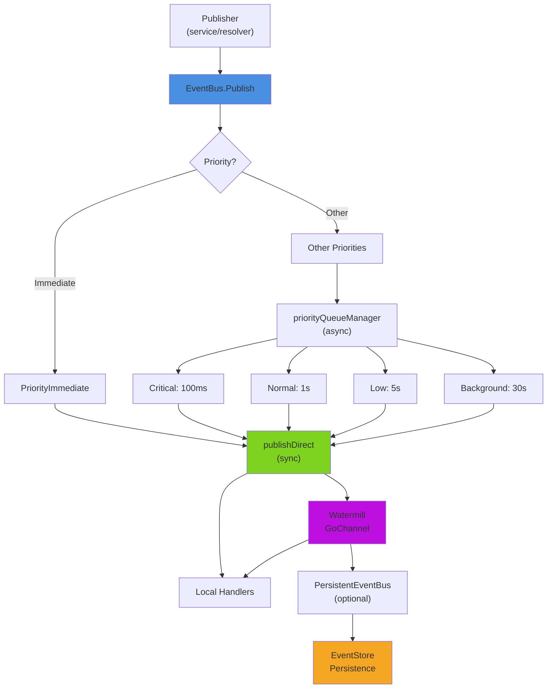
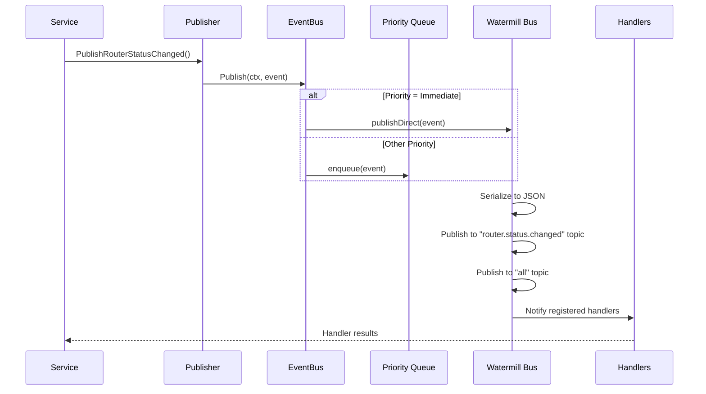

# Event System

> Typed, priority-based event bus built on Watermill GoChannel, connecting all backend subsystems
> through decoupled publish-subscribe communication.

**Packages:** `internal/events/` **Key Files:** `bus.go`, `types.go`, `publisher_all.go`,
`persistence_all.go`, `testing.go`, `bus_support.go` **Prerequisites:** [See:
application-bootstrap.md §Event System Bootstrap]

---

## Overview

The event system enables subsystems to communicate without direct coupling. Publishers emit typed
events; subscribers receive and react to them. The bus is used for:

- **GraphQL subscriptions** - streaming real-time updates to the frontend
- **Alert engine** - triggering alert evaluation on relevant events
- **Audit logging** - recording significant security and operational events
- **Orchestrator coordination** - service state changes driving lifecycle decisions
- **Cross-subsystem notifications** - storage, provisioning, isolation, templates

The bus is backed by [Watermill](https://watermill.io/) `GoChannel` (in-process pub/sub with
configurable buffer). An optional `PersistentEventBus` wrapper adds durable storage for critical
events.

---

## Architecture



---

## Package Reference

### internal/events/types.go

**Core interfaces and base types.**

#### Event interface

```go
type Event interface {
    GetID() ulid.ULID
    GetType() string
    GetPriority() Priority
    GetTimestamp() time.Time
    GetSource() string
    GetCorrelationID() string
    Payload() ([]byte, error)
}
```

#### BaseEvent

All domain events embed `BaseEvent` to satisfy the `Event` interface:

```go
type BaseEvent struct {
    ID        ulid.ULID     `json:"id"`
    Type      string        `json:"type"`
    Priority  Priority      `json:"priority"`
    Timestamp time.Time     `json:"timestamp"`
    Source    string        `json:"source"`
    Metadata  EventMetadata `json:"metadata,omitempty"`
}
```

Constructor:

```go
func NewBaseEvent(eventType string, priority Priority, source string) BaseEvent
func NewBaseEventWithMetadata(eventType string, priority Priority, source string, metadata EventMetadata) BaseEvent
```

#### EventMetadata

Carries distributed tracing correlation IDs and request context:

```go
type EventMetadata struct {
    CorrelationID string            `json:"correlationId,omitempty"`
    CausationID   string            `json:"causationId,omitempty"`
    UserID        string            `json:"userId,omitempty"`
    RequestID     string            `json:"requestId,omitempty"`
    RouterID      string            `json:"routerId,omitempty"`
    Extra         map[string]string `json:"extra,omitempty"`
}
```

---

### Priority System

Five priority levels control delivery latency and batching behavior:

| Constant             | Level | Target Latency | Batch Window    | Persisted |
| -------------------- | ----- | -------------- | --------------- | --------- |
| `PriorityImmediate`  | 0     | < 100ms        | 0 (no batching) | Yes       |
| `PriorityCritical`   | 1     | < 1s           | 100ms           | Yes       |
| `PriorityNormal`     | 2     | < 5s           | 1s              | Yes       |
| `PriorityLow`        | 3     | < 30s          | 5s              | No        |
| `PriorityBackground` | 4     | < 60s          | 30s             | No        |

**`PriorityImmediate` events bypass the queue entirely** - they are published directly and
synchronously.

Helper methods on `Priority`:

```go
func (p Priority) TargetLatency() time.Duration
func (p Priority) BatchWindow() time.Duration
func (p Priority) ShouldPersist() bool
func (p Priority) String() string
func ParsePriority(s string) Priority
```

---

### internal/events/bus.go

**EventBus interface and Watermill implementation.**

#### EventBus interface

```go
type EventBus interface {
    Publish(ctx context.Context, event Event) error
    Subscribe(eventType string, handler EventHandler) error
    SubscribeAll(handler EventHandler) error
    Close() error
}

type EventHandler func(ctx context.Context, event Event) error
```

#### NewEventBus

```go
func NewEventBus(opts EventBusOptions) (EventBus, error)
```

Configuration:

```go
type EventBusOptions struct {
    BufferSize         int                    // GoChannel buffer (default: 1000)
    Logger             watermill.LoggerAdapter
    ZapLogger          *zap.Logger
    EnableReplay       bool
    PersistenceEnabled bool
}
```

**Publish routing:**

- `PriorityImmediate` → `publishDirect()` (synchronous, no batching)
- All other priorities → `priorityQueueManager.enqueue()` (batched delivery)

`publishDirect()` publishes to two Watermill topics:

1. The specific event type topic (e.g., `"router.status.changed"`)
2. The `"all"` catch-all topic

Then it synchronously notifies all local Go handlers registered via `Subscribe`.

#### SubscribableEventBus

A typed extension of `EventBus` providing type-safe subscription methods:

```go
type SubscribableEventBus interface {
    EventBus
    OnRouterStatusChanged(handler func(ctx context.Context, event *RouterStatusChangedEvent) error) error
    OnResourceUpdated(handler func(ctx context.Context, event *ResourceUpdatedEvent) error) error
    OnFeatureCrashed(handler func(ctx context.Context, event *FeatureCrashedEvent) error) error
    OnConfigApplyProgress(handler func(ctx context.Context, event *ConfigApplyProgressEvent) error) error
    OnAuth(handler func(ctx context.Context, event *AuthEvent) error) error
    OnFeatureInstalled(handler func(ctx context.Context, event *FeatureInstalledEvent) error) error
    OnRouterConnected(handler func(ctx context.Context, event *RouterConnectedEvent) error) error
    OnRouterDisconnected(handler func(ctx context.Context, event *RouterDisconnectedEvent) error) error
    OnConfigApplied(handler func(ctx context.Context, event *ConfigAppliedEvent) error) error
    OnRouterStatusChangedFor(routerID string, handler ...) error
    OnResourceUpdatedFor(routerID string, handler ...) error
    OnResourceUpdatedFiltered(filter ResourceFilter, handler ...) error
}

func NewSubscribableEventBus(opts EventBusOptions) (SubscribableEventBus, error)
```

`OnResourceUpdated` automatically subscribes to all three of `ResourceCreated`, `ResourceUpdated`,
and `ResourceDeleted`.

`ResourceFilter` allows per-router and per-resource-type filtering:

```go
type ResourceFilter struct {
    RouterID     string
    ResourceType string
    ChangeType   ChangeType // "create" | "update" | "delete"
}
```

---

### internal/events/publisher_all.go

**Publisher: convenience wrapper for publishing typed events.**

```go
type Publisher struct {
    bus    EventBus
    source string
}

func NewPublisher(bus EventBus, source string) *Publisher
func (p *Publisher) Publish(ctx context.Context, event Event) error
```

The `Publisher` provides named methods for every domain event type, constructing the correct typed
event and calling `bus.Publish`. Example methods:

```go
func (p *Publisher) PublishRouterStatusChanged(ctx context.Context, routerID string, status, previousStatus RouterStatus) error
func (p *Publisher) PublishRouterStatusChangedWithError(ctx context.Context, routerID string, status, previousStatus RouterStatus, protocol, errorMessage string) error
func (p *Publisher) PublishResourceCreated(ctx context.Context, resourceUUID ulid.ULID, resourceType, routerID string, version int) error
func (p *Publisher) PublishResourceUpdated(ctx context.Context, resourceUUID ulid.ULID, resourceType, routerID string, version int, changedFields []string) error
func (p *Publisher) PublishResourceDeleted(ctx context.Context, resourceUUID ulid.ULID, resourceType, routerID string) error
func (p *Publisher) PublishAuthLogin(ctx context.Context, userID, ipAddress, userAgent string, success bool, failReason string) error
func (p *Publisher) PublishAuthLogout(ctx context.Context, userID, ipAddress, userAgent string) error
func (p *Publisher) PublishAuthSessionRevoked(ctx context.Context, userID, ipAddress, userAgent string) error
func (p *Publisher) PublishAuthPasswordChanged(ctx context.Context, userID, ipAddress, userAgent string) error
func (p *Publisher) PublishCredentialChanged(ctx context.Context, routerID, userID, ipAddress string) error
func (p *Publisher) PublishFeatureCrashed(ctx context.Context, featureID, instanceID, routerID string, exitCode, crashCount int, lastError string, willRestart bool) error
func (p *Publisher) PublishFeatureInstalled(ctx context.Context, featureID, featureName, version, routerID string) error
func (p *Publisher) PublishStorageMounted(ctx context.Context, path string, totalMB, freeMB, usedMB uint64, usedPct float64, fsType string) error
func (p *Publisher) PublishIsolationViolation(ctx context.Context, ...) error
func (p *Publisher) PublishTemplateInstallStarted(ctx context.Context, ...) error
func (p *Publisher) PublishBootSequenceStarted(ctx context.Context, instanceCount int, instanceIDs []string) error
// ...and ~20 more typed publish methods
```

The GraphQL resolver holds a `*Publisher` and uses it after mutations:

```go
r.EventPublisher = events.NewPublisher(cfg.EventBus, "graphql-resolver")
```

---

### internal/events/bus_support.go

**Event parsing and priority queue management.**

#### ParseEvent

Deserializes a Watermill message back into a typed event:

```go
func ParseEvent(msg *message.Message) (Event, error)
```

Uses a registry map `eventFactories` (40+ entries) mapping event type strings to factory functions.
Unknown types fall back to `*BaseEvent`.

#### priorityQueueManager

Internal struct managing four queues (one per priority level):

```go
type priorityQueueManager struct {
    queues map[Priority][]Event
    mu     sync.Mutex
    stopCh chan struct{}
}
```

The `processPriorityQueues()` goroutine runs tickers at each priority's batch window:

- Critical: 100ms ticker
- Normal: 1s ticker
- Low: 5s ticker
- Background: 30s ticker

On each tick, `drain()` removes all queued events for that priority and publishes them via
`publishDirect()`.

---

### Domain Event Types

Events are defined across several files in `internal/events/`:

#### Core Events (domain_events_core.go)

| Type                        | Priority   | Description                               |
| --------------------------- | ---------- | ----------------------------------------- |
| `RouterStatusChangedEvent`  | Immediate  | Router connection status transitions      |
| `RouterConnectedEvent`      | Normal     | Router connection established             |
| `RouterDisconnectedEvent`   | Normal     | Router connection lost                    |
| `CapabilitiesUpdatedEvent`  | Normal     | Router capabilities detected              |
| `ResourceUpdatedEvent`      | Normal     | Resource created/updated/deleted          |
| `MetricUpdatedEvent`        | Background | Interface statistics update               |
| `LogAppendedEvent`          | Background | Log entry appended                        |
| `ConfigApplyProgressEvent`  | Critical   | Config apply progress update              |
| `ConfigAppliedEvent`        | Normal     | Config apply completed                    |
| `AuthEvent`                 | Critical   | Auth login/logout/session/password events |
| `FeatureCrashedEvent`       | Immediate  | Feature process crash                     |
| `FeatureInstalledEvent`     | Critical   | Feature successfully installed            |
| `FeatureHealthChangedEvent` | Normal     | Feature health state change               |

#### Service Events (domain_events_service.go)

| Type                          | Priority            | Description                                               |
| ----------------------------- | ------------------- | --------------------------------------------------------- |
| `ServiceStateChangedEvent`    | Normal/Immediate    | Service state transitions; `failed`/`crashed` → Immediate |
| `ServiceRestartedEvent`       | Normal/Critical     | Service restart (Critical if ≥3 crashes)                  |
| `ServiceHealthEvent`          | Background          | Health check result                                       |
| `ServiceCrashedEvent`         | Immediate           | Unexpected service crash                                  |
| `ServiceInstalledEvent`       | Critical            | Service installed                                         |
| `ServiceRemovedEvent`         | Critical            | Service uninstalled                                       |
| `ServiceUpdateAvailableEvent` | Low                 | New version available                                     |
| `ServiceKillSwitchEvent`      | Immediate           | Emergency stop triggered                                  |
| `ServiceResourceWarningEvent` | Normal/Low/Critical | Resource threshold crossed                                |
| `ServiceHealthFailingEvent`   | Normal/Critical     | Repeated health check failures                            |

Alert severity helpers:

```go
func GetServiceEventSeverity(eventType string) AlertSeverity
func GetServiceEventSeverityDynamic(event Event) AlertSeverity
```

#### Storage Events (domain_events_service.go)

| Type                         | Priority        | Description                     |
| ---------------------------- | --------------- | ------------------------------- |
| `StorageMountedEvent`        | Normal          | External storage mounted        |
| `StorageUnmountedEvent`      | Critical        | Storage unmounted unexpectedly  |
| `StorageSpaceThresholdEvent` | Normal/Critical | Storage usage threshold crossed |
| `StorageConfigChangedEvent`  | Normal          | Storage config updated          |
| `StorageUnavailableEvent`    | Immediate       | Feature's storage unavailable   |

#### Lifecycle Events (domain_events_lifecycle.go)

Boot sequence, dependency graph, template installation events.

#### Extended Events (domain_events_extended.go)

Binary verification, isolation violations, resource OOM, VLAN pool warnings, provisioning events.

---

### internal/events/persistence_all.go

**EventStore interface and persistence wrappers.**

#### EventStore interface

```go
type EventStore interface {
    PersistEvent(ctx context.Context, event Event) error
    GetEventsSince(ctx context.Context, since time.Time) ([]Event, error)
    GetUnprocessedEvents(ctx context.Context) ([]Event, error)
    MarkProcessed(ctx context.Context, id ulid.ULID) error
    ReplayEvents(ctx context.Context, handler EventHandler) error
    Close() error
}
```

#### MemoryEventStore

In-memory implementation for development and testing:

```go
func NewMemoryEventStore(maxEvents int) *MemoryEventStore
```

- Only persists events where `priority.ShouldPersist()` is true (Immediate, Critical, Normal)
- Evicts oldest 10% of events when at capacity
- `ReplayEvents()` processes unprocessed events and marks them complete

#### PersistentEventBus

Wraps any `EventBus` and adds optional persistence:

```go
func NewPersistentEventBus(bus EventBus, store EventStore) *PersistentEventBus
```

- Publish: delegates to wrapped bus, then calls `store.PersistEvent()` asynchronously for events
  where `ShouldImmediatelyPersist()` returns true
- `ReplayUnprocessedEvents(ctx)` - called on startup to replay missed events

#### DailySync

Runs at 02:00 daily to sync persisted events (per ADR-013):

```go
func NewDailySync(store EventStore, bus EventBus) *DailySync
func (ds *DailySync) Start(ctx context.Context)
func (ds *DailySync) Stop()
```

---

### internal/events/testing.go

**InMemoryEventBus for unit tests.**

```go
func NewInMemoryEventBus() *InMemoryEventBus
```

The test bus:

- Stores all published events in an in-memory slice
- Calls registered handlers synchronously
- Supports wildcard subscriptions via `SubscribeChannel(ctx, "wan.*")`
- Provides `GetAllEvents()` to inspect what was published
- Provides `Clear()` to reset state between tests

```go
type InMemoryEventBus struct {
    mu         sync.RWMutex
    handlers   map[string][]EventHandler
    allHandler []EventHandler
    allEvents  []Event
    channels   map[string][]chan interface{}
}

func (b *InMemoryEventBus) GetAllEvents() []Event
func (b *InMemoryEventBus) Clear()
func (b *InMemoryEventBus) SubscribeChannel(ctx context.Context, pattern string) <-chan interface{}
```

Wildcard patterns: exact match or `"prefix.*"` (e.g., `"wan.*"` matches all events starting with
`"wan."`).

---

### internal/events/classification.go

Provides `ShouldImmediatelyPersist(eventType string) bool` and
`ShouldBatchPersist(eventType string) bool` to classify which event types need persistent storage.

---

## Data Flow

### Publishing an Event



### Subscribing to Events

```go
// Type-safe subscription:
bus.OnRouterStatusChanged(func(ctx context.Context, event *RouterStatusChangedEvent) error {
    // react to router status change
    return nil
})

// Generic subscription:
bus.Subscribe("router.status.changed", func(ctx context.Context, event Event) error {
    typed := event.(*RouterStatusChangedEvent)
    return nil
})

// All events:
bus.SubscribeAll(func(ctx context.Context, event Event) error {
    // receives every event
    return nil
})
```

### GraphQL Subscription Flow

```go
// In a subscription resolver:
func (r *subscriptionResolver) OnRouterStatusChanged(ctx context.Context) (<-chan *model.RouterStatus, error) {
    ch := make(chan *model.RouterStatus, 10)
    r.EventBus.Subscribe(events.EventTypeRouterStatusChanged, func(ctx context.Context, event events.Event) error {
        typed := event.(*events.RouterStatusChangedEvent)
        ch <- mapToGraphQL(typed)
        return nil
    })
    return ch, nil
}
```

---

## Event Type Constants

All event type string constants are defined alongside their event structs. Common constants:

```go
const (
    EventTypeRouterStatusChanged  = "router.status.changed"
    EventTypeRouterConnected      = "router.connected"
    EventTypeRouterDisconnected   = "router.disconnected"
    EventTypeResourceUpdated      = "resource.updated"
    EventTypeResourceCreated      = "resource.created"
    EventTypeResourceDeleted      = "resource.deleted"
    EventTypeFeatureCrashed       = "feature.crashed"
    EventTypeFeatureInstalled     = "feature.installed"
    EventTypeConfigApplyProgress  = "config.apply.progress"
    EventTypeConfigApplied        = "config.applied"
    EventTypeAuth                 = "auth"
    EventTypeAuthSessionRevoked   = "auth.session.revoked"
    EventTypeAuthPasswordChanged  = "auth.password.changed"
    EventTypeServiceStateChanged  = "service.state.changed"
    EventTypeServiceCrashed       = "service.crashed"
    EventTypeStorageMounted       = "storage.mounted"
    EventTypeIsolationViolation   = "isolation.violation"
    // ...40+ more
)
```

---

## Configuration

`EventBusOptions`:

```go
EventBusOptions{
    BufferSize:         1000,    // GoChannel output buffer per topic
    Logger:             watermill.NewStdLogger(false, false),
    ZapLogger:          zapLogger,
    EnableReplay:       false,
    PersistenceEnabled: false,
}
```

For production with persistence:

```go
bus, _ := events.NewEventBus(opts)
store := events.NewMemoryEventStore(10000)
persistentBus := events.NewPersistentEventBus(bus, store)
```

---

## Error Handling

- Handler panics are caught with `recover()` in goroutines and logged; they do not crash the bus
- Handler errors are logged but do not prevent other handlers from running
- Failed persistence is flagged via `IsPersistenceFailing()` but does not block publishing
- Bus closed state is checked before publish; returns error if closed

---

## Testing

Use `InMemoryEventBus` for all unit tests:

```go
func TestSomethingPublishesEvent(t *testing.T) {
    bus := events.NewInMemoryEventBus()
    svc := NewMyService(bus)

    svc.DoSomething(ctx)

    allEvents := bus.GetAllEvents()
    require.Len(t, allEvents, 1)
    evt, ok := allEvents[0].(*events.RouterStatusChangedEvent)
    require.True(t, ok)
    assert.Equal(t, "connected", string(evt.Status))
}
```

Test files: `bus_test.go`, `types_test.go`, `domain_events_test.go`, `service_events_test.go`.

---

## Cross-References

- How events connect to alert evaluation: [See: alert-system.md §Alert Engine Event Triggers]
- Event bus wiring at startup: [See: application-bootstrap.md §Event System Bootstrap]
- GraphQL subscriptions consuming events: [See: graphql-api.md §Subscription Flow]
- Credentials never published in events: [See: security.md §Credential Management]
