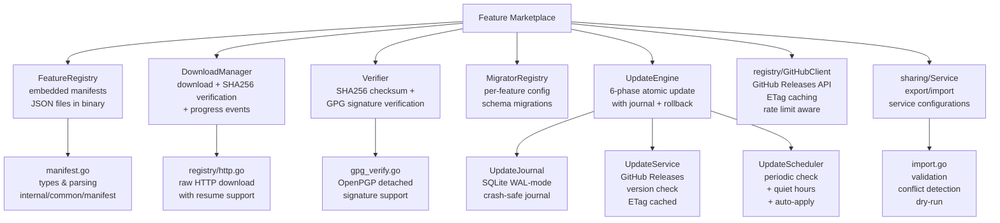
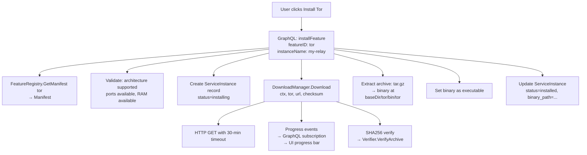
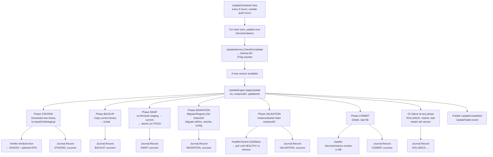
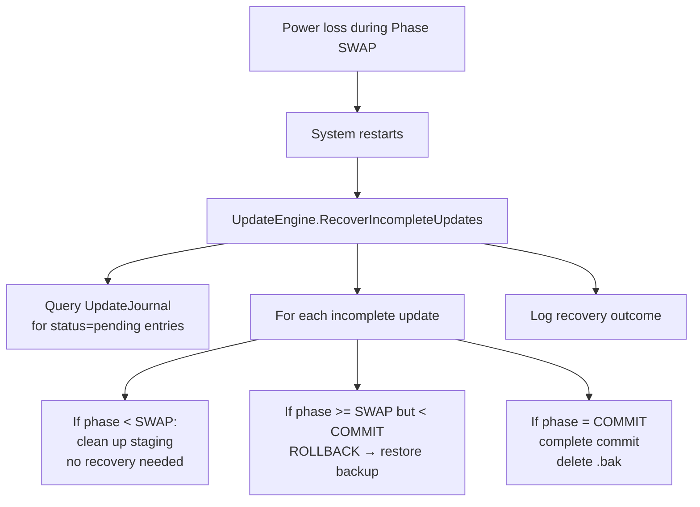

# Feature Marketplace

> Downloadable privacy and network services for MikroTik routers: manifest-driven binary distribution, cryptographic verification, atomic updates, config migration, and service import/export.

**Packages:** `internal/features/`, `internal/features/updates/`, `internal/features/sharing/`, `internal/features/verification/`, `internal/registry/`, `internal/common/manifest/`

**Key Files:** `features/download.go`, `features/config_migrator.go`, `common/manifest/manifest.go`, `features/updates/engine.go`, `features/updates/journal.go`, `features/updates/updater.go`, `features/updates/scheduler.go`, `features/verification/verifier.go`, `features/verification/gpg_verify.go`, `features/sharing/import.go`, `registry/github.go`, `registry/http.go`

**Prerequisites:** [See: service-orchestrator.md §InstanceManager], [See: data-layer.md §FeatureRegistry]

---

## Overview

The Feature Marketplace is a plugin system that extends a base MikroTik router management installation with downloadable network services. Each **feature** is a standalone binary (Tor, sing-box, Xray-core, MTProxy, Psiphon, AdGuard Home) described by a **manifest** that declares:

- Resource requirements (RAM, disk, ports, architecture)
- Binary download source (GitHub Releases with architecture mapping)
- Configuration schema and defaults
- Health check probes
- Container port mappings

The system handles the full feature lifecycle:

```
Browse → Install → Configure → Run → Monitor → Update → Rollback
```

---

## Architecture



---

## Package Reference

### `internal/common/manifest`

The canonical manifest type, shared across all feature-related packages.

**`Manifest` struct** (defined in `manifest.go`):

```go
type Manifest struct {
    ID          string   // "tor", "singbox", "xray", etc.
    Name        string
    Description string
    Version     string
    Category    string   // "Privacy", "VPN", etc.
    Tags        []string

    // Requirements
    Architectures      []string // ["amd64", "arm64", "arm"]
    MinRouterOSVersion string
    RequiredPorts      []int
    RequiredMemoryMB   int
    RequiredDiskMB     int
    MinRAM             int64   // bytes
    RecommendedRAM     int64
    CPUWeight          int     // relative scheduling weight

    // Container configuration
    DockerImage     string
    DockerTag       string
    EnvironmentVars map[string]string
    Volumes         []VolumeMount
    Ports           []PortMapping
    NetworkMode     string

    // Configuration
    ConfigSchema  json.RawMessage // JSON Schema for user config
    DefaultConfig map[string]any

    // Binary source (for direct binary download, not Docker)
    Source *Source

    // Health monitoring
    HealthCheck *HealthSpec
}
```

**`Source` — GitHub binary download descriptor:**

```go
type Source struct {
    GitHubOwner   string
    GitHubRepo    string
    BinaryName    string
    ArchiveFormat string            // "tar.gz", "zip", "none"
    ExtractPath   string            // filename inside archive
    AssetArchMap  map[string]string // "amd64" → "linux-amd64"
    ChecksumFiles []string          // ["checksums.txt", "SHA256SUMS"]
}
```

**`HealthSpec`** — Health check probe configuration:

```go
type HealthSpec struct {
    Type               string // "tcp", "http", "socks5"
    TCPAddress         string
    HTTPEndpoint       string
    HTTPExpectedStatus int
    IntervalSeconds    int
    FailureThreshold   int
    TimeoutSeconds     int
    AutoRestart        bool
}
```

**`VerificationSpec`** and **`GPGSpec`** — optional GPG signature verification configuration.

**Key functions:**

```go
func ParseJSONBytes(data []byte) (*Manifest, error)
func (m *Manifest) SupportsArchitecture(arch string) bool
func (m *Manifest) GetFullImageName() string
func NormalizeArchitecture(arch string) string  // "armv7l" → "arm", "aarch64" → "arm64"
```

---

### `internal/features`

**`manifest.go`** — type aliases re-exporting `internal/common/manifest` types. This keeps the `features` package as the single import point for callers.

**`download.go` — DownloadManager**

Downloads feature binaries with progress tracking, SHA256 verification, and event publishing.

```go
type DownloadManager struct {
    eventBus        events.EventBus
    httpClient      *http.Client        // 30-minute timeout
    baseDir         string
    activeDownloads map[string]*DownloadProgress
}

type DownloadProgress struct {
    FeatureID       string
    BytesDownloaded int64
    TotalBytes      int64
    Percent         float64
    Status          string  // "starting", "downloading", "verifying", "complete", "failed"
    Error           error
}
```

**`Download(ctx, featureID, url, expectedChecksum)`** flow:
1. Check for duplicate in-progress download (returns error if duplicate)
2. Emit `starting` progress event
3. Create `{baseDir}/{featureID}/bin/` directory
4. Download to temporary file via HTTP
5. Verify SHA256 checksum against `expectedChecksum`
6. Atomic rename: temp → final path
7. Set executable bit (`0o755`)
8. Emit progress events at each step; `failed` on any error

Progress events are published to the event bus and consumed by the GraphQL subscription resolver to stream live download progress to the UI.

**`config_migrator.go` — ConfigMigrator**

Handles config schema evolution across feature versions.

```go
type ConfigMigrator interface {
    Migrate(ctx, oldVersion, newVersion string, config map[string]interface{}) (map[string]interface{}, error)
    CanMigrate(oldVersion, newVersion string) bool
    SupportedVersions() []string
}

type NoOpMigrator struct{}  // Pass-through for features without migration needs

type MigratorRegistry struct {
    migrators map[string]ConfigMigrator  // featureID → migrator
}
```

```go
func (r *MigratorRegistry) Register(featureID string, migrator ConfigMigrator) error
func (r *MigratorRegistry) Get(featureID string) (ConfigMigrator, bool)
func (r *MigratorRegistry) GetOrDefault(featureID string) ConfigMigrator  // returns NoOpMigrator if not found
```

---

### Bundled Feature Manifests (`internal/features/manifests/`)

Six manifests are embedded in the binary at build time:

| Manifest | ID | Category | Min RAM | Ports |
|----------|----|----------|---------|-------|
| `tor.json` | `tor` | Privacy | 30 MB | 9001, 9030 |
| `singbox.json` | `singbox` | VPN | 15 MB | 1080, 8080 |
| `xray.json` | `xray` | VPN | 15 MB | 1080, 8080 |
| `mtproxy.json` | `mtproxy` | Privacy | 8 MB | 443 |
| `psiphon.json` | `psiphon` | Privacy | 10 MB | varies |
| `adguard.json` | `adguard` | Monitoring | 32 MB | 53, 80, 3000 |

Architecture support: all features support `amd64`, `arm64`, `arm` (matching MikroTik CHR and router hardware).

Binary source: GitHub Releases with per-architecture asset naming (e.g., Tor `linux-amd64`, sing-box `linux_amd64`).

---

### `internal/features/verification`

**`verifier.go` — Verifier**

Main entry point for binary verification.

```go
type Verifier struct {
    publisher *events.Publisher
}

type Result struct {
    Valid       bool
    Checksum    string  // SHA256 hex
    VerifiedAt  string  // RFC3339
    GPGResult   *GPGVerificationResult  // nil if GPG not performed
}

type VerifyError struct {
    FilePath string
    Expected string
    Actual   string
}
```

**`VerifyArchive(ctx, archivePath, checksumsPath, checksumsURL string, spec *Spec)`**

1. Parse checksums file (GNU `sha256sum` format: `hash  filename`)
2. Match archive filename to checksum entry
3. Compute SHA256 of downloaded archive
4. Compare hashes (constant-time comparison)
5. Optionally verify GPG signature if `Spec.GPG != nil`
6. Publish `verification.complete` event

**`gpg_verify.go` — GPG Verification**

Optional cryptographic signature verification using OpenPGP.

```go
type GPGVerificationResult struct {
    Valid       bool
    KeyID       string
    Fingerprint string
    SignedBy    string
    SignedAt    string
    Error       error
}

func VerifyGPGSignature(ctx, filePath, signaturePath string, spec *GPGSpec) (*GPGVerificationResult, error)
```

Supports both armored (`.asc`) and binary (`.sig`) detached signatures. Falls back from armored to binary format automatically.

Key retrieval: downloads public key from `spec.KeyServerURL` if not cached locally.

> Note: `ErrGPGNotImplemented` is returned for features that declare GPG but the current release hasn't wired the key server. This is intentional — GPG is opt-in at the manifest level.

---

### `internal/features/updates`

**`updater.go` — UpdateService**

Version comparison and update metadata retrieval.

```go
type UpdateSeverity string
const (
    SeverityCritical UpdateSeverity = "CRITICAL"  // Security fixes
    SeverityMajor    UpdateSeverity = "MAJOR"     // Breaking changes
    SeverityMinor    UpdateSeverity = "MINOR"     // New features
    SeverityPatch    UpdateSeverity = "PATCH"     // Bug fixes
)

type UpdateInfo struct {
    FeatureID        string
    CurrentVersion   string
    AvailableVersion string
    Severity         UpdateSeverity
    ReleaseNotes     string
    PublishedAt      string
    DownloadURL      string
    ChecksumURL      string
    Size             int64
    Architecture     string
}

func (s *UpdateService) CheckForUpdate(ctx, featureID, currentVersion string) (*UpdateInfo, bool, error)
```

Version comparison uses `golang.org/x/mod/semver`. Severity is derived from semver bump type (major/minor/patch) with special-case `CRITICAL` tag detection from release title.

Uses `GitHubClient.FetchLatestRelease` with ETag caching — no API calls if release hasn't changed.

**`engine.go` — UpdateEngine**

6-phase atomic update with crash recovery:

```go
type UpdatePhase string
const (
    PhaseStaging    UpdatePhase = "STAGING"    // 1. Download + verify new binary
    PhaseBackup     UpdatePhase = "BACKUP"     // 2. Backup current binary + config
    PhaseSwap       UpdatePhase = "SWAP"       // 3. Atomic rename new → current
    PhaseMigration  UpdatePhase = "MIGRATION"  // 4. Run config migration
    PhaseValidation UpdatePhase = "VALIDATION" // 5. Start + health check
    PhaseCommit     UpdatePhase = "COMMIT"     // 6. Finalize (delete backup)
    PhaseRollback   UpdatePhase = "ROLLBACK"   // restore backup on any failure
)
```

**`UpdateEngine` dependencies:**

```go
type UpdateEngineConfig struct {
    DownloadManager  *DownloadManager
    Verifier         *Verifier
    Journal          *UpdateJournal
    MigratorRegistry *MigratorRegistry
    PathResolver     storage.PathResolverPort
    BaseDir          string   // default: /var/lib/nasnet
    EventBus         events.EventBus
    HealthChecker    HealthChecker   // GetStatus(instanceID) (string, error)
    InstanceStopper  InstanceStopper // Stop(ctx, instanceID) error
    InstanceStarter  InstanceStarter // Start(ctx, instanceID) error
}
```

**Update flow:**

```
1. STAGING:    Download new binary to staging area, verify SHA256 + optional GPG
2. BACKUP:     Copy current binary to {instanceID}.bak, backup config
3. SWAP:       Atomic os.Rename(staged → current) — power-safe on POSIX
4. MIGRATION:  MigratorRegistry.Get(featureID).Migrate(oldVer, newVer, config)
5. VALIDATION: InstanceStarter.Start + HealthChecker.GetStatus (retry up to threshold)
6. COMMIT:     Delete backup files, update DB version field
           └── On any failure after BACKUP: ROLLBACK phase restores backup
```

Each phase transition is logged to `UpdateJournal` before execution — enables crash recovery on restart.

**`journal.go` — UpdateJournal**

Power-safe SQLite journal using WAL mode and `PRAGMA synchronous=FULL`.

```go
type UpdateJournal struct {
    db *sql.DB  // modernc.org/sqlite (pure Go, no CGO)
}

type JournalEntry struct {
    InstanceID   string
    FeatureID    string
    FromVersion  string
    ToVersion    string
    Phase        UpdatePhase
    Status       string       // "pending", "success", "failed"
    StartedAt    time.Time
    CompletedAt  *time.Time
    ErrorMessage string
    Metadata     map[string]interface{}
}
```

On startup, `UpdateEngine` checks the journal for incomplete updates (status=`pending`) and resumes or rolls them back.

**`scheduler.go` — UpdateScheduler**

Periodic background update checking with quiet hours support.

```go
type UpdateSchedulerConfig struct {
    UpdateService   *UpdateService
    UpdateEngine    *UpdateEngine
    Store           *ent.Client
    EventBus        events.EventBus
    CheckInterval   time.Duration // default: 6 hours
    QuietHoursStart string        // HH:MM, e.g., "02:00"
    QuietHoursEnd   string        // HH:MM, e.g., "06:00"
    Timezone        string        // IANA, e.g., "America/New_York"
}
```

Quiet hours prevent auto-updates during peak usage hours. Checks respect `auto_update` flag per service instance — if `false`, only notifies via event (does not apply update).

---

### `internal/registry`

Low-level HTTP and GitHub Releases utilities.

**`github.go` — GitHubClient**

```go
type GitHubClient struct {
    httpClient  *http.Client
    etags       map[string]string   // URL → ETag cache
    userAgent   string              // "NasNetConnect-UpdateManager/1.0"
    maxRespSize int64               // 10 MB default
}

type GitHubRelease struct {
    TagName     string
    Name        string
    Body        string        // release notes
    PublishedAt string
    Assets      []GitHubAsset
}

type GitHubAsset struct {
    Name               string
    BrowserDownloadURL string
    Size               int64
    ContentType        string
}
```

```go
func (gc *GitHubClient) FetchLatestRelease(ctx, owner, repo string) (*GitHubRelease, bool, error)
// Returns: (release, wasModified, error)
// wasModified=false if 304 Not Modified (ETag cache hit)
```

ETag caching avoids repeated API calls for unchanged releases. Thread-safe via `sync.RWMutex`.

**`http.go` — DownloadFile**

```go
type DownloadConfig struct {
    URL         string
    DestPath    string
    Timeout     time.Duration   // default: 5 minutes
    ResumeFrom  int64           // byte offset for resume
    MaxFileSize int64           // default: 500 MB
    ProgressFn  func(downloaded, total int64)
    HTTPClient  *http.Client
}

func DownloadFile(ctx context.Context, cfg DownloadConfig) (*DownloadResult, error)
```

Supports HTTP range requests for download resumption. Progress callback enables live UI updates.

---

### `internal/features/sharing`

Service configuration export and import for sharing between router instances.

**`import.go`** — validation types and import logic:

```go
type ImportValidationResult struct {
    Valid                bool
    Errors               []ValidationError        // blocking
    Warnings             []ValidationWarning      // non-blocking
    RedactedFields       []string                 // fields requiring user input
    ConflictingInstances []*ent.ServiceInstance
    RequiresUserInput    bool
}

type ValidationError struct {
    Stage   string  // "schema", "syntax", "cross-resource", "dependency", "conflict", "capability", "dry-run"
    Field   string
    Code    string  // "V400", "V403", "S602", etc.
    Message string
}

type ConflictResolutionStrategy string
const (
    ConflictSkip      ConflictResolutionStrategy = "SKIP"
    ConflictOverwrite ConflictResolutionStrategy = "OVERWRITE"
    ConflictRename    ConflictResolutionStrategy = "RENAME"
)

type ImportOptions struct {
    RouterID            string
    UserID              string
    ConflictResolution  ConflictResolutionStrategy
    RedactedFieldValues map[string]interface{}   // user-supplied for sensitive fields
    DeviceFilter        []string                 // MAC addresses to filter
    DryRun              bool
}
```

**`import_operations.go`** — Multi-stage validation pipeline:

1. Schema validation — package format correctness
2. Syntax validation — field types, required fields
3. Cross-resource validation — referenced instances exist
4. Dependency validation — dependency chain satisfiable
5. Conflict detection — name or port collisions
6. Capability check — router supports required features
7. Dry-run — simulate import without DB writes

**`ServiceExportPackage`** — contains serialized service config, routing rules, and device assignments (with sensitive fields redacted).

---

## Data Flow

### Feature Installation



### Atomic Update



### Crash Recovery



---

## Configuration

Feature storage layout (via `storage.PathResolverPort`):

```
{baseDir}/
    {featureID}/
        bin/
            {binaryName}        # Current binary
            {binaryName}.bak    # Backup during update
        staging/
            {binaryName}        # New binary being staged
        config/
            config.json         # User config
        logs/
            {instanceID}.log    # Log output
        update-journal.db       # SQLite WAL journal
```

Default `baseDir`: `/var/lib/nasnet` (production), configurable via `UpdateEngineConfig.BaseDir`.

**GitHub rate limiting:**

The `GitHubClient` uses ETag caching to stay within GitHub's unauthenticated rate limit (60 req/hour). With the default 6-hour check interval and ETag cache hits returning 304 (no quota cost), 6 features would consume at most 1 API request per check cycle when releases haven't changed.

---

## Error Handling

| Error | Behavior |
|-------|----------|
| Download network failure | `DownloadManager` sets status `failed`, publishes error event; retry is user-triggered |
| SHA256 mismatch | `Verifier` returns `VerifyError`; downloaded file deleted |
| GPG verification failure | Returns error if `RequireGPG=true`; skipped if `false` |
| Update STAGING failure | No rollback needed; staging directory cleaned up |
| Update POST-SWAP failure | Full ROLLBACK: binary + config restored from backup |
| Import conflict | Returns `ValidationError` with code and resolution options |
| Import dry-run failure | Returns validation result without DB changes |
| Journal write failure | Treated as critical — update aborted |

---

## Testing

**`internal/config/integration_test.go`**

Integration tests for service-specific config generation (adguard, tor, singbox, xray). Tests that config output matches expected structure for each architecture.

**`features/sharing/import.go`**

Extensive validation test coverage across all 7 validation stages. Mock `FeatureRegistry` and `ent.Client` used for isolation.

---

## Cross-References

- [See: service-orchestrator.md §lifecycle_installer] — `DownloadManager` is called during installation
- [See: service-orchestrator.md §InstanceManager] — `UpdateEngine` uses `InstanceStopper`/`InstanceStarter` interfaces from lifecycle
- [See: virtual-interface-factory.md §BridgeOrchestrator] — Manifests drive VIF gateway configuration
- [See: data-layer.md §ServiceInstance] — Ent schema stores version, binary_path, auto_update flags
- [See: event-system.md] — Download progress, update lifecycle, and verification events
- [See: graphql-api.md §services] — GraphQL mutations for install, update, import/export
