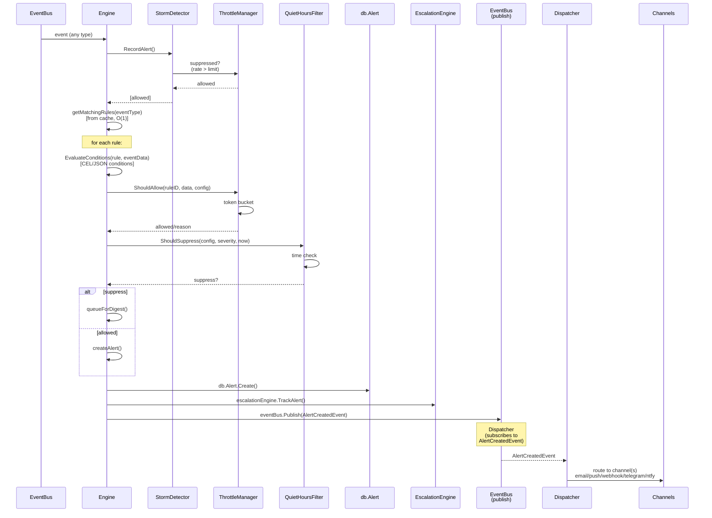
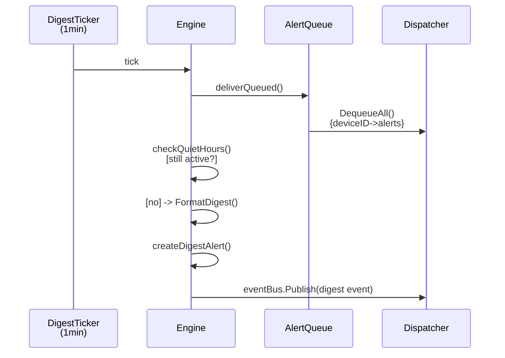

# Flow: Alert Lifecycle

> Traces the complete path of an alert from an event triggering the engine, through throttle and
> quiet-hours filtering, to multi-channel notification delivery.

**Touches:** `internal/alerts/`, `internal/alerts/throttle/`, `internal/notifications/` **Entry
Point:** `Engine.HandleEvent(ctx, event)` in `internal/alerts/engine.go` **Prerequisites:**

- [See: 05-event-system.md] — how events flow through the Watermill bus
- [See: 09-alert-system.md] — alert rules, channels, and engine configuration

## Overview

The alert engine subscribes to all events on the event bus. When an event arrives, the engine checks
it against a cached rule set. Rules that match undergo a 3-stage filter pipeline: storm detection →
throttle check → quiet hours check. Alerts that pass all filters are persisted to the database and
trigger a notification dispatch. Alerts suppressed by quiet hours are queued and delivered as a
digest batch when quiet hours end.

## Sequence Diagram

**Digest delivery (quiet hours end):**

## Step-by-Step Walkthrough

### Step 1: Engine Start and Subscription

- `Engine.Start(ctx)` initializes the engine
- **File:** `internal/alerts/engine.go:107`
- Loads all enabled `AlertRule` records from database into `rulesCache` (map[ruleID → rule])
- Subscribes `HandleEvent` to ALL events via `eventBus.SubscribeAll(e.HandleEvent)`
- Subscribes `handleRuleChange` to `alert.rule.{created,updated,deleted}` for cache invalidation
- Starts `throttleManager.StartSummaryWorker()` (5-minute interval)
- Starts `escalationEngine.Start()` if configured
- Starts `runDigestDelivery()` goroutine with 1-minute ticker

### Step 2: Event Reception and Storm Detection

- `HandleEvent(ctx, event)` is called for every event on the bus
- **File:** `internal/alerts/engine.go:144`
- **Storm check first:** `stormDetector.RecordAlert()` — if alert rate exceeds threshold (e.g.
  100/min):
  - Returns `false` → all matching rules are tracked as suppressed
  - Suppression reason logged: `"storm: X/min (threshold: Y/min)"`
- If storm not detected: extracts `eventType` and finds matching rules from cache (`O(n)` where n =
  rule count)

### Step 3: Rule Evaluation

- `evaluateRule(ctx, rule, eventType, eventData, startTime)` is called per matching rule
- **File:** `internal/alerts/engine_evaluate.go:24`
- `ParseConditions(rule.Conditions)` deserializes the rule's JSON condition tree
- `EvaluateConditions(conditions, eventData)` walks the condition tree against event payload fields
- If conditions fail → rule is skipped (not a match for this event)
- If conditions pass → move to throttle check

### Step 4: Throttle Check

- `throttleManager.ShouldAllow(ruleID, eventData, throttleConfig)` is called
- **File:** `internal/alerts/engine_evaluate.go:61`
- Token bucket algorithm: each rule has a configurable rate limit (e.g. max 1 alert/5min)
- Returns `(allowed bool, reason string)`
- If throttled → `trackSuppression(ruleID, "throttled: " + reason)` and skip
- Suppression counts accumulate and are attached to the next allowed alert

### Step 5: Quiet Hours Check

- `quietHours.ShouldSuppress(config, severity, time.Now())` is called
- **File:** `internal/alerts/engine_evaluate.go:89`
- Checks the current time against the rule's quiet hours window (timezone-aware)
- CRITICAL severity alerts can override quiet hours (configurable per rule)
- If suppressed:
  - `digestService.QueueAlert(ctx, alert, channelID, "email", false)` queues for later delivery
  - The `AlertQueue` stores alerts grouped by `deviceID` (thread-safe)
  - Returns — no notification sent immediately

### Step 6: Alert Creation

- `createAlert(ctx, rule, eventType, eventData, suppressedCount, suppressReason)` is called
- **File:** `internal/alerts/engine_evaluate.go:152`
- Creates `Alert` entity in database: `ruleID`, `eventType`, `severity`, `title`, `message`,
  `triggeredAt`
- If `suppressedCount > 0`: attaches suppression count and reason to the alert record
- Extracts `device_id` or `router_id` from event data for alert attribution
- **Performance target:** entire evaluation pipeline must complete in `<100ms` (logged as
  `elapsed_ms`)

### Step 7: Escalation Tracking

- `escalationEngine.TrackAlert(ctx, alert, rule)` is called if escalation is configured
- **File:** `internal/alerts/engine_evaluate.go:196`
- Registers the alert for escalation if not acknowledged within the configured escalation window
- Escalation sends follow-up notifications to different channels on timeout

### Step 8: Alert Event Publication

- `publishAlertEvent(ctx, alert, rule, ...)` emits `AlertCreatedEvent` to event bus
- **File:** `internal/alerts/engine_evaluate.go:210`
- Event type: `"alert.created"`, priority: per-severity mapping
- Payload includes: `alertID`, `ruleID`, `eventType`, `severity`, `title`, `message`, `deviceID`,
  `channels[]`

### Step 9: Notification Dispatch

- `Dispatcher` subscribes to `"alert.created"` events
- **File:** `internal/notifications/dispatcher.go` and `dispatcher_routing.go`
- Routes the alert to all channels configured in `rule.Channels []string`
- Channel types: Email (SMTP), Webhook (HTTP POST), Push (ntfy, Pushover, Telegram), In-App
- Each channel delivery is attempted independently; partial failures don't block other channels

### Step 10: Digest Delivery (Quiet Hours End)

- `runDigestDelivery(ctx)` goroutine ticks every 1 minute
- **File:** `internal/alerts/engine_evaluate.go:241`
- `deliverQueuedAlerts(ctx)` calls `alertQueue.DequeueAll()` to get all queued alerts by device
- For each device's alerts: `checkQuietHoursForDigest()` — still in quiet hours? Re-enqueue if yes
- If quiet hours have ended: `FormatDigest(alerts, deviceID)` generates grouped summary by severity
- Creates a single digest `Alert` record with `eventType: "quiet_hours.digest"`
- Publishes notification event so dispatcher delivers the digest

## Error Handling

| Stage              | Failure                             | Recovery                                                           |
| ------------------ | ----------------------------------- | ------------------------------------------------------------------ |
| Rules cache miss   | DB query error on startup           | Engine start returns error; must be resolved before proceeding     |
| Rule cache refresh | DB error on rule change event       | Warning logged; stale cache used until next rule change event      |
| Storm suppression  | All alerts suppressed               | Storm status logged; auto-recovers when rate drops below threshold |
| Alert DB save      | Database error                      | Error logged; alert event NOT published; notification NOT sent     |
| Channel delivery   | SMTP timeout / webhook 5xx          | Channel-specific retry; other channels still delivered             |
| Digest delivery    | Queue empty or still in quiet hours | Re-enqueue; retry on next 1-minute tick                            |

## Observability

**Events emitted (event bus):**

- `alert.created` — for every alert that passes all filters
- `quiet_hours.digest` — for batched digest alerts
- `alert.throttled` — when ThrottleManager emits summary events (every 5 min)

**Logs generated:**

- `WARN: alert suppressed due to storm detection` with rate/threshold info
- `DEBUG: evaluating event against rules` with event_type and rule_count
- `DEBUG: alert throttled` with rule_id and throttle reason
- `DEBUG: alert suppressed by quiet hours` with rule_id and reason
- `INFO: alert triggered` with rule_name, severity, elapsed_ms

**Performance:**

- Alert evaluation target: `<100ms` per event end-to-end (logged as `elapsed_ms`)
- Rules cache is read-locked (`sync.RWMutex`) for concurrent event handling

## Cross-References

- [See: 09-alert-system.md §Engine] — alert rule schema and condition format
- [See: 09-alert-system.md §Throttle] — ThrottleManager token bucket details
- [See: 09-alert-system.md §Channels] — notification channel configuration
- [See: 05-event-system.md] — event bus subscription patterns
- [See: 12-security.md §Credentials] — channel credential storage
