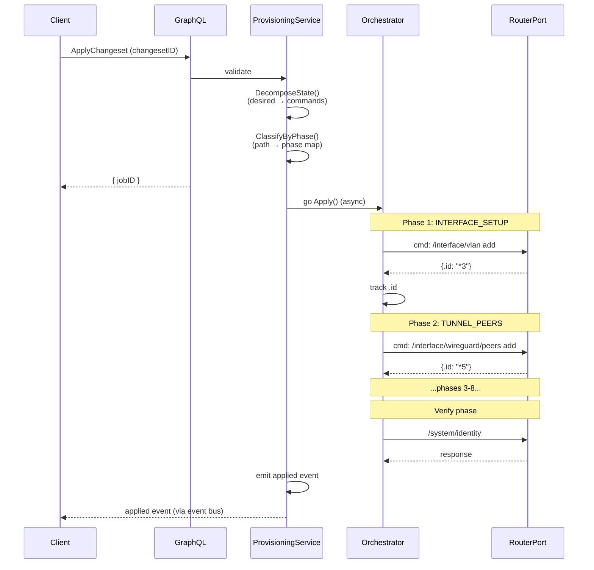
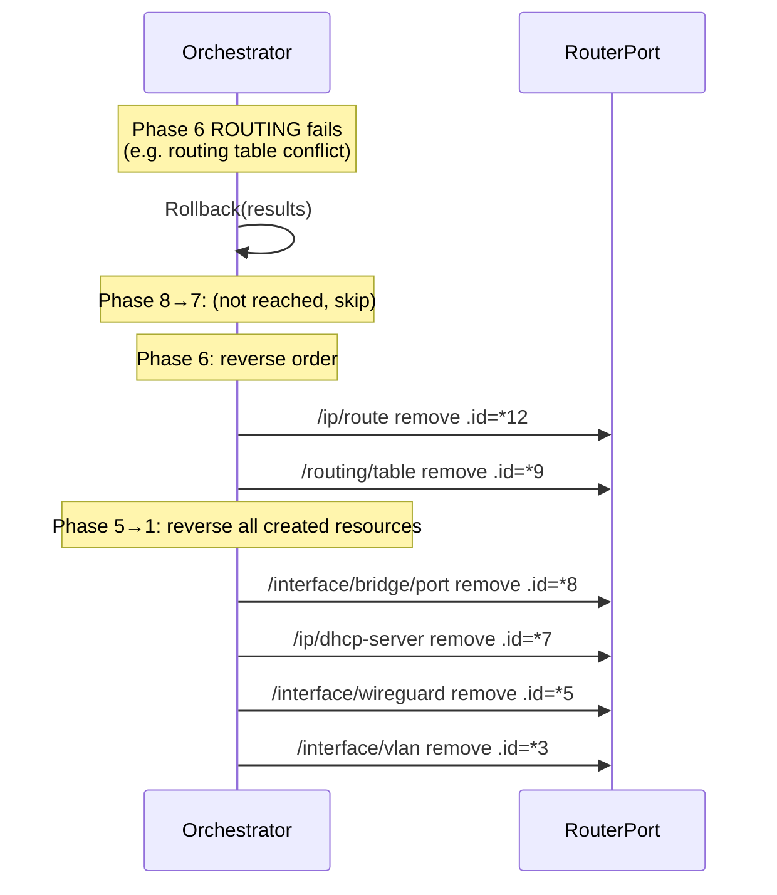

# Flow: Config Provisioning
> Traces how a desired router configuration is applied through an 8-phase pipeline, with verification and automatic rollback on failure.

**Touches:** `graph/resolver/changeset-*.resolvers.go`, `internal/provisioning/orchestrator/`, `internal/router/batch/`, `internal/services/provisioning/`
**Entry Point:** `ApplyChangeset` mutation in `graph/resolver/changeset-operations.resolvers.go`
**Prerequisites:**
- [See: 03-graphql-api.md §Changesets] — changeset creation and the Apply-Confirm-Merge pattern
- [See: 08-provisioning-engine.md] — 8-phase pipeline and phase classification
- [See: 04-router-communication.md §Batch] — batch executor and rollback mechanics

## Overview

Configuration provisioning follows the Apply-Confirm-Merge pattern. A changeset is first assembled client-side (Draft state), then submitted for application. The Orchestrator decomposes the desired state into router commands, groups them by phase, and executes them sequentially. If any phase fails, the entire operation is rolled back in reverse order (Phase 8 → Phase 1). All created resource `.id`s are tracked for precise rollback using O(1) remove commands.

## Sequence Diagram



**Rollback scenario (Phase 6 routing fails):**


## Step-by-Step Walkthrough

### Step 1: Changeset Mutation Entry
- Client calls `ApplyChangeset(changesetID)` GraphQL mutation
- **File:** `graph/resolver/changeset-operations.resolvers.go`
- Resolver loads the changeset from database (status must be `"draft"` or `"pending"`)
- Updates changeset status to `"applying"`
- Validates router connection is alive (via connection pool)
- Returns a `jobID` immediately; actual application is async

### Step 2: State Decomposition
- `ProvisioningService.Apply(ctx, changeset)` is called in a goroutine
- **File:** `internal/services/provisioning/apply.go`
- Reads the changeset's desired state (Universal State v2 8-layer model)
- Decomposes each resource layer into concrete RouterOS commands:
  - Each resource → `router.Command{Path, Action, Args}`
  - Actions: `"add"` for new resources, `"set"` for updates, `"remove"` for deletions
- Groups commands by their target RouterOS path prefix

### Step 3: Phase Classification
- `orchestrator.ClassifyResourcePath(path)` maps each command to one of 8 phases
- **File:** `internal/provisioning/orchestrator/phases.go:227`
- Uses longest-prefix matching against `AllPhases` path tables
- Phase execution order (1→8):
  1. `INTERFACE_SETUP` — bridges, WireGuard, PPPoE, VLAN, LTE, WiFi
  2. `TUNNEL_PEERS` — WireGuard peers, IPsec profiles/peers/proposals
  3. `IP_ADDRESS_POOLS` — IP pools, IP address assignments
  4. `PPP_VPN_SERVERS` — PPP profiles/secrets, VPN server endpoints
  5. `DHCP_NETWORKING` — DHCP servers, bridge ports, interface list members
  6. `ROUTING` — routing tables, static routes, PBR rules
  7. `FIREWALL` — address lists, mangle, NAT, filter, raw rules
  8. `SYSTEM_DNS` — DNS, NTP, system identity, scheduler, certificates

### Step 4: Sequential Phase Execution
- `Orchestrator.RunPhases(ctx, commands)` iterates phases 1 through 8
- **File:** `internal/provisioning/orchestrator/` (orchestrator main)
- Within each phase, commands are executed sequentially (order matters for dependencies)
- Each successful `"add"` command returns a RouterOS `.id` (e.g., `"*3"`)
- Created resource IDs are tracked in `PhaseResult.ResourceIDs[]` for rollback

### Step 5: Batch Command Execution
- `Job.Execute()` runs the actual commands through `executeCommands(ctx)`
- **File:** `internal/router/batch/executor.go` and `executor_run.go`
- Each command goes through the circuit-breaker-wrapped router adapter
- `DryRun: true` mode logs commands without executing (for preview)
- `RollbackEnabled: true` pushes inverse commands onto the `rollbackStack` as commands succeed
- Progress is tracked: `{Total, Current, Percent, Succeeded, Failed, Skipped}`

### Step 6: Command Execution via RouterPort
- Each command is translated to the protocol-specific wire format
- REST adapter: HTTP POST `/{path}/add` with JSON body
- API adapter: binary RouterOS API protocol
- SSH adapter: `/path action key=value` CLI syntax
- Router returns: `{".id": "*N"}` for created resources (RouterOS internal ID)

### Step 7: Verification Step
- After all 8 phases complete, a verification query is executed
- Queries `/system/identity` and one or two key resources to confirm changes persisted
- On success: changeset status updated to `"applied"`; `ChangesetApplied` event published

### Step 8: Rollback on Failure
- If ANY phase fails, `Orchestrator.Rollback(ctx, results)` is called
- **File:** `internal/provisioning/orchestrator/rollback.go:30`
- Iterates `results[]` in **reverse** order (Phase 8 → Phase 1)
- Within each phase, resource IDs are removed in **reverse creation order**
- For each resource: `ExecuteCommand(ctx, {Path, Action: "remove", Args: {".id": res.ID}})`
- Failures are accumulated in `RollbackResult.Errors[]` but rollback continues (best-effort)
- Only `"add"` resources are removed; `"set"` changes cannot be automatically reversed (logged)
- Final summary: `{TotalResources, Removed, Failed}` logged

## Rollback Mechanics

The rollback is precise because each successful `"add"` command captures the RouterOS `.id`:

```
PhaseResult{
  Phase: PhaseRouting,
  ResourceIDs: [
    {Path: "/routing/table", ID: "*9"},
    {Path: "/ip/route",      ID: "*12"},
  ]
}
```

Rollback removes in reverse: `/ip/route remove .id=*12` then `/routing/table remove .id=*9`.

This means rollback never queries the router to find what to remove — it uses the exact IDs returned during apply, making rollback O(1) per resource.

## Error Handling

| Phase | Failure | Recovery |
|-------|---------|----------|
| Phase 1-7 failure | Command error | Rollback phases N → 1; changeset status → `"failed"` |
| Phase 8 failure | Last phase fails | Rollback phases 8 → 1 |
| Rollback command fails | Remove fails | Log warning; continue with next resource (best-effort) |
| Connection lost mid-phase | Circuit breaker opens | Phase command returns error → triggers rollback |
| Verification fails | Resources not visible | Rollback triggered; changeset marked failed |

## Observability

**Events emitted (event bus):**
- `changeset.applying` — when application starts
- `changeset.applied` — on successful completion
- `changeset.failed` — on error with reason
- `changeset.rolled_back` — after rollback completes

**Logs generated:**
- `INFO: rolling back provisioned resource` with phase, path, and ID for each rollback
- `WARN: rollback remove failed` with error details
- `INFO: rollback complete` with total/removed/failed counts
- Phase-level progress: `INFO: executing phase N: PHASE_NAME`

**Metrics:**
- Changeset duration: tracked from `applying` → `applied` or `failed`
- Rollback success rate: `Removed / TotalResources` ratio

## Cross-References

- [See: 08-provisioning-engine.md §Phases] — phase definitions and path classifications
- [See: 08-provisioning-engine.md §Orchestrator] — orchestrator implementation details
- [See: 04-router-communication.md §Batch] — batch job executor and rollback stack
- [See: 02-application-bootstrap.md §DataArchitecture] — Universal State v2 8-layer model
- [See: 03-graphql-api.md §Changesets] — changeset GraphQL schema and mutations
