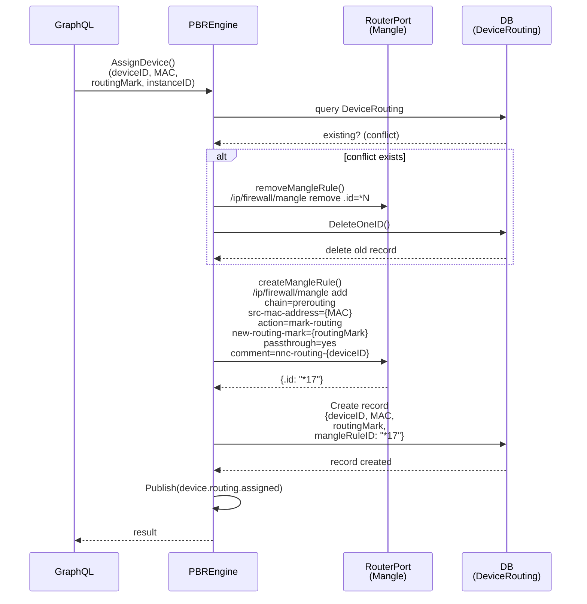
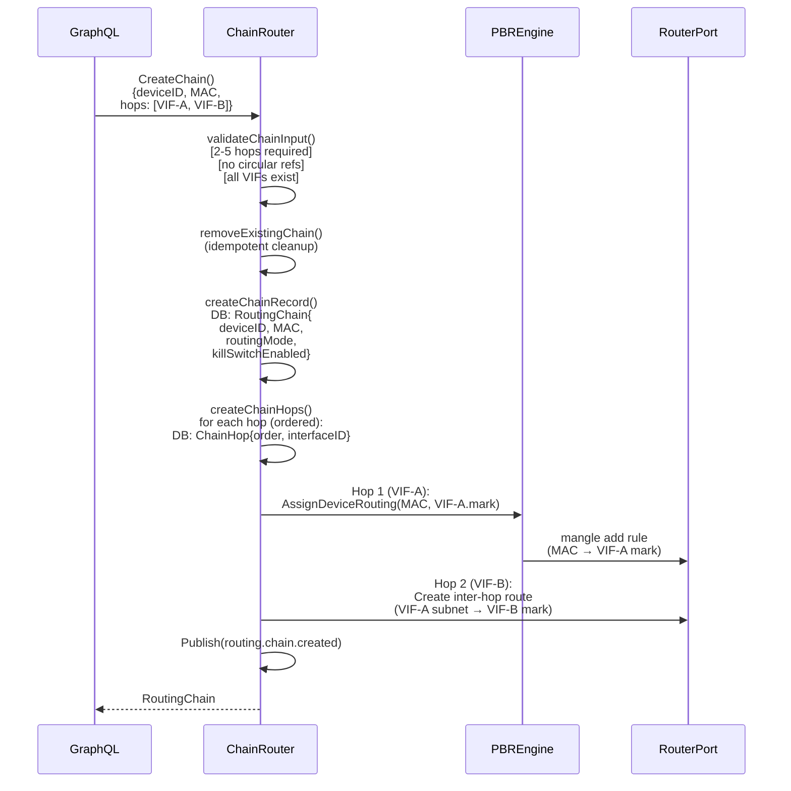
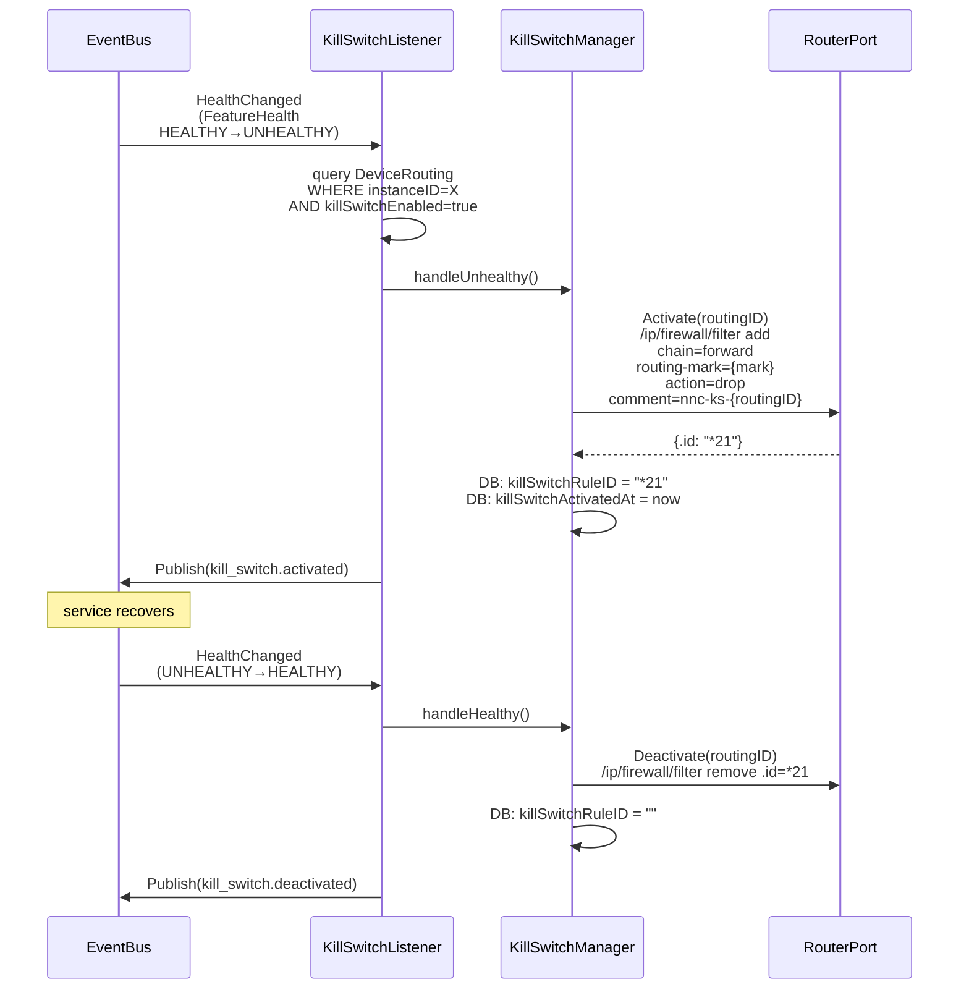

# Flow: Device Routing Chain
> Traces how a client device's traffic is steered through a multi-hop service chain (e.g., Device → VPN → Tor → Internet) using MikroTik PBR mangle rules, with kill switch enforcement on service failure.

**Touches:** `internal/vif/routing/`, `internal/vif/isolation/`, `internal/provisioning/network/`
**Entry Point:** `PBREngine.AssignDeviceRouting()` in `internal/vif/routing/pbr_engine.go`
**Prerequisites:**
- [See: 07-virtual-interface-factory.md] — VIF VLAN interface that serves as routing target
- [See: 06-service-orchestrator.md §Health] — health events that trigger kill switch

## Overview

Device routing assigns a physical LAN client device (identified by MAC address) to route its traffic through one or more NasNet service instances. For a single-hop assignment, the PBR engine creates one mangle rule. For multi-hop chains (e.g., VPN → Tor), the ChainRouter creates ordered hop records and the mangle rules link each hop's routing mark to the next. The kill switch listener monitors health events and blocks the device's internet access if any hop in the chain becomes unhealthy.

## Sequence Diagram — Single-Hop Assignment

## Sequence Diagram — Multi-Hop Chain (ChainRouter)

## Sequence Diagram — Kill Switch (Service Failure)

## Step-by-Step Walkthrough

### Step 1: Device Routing Assignment
- `PBREngine.AssignDeviceRouting(ctx, deviceID, macAddress, routingMark, instanceID)` is called
- **File:** `internal/vif/routing/pbr_engine.go:67`
- Implements the Apply-Confirm-Merge pattern:
  1. **Check conflict** — query `DeviceRouting` for existing rule with same `deviceID`
  2. **Remove conflict** — if found, remove old mangle rule from router + delete DB record
  3. **Apply** — create new mangle rule on router
  4. **Confirm** — persist `DeviceRouting` record with returned `.id`
  5. **Merge** — publish `device.routing.assigned` event

### Step 2: Mangle Rule Creation
- `createMangleRule(ctx, deviceID, macAddress, routingMark)` executes the router command
- **File:** `internal/vif/routing/pbr_engine.go:366`
- RouterOS command: `/ip/firewall/mangle add`
  - `chain=prerouting` — intercepts incoming traffic before routing decision
  - `src-mac-address={macAddress}` — matches traffic from the specific device
  - `action=mark-routing` — sets the routing mark (does NOT modify the packet)
  - `new-routing-mark={routingMark}` — the VIF's routing mark (e.g., `"tor-instance1"`)
  - `passthrough=yes` — allows other mangle rules to also process the packet
  - `comment=nnc-routing-{deviceID}` — used for reconciliation on startup
- Router returns the `.id` (e.g., `"*17"`) for O(1) removal later

### Step 3: Routing Table Lookup (RouterOS runtime)
- When the device sends a packet, RouterOS evaluates mangle rules in chain=prerouting order
- The mangle rule sets `routing-mark=tor-instance1` on matching packets
- RouterOS then looks up the routing table named `"tor-instance1"` (created by VIF factory)
- The VIF routing table has a default route: `0.0.0.0/0 via 10.99.{vlanID}.2`
- The gateway `10.99.{vlanID}.2` is the service's internal gateway (e.g., Tor transparent proxy)
- Traffic exits through the VLAN interface `nnc-tor-instance1`

### Step 4: Multi-Hop Chain Routing
- `ChainRouter.CreateRoutingChain(ctx, routerID, input)` orchestrates multi-hop routing
- **File:** `internal/vif/routing/chain_router.go:82`
- Validates input: 2-5 hops required, no duplicate interfaces (circular chain detection)
- Creates `RoutingChain` DB record with: `deviceID`, `routingMode`, `killSwitchEnabled`
- Creates ordered `ChainHop` records for each hop (with `hopOrder` field)
- For each consecutive hop pair (A→B): creates an inter-hop mangle rule:
  - Traffic arriving at Hop A's VLAN gets marked for Hop B's routing table
  - This creates a chain: Device MAC → VIF-A mark → VIF-B mark → ... → Internet

### Step 5: Latency Measurement
- `ChainLatencyMeasurer` measures latency across the chain periodically
- **File:** `internal/vif/routing/chain_latency.go`
- Sends probe packets through each hop in sequence and measures RTT
- Results stored as `ChainHop.LatencyMs` and used for chain health scoring
- High latency (>4 hop chains warned at creation: "latency may be significant")

### Step 6: Kill Switch Activation
- `KillSwitchListener.Start()` subscribes to `events.EventTypeHealthChanged`
- **File:** `internal/vif/isolation/kill_switch_listener.go:55`
- On `HEALTHY → UNHEALTHY` transition:
  - Queries all `DeviceRouting` records for `instanceID` with `killSwitchEnabled=true`
  - `KillSwitchManager.Activate(ctx, routingID)` creates a firewall filter rule:
    - `/ip/firewall/filter add chain=forward routing-mark={mark} action=drop`
    - Rule blocks all forwarded traffic for that routing mark (internet cut)
  - Stores `killSwitchRuleID` and `killSwitchActivatedAt` in DB
  - Publishes `kill_switch.activated` event

### Step 7: Kill Switch Deactivation
- On `UNHEALTHY → HEALTHY` transition:
  - `KillSwitchManager.Deactivate(ctx, routingID)` removes the filter rule:
    - `/ip/firewall/filter remove .id={killSwitchRuleID}` (O(1) via stored ID)
  - Clears `killSwitchRuleID` in DB
  - Calculates `activeFor` duration from `killSwitchActivatedAt`
  - Publishes `kill_switch.deactivated` event

### Step 8: Startup Reconciliation
- On boot, `PBREngine.ReconcileOnStartup(ctx)` handles three scenarios:
  - **Missing rules:** In DB but not on router → recreate mangle rule
  - **Orphaned rules:** On router (comment=`nnc-routing-*`) but not in DB → remove
  - **Deleted VIF cascade:** DeviceRouting references non-existent ServiceInstance → remove both
- **File:** `internal/vif/routing/pbr_engine.go:231`

## Error Handling

| Scenario | Behavior |
|----------|----------|
| Conflict removal fails | Error returned; new rule NOT created (atomic guard) |
| Mangle rule creation fails | Error returned; DB record NOT created |
| DB persist fails after mangle created | Best-effort rollback: remove the mangle rule just created |
| Kill switch activation fails | Error logged per routing; other routings still processed |
| Kill switch deactivation fails | Error logged; device remains blocked until manual intervention |
| Startup reconciliation error | Logged; startup continues (non-fatal) |

## Observability

**Events emitted (event bus):**
- `device.routing.assigned` — when a device is assigned to a service
- `device.routing.removed` — when assignment is removed
- `routing.chain.created` — when a multi-hop chain is established
- `routing.chain.removed` — when a chain is torn down
- `kill_switch.activated` — when kill switch blocks a device (with mode, reason, state)
- `kill_switch.deactivated` — when kill switch is lifted (with activeFor duration)

**Logs generated:**
- `INFO: Creating routing chain` with device_id, hop_count
- `WARN: Chain has 4+ hops - latency may be significant`
- `WARN: Failed to remove single-hop mangle rule` on chain cleanup
- `ERROR: failed to activate kill switch` with routing_id and device_id
- `INFO: Reconciliation complete` with missing/orphaned/cascade counts

## Cross-References

- [See: 07-virtual-interface-factory.md §VIF] — how VLAN interfaces and routing tables are created
- [See: 06-service-orchestrator.md §Health] — health state machine that triggers kill switch events
- [See: 08-provisioning-engine.md §Phase6] — routing table and rule provisioning in Phase 6
- [See: 05-event-system.md §HealthEvents] — FeatureHealthChangedEvent structure
