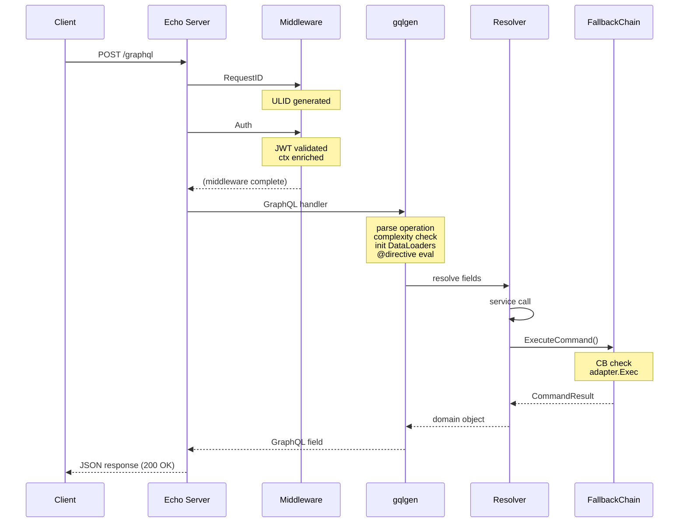
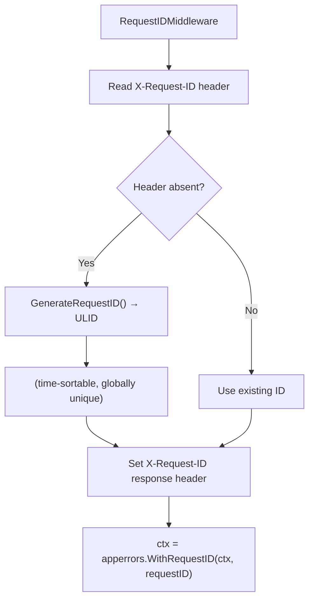
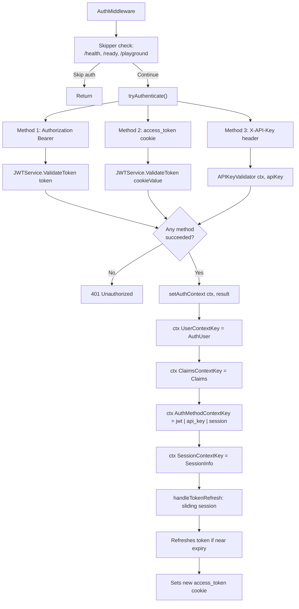
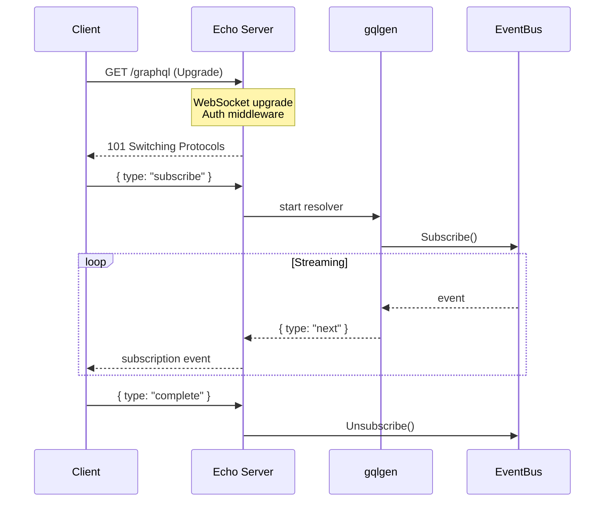

# Flow: GraphQL Request Lifecycle

> Traces the complete path of a GraphQL request from TCP arrival at the Echo HTTP server through
> middleware, directive evaluation, DataLoader batching, resolver execution, router command dispatch
> via the fallback chain, and response serialization back to the client.

**Touches:** `internal/server/`, `internal/middleware/`, `internal/graphql/directives/`,
`internal/graphql/loaders/`, `graph/resolver/`, `internal/router/` **Entry Point:** Echo HTTP
listener on `0.0.0.0:80` (production) or `0.0.0.0:8080` (development) **Prerequisites:**

- [See: 03-graphql-api.md §Resolvers] — resolver layer architecture and generated code
- [See: 04-router-communication.md §FallbackChain] — protocol negotiation and command dispatch
- [See: 12-security.md §JWT Authentication] — token validation internals

---

## Overview

Every GraphQL operation (query, mutation, or subscription) passes through a well-defined stack:
Echo's HTTP server, a middleware chain for correlation and authentication, the gqlgen-generated
executor which applies custom directives, per-request DataLoaders for batched database reads, domain
resolvers that translate operations to RouterOS commands, the fallback chain for protocol-agnostic
command dispatch, and finally error presentation and JSON serialization.

The entire path is synchronous within a single goroutine for queries/mutations. Subscriptions follow
the same middleware path but diverge at execution by establishing a WebSocket upgrade and streaming
events from the event bus.

---

## High-Level Sequence Diagram



---

## Step-by-Step Walkthrough

### Step 1: TCP Arrival and Echo Routing

The Echo HTTP server (`internal/server/server.go`) listens on `0.0.0.0:{PORT}` (defaults: 80 in
production, 8080 in development). Echo's router matches the incoming `POST /graphql` path and
dispatches to the registered GraphQL handler.

**Server configuration** (`DefaultProdConfig`):

- `ReadTimeout: 30s` — maximum time to read the full request body
- `WriteTimeout: 30s` — maximum time to write the response
- `IdleTimeout: 60s` — keep-alive idle timeout

The server uses `echo.New()` with `HideBanner: true` and `HidePort: true` for clean log output.
Graceful shutdown is managed via `SIGINT`/`SIGTERM` handling with a 15-second drain window.

**File:** `internal/server/server.go`

---

### Step 2: Middleware Stack

Middleware executes in registration order before the GraphQL handler is invoked. Two key middlewares
run for every GraphQL request:

#### 2a. Request ID Middleware

**File:** `internal/middleware/request_id.go`



The ULID is stored in context via `apperrors.WithRequestID()` and propagates through the entire call
stack. It surfaces in:

- Error responses (as `extensions.requestId`)
- Structured log fields (`request_id`)
- Event bus events emitted during request handling

**Key constant:** `RequestIDHeader = "X-Request-ID"`

#### 2b. Auth Middleware

**File:** `internal/middleware/auth.go`



The authenticated `AuthUser` is available in all downstream resolvers via
`middleware.UserFromContext(ctx)`.

**Supported auth methods:**

| Method         | Header/Cookie                    | Flow                     |
| -------------- | -------------------------------- | ------------------------ |
| JWT Bearer     | `Authorization: Bearer <token>`  | Validate → decode claims |
| Session cookie | `access_token` cookie (HttpOnly) | Validate → decode claims |
| API key        | `X-API-Key: nas_xxx`             | Call `APIKeyValidator`   |

[See: 12-security.md §JWT Authentication] for token structure and signing details.

---

### Step 3: GraphQL Handler Entry

The gqlgen-generated GraphQL handler receives the parsed HTTP request and begins operation
processing:

1. **Parse operation** — deserialize the JSON body (`{ query, variables, operationName }`)
2. **Validate schema** — check that field selections and arguments are valid per the schema
3. **Complexity calculation** — prevent expensive queries (depth limiting, field counting)
4. **DataLoader initialization** — create per-request batching loaders (see Step 4)
5. **Directive evaluation** — apply `@auth`, `@validate`, `@sensitive`, `@capability` directives
   (see Step 5)
6. **Resolver dispatch** — call root resolvers for selected fields (see Step 6)

---

### Step 4: DataLoader Initialization (Per-Request)

**Files:** `internal/graphql/loaders/resource_loader.go`,
`internal/graphql/loaders/router_loader.go`, `internal/graphql/loaders/helpers.go`

DataLoaders are initialized fresh per request (not shared across requests) to prevent cross-request
cache pollution:

```
Request context
  └─ ResourceLoader    (batches resource IDs → single DB query)
  └─ RouterLoader      (batches router IDs → single DB query)
```

**How DataLoader batching works:**

When a resolver calls `loader.Load(ctx, id)`, the DataLoader does not immediately execute a database
query. Instead, it collects all load calls made during the same scheduler tick, then fires a single
batch query:

```
Resolver A: loader.Load(ctx, "id-1")  ┐
Resolver B: loader.Load(ctx, "id-2")  ├─ collected → db.Query(WHERE id IN ("id-1","id-2","id-3"))
Resolver C: loader.Load(ctx, "id-3")  ┘
```

The `mapToResults()` helper maps batch results back to the original key order, handling partial
failures with per-key `NotFoundError`.

**Batch capacity:** 100 keys per batch (configurable). Prevents unbounded queries on large result
sets.

**After mutations:** Call `loader.Clear(ctx, id)` or `loader.ClearAll()` to invalidate cached
entries and ensure fresh reads.

---

### Step 5: Custom Directive Evaluation

**File:** `internal/graphql/directives/directives.go`

Four custom directives intercept field resolution before resolver functions execute:

#### @auth — Authorization

```
@auth(requires: "ADMIN")
  ├─ GetAuthInfo(ctx) — reads auth info placed by middleware
  ├─ authInfo.Authenticated == false → gqlerror A401 (auth/authentication-required)
  └─ requires != nil → check authInfo.Roles contains required role
      └─ missing role → gqlerror A401 (auth/insufficient-permissions)
```

Note: The HTTP-layer `AuthMiddleware` enforces authentication for all requests. The `@auth`
directive provides **field-level** role checks within already-authenticated requests.

#### @validate — Input Validation

```
@validate(minLength: 1, maxLength: 255, format: IPV4)
  ├─ Resolve field value first (calls next(ctx))
  ├─ Numeric: validateNumericRange(min, max)
  └─ String: validateStringConstraints(minLength, maxLength, pattern, format)
      └─ format: EMAIL | URL | UUID | IPV4 | IPV6 | MAC | CIDR | HOSTNAME | FQDN
```

Validation errors are returned as `gqlerror.Error` with `extensions.code = "V400"` and a
`suggestedFix` field for the client.

#### @sensitive — Log Redaction

```
@sensitive
  ├─ Track field path in ctx[sensitiveContextKey]
  └─ createValidationError() checks: if field is sensitive → value = "[REDACTED]"
```

Marks fields containing credentials or PII. The directive does not prevent the value from being
returned to the client — it prevents the value from appearing in error extensions and logs.

#### @capability — Router Feature Gating

```
@capability(requires: ["wireguard", "container"])
  ├─ GetCapabilities(ctx) — capabilities loaded per-request from CapabilityService
  ├─ Check each required cap against capMap
  └─ Missing caps → gqlerror C403 (capability/unsupported) with missingCapabilities list
```

Router capabilities are detected once per connection and cached by `CapabilityService`. They are
injected into the request context before the GraphQL handler runs.

[See: 17-validation-pipeline.md] for complete validation error structure and error codes.

---

### Step 6: Resolver Execution

**Files:** `graph/resolver/resolver.go`, `graph/resolver/common_helpers.go`

The `Resolver` struct holds references to all domain services injected at startup. Each generated
resolver file (e.g., `core-queries.resolvers.go`, `services-crud-ops.resolvers.go`) implements
methods on `*queryResolver` or `*mutationResolver` which embed `*Resolver`.

**Context helpers used in resolvers:**

```go
// Extract authenticated user
user := middleware.UserFromContext(ctx)

// Extract request ID for error correlation
requestID := apperrors.GetRequestID(ctx)

// Extract user ID (validated, returns error if unauthenticated)
userID, err := getUserIDFromContext(ctx)
```

**Typical query resolver pattern:**

```
resolver.GetRouter(ctx, id)
  ├─ middleware.UserFromContext(ctx)           → verify authenticated
  ├─ r.RouterService.GetByID(ctx, id)         → service call
  │   └─ entDB.Router.Query().Where(id)       → database read
  └─ convert ent.Router → model.Router        → return GraphQL type
```

**Typical mutation resolver pattern:**

```
resolver.UpdateFirewallRule(ctx, input)
  ├─ middleware.UserFromContext(ctx)
  ├─ validate input (service-level)
  ├─ r.RouterService.GetConnection(ctx, routerID) → get RouterPort
  ├─ build Command{Path: "/ip/firewall/filter/set", Params: {...}}
  ├─ conn.ExecuteCommand(ctx, cmd)             → send to router
  ├─ update local DB record
  └─ return updated model
```

---

### Step 7: Router Command Translation

Before commands reach the wire, they are translated from the GraphQL input model to
RouterOS-specific command parameters.

**Key layer:** `internal/router/ssh/translator.go` (SSH adapter) and
`internal/router/adapters/mikrotik/` (API/REST adapters).

The translation layer handles:

- Field name mapping (camelCase GraphQL fields → kebab-case RouterOS properties)
- Type coercion (Go booleans → `"yes"/"no"` strings for RouterOS)
- Duration formatting (Go `time.Duration` → RouterOS duration strings like `"1h30m"`)
- Enumeration mapping (GraphQL enum values → RouterOS constants)

[See: 16-translator-layer.md] for complete field mapping tables and formatter implementations.

---

### Step 8: RouterOS Command Execution via FallbackChain

**File:** `internal/router/fallback_chain.go`

Every router command executes through the `FallbackChain`, which provides:

```
FallbackChain.ExecuteCommand(ctx, cmd)
  │
  ├─ fc.mu.RLock() → get currentPort (adapter) + currentProto
  │
  ├─ CircuitBreaker.Execute(func):
  │   ├─ CB state == Open → return error (skip this protocol)
  │   ├─ CB state == HalfOpen → allow 1 test request
  │   └─ CB state == Closed → allow request
  │       └─ adapter.ExecuteCommand(ctx, cmd)
  │           ├─ REST adapter: HTTP PUT/POST to RouterOS REST API
  │           ├─ API adapter: binary RouterOS API sentence
  │           ├─ SSH adapter: SSH command via translator
  │           └─ Telnet adapter: legacy terminal commands
  │
  ├─ On success → return *CommandResult
  └─ On error:
      ├─ CB records failure
      ├─ If CB opens → go fc.attemptReconnect(background ctx)
      └─ Return error to resolver
```

**Protocol fallback order:**

```
REST → API → API+SSL → SSH → Telnet
```

Each protocol has its own circuit breaker (3 consecutive failures → open for 5 minutes).

**Automatic reconnection:** When a circuit breaker opens, a background goroutine attempts
reconnection through the fallback chain, trying each protocol in order and skipping open circuits.
Status changes are published as `RouterStatusChangedEvent` on the event bus (within 100ms).

[See: 04-router-communication.md §FallbackChain] for circuit breaker state machine and reconnection
details. [See: 15-connection-management.md] for the connection pool and per-router connection lifecycle.

---

### Step 9: Response Translation

After the router returns raw output (e.g., RouterOS API response maps or SSH parsed tables), the
translator converts it back to Go structs and then to GraphQL model types.

```
RouterOS response (map[string]string or []map[string]string)
    │
    ├─ SSH adapter: parser (terse/table/keyvalue/detail)
    ├─ API adapter: binary sentence → Go map
    └─ REST adapter: JSON → Go map
    │
    └─ Translator.ResponseToModel(rawOutput, targetType)
        └─ Field mapper: "mac-address" → MacAddress, "tx-byte" → TxBytes
        └─ Return *model.Interface or []model.FirewallRule etc.
```

---

### Step 10: Error Presentation

**File:** `internal/apperrors/` (see internal errors package)

Errors propagate up through the resolver stack as Go errors. The gqlgen error presenter converts
them to `gqlerror.Error` entries in the `errors` array of the GraphQL response.

**Error categories and codes:**

| Code   | Category   | Example                                   |
| ------ | ---------- | ----------------------------------------- |
| `V400` | Validation | `@validate` directive violation           |
| `A401` | Auth       | Missing authentication, insufficient role |
| `C403` | Capability | Router lacks required feature             |
| `N404` | Not found  | Resource not in database                  |
| `R500` | Router     | RouterOS command failed                   |
| `S503` | Service    | Backend service unavailable               |

In production mode (`GO_ENV=production`), error messages are sanitized:

- Internal implementation details stripped
- Sensitive field values redacted (`[REDACTED]`)
- Stack traces removed from response

The `requestId` field in every error extension enables correlation with server logs.

[See: 14-error-handling.md] for complete error code taxonomy, redaction rules, and suggestion generation.

---

### Step 11: Response Serialization

gqlgen assembles the final JSON response:

```json
{
  "data": {
    "router": {
      "id": "01JZABC123",
      "name": "HomeRouter",
      "interfaces": [...]
    }
  },
  "errors": [],
  "extensions": {}
}
```

For partial success (some fields errored, others succeeded): both `data` and `errors` are populated.
GraphQL clients must handle this case.

For complete failure (auth error, parse error): `data` is `null`, `errors` array is non-empty.

The HTTP status code is always `200 OK` for valid GraphQL responses, even when the `errors` array is
non-empty. HTTP 4xx/5xx are only returned for transport-level failures (malformed JSON body,
connection errors).

---

## Subscription Lifecycle (WebSocket)

Subscriptions diverge from queries/mutations after Step 2 (middleware):



Auth middleware applies identically on the WebSocket upgrade request. The subscription resolver
creates a channel, subscribes to the appropriate event bus topic, and streams events until the
client disconnects or sends `complete`.

---

## Full Timing Breakdown

| Phase                        | Typical Duration |
| ---------------------------- | ---------------- |
| TCP + Echo routing           | `<1ms`           |
| Request ID generation (ULID) | `<0.1ms`         |
| JWT validation               | 1–3ms            |
| GraphQL parse + validate     | 1–5ms            |
| Directive evaluation         | `<1ms` per field |
| DataLoader scheduling (tick) | ~1ms wait        |
| DataLoader batch DB query    | 1–10ms           |
| Resolver logic               | `<1ms`           |
| Router command (REST)        | 10–50ms          |
| Router command (SSH)         | 50–200ms         |
| Response serialization       | `<1ms`           |
| **Total (REST path)**        | **~20–70ms**     |
| **Total (SSH path)**         | **~60–220ms**    |

---

## Cross-References

- [See: 03-graphql-api.md §Resolvers] — resolver structure, generated files, schema-first
  conventions
- [See: 03-graphql-api.md §Mutations] — mutation resolver patterns, changeset flow
- [See: 04-router-communication.md §FallbackChain] — protocol selection, circuit breaker state
  machine
- [See: 12-security.md §JWT Authentication] — token structure, claims, signing algorithm
- [See: 14-error-handling.md] — error code taxonomy, redaction, suggestions
- [See: 15-connection-management.md] — connection pool, per-router lifecycle, reconnection
- [See: 16-translator-layer.md] — field mapping, type coercion, response translation
- [See: 17-validation-pipeline.md] — @validate directive constraints and error format
- [See: 05-event-system.md] — event bus topics consumed by subscription resolvers
