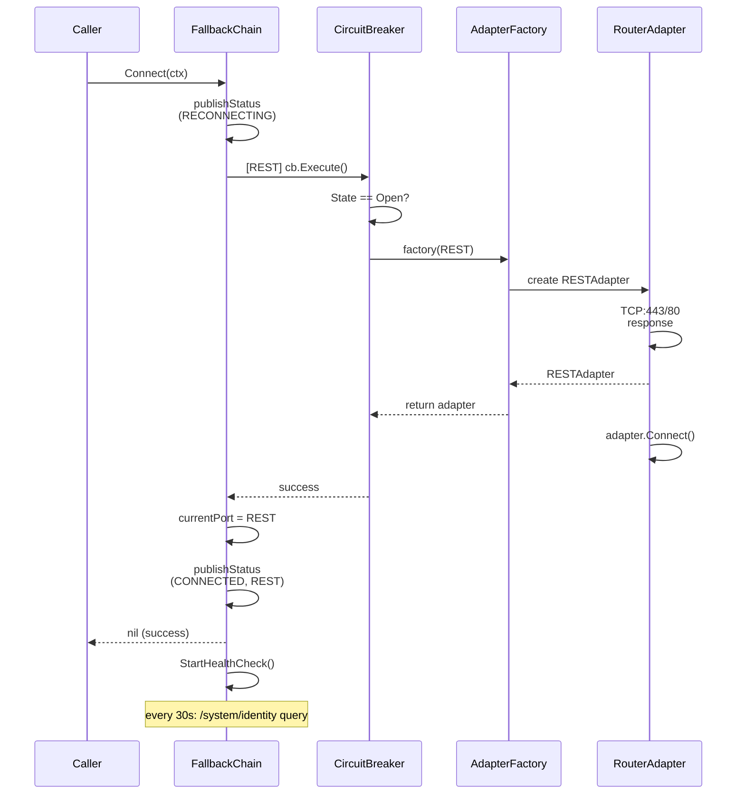
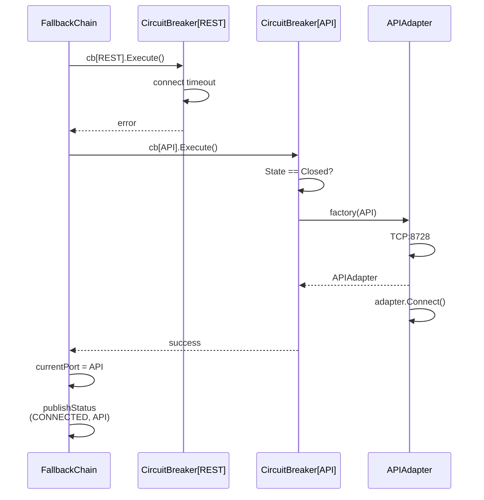

# Flow: Router Connection Establishment

> Traces how the backend connects to a MikroTik router, automatically selecting the best available
> protocol with circuit-breaker protection.

**Touches:** `internal/router/`, `internal/router/adapters/`, `internal/capability/`,
`internal/connection/` **Entry Point:** `FallbackChain.Connect(ctx)` in
`internal/router/fallback_chain.go` **Prerequisites:**

- [See: 04-router-communication.md] — adapter implementations and protocol details
- [See: 05-event-system.md] — RouterStatusChangedEvent publishing

## Overview

When a router is added or the connection drops, `FallbackChain.Connect()` attempts protocols in
priority order: REST → RouterOS API → RouterOS API+TLS → SSH → Telnet. Each protocol has an
independent circuit breaker that opens after 3 consecutive failures and stays open for 5 minutes.
Once connected, a background health check runs every 30 seconds. On reconnect or disconnect,
`RouterStatusChangedEvent` is published within 100ms.

## Sequence Diagram (Success Path)

## Sequence Diagram (Fallback Scenario)

## Step-by-Step Walkthrough

### Step 1: Connection Initiation

- `FallbackChain.Connect(ctx)` acquires the write lock (`mu.Lock()`)
- **File:** `internal/router/fallback_chain.go:161`
- Publishes `RouterStatusChangedEvent` with `status: RECONNECTING` via `publishStatusChange()`
- Iterates through `DefaultFallbackOrder = [REST, API, API_SSL, SSH, Telnet]`

### Step 2: Circuit Breaker Check

- For each protocol, retrieves the circuit breaker from `fc.breakers[proto]`
- If `cb.State() == gobreaker.StateOpen` → skip this protocol entirely
- Circuit breaker is configured with: `MaxFailures: 3`, `Timeout: 5min`, `MaxRequests: 1`
  (half-open)
- State transitions: `Closed` → `Open` (after 3 failures) → `HalfOpen` (after 5min) → `Closed` (if
  success)
- **File:** `internal/router/fallback_chain.go:144` — `createCircuitBreaker()`

### Step 3: Protocol Connection Attempt

- `cb.Execute(func() { fc.tryConnect(ctx, proto) })` wraps the attempt
- **File:** `internal/router/fallback_chain.go:209` — `tryConnect()`
- `factory(config, proto)` creates the appropriate adapter:
  - `ProtocolREST` → REST adapter via RouterOS v7+ REST API (port 80/443)
  - `ProtocolAPI` → Binary RouterOS API (port 8728)
  - `ProtocolAPISSL` → TLS-encrypted binary API (port 8729)
  - `ProtocolSSH` → SSH command execution (port 22)
  - `ProtocolTelnet` → Telnet (port 23) — legacy last resort
- `adapter.Connect(ctx)` performs the actual TCP connection and handshake

### Step 4: Capability Detection (Post-Connect)

- After successful connection, `capability.Detector.Detect(ctx, port)` is called
- **File:** `internal/capability/detector.go:26`
- Queries router in 4 steps:
  1. `/system/resource` → version, architecture, CPU count, total memory, free storage
  2. `/system/package` → installed packages (detects `container`, `wireless`, `lte`)
  3. `/system/routerboard` → hardware model (non-fatal if unavailable)
  4. `/container/config` → container enable state, registry URL
- Computes capability levels: memory tier, max containers, network namespace support
- Results stored in `Capabilities` struct — used by feature installation to check prerequisites

### Step 5: Connection Pool Registration

- The connected adapter is registered in the connection pool
- **File:** `internal/connection/pool.go`
- Pool provides reference-counted access; callers acquire/release connections
- Circuit breaker wraps every `ExecuteCommand()` and `QueryState()` call after connection
- If the circuit breaker opens during normal operation, `attemptReconnect()` is launched in
  background

### Step 6: Event Publication

- On success: `publishStatusChange(ctx, RouterStatusConnected, proto.String(), "")` is called
- **File:** `internal/router/fallback_chain.go:118`
- Uses a 100ms timeout context to avoid blocking connection operations
- Emits `RouterStatusChangedEvent` with: `routerID`, `newStatus`, `previousStatus`, `protocol`
- On total failure (all protocols exhausted): `RouterStatusError` is published with the last error

### Step 7: Health Check Background Loop

- `StartHealthCheck(ctx)` starts a goroutine with a 30-second ticker
- **File:** `internal/router/fallback_chain.go:362`
- Each tick: `QueryState(ctx, StateQuery{Path: "/system/identity", Limit: 1})`
- If query fails → logs debug warning (circuit breaker handles retry)
- If not connected → calls `attemptReconnect()` to restart the fallback chain

## Reconnection Behavior

When a command fails and the circuit breaker opens:

1. `ExecuteCommand()` returns error with "circuit breaker open"
2. Caller sees error; background `go fc.attemptReconnect(context.Background())` is launched
3. `attemptReconnect()` disconnects current adapter and restarts the full fallback chain
4. On reconnect success: new `RouterStatusConnected` event with (potentially different) protocol

## Error Handling

| Scenario                | Behavior                                                          |
| ----------------------- | ----------------------------------------------------------------- |
| All protocols fail      | `RouterStatusError` event; returns `"all protocols failed"` error |
| Circuit breaker open    | Protocol skipped; no connection attempt                           |
| Adapter factory error   | Circuit breaker counts as failure; tries next protocol            |
| Health check ping fails | Debug log; circuit breaker tracks failure; reconnect if opens     |
| Context cancelled       | Connection attempt aborted; no status published                   |

## Observability

**Events emitted (event bus):**

- `RouterStatusChangedEvent` — type `router.status.changed` — on every status transition
  (RECONNECTING → CONNECTED/ERROR/DISCONNECTED)

**Logs generated:**

- `[FallbackChain]` component tag with `host` field
- `DEBUG: attempting protocol connection` — for each protocol tried
- `INFO: connection successful` with protocol name
- `DEBUG: circuit breaker open, skipping protocol`
- `WARN: circuit breaker opened, attempting reconnect`
- `ERROR: reconnection failed, all protocols exhausted`

**Circuit breaker state:**

- `GetCircuitBreakerStates()` returns map of `Protocol → "closed/open/half-open"` for health
  endpoints

## Cross-References

- [See: 04-router-communication.md §Adapters] — REST, API, SSH, Telnet adapter implementations
- [See: 04-router-communication.md §Protocol] — adapter factory and protocol selection
- [See: 05-event-system.md §RouterStatus] — RouterStatusChangedEvent structure
- [See: 06-service-orchestrator.md §HealthCheck] — how orchestrator uses connection health
