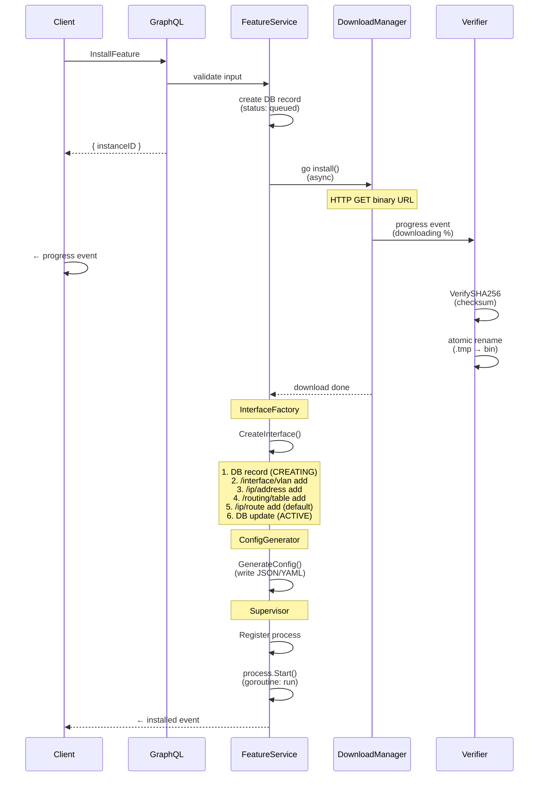

# Flow: Service Installation
> Traces the full lifecycle of installing a marketplace feature — from the GraphQL mutation to a running, supervised process.

**Touches:** `graph/resolver/`, `internal/features/`, `internal/features/verification/`, `internal/vif/`, `internal/config/services/`, `internal/orchestrator/supervisor/`
**Entry Point:** `InstallFeature` mutation in `graph/resolver/services-crud-ops.resolvers.go`
**Prerequisites:**
- [See: 03-graphql-api.md §Mutations] — GraphQL resolver layer
- [See: 07-virtual-interface-factory.md] — VIF VLAN interface creation
- [See: 06-service-orchestrator.md] — Supervisor process management

## Overview

Service installation is triggered when a user selects a marketplace feature (Tor, sing-box, Xray-core, etc.) and requests installation. The flow downloads the binary, verifies its integrity, provisions a dedicated VLAN network interface on the router, generates a service-specific config file, and finally starts the process under supervisor control with automatic restart on crash.

The installation is asynchronous: the GraphQL mutation returns immediately after validation, and progress events are streamed via subscriptions using `service.install.progress` events on the event bus.

## Sequence Diagram

## Step-by-Step Walkthrough

### Step 1: GraphQL Mutation Entry
- Client calls `InstallFeature(featureID, routerID, name)` mutation
- Resolver validates the input and checks the router connection exists
- **Key function:** `installFeature` resolver in `graph/resolver/services-crud-ops.resolvers.go`
- A `ServiceInstance` database record is created with status `"queued"`
- The mutation returns the new `instanceID` immediately (non-blocking)
- A goroutine is launched to perform the actual installation asynchronously

### Step 2: Binary Download
- `DownloadManager.Download(ctx, featureID, url, expectedChecksum)` is called
- **File:** `internal/features/download.go`
- Deduplication: if a download is already active for the same `featureID`, returns an error
- Creates directory: `{baseDir}/{featureID}/bin/`
- Downloads to a temp file `{featureID}.tmp` using HTTP with resumable support (Range headers)
- Progress is tracked every 100ms via `progressReader` and emitted as `service.install.progress` events
- For archives (tar.gz, zip): `DownloadAndExtract` downloads to `archive/` then extracts the binary

### Step 3: Checksum Verification
- After download completes, `VerifySHA256(tmpFile, expectedChecksum)` is called
- **File:** `internal/features/download.go` (delegates to `internal/features/verification/`)
- `Verifier.VerifyArchive()` reads the checksums.txt file, parses GNU sha256sum format
- Calculates the SHA256 of the downloaded file using `registry.CalculateSHA256()`
- Compares expected vs. actual hash using constant-time comparison
- On mismatch: temp file is deleted, a `verification_failed` event is emitted, error returned
- GPG verification: if `spec.RequireGPG && !spec.TrustOnFirstUse` → returns `ErrGPGNotImplemented`

### Step 4: Atomic Finalization
- On checksum success: `os.Rename(tmpFile, finalFile)` — atomic move on Linux/macOS
- `os.Chmod(finalFile, 0755)` makes the binary executable
- A `service.install.progress` event with `status: "completed"` is emitted

### Step 5: VIF Creation (Virtual Interface)
- `InterfaceFactory.CreateInterface(ctx, instanceID, featureID, instanceName, vlanID)` is called
- **File:** `internal/vif/interface_factory.go`
- Creates a DB record with `status: CREATING` first (for crash recovery)
- Executes 4 router commands in order, with LIFO cleanup (deferred rollback) on any failure:
  1. `/interface/vlan add name=nnc-{featureID}-{name} vlan-id={vlanID} interface=ether1`
  2. `/ip/address add address=10.99.{vlanID}.1/24 interface={interfaceName}`
  3. `/routing/table add name={routingMark}`
  4. `/ip/route add dst-address=0.0.0.0/0 gateway=10.99.{vlanID}.2 routing-table={routingMark}`
- On success: DB record updated to `status: ACTIVE`
- Emits `interface.created` event

### Step 6: Config Generation
- The feature-specific config generator is called based on the `featureID`
- **Files:** `internal/config/services/{featureID}.go` (e.g., `tor.go`, `singbox.go`, `xray.go`)
- Config is written to `{baseDir}/{featureID}/config/{featureID}.json` (or `.yaml`)
- Config contains: listen port, routing mark (links to VIF), log path, feature-specific settings

### Step 7: Supervisor Registration and Start
- `ManagedProcess` is created with `NewManagedProcess(ProcessConfig{...})`
- **File:** `internal/orchestrator/supervisor/process.go`
- Config includes: binary path, args, working dir, health probe, log dir, isolation strategy
- `process.Start(ctx)` transitions state to `ProcessStateStarting` and launches the `run()` goroutine
- The `run()` goroutine: starts the OS process, captures stdout/stderr via `LogCapture`, monitors for exit
- On crash: exponential backoff restart (1s initial, 2x multiplier, 30s max) if `AutoRestart: true`
- `ServiceInstance` DB record is updated to `status: "running"`

## Error Handling

| Step | Failure | Recovery |
|------|---------|----------|
| Download | Network error / timeout | Context cancellation cleans up `.tmp` file; `verification_failed` event emitted |
| Checksum | Hash mismatch | `.tmp` deleted; `verification_failed` event; installation aborted |
| VIF Creation | Router command fails | LIFO cleanup runs router `remove` commands in reverse; DB record set to `ERROR` |
| Config generation | Template error | Instance marked `error`; no process started |
| Process start | Binary not found / permission | State set to `ProcessStateCrashed`; backoff restart attempted |

## Observability

**Events emitted (on event bus):**
- `service.install.progress` — emitted every 100ms during download with `{percent, bytesDownloaded, status}`
- `interface.created` — after VIF is successfully provisioned on the router
- `service.installed` — when the full installation completes
- `service.install.failed` — if any step fails

**Logs generated:**
- `[download-manager]` — download start, progress, verification, completion
- `[interface-factory]` — VIF creation steps, rollback warnings
- `[supervisor]` — process state transitions, restart counts, backoff delays

## Cross-References

- [See: 06-service-orchestrator.md §Supervisor] — how `ManagedProcess` and `Registry` work
- [See: 07-virtual-interface-factory.md] — VIF VLAN lifecycle details
- [See: 10-feature-marketplace.md §Download] — feature manifest and registry
- [See: 05-event-system.md] — event bus publish/subscribe model
