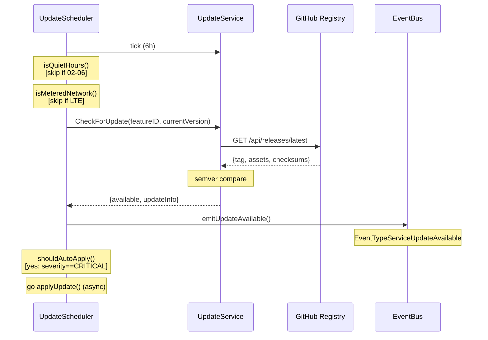
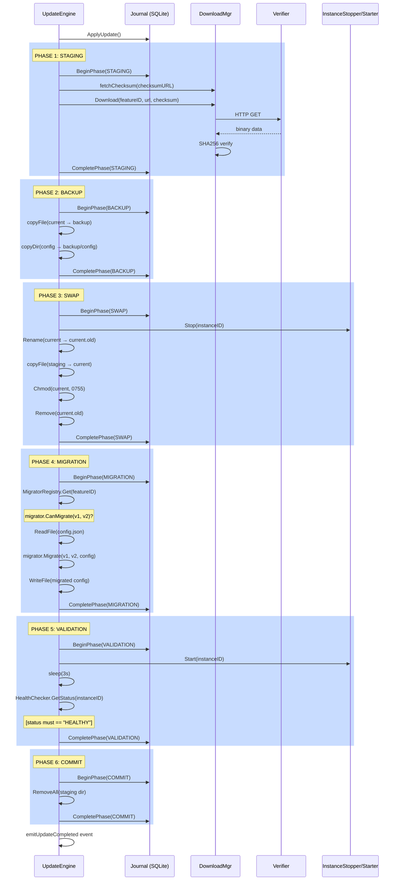
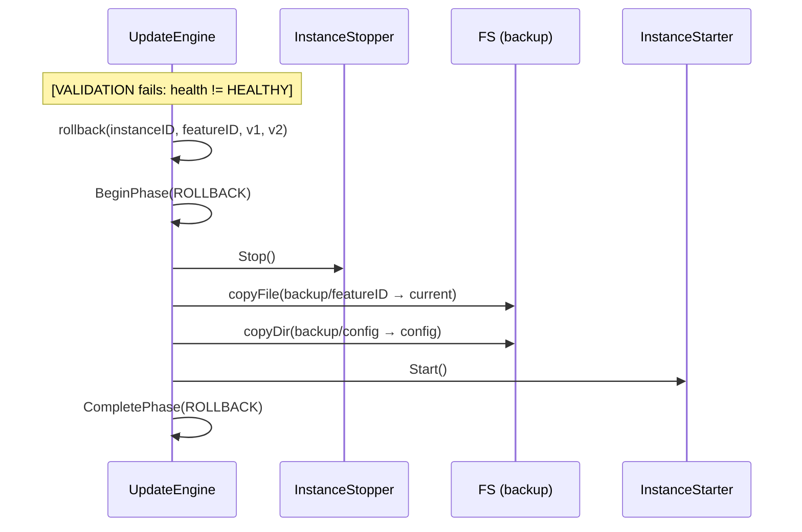

# Flow: Service Update
> Traces the lifecycle of a service binary update — from scheduled version check through atomic 6-phase swap with config migration, health validation, and crash recovery.

**Touches:** `internal/features/updates/`, `internal/registry/`
**Entry Point:** `UpdateScheduler.checkForUpdates()` in `internal/features/updates/scheduler.go`
**Prerequisites:**
- [See: 10-feature-marketplace.md §Registry] — GitHub release registry and version checking
- [See: 10-feature-marketplace.md §Download] — DownloadManager used in Staging phase
- [See: 06-service-orchestrator.md §Supervisor] — InstanceStopper/InstanceStarter used in Swap/Validation phases

## Overview

The update scheduler runs every 6 hours (configurable), checks each installed service instance against the GitHub release registry, and emits `service.update.available` events. Security-critical updates (`SeverityCritical`) are auto-applied immediately; others require user action via GraphQL mutation. The 6-phase atomic update ensures zero data loss: a backup is taken before the swap, migrations run after, and the old binary is restored if the new one fails health checks. A SQLite-backed journal provides crash recovery if the update process is interrupted mid-flight.

## Sequence Diagram — Scheduled Check



## Sequence Diagram — 6-Phase Atomic Update



**Rollback (VALIDATION fails):**


## Step-by-Step Walkthrough

### Step 1: Scheduler Tick and Gate Checks
- `UpdateScheduler.schedulerLoop()` receives a tick from `time.NewTicker(6h)`
- **File:** `internal/features/updates/scheduler.go:150`
- Gate 1: `isQuietHours()` — checks configured quiet window (default: 02:00–06:00 in configured timezone). Overnight ranges handled correctly (e.g., 22:00–06:00)
- Gate 2: `isMeteredNetwork()` — checks `NASNET_METERED_NETWORK=true` env var (or future LTE detection)
- Queries all `ServiceInstance` records from database

### Step 2: Version Check via GitHub Registry
- `UpdateService.CheckForUpdate(ctx, featureID, currentVersion)` is called per instance
- **File:** `internal/registry/github.go`
- Fetches latest release from GitHub API: `GET /repos/{owner}/{repo}/releases/latest`
- Parses semver tag (e.g., `v1.2.3`) and compares to `instance.BinaryVersion`
- If `latestVersion > currentVersion`: returns `(updateInfo, true, nil)`
- `UpdateInfo` includes: `AvailableVersion`, `DownloadURL`, `ChecksumURL`, `ReleaseNotes`, `Severity`

### Step 3: Update Available Event
- `emitUpdateAvailableEvent(instance, updateInfo)` publishes to event bus
- **File:** `internal/features/updates/scheduler.go:362`
- Event type: `service.update.available` (priority: Low)
- GraphQL subscription receives this event → frontend shows update notification

### Step 4: Auto-Apply Decision
- `shouldAutoApply(instance, updateInfo)` checks severity
- **File:** `internal/features/updates/scheduler.go:253`
- Auto-applies only `SeverityCritical` updates (security hotfixes)
- Other severities (`SeverityNormal`, `SeverityMajor`) wait for user confirmation
- Auto-apply runs in a goroutine: `go applyUpdate(instance, updateInfo)`

### Phase 1 — STAGING (Download and Verify)
- **File:** `internal/features/updates/engine.go:175`
- `Journal.BeginPhase(STAGING, metadata: {downloadURL, checksumURL})`
- Creates staging directory: `{baseDir}/updates/{featureID}/{version}/staging/`
- Fetches checksum from `checksumURL` (sha256sum format: `"hash  filename"`)
- `DownloadManager.Download(ctx, featureID, downloadURL, expectedChecksum)`
- On checksum fetch failure: proceeds without verification (best-effort)
- `Journal.CompletePhase(STAGING)`

### Phase 2 — BACKUP (Backup Current Binary and Config)
- **File:** `internal/features/updates/engine.go:216`
- `Journal.BeginPhase(BACKUP)`
- Creates backup directory: `{baseDir}/updates/{featureID}/{instanceID}/backup/{currentVersion}/`
- `copyFile(currentBinary → backupBinary)` — byte-for-byte copy
- `copyDir(configDir → backupDir/config)` — recursive directory copy (non-fatal if no config)
- `Journal.CompletePhase(BACKUP)`

### Phase 3 — SWAP (Stop Service, Atomic Binary Swap)
- **File:** `internal/features/updates/engine.go:255`
- `Journal.BeginPhase(SWAP)`
- `InstanceStopper.Stop(instanceID)` — graceful stop via supervisor
- `os.Rename(current → current.old)` — move current binary out of the way
- `copyFile(stagingBinary → currentBinary)` — copy new binary into place
  - On failure: `os.Rename(current.old → current)` restores the original
- `os.Chmod(currentBinary, 0755)` — make executable
- `os.Remove(current.old)` — cleanup
- `Journal.CompletePhase(SWAP)`
- **Triggers rollback if this fails**

### Phase 4 — MIGRATION (Config Migrations)
- **File:** `internal/features/updates/engine.go:306`
- `Journal.BeginPhase(MIGRATION)`
- `MigratorRegistry.Get(featureID)` — gets feature-specific migrator
- `migrator.CanMigrate(currentVersion, targetVersion)` — checks migration path exists
- Reads current config JSON → runs `migrator.Migrate(v1, v2, configMap)` → writes back
- If no config file: migration is skipped (non-fatal)
- `Journal.CompletePhase(MIGRATION)`
- **Triggers rollback if this fails**

### Phase 5 — VALIDATION (Start Service and Health Check)
- **File:** `internal/features/updates/engine.go:373`
- `Journal.BeginPhase(VALIDATION)`
- `InstanceStarter.Start(instanceID)` — starts via supervisor
- `time.Sleep(3s)` — wait for service to initialize
- `HealthChecker.GetStatus(instanceID)` — must return `"HEALTHY"`
- If health check fails: returns error → **triggers rollback**
- `Journal.CompletePhase(VALIDATION)`

### Phase 6 — COMMIT (Finalize)
- **File:** `internal/features/updates/engine.go:409`
- `Journal.BeginPhase(COMMIT)`
- `os.RemoveAll(stagingDir)` — cleanup temporary download
- Backup directory is retained for a rollback window (manual cleanup later)
- `Journal.CompletePhase(COMMIT)`
- Emits `service.update.completed` event with `{previousVersion, newVersion, severity}`

### Crash Recovery on Boot
- `UpdateEngine.RecoverFromCrash(ctx)` is called on application startup
- **File:** `internal/features/updates/engine.go:469`
- `Journal.GetIncompleteUpdates(ctx)` queries SQLite for rows with `status='pending'` or `status='failed'`
- For each incomplete update: `rollback(instanceID, featureID, fromVersion, toVersion)`
- Guarantees: even a power failure mid-SWAP can be recovered from

## Journal Schema

The SQLite journal (`update_journal.db`) uses WAL mode (`PRAGMA journal_mode=WAL`) and `PRAGMA synchronous=FULL` for power-safe writes:

```sql
CREATE TABLE update_journal (
  id INTEGER PRIMARY KEY,
  instance_id TEXT NOT NULL,
  feature_id  TEXT NOT NULL,
  from_version TEXT NOT NULL,
  to_version   TEXT NOT NULL,
  phase        TEXT NOT NULL,  -- STAGING/BACKUP/SWAP/MIGRATION/VALIDATION/COMMIT/ROLLBACK
  status       TEXT NOT NULL,  -- pending/success/failed
  started_at   TIMESTAMP NOT NULL,
  completed_at TIMESTAMP,
  error_message TEXT,
  metadata     TEXT,           -- JSON
  UNIQUE(instance_id, to_version, phase)
)
```

The `UNIQUE` constraint ensures idempotent `BeginPhase()` — re-running a failed phase from the same update restarts cleanly.

## Error Handling

| Phase | Failure | Recovery |
|-------|---------|----------|
| STAGING: download fails | Network error / checksum mismatch | Staging dir cleaned up; `FailPhase(STAGING)` journaled; no rollback (BACKUP not started) |
| SWAP: rename fails | Filesystem error | `current.old` restored; `FailPhase(SWAP)`; **rollback triggered** |
| MIGRATION: no migration path | Version gap | `FailPhase(MIGRATION)`; **rollback triggered** |
| VALIDATION: health check fails | Service crashes / unhealthy | **Rollback triggered** (backup restored, service restarted with old binary) |
| ROLLBACK: backup restore fails | Backup corrupted / missing | Error logged; service may be left in broken state; manual intervention required |
| Crash during SWAP | Power loss | Journal has `SWAP` as `pending` → `RecoverFromCrash` runs rollback on next boot |

## Observability

**Events emitted (event bus):**
- `service.update.available` (PriorityLow) — update detected, not yet applied
- `service.update.started` (PriorityCritical) — update application beginning
- `service.update.completed` (PriorityCritical) — update applied successfully
- `service.update.failed` (PriorityCritical) — update failed, rollback performed

**Logs generated:**
- `INFO: Starting atomic update` with instanceID, featureID, currentVersion, targetVersion
- `INFO: Starting STAGING phase`, `BACKUP phase`, etc. per phase
- `ERROR: SWAP phase failed, attempting rollback`
- `WARN: config backup skipped (no config directory or copy failed)` — non-fatal
- `INFO: Atomic update completed successfully`
- `WARN: Found incomplete updates, attempting recovery` with count

## Cross-References

- [See: 10-feature-marketplace.md §Updates] — UpdateService and UpdateInfo model
- [See: 10-feature-marketplace.md §Registry] — GitHub registry API and checksum format
- [See: 10-feature-marketplace.md §Download] — DownloadManager (reused in Staging phase)
- [See: 06-service-orchestrator.md §Supervisor] — InstanceStopper/InstanceStarter interfaces
- [See: 06-service-orchestrator.md §Health] — HealthChecker used in Validation phase
- [See: 01-service-installation-flow.md] — related initial installation flow
