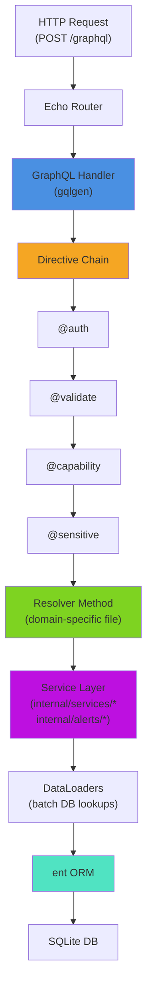
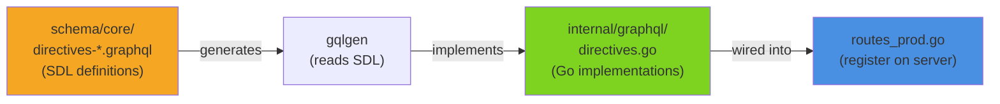
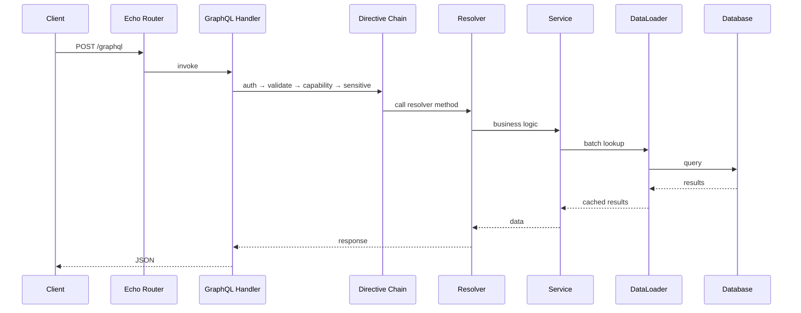
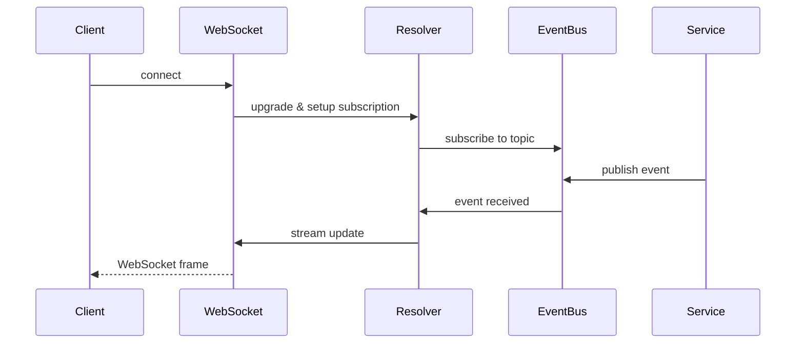

# GraphQL API Layer

> Schema-first GraphQL API with domain-organized resolvers, custom directives, and DataLoader
> batching.

**Packages:** `graph/resolver/`, `internal/graphql/directives/`, `internal/graphql/loaders/` **Key
Files:** `graph/resolver/resolver.go`, `internal/graphql/directives/directives.go`,
`internal/graphql/loaders/resource_loader.go` **Prerequisites:** [See: getting-started.md §Project
Structure], [See: application-bootstrap.md §Service Wiring]

---

## Overview

The GraphQL API is built with [gqlgen](https://gqlgen.com/) in schema-first mode. The schema (in
`schema/`) is the single source of truth; gqlgen generates Go interfaces that resolver files
implement. Resolvers are organized by domain, each in a separate file. A single `Resolver` root
struct carries all service dependencies via dependency injection.

---

## Architecture



---

## Schema Organization

The `schema/` directory contains ~150 `.graphql` files organized by domain:

| Directory             | Contents                                                         |
| --------------------- | ---------------------------------------------------------------- |
| `schema/core/`        | Router types, interface queries/mutations, directives (20 files) |
| `schema/resources/`   | Universal State resource model, 8-layer types (12 files)         |
| `schema/changeset/`   | Change set management, apply/confirm/merge flow (5 files)        |
| `schema/network/`     | VLANs, IP addressing, routing, bridges, tunnels (14 files)       |
| `schema/wan/`         | WAN interfaces, PPPoE, LTE configuration (5 files)               |
| `schema/firewall/`    | Address lists, NAT, port knocking, filter rules (10 files)       |
| `schema/diagnostics/` | Troubleshooting, traceroute, DNS lookup (8 files)                |
| `schema/storage/`     | External storage detection and management (3 files)              |
| `schema/alerts/`      | Alert rules, webhooks, notification channels (24 files)          |
| `schema/services/`    | Feature marketplace, routing, traffic control (27 files)         |
| `schema/fragments/`   | Client-side query fragments (3 files)                            |

Custom scalars (`schema/scalars.graphql`): `DateTime`, `JSON`, `IPv4`, `IPv6`, `MAC`, `CIDR`,
`Port`, `PortRange`, `Duration`, `Bandwidth`, `Size`, `ULID`.

| Scalar      | Description                                | Example                        |
| ----------- | ------------------------------------------ | ------------------------------ |
| `DateTime`  | ISO 8601 datetime string                   | `"2024-01-15T10:30:00Z"`       |
| `JSON`      | Arbitrary JSON for flexible configuration  | `{"key": "value"}`             |
| `IPv4`      | IPv4 address (XXX.XXX.XXX.XXX, 0-255 each) | `"192.168.1.1"`                |
| `IPv6`      | IPv6 address                               | `"2001:0db8::8a2e:0370:7334"`  |
| `MAC`       | MAC address (colon or dash separated)      | `"00:1A:2B:3C:4D:5E"`          |
| `CIDR`      | Network address in CIDR notation           | `"192.168.1.0/24"`             |
| `Port`      | TCP/UDP port number                        | `8080` (1-65535)               |
| `PortRange` | Port or port range string                  | `"80"`, `"80-443"`, `"80,443"` |
| `Duration`  | RouterOS-format duration string            | `"1d2h3m4s"`, `"30s"`          |
| `Bandwidth` | Bandwidth with unit                        | `"10M"`, `"1G"`, `"100k"`      |
| `Size`      | Size in bytes with optional unit           | `"1024"`, `"1k"`, `"1G"`       |
| `ULID`      | 26-char lexicographically sortable ID      | `"01ARZ3NDEKTSV4RRFFQ69G5FAV"` |

---

## Schema-Level Directives

The `schema/core/` directory defines two categories of directives: those that are **schema
annotations only** (metadata for codegen or documentation) and those that have **Go runtime
implementations** in `internal/graphql/directives/`.

### Two-Layer Directive Model



Directives defined in SDL but **without** a Go runtime implementation are **schema-only
annotations** — they attach metadata that codegen tools (gqlgen, graphql-codegen) or documentation
generators can read, but they do not intercept resolver execution.

### Platform Mapping Directives (Schema-Only)

Defined in `schema/core/core-directives-platform.graphql`. These map GraphQL fields to
router-platform API paths. The resolver layer uses this metadata for translation — the directives
themselves are not enforced at runtime by gqlgen.

#### @mikrotik

```graphql
directive @mikrotik(
  path: String! # RouterOS API path, e.g., '/ip/address'
  field: String # RouterOS field name if different from GraphQL field
  cmd: String # RouterOS command: print, add, set, remove
) on FIELD_DEFINITION | OBJECT
```

#### @openwrt

```graphql
directive @openwrt(
  ubus: String! # Ubus namespace and method, e.g., 'network.interface'
  method: String # Ubus method: list, call, etc.
  field: String # Ubus response field name if different
) on FIELD_DEFINITION | OBJECT
```

#### @vyos

```graphql
directive @vyos(
  path: String! # VyOS configuration path, e.g., 'interfaces ethernet eth0'
  field: String # VyOS response field name if different
) on FIELD_DEFINITION | OBJECT
```

### Infrastructure Directives (Schema-Only)

#### @realtime

Marks a field as supporting real-time subscription updates. `interval` and `topic` are hints for the
client and pub/sub routing layer.

```graphql
directive @realtime(
  interval: Int # Update interval in milliseconds
  topic: String # Pub/sub channel name
) on FIELD_DEFINITION
```

#### @cache

Annotates a field with caching hints. Clients and intermediary caches can use `maxAge` and `scope`
to decide cache lifetime.

```graphql
directive @cache(
  maxAge: Int! # Maximum cache age in seconds
  scope: CacheScope # PRIVATE (user-specific) or PUBLIC (shared)
) on FIELD_DEFINITION

enum CacheScope {
  PRIVATE
  PUBLIC
}
```

#### @migrateFrom

Documents field renames and deprecation paths for API consumers.

```graphql
directive @migrateFrom(
  field: String! # Old field/type name being replaced
  removeInVersion: String # Version when old field will be removed
) on FIELD_DEFINITION | OBJECT | INPUT_FIELD_DEFINITION
```

### Runtime-Implemented Directives

The following directives are defined in SDL **and** have Go runtime implementations in
`internal/graphql/directives/directives.go`. They actively intercept resolver execution.

| Directive     | Schema file                          | Go handler                | Error code |
| ------------- | ------------------------------------ | ------------------------- | ---------- |
| `@auth`       | `core-directives-platform.graphql`   | `Directives.Auth()`       | `A401`     |
| `@validate`   | `core-directives-validation.graphql` | `Directives.Validate()`   | `V400`     |
| `@sensitive`  | `core-directives-validation.graphql` | `Directives.Sensitive()`  | N/A        |
| `@capability` | `core-directives-platform.graphql`   | `Directives.Capability()` | `C403`     |

#### @validate — Applicable Locations

`@validate` applies to `INPUT_FIELD_DEFINITION | FIELD_DEFINITION | ARGUMENT_DEFINITION`. It
validates the **resolved or input value** before the next resolver in the chain runs.

```graphql
input CreateUserInput {
  email: String! @validate(format: EMAIL)
  username: String! @validate(minLength: 3, maxLength: 32, pattern: "^[a-z0-9_]+$")
  age: Int @validate(min: 0, max: 150)
}
```

`ValidateFormat` enum values: `EMAIL`, `URL`, `UUID`, `IPV4`, `IPV6`, `MAC`, `CIDR`, `HOSTNAME`,
`FQDN`.

#### @sensitive — Applicable Locations

`@sensitive` applies to `FIELD_DEFINITION | INPUT_FIELD_DEFINITION | ARGUMENT_DEFINITION`. It tracks
the field path in context; error reporting redacts the value.

```graphql
input CredentialsInput {
  username: String!
  password: String! @sensitive
  apiKey: String @sensitive
}
```

#### @auth — Applicable Locations

`@auth` applies to `FIELD_DEFINITION | OBJECT`. When applied to an object type, all fields on that
type require authentication.

```graphql
directive @auth(
  requires: String # Optional role: 'admin', 'operator', 'viewer'
) on FIELD_DEFINITION | OBJECT
```

#### @capability — Applicable Locations

`@capability` applies to `FIELD_DEFINITION | OBJECT`. All listed capabilities must be present on the
connected router or resolution is blocked.

```graphql
directive @capability(requires: [String!]!) on FIELD_DEFINITION | OBJECT
```

---

## Complexity Analysis

gqlgen supports query complexity limiting to prevent deeply nested or overly broad queries from
overloading the server. Complexity is assigned per field and accumulated over the entire query
document before execution begins.

### Configuration

Complexity is configured in the server setup (see `apps/backend/cmd/nnc/routes_prod.go`):

```go
srv := handler.NewDefaultServer(generated.NewExecutableSchema(cfg))
srv.Use(extension.FixedComplexityLimit(1000))
```

The global limit of **1000 complexity units** applies per request. Queries exceeding this limit are
rejected before any resolver executes.

### Field Complexity Rules

Individual field complexity is registered via `generated.ComplexityRoot` in `graph/generated.go`.
The default complexity is `1` per field. Lists multiply by an estimated or actual count factor:

```go
// Example: listing routers multiplies by expected result count
c.Query.Routers = func(childComplexity int, limit *int, offset *int) int {
    n := 100  // assumed max without explicit limit
    if limit != nil {
        n = *limit
    }
    return childComplexity * n
}
```

### Complexity Budget Guidelines

| Operation type              | Typical complexity |
| --------------------------- | ------------------ |
| Single field lookup         | 1                  |
| Object with 5 fields        | 5                  |
| List of 10 items × 5 fields | 50                 |
| Subscription setup          | 10                 |
| Nested list (10 × 10 × 5)   | 500                |
| Near-limit query            | ~900               |

### Introspection

Introspection queries are allowed unconditionally (they bypass complexity limiting). In production,
introspection can be disabled via:

```go
srv.Use(extension.Introspection{})  // add to disable in production
```

---

## Package Reference

### graph/resolver

#### Resolver Root Struct

`resolver.go` defines the central `Resolver` struct that all resolver methods belong to:

```go
type Resolver struct {
    db                  *ent.Client
    EventBus            events.EventBus
    EventPublisher      *events.Publisher
    authService         *auth.Service
    ScannerService      *scanner.ScannerService
    CapabilityService   *capability.Service
    RouterService       *services.RouterService
    AlertService        *services.AlertService
    InterfaceService    *services.InterfaceService
    FirewallTemplateService *firewall.TemplateService
    InstanceManager     *lifecycle.InstanceManager
    ChainRouter         *routing.ChainRouter
    PBREngine           *routing.PBREngine
    KillSwitchManager   *isolation.KillSwitchManager
    // ~40 more service fields...
}
```

**Constructor:**

```go
func NewResolverWithConfig(cfg Config) *Resolver
```

The `Config` struct mirrors the `Resolver` struct field for field. All dependencies are injected at
startup time; resolvers never construct services themselves.

**EventPublisher wiring:** if `cfg.EventBus != nil`, a `Publisher` is created automatically:

```go
r.EventPublisher = events.NewPublisher(cfg.EventBus, "graphql-resolver")
```

#### File Naming Conventions

All resolver files in `graph/resolver/` follow strict naming conventions:

| Pattern                                 | Purpose                                        | Example                                       |
| --------------------------------------- | ---------------------------------------------- | --------------------------------------------- |
| `<domain>-<operation>-ops.resolvers.go` | Primary CRUD/operations                        | `firewall-address-list-ops.resolvers.go`      |
| `<domain>-queries.resolvers.go`         | Query-only resolvers                           | `core-queries.resolvers.go`                   |
| `<domain>-mutations.resolvers.go`       | Mutation-only resolvers                        | `network-mutations.resolvers.go`              |
| `<domain>-subscriptions.resolvers.go`   | Subscription resolvers                         | `services-updates-subscriptions.resolvers.go` |
| `<domain>_helpers.go`                   | Shared private helpers (no `.resolvers.`)      | `services_crud_helpers.go`                    |
| `<domain>_helpers.resolvers.go`         | Exported helpers shared between resolver files | `device_routing_helpers.resolvers.go`         |

#### Domain Groupings

Resolver files are grouped into these domains:

| Domain prefix    | Coverage                                                                    |
| ---------------- | --------------------------------------------------------------------------- |
| `auth`           | Login, logout, session management                                           |
| `core-*`         | Router CRUD, connections, interface types, scanner                          |
| `network-*`      | Interfaces, VLANs, bridges, tunnels, port mirrors                           |
| `wan-*`          | WAN interface configuration and egress VLANs                                |
| `firewall-*`     | Address lists, NAT, port knocking, templates                                |
| `diagnostics-*`  | Traceroute, DNS lookup, circuit breaker, route lookup                       |
| `services-*`     | Feature lifecycle, traffic, routing, isolation, templates, updates, sharing |
| `alerts-*`       | Alert rules, channels, subscriptions, notification queries                  |
| `resource-*`     | Universal State resource layer                                              |
| `changeset-*`    | Apply-Confirm-Merge changesets                                              |
| `storage-*`      | External storage operations                                                 |
| `health`         | Health check resolver                                                       |
| `port-registry`  | Port allocation queries                                                     |
| `provisioning-*` | Router provisioning phases                                                  |

#### Helper Files

Helper files contain private logic shared by multiple resolver files in the same domain:

- `alert_helpers.go` - alert severity mapping, notification dispatch helpers
- `common_helpers.go` - shared pagination, context extraction utilities
- `services_crud_helpers.go` - service instance creation/update shared logic
- `services_killswitch_helpers.go` - kill switch rule management helpers
- `provisioning_helpers.go` - provisioning phase execution helpers
- `traffic_helpers.go` - traffic statistics helpers
- `port_registry_helpers.go` - port allocation helper functions

---

### internal/graphql/directives

**Package:** `internal/graphql/directives/` **Key file:** `directives.go`

#### Directives struct

```go
type Directives struct {
    config Config
}

func New(config Config) *Directives
func NewDefault() *Directives
```

Four directives are implemented:

#### @validate

Validates field values at the resolver level before the field is returned.

```go
func (d *Directives) Validate(
    ctx context.Context,
    obj interface{},
    next graphql.Resolver,
    minVal *int, maxVal *int,
    minLength *int, maxLength *int,
    pattern *string,
    format *ValidateFormat,
) (interface{}, error)
```

Supported format constants (`ValidateFormat`):

- `FormatEmail` (`"EMAIL"`) - email address
- `FormatURL` (`"URL"`) - HTTP/HTTPS URL
- `FormatUUID` (`"UUID"`) - UUID v4
- `FormatIPv4` (`"IPV4"`) - IPv4 address
- `FormatIPv6` (`"IPV6"`) - IPv6 address
- `FormatMAC` (`"MAC"`) - MAC address
- `FormatCIDR` (`"CIDR"`) - IPv4 CIDR notation
- `FormatHostname` (`"HOSTNAME"`) - single-label hostname
- `FormatFQDN` (`"FQDN"`) - fully qualified domain name

Validation errors include error code `"V400"`, the field path, the invalid value, a suggested fix,
and a docs URL.

#### @auth

Checks the request context for authentication and optional role.

```go
func (d *Directives) Auth(
    ctx context.Context,
    obj interface{},
    next graphql.Resolver,
    requires *string,
) (interface{}, error)
```

`AuthInfo` is set on the context by the HTTP middleware before resolvers run:

```go
type AuthInfo struct {
    Authenticated bool
    UserID        string
    Roles         []string
}

func WithAuthInfo(ctx context.Context, info AuthInfo) context.Context
func GetAuthInfo(ctx context.Context) (AuthInfo, bool)
```

Auth errors return code `"A401"`. Role-check failures return code `"A401"` with the required role
name.

#### @sensitive

Marks a field as containing sensitive data. Sensitive field paths are tracked in context so error
messages redact them.

```go
func (d *Directives) Sensitive(
    ctx context.Context,
    obj interface{},
    next graphql.Resolver,
) (interface{}, error)
```

Context helpers:

```go
func WithSensitiveTracking(ctx context.Context) context.Context
func GetSensitiveFields(ctx context.Context) *SensitiveFields
```

#### @capability

Checks the router's capabilities before resolving a field. Requires a list of capability strings; if
any are missing, resolution is blocked.

```go
func (d *Directives) Capability(
    ctx context.Context,
    obj interface{},
    next graphql.Resolver,
    requires []string,
) (interface{}, error)
```

Context helpers:

```go
func WithCapabilities(ctx context.Context, caps []string) context.Context
func WithCapabilitiesFromDetection(ctx context.Context, capEntries map[string]int) context.Context
func GetCapabilities(ctx context.Context) *RouterCapabilities
```

Capability errors return code `"C403"` and list which capabilities are missing.

---

### internal/graphql/loaders

**Package:** `internal/graphql/loaders/`

DataLoaders solve the N+1 query problem by batching multiple lookups into a single DB query per
request.

#### ResourceLoader

```go
type ResourceLoader struct {
    loader *dataloader.Loader[string, *ent.Resource]
}

func NewResourceLoader(db *ent.Client, stats *LoaderStats, devMode bool, logger *zap.Logger) *ResourceLoader
func (l *ResourceLoader) Load(ctx context.Context, id string) (*ent.Resource, error)
func (l *ResourceLoader) LoadAll(ctx context.Context, ids []string) ([]*ent.Resource, []error)
func (l *ResourceLoader) Clear(ctx context.Context, id string)
func (l *ResourceLoader) ClearAll()
func (l *ResourceLoader) Prime(ctx context.Context, id string, res *ent.Resource)
```

Batch capacity: 100 items. Uses `resource.IDIn(keys...)` for a single batched query.

#### RouterLoader

```go
type RouterLoader struct {
    loader *dataloader.Loader[string, *ent.Router]
}

func NewRouterLoader(db *ent.Client, stats *LoaderStats, devMode bool, logger *zap.Logger) *RouterLoader
// Same Load/LoadAll/Clear/ClearAll/Prime interface as ResourceLoader
```

#### Batch Result Mapping (helpers.go)

```go
// One-to-one: maps each key to exactly one item
func mapToResults[K comparable, V any](
    keys []K, items []V, err error, keyFunc func(V) K,
) []*dataloader.Result[V]

// One-to-many: maps each key to a slice of items
func mapToSliceResults[K comparable, V any](
    keys []K, items []V, err error, keyFunc func(V) K,
) []*dataloader.Result[[]V]
```

Error types:

```go
type NotFoundError struct{ Key interface{} }
type PartialBatchError struct {
    SuccessCount int
    FailureCount int
    Errors       map[interface{}]error
}

func IsNotFoundError(err error) bool
```

---

## Data Flow

### Query Flow



### Subscription Flow



### Mutation + Event Pattern

Most mutations follow this pattern:

```go
func (r *mutationResolver) UpdateSomething(ctx context.Context, input model.UpdateInput) (*model.Result, error) {
    // 1. Call service
    result, err := r.SomeService.Update(ctx, input)
    if err != nil {
        return nil, err
    }
    // 2. Publish domain event (for subscriptions and audit)
    if r.EventPublisher != nil {
        _ = r.EventPublisher.PublishResourceUpdated(ctx, ...)
    }
    return result, nil
}
```

---

## Configuration

The directives package is configured via `Config`:

```go
type Config struct {
    ValidateEnabled   bool  // Default: true
    AuthEnabled       bool  // Default: true
    SensitiveEnabled  bool  // Default: true
    CapabilityEnabled bool  // Default: true
}
```

All directives can be individually disabled (useful for testing).

---

## Error Handling

All directive errors follow a structured format with GraphQL extensions:

```json
{
  "errors": [{
    "message": "human readable message",
    "path": ["fieldPath"],
    "extensions": {
      "code": "V400 | A401 | C403",
      "category": "validation | auth | capability",
      "field": "$.path.to.field",
      "suggestedFix": "...",
      "docsUrl": "https://docs.nasnetconnect.io/api/errors/...",
      "requestId": "01JXXXXX",
      "recoverable": true | false
    }
  }]
}
```

Sensitive field values are automatically redacted in validation errors via `redactIfSensitive()`.

---

## Testing

**Integration tests** are in `graph/resolver/*_test.go`. They construct a real `Resolver` with mock
or in-memory services.

Key test files:

- `alerts_test.go` - alert rule CRUD and notification dispatch
- `alerts_integration_test.go` - end-to-end alert lifecycle
- `isolation_test.go` - kill switch and isolation verification
- `alert_rule_templates_test.go` - template CRUD
- `interface_stats_test.go` - telemetry query/subscription

**Directive tests** are in `internal/graphql/directives/directives_test.go`.

Test pattern:

```go
func TestSomeResolver(t *testing.T) {
    bus := events.NewInMemoryEventBus()
    r := resolver.NewResolverWithConfig(resolver.Config{
        EventBus:       bus,
        SomeService:    &mockSomeService{},
        // ...
    })
    // invoke resolver method directly
    result, err := r.Query().SomeQuery(ctx, args)
}
```

---

## Cross-References

- Event publishing in resolvers: [See: event-system.md §Publisher]
- How services are injected: [See: application-bootstrap.md §Resolver Wiring]
- Auth middleware populating AuthInfo: [See: security.md §Auth Middleware Chain]
- DataLoader usage with ent: [See: data-layer.md §DataLoaders]
- Schema codegen: run `npm run codegen:gqlgen` after modifying `.graphql` files
