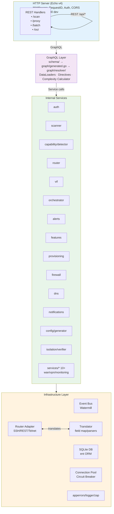

# NasNet Backend — Master Index

> A Go service that manages MikroTik routers, orchestrates downloadable network features, and
> exposes a unified GraphQL API — all from a single container running on the router itself.

---

## System Map



---

## Package Dependency Diagram

```mermaid
flowchart TD
    Main["cmd/nnc<br/>entry point"]

    Bootstrap["internal/bootstrap<br/>Wires everything together"]
    Server["internal/server<br/>Echo HTTP server<br/>middleware, static serving"]
    Database["internal/database"]
    Events["internal/events"]
    Auth["internal/auth"]
    Alerts["internal/alerts"]
    VIF["internal/vif"]
    Orchestrator["internal/orchestrator/*"]
    OrchIsolation["internal/orchestrator/isolation<br/>Process isolation verifier"]
    Features["internal/features"]
    Storage["internal/storage"]
    Config["internal/config<br/>Config generation registry<br/>6 service generators"]
    Services["internal/services<br/>10+ router sub-services<br/>WAN, VPN, monitoring, etc."]

    GraphQL["graph/resolver<br/>GraphQL resolvers"]
    GraphQLServices["internal/services<br/>domain services"]

    Router["internal/router<br/>MikroTik protocol adapters"]
    Connection["internal/connection<br/>Pool, CircuitBreaker<br/>reconnection"]
    Translator["internal/translator<br/>Field mapping, type parsers<br/>formatters"]
    Capability["internal/capability<br/>Router hardware/software<br/>detection"]

    Errors["internal/apperrors<br/>Error types, presenter<br/>redactor"]
    Logger["internal/logger<br/>Structured zap logging"]
    Network["internal/network<br/>Port registry<br/>VLAN allocator"]
    Health["internal/common/health<br/>Liveness/readiness probes"]
    Ent["generated/ent<br/>Type-safe DB access<br/>generated"]

    Main --> Bootstrap
    Bootstrap --> Server
    Bootstrap --> Database
    Bootstrap --> Events
    Bootstrap --> Auth
    Bootstrap --> Alerts
    Bootstrap --> VIF
    Bootstrap --> Orchestrator
    Orchestrator --> OrchIsolation
    Bootstrap --> Features
    Bootstrap --> Storage
    Bootstrap --> Config
    Bootstrap --> Services

    Main --> GraphQL
    GraphQL --> GraphQLServices

    Main --> Router
    Router --> Connection
    Router --> Translator
    Router --> Capability

    Main --> Errors
    Main --> Logger
    Main --> Network
    Main --> Health
    Main --> Ent

    Services -.->|widely used| Errors
    Services -.->|widely used| Logger
    Ent -.->|widely imported| Services

    style Bootstrap fill:#fff3e0
    style Main fill:#e8f5e9
    style Errors fill:#ffebee
    style Logger fill:#ffebee
    style Ent fill:#e0f2f1
```



**Key rules:**

- `internal/*` never imports `cmd/*`
- `graph/resolver` imports `internal/*` only (not `cmd/*`)
- `internal/bootstrap` is the only package allowed to import everything
- `generated/ent` is imported widely (it is a pure data layer)
- `internal/apperrors` + `internal/logger` are imported widely (cross-cutting)

---

## Table of Contents

### Getting Started & Architecture

| Document                                               | Description                                  |
| ------------------------------------------------------ | -------------------------------------------- |
| [getting-started.md](./getting-started.md)             | Dev environment, build tags, common commands |
| [application-bootstrap.md](./application-bootstrap.md) | Boot sequence, service wiring, shutdown      |
| [graphql-api.md](./graphql-api.md)                     | Schema-first GraphQL, resolvers, directives  |
| [router-communication.md](./router-communication.md)   | MikroTik adapters (SSH/REST/API/Telnet)      |
| [event-system.md](./event-system.md)                   | Watermill event bus, publishers, subscribers |

### Core Systems

| Document                                                       | Description                                         |
| -------------------------------------------------------------- | --------------------------------------------------- |
| [service-orchestrator.md](./service-orchestrator.md)           | Feature lifecycle, ProcessSupervisor, boot sequence |
| [virtual-interface-factory.md](./virtual-interface-factory.md) | VIF, VLAN allocator, kill switch, ingress           |
| [provisioning-engine.md](./provisioning-engine.md)             | 8-phase provisioning with rollback                  |
| [alert-system.md](./alert-system.md)                           | Alert rules, escalation, digest, channels           |
| [feature-marketplace.md](./feature-marketplace.md)             | Download, verify, install features                  |

### Infrastructure

| Document                                     | Description                               |
| -------------------------------------------- | ----------------------------------------- |
| [data-layer.md](./data-layer.md)             | SQLite, ent ORM, repositories, migrations |
| [security.md](./security.md)                 | Auth, JWT, encryption, middleware         |
| [network-services.md](./network-services.md) | Firewall, DNS, scanner, diagnostics       |

### Internal Systems (Phase 2)

| Document                                               | Description                                                                       |
| ------------------------------------------------------ | --------------------------------------------------------------------------------- |
| [error-handling.md](./error-handling.md)               | Error types, presenter, redactor, structured logging (zap)                        |
| [connection-management.md](./connection-management.md) | Connection pool, circuit breaker, reconnection, capability detection              |
| [translator-layer.md](./translator-layer.md)           | Field mapping, type parsers, SSH response translation, formatters                 |
| [validation-pipeline.md](./validation-pipeline.md)     | Multi-domain validation (config, router, scanner, manifest)                       |
| [config-generation.md](./config-generation.md)         | Config registry, 6 service generators (Tor/sing-box/Xray/MTProxy/Psiphon/AdGuard) |
| [process-isolation.md](./process-isolation.md)         | Isolation verifier, HTTP server, middleware stack, health probes                  |
| [router-services.md](./router-services.md)             | 10+ router sub-services, port registry, VLAN allocator                            |

### Operational

| Document                                     | Description                                                        |
| -------------------------------------------- | ------------------------------------------------------------------ |
| [build-and-deploy.md](./build-and-deploy.md) | 5-stage Dockerfile, multi-arch, UPX, `<10MB` image, runtime tuning |

### Flow Diagrams

| Document                                                                   | Description                                                        |
| -------------------------------------------------------------------------- | ------------------------------------------------------------------ |
| [flows/service-installation-flow.md](./flows/service-installation-flow.md) | End-to-end feature installation                                    |
| [flows/router-connection-flow.md](./flows/router-connection-flow.md)       | Router connect/disconnect lifecycle                                |
| [flows/alert-lifecycle-flow.md](./flows/alert-lifecycle-flow.md)           | Alert creation through delivery                                    |
| [flows/config-provisioning-flow.md](./flows/config-provisioning-flow.md)   | Config apply with rollback                                         |
| [flows/device-routing-chain-flow.md](./flows/device-routing-chain-flow.md) | PBR chain routing decisions                                        |
| [flows/service-update-flow.md](./flows/service-update-flow.md)             | Feature binary update sequence                                     |
| [flows/graphql-request-lifecycle.md](./flows/graphql-request-lifecycle.md) | Full request path: HTTP → middleware → GraphQL → router → response |

---

## Glossary

| Term                     | Definition                                                                                                                                                                 |
| ------------------------ | -------------------------------------------------------------------------------------------------------------------------------------------------------------------------- |
| **VIF**                  | Virtual Interface Factory — the subsystem that creates VLAN-isolated network interfaces on the MikroTik router for each running service instance                           |
| **PBR**                  | Policy-Based Routing — routing rules that direct traffic from specific sources through specific chains (e.g., Tor, Xray), implemented via MikroTik mangle + routing tables |
| **Feature**              | A downloadable network service (Tor, sing-box, Xray-core, MTProxy, Psiphon, AdGuard Home) described by a manifest file                                                     |
| **Service Instance**     | A running instance of a Feature — one Feature can have multiple Instances with different configs                                                                           |
| **Changeset**            | A set of pending router configuration changes batched for atomic apply/rollback                                                                                            |
| **Kill Switch**          | An isolation mechanism that drops all traffic from a service instance if its primary tunnel fails, preventing data leaks                                                   |
| **Boot Sequence**        | The ordered startup of auto-start service instances after system reboot, respecting dependency ordering                                                                    |
| **ent**                  | The type-safe Go ORM used for SQLite access, with schema defined in `internal/ent-schema/schema/` and generated code in `generated/ent/`                                   |
| **gqlgen**               | Code-generation tool that turns `schema/*.graphql` files into Go resolver interfaces and a full GraphQL server                                                             |
| **EventBus**             | The Watermill-based publish/subscribe bus used for decoupled communication between internal services                                                                       |
| **Resolver**             | A gqlgen GraphQL resolver function that executes business logic for a query, mutation, or subscription field                                                               |
| **Adapter**              | A hexagonal architecture adapter that translates between the domain port interface and an external technology (e.g., `MikroTikSSHAdapter` implements `RouterPort`)         |
| **Port**                 | A hexagonal architecture interface that defines how the domain interacts with external services (e.g., `RouterPort`, `PathResolverPort`)                                   |
| **DataLoader**           | A batching + caching mechanism (graph-gophers/dataloader) that prevents N+1 queries in GraphQL resolvers                                                                   |
| **ProcessSupervisor**    | The component that spawns, monitors, and auto-restarts OS-level processes for service instances                                                                            |
| **MockAdapter**          | The current placeholder `router.MockAdapter` used during development while `ClientFactory` is being implemented                                                            |
| **RuntimeConfig**        | Go runtime tuning: `GOMAXPROCS=1`, `GCPercent=10`, `MemoryLimit=32MB` — tuned for `<50MB` RAM constraint                                                                   |
| **CircuitBreaker**       | A gobreaker-based resilience pattern that opens after consecutive failures, preventing cascading errors to a router connection                                             |
| **ConnectionPool**       | Thread-safe map of active router connections keyed by router ID, with optional size limits and bulk close                                                                  |
| **Translator**           | The field mapping layer that converts between GraphQL camelCase field names and RouterOS kebab-case properties, with type parsing                                          |
| **FieldMappingRegistry** | Bidirectional lookup table mapping GraphQL field names to RouterOS property names for each resource path                                                                   |
| **ConfigGenerator**      | Interface implemented by each service (Tor, sing-box, etc.) to produce service-specific configuration files from validated inputs                                          |
| **IsolationVerifier**    | 4-layer verification system ensuring services run with proper IP binding, network namespace, and UID separation                                                            |
| **PortRegistry**         | Allocation service that manages TCP/UDP port assignments for service instances, preventing conflicts with reserved system ports                                            |
| **VLANAllocator**        | IEEE 802.1Q VLAN ID pool manager with automatic orphan reclaim, used by VIF to isolate service network traffic                                                             |
| **CapabilityDetector**   | 5-step detection pipeline that probes router hardware, software, container support, and version feature gates                                                              |
| **ErrorPresenter**       | gqlgen hook that transforms internal errors into structured GraphQL error responses with redaction and suggestions                                                         |
| **UPX**                  | Ultimate Packer for eXecutables — used to compress the Go binary from ~20MB to ~5MB in the Docker build                                                                    |
| **FallbackChain**        | Ordered list of router protocol adapters (SSH → REST → API → Telnet) tried sequentially until one succeeds                                                                 |

---

## Reading Paths

### New Backend Developer

1. [getting-started.md](./getting-started.md) — Set up your environment
2. [application-bootstrap.md](./application-bootstrap.md) — Understand how the app starts
3. [graphql-api.md](./graphql-api.md) — Learn how resolvers work
4. [error-handling.md](./error-handling.md) — Error types, logging, and error presentation
5. [data-layer.md](./data-layer.md) — Understand ent ORM patterns
6. [event-system.md](./event-system.md) — Learn event-driven patterns
7. [flows/graphql-request-lifecycle.md](./flows/graphql-request-lifecycle.md) — Trace a full request
   end-to-end

### Frontend Developer (GraphQL consumer)

1. [graphql-api.md](./graphql-api.md) — Schema design and conventions
2. [flows/graphql-request-lifecycle.md](./flows/graphql-request-lifecycle.md) — Full request
   lifecycle
3. [flows/router-connection-flow.md](./flows/router-connection-flow.md) — Connection lifecycle
4. [flows/alert-lifecycle-flow.md](./flows/alert-lifecycle-flow.md) — Alert subscriptions

### Ops / Deployment

1. [build-and-deploy.md](./build-and-deploy.md) — Docker build, multi-arch, image size
2. [getting-started.md](./getting-started.md) — Build commands and dev setup
3. [application-bootstrap.md](./application-bootstrap.md) — Environment variables
4. [process-isolation.md](./process-isolation.md) — HTTP server, health probes, middleware
5. [security.md](./security.md) — Auth and encryption setup

### Feature / Plugin Developer

1. [feature-marketplace.md](./feature-marketplace.md) — Manifest format
2. [config-generation.md](./config-generation.md) — Config generators per service
3. [validation-pipeline.md](./validation-pipeline.md) — Validation rules for configs and manifests
4. [service-orchestrator.md](./service-orchestrator.md) — Lifecycle hooks
5. [virtual-interface-factory.md](./virtual-interface-factory.md) — VIF and isolation
6. [flows/service-installation-flow.md](./flows/service-installation-flow.md) — Install sequence

### Router Integration Developer

1. [router-communication.md](./router-communication.md) — Protocol adapters
2. [connection-management.md](./connection-management.md) — Pool, circuit breaker, reconnection
3. [translator-layer.md](./translator-layer.md) — Field mapping and response parsing
4. [router-services.md](./router-services.md) — Service layer above RouterPort

---

## Cross-References Format

Throughout these docs, cross-references use this format:

```
[See: graphql-api.md §Resolvers]
[See: service-orchestrator.md §ProcessSupervisor]
```

The `§Section` fragment links to the named heading within the target document.
