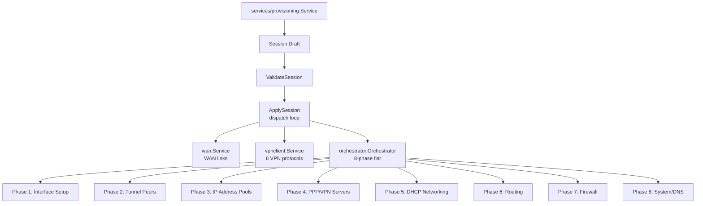
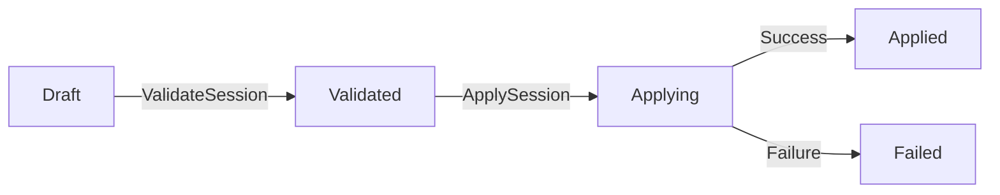
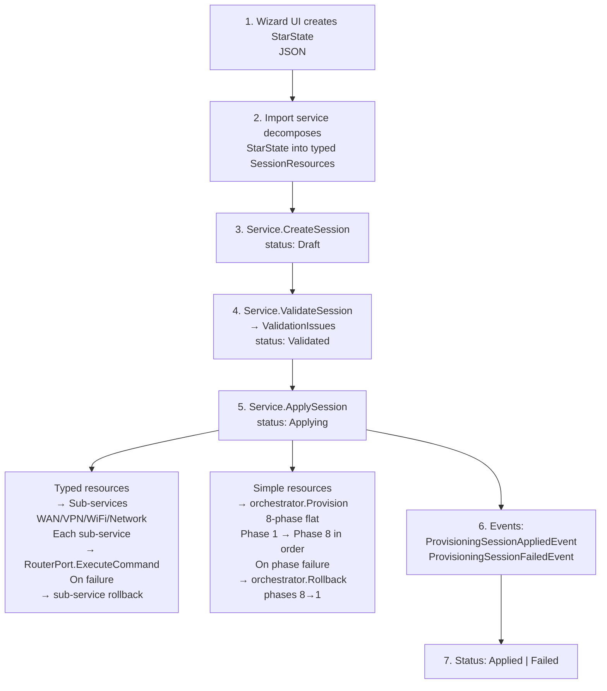

# Provisioning Engine

> Translates a wizard-configured `StarState` into live RouterOS configuration via an 8-phase ordered
> pipeline with per-step rollback.

**Packages:** `internal/provisioning/orchestrator/`, `internal/provisioning/types/`,
`internal/provisioning/network/`, `internal/provisioning/vpnclient/`,
`internal/provisioning/vpnserver/`, `internal/provisioning/wan/`, `internal/services/provisioning/`

**Key Files:** `orchestrator/phases.go`, `orchestrator/rollback.go`,
`services/provisioning/service.go`, `services/provisioning/apply.go`

**Prerequisites:** [See: 04-router-communication.md], [See: 05-event-system.md]

---

## Overview

The provisioning engine transforms an abstract wizard configuration (`StarState`) into concrete
MikroTik RouterOS commands. It is the core mechanism used by the setup wizard to configure a router
from scratch.

Key design principles:

- **Phase ordering** — resources are created in dependency order (interfaces before addresses,
  addresses before DHCP)
- **Comment tagging** — every created resource is tagged `nnc-provisioned-<sessionID>` for
  idempotent cleanup
- **Rollback on failure** — phases 8→1 are rolled back in reverse order if any phase fails
- **Protocol dispatch** — VPN protocols are handled by dedicated sub-services; generic RouterOS
  paths use the flat orchestrator

---

## Architecture



---

## Package Reference

### `orchestrator` — 8-Phase Pipeline

**Key Files:** `phases.go`, `rollback.go`

#### Phase Definitions

Eight phases are executed in strict dependency order (defined in `phases.go`):

| #   | Constant              | RouterOS Paths                                                                                                                                                                                                                                                                                                                                                |
| --- | --------------------- | ------------------------------------------------------------------------------------------------------------------------------------------------------------------------------------------------------------------------------------------------------------------------------------------------------------------------------------------------------------- |
| 1   | `PhaseInterfaceSetup` | `/interface/bridge`, `/interface/wireguard`, `/interface/pppoe-client`, `/interface/l2tp-client`, `/interface/sstp-client`, `/interface/pptp-client`, `/interface/ovpn-client`, `/interface/wifi/*`, `/interface/ipip`, `/interface/eoip`, `/interface/gre`, `/interface/vxlan`, `/interface/vlan`, `/interface/macvlan`, `/interface/lte`, `/interface/list` |
| 2   | `PhaseTunnelPeers`    | `/interface/wireguard/peers`, `/ip/ipsec/profile`, `/ip/ipsec/peer`, `/ip/ipsec/proposal`, `/ip/ipsec/mode-config`                                                                                                                                                                                                                                            |
| 3   | `PhaseIPAddressPools` | `/ip/pool`, `/ip/address`                                                                                                                                                                                                                                                                                                                                     |
| 4   | `PhasePPPVPNServers`  | `/ppp/profile`, `/ppp/secret`, `/interface/pptp-server`, `/interface/l2tp-server`, `/interface/sstp-server`, `/interface/ovpn-server`, `/ip/ipsec/identity`, `/ip/ipsec/policy`                                                                                                                                                                               |
| 5   | `PhaseDHCPNetworking` | `/interface/wifi/provisioning`, `/ip/dhcp-server/network`, `/ip/dhcp-server`, `/ip/dhcp-client`, `/interface/bridge/port`, `/interface/list/member`                                                                                                                                                                                                           |
| 6   | `PhaseRouting`        | `/routing/table`, `/ip/route`, `/routing/rule`                                                                                                                                                                                                                                                                                                                |
| 7   | `PhaseFirewall`       | `/ip/firewall/address-list`, `/ip/firewall/mangle`, `/ip/firewall/nat`, `/ip/firewall/filter`, `/ip/firewall/raw`, `/ip/upnp/interfaces`, `/ip/nat-pmp/interfaces`, `/ip/upnp`, `/ip/nat-pmp`                                                                                                                                                                 |
| 8   | `PhaseSystemDNS`      | `/ip/dns`, `/system/identity`, `/system/ntp/client`, `/system/scheduler`, `/system/script`, `/system/logging`, `/ip/service`, `/ip/cloud`, `/certificate`, and more                                                                                                                                                                                           |

#### Key Types

```go
// Phase is the numeric identifier for a pipeline step.
type Phase int

// PhaseDefinition describes a phase with its RouterOS paths.
type PhaseDefinition struct {
    Phase       Phase
    Name        string
    Description string
    Paths       []string  // RouterOS API paths this phase owns
}

// ClassifyResourcePath maps a RouterOS path to its phase using longest-prefix matching.
func ClassifyResourcePath(path string) Phase

// PhaseOrder returns all 8 phases in canonical execution order.
func PhaseOrder() []Phase
```

#### Rollback

```go
// RollbackResult summarizes a rollback operation.
type RollbackResult struct {
    TotalResources int
    Removed        int
    Failed         int
    Errors         []RollbackError
}

// Rollback removes resources in reverse phase order (8→1), within each phase
// in reverse creation order. Only "add" resources can be removed; "set" resources
// are skipped. Best-effort: all resources are attempted even if some fail.
func (o *Orchestrator) Rollback(ctx context.Context, results []PhaseResult) *RollbackResult
```

---

### `types` — Provisioning State Model

**Key Files:** `state.go`, `wan.go`, `vpnclient.go`, `vpnserver.go`, `lan.go`, `extra.go`

The `StarState` is the top-level struct that aggregates all wizard sections:

```go
type StarState struct {
    Choose     ChooseState            `json:"choose"`    // Mode, firmware, WAN type
    WAN        WANState               `json:"wan"`       // WAN links, VPN clients, DNS
    LAN        *LANState              `json:"lan"`       // Wireless, VPN server, subnets
    Extra      *ExtraConfigState      `json:"extra"`     // Identity, NTP, certificates, etc.
    ShowConfig map[string]interface{} `json:"showConfig"`
}
```

#### WAN Types (`wan.go`)

```go
type WANState struct {
    WANLink   WANLinks   // Domestic + Foreign WAN link groups
    VPNClient *VPNClient // WAN-side VPN clients
    DNSConfig *DNSConfig // Per-network DNS configuration
}

type WANLinkConfig struct {
    Name             string
    InterfaceConfig  InterfaceConfig   // Physical interface, VLAN, MAC
    ConnectionConfig *ConnectionConfig // DHCP / PPPoE / Static / LTE
    Priority         *int
    Weight           *int
}
```

Connection types: `IsDHCP`, `PPPoE` (`PPPoEConfig`), `Static` (`StaticIPConfig`), `LTESettings`.

#### VPN Client Types (`vpnclient.go`)

All VPN client configs embed `BaseVPNClientConfig` (name, priority, weight, WAN interface):

| Type                    | Protocol                                                                  |
| ----------------------- | ------------------------------------------------------------------------- |
| `WireguardClientConfig` | WireGuard (interface private key, peer public key, endpoint, allowed IPs) |
| `OpenVpnClientConfig`   | OpenVPN (server, mode, protocol, auth, cipher, certificates)              |
| `PptpClientConfig`      | PPTP (server, credentials, auth method)                                   |
| `L2tpClientConfig`      | L2TP (server, IPsec, auth, fast-path)                                     |
| `SstpClientConfig`      | SSTP (server, TLS, proxy, SNI, PFS)                                       |
| `Ike2ClientConfig`      | IKEv2/IPsec (profile, proposal, mode-config, policy, certificates)        |

#### VPN Server Types (`vpnserver.go`)

All VPN server configs embed `BaseVPNServerConfig` (enabled, profile, network):

| Type                     | Protocol                                                    |
| ------------------------ | ----------------------------------------------------------- |
| `PptpServerConfig`       | PPTP server                                                 |
| `L2tpServerConfig`       | L2TP server (IPsec, L2TPv3 support)                         |
| `SstpServerConfig`       | SSTP server (certificate, TLS)                              |
| `OpenVpnServerConfig`    | OpenVPN server (protocol, cipher, certificates)             |
| `Ike2ServerConfig`       | IKEv2 server (IPsec profile/proposal/identity/policy-group) |
| `WireguardServerConfig`  | WireGuard server (interface + peers list)                   |
| `Socks5ServerConfig`     | SOCKS5 proxy                                                |
| `SSHServerConfig`        | SSH server                                                  |
| `HTTPProxyServerConfig`  | HTTP proxy                                                  |
| `BackToHomeServerConfig` | Back-to-home routing                                        |
| `ZeroTierServerConfig`   | ZeroTier overlay                                            |

#### LAN Types (`lan.go`)

```go
type LANState struct {
    Wireless  []WirelessConfig          // WiFi networks with target network assignment
    VPNServer *VPNServer                // All VPN server configs
    Tunnel    *Tunnel                   // IPIP/EoIP/GRE/VXLAN tunnels
    Interface []EthernetInterfaceConfig // Physical port → bridge mapping
    Subnets   *Subnets                  // Per-network subnet allocations
}
```

WiFi targets: `Domestic`, `Foreign`, `VPN`, `Split`, `SingleDomestic`, `SingleForeign`, `SingleVPN`.

#### Extra Config (`extra.go`)

```go
type ExtraConfigState struct {
    RouterIdentity *RouterIdentityRomon  // Router name, RoMON
    ServiceConfig  *ServiceConfig        // API/SSH/Telnet/Winbox ports
    RUIConfig      *RUIConfig            // RouterOS UI, timezone, schedules
    CertificateConfig *CertificateConfig // Self-signed or Let's Encrypt
    NTPConfig      *NTPConfig            // NTP servers
    GraphingConfig *GraphingConfig       // Bandwidth/resource graphing
    CloudDDNSConfig *CloudDDNSConfig     // DDNS entries
    UPNPConfig     *UPNPConfig           // UPnP configuration
    NATPMPConfig   *NATPMPConfig         // NAT-PMP configuration
    UsefulServices *UsefulServicesConfig // SMTP/DNS/DHCP relay, proxy
    Games          []GameConfigEntry     // Game-specific port forwarding
}
```

---

### `network` — LAN Network Provisioning

**Key Files:** `addresslist.go`, `mangle.go`

The `network.Service` implements LAN-side provisioning (bridge, DHCP, address lists, mangle rules)
for the four-network architecture (Domestic / Foreign / VPN / Split).

```go
// createAddressListEntries creates a firewall address list entry for a network.
func (s *Service) createAddressListEntries(ctx, networkName, address, comment string) ([]string, error)

// createMangleRules creates prerouting mangle rules for policy-based routing.
// Each rule marks traffic from srcAddress with "to-<networkName>" routing mark.
func (s *Service) createMangleRules(ctx, srcAddress, networkName, comment string) ([]string, error)
```

**`MangleRuleConfig`** fields: `Chain`, `SrcAddress`, `DstAddress`, `InInterface`, `OutInterface`,
`Action` (`mark-routing`, `mark-connection`, `mark-packet`), `NewRoutingMark`, `Passthrough`.

Cleanup uses comment-based removal (`removeByComment`) for idempotency.

---

### `vpnclient` — VPN Client Provisioning

**Key Files:** `service.go`, `wireguard.go`, `ikev2.go`, `openvpn.go`, `l2tp.go`, `pptp.go`,
`sstp.go`

```go
// Service handles VPN client provisioning.
type Service struct {
    routerPort router.RouterPort
    eventBus   events.EventBus
    publisher  *events.Publisher
    logger     *zap.SugaredLogger
}

// ProvisionResult holds provisioned resource IDs and generated fields.
type ProvisionResult struct {
    RouterResourceIDs map[string]string // path → RouterOS .id
    InterfaceName     string            // Final interface name
    GeneratedFields   map[string]string // Router-generated values (e.g., WireGuard public key)
}

// ProvisionVPNClient dispatches to the appropriate protocol provisioner.
func (s *Service) ProvisionVPNClient(ctx, routerID, sessionID string, vpnClient types.VPNClient) ([]*ProvisionResult, error)
```

**WireGuard provisioning** (6 ordered steps in `wireguard.go`):

```
Step 1: /interface/wireguard          ← Create WireGuard interface (private key, listen port)
Step 2: /interface/wireguard/peers    ← Create peer (public key, endpoint, allowed IPs, keepalive=25s)
Step 3: /ip/address                   ← Assign tunnel IP address
Step 4: /interface/list/member        ← Add to "VPN-WAN" interface list (non-critical)
Step 5: /routing/table + /ip/route    ← Create "to-VPN-<name>" routing table + default route
Step 6: /ip/firewall/address-list     ← Add endpoint to "VPNE" list (prevents routing loop)
Confirm: /interface/wireguard print   ← Read back router-generated public key
```

On any step failure, `rollbackWireGuard` calls `RemoveVPNClient` which removes resources in reverse
path order.

**`RemoveVPNClient`** removal order (reverse of creation):

```
/ip/firewall/address-list → /ip/route → /routing/table → /interface/list/member →
/ip/address → /interface/wireguard/peers → /interface/wireguard →
/interface/ovpn-client → /interface/pptp-client → /interface/l2tp-client →
/interface/sstp-client → /ip/ipsec/policy → /ip/ipsec/identity →
/ip/ipsec/peer → /ip/ipsec/mode-config → /ip/ipsec/proposal → /ip/ipsec/profile
```

---

### `wan` — WAN Link Provisioning

**Key Files:** `service.go`, `dhcp_client.go`, `pppoe.go`, `static.go`, `lte.go`

```go
// Service handles WAN link provisioning.
type Service struct {
    routerPort router.RouterPort
    eventBus   events.EventBus
    logger     *zap.SugaredLogger
}

// ProvisionResult tracks what was created for a WAN link.
type ProvisionResult struct {
    InterfaceID   string // PPPoE/LTE interface .id
    DHCPClientID  string // DHCP client .id
    IPAddressID   string // Static IP address .id
    RouteID       string // Default route .id
    InterfaceName string // Final interface name
}

// ProvisionWANLink configures a WAN link in 3 steps:
//  1. Create VLAN/MACVLAN virtual interfaces if needed
//  2. Add final interface to WAN interface list
//  3. Configure connection (DHCP/PPPoE/Static/LTE)
func (s *Service) ProvisionWANLink(ctx, routerID, sessionID string, link types.WANLinkConfig, networkType string) (*ProvisionResult, error)
```

Connection dispatch:

- `IsDHCP == true` → `provisionDHCP` (creates `/ip/dhcp-client`)
- `PPPoE != nil` → `provisionPPPoE` (creates `/interface/pppoe-client`)
- `Static != nil` → `provisionStatic` (creates `/ip/address` + `/ip/route`)
- `LTESettings != nil` → `provisionLTE` (creates LTE APN profile + activates interface)

**`RemoveWANLink`** uses comment-based removal across: `/ip/dhcp-client`, `/interface/pppoe-client`,
`/ip/address`, `/ip/route`, `/interface/lte/apn`.

---

### `services/provisioning` — Session Coordinator

**Key Files:** `service.go`, `apply.go`, `import.go`, `decompose_vpnclient.go`

The top-level `Service` manages provisioning sessions and coordinates all sub-services.

```go
// Service coordinates all provisioning sub-services.
type Service struct {
    orchestrator  *orchestrator.Orchestrator
    vpnClientSvc  *vpnclient.Service
    vpnServerSvc  *vpnserver.Service
    multiWANSvc   *multiwan.Service
    networkSvc    *network.Service
    wanSvc        *wan.Service
    baseConfigSvc *baseconfig.Service
    securitySvc   *security.Service
    domesticIPSvc *domesticips.Service
    certSvc       *certificate.Service
    wifiSvc       *wifi.Service
    trunkSvc      *trunk.Service
    sessions      map[string]*Session  // In-memory session store
    // ...
}
```

#### Session Lifecycle



```go
// ValidateSession checks all session resources for config problems.
// Transitions Draft → Validated if no blocking errors.
func (s *Service) ValidateSession(ctx, sessionID string) ([]ValidationIssue, error)

// ApplySession provisions all validated resources.
// Transitions Validated → Applying → Applied | Failed.
func (s *Service) ApplySession(ctx, sessionID string) error
```

#### Resource Dispatch (`apply.go`)

`ApplySession` iterates resources and dispatches by `ResourceType` prefix:

| Resource Type Pattern | Dispatched To                                                   |
| --------------------- | --------------------------------------------------------------- |
| `wan.link.*`          | `dispatchWANLink` → `wan.Service.ProvisionWANLink`              |
| `vpn.*.client`        | `dispatchVPNClient` → `vpnclient.Service.Provision*`            |
| `vpn.*.server`        | `dispatchVPNServer` → `vpnserver.Service.Provision*`            |
| `wan.multilink.*`     | `dispatchMultiWAN` → `multiwan.Service.ProvisionMultiWAN`       |
| `system.baseconfig`   | `dispatchBaseConfig` → `baseconfig.Service.Provision`           |
| `system.security`     | `dispatchSecurity` → `security.Service.Provision`               |
| `system.certificate`  | `dispatchCertificate` → `certificate.Service.Provision*`        |
| `system.domesticips`  | `dispatchDomesticIPs` → `domesticips.Service.Provision`         |
| `system.wireless.*`   | `dispatchWifi` → `wifi.Service.ProvisionMasterAP`               |
| `lan.network.*`       | `dispatchNetwork` → `network.Service.ProvisionNetwork`          |
| _all others_          | Flat orchestrator via `sessionResourcesToProvisioningResources` |

VPN server protocol dispatch in `dispatchVPNServer`:

| Protocol     | Provisioner                 |
| ------------ | --------------------------- |
| `wireguard`  | `ProvisionWireGuardServer`  |
| `pptp`       | `ProvisionPPTPServer`       |
| `l2tp`       | `ProvisionL2TPServer`       |
| `sstp`       | `ProvisionSSTServer`        |
| `openvpn`    | `ProvisionOpenVPNServer`    |
| `ikev2`      | `ProvisionIKEv2Server`      |
| `socks5`     | `ProvisionSocks5Server`     |
| `ssh`        | `ProvisionSSHServer`        |
| `httpproxy`  | `ProvisionHTTPProxyServer`  |
| `backtohome` | `ProvisionBackToHomeServer` |
| `zerotier`   | `ProvisionZeroTierServer`   |

---

## Data Flow



---

## Configuration

All provisioned resources are tagged with comment `nnc-provisioned-<sessionID>`. This enables:

- **Idempotent cleanup** via `removeByComment` without needing stored IDs
- **Session-scoped removal** for rollback and re-provisioning
- **Audit visibility** in RouterOS resource lists

---

## Error Handling

| Scenario                              | Behavior                                                 |
| ------------------------------------- | -------------------------------------------------------- |
| Step failure in WireGuard             | Rollback all steps created so far in `rollbackWireGuard` |
| Phase failure in flat orchestrator    | `Rollback(results)` removes phases 8→1 in reverse        |
| Sub-service dispatch failure          | Session transitions to `Failed`, event published         |
| Non-critical failure (interface list) | Logged as warning, provisioning continues                |
| Context cancellation                  | Propagated through all RouterOS commands                 |
| Comment-based removal failure         | Logged as warning, best-effort cleanup continues         |

---

## Testing

- Integration tests exist in `internal/config/integration_test.go` (uses CHR Docker for router
  simulation)
- WAN provisioning: test `provisionDHCP`, `provisionPPPoE`, `provisionStatic` with mock `RouterPort`
- Orchestrator: verify phase classification via `ClassifyResourcePath`; test rollback ordering
- VPN client: mock `RouterPort.ExecuteCommand` to return resource IDs; verify 6-step WireGuard
  sequence

---

## Cross-References

- [See: 04-router-communication.md §RouterPort] — `router.RouterPort` interface used by all
  provisioners
- [See: 05-event-system.md §Events] — `ProvisioningSessionAppliedEvent`,
  `ProvisioningSessionFailedEvent`
- [See: 06-service-orchestrator.md] — Orchestrator lifecycle that calls provisioning during service install
- [See: flows/04-config-provisioning-flow.md] — End-to-end provisioning flow diagram
