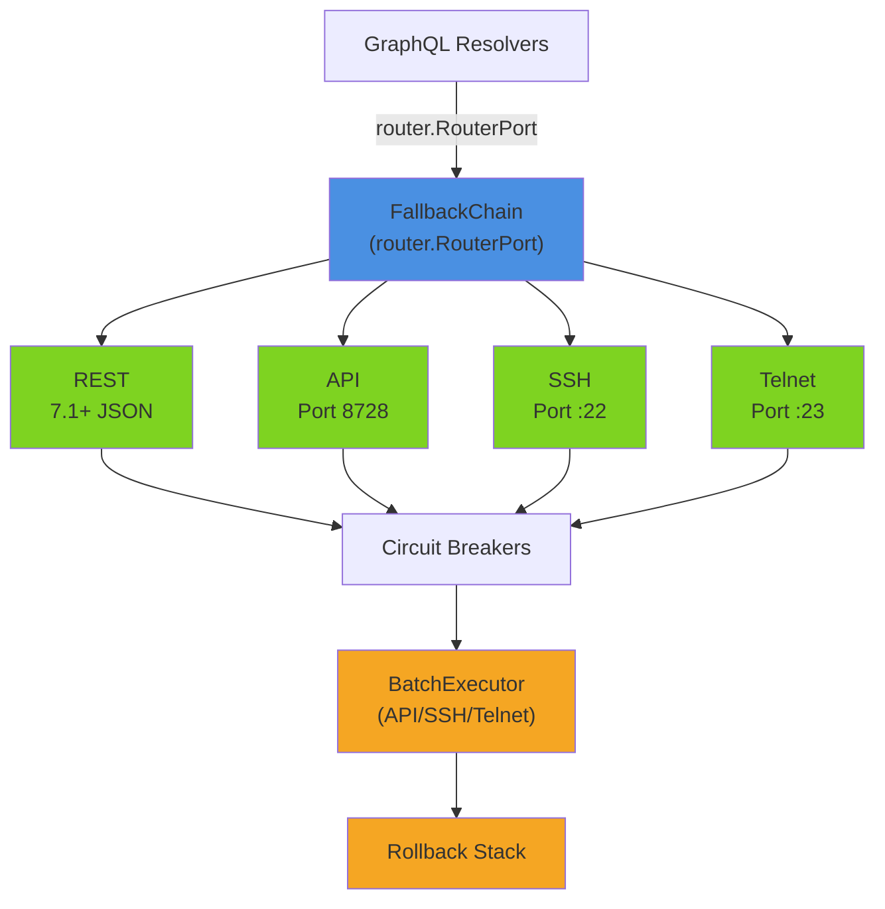

# Router Communication

> Multi-protocol adapter system with automatic fallback, circuit breaking, and batch execution for
> MikroTik RouterOS devices.

**Packages:** `internal/router/`, `internal/router/adapters/`, `internal/router/batch/`,
`internal/router/compatibility/`, `internal/router/scanner/`, `internal/router/ssh/parser/` **Key
Files:** `port.go`, `fallback_chain.go`, `connection_tester.go`, `validation.go`,
`adapters/rest_adapter.go`, `adapters/api_adapter.go`, `adapters/ssh_adapter.go`,
`adapters/telnet_adapter.go`, `batch/executor.go` **Prerequisites:** [See: getting-started.md], [See:
application-bootstrap.md
§Router Services]

## Overview

The router communication layer implements a **hexagonal architecture port** (`RouterPort`) that
abstracts over four distinct RouterOS protocols. The system automatically falls back through
protocols from fastest (REST API) to last-resort (Telnet), protecting each attempt with a
per-protocol circuit breaker.

Key capabilities:

- Protocol auto-negotiation with circuit-breaker protection
- Batch command execution with transactional rollback
- SSH/Telnet response parsing into structured data
- RouterOS version compatibility matrix
- Network scanning for router discovery

## Architecture



## Package Reference

### `internal/router` (Core Port Definition)

The central package defines the protocol interface and shared types.

**Key Types:**

```go
// RouterPort is the hexagonal port interface all adapters implement.
type RouterPort interface {
    Connect(ctx context.Context) error
    Disconnect() error
    IsConnected() bool
    Health(ctx context.Context) HealthStatus
    Capabilities() PlatformCapabilities
    Info() (*RouterInfo, error)
    ExecuteCommand(ctx context.Context, cmd Command) (*CommandResult, error)
    QueryState(ctx context.Context, query StateQuery) (*StateResult, error)
    Protocol() Protocol
}

// AdapterConfig holds connection parameters common to all adapters.
type AdapterConfig struct {
    Host     string
    Port     int
    Username string
    Password string
    Timeout  int  // seconds, default 10
    UseTLS   bool
    RouterID string
}

// Protocol fallback order (defined in fallback_chain.go):
var DefaultFallbackOrder = []Protocol{
    ProtocolREST,    // RouterOS 7.1+ JSON REST API
    ProtocolAPI,     // Binary API port 8728
    ProtocolAPISSL,  // TLS Binary API port 8729
    ProtocolSSH,     // Universal SSH fallback
    ProtocolTelnet,  // Legacy INSECURE last resort
}
```

**Key Files:**

- `port.go` — `RouterPort` interface, `AdapterConfig`, `BatchRequest`, `BatchStatus`
- `fallback_chain.go` — `FallbackChain` with circuit breakers
- `connection_tester.go` — `ConnectionTester`, `TestConnectionService`
- `validation.go` — `AddRouterInputValidator`, `ValidationError`

---

### `internal/router/adapters` (Protocol Implementations)

Four concrete adapters each implement `RouterPort`.

#### `rest_adapter.go` — RESTAdapter (RouterOS 7.1+)

Uses the RouterOS HTTP REST API (`/rest/...` endpoint). Fastest protocol, JSON-based.

```go
type RESTAdapter struct {
    config    router.AdapterConfig
    client    *http.Client
    baseURL   string  // e.g. "http://192.168.88.1:80/rest"
}
```

- **Connect:** GETs `/system/resource` to verify connectivity and detect RouterOS version. Refuses
  connection if version < 7.1.
- **ExecuteCommand:** Maps actions to HTTP methods:
  - `print`/`get` → `GET /{path}/{id?}`
  - `add` → `PUT /{path}`
  - `set` → `PATCH /{path}/{id}`
  - `remove`/`delete` → `DELETE /{path}/{id}`
  - other → `POST /{path}/{action}`
- **Authentication:** HTTP Basic Auth on every request
- **TLS:** Accepts self-signed certificates (required for RouterOS)

#### `api_adapter.go` — APIAdapter (Binary API)

Uses the `github.com/go-routeros/routeros/v3` client over port 8728 (plain) or 8729 (TLS).

```go
type APIAdapter struct {
    config  router.AdapterConfig
    client  *routeros.Client
    useTLS  bool
}
```

- **Connect:** TCP dial → `routeros.NewClient` → `client.Login(username, password)`
- **ExecuteCommand:** Translates `Command` to RouterOS API words:
  - Path: `/interface/bridge/print`
  - Args: `=name=br0`, `?disabled=false` (query filter), `=.id=*1`
- **Error translation:** Maps API-level errors (session expired, no such command, timeout) to typed
  `AdapterError`

#### `ssh_adapter.go` — SSHAdapter

Uses `golang.org/x/crypto/ssh`. Supports password + keyboard-interactive auth.

```go
type SSHAdapter struct {
    config    router.AdapterConfig
    client    *ssh.Client
    sshConfig *ssh.ClientConfig
}
```

- **Connect:** SSH dial with password auth and keyboard-interactive fallback (needed for RouterOS)
- **ExecuteCommand:** Opens a new `ssh.Session` per command. Runs CLI command with SIGKILL on
  context cancel.
- **Output Parsing:** `parseSSHOutput()` auto-detects format (table vs key-value)
- **CLI command format:** `/interface/bridge print` or `/ip/address add address=10.0.0.1/24`

#### `telnet_adapter.go` — TelnetAdapter (Legacy)

**Security Warning:** Transmits credentials in plaintext. Last resort for RouterOS 3.x-5.x devices.

```go
type TelnetAdapter struct {
    config  router.AdapterConfig
    conn    net.Conn
    reader  *bufio.Reader
}
```

- **Connect:** TCP → Telnet IAC negotiation → login sequence (reads until `Login:`, sends username,
  reads until `Password:`, sends password, reads until prompt `>`)
- **RFC 854 Negotiation:** `handleTelnetCommand()` responds WONT to all DO requests, DONT to all
  WILL requests
- **Output reading:** Reads until RouterOS prompt `]>` or `>`, strips echoed command
- Shares `parseSSHOutput()` with SSH adapter (same CLI format)

---

### `internal/router/fallback_chain.go`

`FallbackChain` orchestrates protocol selection with per-protocol circuit breakers.

```go
type FallbackChain struct {
    config        AdapterConfig
    fallbackOrder []Protocol
    breakers      map[Protocol]*gobreaker.CircuitBreaker
    factory       AdapterFactory  // creates adapters on demand
    currentPort   RouterPort
    currentProto  Protocol
    mu            sync.RWMutex
}

// CircuitBreakerSettings:
// - MaxFailures: 3 consecutive failures open the circuit
// - Timeout: 5 minutes before trying half-open
// - MaxRequests: 1 request in half-open state
```

**Behavior:**

1. `Connect()` iterates `fallbackOrder`, skipping any protocol with an open circuit breaker
2. Each attempt runs through `cb.Execute()` — failure increments the breaker counter
3. On success, `currentPort` and `currentProto` are updated
4. `ExecuteCommand()` / `QueryState()` execute through the current protocol's circuit breaker
5. If the breaker opens mid-operation, `attemptReconnect()` is triggered in a background goroutine
6. `StartHealthCheck()` pings `/system/identity` every 30 seconds; triggers reconnect if
   disconnected
7. Status changes (`RouterStatusReconnecting`, `RouterStatusConnected`, etc.) are published via
   `EventPublisher` within 100ms

---

### `internal/router/batch`

Batch execution with three protocols and optional rollback.

#### `executor.go` — Job lifecycle

```go
type Job struct {
    ID              string
    Status          JobStatus   // pending | running | completed | failed | canceled | rolled_back
    Progress        JobProgress // Total/Current/Percent/Succeeded/Failed/Skipped
    commands        []*parser.CLICommand
    rollbackStack   []*parser.RollbackCommand
}

// Job.Execute() transitions pending → running and starts executeCommands() in goroutine
// Job.Cancel() calls the stored context.CancelFunc
// Job.Rollback(client) executes rollbackStack in reverse order
```

#### `executor_run.go` — Protocol-specific execution

```go
// Route by protocol:
func (job *Job) executeCommands(ctx context.Context) {
    switch job.Protocol {
    case ProtocolSSH:    job.executeViaSSH(ctx)
    case ProtocolTelnet: job.executeViaTelnet(ctx)
    case ProtocolAPI:    job.executeViaAPI(ctx)
    }
}
```

**API execution path (`executeViaAPI`):**

1. Opens `mikrotik.ROSClient` connection
2. For each command: checks for `FindQuery` (resolve target ID via `/path/print ?field=value`)
3. Executes the API command via `client.RunWithContext()`
4. If `RollbackEnabled`: fetches `originalValues` before set/remove, generates `RollbackCommand`,
   pushes to `rollbackStack`
5. On any failure: calls `performRollback()` if rollback is enabled, then stops

**DryRun mode:** Logs commands without connecting, marks all as succeeded.

#### `executor_rollback.go` — Rollback

```go
func (job *Job) performRollback(client *mikrotik.ROSClient) {
    // Executes rollbackStack in reverse order (LIFO)
    for i := len(rollbackStack) - 1; i >= 0; i-- {
        client.Run(rb.UndoCommand.Command, rb.UndoCommand.Args...)
    }
    job.setStatus(JobStatusRolledBack)
}
```

Rollback commands are generated by `parser.GenerateRollback()` which derives the inverse operation
(e.g., `add` → generates `remove *id`; `set` → generates `set` with original values; `remove` →
generates `add` with original values).

---

### `internal/router/compatibility`

Version compatibility matrix for RouterOS features.

```go
type Service interface {
    IsFeatureSupported(featureID string, version Version, isCHR bool) bool
    GetSupportedFeatures(version Version, isCHR bool) []FeatureCompatibility
    GetFieldMapping(resource, field string, version Version) string
    GetPathMapping(resource string, version Version) string
    GetUpgradeRecommendation(featureID string, ...) *UpgradeRecommendation
}
```

- Matrix is embedded as `matrix.yaml` via `//go:embed matrix.yaml`
- Lazy-loaded on first access, cached in memory with `sync.RWMutex`
- Supports version-specific field names (e.g., `tx-rate` in v6 → `rate` in v7)
- Supports CHR-specific version ranges
- `DefaultService` is a package-level singleton; package functions delegate to it

---

### `internal/router/scanner`

Network scanning to discover RouterOS devices.

```go
// ScanIP scans a single IP for RouterOS presence.
func ScanIP(ctx context.Context, ip string, ports []int, timeout time.Duration) *Device

// Default target ports: 80, 443, 8728, 8729, 8291 (Winbox)
func DefaultConfig() Config {
    return Config{
        MaxWorkers:  20,
        Timeout:     2 * time.Second,
        TargetPorts: []int{80, 443, 8728, 8729, 8291},
    }
}
```

**Detection heuristic:**

1. Open ports 8728/8729/8291 → immediately identified as MikroTik
2. Open port 80/443 → calls `CheckRouterOSAPI()` (HTTP probe for RouterOS JSON response)
3. No MikroTik indicators → returns `nil`

```go
// ParseIPRange supports CIDR and dash range notation:
ParseIPRange("192.168.88.0/24")  // → 254 IPs
ParseIPRange("10.0.0.1-10.0.0.10")  // → 10 IPs
ParseIPRange("192.168.88.1")     // → 1 IP
```

---

### `internal/router/ssh/parser`

Multi-strategy SSH/CLI output parser.

```go
type ParserStrategy interface {
    Name() string
    Priority() int
    CanParse(raw string, hints ParseHints) bool
    Parse(ctx context.Context, raw string, hints ParseHints) (*ParseResult, error)
}
```

Four strategies (selected by priority and `CanParse` probe):

| Strategy         | Priority | Detection                                               |
| ---------------- | -------- | ------------------------------------------------------- |
| `terseParser`    | 1        | Lines match `.id=*N name=val ...` pattern               |
| `tableParser`    | 2        | `Flags:` line or column header with `#`                 |
| `keyvalueParser` | 3        | Lines with `key: value` separated by `: `               |
| `detailParser`   | 4        | Block-structured output, items separated by blank lines |

**Table parser internals (`table_parser.go`):**

- Locates header line (line starting with `#` or two+ UPPERCASE words)
- Extracts `ColumnInfo{Name, Start, End}` from fixed-width positions
- For each data row: extracts row number, flag characters (X=disabled, R=running, D=dynamic, etc.),
  then slices column values by position
- Falls back to whitespace splitting if fixed-width extraction yields < 2 fields

**Normalizer:** Applies field name normalization (e.g., `LISTEN-PORT` → `listen-port`) and type
coercion across all strategies.

---

### `internal/router/connection_tester.go`

`TestConnectionService` provides a high-level connection test without creating persistent
connections.

```go
func (s *TestConnectionService) Test(ctx context.Context, opts ConnectionOptions) *ConnectionTestResult {
    // 1. DNS resolve hostname → ResolvedIP
    // 2. Determine protocol chain (single if ProtocolPreference set, else full fallback)
    // 3. For each protocol: create adapter, Connect(), get Info() + Capabilities()
    // 4. On auth error (ErrCodeAuthFailed): stop immediately, don't try other protocols
    // 5. Return ConnectionTestResult with ProtocolUsed, ResponseTimeMs, RouterInfo
}
```

---

## Data Flow

### Connection establishment

```
GraphQL resolver calls router.Connect(ctx)
  → FallbackChain.Connect()
    → for each Protocol in [REST, API, API_SSL, SSH, Telnet]:
        if circuitBreaker.State == Open: skip
        cb.Execute(tryConnect):
          factory(config, proto) → creates adapter
          adapter.Connect(ctx)
          → success: currentPort = adapter; publish RouterStatusConnected
          → failure: cb records failure; try next protocol
    → all failed: publish RouterStatusError; return error
```

### Command execution

```
resolver calls port.ExecuteCommand(ctx, cmd)
  → FallbackChain.ExecuteCommand()
    → cb.Execute(adapter.ExecuteCommand)
      REST: HTTP GET/PUT/PATCH/DELETE → parseResponse()
      API:  routeros.Client.RunContext() → reply.Re[].Map
      SSH:  ssh.Session.Run() → parseSSHOutput()
      Telnet: TCP write + read until prompt → parseSSHOutput()
    → if cb opens: go attemptReconnect()
```

### Batch job lifecycle

```
POST /api/batch → Handler.Submit()
  → creates Job{commands, rollbackEnabled}
  → job.Execute() [goroutine]
    → executeViaAPI/SSH/Telnet(ctx)
      → for each command:
          if rollbackEnabled: fetchOriginalValues()
          executeAPICommand() / client.RunCommand()
          if success && rollbackEnabled: push to rollbackStack
          if failure && rollbackEnabled: performRollback(); return
  → GET /api/batch/{id} → job.GetStatus()
  → DELETE /api/batch/{id} → job.Cancel()
```

## Configuration

| Parameter                        | Default   | Description                      |
| -------------------------------- | --------- | -------------------------------- |
| `DefaultTimeout`                 | 10s       | Connection and command timeout   |
| `DefaultIdleTimeout`             | 5m        | Health check interval            |
| Circuit breaker `MaxFailures`    | 3         | Consecutive failures before open |
| Circuit breaker `Timeout`        | 5m        | Open state duration              |
| Scanner `MaxWorkers`             | 20        | Concurrent scan goroutines       |
| Scanner `Timeout`                | 2s        | Per-port TCP timeout             |
| Batch job max command truncation | 200 chars | For display/logging              |

## Error Handling

```go
type AdapterError struct {
    Protocol  Protocol
    Operation string  // "dial", "login", "command"
    Message   string
    Cause     error
    Retryable bool
}

type ConnectionError struct {
    Code    ErrorCode  // ErrCodeAuthFailed, ErrCodeConnectionRefused, etc.
    ...
}

// ClassifyError maps raw errors to ConnectionError codes
// ErrCodeAuthFailed prevents further protocol attempts in TestConnection
```

Validation errors use `ValidationError{Field, Code, Message, Suggestion, ProvidedValue}` returned as
`ValidationErrors` slice, enabling field-level GraphQL error presentation.

## Testing

- `connection_tester.go` provides `TestConnectionService` for testing without persistent connections
- `scanner/` functions are pure and easily unit-tested with mock TCP servers
- `adapters/` adapters verify `RouterPort` implementation with compile-time assertions:
  ```go
  var _ router.RouterPort = (*RESTAdapter)(nil)
  ```
- `compatibility/` service is tested against version range logic in `matrix.yaml`

## Cross-References

- [See: application-bootstrap.md §Router Services] — how adapters are wired at startup
- [See: event-system.md] — `RouterStatusChangedEvent` published by `FallbackChain`
- [See: data-layer.md] — `RouterRepository` manages router records in `system.db`
- `internal/connection/` — higher-level connection pool and reconnect manager built on top of this
  layer
