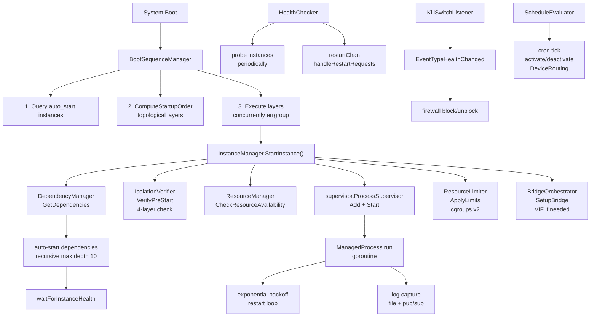
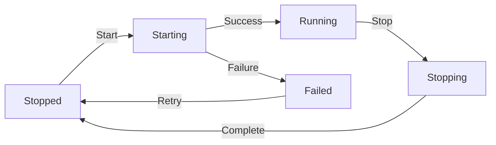
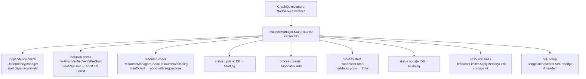
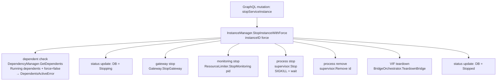

# Service Orchestrator

> Lifecycle management for downloadable feature services: boot sequencing, process supervision, isolation verification, health monitoring, and resource control.

**Packages:** `internal/orchestrator/boot/`, `internal/orchestrator/lifecycle/`, `internal/orchestrator/supervisor/`, `internal/orchestrator/resources/`, `internal/orchestrator/scheduling/`, `internal/orchestrator/health/`, `internal/orchestrator/isolation/`

**Key Files:** `boot/boot_sequence.go`, `lifecycle/lifecycle_manager.go`, `lifecycle/lifecycle_starter.go`, `lifecycle/lifecycle_stopper.go`, `supervisor/registry.go`, `supervisor/process.go`, `resources/log_capture.go`

**Prerequisites:** [See: 05-event-system.md], [See: 10-feature-marketplace.md §Feature Registry]

---

## Overview

The Service Orchestrator manages the full lifecycle of downloadable feature services (Tor, sing-box, Xray, etc.). It coordinates:

- **Boot sequencing** — topologically ordered startup on system boot
- **Instance lifecycle** — start/stop/restart with state machine transitions
- **Process supervision** — OS-level process management with exponential backoff restart
- **Pre-start checks** — isolation verification and resource pre-flight
- **Health monitoring** — probe-based health checks with auto-restart
- **Log capture** — file-based log rotation with real-time pub/sub
- **Schedule evaluation** — cron-driven device routing activation/deactivation
- **Kill switch** — traffic isolation when services go unhealthy

---

## Architecture



---

## Package Reference

### `orchestrator/boot`

Orchestrates system-wide startup of all `auto_start=true` service instances in dependency order.

**Key Types**

| Type | Description |
|------|-------------|
| `BootSequenceManager` | Main coordinator for system boot |
| `BootSequenceManagerConfig` | Configuration struct |
| `InstanceStarter` | Interface — `StartInstance(ctx, instanceID) error` |

**Key Functions**

```go
func NewBootSequenceManager(cfg BootSequenceManagerConfig) (*BootSequenceManager, error)
func (bsm *BootSequenceManager) ExecuteBootSequence(ctx context.Context) error
```

**Execution Flow**

1. `collectAutoStartInstances` — queries `ServiceInstance WHERE auto_start = true`
2. `computeStartupLayers` — delegates to `DependencyManager.ComputeStartupOrder` (topological sort)
3. `executeLayers` — layers are run sequentially; instances within a layer start concurrently via `errgroup`
4. Per-instance timeout: **60 seconds**
5. Events published: `BootSequenceStarted`, `BootSequenceLayerComplete`, `BootSequenceComplete`, `BootSequenceFailed`

**Partial Boot**

If any layer fails, the boot sequence halts and returns an error. Successfully started instances remain running. This is intentional — dependencies must be healthy before dependents start.

---

### `orchestrator/lifecycle`

The `InstanceManager` is the central orchestrator for runtime lifecycle operations. It implements `InstanceStarter` and delegates to the supervisor.

**Key Types**

| Type | Description |
|------|-------------|
| `InstanceManager` | Core lifecycle coordinator |
| `InstanceManagerConfig` | Wires all dependencies |
| `InstanceStatus` | State machine values |
| `DependentsActiveError` | Returned when stopping with running dependents |
| `GatewayPort` | Interface for SOCKS-to-TUN gateway |
| `BridgeOrchestrator` | Interface for VIF bridge setup |

**InstanceManagerConfig Fields**

```go
type InstanceManagerConfig struct {
    Registry           *features.FeatureRegistry
    DownloadMgr        *features.DownloadManager
    Supervisor         *supervisor.ProcessSupervisor
    Gateway            GatewayPort          // optional: SOCKS-to-TUN gateway
    Store              *ent.Client
    EventBus           events.EventBus
    PathResolver       storage.PathResolverPort
    PortRegistry       *network.PortRegistry
    VLANAllocator      *network.VLANAllocator
    DependencyMgr      *dependencies.DependencyManager
    BridgeOrchestrator BridgeOrchestrator   // optional: VIF bridge
    IsolationVerifier  *isolation.IsolationVerifier
    IsolationStrategy  isolationpkg.Strategy
    ResourceLimiter    *resources.ResourceLimiter
    ResourceManager    *resources.ResourceManager
    ResourcePoller     *resources.ResourcePoller
    GitHubClient       *registry.GitHubClient
    Logger             *zap.Logger
}
```

**State Machine**



Valid transitions are enforced by `canTransition()`.

**`lifecycle_starter.go` — StartInstance**

```go
func (im *InstanceManager) StartInstance(ctx context.Context, instanceID string) error
```

Recursive startup with dependency resolution (max depth 10):
1. Resolve and auto-start dependencies
2. Wait for each dependency to reach `Running` status
3. Run pre-start isolation checks (`IsolationVerifier.VerifyPreStart`)
4. Run pre-flight resource check (`ResourceManager.CheckResourceAvailability`)
5. Build `ProcessConfig` from manifest + instance config
6. `Supervisor.Add(process)` + `Supervisor.Start(ctx, id)`
7. Update DB status to `Running`
8. Apply resource limits (cgroups v2)
9. `BridgeOrchestrator.SetupBridge` (if VIF needed)
10. Start gateway if configured (`startGatewayIfNeeded`)

**`lifecycle_stopper.go` — StopInstance**

```go
func (im *InstanceManager) StopInstance(ctx context.Context, instanceID string) error
func (im *InstanceManager) StopInstanceWithForce(ctx context.Context, instanceID string, force bool) error
```

- Non-force stop checks for running dependents and returns `DependentsActiveError` if any exist
- Stop order: gateway → resource monitoring → process → VIF bridge cleanup
- Emits `StateChange` events throughout

**`lifecycle_installer.go`**

Handles binary installation: download, verification, extraction, binary placement.

**`lifecycle_helpers.go`**

Shared utilities: `updateInstanceStatus`, `emitStateChangeEvent`, `canTransition`, `buildProcessArgs`, `buildProcessEnv`, `applyResourceLimits`, `setupBridgeIfNeeded`.

---

### `orchestrator/supervisor`

OS-level process management with exponential backoff restart and port validation.

**Key Types**

| Type | Description |
|------|-------------|
| `ProcessSupervisor` | Registry and coordinator for all managed processes |
| `ProcessSupervisorConfig` | Config including optional `PortRegistry` and `CgroupManager` |
| `ManagedProcess` | Single process wrapper with lifecycle and backoff |
| `ProcessConfig` | Constructor config for a managed process |
| `ProcessState` | `starting`, `running`, `stopping`, `stopped`, `crashed`, `backing_off` |
| `BackoffConfig` | Exponential backoff parameters |

**ProcessSupervisor API**

```go
func NewProcessSupervisor(cfg ProcessSupervisorConfig) *ProcessSupervisor
func (ps *ProcessSupervisor) Add(mp *ManagedProcess) error
func (ps *ProcessSupervisor) Start(ctx context.Context, id string) error  // validates ports first
func (ps *ProcessSupervisor) Stop(ctx context.Context, id string) error
func (ps *ProcessSupervisor) StopAll(ctx context.Context) error           // concurrent
func (ps *ProcessSupervisor) Get(id string) (*ManagedProcess, bool)
func (ps *ProcessSupervisor) List() []*ManagedProcess
func (ps *ProcessSupervisor) Remove(id string) error                      // must be stopped
```

**ManagedProcess**

Each process runs in its own goroutine (`mp.run(ctx)`) with:
- Automatic restart on crash (if `AutoRestart=true`)
- Exponential backoff: initial=1s, max=30s, multiplier=2x
- Backoff reset after **30 seconds** of stable uptime
- Optional cgroup v2 memory limits via `CgroupManager`
- Log capture to disk with pub/sub (see `resources.LogCapture`)
- Process isolation via `isolation.Strategy` (platform-specific)

**`process_run.go`**

Contains the `run()` goroutine loop: fork → wait → check `stopChan` → backoff → retry.

**Port Validation**

Before `Start()`, if `PortRegistry` is configured and `RouterID`+`Ports` are set, the supervisor validates that each TCP port is not already in use on that router.

**Log Access**

```go
func (mp *ManagedProcess) GetLogs(maxLines int) ([]resources.LogEntry, error)
func (mp *ManagedProcess) SubscribeToLogs(subscriberID string, bufferSize int, filter resources.LogFilterFunc) (*resources.LogSubscriber, error)
func (mp *ManagedProcess) UnsubscribeFromLogs(subscriberID string)
```

---

### `orchestrator/resources`

**`log_capture.go` / `log_capture_parser.go`**

File-based log capture with real-time pub/sub.

| Constant | Value |
|----------|-------|
| `MaxLogFileSize` | 10 MB (triggers rotation) |
| `DefaultSubscriberBufferSize` | 100 entries |
| `MaxTailLines` | 1000 lines |

```go
type LogEntry struct {
    Timestamp time.Time
    Level     LogLevel    // debug, info, warn, error, unknown
    Source    string      // e.g., "tor", "singbox"
    Message   string
    RawLine   string
    Metadata  map[string]string
}

type LogCaptureConfig struct {
    InstanceID  string
    ServiceName string
    LogDir      string
    Logger      *zap.Logger
}
```

Log parsing is service-aware (`log_capture_parser.go`) — it recognizes structured JSON logs (sing-box, Xray) as well as text-based formats (Tor).

**`poller_windows.go`**

Windows-specific resource polling stub (no-op cgroups on Windows builds).

---

### `orchestrator/isolation`

Pre-start isolation verification — 4-layer checks before any process starts.

**Key Types**

```go
type IsolationVerifier struct { ... }

type IsolationVerifierConfig struct {
    PortRegistry           PortRegistryPort
    ConfigBindingValidator ConfigBindingValidatorPort // optional (Layer 1)
    EventBus               events.EventBus
    Logger                 *zap.Logger
    AllowedBaseDir         string // default: "/data/services"
}

// Re-exported from internal/common/isolation:
type IsolationSeverity = isolation.Severity   // SeverityError, SeverityWarning
type IsolationViolation = isolation.Violation
type IsolationReport = isolation.Report
```

**Verification Layers**

| Layer | Check |
|-------|-------|
| Layer 1 | IP binding — validate `BindIP` matches configured interface |
| Layer 2 | Port allocation — verify all required ports are registered |
| Layer 3 | File system — binary exists in `AllowedBaseDir` |
| Layer 4 | Network namespace — (platform-specific) |

`VerifyPreStart(ctx, instance)` returns an `IsolationReport`. If any `SeverityError` violation is found, the start is rejected.

[See: ADR 007 — IP Binding Isolation for design rationale]

---

### `orchestrator/health`

Health monitoring with service-specific probes.

**`diagnostics_proxy.go`**

```go
type ProxySOCKS5Test struct { Host string; Port int }
func (t *ProxySOCKS5Test) Run(ctx context.Context) DiagnosticResult
```

Tests SOCKS5 connectivity by performing a TCP dial + SOCKS5 handshake.

**`diagnostics_adguard.go`**

AdGuard Home-specific HTTP health check against the admin API.

**`HealthChecker`**

Runs health probes on a schedule. On failure:
1. Sends `RestartRequest` to `restartChan`
2. `InstanceManager.handleRestartRequests()` receives and calls `StopInstance` + `StartInstance`
3. Publishes `EventTypeHealthChanged` to the event bus

---

### `orchestrator/scheduling`

**`schedule_evaluator_actions.go`**

Evaluates `RoutingSchedule` cron expressions and activates/deactivates `DeviceRouting` records.

```go
func (se *ScheduleEvaluator) activateRouting(ctx context.Context, routing *ent.DeviceRouting, schedule *ent.RoutingSchedule)
func (se *ScheduleEvaluator) deactivateRouting(ctx context.Context, routing *ent.DeviceRouting, schedule *ent.RoutingSchedule)
```

On activation:
1. Set `DeviceRouting.active = true`
2. Update `RoutingSchedule.last_activated` timestamp
3. Call `KillSwitchCoordinator.ResumeRouting` — unblocks traffic through the service

On deactivation:
1. Set `DeviceRouting.active = false`
2. Call `KillSwitchCoordinator.PauseRouting` — blocks traffic (kill switch)

---

### `orchestrator/vif_interfaces.go`

Bridge between the lifecycle manager and the Virtual Interface Factory. Implements the `BridgeOrchestrator` interface consumed by `InstanceManager`.

[See: 07-virtual-interface-factory.md for full VIF details]

---

## Data Flow

### Start Flow



### Stop Flow



---

## Configuration

Most options are wired during bootstrap in `internal/bootstrap/orchestrator.go`.

**ResourceLimiter** (cgroups v2, Linux only):
- Applies memory limit from `ServiceInstance.MemoryLimit` (bytes)
- Falls back gracefully on platforms without cgroups

**BridgeOrchestrator** (optional):
- Only wired if `VLANAllocator` is configured
- Skipped on routers not supporting VIF

**IsolationStrategy** (platform-specific):
- Linux: namespace-based isolation
- Windows: no-op (development builds)

---

## Error Handling

| Error | Handling |
|-------|----------|
| `DependentsActiveError` | Returned to caller; dependents must be stopped first or `force=true` |
| Isolation violation (`SeverityError`) | Instance set to `Failed`; caller gets error |
| Resource insufficient | Instance set to `Failed`; error includes suggestions |
| Port conflict | `supervisor.Start` returns error; instance set to `Failed` |
| Process crash | Supervisor auto-restarts with exponential backoff |
| Health check failure | `HealthChecker` sends restart request; triggers stop+start cycle |
| Layer failure in boot | Boot halts; partial successes remain running |

All status transitions emit `StateChange` events via the event bus.

---

## Testing

**`boot/boot_sequence_test.go`**

Tests `ExecuteBootSequence` with mock `InstanceStarter`. Covers:
- Empty instance list (no-op)
- Single layer success
- Multi-layer ordered startup
- Layer failure halts sequence

**`supervisor/supervisor_test.go`**

Tests `ProcessSupervisor` with real OS processes (echo/sleep commands). Covers:
- Add/Start/Stop/Remove lifecycle
- Concurrent StopAll
- State machine correctness

**`isolation/isolation_permission_test.go`**

Tests permission checks for file-system layer of isolation verifier.

---

## Cross-References

- [See: 05-event-system.md] — Event bus used throughout for state change events
- [See: 07-virtual-interface-factory.md] — VIF bridge setup called from lifecycle_starter
- [See: 10-feature-marketplace.md §Feature Registry] — Manifest lookup for process configuration
- [See: 11-data-layer.md §ServiceInstance] — Ent schema for instance state
- [See: ADR 007 — IP Binding Isolation] — Design rationale for isolation layers
