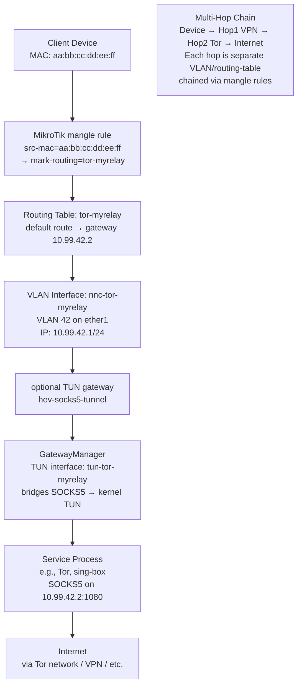
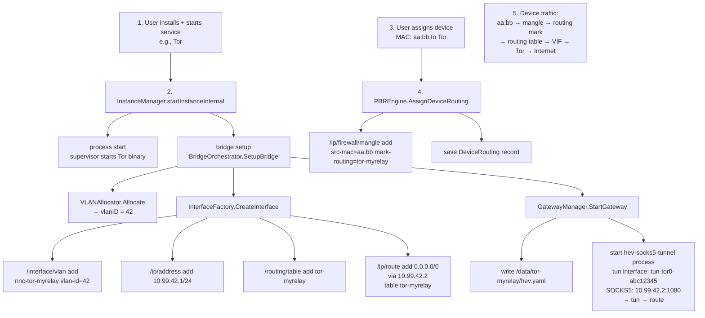
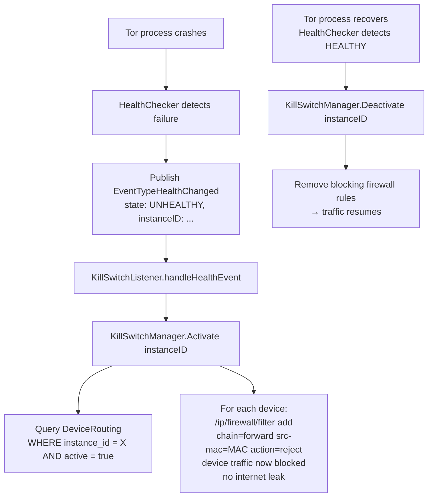
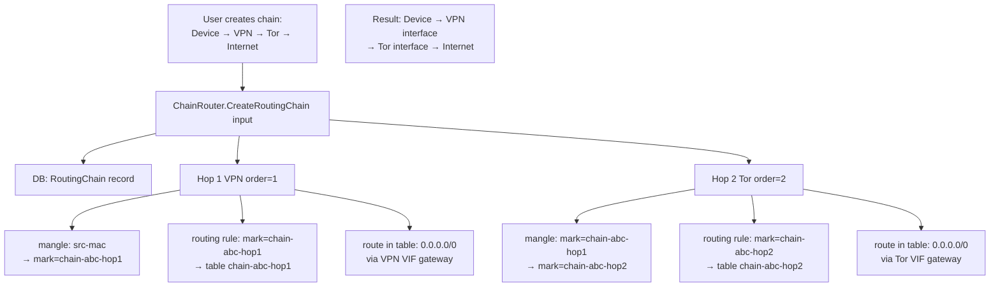

# Virtual Interface Factory (VIF)

> Transforms service instances into routable VLAN-isolated network interfaces on MikroTik routers, enabling per-device traffic steering through services like Tor, sing-box, and Xray.

**Packages:** `internal/vif/`, `internal/vif/routing/`, `internal/vif/traffic/`, `internal/vif/isolation/`

**Key Files:** `vif/types.go`, `vif/interface_factory.go`, `vif/bridge.go`, `vif/gateway_manager.go`, `vif/gateway_config.go`, `routing/chain_router.go`, `routing/pbr_engine.go`, `traffic/aggregator.go`, `traffic/quota_enforcer.go`, `isolation/kill_switch_listener.go`

**Prerequisites:** [See: 06-service-orchestrator.md §BridgeOrchestrator], [See: 04-router-communication.md §RouterPort]

---

## Overview

The Virtual Interface Factory (VIF) is a core architectural innovation that solves a fundamental challenge: how do you route specific client devices through a privacy service (Tor, VPN, proxy) running inside a container on the router, while keeping other devices on the normal internet?

**The answer: VLAN-isolated virtual interfaces with policy-based routing.**

Each service instance gets:
- A dedicated **VLAN interface** on the MikroTik router (e.g., `nnc-tor-myrelay`, VLAN ID 42)
- An **IP address** in the `10.99.x.0/24` space (e.g., `10.99.42.1/24`)
- A **dedicated routing table** with a default route through the service
- A **mangle rule** per assigned device (MAC → routing mark → routing table)
- An optional **TUN gateway** (hev-socks5-tunnel) to bridge SOCKS5 → TUN

[See: ADR 007 — IP Binding Isolation] and [See: ADR 012 — Universal State v2] for design rationale.

---

## Architecture



---

## Package Reference

### `vif` (core)

**`types.go` — VLAN Allocation**

| Type | Description |
|------|-------------|
| `VLANAllocator` | Interface: `Allocate(ctx, routerID, instanceID, serviceType) (int, error)` / `Release(ctx, routerID, id) error` |
| `SimpleVLANAllocator` | In-memory sequential allocator (unit tests only) |
| `NetworkVLANAllocatorAdapter` | Wraps `network.VLANAllocator` (DB-backed, production) |
| `VLANPurpose` | `ingress`, `egress`, or `""` (legacy) |

```go
// Production wiring
adapter := vif.NewNetworkVLANAllocatorAdapter(network.NewVLANAllocator(...))
```

---

**`interface_factory.go` — InterfaceFactory**

Creates and removes VLAN-based virtual interfaces on MikroTik routers with transactional rollback.

```go
type InterfaceFactory struct {
    router      router.RouterPort
    store       *ent.Client
    eventBus    events.EventBus
    parentIface string // e.g., "ether1"
}

type InterfaceFactoryConfig struct {
    RouterPort  router.RouterPort
    Store       *ent.Client
    EventBus    events.EventBus
    ParentIface string // defaults to "ether1"
}
```

**`CreateInterface`** — 4-step transactional creation with LIFO rollback:

```
1. Save VirtualInterface DB record (status=creating)
2. /interface/vlan add name=nnc-{featureID}-{name} vlan-id={id} interface={parent}
3. /ip/address add address=10.99.{id}.1/24 interface={name}
4. /routing/table add name={mark}
5. /ip/route add dst-address=0.0.0.0/0 gateway=10.99.{id}.2 routing-table={mark}
6. Update DB record (status=active)
7. Publish interface.created event
```

On any step failure: all previous steps are rolled back in reverse order. The DB record is set to `status=error`.

**Naming conventions:**
- Interface: `nnc-{featureID}-{instanceName}` (e.g., `nnc-tor-myrelay`)
- IP: `10.99.{vlanID}.1/24`
- Routing table / mark: `{featureID}-{instanceName}`
- Gateway IP: `10.99.{vlanID}.2`

**`RemoveInterface`** — Reverse teardown (best-effort):
1. Update DB status to `removing`
2. Remove default route
3. Remove routing table
4. Remove IP address
5. Remove VLAN interface
6. Delete DB record
7. Publish `interface.removed` event

---

**`bridge.go` — BridgeOrchestrator**

Coordinates the full bridge lifecycle: VLAN allocation, interface creation, optional TUN gateway, and VIF reconciliation.

```go
type BridgeOrchestrator struct {
    interfaceFactory *InterfaceFactory
    gatewayManager   *GatewayManager
    vlanAllocator    VLANAllocator
    store            *ent.Client
    eventBus         events.EventBus
    routerPort       router.RouterPort
    ingressService   *ingress.Service
    egressService    *wan.EgressService
}
```

**`SetupBridge(ctx, instance, manifest)`**

1. Allocate VLAN ID from `VLANAllocator`
2. `InterfaceFactory.CreateInterface` — creates router VLAN + routing table
3. If manifest declares SOCKS5 gateway: `GatewayManager.StartGateway`
4. Configure ingress DHCP (via `ingressService`) if needed
5. Configure egress WAN routing (via `egressService`) if needed

**`TeardownBridge(ctx, instanceID)`** — Reverses setup in order.

**`ReconcileOnStartup(ctx)`** — Called at boot to detect and clean up orphaned VIF records (DB records without matching router resources).

---

**`gateway_config.go` — Gateway Configuration**

Generates YAML configuration for `hev-socks5-tunnel`, which bridges a SOCKS5 proxy to a kernel TUN interface.

```go
type GatewayConfig struct {
    Tunnel Socks5Config `yaml:"tunnel"` // TUN name, MTU (8500)
    Socks5 Socks5Config `yaml:"socks5"` // SOCKS5 address + port + UDP flag
    Misc   MiscConfig   `yaml:"misc"`   // log level
}
```

TUN interface name: `tun-{featureID[0:4]}-{instanceID[0:8]}` (max 15 chars for Linux TUN limit).

SOCKS endpoint is extracted from `ServiceInstance.Config["socks_port"]` and `Config["vlan_ip"]`.

---

**`gateway_manager.go` — GatewayManager**

Manages `hev-socks5-tunnel` processes that bridge SOCKS5 → TUN.

```go
type GatewayManager struct {
    supervisor    ProcessSupervisor
    hevBinaryPath string   // default: /app/hev-socks5-tunnel
    pathResolver  storage.PathResolverPort
    gateways      map[string]*GatewayInstance
}

type GatewayInstance struct {
    InstanceID      string
    TunName         string
    SocksAddr       string
    SocksPort       int
    UDPEnabled      bool
    EgressInterface string // e.g., "eth0.154" for DHCP bridge mode
    StartTime       time.Time
}
```

**`StartGateway(ctx, instance, manifest)`**
1. `GenerateGatewayConfig` → write YAML config file
2. Build `ProcessConfig` for `hev-socks5-tunnel`
3. Register + start via `ProcessSupervisor`
4. Wait for TUN interface to appear in `/proc/net/dev`

**`StopGateway(ctx, instanceID)`** — Stops process and removes TUN interface record.

---

### `vif/routing`

Multi-hop routing chain management and policy-based routing (PBR).

**`chain_router.go` — ChainRouter**

Manages chains where traffic flows sequentially through multiple services.

```go
type ChainRouter struct {
    router    router.RouterPort
    store     *ent.Client
    eventBus  events.EventBus
}

type CreateRoutingChainInput struct {
    DeviceID          string
    DeviceMAC         string
    DeviceIP          string
    RoutingMode       routingchain.RoutingMode  // per-device, global, scheduled
    KillSwitchEnabled bool
    KillSwitchMode    routingchain.KillSwitchMode
    Hops              []ChainHopInput           // ordered list of VIF IDs
}
```

**`chain_router_hops.go`** — Creates per-hop router rules with LIFO rollback:

For each hop:
1. Create mangle rule: `src-mac → mark-routing=chain-{chainID}-hop{N}`
2. Create routing rule: `routing-mark=chain-{chainID}-hop{N} → use table chain-{chainID}-hop{N}`
3. Create DB `ChainHop` record

Cleanup rolls back in reverse order on any hop failure.

**`chain_latency.go` — ChainLatencyMeasurer**

Measures per-hop latency by probing each hop's SOCKS5 port.

```go
type HopLatency struct {
    HopOrder  int
    Interface string
    LatencyMs float64  // -1 if unreachable
    Healthy   bool
}

type ChainLatencyResult struct {
    ChainID      string
    Hops         []HopLatency
    TotalLatency float64
    AllHealthy   bool
}
```

**`pbr_engine.go` — PBREngine**

Policy-Based Routing via MAC-based MikroTik mangle rules.

```go
type PBREngine struct {
    routerPort router.RouterPort
    client     *ent.Client
    eventBus   events.EventBus
}

type DeviceRoutingAssignment struct {
    DeviceID       string
    MacAddress     string
    RoutingMark    string
    MangleRuleID   string
    Success        bool
    ConflictExists bool
}
```

**`AssignDeviceRouting(ctx, deviceID, instanceID)`**
1. Check for existing mangle rule conflict
2. Create mangle rule: `chain=prerouting src-mac={MAC} action=mark-routing new-routing-mark={mark}`
3. Save `DeviceRouting` record to DB
4. Publish `device.routed` event

**`UnassignDeviceRouting(ctx, deviceID)`** — Removes mangle rule from router and DB record.

---

### `vif/traffic`

Traffic statistics collection and quota enforcement.

**`aggregator.go` — TrafficAggregator**

Write-behind buffer for high-frequency traffic data (polled every 10s by the resource poller, flushed to DB every 5 minutes).

```go
type TrafficAggregator struct {
    client   *ent.Client
    buffer   map[string]map[string]*hourlyStats  // instanceID → hourKey → stats
    stopChan chan struct{}
}
```

| Constant | Value |
|----------|-------|
| `FlushInterval` | 5 minutes |
| `RetentionDays` | 30 days |
| `CleanupInterval` | 24 hours |

**`hourlyStats`** accumulates `txBytes`, `rxBytes`, `txPackets`, `rxPackets` per instance per hour bucket. On flush, upserts `ServiceTrafficHourly` records.

**`quota_enforcer.go` — QuotaEnforcer**

Enforces traffic quotas at 80%, 90%, and 100% thresholds.

```go
// Quota thresholds
// 80% → publish QuotaWarning event
// 90% → publish QuotaWarning event (escalated)
// 100% → THROTTLE action: apply 1 Mbps bandwidth cap via router queue rule
```

Throttle bandwidth cap: **1 Mbps** (`defaultThrottleBitsPerSecond = 1_000_000`).

```go
func (e *QuotaEnforcer) CheckQuota(ctx context.Context, instanceID string, newBytes int64) (bool, error)
```

Called by `TrafficAggregator` after each flush.

---

### `vif/isolation`

Kill switch management: blocks device traffic when service becomes unhealthy.

**`kill_switch_listener.go` — KillSwitchListener**

Subscribes to `EventTypeHealthChanged` and triggers kill switch transitions.

```go
type KillSwitchListener struct {
    client        *ent.Client
    eventBus      events.EventBus
    killSwitchMgr *KillSwitchManager
}

func (l *KillSwitchListener) Start() error  // subscribes to health events
```

**Health → Kill Switch Logic:**

| Event | Action |
|-------|--------|
| Service becomes `UNHEALTHY` | Activate kill switch → block all device traffic |
| Service recovers to `HEALTHY` | Deactivate kill switch → resume device traffic |

**Kill Switch Implementation**

Blocking: creates MikroTik firewall rule `chain=forward src-mac={MAC} action=reject` for all devices routed through the affected instance.

Resuming: removes the blocking rules.

**`kill_switch_coordinator_test.go`**

Tests coordinator behavior: concurrent activation, idempotent operations, and recovery after health restoration.

---

## Data Flow

### Service Instance Setup (Full VIF Pipeline)



### Kill Switch Activation



### Multi-Hop Chain



---

## VLAN ID Allocation

Two implementations of `VLANAllocator`:

| Impl | Use Case | Backing |
|------|----------|---------|
| `SimpleVLANAllocator` | Unit tests | In-memory map, sequential |
| `NetworkVLANAllocatorAdapter` | Production | `network.VLANAllocator` with DB persistence |

VLAN IDs are scoped per router. The allocator tracks `(routerID, instanceID, serviceType)` to enable deterministic re-allocation after restarts.

Production VLAN range: typically `10–4000` (MikroTik supports 1–4094).

---

## Configuration

VIF is configured during bootstrap in `internal/bootstrap/vif.go`:

```go
// Only enabled when VLANAllocator is configured (requires supported router)
if cfg.VLANAllocator != nil {
    bridgeOrch = vif.NewBridgeOrchestrator(vif.BridgeOrchestratorConfig{
        InterfaceFactory: vif.NewInterfaceFactory(...),
        GatewayManager:   vif.NewGatewayManager(...),
        VLANAllocator:    vif.NewNetworkVLANAllocatorAdapter(cfg.VLANAllocator),
        RouterPort:       cfg.RouterPort,
        ...
    })
}
```

**Key parameters:**
- `parentIface`: parent MikroTik interface for VLAN tagging (default: `ether1`)
- `hevBinaryPath`: path to `hev-socks5-tunnel` binary (default: `/app/hev-socks5-tunnel`)
- `AllowedBaseDir`: base path for service files (isolation verifier)

---

## Error Handling

| Error | Behavior |
|-------|----------|
| VLAN allocation failure | `SetupBridge` returns error; no router changes made |
| VLAN interface creation failure | Rollback previous steps; DB record set to `error` |
| Gateway start failure | VIF remains (can retry); instance marked degraded |
| Hop creation failure | Entire chain rolled back in reverse order |
| Kill switch activation failure | Logged as error; best-effort on all devices |
| Traffic flush failure | Logged; in-memory buffer retained for next flush |
| Quota enforcement failure | Logged; does not stop the service |

All VIF operations emit events to the event bus for audit and UI updates.

---

## Testing

**`benchmark_test.go`**

Benchmarks VIF operations: VLAN allocation throughput, interface name generation, routing mark lookups.

**`isolation/kill_switch_coordinator_test.go`**

Tests concurrent kill switch activation, idempotency, and state recovery:
- Multiple simultaneous activations for the same instance
- Deactivation when no blocking rules exist
- Round-trip activate → deactivate → verify clean state

---

## Cross-References

- [See: 06-service-orchestrator.md §lifecycle_starter] — `setupBridgeIfNeeded` calls `BridgeOrchestrator.SetupBridge`
- [See: 04-router-communication.md §RouterPort] — All VIF router commands go through `router.RouterPort`
- [See: 11-data-layer.md §VirtualInterface] — Ent schema for VIF persistence
- [See: 05-event-system.md] — Events: `interface.created`, `interface.removed`, `device.routed`, `EventTypeHealthChanged`
- [See: ADR 007 — IP Binding Isolation] — Design rationale for per-instance binding
- [See: ADR 012 — Universal State v2] — 8-layer resource model that includes VIF as a routing layer
- [See: ADR 017 — Three-Layer Component Architecture] — Frontend components for VIF management
