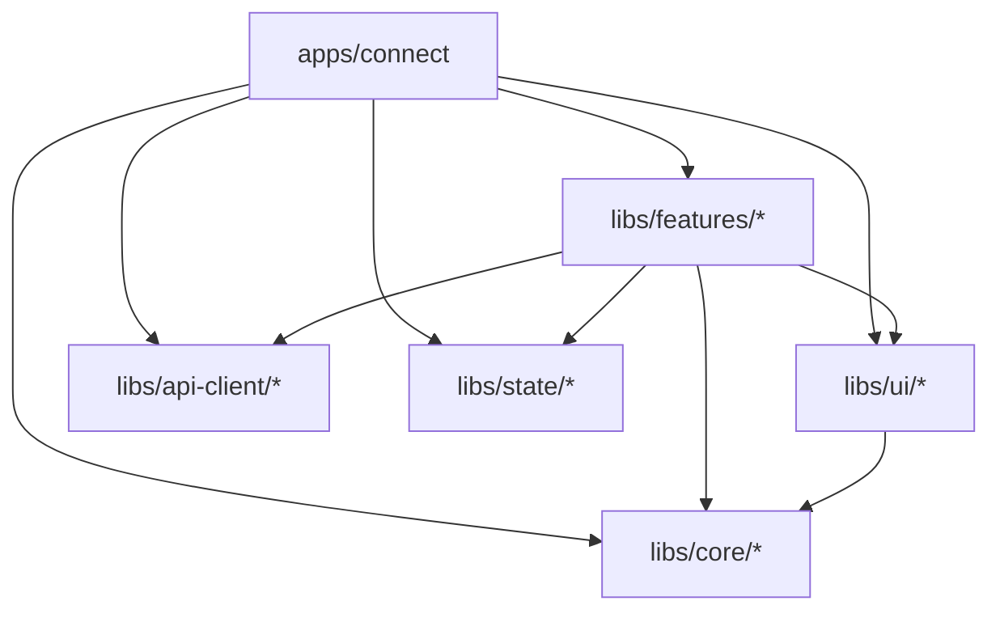
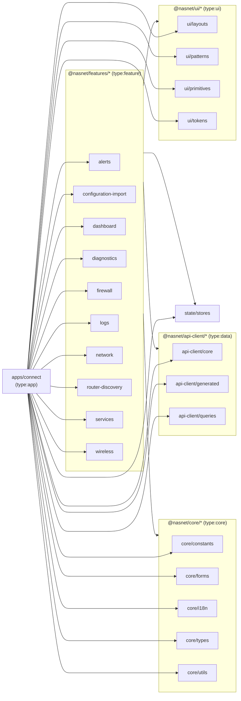

# Monorepo Library Dependency Graph

NasNetConnect is an Nx monorepo. The `apps/connect` application depends on a set of shared libraries
under `libs/`. A strict one-directional dependency rule is enforced: no library may import from a
library that is above it in the hierarchy.

## Dependency Rule



**Rules:**

- `apps/` may import from `features/`, `ui/`, `core/`, `api-client/`, `state/`
- `features/` may import from `ui/`, `core/`, `api-client/`, `state/`
- `features/` may NOT import from other `features/` libraries
- `ui/` may import from `core/`
- `core/` imports nothing internal (pure TypeScript)

These rules are enforced by Nx tags. The `apps/connect/project.json` carries
`"tags": ["type:app", "scope:app"]`.

## Full Dependency Graph



## Import Aliases

All aliases are defined in `apps/connect/vite.config.ts` (runtime resolution) and mirrored in
`apps/connect/tsconfig.app.json` (TypeScript resolution).

### App-Local Alias

| Alias | Resolves To         |
| ----- | ------------------- |
| `@/`  | `apps/connect/src/` |

### Core Libraries

| Alias                    | Resolves To               | Purpose                                                                              |
| ------------------------ | ------------------------- | ------------------------------------------------------------------------------------ |
| `@nasnet/core/types`     | `libs/core/types/src`     | Shared TypeScript interfaces and enums                                               |
| `@nasnet/core/utils`     | `libs/core/utils/src`     | Pure utility functions (IP, MAC, status)                                             |
| `@nasnet/core/constants` | `libs/core/constants/src` | App constants, route names, socket events, well-known ports                          |
| `@nasnet/core/forms`     | `libs/core/forms/src`     | React Hook Form + Zod utilities, validation pipeline                                 |
| `@nasnet/core/i18n`      | `libs/core/i18n/src`      | i18next setup, `useTranslation`, `useDirection`, `DirectionProvider`, `I18nProvider` |

### UI Libraries

| Alias                             | Resolves To                         | Purpose                                                                          |
| --------------------------------- | ----------------------------------- | -------------------------------------------------------------------------------- |
| `@nasnet/ui/primitives`           | `libs/ui/primitives/src`            | ~40 shadcn/ui + Radix UI base components                                         |
| `@nasnet/ui/patterns`             | `libs/ui/patterns/src`              | ~56 composite pattern components (headless + presenters)                         |
| `@nasnet/ui/layouts`              | `libs/ui/layouts/src`               | Page shells, `ResponsiveShell`, `PlatformProvider`, `CollapsibleSidebarProvider` |
| `@nasnet/ui/utils`                | `libs/ui/primitives/src/lib/utils`  | `cn()` utility for conditional class merging                                     |
| `@nasnet/ui/components`           | `libs/ui/primitives/src`            | Alias for legacy incorrect imports                                               |
| `@nasnet/ui/tokens`               | `libs/ui/tokens/src`                | Animation tokens, TypeScript token definitions                                   |
| `@nasnet/ui/tokens/variables.css` | `libs/ui/tokens/dist/variables.css` | Compiled CSS custom properties (design tokens)                                   |
| `@nasnet/ui/patterns/motion`      | `libs/ui/patterns/src/motion`       | Motion pattern components (NAS-4.18)                                             |

### Feature Libraries

| Alias                                   | Resolves To                              | Purpose                                                          |
| --------------------------------------- | ---------------------------------------- | ---------------------------------------------------------------- |
| `@nasnet/features/alerts`               | `libs/features/alerts/src`               | Alert rules, webhook channels, quiet hours, in-app notifications |
| `@nasnet/features/configuration-import` | `libs/features/configuration-import/src` | Config import/export wizard                                      |
| `@nasnet/features/dashboard`            | `libs/features/dashboard/src`            | Fleet overview, quick stats widgets                              |
| `@nasnet/features/diagnostics`          | `libs/features/diagnostics/src`          | Traceroute, DNS lookup, circuit breaker                          |
| `@nasnet/features/firewall`             | `libs/features/firewall/src`             | Firewall rules, address lists, NAT, port knocking                |
| `@nasnet/features/logs`                 | `libs/features/logs/src`                 | Log streaming, filtering, export                                 |
| `@nasnet/features/network`              | `libs/features/network/src`              | DHCP, VLANs, bridges, routing tables                             |
| `@nasnet/features/router-discovery`     | `libs/features/router-discovery/src`     | Router scanning, onboarding flow                                 |
| `@nasnet/features/services`             | `libs/features/services/src`             | Feature marketplace (Tor, sing-box, Xray, etc.)                  |
| `@nasnet/features/wireless`             | `libs/features/wireless/src`             | WiFi interface management, connected clients                     |

### API Client Libraries

| Alias                          | Resolves To                   | Purpose                                                                       |
| ------------------------------ | ----------------------------- | ----------------------------------------------------------------------------- |
| `@nasnet/api-client/core`      | `libs/api-client/core/src`    | Apollo Client instance, links (auth, router-id, error, split), cache config   |
| `@nasnet/api-client/generated` | `libs/api-client/generated`   | Auto-generated TypeScript types, React hooks, Zod schemas from GraphQL schema |
| `@nasnet/api-client/queries`   | `libs/api-client/queries/src` | Human-authored Apollo Client hooks organized by domain                        |

### State Libraries

| Alias                  | Resolves To             | Purpose                                                                           |
| ---------------------- | ----------------------- | --------------------------------------------------------------------------------- |
| `@nasnet/state/stores` | `libs/state/stores/src` | Zustand stores: theme, sidebar, connection status, notifications, command palette |

## What Each Library Provides

### `@nasnet/core/types`

TypeScript-only. Re-exported types used across the entire monorepo. Examples:

- `RouterStatus`, `ServiceStatus`, `InterfaceType`
- Firewall rule types: `FilterRule`, `MangleRule`, `NatRule`
- Resource model types aligned with the backend's Universal State v2

### `@nasnet/core/utils`

Pure functions with no React dependencies:

- `calculateStatus()` — converts raw RouterOS status strings to semantic status values
- `parseFirewallLog()` — parses RouterOS firewall log line format
- `macVendorLookup()` — OUI database lookup
- `deviceTypeDetection()` — heuristic device type from OUI/hostname
- Network utilities: IP address formatting, CIDR parsing

### `@nasnet/core/constants`

Named constants. Importing these avoids magic strings throughout the codebase:

- Route path constants
- Well-known port numbers
- WebSocket event names
- API endpoint paths

### `@nasnet/core/forms`

React Hook Form integration:

- `useZodForm()` — typed `useForm` wrapper with Zod resolver pre-configured
- `ValidationPipeline` — multi-step async validation (e.g., check IP conflict on blur)
- `mapBackendErrors()` — maps GraphQL error extensions to field-level form errors
- Network validators: IP, CIDR, MAC address Zod schemas

### `@nasnet/core/i18n`

i18next integration:

- `I18nProvider` — Suspense-based lazy language loading
- `DirectionProvider` — RTL/LTR switching
- `useTranslation()` — typed translation hook
- `useDirection()` — current text direction
- `useFormatters()` — locale-aware number, date, byte formatting

### `@nasnet/api-client/core`

Apollo Client setup:

- `ApolloProvider` — React context provider
- Auth link injects `Authorization: Bearer` header from Zustand store
- Router ID link injects `X-Router-Id` header for router-scoped requests
- WebSocket link for GraphQL subscriptions
- Normalized cache with type policies for real-time data

### `@nasnet/api-client/generated`

Generated by `npm run codegen:ts`. Contains:

- TypeScript types for every GraphQL type, query, mutation, and subscription
- Typed React hooks (`useGetRoutersQuery`, `useUpdateFirewallRuleMutation`, etc.)
- Zod schemas for client-side validation matching the GraphQL schema

**Do not edit manually.** Regenerate with `npm run codegen`.

### `@nasnet/api-client/queries`

Human-authored hooks that wrap the generated hooks with:

- Sensible defaults (polling intervals, fetch policies)
- Router ID injection
- Response transformation (e.g., flattening nested connection types)
- Error normalization

### `@nasnet/state/stores`

Zustand stores. Each store is a separate file:

- `useThemeStore` — `theme: "light" | "dark" | "system"`, `resolvedTheme`
- `useSidebarStore` — `desktopCollapsed`, `toggle()`
- `useConnectionStore` — active router ID, connection status, last-seen timestamp
- `useNotificationStore` — notification queue consumed by `ToastProvider`
- `useCommandStore` — registered commands for the command palette

## Nx Project Configuration

```json
// apps/connect/project.json (abbreviated)
{
  "name": "connect",
  "projectType": "application",
  "root": "apps/connect",
  "sourceRoot": "apps/connect/src",
  "targets": {
    "serve":        { "executor": "@nx/vite:dev-server" },
    "build":        { "executor": "@nx/vite:build",  "outputs": ["dist/apps/connect"] },
    "lint":         { "executor": "@nx/eslint:lint" },
    "typecheck":    { "executor": "nx:run-commands" },
    "storybook":    { "executor": "nx:run-commands", "port": 4402 },
    "build-storybook": { ... }
  },
  "tags": ["type:app", "scope:app"]
}
```

Run `npx nx graph` to visualize the full dependency graph interactively.

## Related Documents

- [Architecture Overview](./overview.md)
- [Build System](./build-system.md)
- [Getting Started — Project Structure](../getting-started/project-structure.md)
