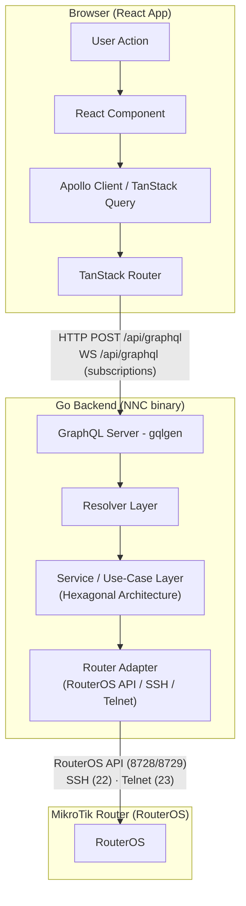
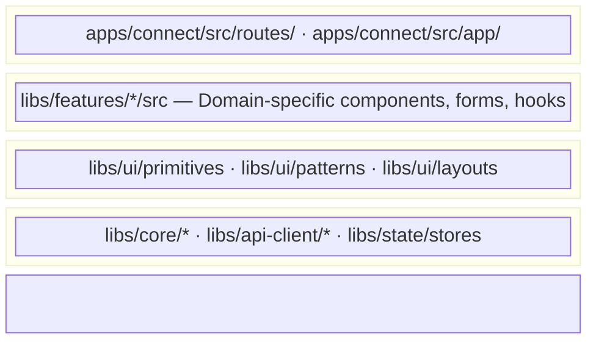

# Architecture Overview

The `apps/connect` frontend is the React-based management interface for NasNetConnect. It
communicates with a Go backend over GraphQL, which in turn proxies commands to MikroTik routers via
RouterOS API, SSH, or Telnet.

## Request Flow

## Architecture Layers

The frontend is organized into four horizontal layers. Each layer has a strict one-directional
dependency: higher layers consume lower layers; lower layers never import from higher layers.

### Layer 1 — Core / Data

The foundation. Contains no React components.

- `libs/core/types` — Shared TypeScript interfaces and enums
- `libs/core/utils` — Pure utility functions (IP formatting, status calculations)
- `libs/core/constants` — App-wide constants, route paths, socket events
- `libs/core/forms` — React Hook Form + Zod integration, validation utilities
- `libs/core/i18n` — i18next setup, hooks, direction detection
- `libs/api-client/core` — Apollo Client configuration, links, normalized cache
- `libs/api-client/generated` — Auto-generated TypeScript types and React hooks from GraphQL schema
- `libs/api-client/queries` — Human-authored Apollo Client hooks organized by domain
- `libs/state/stores` — Zustand stores (theme, sidebar, connection status, notifications)

### Layer 2 — UI Component System

Reusable, domain-agnostic components. The three-tier component library:

- `libs/ui/primitives` — ~40 shadcn/ui + Radix UI base components (Button, Card, Input, Dialog)
- `libs/ui/patterns` — ~56 composite components implementing the Headless + Platform Presenter
  pattern
- `libs/ui/layouts` — Page shells (ResponsiveShell), sidebar providers, PlatformProvider

### Layer 3 — Feature Modules

Domain-specific logic. Each feature module is self-contained and cannot import from sibling feature
modules.

- `libs/features/router-discovery` — Router scanning and onboarding
- `libs/features/dashboard` — Fleet overview and quick stats
- `libs/features/wireless` — WiFi interface management
- `libs/features/firewall` — Firewall rules, address lists, NAT
- `libs/features/logs` — Log streaming and filtering
- `libs/features/network` — DHCP, VLANs, bridging, routing
- `libs/features/alerts` — Alert rules, notification channels, quiet hours
- `libs/features/diagnostics` — Traceroute, DNS lookup, circuit breaker
- `libs/features/services` — Feature marketplace (Tor, sing-box, Xray, etc.)
- `libs/features/configuration-import` — Config import/export wizard

### Layer 4 — Application Shell

The entry point and routing layer. Defined in `apps/connect/src/`.

- `main.tsx` — React DOM mount, router creation, i18n bootstrap, XState Inspector (dev)
- `routes/__root.tsx` — Root route: wraps all routes in the `Providers` stack, renders
  `ResponsiveShell`
- `routes/**/*.tsx` — File-based route tree (47 routes total)
- `app/components/` — App-level components (AppHeader, AppSidebar)
- `app/providers/` — Context provider composition (8 providers)
- `app/hooks/` — App-level hooks (connection heartbeat, toast notifications, keyboard shortcuts)

## Hexagonal Architecture Reference

The Go backend uses hexagonal (ports-and-adapters) architecture. The frontend mirrors this by
enforcing its own layered boundary:

- **Ports (inward):** GraphQL schema (single source of truth in `schema/`)
- **Adapters (data in):** `libs/api-client` — Apollo Client hooks translate GraphQL responses into
  React state
- **Adapters (data out):** `libs/api-client/queries` — hooks that emit mutations back to the backend

The frontend never talks directly to RouterOS. All router state flows through the Go backend's
GraphQL API.

## Separation of Concerns

| Concern                       | Location                                    |
| ----------------------------- | ------------------------------------------- |
| Routing / navigation          | `apps/connect/src/routes/`                  |
| Global app shell              | `apps/connect/src/routes/__root.tsx`        |
| Provider composition          | `apps/connect/src/app/providers/`           |
| Business logic (feature)      | `libs/features/*/src`                       |
| UI component logic (headless) | `libs/ui/patterns/src` (hooks)              |
| UI rendering                  | `libs/ui/patterns/src` (presenters)         |
| Server state (GraphQL)        | `libs/api-client/queries/src`               |
| Client UI state               | `libs/state/stores/src`                     |
| Complex workflow state        | XState machines in `libs/state/machines/`   |
| Form state                    | React Hook Form instances inside components |
| Types                         | `libs/core/types/src`                       |
| Design tokens                 | `libs/ui/tokens/src`                        |

## Related Documents

- [Provider Stack](./provider-stack.md) — All 8 providers in detail
- [Routing](./routing.md) — TanStack Router file-based routing
- [Library Dependencies](./library-dependencies.md) — Monorepo import graph
- [Build System](./build-system.md) — Vite configuration and bundle strategy
- [Getting Started — Project Structure](../getting-started/project-structure.md)
