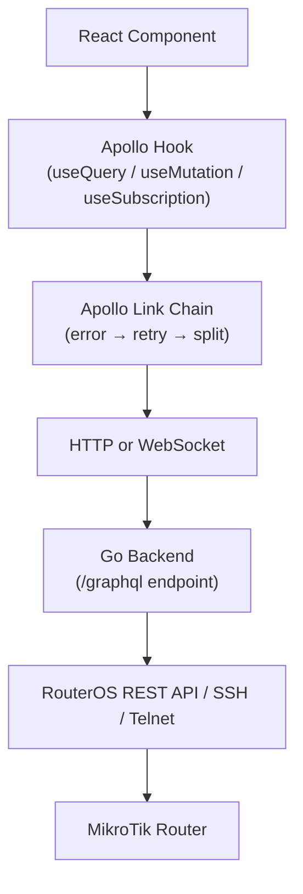
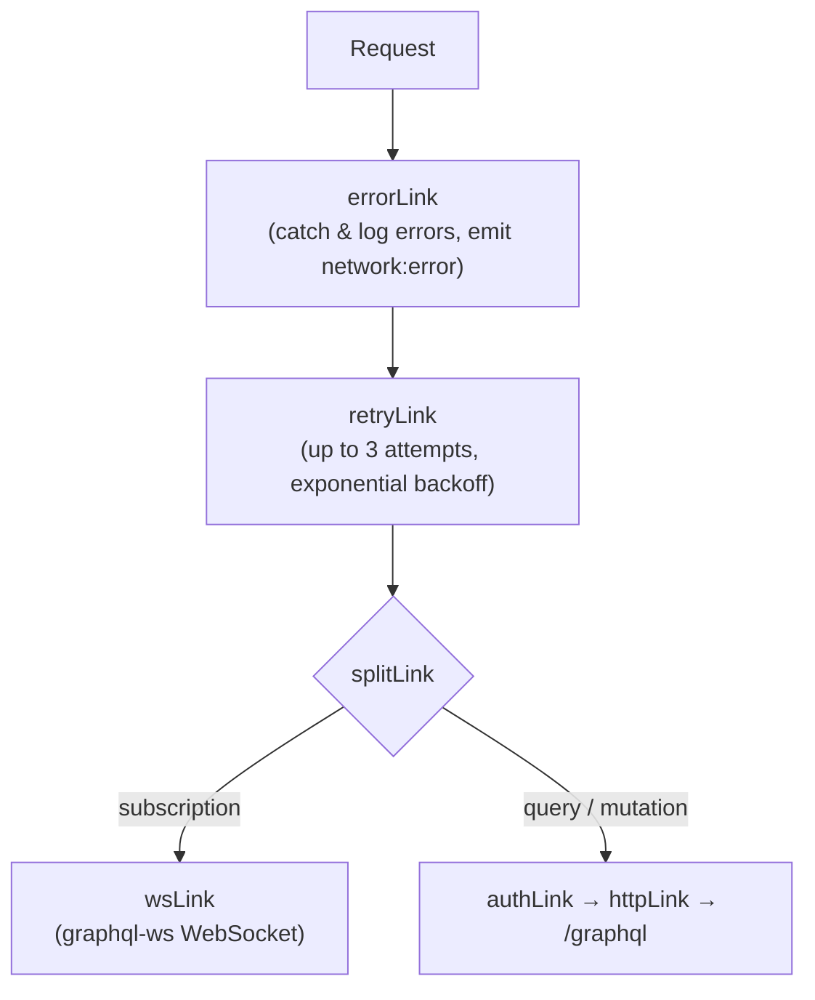

# Data Fetching Overview

This document describes how data flows from the React frontend to the MikroTik router and back.

## The Full Data Flow



The Go backend acts as the intermediary. The frontend never talks directly to the router. This
design solves CORS restrictions and centralises authentication.

## Two Transport Layers

### GraphQL over Apollo Client (primary)

All domain data — router configuration, VPN tunnels, firewall rules, service instances — is fetched
via GraphQL. Apollo Client manages the normalised in-memory cache, subscription upgrade to
WebSocket, and automatic retries.

Use GraphQL hooks for:

- Any data that belongs to the Universal State v2 resource model
- Real-time subscriptions (service status, alert events)
- Mutations that need optimistic updates

### REST via Router Proxy (secondary)

A thin REST proxy exists in `libs/api-client/core/src/router-proxy.ts`. It sends RouterOS REST API
calls to the Go backend at `/api/router/proxy`. The backend forwards them to the device and returns
the response.

Use the REST proxy for:

- Low-level RouterOS operations not yet modelled in GraphQL
- Development or one-off diagnostic queries
- Integrating TanStack Query for data not in the Apollo cache

```typescript
// REST proxy example
import { makeRouterOSRequest } from '@nasnet/api-client/core';

const result = await makeRouterOSRequest<InterfaceList>('192.168.88.1', 'interface');

if (result.success) {
  console.log(result.data);
}
```

## Apollo Client Link Chain

Requests travel through a composed link chain defined in
`libs/api-client/core/src/apollo/apollo-client.ts`:



The `authLink` injects two headers on every request:

- `X-Router-Id`: the currently selected router's identifier, read from `useConnectionStore`
- `Authorization`: `Bearer <jwt>` (preferred) or `Basic <base64>` fallback from per-router
  credentials

## Request Lifecycle

### Query lifecycle

1. Component calls `useQuery(GET_WHATEVER, { variables })`
2. Apollo checks the cache. If a valid entry exists, it returns immediately (`cache-first` policy)
3. For `watchQuery` the default is `cache-and-network`: returns cached data immediately, then issues
   a network request to refresh
4. The network request traverses the link chain and hits the Go backend
5. The backend resolves the GraphQL operation, calls MikroTik, and streams the response back
6. Apollo normalises the response into the `InMemoryCache` using `uuid` as the cache key for
   resources
7. The component re-renders with fresh data

### Mutation lifecycle

1. Component calls `mutate({ variables })`
2. An optional optimistic response is written to the cache immediately (e.g. `useUpdateResource`
   applies one)
3. The mutation traverses the link chain
4. On success the server response replaces the optimistic write
5. On error the optimistic write is rolled back automatically

### Subscription lifecycle

1. Component calls `useSubscription(ON_WHATEVER, { variables })`
2. Apollo establishes (or reuses) a WebSocket via `graphql-ws`
3. The WebSocket URL is derived from the current page origin (ws:// or wss://)
4. Events from the Go backend push updates directly to the subscription handler
5. Apollo merges subscription data into the cache using configured type policies

## Cache Configuration

Key type policies (defined in `apollo-client.ts`):

| Type                        | Key field | Merge strategy                                                         |
| --------------------------- | --------- | ---------------------------------------------------------------------- |
| `Router`                    | `id`      | `status` field merges (not replaces)                                   |
| `Resource` and all subtypes | `uuid`    | `runtime` and `telemetry` merge; `deployment` and `validation` replace |
| `RuntimeState`              | —         | merge: true                                                            |
| `ValidationResult`          | —         | merge: false (always replace)                                          |

Bandwidth history is capped at 288 entries (24 hours at 5-minute intervals) via the `telemetry`
field merge function.

## Error Handling

The `errorLink` (`apollo-error-link.ts`) catches both GraphQL-level errors (e.g., resolver failures)
and network-level errors. On network errors it dispatches a `network:error` custom DOM event that
the offline detector listens to.

The `retryLink` retries network failures up to 3 times with jitter. It does **not** retry 4xx client
errors, which are not transient.

See [`../state-management/apollo-client.md`](../state-management/apollo-client.md) for the full
Apollo Client configuration reference.

## REST Client Error Handling

The Axios-based REST interceptors (`libs/api-client/core/src/interceptors/`) translate HTTP status
codes into user-friendly messages:

| Status | Message                                        |
| ------ | ---------------------------------------------- |
| 401    | Authentication failed. Check your credentials. |
| 403    | Permission denied. You do not have access.     |
| 404    | Resource not found.                            |
| 409    | Conflict. The resource may have changed.       |
| 5xx    | Server error. Please try again.                |

Network errors (no response) are detected separately and show connectivity-specific messages.
