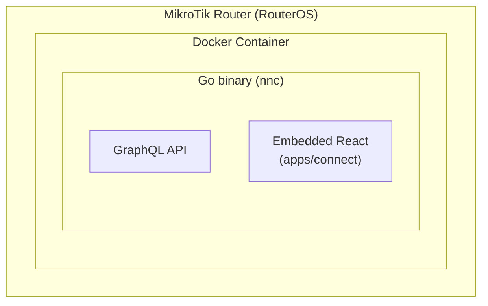
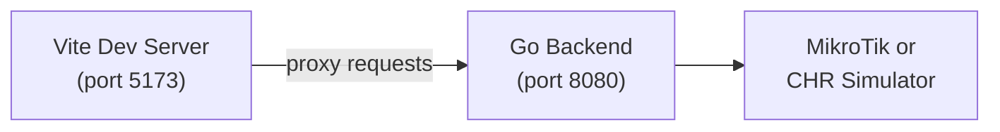

# NasNetConnect Overview

## What Is NasNetConnect?

**NasNetConnect** is an enterprise-grade MikroTik router management platform. Its `apps/connect`
frontend is a React application that provides an adaptive, responsive UI for managing MikroTik
routers.

The platform has a **dual nature**:

### 1. Router Management

Full-featured configuration and monitoring for MikroTik routers:

- Network interface management (Ethernet, VLANs, bridges, bonding, tunnels)
- Firewall configuration (address lists, NAT, mangle rules, port knocking, rate limiting)
- VPN management (WireGuard, OpenVPN, IKEv2, L2TP, PPTP, SSTP)
- DHCP server/client management
- DNS configuration and diagnostics
- Wireless (Wi-Fi) interface management
- Router logs and firewall connection tracking
- Routing tables and policy-based routing

### 2. Network Services Marketplace

A downloadable feature marketplace allowing admins to install and manage privacy/security tools that
run directly on the router:

- **Tor** — Anonymous network proxy
- **sing-box** — Universal proxy platform
- **Xray-core** — Advanced proxy core (VLESS, VMess, trojan)
- **MTProxy** — Telegram MTProto proxy
- **Psiphon** — Censorship circumvention tool
- **AdGuard Home** — Network-wide ad and tracker blocking

These features are containerized and run within RouterOS's container support. The marketplace
handles download, installation, configuration, health monitoring, and updates.

---

## Dual Deployment Model

The system runs in two configurations:

### Production — On the Router

The entire application (Go backend + React frontend) ships as a **single Docker container** that
runs ON the router. The Go binary embeds the built frontend as static files.

### Development — Local Machine

---

## Critical Constraints

These constraints are non-negotiable — the app must run on resource-constrained embedded hardware:

| Constraint        | Target             | Why                                           |
| ----------------- | ------------------ | --------------------------------------------- |
| Docker image size | `<10MB` compressed | Router flash storage is limited               |
| Runtime RAM       | `<50MB`            | MikroTik routers have 64–512MB RAM            |
| Frontend bundle   | `<3MB` gzipped     | Initial load must be fast on slow connections |
| Cold start time   | `<5s`              | Admins need immediate access in emergencies   |

These constraints drive many architectural decisions: code splitting, lazy loading, lean
dependencies, and the multi-arch Go binary embedding the frontend.

---

## Target Personas

NasNetConnect is designed for two distinct user types that **use the same codebase but have very
different needs**:

### Network Admin — Phone in Server Room

- Uses a smartphone while physically working in a server room or data center
- Needs to quickly check status, restart services, or diagnose issues
- Limited screen real estate: `<640px` viewport
- Uses touch, not keyboard
- Needs 44px touch targets and simplified, action-oriented UI

### Power User — Desktop Workstation

- Manages a fleet of routers from a desktop browser
- Needs dense data tables, keyboard shortcuts, multi-column layouts
- Comfortable with technical details and advanced configuration
- Viewport `>1024px`
- Expects Pro-grade UX: sortable tables, keyboard navigation, bulk operations

This is why **every pattern component must implement platform-specific presenters** — there is no
single layout that serves both users well. See
[Platform Presenters](../ui-system/platform-presenters.md) for implementation details.

---

## Tech Stack at a Glance

| Category      | Technology                     | Purpose                                         |
| ------------- | ------------------------------ | ----------------------------------------------- |
| Framework     | React 18 + TypeScript          | UI rendering                                    |
| Build         | Vite 7                         | Fast dev server and optimized production builds |
| Routing       | TanStack Router v1             | File-based type-safe routing                    |
| Server State  | Apollo Client 3                | GraphQL data fetching, caching, subscriptions   |
| UI State      | Zustand 4                      | Theme, sidebar, modals, notifications           |
| Complex Flows | XState 5                       | VPN connection, config pipeline, setup wizard   |
| Forms         | React Hook Form + Zod          | Form state, validation, schema inference        |
| Styling       | Tailwind CSS 4                 | Utility classes with 200+ design tokens         |
| Animation     | Framer Motion                  | Page transitions, gesture-based interactions    |
| i18n          | i18next + react-i18next        | Multi-language support, RTL                     |
| Testing       | Vitest + React Testing Library | Unit and component tests                        |
| E2E           | Playwright                     | Multi-browser end-to-end tests                  |
| Storybook     | Storybook 10                   | Component development and documentation         |

---

## Next Steps

- [Environment Setup](./environment-setup.md) — Get the dev environment running
- [Project Structure](./project-structure.md) — Understand the directory layout and import aliases
- [Key Commands](./key-commands.md) — Quick reference for all commands
- [Architecture Overview](../architecture/overview.md) — Deeper dive into how the pieces fit
  together
