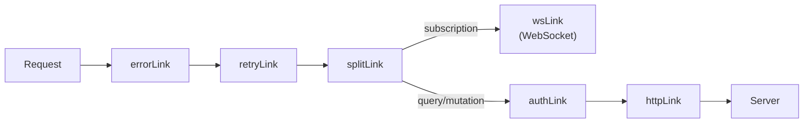

# Apollo Client Configuration

Source: `libs/api-client/core/src/apollo/`

Apollo Client is configured as a singleton instance exported from `libs/api-client/core/src/apollo/apollo-client.ts`. It assembles a link chain, an in-memory cache with custom type policies, and default fetch-policy options.

---

## Link Chain

The full request pipeline is:



Defined in `apollo-client.ts`:

```ts
const link = from([errorLink, retryLink, splitLink]);
```

Each link has a focused responsibility:

| Link | File | Responsibility |
|------|------|----------------|
| `errorLink` | `apollo-error-link.ts` | Catch GraphQL and network errors, show notifications, clear auth on 401 |
| `retryLink` | `apollo-retry-link.ts` | Retry transient network failures with exponential backoff |
| `splitLink` | `apollo-client.ts` (inline) | Route subscriptions to WebSocket, everything else to HTTP |
| `authLink` | `apollo-auth-link.ts` | Inject `X-Router-Id` and `Authorization` headers |
| `httpLink` | `apollo-client.ts` (inline) | Send HTTP requests to `/graphql` with credentials included |
| `wsLink` | `apollo-ws-client.ts` | WebSocket transport for subscriptions via `graphql-ws` |

---

### Auth Link

`libs/api-client/core/src/apollo/apollo-auth-link.ts`

Injects two headers on every query and mutation:

- `X-Router-Id` — the currently active router ID, read from `useConnectionStore.getState().currentRouterId`
- `Authorization` — either a `Bearer <jwt>` from `useAuthStore` (via `getAuthToken()`), or `Basic <base64>` from router credentials stored in `sessionStorage` keyed as `router-credentials-<routerId>`

```ts
export const authLink = setContext((_, { headers }) => {
  const { currentRouterId } = useConnectionStore.getState();
  const authorization = getAuthorizationHeader(currentRouterId);

  return {
    headers: {
      ...headers,
      'X-Router-Id': currentRouterId || '',
      ...(authorization && { Authorization: authorization }),
    },
  };
});
```

The auth priority is: JWT Bearer token first, Basic auth second. This enables both the JWT-authenticated admin flow and the legacy Basic auth flow used for direct router access.

---

### Error Link

`libs/api-client/core/src/apollo/apollo-error-link.ts`

Handles all GraphQL and network errors centrally:

**GraphQL error codes handled:**

| Code | Action |
|------|--------|
| `UNAUTHENTICATED` | Calls `useAuthStore.getState().clearAuth()`, dispatches `auth:expired` event |
| `FORBIDDEN` | Shows "Access denied" notification |
| `NOT_FOUND` | Shows "Not found" warning notification |
| `VALIDATION_FAILED` (and A5xx variants) | Skipped — left to form-level handling |
| Other codes | Maps through `getErrorInfo()` for user-friendly messages |

**HTTP status codes handled:**

| Status | Action |
|--------|--------|
| 401 | Same as `UNAUTHENTICATED` |
| 403 | Shows "Access denied" notification |
| Other | Shows generic "Network error" notification |

Custom error links can be created via `createErrorLink(options)` for testing or isolated components.

---

### Retry Link

`libs/api-client/core/src/apollo/apollo-retry-link.ts`

Retries **network errors only** (not GraphQL errors). Client errors (4xx) are never retried.

```ts
export const retryLink = new RetryLink({
  delay: {
    initial: 300,   // ms before first retry
    max: 3000,      // ms maximum delay
    jitter: true,   // adds random jitter
  },
  attempts: {
    max: 3,
    retryIf: (error) => {
      const isNetworkError = !!error && !error.result;
      const isClientError = typeof error?.statusCode === 'number'
        && error.statusCode >= 400 && error.statusCode < 500;
      return isNetworkError && !isClientError;
    },
  },
});
```

---

### Split Link

Defined inline in `apollo-client.ts`. Routes operations based on type:

```ts
const splitLink = split(
  ({ query }) => {
    const definition = getMainDefinition(query);
    return (
      definition.kind === 'OperationDefinition' &&
      definition.operation === 'subscription'
    );
  },
  wsLink,
  authLink.concat(httpLink)
);
```

Note that `authLink` is only composed with `httpLink`, not `wsLink`. The WebSocket client handles its own authentication via `connectionParams`.

---

## WebSocket Client

`libs/api-client/core/src/apollo/apollo-ws-client.ts`

Uses `graphql-ws` with the `createClient` factory. The default export `wsClient` is created with `createWsClient()`.

**URL detection:** Automatically uses `wss:` when the page is served over HTTPS, `ws:` otherwise.

**Authentication:** On each connection (and reconnection), `connectionParams` is called to re-read current credentials:

```ts
connectionParams: () => {
  const { currentRouterId } = useConnectionStore.getState();
  const authorization = getAuthorization(currentRouterId);
  return { routerId: currentRouterId, authorization };
},
```

**Reconnection strategy:**

| Attempt | Delay (approx.) |
|---------|-----------------|
| 1 | ~1 s |
| 2 | ~2 s |
| 3 | ~4 s |
| 4 | ~8 s |
| 5 | ~16 s |
| 6+ | ~30 s (capped) |

Maximum 10 attempts. Does **not** retry on close codes `4401` (auth failed) or `4403` (forbidden).

**Connection lifecycle events** update `useConnectionStore`:

| Event | Store action |
|-------|-------------|
| `connecting` | `setWsStatus('connecting')` |
| `connected` | `setWsStatus('connected')`, `resetReconnection()` |
| `closed` (unclean) | `setWsStatus('error', reason)`, `incrementReconnectAttempts()` |
| `error` | `setWsStatus('error', message)` |

---

## Cache Configuration

`libs/api-client/core/src/apollo/apollo-client.ts`

The `InMemoryCache` uses:
- `possibleTypes` from codegen output for union/interface resolution
- Custom type policies for resources and pagination

### Resource Type Policies

All resources are keyed by `uuid` (ULID), not `id`. This is required because the Universal State v2 model uses ULIDs as stable identifiers.

```ts
Resource: {
  keyFields: ['uuid'],
  fields: {
    runtime: {
      merge(existing, incoming) {
        return { ...existing, ...incoming }; // Merge, don't replace
      },
    },
    telemetry: {
      merge(existing, incoming) {
        return {
          ...existing,
          ...incoming,
          // Append bandwidth history, cap at 288 entries (24h at 5-min intervals)
          bandwidthHistory: [
            ...(existing.bandwidthHistory ?? []),
            ...(incoming.bandwidthHistory ?? []),
          ].slice(-288),
        };
      },
    },
    deployment: { merge: false }, // Always replace
    validation: { merge: false }, // Always replace
  },
},
```

**Merge strategy by layer:**

| Layer | Strategy | Reason |
|-------|----------|--------|
| `runtime` | Merge | Real-time metrics; incoming may be partial updates |
| `telemetry` | Merge + append | History should accumulate |
| `deployment` | Replace | Applied state snapshot; must be authoritative |
| `validation` | Replace | Latest validation result is the only relevant one |

### Pagination Policies

```ts
Query: {
  fields: {
    routers: {
      keyArgs: ['filter'],
      merge(existing, incoming) { return incoming; }, // Replace for now
    },
    resources: {
      keyArgs: ['routerId', 'category', 'type', 'state'],
      merge(existing, incoming) { return incoming; },
    },
  },
},
```

### Router Type Policy

```ts
Router: {
  keyFields: ['id'],
  fields: {
    status: { merge: true }, // Preserve partial runtime updates
  },
},
```

---

## Default Fetch Policies

```ts
defaultOptions: {
  watchQuery: {
    fetchPolicy: 'cache-and-network',  // Return cache immediately, refresh in background
    nextFetchPolicy: 'cache-first',    // Subsequent renders use cache
    errorPolicy: 'all',                // Return partial data on error
  },
  query: {
    fetchPolicy: 'cache-first',
    errorPolicy: 'all',
  },
  mutate: {
    errorPolicy: 'all',
  },
},
```

---

## Cache Persistence

`libs/api-client/core/src/apollo/apollo-cache-persist.ts`

Optional IndexedDB persistence via `apollo3-cache-persist` and `localforage`.

```ts
import { initializeCachePersistence, apolloCache } from '@nasnet/api-client/core';

// Call before first render to hydrate cache from storage
await initializeCachePersistence(apolloCache, {
  maxSize: 5 * 1024 * 1024, // 5 MB
  debounce: 1000,           // Write to storage after 1s of inactivity
  key: 'nasnet-apollo-cache',
});
```

To clear on logout:

```ts
import { clearPersistedCache } from '@nasnet/api-client/core';

await clearPersistedCache();
apolloClient.clearStore();
```

**Storage driver priority:** IndexedDB → localStorage (automatic fallback via localforage).

---

## Apollo Provider

`libs/api-client/core/src/apollo/apollo-provider.tsx`

Wraps the app with `ApolloProvider` using the pre-configured `apolloClient` singleton. Import from `@nasnet/api-client/core`.

---

## Mock Provider for Tests

`libs/api-client/core/src/apollo/apollo-mock-provider.tsx`

Used in Storybook and unit tests to provide a mock Apollo client without making real network requests. Accepts `mocks` for `MockedProvider`.
