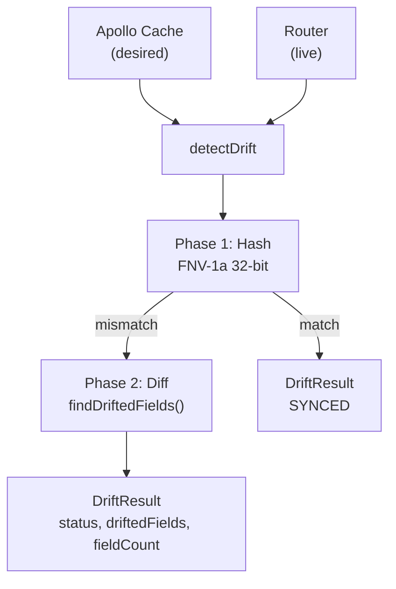

# Drift Detection System

Source: `libs/state/stores/src/drift-detection/`

The drift detection system compares the **desired configuration** stored in the Apollo cache against
the **live state** returned by a re-fetch, identifying fields that have changed on the router
without going through NasNet. It uses a two-phase approach: a fast hash comparison to detect whether
any change occurred, followed by a field-level diff only when the hashes differ.

---

## Architecture Overview



The `ReconciliationScheduler` drives periodic re-fetches. It assigns each resource a priority that
controls how often it checks.

---

## Types

**File:** `libs/state/stores/src/drift-detection/types.ts`

### DriftStatus

```ts
type DriftStatus =
  | 'SYNCED' // Hashes match — no fields have changed
  | 'DRIFTED' // Fields differ between cache and live state
  | 'ERROR' // Re-fetch or comparison threw an error
  | 'CHECKING' // Comparison in progress
  | 'PENDING'; // Not yet checked
```

### DriftedField

```ts
interface DriftedField {
  path: string; // Dot-notation path, e.g. 'network.gateway'
  cachedValue: unknown; // Value in Apollo cache
  liveValue: unknown; // Value from router
  category: 'network' | 'security' | 'general';
}
```

### DriftResult

```ts
interface DriftResult {
  status: DriftStatus;
  driftedFields: DriftedField[];
  fieldCount: number;
  checkedAt: Date;
  resourceId: string;
  cachedHash: string;
  liveHash: string;
}
```

### ResourcePriority

Controls the polling interval used by `ReconciliationScheduler`:

```ts
enum ResourcePriority {
  HIGH = 'HIGH', // 5-minute check interval
  NORMAL = 'NORMAL', // 15-minute check interval
  LOW = 'LOW', // 60-minute check interval
}
```

**Default assignments:**

| Priority | Resource Types                               |
| -------- | -------------------------------------------- |
| HIGH     | WAN interfaces, VPN tunnels                  |
| NORMAL   | LAN interfaces, DHCP servers, firewall rules |
| LOW      | Logging, DNS settings                        |

### RUNTIME_ONLY_FIELDS

Fields excluded from all drift comparisons because they change constantly during normal operation
and do not represent configuration drift:

```ts
const RUNTIME_ONLY_FIELDS = new Set([
  'bytesIn',
  'bytesOut',
  'packetsIn',
  'packetsOut',
  'txRate',
  'rxRate',
  'lastHandshake',
  'uptime',
  'status',
  'isRunning',
  // ... additional runtime metrics
]);
```

Excluding these prevents false positives from traffic counters and uptime ticks.

### DriftResolutionAction

When drift is detected, the UI presents resolution options:

```ts
type DriftResolutionAction =
  | 'APPLY_CACHED' // Push cached (desired) config back to router
  | 'ACCEPT_LIVE' // Update Apollo cache to match live state
  | 'IGNORE' // Dismiss without action
  | 'INVESTIGATE'; // Open diagnostic view
```

---

## Hashing — FNV-1a

**File:** `libs/state/stores/src/drift-detection/driftUtils.ts`

### Algorithm

The system uses **FNV-1a 32-bit** (Fowler–Noll–Vo) to produce a deterministic hash of a normalized
resource snapshot. FNV-1a was chosen because:

- It is fast for small-to-medium objects (router config is typically `<10 KB`)
- It produces a stable 32-bit unsigned integer
- The JavaScript implementation is compact (no external dependency)

```ts
const FNV_OFFSET_BASIS = 2166136261;
const FNV_PRIME = 16777619;

function fnv1aHash(str: string): number {
  let hash = FNV_OFFSET_BASIS;
  for (let i = 0; i < str.length; i++) {
    hash ^= str.charCodeAt(i);
    hash = Math.imul(hash, FNV_PRIME);
  }
  // Force to 32-bit unsigned integer
  return hash >>> 0;
}
```

`Math.imul` is used for multiplication to correctly simulate 32-bit integer overflow in JavaScript,
which would otherwise use 64-bit floating point.

### Normalization before hashing

Before hashing, objects are normalized to ensure deterministic output regardless of key insertion
order or `Date` vs string representation:

```ts
function normalizeForComparison(value: unknown): unknown {
  if (value instanceof Date) {
    return value.toISOString();
  }
  if (Array.isArray(value)) {
    return value.map(normalizeForComparison);
  }
  if (value !== null && typeof value === 'object') {
    // Sort keys alphabetically for deterministic JSON
    return Object.keys(value)
      .sort()
      .reduce<Record<string, unknown>>((acc, key) => {
        acc[key] = normalizeForComparison((value as Record<string, unknown>)[key]);
        return acc;
      }, {});
  }
  return value;
}
```

Key transformations:

- **Dates** → ISO 8601 strings (prevents `Date` vs string mismatch)
- **Object keys** → sorted alphabetically (prevents false positives from key order)
- **Arrays** → elements normalized recursively (order preserved intentionally)

The public entry point:

```ts
export function computeHash(obj: unknown): string {
  const normalized = normalizeForComparison(obj);
  const serialized = JSON.stringify(normalized);
  return String(fnv1aHash(serialized));
}
```

### Quick comparison

`hasQuickDrift()` checks only the hash without performing a full field diff. Used in list views
where computing full diffs for dozens of rows simultaneously would be expensive:

```ts
export function hasQuickDrift(cached: unknown, live: unknown): boolean {
  if (cached === live) return false;
  return computeHash(cached) !== computeHash(live);
}
```

---

## Field-Level Diff

**File:** `libs/state/stores/src/drift-detection/driftUtils.ts`

`findDriftedFields()` walks the object tree recursively and collects every leaf that differs between
the cached and live values:

```ts
export function findDriftedFields(
  cached: Record<string, unknown>,
  live: Record<string, unknown>,
  path = ''
): DriftedField[];
```

### Walk strategy

1. Collect all keys from both objects (union).
2. For each key, skip if it is in `RUNTIME_ONLY_FIELDS`.
3. If both values are plain objects, recurse with the dotted path.
4. If values differ (using normalized string comparison), emit a `DriftedField`.

### Category classification

Each drifted field is tagged with a category based on path prefix:

| Path prefix                                   | Category   |
| --------------------------------------------- | ---------- |
| `network.*`, `ip.*`, `gateway.*`, `dns.*`     | `network`  |
| `firewall.*`, `nat.*`, `auth.*`, `password.*` | `security` |
| everything else                               | `general`  |

This allows the UI to group and prioritize drift notifications — security category drifts are shown
with higher urgency.

### Usage

```ts
import { findDriftedFields, hasQuickDrift } from '@nasnet/state/stores';

// Quick check (hash only)
if (hasQuickDrift(cached, live)) {
  // Full diff
  const drifted = findDriftedFields(cached, live);
  // drifted: [{ path: 'network.gateway', cachedValue: '192.168.1.1', liveValue: '10.0.0.1', category: 'network' }]
}
```

---

## React Hooks

**File:** `libs/state/stores/src/drift-detection/useDriftDetection.ts`

### useDriftDetection

Primary hook for a single resource. Memoizes the result by resource ID so repeated renders do not
trigger unnecessary recomputations:

```ts
export function useDriftDetection(
  resourceId: string,
  options?: {
    priority?: ResourcePriority;
    onDriftDetected?: (result: DriftResult) => void;
  }
): {
  status: DriftStatus;
  driftedFields: DriftedField[];
  fieldCount: number;
  checkedAt: Date | null;
  isChecking: boolean;
  triggerCheck: () => void;
};
```

**Parameters:**

| Parameter         | Default  | Description                                                                                      |
| ----------------- | -------- | ------------------------------------------------------------------------------------------------ |
| `resourceId`      | required | ULID of the resource to monitor                                                                  |
| `priority`        | `NORMAL` | Polling priority; controls `ReconciliationScheduler` interval                                    |
| `onDriftDetected` | —        | Callback fired when drift is first detected; not called for subsequent checks if already DRIFTED |

**Example:**

```tsx
function ResourceStatusBadge({ resourceId }: { resourceId: string }) {
  const { status, fieldCount } = useDriftDetection(resourceId, {
    priority: ResourcePriority.HIGH,
    onDriftDetected: (result) => {
      showWarning('Configuration drift', `${result.fieldCount} fields changed`);
    },
  });

  if (status === 'DRIFTED') {
    return <DriftBadge fieldCount={fieldCount} />;
  }
  return <SyncedBadge />;
}
```

### useQuickDriftCheck

Hash-only check for list views. Does not perform a full field diff, so it is cheaper for tables with
many rows:

```ts
export function useQuickDriftCheck(resourceId: string): {
  hasDrift: boolean;
  isChecking: boolean;
};
```

Use this in table rows where you only need a visual indicator (badge, color) without the field
breakdown.

### useBatchDriftStatus

Checks multiple resources at once, returning a map from resource ID to status:

```ts
export function useBatchDriftStatus(resourceIds: string[]): Record<string, DriftStatus>;
```

**Example:**

```tsx
function DriftSummaryPanel({ resourceIds }: { resourceIds: string[] }) {
  const statusMap = useBatchDriftStatus(resourceIds);
  const driftedCount = Object.values(statusMap).filter((s) => s === 'DRIFTED').length;

  return <div>{driftedCount} resources have drifted</div>;
}
```

### Internal detectDrift function

Used by the hooks and by `ReconciliationScheduler`. Not exported for direct use:

```ts
async function detectDrift(resourceId: string): Promise<DriftResult> {
  // 1. Read cached config from Apollo cache
  // 2. Re-fetch live config from router
  // 3. Normalize both (strip RUNTIME_ONLY_FIELDS)
  // 4. Hash comparison (phase 1)
  // 5. If hashes differ: findDriftedFields() (phase 2)
  // 6. Return DriftResult
}
```

---

## Reconciliation Scheduler

**File:** `libs/state/stores/src/drift-detection/reconciliationScheduler.ts`

`ReconciliationScheduler` is a singleton class that maintains a queue of resources to check and
ticks every 60 seconds to process due items.

### Class interface

```ts
class ReconciliationScheduler {
  register(resourceId: string, priority: ResourcePriority): void;
  unregister(resourceId: string): void;
  start(): void;
  stop(): void;
  triggerImmediately(resourceId: string): void;
  onDriftDetected(callback: (result: DriftResult) => void): () => void;
}
```

### Priority intervals

| Priority | Interval   |
| -------- | ---------- |
| `HIGH`   | 5 minutes  |
| `NORMAL` | 15 minutes |
| `LOW`    | 60 minutes |

### Scheduling algorithm

Each registered resource has a `nextCheck` timestamp. On each 60-second tick, the scheduler:

1. Collects all resources where `nextCheck <= now`.
2. Batches them in groups of 10 (to avoid saturating the router API).
3. Calls `detectDrift()` for each batch item.
4. Updates `nextCheck = now + intervalForPriority(priority)`.
5. Emits `onDriftDetected` for any `DRIFTED` results.

The 60-second tick is the minimum resolution. HIGH priority resources are checked every 5 minutes =
5 ticks between checks.

### Offline behavior

The scheduler pauses when `useConnectionStore.getState().wsStatus !== 'connected'`. It resumes
automatically when the connection is restored, immediately re-checking HIGH priority resources that
are overdue.

### Usage

`ReconciliationScheduler` is managed internally by `useDriftDetection`. Components do not interact
with it directly. The lifecycle is:

```ts
// Inside useDriftDetection
useEffect(() => {
  scheduler.register(resourceId, priority ?? ResourcePriority.NORMAL);
  return () => scheduler.unregister(resourceId);
}, [resourceId, priority]);
```

The scheduler singleton is started once at app startup and runs for the session lifetime.

---

## Two-Phase Detection in Practice

The two-phase design trades memory (storing hashes alongside full state) for CPU savings (skipping
the field walk when unchanged):

| Phase   | Complexity                  | Condition             |
| ------- | --------------------------- | --------------------- |
| Phase 1 | O(n) string hash comparison | Always                |
| Phase 2 | O(n²) object traversal      | Only on hash mismatch |

**Typical ratio:**

- ~95% of checks end at Phase 1 (SYNCED)
- ~5% proceed to Phase 2 (network noise, actual drift)

For a router with 50 registered resources at NORMAL priority:

- 50 resources × hash check every 15 min = 3.3 hash checks per minute
- Full diffs happen only when router config actually changes

---

## Integration with Apollo Cache

Drift detection reads from and writes to the Apollo cache directly:

| Direction    | Action                                                                       |
| ------------ | ---------------------------------------------------------------------------- |
| Read         | Reads `cached` value from Apollo `InMemoryCache` using resource UUID         |
| Accept live  | Writes `live` value back to Apollo cache (`cache.writeFragment`)             |
| Apply cached | Triggers a GraphQL mutation via `applyConfig` to push cached state to router |

The `ACCEPT_LIVE` resolution path updates the Apollo cache, which then propagates to all subscribed
components automatically via Apollo's reactive cache.

---

## Related Documentation

- `../architecture/provider-stack.md` — Where `ReconciliationScheduler.start()` is called in the
  provider initialization order
- `../cross-cutting-features/drift-detection-feature.md` — User-facing feature documentation (UI
  flows, resolution dialogs)
- `apollo-client.md` — Apollo cache type policies; `runtime` layer merge strategy used by drift
  detection to get clean configuration snapshots
- `zustand-stores.md` — `useConnectionStore` (used by scheduler for online/offline detection)
