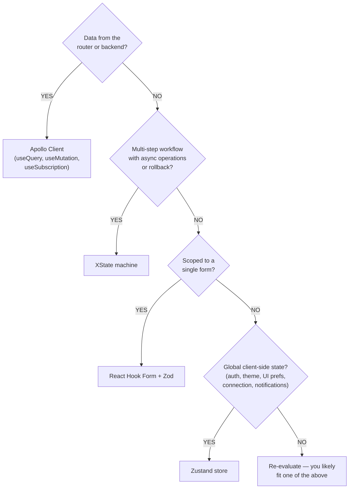

# State Management Overview

The `apps/connect` frontend uses a four-layer state architecture. Each layer handles a distinct
class of state, and the choice of tool for any given piece of state follows from which layer it
belongs to.

---

## The Four Layers

| Layer            | Tool                  | Scope                                                | Persistence                |
| ---------------- | --------------------- | ---------------------------------------------------- | -------------------------- |
| 1. Server State  | Apollo Client         | Router config, resources, GraphQL data               | Cache + optional IndexedDB |
| 2. UI State      | Zustand               | Auth, connection, theme, modals, notifications       | localStorage (selectively) |
| 3. Complex Flows | XState                | Config pipeline, change sets, wizards, VPN lifecycle | In-memory (session)        |
| 4. Form State    | React Hook Form + Zod | Field values, errors, touched state, submission      | In-memory (form lifetime)  |

---

## Layer 1: Server State — Apollo Client

Apollo Client is the source of truth for all data that originates on the router or backend. It
manages fetching, caching, subscriptions, and cache normalization.

**Use Apollo when:**

- Data comes from a GraphQL query or mutation
- You need real-time updates via subscriptions
- Multiple components share the same server data
- You want automatic cache invalidation and updates

```tsx
// Queries and mutations via generated hooks
import { useGetRouterQuery } from '@nasnet/api-client/queries';

function RouterStatus({ routerId }: { routerId: string }) {
  const { data, loading, error } = useGetRouterQuery({
    variables: { routerId },
  });
  // ...
}
```

See `apollo-client.md` for full configuration details.

---

## Layer 2: UI State — Zustand

Zustand stores hold global client-side state that is not server-derived. All stores live in
`libs/state/stores/src/`.

**Use Zustand when:**

- State affects multiple unrelated components
- State must persist across page navigations (theme, auth tokens)
- State is purely client-side (no server round-trip needed)
- You need to access state outside React (e.g., in Apollo links)

```tsx
// Selector pattern — always prefer granular selectors
const isAuthenticated = useAuthStore((state) => state.isAuthenticated);
const wsStatus = useConnectionStore((state) => state.wsStatus);
```

See `zustand-stores.md` for a complete inventory of all stores.

---

## Layer 3: Complex Flows — XState

XState v5 machines model multi-step workflows where the sequence of operations and possible error
paths must be explicit. All machines live in `libs/state/machines/src/`.

**Use XState when:**

- A feature has distinct sequential states (e.g., draft → validating → applying → verified)
- Incorrect state transitions would cause data loss or router misconfiguration
- Multiple async operations must coordinate with rollback support
- A wizard collects data across steps with per-step validation

```tsx
import { useActor } from '@xstate/react';
import { createConfigPipelineMachine } from '@nasnet/state/machines';

const machine = createConfigPipelineMachine({ ... });
const [state, send] = useActor(machine);

send({ type: 'EDIT', config: newConfig });
```

See `xstate-machines.md` for all machine definitions and state diagrams.

---

## Layer 4: Form State — React Hook Form + Zod

Forms maintain their own local state through React Hook Form. Zod schemas define validation rules.
This state is ephemeral and scoped to the form's lifetime.

**Use React Hook Form when:**

- Managing a form with field-level validation
- Handling submission, dirty state, and touched fields
- Performing async validation against the backend

```tsx
import { useForm } from 'react-hook-form';
import { zodResolver } from '@hookform/resolvers/zod';
import { z } from 'zod';

const schema = z.object({
  address: z.string().ip({ version: 'v4' }),
  port: z.number().int().min(1).max(65535),
});

const form = useForm({
  resolver: zodResolver(schema),
  defaultValues: { address: '', port: 8728 },
});
```

---

## Decision Tree

Use the following questions in order:



---

## Cross-Layer Interactions

The layers interact in predictable ways:

- **Apollo links read Zustand stores** — The auth link reads `useAuthStore` to inject JWT tokens.
  The WebSocket client reads `useConnectionStore` for the active router ID.
- **XState machines call Apollo** — Pipeline and change set machines invoke GraphQL mutations as
  their `applyConfig` / `applyItem` services.
- **Zustand stores trigger XState events** — Connection loss detected in `useConnectionStore` can
  drive a reconnection machine.
- **Forms submit via Apollo mutations** — React Hook Form `onSubmit` typically calls a `useMutation`
  hook.

---

## Provider Initialization Order

State providers initialize in a specific order to satisfy dependencies. See
`../architecture/provider-stack.md` for the full provider stack.

At a high level:

1. **Zustand stores** initialize lazily on first use (no provider needed)
2. **Apollo Provider** wraps the app and provides the client
3. **XState actors** are created within feature components that need them

---

## Performance Guidelines

**Zustand selectors are critical.** Without a selector, a component re-renders on any store change:

```tsx
// BAD — re-renders on any connection store change
const store = useConnectionStore();

// GOOD — re-renders only when wsStatus changes
const wsStatus = useConnectionStore((state) => state.wsStatus);

// GOOD — multiple fields with shallow comparison
import { shallow } from 'zustand/shallow';
const { wsStatus, isReconnecting } = useConnectionStore(
  (state) => ({ wsStatus: state.wsStatus, isReconnecting: state.isReconnecting }),
  shallow
);
```

**Apollo fetch policies.** The default `watchQuery` policy is `cache-and-network`, which returns
cached data immediately and refreshes in the background. Use `cache-first` for rarely-changing data.
