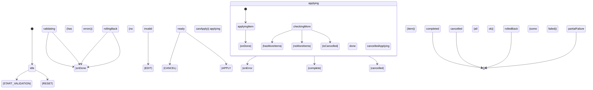
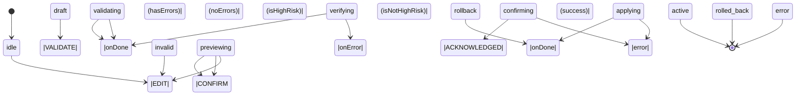
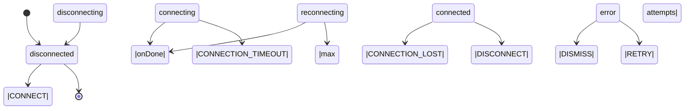
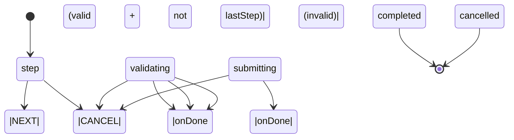

# XState State Machines

All machines live in `libs/state/machines/src/`. Import from `@nasnet/state/machines`.

Machines are created via factory functions (not exported as bare machine instances) because they accept service implementations as dependencies. This keeps async side effects out of the machine definition and makes testing straightforward.

The codebase uses XState v5 (`setup(...).createMachine(...)`).

---

## Machine Index

| Machine | Factory | Purpose |
|---------|---------|---------|
| `changeSetMachine` | `createChangeSetMachine` | Atomic multi-resource apply with rollback |
| `configPipelineMachine` | `createConfigPipelineMachine` | Safety pipeline: Draft → Validate → Preview → Apply → Verify |
| `vpnConnectionMachine` | `createVPNConnectionMachine` | VPN lifecycle: connect, reconnect, metrics, disconnect |
| `wizardMachine` | `createWizardMachine` | Generic multi-step wizard with per-step validation |
| `resourceLifecycleMachine` | `createResourceLifecycleMachine` | Single resource CRUD lifecycle |

---

## Change Set Machine

**File:** `libs/state/machines/src/changeSetMachine.ts`

Orchestrates applying a bundle of interdependent resource operations atomically. Items are applied in dependency order (topological sort). On any failure, applied items are rolled back in reverse order.

### State Diagram



### Context

```ts
interface ChangeSetMachineContext {
  changeSet: ChangeSet | null;
  routerId: string | null;
  validationResult: ChangeSetValidationResult | null;
  currentItemIndex: number;
  sortedItems: ChangeSetItem[];   // Topologically sorted on LOAD
  appliedItems: ChangeSetItem[];  // Items successfully applied
  rollbackPlan: RollbackStep[];   // Built in reverse order as items apply
  error: ChangeSetError | null;
  cancelRequested: boolean;
  applyStartedAt: number | null;
}
```

### Events

| Event | Trigger |
|-------|---------|
| `LOAD` | Load a change set into the machine |
| `START_VALIDATION` | Begin validation |
| `APPLY` | Start applying (requires `ready` state and `canApply` guard) |
| `CANCEL` | Request cancellation (safe-point stop if mid-apply) |
| `FORCE_ROLLBACK` | Manually trigger rollback from `failed` or `cancelled` |
| `RETRY` | Re-attempt from `failed` (goes back to `validating`) |
| `RESET` | Clear all context, return to `idle` |

### Guards

| Guard | Condition |
|-------|-----------|
| `hasMoreItems` | `currentItemIndex < sortedItems.length` |
| `noMoreItems` | `currentItemIndex >= sortedItems.length` |
| `canApply` | `validationResult.canApply === true && sortedItems.length > 0` |
| `hasAppliedItems` | `appliedItems.length > 0` |
| `isCancelled` | `cancelRequested === true` |
| `hasValidationErrors` | `validationResult.errors.length > 0` |

### Creating and Using

```ts
import { createChangeSetMachine } from '@nasnet/state/machines';
import { useActor } from '@xstate/react';

const machine = createChangeSetMachine({
  validateChangeSet: async (changeSet) => {
    const result = await apolloClient.query({ query: VALIDATE_CHANGE_SET, variables: { id: changeSet.id } });
    return result.data.validateChangeSet;
  },
  applyItem: async ({ item, routerId }) => {
    const result = await apolloClient.mutate({ mutation: APPLY_RESOURCE, variables: { routerId, item } });
    return { confirmedState: result.data.confirmedState, resourceUuid: result.data.resourceUuid };
  },
  rollbackItem: async ({ rollbackStep, routerId }) => {
    await apolloClient.mutate({ mutation: ROLLBACK_RESOURCE, variables: { routerId, ...rollbackStep } });
  },
  onProgress: (event) => {
    console.log(`${event.appliedCount}/${event.totalCount} applied`);
  },
  onComplete: (changeSet) => showSuccess(`Applied ${changeSet.items.length} changes`),
});

const [state, send] = useActor(machine);

send({ type: 'LOAD', changeSet, routerId });
send({ type: 'START_VALIDATION' });
// After validation passes (state.value === 'ready'):
send({ type: 'APPLY' });
```

### Helper Functions

```ts
import {
  isChangeSetProcessing,
  isChangeSetFinal,
  isChangeSetCancellable,
  getChangeSetMachineStateDescription,
} from '@nasnet/state/machines';

isChangeSetProcessing('validating'); // true
isChangeSetFinal('completed');       // true
getChangeSetMachineStateDescription('rollingBack'); // 'Rolling back changes...'
```

---

## Config Pipeline Machine

**File:** `libs/state/machines/src/configPipelineMachine.ts`

Implements the Apply-Confirm-Merge safety flow for configuration changes. Prevents accidental network lockouts by requiring explicit validation and preview steps before touching the router.

### State Diagram



### States

| State | Description |
|-------|-------------|
| `idle` | Waiting for first edit |
| `draft` | User is editing, changes not yet validated |
| `validating` | Running the 7-stage validation pipeline |
| `invalid` | Validation failed — errors shown to user |
| `previewing` | Diff of changes shown to user |
| `confirming` | Explicit acknowledgment required (high-risk operations only) |
| `applying` | Sending configuration to router |
| `verifying` | Polling router to confirm changes took effect |
| `active` | Configuration applied successfully (final) |
| `rollback` | Executing rollback to previous safe state |
| `rolled_back` | Rollback complete (final) |
| `error` | Unrecoverable error — manual intervention needed |

### Guards

| Guard | Condition |
|-------|-----------|
| `hasValidationErrors` | Validation returned errors |
| `noValidationErrors` | Validation returned no errors |
| `isHighRisk` | `context.diff.isHighRisk === true` |
| `hasRollbackData` | Rollback data captured from apply step |

### Events

| Event | Valid From State(s) |
|-------|---------------------|
| `EDIT` | `idle`, `draft`, `invalid`, `previewing` |
| `VALIDATE` | `draft` |
| `CONFIRM` | `previewing` |
| `ACKNOWLEDGED` | `confirming` |
| `RETRY` | `error` |
| `FORCE_ROLLBACK` | `error` (requires `hasRollbackData`) |
| `CANCEL` | `draft`, `invalid`, `previewing`, `confirming` |
| `RESET` | `error` |

### Creating and Using

```ts
import { createConfigPipelineMachine } from '@nasnet/state/machines';
import { useActor } from '@xstate/react';

const machine = createConfigPipelineMachine<WireGuardConfig>({
  runValidationPipeline: async (config) => {
    const errors = await validateWireGuardConfig(config);
    const diff = await computeConfigDiff(config);
    return { errors, diff };
  },
  applyConfig: async ({ resourceId, config }) => {
    const backup = await getRouterConfig(resourceId);
    await applyConfig(resourceId, config);
    return { rollbackData: backup };
  },
  verifyApplied: async (resourceId) => {
    const status = await checkStatus(resourceId);
    if (!status.running) throw new Error('Service failed to start');
  },
  executeRollback: async (rollbackData) => {
    await restoreConfig(rollbackData);
  },
  onSuccess: () => showSuccess('Configuration applied'),
  onRollback: () => showWarning('Configuration rolled back'),
});

const [state, send] = useActor(machine);
send({ type: 'EDIT', config: newConfig });
send({ type: 'VALIDATE' });
```

### Helper Functions

```ts
import {
  isPipelineFinal,
  isPipelineCancellable,
  isPipelineProcessing,
  getPipelineStateDescription,
} from '@nasnet/state/machines';

isPipelineProcessing('applying');        // true
getPipelineStateDescription('previewing'); // 'Review changes'
```

---

## VPN Connection Machine

**File:** `libs/state/machines/src/vpnConnectionMachine.ts`

Manages the lifecycle of a single VPN connection. Handles connection timeouts, automatic reconnection with exponential backoff, real-time metrics updates, and graceful disconnection.

### State Diagram



### Configuration

- Connection timeout: 30 seconds
- Reconnect timeout: 10 seconds
- Max reconnect attempts: 3
- Backoff: 1s, 2s, 4s, capped at 8s

### React Hook

```tsx
import { useVPNConnection } from '@nasnet/state/machines';

function VPNStatus() {
  const vpn = useVPNConnection({
    establishConnection: api.connectVPN,
    attemptReconnect: api.reconnectVPN,
    closeConnection: api.disconnectVPN,
  });

  return (
    <div>
      {vpn.isConnected && <MetricsDisplay metrics={vpn.metrics} />}
      {vpn.isError && <ErrorMessage error={vpn.error} onRetry={vpn.retry} />}
      <button onClick={() => vpn.isConnected ? vpn.disconnect() : vpn.connect('vpn.example.com', 'wireguard')}>
        {vpn.isConnected ? 'Disconnect' : 'Connect'}
      </button>
    </div>
  );
}
```

The `useVPNConnection` hook wraps `useMachine` and exposes derived booleans (`isConnected`, `isConnecting`, `isError`) and action methods (`connect`, `disconnect`, `retry`, `updateMetrics`, `reportConnectionLost`).

---

## Wizard Machine

**File:** `libs/state/machines/src/wizardMachine.ts`

Generic multi-step wizard. The primary export is `createWizardMachine` (V2 implementation, which correctly routes the last step to submission).

### State Diagram



### Configuration

```ts
interface WizardConfig<TData> {
  id: string;
  totalSteps: number;
  validateStep: (step: number, data: Partial<TData>) => Promise<{ valid: boolean; errors?: Record<string, string> }>;
  onSubmit: (data: TData) => Promise<void>;
  initialData?: Partial<TData>;
  persist?: boolean;
}
```

### Events

| Event | Description |
|-------|-------------|
| `NEXT` | Advance (triggers validation) |
| `BACK` | Go to previous step |
| `GOTO` | Jump to specific step (forward only if `canSkip`) |
| `SET_DATA` | Merge data without advancing |
| `CLEAR_ERRORS` | Clear validation errors |
| `CANCEL` | Abandon wizard |
| `RESTORE` | Restore from persisted session |

### Usage

```ts
import { createWizardMachine } from '@nasnet/state/machines';

const vpnWizard = createWizardMachine<{ server: string; protocol: string }>({
  id: 'vpn-setup',
  totalSteps: 3,
  validateStep: async (step, data) => {
    if (step === 1 && !data.server) {
      return { valid: false, errors: { server: 'Required' } };
    }
    return { valid: true };
  },
  onSubmit: async (data) => {
    await api.createVPN(data);
  },
});
```

The `useWizard` hook in `libs/state/machines/src/hooks/useWizard.ts` wraps `useMachine` with a clean API:

```tsx
import { useWizard } from '@nasnet/state/machines';

const { currentStep, totalSteps, data, errors, next, back, goTo, cancel } = useWizard(wizardConfig);
```

---

## Resource Lifecycle Machine

**File:** `libs/state/machines/src/resourceLifecycleMachine.ts`

Manages the CRUD lifecycle of a single resource (create, update, delete) with optimistic UI and rollback on failure.

---

## Machine Persistence

**File:** `libs/state/machines/src/persistence.ts`

Utilities to save and restore XState machine context to `sessionStorage`. Used by the wizard machine's `RESTORE` event for session recovery.

```ts
import { saveMachineState, restoreMachineState } from '@nasnet/state/machines';

// Save on every transition
saveMachineState('vpn-wizard', state.context);

// Restore on mount
const saved = restoreMachineState('vpn-wizard');
if (saved) send({ type: 'RESTORE', savedContext: saved });
```
