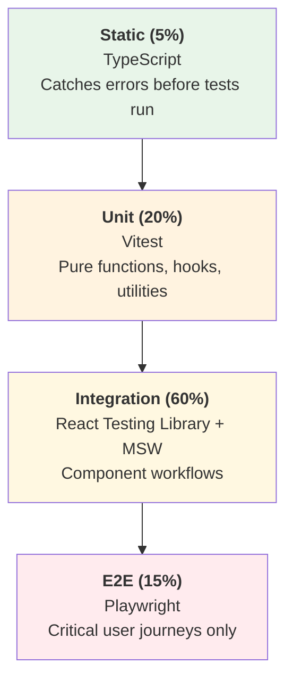

# Testing Overview

NasNetConnect uses a **Testing Trophy** approach — the majority of tests are integration tests that verify real user workflows through the component tree, with a smaller base of unit tests for pure logic and a thin layer of E2E tests for critical user journeys.

**Reference:** ADR-015 (cited in `apps/connect/src/test/setup.ts`)

---

## Testing Trophy



| Layer | Percentage | Tools | Focus |
|-------|-----------|-------|-------|
| Static | 5% | TypeScript | Type errors before runtime |
| Unit | 20% | Vitest | Pure functions, utilities, hooks in isolation |
| Integration | 60% | React Testing Library + MSW | Components with real logic and mocked network |
| E2E | 15% | Playwright | Critical happy-path and edge-case user flows |

---

## Testing Philosophy

### Test behavior, not implementation

Tests should describe what a user does and what they observe — not internal implementation details. This means testing what appears on screen rather than component state or method calls.

```tsx
// Good — tests the user's perspective
it('should show an error message when the router is unreachable', async () => {
  server.use(errorHandler);
  render(<RouterPanel routerId="r1" />);
  expect(await screen.findByText(/connection failed/i)).toBeInTheDocument();
});

// Bad — tests implementation detail
it('should set isError to true in state', () => {
  const { result } = renderHook(() => useRouterQuery('r1'));
  expect(result.current.isError).toBe(true);
});
```

### User-centric queries

React Testing Library queries in preference order:

1. `getByRole` — reflects semantic HTML (most accessible, most robust)
2. `getByLabelText` — for form inputs
3. `getByPlaceholderText` — only when no label exists
4. `getByText` — for visible text
5. `getByTestId` — last resort when no semantic query fits

```tsx
// Preferred
screen.getByRole('button', { name: /save/i });
screen.getByLabelText('Interface Name');

// Last resort
screen.getByTestId('submit-button');
```

### No test isolation by mocking implementation

Don't mock modules just to isolate units — prefer testing with real implementations through integration tests. Only mock:
- Network requests (via MSW)
- Third-party hooks that call real external APIs
- Browser APIs not available in jsdom (`matchMedia`, `ResizeObserver`)

---

## Test Organization

Tests live alongside source files, not in a separate directory:

```
src/
├── app/
│   ├── pages/
│   │   ├── network/
│   │   │   ├── components/
│   │   │   │   ├── ARPTable.tsx
│   │   │   │   ├── ARPTable.test.tsx        ← co-located test
│   │   │   │   ├── ARPTable.stories.tsx     ← Storybook story
│   │   │   │   ├── InterfaceCard.tsx
│   │   │   │   └── InterfaceCard.test.tsx
├── mocks/
│   ├── server.ts        ← MSW Node server (Vitest)
│   ├── browser.ts       ← MSW service worker (Storybook/dev)
│   └── handlers/
│       ├── graphql.ts   ← GraphQL mock handlers
│       ├── rest.ts      ← REST mock handlers
│       └── index.ts
└── test/
    ├── setup.ts         ← Vitest global setup
    ├── test-utils.tsx   ← Custom render with providers
    ├── index.ts
    └── chr/
        └── chr-utils.ts ← CHR Docker test utilities
```

---

## Router Testing Tiers

NasNetConnect has a unique three-tier strategy for testing router interactions:

| Tier | Environment | Speed | Fidelity | Usage |
|------|-------------|-------|----------|-------|
| 1 — Mock | MSW handlers | Fastest | Low | Unit + integration tests |
| 2 — CHR Docker | RouterOS CHR container | Moderate | High | Integration + E2E tests in CI |
| 3 — Physical | Real MikroTik hardware | Slowest | Highest | Manual QA only |

CHR (Cloud Hosted Router) is the official MikroTik RouterOS virtual machine image. It runs in Docker during CI and provides real RouterOS behavior without physical hardware. See `apps/connect/src/test/chr/chr-utils.ts` and `apps/connect-e2e/src/chr-integration.spec.ts`.

---

## Coverage Goals

Coverage thresholds are enforced in CI (configured in `apps/connect/vitest.config.ts`):

| Metric | Threshold |
|--------|-----------|
| Lines | 80% |
| Branches | 75% |
| Functions | 75% |
| Statements | 80% |

Coverage is measured with V8 (native) provider and reports are generated in `apps/connect/coverage/`.

---

## Running Tests

```bash
# All tests in the connect app
npx nx test connect

# Watch mode (default in vitest.config.ts)
npx nx test connect --watch

# With coverage
npx nx test connect --coverage

# All tests across the monorepo
npx nx run-many -t test

# E2E tests
npx nx e2e connect-e2e

# E2E with Playwright UI (for debugging)
npx playwright test --ui --project=chromium

# CHR integration tests only
npx playwright test --project=chr-integration
```

---

## Tools Reference

| Tool | Version | Purpose |
|------|---------|---------|
| Vitest | Latest | Test runner (4× faster than Jest, native ESM) |
| React Testing Library | Latest | Component rendering and user-event simulation |
| `@testing-library/user-event` | Latest | Realistic browser event simulation |
| `@testing-library/jest-dom` | Latest | DOM-specific matchers (`toBeInTheDocument`, `toHaveClass`) |
| MSW (Mock Service Worker) | Latest | Network request interception |
| Playwright | Latest | E2E cross-browser testing |
| axe-core | Latest | Automated accessibility scanning |
| Pa11y | Latest | CI accessibility gate |

---

## See Also

- `./unit-testing.md` — Vitest configuration, hooks, store testing
- `./component-testing.md` — React Testing Library patterns
- `./e2e-testing.md` — Playwright configuration and CHR integration
- `./mocking.md` — MSW handler patterns
- `../architecture/provider-stack.md` — Provider hierarchy used in test wrappers
