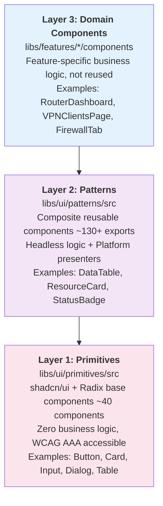

# UI System Overview

The NasNetConnect UI system is built around a strict three-layer component architecture. Each layer
has a clear responsibility and defined dependency direction. Components flow downward — domain
components compose patterns, patterns compose primitives — never the other way around.

See `../architecture/overview.md` for where the UI system fits in the overall frontend architecture.

## Three-Layer Component Architecture



**Dependency rule:** Layer 3 → Layer 2 → Layer 1 (no upward dependencies)

This is enforced by Nx boundary lint rules. A pattern component cannot import from `libs/features/`,
and a primitive cannot import from `libs/ui/patterns/`.

## Layer 1: Primitives

**Location:** `libs/ui/primitives/src/`

**Import alias:** `@nasnet/ui/primitives`

Primitives are shadcn/ui components extended with NasNetConnect design tokens. They:

- Have zero business logic
- Are WCAG AAA accessible (7:1 contrast ratios)
- Use semantic CSS variables (`--primary`, `--foreground`, `--muted`, etc.), never raw colors
- Support dark mode via CSS custom properties
- Meet the 44px minimum touch target size on mobile

There are approximately 40 primitives organized by function: form controls, display, navigation,
overlays, and feedback. See `primitives-catalog.md` for the full inventory.

**Example:**

```tsx
import { Button, Card, Input } from '@nasnet/ui/primitives';

<Card>
  <Input placeholder="Router hostname" />
  <Button>Connect</Button>
</Card>;
```

## Layer 2: Patterns

**Location:** `libs/ui/patterns/src/`

**Import alias:** `@nasnet/ui/patterns`

Patterns are composite reusable components that compose primitives and add domain-aware behavior.
Key characteristics:

- **Headless + Platform Presenters**: Business logic lives in a headless hook; rendering is split
  into Mobile, Tablet, and Desktop presenters
- **Platform-adaptive**: Components auto-detect the current viewport platform and render the
  appropriate presenter
- **Category-aware**: Many components accept category context (vpn, firewall, networking, etc.) for
  consistent color accents

The patterns library contains 130+ exports covering common UI patterns (tables, cards, status
indicators, dialogs) and domain-specific patterns (VPN cards, DHCP lease tables, firewall log
viewers, resource budget panels).

See `patterns-catalog.md` for the full inventory.

**Example:**

```tsx
import { DataTable, StatusBadge, ConnectionIndicator } from '@nasnet/ui/patterns';

// DataTable auto-adapts its density per platform
<DataTable columns={columns} data={leases} onRowClick={handleSelect} />

// ConnectionIndicator renders mobile or desktop variant automatically
<ConnectionIndicator routerId={id} />
```

## Layer 3: Domain Components

**Location:** `libs/features/*/components/` and `apps/connect/src/app/`

Domain components are feature-specific and are never shared across features. They:

- Wire GraphQL data (from `@nasnet/api-client/queries`) into pattern components
- Contain page-level layouts and feature-specific business logic
- Are allowed to import from `libs/features/`, `libs/ui/`, `libs/api-client/`, and `libs/state/`
- Are forbidden from importing between different feature libraries

**Example:**

```tsx
// libs/features/firewall/src/components/FirewallRulesPage.tsx
import { DataTable, PageHeader } from '@nasnet/ui/patterns';
import { useFirewallRules } from '@nasnet/api-client/queries';

export function FirewallRulesPage() {
  const { data } = useFirewallRules();
  return (
    <>
      <PageHeader title="Firewall Rules" />
      <DataTable
        columns={columns}
        data={data?.rules ?? []}
      />
    </>
  );
}
```

## Supporting Infrastructure

Beyond the three component layers, the UI system includes:

| Package       | Location               | Purpose                                                       |
| ------------- | ---------------------- | ------------------------------------------------------------- |
| Design Tokens | `libs/ui/tokens/src/`  | Three-tier token pipeline (Primitive → Semantic → Component)  |
| Layouts       | `libs/ui/layouts/src/` | ResponsiveShell, AppShell, MobileAppShell, CollapsibleSidebar |
| Utils         | `libs/ui/utils/src/`   | `cn()` utility and shared helpers                             |

## Design Token Integration

Components use Tailwind CSS 4.x with CSS custom properties. The token pipeline generates variables
like:

- `--primary` (Golden Amber `#EFC729`)
- `--secondary` (Trust Blue `#4972BA`)
- `--success`, `--warning`, `--error`, `--info` (semantic status colors)
- `--semantic-color-category-*` (14 category accent colors)

Always use semantic tokens (Tier 2), not raw primitive colors:

```tsx
// Correct
<div className="bg-primary text-primary-foreground">...</div>
<div className="bg-success text-success-foreground">...</div>

// Wrong - uses raw color not token
<div className="bg-amber-500 text-white">...</div>
```

See `design-tokens.md` for the complete token reference.

## Platform-Adaptive Rendering

Every pattern component must implement the Headless + Platform Presenters pattern. The
`ResponsiveShell` layout automatically selects the appropriate shell, and individual pattern
components use `usePlatform()` to render the right presenter.

See `platform-presenters.md` for the full implementation guide.

## Accessibility Requirements

All components must meet WCAG AAA:

- **Contrast ratio:** 7:1 for normal text, 4.5:1 for large text
- **Touch targets:** 44px minimum on mobile
- **Keyboard navigation:** Full support with visible focus indicators (3px ring)
- **Screen readers:** Semantic HTML, ARIA labels, live regions
- **Reduced motion:** Respects `prefers-reduced-motion` via `useReducedMotion()` hook

## Further Reading

- `design-tokens.md` — Complete token system reference
- `platform-presenters.md` — Headless + Platform Presenters pattern
- `primitives-catalog.md` — All ~40 primitive components
- `patterns-catalog.md` — All ~130 pattern exports
- `layouts.md` — ResponsiveShell, AppShell, MobileAppShell
- `Docs/design/DESIGN_TOKENS.md` — Authoritative design token specification
- `Docs/design/PLATFORM_PRESENTER_GUIDE.md` — Authoritative presenter guide
