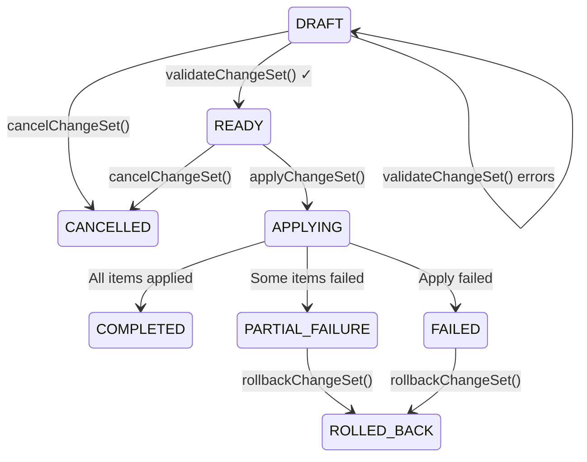

# Change Set Pattern

A Change Set is an ordered, atomic batch of resource operations (creates, updates, and deletes) that must all succeed or all roll back together. Rather than applying individual mutations one at a time and hoping the router ends up in a consistent state, a Change Set lets UI flows compose several operations — create a bridge, add a DHCP server, write three firewall rules — and commit them in a single transactional unit. The `libs/api-client/queries/src/change-set/` module provides GraphQL fragments, query hooks, mutation hooks, and real-time subscription hooks that implement every stage of this lifecycle.

---

## Table of Contents

1. [Apply-Confirm-Merge Lifecycle](#apply-confirm-merge-lifecycle)
2. [GraphQL Fragments](#graphql-fragments)
3. [Query Keys and Cache Invalidation](#query-keys-and-cache-invalidation)
4. [Query Hooks](#query-hooks)
5. [Mutation Hooks](#mutation-hooks)
6. [useChangeSetOperations — Combined Hook](#usechangesetoperations--combined-hook)
7. [Subscription Hooks](#subscription-hooks)
8. [useApplyWithProgress — Complete Apply Workflow](#useapplywithprogress--complete-apply-workflow)
9. [Cache Eviction on Delete](#cache-eviction-on-delete)
10. [Cross-References](#cross-references)

---

## Apply-Confirm-Merge Lifecycle

A Change Set moves through the following status transitions. The client drives all transitions via mutations; the server confirms each transition and broadcasts progress events via WebSocket subscription.



### Stage-by-Stage Walkthrough

```
1. CREATE     useCreateChangeSet()          DRAFT
              ├── Name, description, source
              └── Returns empty ChangeSet

2. COMPOSE    useAddChangeSetItem() × N     DRAFT
              ├── Each item: resourceType, operation, configuration
              └── Server assigns applyOrder based on dependency analysis

3. UPDATE     useUpdateChangeSetItem()      DRAFT
              └── Modify item configuration before validating

4. REMOVE     useRemoveChangeSetItem()      DRAFT
              └── Drop an item before applying

5. VALIDATE   useValidateChangeSet()        DRAFT → READY (if canApply)
              ├── Checks: syntax, semantic, dependency, conflict, security
              ├── Returns ChangeSetValidationResult
              └── Items with errors block apply unless force: true

6. APPLY      useApplyChangeSet()           READY → APPLYING
              ├── Server processes items in applyOrder sequence
              └── Progress streams via useChangeSetProgressSubscription

7. MONITOR    useChangeSetProgressSubscription()  (during APPLYING)
              ├── progressPercent, currentItem, estimatedRemainingMs
              ├── onComplete → COMPLETED
              └── onError → FAILED or PARTIAL_FAILURE

8. ROLLBACK   useRollbackChangeSet()        FAILED → ROLLED_BACK
              ├── Executes rollbackPlan steps in reverse applyOrder
              └── Returns { success, failedItems }

9. CANCEL     useCancelChangeSet()          DRAFT/READY → CANCELLED
              └── Cannot cancel while APPLYING

10. DELETE    useDeleteChangeSet()          any non-APPLYING state
              └── Evicts from Apollo cache
```

---

## GraphQL Fragments

**Source file:** `libs/api-client/queries/src/change-set/fragments.ts`

### Base Fragments

**`CHANGE_SET_ITEM_LIGHT_FRAGMENT`** (`ChangeSetItemLight`) — for progress tracking:
```ts
// fragments.ts:18
// id, name, resourceType, resourceCategory, operation, status, applyOrder, error
```

**`CHANGE_SET_ITEM_FULL_FRAGMENT`** (`ChangeSetItemFull`) — for detail views:
```ts
// fragments.ts:34
// id, name, description, resourceType, resourceCategory, resourceUuid,
// operation, status, configuration, previousState, dependencies, error,
// applyOrder, applyStartedAt, applyCompletedAt
```

**`CHANGE_SET_VALIDATION_ERROR_FRAGMENT`** (`ChangeSetValidationError`):
```ts
// fragments.ts:57
// itemId, field, message, severity, code
```

**`CHANGE_SET_CONFLICT_FRAGMENT`** (`ChangeSetConflict`):
```ts
// fragments.ts:70
// itemId1, itemId2OrResourceUuid, isExternalConflict, description, resolution
```

**`MISSING_DEPENDENCY_FRAGMENT`** (`MissingDependency`):
```ts
// fragments.ts:83
// itemId, missingResourceType, missingResourceId
```

**`CHANGE_SET_VALIDATION_RESULT_FRAGMENT`** (`ChangeSetValidationResult`):
```ts
// fragments.ts:94
// canApply
// errors    { ...ChangeSetValidationError }
// warnings  { ...ChangeSetValidationError }
// conflicts { ...ChangeSetConflict }
// missingDependencies { ...MissingDependency }
// circularDependencies (string[])
```

**`ROLLBACK_STEP_FRAGMENT`** (`RollbackStep`):
```ts
// fragments.ts:119
// itemId, operation, restoreState, resourceUuid, success, error, rollbackOrder
```

**`CHANGE_SET_ERROR_FRAGMENT`** (`ChangeSetError`):
```ts
// fragments.ts:134
// message, failedItemId, code
// partiallyAppliedItemIds, failedRollbackItemIds
// requiresManualIntervention
```

### Composite Fragments

**`CHANGE_SET_SUMMARY_FRAGMENT`** (`ChangeSetSummary`) — for list views:
```ts
// fragments.ts:152
// id, name, status
// operationCounts { create, update, delete }
// totalItems, createdAt, hasErrors, hasWarnings
```

**`CHANGE_SET_FULL_FRAGMENT`** (`ChangeSetFull`) — for detail views:
```ts
// fragments.ts:172
fragment ChangeSetFull on ChangeSet {
  id
  name
  description
  routerId
  status
  version
  createdAt
  applyStartedAt
  completedAt
  createdBy
  source
  items     { ...ChangeSetItemFull }
  validation { ...ChangeSetValidationResult }
  rollbackPlan { ...RollbackStep }
  error     { ...ChangeSetError }
}
```

**`CHANGE_SET_PROGRESS_FRAGMENT`** (`ChangeSetProgress`) — lightweight for live tracking:
```ts
// fragments.ts:207
// id, name, status, version
// items { ...ChangeSetItemLight }
// error { ...ChangeSetError }
```

### Subscription Event Fragments

**`CURRENT_ITEM_INFO_FRAGMENT`** (`CurrentItemInfo`):
```ts
// fragments.ts:231
// id, name, operation, status
```

**`CHANGE_SET_PROGRESS_EVENT_FRAGMENT`** (`ChangeSetProgressEvent`):
```ts
// fragments.ts:243
// changeSetId, status
// currentItem { ...CurrentItemInfo }
// appliedCount, totalCount, progressPercent
// estimatedRemainingMs
// error { ...ChangeSetError }
// timestamp
```

**`CHANGE_SET_STATUS_EVENT_FRAGMENT`** (`ChangeSetStatusEvent`):
```ts
// fragments.ts:266
// changeSetId, previousStatus, newStatus
// error { ...ChangeSetError }
// timestamp
```

---

## Query Keys and Cache Invalidation

**Source file:** `libs/api-client/queries/src/change-set/queryKeys.ts`

```ts
changeSetKeys.all                                        // ['changeSets']
changeSetKeys.lists()                                    // ['changeSets', 'list']
changeSetKeys.list('r-abc', { status: 'DRAFT' })         // ['changeSets', 'list', 'r-abc', { status: 'DRAFT' }]
changeSetKeys.details()                                  // ['changeSets', 'detail']
changeSetKeys.detail('r-abc', 'cs-id')                   // ['changeSets', 'detail', 'r-abc', 'cs-id']
changeSetKeys.validation('cs-id')                        // ['changeSets', 'validation', 'cs-id']
```

**Invalidation helpers:**

```ts
// Trigger refetch of all change sets for a router
changeSetInvalidations.router('r-abc')
// Returns: { refetchQueries: [{ query: 'changeSets', variables: { routerId: 'r-abc' } }] }

// Evict a specific change set from cache
changeSetInvalidations.changeSet('cs-id')
// Calls: cache.evict({ id: 'ChangeSet:cs-id' }) + cache.gc()
```

---

## Query Hooks

**Source file:** `libs/api-client/queries/src/change-set/useChangeSetQueries.ts`

### `useChangeSet`

Fetches a single change set by ID. Returns the full `ChangeSet` object using `ChangeSetFull` fragment.

```ts
function useChangeSet(
  routerId: string | undefined,
  changeSetId: string | undefined,
  options?: GetChangeSetOptions
): {
  changeSet: ChangeSet | undefined;
  loading: boolean;
  error: ApolloError | undefined;
  refetch: () => Promise<void>;
}
```

**`GetChangeSetOptions`:**

| Option | Type | Default | Description |
|--------|------|---------|-------------|
| `skip` | `boolean` | `false` | Skip if IDs not yet available |
| `pollInterval` | `number` | — | Background polling in ms |
| `fetchPolicy` | Apollo fetch policy | `'cache-first'` | Cache behaviour |

```graphql
query GetChangeSet($id: ID!, $routerId: ID!) {
  changeSet(id: $id, routerId: $routerId) {
    ...ChangeSetFull
  }
}
```

### `useLazyChangeSet`

On-demand version for cases where the change set ID is determined by user interaction rather than URL params.

```ts
function useLazyChangeSet(): {
  fetch: (routerId: string, changeSetId: string) => Promise<ChangeSet | undefined>;
  changeSet: ChangeSet | undefined;
  loading: boolean;
  error: ApolloError | undefined;
}
```

```tsx
const { fetch, changeSet, loading } = useLazyChangeSet();

const handleSelect = async (id: string) => {
  const result = await fetch(routerId, id);
  if (result) navigate(`/change-sets/${result.id}`);
};
```

### `useChangeSets`

Lists change sets for a router using the lightweight `ChangeSetSummary` fragment.

```ts
function useChangeSets(
  routerId: string | undefined,
  options?: ListChangeSetsOptions
): {
  changeSets: ChangeSetSummary[];
  loading: boolean;
  error: ApolloError | undefined;
  refetch: () => Promise<void>;
}
```

**`ListChangeSetsOptions`:**

| Option | Type | Default | Description |
|--------|------|---------|-------------|
| `status` | `ChangeSetStatus` | — | Filter by status |
| `includeCompleted` | `boolean` | `false` | Include COMPLETED/FAILED entries |
| `skip` | `boolean` | `false` | Skip execution |
| `pollInterval` | `number` | — | Background polling |

```graphql
query ListChangeSets($routerId: ID!, $status: ChangeSetStatus, $includeCompleted: Boolean) {
  changeSets(routerId: $routerId, status: $status, includeCompleted: $includeCompleted) {
    ...ChangeSetSummary
  }
}
```

### `useActiveChangeSets`

Convenience wrapper that always sets `includeCompleted: false` and adds a `hasActive` boolean.

```ts
function useActiveChangeSets(
  routerId: string | undefined,
  options?: { skip?: boolean; pollInterval?: number }
): {
  changeSets: ChangeSetSummary[];
  hasActive: boolean;
  loading: boolean;
  error: ApolloError | undefined;
}
```

```tsx
const { hasActive } = useActiveChangeSets(routerId);
// Drive a "Pending changes" indicator in the nav bar
```

### `usePendingChangeSetsCount`

Returns only the count of change sets in DRAFT or READY state. Designed for badge indicators.

```ts
function usePendingChangeSetsCount(routerId: string | undefined): {
  count: number;
  isLoading: boolean;
}
```

```tsx
const { count } = usePendingChangeSetsCount(routerId);
return <NavItem badge={count > 0 ? count : undefined}>Change Sets</NavItem>;
```

---

## Mutation Hooks

**Source file:** `libs/api-client/queries/src/change-set/useChangeSetMutations.ts`

All mutation hooks follow the same return shape:

```ts
interface MutationResult<TData, TVariables> {
  mutate: (variables: TVariables) => Promise<TData>;
  loading: boolean;
  error: ApolloError | undefined;
  reset: () => void;
}
```

### `useCreateChangeSet`

Creates a new empty change set in DRAFT status.

```ts
function useCreateChangeSet(): {
  mutate: (input: CreateChangeSetInput) => Promise<ChangeSet>;
  loading: boolean; error: ApolloError | undefined; reset: () => void;
}
```

```ts
interface CreateChangeSetInput {
  routerId: string;
  name: string;
  description?: string;
  source?: string;  // e.g. 'guest-network-wizard', 'import', 'manual'
}
```

```graphql
mutation CreateChangeSet($input: CreateChangeSetInput!) {
  createChangeSet(input: $input) {
    changeSet { ...ChangeSetFull }
    errors { message code field }
  }
}
```

```tsx
const cs = await createChangeSet.mutate({
  routerId: 'r-abc',
  name: 'Setup Guest Network',
  description: 'Bridge + DHCP + firewall',
  source: 'guest-network-wizard',
});
navigate(`/change-sets/${cs.id}`);
```

### `useAddChangeSetItem`

Adds one resource operation to a change set.

```ts
function useAddChangeSetItem(): {
  mutate: (changeSetId: string, input: ChangeSetItemInput) =>
    Promise<{ changeSet: ChangeSet; itemId: string }>;
  ...
}
```

```ts
interface ChangeSetItemInput {
  resourceType: string;
  resourceCategory: ResourceCategory;
  resourceUuid?: string;        // Required for UPDATE and DELETE operations
  name: string;
  description?: string;
  operation: ChangeOperation;   // 'CREATE' | 'UPDATE' | 'DELETE'
  configuration: Record<string, unknown>;
  previousState?: Record<string, unknown>;  // Snapshot for rollback
  dependencies?: string[];      // Item IDs this item depends on
}
```

```graphql
mutation AddChangeSetItem($changeSetId: ID!, $input: ChangeSetItemInput!) {
  addChangeSetItem(changeSetId: $changeSetId, input: $input) {
    changeSet { ...ChangeSetFull }
    itemId
    errors { message code field }
  }
}
```

```tsx
const { changeSet, itemId } = await addItem.mutate(cs.id, {
  resourceType: 'interface-bridge',
  resourceCategory: 'NETWORKING',
  name: 'guest-bridge',
  operation: 'CREATE',
  configuration: { name: 'guest-bridge', comment: 'Guest network bridge' },
});
```

### `useUpdateChangeSetItem`

Modifies the configuration or metadata of an existing item before the change set is applied.

```ts
function useUpdateChangeSetItem(): {
  mutate: (changeSetId: string, itemId: string, input: UpdateChangeSetItemInput) =>
    Promise<ChangeSet>;
  ...
}
```

```ts
interface UpdateChangeSetItemInput {
  name?: string;
  description?: string;
  configuration?: Record<string, unknown>;
  dependencies?: string[];
}
```

```graphql
mutation UpdateChangeSetItem($changeSetId: ID!, $itemId: ID!, $input: UpdateChangeSetItemInput!) {
  updateChangeSetItem(changeSetId: $changeSetId, itemId: $itemId, input: $input) {
    changeSet { ...ChangeSetFull }
    errors { message code field }
  }
}
```

### `useRemoveChangeSetItem`

Removes an item from a change set.

```ts
function useRemoveChangeSetItem(): {
  mutate: (changeSetId: string, itemId: string) => Promise<ChangeSet>;
  ...
}
```

```graphql
mutation RemoveChangeSetItem($changeSetId: ID!, $itemId: ID!) {
  removeChangeSetItem(changeSetId: $changeSetId, itemId: $itemId) {
    changeSet { ...ChangeSetFull }
    errors { message code field }
  }
}
```

### `useValidateChangeSet`

Runs the full validation pipeline on all items. Returns both the updated `ChangeSet` and a standalone `ChangeSetValidationResult`.

```ts
function useValidateChangeSet(): {
  mutate: (changeSetId: string) =>
    Promise<{ changeSet: ChangeSet; validation: ChangeSetValidationResult }>;
  ...
}
```

```graphql
mutation ValidateChangeSet($changeSetId: ID!) {
  validateChangeSet(changeSetId: $changeSetId) {
    changeSet   { ...ChangeSetFull }
    validation  { ...ChangeSetValidationResult }
    errors { message code field }
  }
}
```

```tsx
const { validation } = await validateChangeSet.mutate(cs.id);
if (validation.canApply) {
  setReadyToApply(true);
} else {
  const blocking = validation.errors.filter(e => e.severity === 'ERROR');
  showValidationErrors(blocking);
}
```

### `useApplyChangeSet`

Initiates the apply operation. The mutation returns quickly with the initial `{ changeSetId, status }` — the actual per-item progress streams via `useChangeSetProgressSubscription`.

```ts
function useApplyChangeSet(): {
  mutate: (changeSetId: string, options?: ApplyChangeSetOptions) =>
    Promise<{ changeSetId: string; status: ChangeSetStatus }>;
  ...
}
```

```ts
interface ApplyChangeSetOptions {
  onStart?: () => void;
  onSuccess?: () => void;
  onError?: (error: ApolloError) => void;
}
```

```graphql
mutation ApplyChangeSet($changeSetId: ID!) {
  applyChangeSet(changeSetId: $changeSetId) {
    changeSetId
    status
    errors { message code field }
  }
}
```

> The apply mutation does not return `ChangeSetFull` — it only returns the initial status. Subscribe to `useChangeSetProgressSubscription` for real-time item-by-item updates.

```tsx
await applyChangeSet.mutate(cs.id, {
  onStart: () => setIsApplying(true),
  onSuccess: () => toast.info('Apply started — watching progress…'),
  onError: (e) => toast.error(`Apply failed: ${e.message}`),
});
```

### `useCancelChangeSet`

Cancels a change set that has not yet started applying.

```ts
function useCancelChangeSet(): {
  mutate: (changeSetId: string) => Promise<{ changeSet: ChangeSet; success: boolean }>;
  ...
}
```

```graphql
mutation CancelChangeSet($changeSetId: ID!) {
  cancelChangeSet(changeSetId: $changeSetId) {
    changeSet { ...ChangeSetFull }
    success
    errors { message code field }
  }
}
```

### `useRollbackChangeSet`

Rolls back a failed or partially-applied change set. Executes the `rollbackPlan` steps in reverse `rollbackOrder`.

```ts
function useRollbackChangeSet(): {
  mutate: (changeSetId: string) =>
    Promise<{ changeSet: ChangeSet; success: boolean; failedItems: string[] }>;
  ...
}
```

```graphql
mutation RollbackChangeSet($changeSetId: ID!) {
  rollbackChangeSet(changeSetId: $changeSetId) {
    changeSet { ...ChangeSetFull }
    success
    failedItems
    errors { message code field }
  }
}
```

```tsx
const { success, failedItems } = await rollbackChangeSet.mutate(cs.id);
if (!success) {
  toast.warning(`Partial rollback. ${failedItems.length} item(s) need manual intervention`);
}
```

### `useDeleteChangeSet`

Permanently deletes a change set and evicts it from the Apollo cache. Cannot delete a change set that is currently APPLYING.

```ts
function useDeleteChangeSet(): {
  mutate: (changeSetId: string) => Promise<{ success: boolean }>;
  ...
}
```

```graphql
mutation DeleteChangeSet($changeSetId: ID!) {
  deleteChangeSet(changeSetId: $changeSetId) {
    success
    errors { message code field }
  }
}
```

Cache eviction happens in the Apollo `update` callback (see [Cache Eviction on Delete](#cache-eviction-on-delete)).

---

## useChangeSetOperations — Combined Hook

**Source file:** `libs/api-client/queries/src/change-set/useChangeSetMutations.ts:630`

`useChangeSetOperations` composes all nine mutation hooks into a single ergonomic object. It also exposes a unified `isLoading` flag that is `true` if any individual mutation is in flight.

```ts
function useChangeSetOperations(): {
  create:      (input: CreateChangeSetInput) => Promise<ChangeSet>;
  addItem:     (changeSetId: string, input: ChangeSetItemInput) => Promise<{ changeSet: ChangeSet; itemId: string }>;
  updateItem:  (changeSetId: string, itemId: string, input: UpdateChangeSetItemInput) => Promise<ChangeSet>;
  removeItem:  (changeSetId: string, itemId: string) => Promise<ChangeSet>;
  validate:    (changeSetId: string) => Promise<{ changeSet: ChangeSet; validation: ChangeSetValidationResult }>;
  apply:       (changeSetId: string, options?: ApplyChangeSetOptions) => Promise<{ changeSetId: string; status: ChangeSetStatus }>;
  cancel:      (changeSetId: string) => Promise<{ changeSet: ChangeSet; success: boolean }>;
  rollback:    (changeSetId: string) => Promise<{ changeSet: ChangeSet; success: boolean; failedItems: string[] }>;
  delete:      (changeSetId: string) => Promise<{ success: boolean }>;
  isLoading:   boolean;
}
```

```tsx
const ops = useChangeSetOperations();

const handleSetupGuestNetwork = async () => {
  // 1. Create the change set
  const cs = await ops.create({
    routerId,
    name: 'Guest Network Setup',
    source: 'setup-wizard',
  });

  // 2. Add items
  const { itemId: bridgeItemId } = await ops.addItem(cs.id, {
    resourceType: 'interface-bridge',
    resourceCategory: 'NETWORKING',
    name: 'guest-bridge',
    operation: 'CREATE',
    configuration: { name: 'guest-bridge', comment: 'Guest bridge' },
  });

  await ops.addItem(cs.id, {
    resourceType: 'dhcp-server',
    resourceCategory: 'NETWORKING',
    name: 'guest-dhcp',
    operation: 'CREATE',
    configuration: { interface: 'guest-bridge', addressPool: '192.168.10.0/24' },
    dependencies: [bridgeItemId], // Ensures bridge is created first
  });

  // 3. Validate
  const { validation } = await ops.validate(cs.id);
  if (!validation.canApply) {
    toast.error('Validation failed');
    return;
  }

  // 4. Apply (progress streams via subscription)
  await ops.apply(cs.id);
};
```

---

## Subscription Hooks

**Source file:** `libs/api-client/queries/src/change-set/useChangeSetSubscription.ts`

All subscription hooks return:

```ts
interface SubscriptionResult<T> {
  data: T | undefined;
  loading: boolean;         // true until first event received
  error: ApolloError | undefined;
  isConnected: boolean;     // false if skip, no ID, or error
}
```

### `useChangeSetProgressSubscription`

Streams per-item progress during a change set apply operation. Each event carries the current item, a percentage, and an estimated time to completion.

```ts
function useChangeSetProgressSubscription(
  changeSetId: string | undefined,
  options?: UseChangeSetProgressOptions
): SubscriptionResult<ChangeSetProgressEvent>
```

```ts
interface UseChangeSetProgressOptions {
  skip?: boolean;
  onProgress?: (event: ChangeSetProgressEvent) => void;   // Every event
  onComplete?: (event: ChangeSetProgressEvent) => void;   // status === 'COMPLETED'
  onError?: (event: ChangeSetProgressEvent) => void;      // status === 'FAILED' | 'PARTIAL_FAILURE' | 'ROLLED_BACK'
  onSubscriptionError?: (error: ApolloError) => void;     // WebSocket error
}
```

```ts
interface ChangeSetProgressEvent {
  changeSetId: string;
  status: ChangeSetStatus;
  currentItem: CurrentItemInfo | null;
  appliedCount: number;
  totalCount: number;
  progressPercent: number;          // 0–100
  estimatedRemainingMs: number | null;
  error: ChangeSetError | null;
  timestamp: string;
}

interface CurrentItemInfo {
  id: string;
  name: string;
  operation: ChangeOperation;     // 'CREATE' | 'UPDATE' | 'DELETE'
  status: ChangeSetItemStatus;    // 'PENDING' | 'APPLYING' | 'APPLIED' | 'FAILED'
}
```

```graphql
subscription ChangeSetProgress($changeSetId: ID!) {
  changeSetProgress(changeSetId: $changeSetId) {
    ...ChangeSetProgressEvent
  }
}
```

The hook tracks a `completedRef` to fire `onComplete` and `onError` callbacks exactly once, preventing duplicate calls if the subscription delivers an additional event after completion.

```tsx
const { data, isConnected } = useChangeSetProgressSubscription(cs.id, {
  onProgress: (event) => {
    setProgress(event.progressPercent);
    setCurrentItem(event.currentItem?.name ?? null);
  },
  onComplete: () => {
    toast.success('All changes applied!');
    navigate('/dashboard');
  },
  onError: (event) => {
    toast.error(`Apply failed at: ${event.currentItem?.name}`);
    setShowRollbackButton(true);
  },
});

return (
  <ApplyProgressBar
    percent={data?.progressPercent ?? 0}
    currentItem={data?.currentItem}
    isConnected={isConnected}
  />
);
```

### `useChangeSetStatusSubscription`

Subscribes to status transitions for any change set on a given router. Useful for global notifications (e.g. top-level toast) when changes complete in a background tab.

```ts
function useChangeSetStatusSubscription(
  routerId: string | undefined,
  options?: UseChangeSetStatusOptions
): SubscriptionResult<ChangeSetStatusEvent>
```

```ts
interface UseChangeSetStatusOptions {
  skip?: boolean;
  onStatusChange?: (event: ChangeSetStatusEvent) => void;
  onSubscriptionError?: (error: ApolloError) => void;
}

interface ChangeSetStatusEvent {
  changeSetId: string;
  previousStatus: ChangeSetStatus;
  newStatus: ChangeSetStatus;
  error: ChangeSetError | null;
  timestamp: string;
}
```

```graphql
subscription ChangeSetStatusChanged($routerId: ID!) {
  changeSetStatusChanged(routerId: $routerId) {
    ...ChangeSetStatusEvent
  }
}
```

```tsx
useChangeSetStatusSubscription(routerId, {
  onStatusChange: (event) => {
    if (event.newStatus === 'COMPLETED') {
      toast.success('Change set applied successfully');
      refetchChangeSets();
    } else if (event.newStatus === 'FAILED') {
      toast.error('Change set failed — view for details');
    }
  },
});
```

### `useChangeSetSubscriptions` — Combined

Composes both subscription hooks with individual enable flags.

```ts
function useChangeSetSubscriptions(
  changeSetId: string | undefined,
  routerId: string | undefined,
  options?: UseChangeSetSubscriptionsOptions
): {
  progress: SubscriptionResult<ChangeSetProgressEvent>;
  statusChange: SubscriptionResult<ChangeSetStatusEvent>;
  isConnected: boolean;
}
```

```ts
interface UseChangeSetSubscriptionsOptions {
  progress?: boolean;         // Subscribe to apply progress (default: true)
  statusChanges?: boolean;    // Subscribe to router-level status events (default: false)
  skip?: boolean;
  onProgress?: (event: ChangeSetProgressEvent) => void;
  onComplete?: (event: ChangeSetProgressEvent) => void;
  onError?: (event: ChangeSetProgressEvent) => void;
  onStatusChange?: (event: ChangeSetStatusEvent) => void;
}
```

```tsx
const { progress, isConnected } = useChangeSetSubscriptions(cs.id, routerId, {
  progress: isApplying,
  statusChanges: true,
  onComplete: () => refetchChangeSets(),
  onStatusChange: (e) => console.log('Status:', e.newStatus),
});
```

---

## useApplyWithProgress — Complete Apply Workflow

**Source file:** `libs/api-client/queries/src/change-set/useChangeSetSubscription.ts:381`

`useApplyWithProgress` is a utility hook that combines `useApplyChangeSet` and `useChangeSetProgressSubscription` into a single interface for components that want the complete apply workflow with minimal wiring.

```ts
function useApplyWithProgress(
  changeSetId: string | undefined,
  options?: {
    onComplete?: () => void;
    onError?: (error: ChangeSetError | ApolloError) => void;
  }
): {
  apply: () => Promise<void>;
  progress: ChangeSetProgressEvent | undefined;
  isApplying: boolean;
  isComplete: boolean;
  error: ChangeSetError | ApolloError | undefined;
  reset: () => void;
}
```

**Internal implementation:**
1. `apply()` sets `isApplyingRef.current = true` then calls the apply mutation
2. The progress subscription activates only when `isApplyingRef.current` is true (via `skip: !isApplyingRef.current`)
3. On `onComplete` or `onError` from the subscription, `isApplyingRef.current` is cleared
4. `reset()` clears all local state for re-use

```tsx
const { apply, progress, isApplying, isComplete, error } =
  useApplyWithProgress(cs.id, {
    onComplete: () => {
      toast.success('All changes applied!');
      navigate('/dashboard');
    },
    onError: (err) => {
      toast.error('Apply failed');
    },
  });

return (
  <div>
    <Button
      onClick={apply}
      disabled={isApplying || isComplete}
    >
      {isApplying ? 'Applying…' : isComplete ? 'Applied' : 'Apply Changes'}
    </Button>

    {isApplying && (
      <ProgressBar
        value={progress?.progressPercent ?? 0}
        label={`${progress?.currentItem?.name ?? '…'} (${progress?.appliedCount}/${progress?.totalCount})`}
        eta={progress?.estimatedRemainingMs}
      />
    )}

    {error && <ErrorBanner message={(error as Error).message} />}
  </div>
);
```

---

## Cache Eviction on Delete

When `useDeleteChangeSet` executes successfully, the Apollo `update` callback removes the `ChangeSet` object from the in-memory cache and runs garbage collection:

```ts
// useChangeSetMutations.ts:586
const [mutation] = useMutation(DELETE_CHANGE_SET_MUTATION, {
  update(cache, { data }, { variables }) {
    if (data?.deleteChangeSet?.success) {
      cache.evict({
        id: cache.identify({
          __typename: 'ChangeSet',
          id: variables?.changeSetId,
        }),
      });
      cache.gc();
    }
  },
});
```

This ensures:
- The deleted change set disappears from every `useChangeSets` result immediately without waiting for a refetch.
- Any component currently rendering that change set will receive `undefined` and should handle it (e.g. redirect to the list page).
- `cache.gc()` removes any dangling `ChangeSetItem`, `ChangeSetError`, and `RollbackStep` objects that were only referenced by the now-evicted change set.

The analogous pattern exists in `useDeleteResource` in the resource mutations module (see `libs/api-client/queries/src/resources/useResourceMutations.ts:308`).

---

## Cross-References

- **`./intro.md`** — Library overview and import aliases
- **`./apollo-client.md`** — Apollo Client setup, InMemoryCache, type policies referenced by change set queries
- **`./websocket-subscriptions.md`** — WebSocket transport that powers `useChangeSetProgressSubscription`
- **`./universal-state-resource-model.md`** — The `Resource` model and `useResourceMutations` that Change Sets operate on
- **`./domain-query-hooks.md`** — Domain hooks that compose Change Sets for specific workflows (e.g. VPN setup wizard)
- **`./service-lifecycle.md`** — Service install/uninstall flows that use Change Sets for atomic feature provisioning
