# Universal State v2 Resource Model

The Universal State v2 model is the core abstraction for every managed object in NasNetConnect.
Every router configuration entity — VPN clients, LAN networks, firewall rules, WAN links — is
represented as a `Resource` with a fixed set of eight orthogonal layers. The
`libs/api-client/queries/src/resources/` module provides GraphQL fragments, query hooks, mutation
hooks, and subscription hooks that let UI components fetch exactly the layers they need, subscribe
to live changes, and write mutations that follow the Apply-Confirm-Merge lifecycle.

---

## Table of Contents

1. [The 8-Layer Model](#the-8-layer-model)
2. [GraphQL Fragments](#graphql-fragments)
3. [LAYER_PRESETS and Composite Fragments](#layer_presets-and-composite-fragments)
4. [Query Keys and Cache Invalidation](#query-keys-and-cache-invalidation)
5. [useResource — Dynamic Query Builder](#useresource--dynamic-query-builder)
6. [useResourceList — Relay Pagination](#useresourcelist--relay-pagination)
7. [useResourceLayers — Per-Layer Hooks](#useresourcelayers--per-layer-hooks)
8. [useCompositeResource](#usecompositeresource)
9. [useResourceSubscription](#useresourcesubscription)
10. [useResourceMutations](#useresourcemutations)
11. [Apollo Cache Type Policies](#apollo-cache-type-policies)
12. [Cross-References](#cross-references)

---

## The 8-Layer Model

Every `Resource` object exposes the same eight optional layers. Each layer is independently
fetchable; the query builder in `useResource` assembles a query document containing only the
requested layers.

```mermaid
flowchart TD
    R["Resource (keyed by uuid / ULID)"]
    L1["Layer 1 — Identity<br/>uuid, id, type, category"]
    L2["Layer 2 — Configuration<br/>JSON blob of resource's desired-state config"]
    L3["Layer 3 — Validation<br/>errors, warnings, conflicts, dependency checks"]
    L4["Layer 4 — Deployment<br/>routerResourceId, appliedAt, drift detection"]
    L5["Layer 5 — Runtime<br/>isRunning, health, live metrics, uptime"]
    L6["Layer 6 — Telemetry<br/>bandwidth history, hourly/daily stats"]
    L7["Layer 7 — Metadata<br/>state, version, tags, notes, changelog"]
    L8["Layer 8 — Relationships<br/>dependsOn, dependents, routesVia, parent/children"]
    L9["Layer 9 — Platform<br/>capability level, feature flags, field mappings"]

    R --> L1
    R --> L2
    R --> L3
    R --> L4
    R --> L5
    R --> L6
    R --> L7
    R --> L8
    R --> L9

    style R fill:#1a7f80,color:#fff
    style L1 fill:#2a9d9e,color:#fff
    style L2 fill:#2a9d9e,color:#fff
    style L3 fill:#2a9d9e,color:#fff
    style L4 fill:#2a9d9e,color:#fff
    style L5 fill:#2a9d9e,color:#fff
    style L6 fill:#2a9d9e,color:#fff
    style L7 fill:#2a9d9e,color:#fff
    style L8 fill:#2a9d9e,color:#fff
    style L9 fill:#2a9d9e,color:#fff
```



> Note: "Platform" is sometimes referred to as Layer 9 in documentation; the fragment system treats
> it as a full peer of the other layers.

### Layer Descriptions

| Layer         | GraphQL Field                                          | Purpose                 | Update Frequency            |
| ------------- | ------------------------------------------------------ | ----------------------- | --------------------------- |
| Identity      | `uuid`, `id`, `type`, `category`                       | Stable key fields       | Never changes               |
| Configuration | `configuration`                                        | Desired-state JSON      | On every edit               |
| Validation    | `validation { canApply, errors, warnings, conflicts }` | Pre-apply checks        | On save / explicit validate |
| Deployment    | `deployment { routerResourceId, appliedAt, drift }`    | Live → desired sync     | On apply / drift check      |
| Runtime       | `runtime { isRunning, health, metrics }`               | Live operational state  | Every 5–30 seconds          |
| Telemetry     | `telemetry { bandwidthHistory, hourlyStats }`          | Historical series       | Every 5 minutes             |
| Metadata      | `metadata { state, version, tags, notes }`             | Lifecycle + annotations | On edit, apply, tag         |
| Relationships | `relationships { dependsOn, dependents, parent }`      | Dependency graph        | On topology change          |
| Platform      | `platform { capabilities, limitations, features }`     | RouterOS capabilities   | On router version change    |

---

## GraphQL Fragments

**Source file:** `libs/api-client/queries/src/resources/fragments.ts`

All fragments are named and exported as `DocumentNode` constants. They spread `ResourceId` as their
base so every fragment independently satisfies Apollo's normalized cache key requirements.

### Identity Fragment

```ts
// fragments.ts:13
export const RESOURCE_ID_FRAGMENT = gql`
  fragment ResourceId on Resource {
    uuid
    id
    type
    category
  }
`;
```

This is the base fragment spread by all other fragments. Apollo uses `uuid` as the cache key (see
[Cache Type Policies](#apollo-cache-type-policies)).

### Layer-Specific Fragments

| Exported Constant                   | Fragment Name            | Fields                                                                                                                                                    |
| ----------------------------------- | ------------------------ | --------------------------------------------------------------------------------------------------------------------------------------------------------- |
| `RESOURCE_CONFIGURATION_FRAGMENT`   | `ResourceConfiguration`  | `...ResourceId`, `configuration`                                                                                                                          |
| `RESOURCE_VALIDATION_FRAGMENT`      | `ResourceValidation`     | `...ResourceId`, `validation { canApply, stage, errors, warnings, conflicts, requiredDependencies, validatedAt, validationDurationMs }`                   |
| `RESOURCE_DEPLOYMENT_FRAGMENT`      | `ResourceDeployment`     | `...ResourceId`, `deployment { routerResourceId, appliedAt, appliedBy, routerVersion, generatedFields, isInSync, drift, applyOperationId }`               |
| `RESOURCE_RUNTIME_FRAGMENT`         | `ResourceRuntime`        | `...ResourceId`, `runtime { isRunning, health, errorMessage, metrics, lastUpdated, lastSuccessfulOperation, activeConnections, uptime }`                  |
| `RESOURCE_TELEMETRY_LIGHT_FRAGMENT` | `ResourceTelemetryLight` | `...ResourceId`, `telemetry { lastUpdatedAt, retentionDays }`                                                                                             |
| `RESOURCE_TELEMETRY_FULL_FRAGMENT`  | `ResourceTelemetryFull`  | `...ResourceId`, `telemetry { bandwidthHistory, uptimeHistory, hourlyStats, dailyStats, dataStartedAt, lastUpdatedAt, retentionDays }`                    |
| `RESOURCE_METADATA_LIGHT_FRAGMENT`  | `ResourceMetadataLight`  | `...ResourceId`, `metadata { state, version, tags, updatedAt }`                                                                                           |
| `RESOURCE_METADATA_FULL_FRAGMENT`   | `ResourceMetadataFull`   | `...ResourceId`, `metadata { createdAt, createdBy, updatedAt, updatedBy, state, version, tags, description, isFavorite, isPinned, notes, recentChanges }` |
| `RESOURCE_RELATIONSHIPS_FRAGMENT`   | `ResourceRelationships`  | `...ResourceId`, `relationships { dependsOn, dependents, routesVia, routedBy, parent, children, custom }`                                                 |
| `RESOURCE_PLATFORM_FRAGMENT`        | `ResourcePlatform`       | `...ResourceId`, `platform { current, capabilities, fieldMappings, limitations, features }`                                                               |

Each relationship stub includes `{ uuid, id, type, category, state }` so the UI can render
dependency summaries without loading the full dependency objects.

### Composite Fragments (Presets)

Two composite fragments are provided for common display patterns:

**`RESOURCE_LIST_ITEM_FRAGMENT`** (`ResourceListItem`) — optimized for mobile list rows:

```ts
// fragments.ts:326
export const RESOURCE_LIST_ITEM_FRAGMENT = gql`
  fragment ResourceListItem on Resource {
    uuid
    id
    type
    category
    metadata {
      state
      tags
      updatedAt
      isFavorite
    }
    runtime {
      isRunning
      health
      lastUpdated
    }
  }
`;
```

**`RESOURCE_CARD_FRAGMENT`** (`ResourceCard`) — for dashboard cards:

```ts
// fragments.ts:349
export const RESOURCE_CARD_FRAGMENT = gql`
  fragment ResourceCard on Resource {
    ...ResourceId
    configuration
    metadata {
      state
      version
      tags
      description
      isFavorite
      isPinned
    }
    runtime {
      isRunning
      health
      errorMessage
      activeConnections
      uptime
    }
  }
  ${RESOURCE_ID_FRAGMENT}
`;
```

**`RESOURCE_DETAIL_FRAGMENT`** (`ResourceDetail`) — all layers except full telemetry:

```ts
// fragments.ts:375
// Includes: configuration, validation (with docsUrl), deployment (drift summary),
//           runtime (with key metrics), ...ResourceMetadataFull, ...ResourceRelationships,
//           platform (capabilities + limitations summary)
```

**`RESOURCE_FULL_FRAGMENT`** (`ResourceFull`) — all 8 layers including full telemetry:

```ts
// fragments.ts:451
export const RESOURCE_FULL_FRAGMENT = gql`
  fragment ResourceFull on Resource {
    ...ResourceConfiguration
    ...ResourceValidation
    ...ResourceDeployment
    ...ResourceRuntime
    ...ResourceTelemetryFull
    ...ResourceMetadataFull
    ...ResourceRelationships
    ...ResourcePlatform
  }
  // + all spread fragment definitions
`;
```

---

## LAYER_PRESETS and Composite Fragments

**Source file:** `libs/api-client/queries/src/resources/useResource.ts:62`

`LAYER_PRESETS` provides named configurations for the most common use cases. Pass a preset name to
`useResource` instead of enumerating layers individually.

```ts
export const LAYER_PRESETS = {
  /** Just uuid, id, type, category */
  minimal: {},

  /** metadata (light) + runtime — for list rows */
  list: {
    metadata: 'light',
    runtime: true,
  },

  /** configuration + metadata (light) + runtime — for dashboard cards */
  card: {
    configuration: true,
    metadata: 'light',
    runtime: true,
  },

  /** All layers except full telemetry — for detail panels */
  detail: {
    configuration: true,
    validation: true,
    deployment: true,
    runtime: true,
    telemetry: 'light', // only retentionDays + lastUpdatedAt
    metadata: 'full',
    relationships: true,
    platform: true,
  },

  /** All layers including full bandwidth/uptime history */
  full: {
    configuration: true,
    validation: true,
    deployment: true,
    runtime: true,
    telemetry: 'full',
    metadata: 'full',
    relationships: true,
    platform: true,
  },
} as const;

export type LayerPreset = keyof typeof LAYER_PRESETS;
// 'minimal' | 'list' | 'card' | 'detail' | 'full'
```

The `telemetry` and `metadata` fields accept `'light'` or `'full'` in addition to `true` to select
the appropriate fragment variant. `true` is an alias for `'light'`.

**Selection flow:**

```
layers: 'detail'
    ↓
LAYER_PRESETS['detail']   →  ResourceLayerSelection object
    ↓
buildResourceQuery(layerSelection)
    ↓
gql`query GetResource($uuid: ULID!) {
  resource(uuid: $uuid) {
    ...ResourceId
    ...ResourceConfiguration
    ...ResourceValidation
    ...ResourceDeployment
    ...ResourceRuntime
    ...ResourceTelemetryLight
    ...ResourceMetadataFull
    ...ResourceRelationships
    ...ResourcePlatform
  }
  [all spread fragment definitions]
}`
```

---

## Query Keys and Cache Invalidation

**Source file:** `libs/api-client/queries/src/resources/queryKeys.ts`

`resourceKeys` is a hierarchical key factory modeled after TanStack Query conventions. These keys
are used both for Apollo cache eviction and for identifying query groups to refetch.

```ts
resourceKeys.all; // ['resources']
resourceKeys.byRouter('r-abc'); // ['resources', 'router', 'r-abc']
resourceKeys.byUuid('r-abc', 'uuid-123'); // ['resources', 'router', 'r-abc', 'uuid', 'uuid-123']
resourceKeys.byCategory('r-abc', 'VPN'); // ['resources', 'router', 'r-abc', 'category', 'VPN']
resourceKeys.byType('r-abc', 'wireguard-client'); // ['resources', 'router', 'r-abc', 'type', 'wireguard-client']
resourceKeys.byState('r-abc', 'ERROR'); // ['resources', 'router', 'r-abc', 'state', 'ERROR']
resourceKeys.layers('r-abc', 'uuid-123', ['runtime']); // [...byUuid, 'layers', 'runtime']
resourceKeys.composite('r-abc', 'uuid-123'); // [...byUuid, 'composite']
resourceKeys.relationships('r-abc', 'uuid-123'); // [...byUuid, 'relationships']
resourceKeys.list('r-abc', { category: 'VPN', first: 20 }); // [...byRouter, 'list', ...]
```

**`ResourceListFilters` interface** (used by `resourceKeys.list`):

```ts
interface ResourceListFilters {
  category?: ResourceCategory;
  type?: string;
  state?: ResourceLifecycleState;
  first?: number;
  after?: string;
}
```

**Invalidation helpers:**

```ts
resourceInvalidations.router('r-abc'); // key for all resources on that router
resourceInvalidations.resource('r-abc', 'uuid-123'); // key for one resource
resourceInvalidations.category('r-abc', 'VPN'); // key for one category
```

---

## useResource — Dynamic Query Builder

**Source file:** `libs/api-client/queries/src/resources/useResource.ts`

The primary hook for fetching a single resource. It dynamically assembles a GraphQL query document
at hook call time based on the requested layer selection, so the network request transfers only the
data the component actually needs.

### Signature

```ts
function useResource<TConfig = unknown>(
  uuid: string | undefined,
  options?: UseResourceOptions
): UseResourceResult<TConfig>;
```

### `UseResourceOptions`

| Option               | Type                                    | Default               | Description                      |
| -------------------- | --------------------------------------- | --------------------- | -------------------------------- |
| `layers`             | `ResourceLayerSelection \| LayerPreset` | `'detail'`            | Which layers to fetch            |
| `subscribeToRuntime` | `boolean`                               | `false`               | Enable live runtime subscription |
| `skip`               | `boolean`                               | `false`               | Skip query execution             |
| `pollInterval`       | `number`                                | `0`                   | Polling interval in ms (0 = off) |
| `fetchPolicy`        | Apollo fetch policy                     | `'cache-and-network'` | Cache behaviour                  |

### `UseResourceResult<TConfig>`

```ts
interface UseResourceResult<TConfig> {
  resource: Resource<TConfig> | undefined;
  loading: boolean;
  error: ApolloError | undefined;
  networkStatus: number;
  refetch: () => Promise<void>;
  subscribed: boolean;
  layers: {
    validation: ValidationResult | undefined;
    deployment: DeploymentState | undefined;
    runtime: RuntimeState | undefined;
    telemetry: TelemetryData | undefined;
    metadata: ResourceMetadata | undefined;
    relationships: ResourceRelationships | undefined;
    platform: PlatformInfo | undefined;
  };
}
```

The `layers` property is a pre-destructured convenience object — it mirrors `resource.validation`,
`resource.deployment`, etc., but is stable and can be destructured without optional chaining.

### Runtime Subscription Merge

When `subscribeToRuntime: true`, a second `useSubscription` call is issued for `ResourceRuntime`. On
every incoming subscription event the hook merges the live runtime fields on top of the query data
using a `useMemo`:

```ts
// useResource.ts:310
const resource = useMemo(() => {
  const baseResource = data?.resource;
  if (!baseResource) return undefined;

  if (subscriptionData?.resourceRuntime) {
    return {
      ...baseResource,
      runtime: {
        ...baseResource.runtime,
        ...subscriptionData.resourceRuntime.runtime,
      },
    };
  }
  return baseResource;
}, [data?.resource, subscriptionData?.resourceRuntime]);
```

### Usage Examples

```tsx
// Preset — detail panel
const { resource, loading, error } = useResource(uuid, { layers: 'detail' });

// Custom layers — just config + runtime
const { resource } = useResource(uuid, {
  layers: { configuration: true, runtime: true },
});

// With live runtime streaming
const { resource, subscribed } = useResource(uuid, {
  layers: 'card',
  subscribeToRuntime: true,
});

// Access individual layers directly
const {
  layers: { validation, deployment },
} = useResource(uuid, { layers: 'full' });
if (validation?.errors.length) {
  return <ValidationErrors errors={validation.errors} />;
}
```

### Convenience Wrappers

| Hook                             | Preset     | Purpose                          |
| -------------------------------- | ---------- | -------------------------------- |
| `useResourceDetail(uuid, opts?)` | `'detail'` | Detail panels                    |
| `useResourceFull(uuid, opts?)`   | `'full'`   | Full data with telemetry history |
| `useResourceCard(uuid, opts?)`   | `'card'`   | Dashboard cards                  |

---

## useResourceList — Relay Pagination

**Source file:** `libs/api-client/queries/src/resources/useResourceList.ts`

Fetches a paginated connection of resources for a given router. Internally selects between
`RESOURCES_LIST_QUERY` (uses `ResourceListItem` fragment) and `RESOURCES_CARD_QUERY` (uses
`ResourceCard` fragment) based on the `mode` option.

### Signature

```ts
function useResourceList<TConfig = unknown>(
  options?: UseResourceListOptions
): UseResourceListResult<TConfig>;
```

### `UseResourceListOptions`

| Option         | Type                          | Default               | Description                    |
| -------------- | ----------------------------- | --------------------- | ------------------------------ |
| `filter`       | `ResourceListFilter`          | `{}`                  | Filter criteria                |
| `sort`         | `ResourceListSort`            | —                     | Sort field and direction       |
| `pagination`   | `ResourceListPagination`      | `{ first: 20 }`       | Relay cursor pagination        |
| `mode`         | `'list' \| 'card' \| 'table'` | `'list'`              | Fragment selection             |
| `skip`         | `boolean`                     | `false`               | Skip if routerId not yet known |
| `pollInterval` | `number`                      | `0`                   | Background polling             |
| `fetchPolicy`  | Apollo fetch policy           | `'cache-and-network'` | Cache behaviour                |

### `ResourceListFilter`

```ts
interface ResourceListFilter {
  routerId?: string;
  category?: ResourceCategory;
  type?: string; // e.g. 'wireguard-client', 'lan-network'
  state?: ResourceLifecycleState;
  tags?: string[];
  health?: 'HEALTHY' | 'DEGRADED' | 'CRITICAL' | 'UNKNOWN';
  isRunning?: boolean;
  isFavorite?: boolean;
  isPinned?: boolean;
  search?: string; // Free-text search; min 2 chars enforced by useResourceSearch
}
```

### `ResourceListSort`

```ts
interface ResourceListSort {
  field: 'id' | 'type' | 'state' | 'updatedAt' | 'createdAt' | 'health';
  direction: 'ASC' | 'DESC';
}
```

### `ResourceListPagination` (Relay-style)

```ts
interface ResourceListPagination {
  first?: number; // Forward pagination: items per page
  after?: string; // Forward pagination: end cursor from previous page
  last?: number; // Backward pagination: items per page
  before?: string; // Backward pagination: start cursor
}
```

### `UseResourceListResult<TConfig>`

```ts
interface UseResourceListResult<TConfig> {
  resources: Resource<TConfig>[];
  totalCount: number;
  pageInfo: PageInfo; // { hasNextPage, hasPreviousPage, startCursor, endCursor }
  loading: boolean;
  error: ApolloError | undefined;
  refetch: () => Promise<void>;
  fetchMore: () => Promise<void>; // Appends next page to resources array
  hasMore: boolean;
  filter: ResourceListFilter | undefined;
}
```

### Infinite Scroll Pattern

`fetchMore` is wired for infinite scroll. It appends the next page's edges to the existing edges
using `updateQuery`:

```ts
// useResourceList.ts:325
await apolloFetchMore({
  variables: { after: pageInfo.endCursor },
  updateQuery: (prev, { fetchMoreResult }) => ({
    resources: {
      ...fetchMoreResult.resources,
      edges: [...(prev.resources?.edges ?? []), ...fetchMoreResult.resources.edges],
    },
  }),
});
```

### Stable Variable Keys

Object references for `filter`, `sort`, and `pagination` change on every render. The hook serialises
each to a JSON string key and uses that as the `useMemo` dependency to prevent spurious query
re-executions:

```ts
// useResourceList.ts:266
const filterKey = JSON.stringify(filter);
const sortKey = JSON.stringify(sort);
const paginationKey = JSON.stringify(pagination);
const variables = useMemo(() => ({ ... }), [filterKey, sortKey, paginationKey]);
```

### Convenience Wrappers

| Hook                                                | Filter Preset                    | Use Case                               |
| --------------------------------------------------- | -------------------------------- | -------------------------------------- |
| `useResourcesByCategory(routerId, category, opts?)` | `{ routerId, category }`         | Category-scoped lists                  |
| `useResourcesByType(routerId, type, opts?)`         | `{ routerId, type }`             | Type-scoped lists                      |
| `useFavoriteResources(routerId, opts?)`             | `{ routerId, isFavorite: true }` | Favourites panel                       |
| `useResourcesWithErrors(routerId, opts?)`           | `{ routerId, state: 'ERROR' }`   | Error dashboard                        |
| `useResourceSearch(routerId, query, opts?)`         | `{ routerId, search: query }`    | Live search (skips if query < 2 chars) |

---

## useResourceLayers — Per-Layer Hooks

**Source file:** `libs/api-client/queries/src/resources/useResourceLayers.ts`

When a component only needs one layer and should not be re-rendered by changes to other layers, use
a dedicated layer hook. Each hook issues an independent query and returns a `LayerHookResult<T>`.

### `LayerHookOptions`

```ts
interface LayerHookOptions {
  skip?: boolean;
  pollInterval?: number;
  fetchPolicy?: 'cache-first' | 'cache-and-network' | 'network-only';
}
```

### `LayerHookResult<T>`

```ts
interface LayerHookResult<T> {
  data: T | undefined;
  loading: boolean;
  error: ApolloError | undefined;
  refetch: () => Promise<void>;
}
```

### Available Layer Hooks

| Hook                                             | Return `data` Type                                     | GraphQL Query                                                  |
| ------------------------------------------------ | ------------------------------------------------------ | -------------------------------------------------------------- |
| `useResourceValidation(uuid, opts?)`             | `ValidationResult`                                     | `GetResourceValidation` with `ResourceValidation`              |
| `useResourceDeployment(uuid, opts?)`             | `DeploymentState`                                      | `GetResourceDeployment` with `ResourceDeployment`              |
| `useResourceRuntime(uuid, opts?)`                | `RuntimeState`                                         | `GetResourceRuntime` with `ResourceRuntime`                    |
| `useResourceTelemetry(uuid, opts?)`              | `TelemetryData`                                        | `GetResourceTelemetry` with `ResourceTelemetryFull`            |
| `useResourceMetadata(uuid, opts?)`               | `ResourceMetadata`                                     | `GetResourceMetadata` with `ResourceMetadataFull`              |
| `useResourceRelationships(uuid, opts?)`          | `ResourceRelationships`                                | `GetResourceRelationships` with `ResourceRelationships`        |
| `useResourcePlatform(uuid, opts?)`               | `PlatformInfo`                                         | `GetResourcePlatform` with `ResourcePlatform`                  |
| `useResourceConfiguration<TConfig>(uuid, opts?)` | `{ uuid, id, type, category, configuration: TConfig }` | `GetResourceConfiguration` with `ResourceId` + `configuration` |

### Usage Examples

```tsx
// Poll runtime every 5 seconds without loading the full resource
const { data: runtime } = useResourceRuntime(uuid, { pollInterval: 5000 });
return <StatusBadge status={runtime?.isRunning ? 'online' : 'offline'} />;

// Check drift without re-rendering on runtime changes
const { data: deployment } = useResourceDeployment(uuid);
if (deployment?.drift) {
  return <DriftWarning drift={deployment.drift} />;
}

// Strongly-typed configuration access
const { data } = useResourceConfiguration<WireGuardConfig>(uuid);
return <WireGuardConfigForm defaultValues={data?.configuration} />;

// Render bandwidth chart from telemetry only
const { data: telemetry } = useResourceTelemetry(uuid);
return <BandwidthChart data={telemetry?.bandwidthHistory} />;
```

---

## useCompositeResource

**Source file:** `libs/api-client/queries/src/resources/useCompositeResource.ts`

Composite resources are parent resources that own one or more sub-resources. Examples: a WireGuard
server owns its peer clients; a LAN network owns its DHCP server and DHCP leases; a bridge owns its
port members.

The hook queries the `compositeResource` GraphQL field (distinct from `resource`) and populates a
flattened lookup map of all sub-resources for efficient access.

### Signature

```ts
function useCompositeResource(
  uuid: string | undefined,
  options?: UseCompositeResourceOptions
): UseCompositeResourceResult;
```

### `UseCompositeResourceOptions`

| Option           | Type                | Default               | Description                                                |
| ---------------- | ------------------- | --------------------- | ---------------------------------------------------------- |
| `depth`          | `1 \| 2 \| 3`       | `2`                   | Nesting depth for sub-resource fetching                    |
| `includeRuntime` | `boolean`           | `true`                | Use `ResourceDetail` for sub-resources (vs `ResourceCard`) |
| `skip`           | `boolean`           | `false`               | Skip execution                                             |
| `fetchPolicy`    | Apollo fetch policy | `'cache-and-network'` | Cache behaviour                                            |

### `UseCompositeResourceResult`

```ts
interface UseCompositeResourceResult {
  resource: CompositeResource | undefined;
  status: CompositeStatus;
  loading: boolean;
  error: ApolloError | undefined;
  refetch: () => Promise<void>;
  getSubResource: (uuid: string) => Resource | undefined;
  getSubResourcesByType: (type: string) => Resource[];
}
```

### `CompositeStatus`

Automatically calculated from all sub-resources:

```ts
interface CompositeStatus {
  activeCount: number;
  errorCount: number;
  degradedCount: number;
  overallHealth: 'HEALTHY' | 'DEGRADED' | 'CRITICAL' | 'UNKNOWN';
  allRunning: boolean;
  hasDrift: boolean;
}
```

Health rollup rules (from `calculateCompositeStatus`):

- Any sub-resource with `state === 'ERROR'` or `runtime.health === 'FAILED'` → `CRITICAL`
- Any `state === 'DEGRADED'`, `runtime.health === 'DEGRADED'`, or `deployment.drift` → `DEGRADED`
- All `state === 'ACTIVE'` → `HEALTHY`
- Otherwise → `UNKNOWN`

### GraphQL Queries

Two queries are available depending on `includeRuntime`:

```graphql
# includeRuntime: false (depth 1-2)
query GetCompositeResource($uuid: ULID!, $depth: Int) {
  compositeResource(uuid: $uuid, depth: $depth) {
    ...ResourceDetail
    subResources {
      ...ResourceCard
      subResources {
        ...ResourceCard
      }
    }
  }
}

# includeRuntime: true (default, depth 1-2)
query GetCompositeResourceFull($uuid: ULID!, $depth: Int) {
  compositeResource(uuid: $uuid, depth: $depth) {
    ...ResourceDetail
    subResources {
      ...ResourceDetail
      subResources {
        ...ResourceCard
      }
    }
  }
}
```

### Domain-Specific Composite Hooks

Pre-built hooks for the most common composite patterns:

```ts
// WireGuard server + all peer clients
const { resource, clients, clientCount, activeClients } = useWireGuardServerWithClients(serverUuid);

// LAN network + DHCP server + DHCP leases
const { resource, dhcpServer, dhcpLeases, leaseCount, activeLeases } =
  useLANNetworkWithDHCP(networkUuid);

// Bridge + all port members
const { resource, members, memberCount } = useBridgeWithMembers(bridgeUuid);

// Feature + all its managed resources (depth 3)
const { resource, resourceCount } = useFeatureWithResources(featureUuid);
```

---

## useResourceSubscription

**Source file:** `libs/api-client/queries/src/resources/useResourceSubscription.ts`

Real-time event hooks for resource state changes. All hooks return a `SubscriptionResult<T>` that
includes an `isConnected` flag for connection-status UI.

### `SubscriptionResult<T>` Type

All subscription hooks return this unified result type:

```ts
interface SubscriptionResult<T> {
  data: T | undefined;
  loading: boolean;
  error: ApolloError | undefined;
  isConnected: boolean;
}
```

The `isConnected` flag becomes `false` if the subscription is skipped or no UUID is provided,
helping UI components render appropriate connection-status indicators.

### Runtime Updates — `useResourceRuntimeSubscription`

**Source:** `libs/api-client/queries/src/resources/useResourceSubscription.ts:208`

```ts
function useResourceRuntimeSubscription(
  uuid: string | undefined,
  options?: UseResourceRuntimeSubscriptionOptions
): SubscriptionResult<RuntimeUpdateEvent>;
```

Subscribes to live runtime metrics updates. Supports optional throttling to reduce re-render
frequency when events arrive rapidly (e.g., streaming metrics from polling probes).

**Options:**

| Option       | Type                                  | Default | Description                                                                                       |
| ------------ | ------------------------------------- | ------- | ------------------------------------------------------------------------------------------------- |
| `skip`       | `boolean`                             | `false` | Pause subscription                                                                                |
| `onUpdate`   | `(event: RuntimeUpdateEvent) => void` | —       | Callback invoked per event (after throttle)                                                       |
| `onError`    | `(error: ApolloError) => void`        | —       | Subscription error callback                                                                       |
| `throttleMs` | `number`                              | `0`     | Minimum milliseconds between `onUpdate` calls; pending updates are flushed after throttle expires |

**Event Type:**

```ts
interface RuntimeUpdateEvent {
  uuid: string;
  runtime: RuntimeState; // { isRunning, health, metrics, lastUpdated, activeConnections, uptime, ... }
  timestamp: string;
}
```

**Throttling Implementation:** When `throttleMs > 0`, incoming events that arrive within the
throttle window are held in `pendingUpdateRef`. After the throttle duration expires, the most recent
pending event is flushed via `onUpdate`. This prevents re-renders from event storms while preserving
the latest metrics.

**Usage example:**

```tsx
const { data, isConnected } = useResourceRuntimeSubscription(uuid, {
  throttleMs: 1000, // max 1 update per second
  onUpdate: (event) => console.log('Metrics:', event.runtime.metrics),
});

if (isConnected && data?.runtime) {
  return <MetricsBadge health={data.runtime.health} />;
}
```

### State Changes — `useResourceStateSubscription`

**Source:** `libs/api-client/queries/src/resources/useResourceSubscription.ts:290`

```ts
function useResourceStateSubscription(
  uuid: string | undefined,
  options?: UseResourceStateSubscriptionOptions
): SubscriptionResult<StateChangeEvent>;
```

Subscribes to resource lifecycle state transitions (e.g., `DRAFT` → `ACTIVE` → `DELETED`). Fires
immediately when state changes occur on the backend.

**Options:**

| Option          | Type                                | Default | Description                 |
| --------------- | ----------------------------------- | ------- | --------------------------- |
| `skip`          | `boolean`                           | `false` | Pause subscription          |
| `onStateChange` | `(event: StateChangeEvent) => void` | —       | Callback when state changes |
| `onError`       | `(error: ApolloError) => void`      | —       | Subscription error callback |

**Event Type:**

```ts
interface StateChangeEvent {
  uuid: string;
  previousState: ResourceLifecycleState; // e.g., 'DRAFT'
  newState: ResourceLifecycleState; // e.g., 'ACTIVE'
  triggeredBy: string; // Username or system process
  timestamp: string; // ISO 8601
  message?: string; // Optional reason
}
```

**Usage example:**

```tsx
useResourceStateSubscription(uuid, {
  onStateChange: (event) => {
    toast.info(`Resource moved from ${event.previousState} to ${event.newState}`);
  },
});
```

### Validation Progress — `useResourceValidationSubscription`

**Source:** `libs/api-client/queries/src/resources/useResourceSubscription.ts:335`

```ts
function useResourceValidationSubscription(
  uuid: string | undefined,
  options?: { skip?: boolean; onProgress?: (event: ValidationEvent) => void }
): SubscriptionResult<ValidationEvent>;
```

Subscribes to validation stage completion events. Fires once per stage as the resource moves through
the 7-stage validation pipeline.

**Validation Stages (in order):**

1. `SYNTAX` — GraphQL/JSON syntax checking
2. `SEMANTIC` — Field type and enum value validation
3. `DEPENDENCY` — Cross-resource dependency checking
4. `PLATFORM` — RouterOS capability verification (e.g., WireGuard availability on OS version)
5. `CONFLICT` — Address/port conflict detection
6. `SECURITY` — Security policy checks
7. `FINAL` — Aggregate result

**Event Type:**

```ts
interface ValidationEvent {
  uuid: string;
  stage: 'SYNTAX' | 'SEMANTIC' | 'DEPENDENCY' | 'PLATFORM' | 'CONFLICT' | 'SECURITY' | 'FINAL';
  isComplete: boolean; // true when this stage finishes
  hasErrors: boolean; // any stage-level errors
  hasWarnings: boolean; // any stage-level warnings
  timestamp: string; // ISO 8601
}
```

**Usage example:**

```tsx
const { data } = useResourceValidationSubscription(uuid, {
  onProgress: (event) => {
    if (event.stage === 'PLATFORM' && event.hasErrors) {
      toast.error(`Router cannot support this config: ${event.message}`);
    }
  },
});

if (data?.stage === 'FINAL' && data?.isComplete) {
  console.log('All validation stages complete');
}
```

### Batch Runtime — `useResourcesRuntimeSubscription`

**Source:** `libs/api-client/queries/src/resources/useResourceSubscription.ts:374`

```ts
function useResourcesRuntimeSubscription(
  uuids: string[],
  options?: { skip?: boolean; onUpdate?: (uuid: string, runtime: RuntimeState) => void }
): {
  data: Map<string, RuntimeState>;
  loading: boolean;
  error: ApolloError | undefined;
  isConnected: boolean;
};
```

Subscribes to runtime updates for multiple resources simultaneously (typically a list view showing
10-100 items). Returns a `Map<uuid, RuntimeState>` that is mutated in-place with each incoming
event.

**Key Implementation Detail:** The returned `data` Map is a stable reference across renders — new
events mutate the existing Map via `runtimeMapRef.current.set()`. This prevents re-renders from
object reference changes; only actual metric changes trigger downstream updates via the `onUpdate`
callback.

**Usage example:**

```tsx
const uuids = resources.map((r) => r.uuid);
const { data: runtimeMap, isConnected } = useResourcesRuntimeSubscription(uuids);

// In a list row component:
function ResourceRow({ resource }: { resource: Resource }) {
  const runtime = runtimeMap.get(resource.uuid);
  return <StatusBadge status={runtime?.health ?? 'UNKNOWN'} />;
}
```

### Combined — `useResourceSubscriptions`

**Source:** `libs/api-client/queries/src/resources/useResourceSubscription.ts:450`

```ts
function useResourceSubscriptions(
  uuid: string | undefined,
  options?: UseResourceSubscriptionsOptions
): {
  runtime: SubscriptionResult<RuntimeUpdateEvent>;
  stateChange: SubscriptionResult<StateChangeEvent>;
  validation: SubscriptionResult<ValidationEvent>;
  isConnected: boolean;
};
```

Composes all three individual subscriptions (`useResourceRuntimeSubscription`,
`useResourceStateSubscription`, `useResourceValidationSubscription`) with per-subscription enable
flags. Returns separate `SubscriptionResult` for each, plus a unified `isConnected` that is `true`
if any subscription is active and connected.

**Options:**

```ts
interface UseResourceSubscriptionsOptions {
  runtime?: boolean; // default: true
  stateChanges?: boolean; // default: false
  validation?: boolean; // default: false
  skip?: boolean;
  onRuntimeUpdate?: (event: RuntimeUpdateEvent) => void;
  onStateChange?: (event: StateChangeEvent) => void;
  onValidationProgress?: (event: ValidationEvent) => void;
}
```

**Combined Connection Status Logic:**

```ts
const isConnected =
  runtimeResult.isConnected || stateResult.isConnected || validationResult.isConnected;
```

**Usage example:**

```tsx
const { runtime, stateChange, validation, isConnected } = useResourceSubscriptions(uuid, {
  runtime: true,
  stateChanges: true,
  validation: false,
  onRuntimeUpdate: (e) => updateMetrics(e.runtime.metrics),
  onStateChange: (e) => {
    if (e.newState === 'ACTIVE') {
      toast.success('Resource is now active');
    }
  },
});

return (
  <div>
    <ConnectionStatus connected={isConnected} />
    {runtime.data && <MetricsBadge metrics={runtime.data.runtime.metrics} />}
    {stateChange.data && <StateTransitionLog event={stateChange.data} />}
  </div>
);
```

---

## useResourceMutations

**Source file:** `libs/api-client/queries/src/resources/useResourceMutations.ts`

All resource mutations return `MutationResult<TData, TVariables>`:

```ts
interface MutationResult<TData, TVariables> {
  mutate: (variables: TVariables) => Promise<TData>;
  loading: boolean;
  error: ApolloError | undefined;
  reset: () => void;
}
```

### Mutation Summary

| Hook                            | GraphQL Mutation                  | Input                         | Return                       |
| ------------------------------- | --------------------------------- | ----------------------------- | ---------------------------- |
| `useCreateResource<TConfig>()`  | `CreateResource`                  | `CreateResourceInput`         | `Resource<TConfig>`          |
| `useUpdateResource<TConfig>()`  | `UpdateResource`                  | `UpdateResourceInput`         | `Resource<TConfig>`          |
| `useDeleteResource()`           | `DeleteResource`                  | `uuid: string`                | `boolean`                    |
| `useValidateResource()`         | `ValidateResource`                | `uuid: string`                | `Resource & { validation }`  |
| `useApplyResource<TConfig>()`   | `ApplyResource`                   | `uuid, ApplyResourceOptions?` | `Resource<TConfig>`          |
| `useSyncResource<TConfig>()`    | `SyncResource`                    | `uuid: string`                | `Resource<TConfig>`          |
| `useRevertResource<TConfig>()`  | `RevertResource`                  | `uuid: string`                | `Resource<TConfig>`          |
| `useArchiveResource()`          | `ArchiveResource`                 | `uuid: string`                | `{ uuid, state }`            |
| `useRestoreResource<TConfig>()` | `RestoreResource`                 | `uuid: string`                | `Resource<TConfig>`          |
| `useCloneResource<TConfig>()`   | `CloneResource`                   | `uuid, newId?`                | `Resource<TConfig>`          |
| `useBatchApplyResources()`      | `BatchApplyResources`             | `uuids[], force?`             | `{ successful[], failed[] }` |
| `useUpdateResourceMetadata()`   | `UpdateResourceMetadata`          | `uuid, metadata input`        | `{ uuid }`                   |
| `useToggleFavorite()`           | (via `useUpdateResourceMetadata`) | `uuid, currentFavorite`       | —                            |
| `useTogglePinned()`             | (via `useUpdateResourceMetadata`) | `uuid, currentPinned`         | —                            |

### Input Types

```ts
interface CreateResourceInput {
  routerId: string;
  type: string;
  category: ResourceCategory;
  configuration: Record<string, unknown>;
  metadata?: { tags?: string[]; description?: string; notes?: string };
}

interface UpdateResourceInput {
  uuid: string;
  configuration?: Record<string, unknown>;
  metadata?: {
    tags?: string[];
    description?: string;
    notes?: string;
    isFavorite?: boolean;
    isPinned?: boolean;
  };
}

interface ApplyResourceOptions {
  force?: boolean; // Apply despite validation warnings
  skipValidation?: boolean; // Skip pre-apply validation entirely
  onSuccess?: () => void;
  onError?: (error: ApolloError) => void;
}
```

### Cache Behaviour on Mutations

**`useUpdateResource`** uses an optimistic response to immediately update the cache before the
server confirms:

```ts
// useResourceMutations.ts:271
optimisticResponse: ({ input }) => ({
  updateResource: {
    __typename: 'Resource',
    uuid: input.uuid,
    ...input.configuration && { configuration: input.configuration },
    ...input.metadata && { metadata: input.metadata },
  },
}),
```

**`useDeleteResource`** evicts the resource from the Apollo cache immediately on success:

```ts
// useResourceMutations.ts:308
update(cache, { data }, { variables }) {
  cache.evict({
    id: cache.identify({ __typename: 'Resource', uuid: variables?.uuid })
  });
  cache.gc();
},
```

**`useUpdateResourceMetadata`** uses an optimistic response with
`updatedAt: new Date().toISOString()` so tag/favourite toggles feel instant.

### Apply-Confirm-Merge Flow

```
useUpdateResource()   →  sets configuration (DRAFT state)
useValidateResource() →  checks all 6 validation stages
useApplyResource()    →  pushes config to router; Resource moves to ACTIVE
useSyncResource()     →  pulls current router state back (resolves drift)
useRevertResource()   →  discards DRAFT, returns to last applied config
```

---

## Apollo Cache Type Policies

**Source file:** `libs/api-client/core/src/apollo/apollo-client.ts:82`

The `InMemoryCache` configuration defines precise merge strategies for each resource layer.

### Resource Key

All resource types use `uuid` (ULID) as their cache key:

```ts
Resource: {
  keyFields: ['uuid'];
}
// Also: WireGuardClient, LANNetwork, WANLink, FirewallRuleResource,
//       DHCPServerResource, BridgeResource, RouteResource, FeatureResource
```

### Layer-Level Merge Policies

```ts
Resource: {
  keyFields: ['uuid'],
  fields: {
    // Runtime: MERGE — preserve continuity between subscription updates
    runtime: {
      merge(existing, incoming) {
        return { ...existing, ...incoming };
      },
    },

    // Telemetry: MERGE with history append and 24h window cap
    telemetry: {
      merge(existing, incoming) {
        return {
          ...existing, ...incoming,
          bandwidthHistory: [
            ...(existing?.bandwidthHistory ?? []),
            ...(incoming?.bandwidthHistory ?? []),
          ].slice(-288), // last 24h at 5-min intervals
          hourlyStats: incoming?.hourlyStats ?? existing?.hourlyStats,
          dailyStats: incoming?.dailyStats ?? existing?.dailyStats,
        };
      },
    },

    // Deployment: REPLACE — always take latest full state
    deployment: { merge: false },

    // Validation: REPLACE — stale validation is dangerous
    validation: { merge: false },
  },
},
```

### Supporting Type Policies

```ts
ValidationResult: {
  merge: false;
} // Never mix old and new validation results
DeploymentState: {
  merge: false;
} // Full replacement on every apply
RuntimeState: {
  merge: true;
} // Shallow merge for metric updates
ResourceMetadata: {
  merge: true;
} // Preserve local UI state (isFavorite, etc.)
```

### Resources Query Field Policy

```ts
Query: {
  fields: {
    resources: {
      keyArgs: ['routerId', 'category', 'type', 'state'],
      merge(existing, incoming) { return incoming; },
    },
  },
}
```

Pagination cursors (`first`, `after`) are not part of `keyArgs`, so fetching page 2 uses the same
cache entry and the hook's `updateQuery` is responsible for appending edges.

---

## Cross-References

- **`./intro.md`** — Library overview, codegen commands, import aliases
- **`./apollo-client.md`** — Full Apollo Client setup, link chain, WebSocket client
- **`./offline-first.md`** — Cache persistence and offline behaviour
- **`./websocket-subscriptions.md`** — WebSocket transport details; subscription hooks
  architecture
- **`./change-set-pattern.md`** — Apply-Confirm-Merge for atomic multi-resource operations
- **`./domain-query-hooks.md`** — Domain hooks (VPN, DHCP, firewall, etc.) that compose resource
  model hooks
- **`./service-lifecycle.md`** — Feature lifecycle hooks that use composite resource patterns
