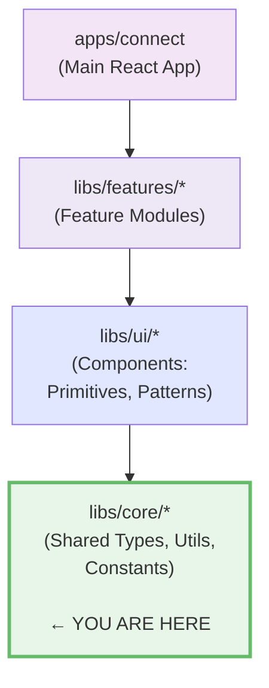

# Core Library Documentation

The **`@nasnet/core`** library is the shared foundation of the NasNetConnect frontend. It provides
type-safe constants, shared types, utility functions, and form/validation infrastructure used across
all features.

## Architecture Position



**Critical Rule:** Core cannot import from any other library. All other libraries can import from
core.

## Import Aliases

The following aliases are configured in `apps/connect/vite.config.ts`:

| Alias                     | Path                             | Purpose                                                           |
| ------------------------- | -------------------------------- | ----------------------------------------------------------------- |
| `@nasnet/core/types`      | `libs/core/types/src`            | TypeScript interfaces and type definitions                        |
| `@nasnet/core/utils`      | `libs/core/utils/src`            | Pure utility functions (validation, formatting, device detection) |
| `@nasnet/core/constants`  | `libs/core/constants/src`        | Application constants (routes, API endpoints, socket events)      |
| `@nasnet/core/forms`      | `libs/core/forms/src`            | React Hook Form integration, validation, form utilities           |
| `@nasnet/core/i18n`       | `libs/core/i18n/src`             | Internationalization, locale providers, translation hooks         |
| `@nasnet/core/validation` | `libs/core/utils/src/validation` | Zod schemas and custom validators                                 |

## Sub-Libraries

### 1. **types** (`libs/core/types/src`)

Shared TypeScript interfaces used across the application.

**Key Categories:**

- **Firewall** - FilterRule, MangleRule, NATRule, RawRule, PortKnock, RateLimit types
- **Resource** - Resource model schemas, layers, composites
- **API** - Backend API request/response types
- **Config** - Configuration-related types
- **Network** - Network interface, routing, VLAN types
- **DHCP** - DHCP-related types and fingerprints

**Usage:**

```typescript
import type { FilterRule, WifiNetwork } from '@nasnet/core/types';
```

**See:** [types.md](./sub-libraries/types.md) — Complete type reference

---

### 2. **utils** (`libs/core/utils/src`)

Pure utility functions with no React dependencies.

**Key Modules:**

- **`validation/`** - Network address validation, IP validators
- **`device/`** - Device detection, browser/OS identification
- **`firewall/`** - Firewall utilities (rule builders, CIDR calculations)
- **`network/`** - IP, MAC, VLAN utilities
- **`formatters/`** - Data formatting (bytes, duration, IP address)
- **`mac-vendor/`** - MAC address vendor lookup
- **`status/`** - Status aggregation and indicator logic
- **`graph/`** - GraphQL-related utilities
- **`hooks/`** - React hooks for common patterns (useQuery, useLocalStorage)

**Usage:**

```typescript
import { validateIPv4, formatBytes, getDeviceType } from '@nasnet/core/utils';
```

**See:** [utils.md](./sub-libraries/utils.md) — Utility function reference

---

### 3. **constants** (`libs/core/constants/src`)

Static application constants organized by domain.

**Exports:**

- **`ROUTES`** - Navigation route constants (300+ routes)
- **`API_ENDPOINTS`** - Backend API endpoint definitions
- **`SOCKET_EVENTS_EMIT`** - Client → Server WebSocket events
- **`SOCKET_EVENTS_ON`** - Server → Client WebSocket events
- **`WELL_KNOWN_PORTS`** - Database of well-known service ports (~100 entries)

**Usage:**

```typescript
import {
  ROUTES,
  API_ENDPOINTS,
  SOCKET_EVENTS_EMIT,
  WELL_KNOWN_PORTS,
  getServiceByPort,
  searchPorts,
} from '@nasnet/core/constants';

navigate(ROUTES.ROUTER_LIST);
socket.emit(SOCKET_EVENTS_EMIT.ROUTER_SUBSCRIBE, { routerId: 'r1' });
```

**See:** [constants.md](./sub-libraries/constants.md) — Constants reference

---

### 4. **forms** (`libs/core/forms/src`)

React Hook Form integration with Zod validation.

**Key Exports:**

- **`NasFormProvider`** - Context provider for form configuration
- **`useZodForm`** - Custom hook combining useForm + Zod
- **`useValidationPipeline`** - Multi-stage validation with debouncing
- **`useFormPersistence`** - Auto-save form state to localStorage
- **`useFormResourceSync`** - Sync form with resource updates
- **Network validators** - CIDR, IP, port, DNS validators
- **`mapBackendErrors`** - Convert backend errors to form field errors

**Usage:**

```typescript
import { useZodForm } from '@nasnet/core/forms';
import { z } from 'zod';

const schema = z.object({
  address: z.string().ip('v4'),
  port: z.number().min(1).max(65535),
});

const form = useZodForm(schema);
```

**See:** [forms.md](./sub-libraries/forms.md) (coming in Wave 2D)

---

### 5. **i18n** (`libs/core/i18n/src`)

Internationalization infrastructure with i18next and RTL support.

**Key Exports:**

- **`I18nProvider`** - i18next provider with language detection
- **`DirectionProvider`** - RTL/LTR direction management
- **`useTranslation`** - Hook for accessing translation function
- **`i18n.ts`** - i18next configuration and initialization
- **`locales/`** - Translation files (.json per language)

**Usage:**

```typescript
import { useTranslation } from '@nasnet/core/i18n';

function MyComponent() {
  const { t, i18n } = useTranslation();
  return <div>{t('auth.login')}</div>;
}
```

**See:** [i18n.md](./sub-libraries/i18n.md) (coming in Wave 2D)

---

## Quick Reference Table

| Sub-Library    | Import Path                     | Key Exports                              | Purpose                     |
| -------------- | ------------------------------- | ---------------------------------------- | --------------------------- |
| **types**      | `@nasnet/core/types`            | Type interfaces                          | Type-safe data models       |
| **utils**      | `@nasnet/core/utils`            | Validators, formatters, helpers          | Pure utility functions      |
| **constants**  | `@nasnet/core/constants`        | ROUTES, API_ENDPOINTS, socket events     | Static app constants        |
| **forms**      | `@nasnet/core/forms`            | Form hooks, validation, schema utilities | React Hook Form integration |
| **i18n**       | `@nasnet/core/i18n`             | Providers, hooks, translations           | Internationalization        |
| **validation** | `@nasnet/core/utils/validation` | Zod schemas, custom validators           | Form & data validation      |

---

## Key Design Decisions

### No React in Core Types/Utils/Constants

- **types/** - Pure TypeScript interfaces (zero dependencies)
- **utils/** - Pure functions with minimal external dependencies
- **constants/** - Static objects with no runtime behavior
- **Exception:** forms/ and i18n/ are React-focused libraries

This separation allows:

- Sharing types with the Go backend
- Using utilities in Node.js/CLI tools
- Fast tree-shaking and bundle optimization

### Zod for Schema Validation

All form validation uses **Zod schemas**:

- Type-safe runtime validation
- Automatic TypeScript type inference
- Composable schema builders
- Error message customization

See `@nasnet/core/utils/validation` for custom validators:

```typescript
const ipValidator = z.string().ip('v4');
const portValidator = z.number().min(1).max(65535);
```

### Universal State v2 (Data Architecture)

Resources follow an **8-layer model** defined in the types library:

1. **Primitive Layer** - Basic scalars
2. **Aggregate Layer** - Business entities
3. **Composite Layer** - Related entities
4. **Query Layer** - GraphQL queries
5. **Cache Layer** - Apollo Client cache
6. **Local Layer** - localStorage/IndexedDB
7. **Sync Layer** - Conflict resolution
8. **UI Layer** - Component state

See `Docs/architecture/data-architecture.md` for complete details.

---

## Cross-Cutting Concepts

These guides explain how core libraries work with other parts of the system:

### Architecture & Design

- Universal State v2 (see Docs/architecture/data-architecture.md) - 8-layer resource model
- Validation Pipeline (see Docs/architecture/implementation-patterns/data-validation-patterns.md) - Multi-stage form validation
- Change Set Operations (see Docs/architecture/data-architecture.md) - Atomic configuration changes
- Firewall System (see Docs/architecture/implementation-patterns/error-handling-patterns.md) - Firewall types and validation

### Network & Device

- Network Configuration (see Docs/architecture/implementation-patterns/protocol-communication-patterns.md) - IP/VLAN/routing types
- Device Detection Pipeline (see Docs/architecture/novel-pattern-designs.md) - Browser/device/OS detection

### Localization

- Internationalization Flow (see Docs/architecture/implementation-patterns/17-localization-patterns.md) - i18next integration, RTL support

### Error Handling & Integration

- **[error-handling-patterns.md](./guides/error-handling-patterns.md)** - Error type hierarchy,
  backend error mapping, i18n error messages
- **[graphql-integration-guide.md](./guides/graphql-integration-guide.md)** - Type flow, code
  generation, Apollo Client patterns

### Testing & Quality

- **[testing-patterns.md](./guides/testing-patterns.md)** - Vitest setup, testing
  hooks/schemas/validators, mock strategies

### State Management

- **[state-machines-guide.md](./guides/state-machines-guide.md)** - XState machines (config
  pipeline, change sets, VPN, wizards, resource lifecycle)

### Accessibility & Performance

- **[accessibility-patterns.md](./guides/accessibility-patterns.md)** - A11yProvider, WCAG AAA
  hooks, keyboard/motion/contrast detection
- **[performance-patterns.md](./guides/performance-patterns.md)** - Auto-scroll, form persistence
  caching, validation optimization

### Security

- **[security-patterns.md](./guides/security-patterns.md)** - Input validation boundaries, error
  message safety, security architecture

---

## Sub-Library Documentation

Detailed documentation for each sub-library:

| Document                                         | Scope    | Content                                         |
| ------------------------------------------------ | -------- | ----------------------------------------------- |
| **[intro.md](./intro.md)**                       | Overview | Architecture, package structure, adding exports |
| **[types.md](./sub-libraries/types.md)**         | Complete | All 150+ type definitions organized by domain   |
| **[constants.md](./sub-libraries/constants.md)** | Complete | Routes, API endpoints, socket events, ports     |
| **[utils.md](./sub-libraries/utils.md)**         | Complete | 50+ utility functions with examples             |
| **[forms.md](./sub-libraries/forms.md)**         | Wave 2D  | React Hook Form, validation strategies, hooks   |
| **[i18n.md](./sub-libraries/i18n.md)**           | Wave 2D  | i18next setup, translation flow, RTL support    |

---

## Package Configuration

Each sub-library is a **Nx library** with:

- **SourceRoot:** `libs/core/{name}/src`
- **Build Targets:** lint, typecheck
- **TypeScript:** Strict mode, type checking enabled
- **Testing:** Vitest with 80%+ coverage target

### Adding New Exports

To add a new module to core:

1. **Create the file** in `libs/core/{name}/src/{module}.ts`
2. **Export from index** in `libs/core/{name}/src/index.ts`
3. **Update vite.config.ts** if adding a new sub-library alias
4. **Update this README** in the Quick Reference table

---

## Testing Conventions

- **Unit tests:** Vitest (4x faster than Jest)
- **Test files:** `*.test.ts` or `*.spec.ts` alongside source
- **Coverage:** Aim for 80%+ coverage
- **Shared fixtures:** Use `vitest.config.ts` for shared setup

---

## Relationship to Backend (Go)

The TypeScript types in `libs/core/types` often mirror **Go structs** in the backend:

**Backend (Go):**

```go
type FilterRule struct {
  ID       string
  Chain    string
  Action   string
  Protocol string
}
```

**Frontend (TypeScript):**

```typescript
export interface FilterRule {
  id: string;
  chain: string;
  action: string;
  protocol: string;
}
```

GraphQL schema bridges the two systems. See `schema/` directory for GraphQL type definitions.

---

## Getting Started

### Installation

All core imports are already available in the monorepo:

```bash
npm install  # Already includes core dependencies
```

### Usage Example

```typescript
import { ROUTES, validateIPv4 } from '@nasnet/core/constants';
import { useTranslation } from '@nasnet/core/i18n';
import type { FilterRule } from '@nasnet/core/types';

function MyComponent() {
  const { t } = useTranslation();

  const handleRuleCreate = (rule: FilterRule) => {
    if (!validateIPv4(rule.srcAddr)) {
      throw new Error('Invalid IP');
    }
    navigate(ROUTES.FIREWALL);
  };

  return <div>{t('firewall.title')}</div>;
}
```

### Next Steps

- Read [intro.md](./intro.md) for architecture details
- Explore [constants.md](./sub-libraries/constants.md) for application constants
- Check [types.md](./sub-libraries/types.md) for data model references
- See Docs/architecture/index.md for system-wide architecture

---

## Quick Links

| Link                           | Purpose                          |
| ------------------------------ | -------------------------------- |
| `apps/connect/vite.config.ts`  | Import alias configuration       |
| `libs/core/types/project.json` | Nx project configuration         |
| `tsconfig.base.json`           | TypeScript paths configuration   |
| `CLAUDE.md`                    | Project guidelines and standards |
