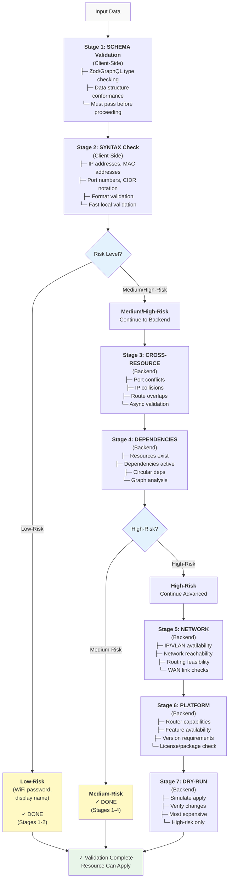

# Validation Pipeline: 7-Stage Risk-Based Validation

**Reference:** `libs/core/forms/src/` | Universal State v2 Layer 2

## Table of Contents

- [Pipeline Architecture](#pipeline-architecture)
- [The 7 Stages](#the-7-stages)
- [Risk Levels](#risk-levels)
- [Schema Validation](#schema-validation)
- [Abort and Cancellation](#abort-and-cancellation)
- [Error Propagation](#error-propagation)
- [Custom Validators](#custom-validators)
- [Form Provider Integration](#form-provider-integration)
- [Practical Examples](#practical-examples)

---

## Pipeline Architecture

The validation pipeline is a sequential 7-stage process that ensures configuration validity before applying to the router.



---

## The 7 Stages

### Stage 1: SCHEMA Validation

Type checking with Zod or GraphQL schemas. Runs on client, required for all risk levels.

```typescript
import { z } from 'zod';

// Define schema
const WireGuardServerSchema = z.object({
  enabled: z.boolean(),
  port: z.number().int().min(1).max(65535),
  privateKey: z.string().min(1),
  ipAddress: z.string().ip(),
  mtu: z.number().int().min(1280).max(65535).optional(),
});

// Validate
const result = WireGuardServerSchema.safeParse({
  enabled: true,
  port: 51820,
  privateKey: 'invalid-base64', // ✗ FAILS
  ipAddress: '10.0.0.1',
  mtu: 1500,
});

if (!result.success) {
  result.error.errors.forEach((err) => {
    console.error(`${err.path.join('.')}: ${err.message}`);
    // Output: "privateKey: String must contain at least 1 character(s)"
  });
}
```

**When it runs:**
- Always (required for all risk levels)
- First in pipeline
- Synchronously on client

**Failures block further validation:**
- If schema fails, remaining stages skipped
- User must fix structure before applying
- Fast fail prevents wasted backend calls

---

### Stage 2: SYNTAX Check

Format validation for specific types (IP, MAC, CIDR, ports). Client-side, fast.

```typescript
import { isValidIPv4, isValidMAC, isValidCIDR } from '@nasnet/core/utils';

// IP address validation
if (!isValidIPv4('192.168.1.1')) {
  console.error('Invalid IPv4 address');
}

// MAC address validation
if (!isValidMAC('02:11:22:33:44:55')) {
  console.error('Invalid MAC address');
}

// CIDR notation validation
if (!isValidCIDR('10.0.0.0/24')) {
  console.error('Invalid CIDR notation');
}

// Port range validation
function validatePort(port: number): boolean {
  return port >= 1 && port <= 65535;
}
```

**Covered by:**
- Zod refinements
- Custom validators
- Regex patterns
- Domain-specific checks

**Example with Zod:**

```typescript
const IPAddressSchema = z.string()
  .ip()  // Built-in IP validation
  .refine((ip) => {
    const parts = ip.split('.');
    return parts[0] !== '127'; // Reject loopback
  }, 'Cannot use loopback address');
```

---

### Stage 3: CROSS-RESOURCE Validation

Detect conflicts with existing resources. Backend only, for medium/high risk.

```typescript
import type { ValidationIssue, ConflictType } from '@nasnet/core/types';

// Backend checks
interface CrossResourceValidation {
  // Port conflicts
  conflicts: Array<{
    type: 'PORT' | 'IP_ADDRESS' | 'ROUTE' | 'INTERFACE' | 'NAME';
    conflictingResourceId: string;
    field: string;
    currentValue: unknown;
    conflictingValue: unknown;
    resolution: string;
  }>;
}

// Example response
const conflicts: CrossResourceValidation['conflicts'] = [
  {
    type: 'PORT',
    conflictingResourceId: 'openvpn-server',
    field: 'port',
    currentValue: 51820,
    conflictingValue: 51820,
    resolution: 'Use a different port or disable OpenVPN server',
  },
  {
    type: 'IP_ADDRESS',
    conflictingResourceId: 'lan-dhcp',
    field: 'ipAddress',
    currentValue: '10.0.0.1',
    conflictingValue: '10.0.0.1',
    resolution: 'Use IP in different range (10.0.0.2-254)',
  },
];
```

**Checked by backend:**
- Run VALIDATE_CONFIGURATION GraphQL mutation
- Pass current configuration for comparison
- Returns conflicts with suggestions
- Non-blocking if resolvable (warnings, not errors)

---

### Stage 4: DEPENDENCIES Validation

Verify required resources exist and are active.

```typescript
import { buildDependencyGraph, detectCycles } from '@nasnet/core/utils';

// Define dependencies
const changeSet = [
  {
    id: 'wg-server',
    dependencies: ['lan-bridge'],  // Requires LAN bridge
  },
  {
    id: 'lan-bridge',
    dependencies: [],
  },
];

// Check cycles
const cycleResult = detectCycles(changeSet);
if (cycleResult.hasCycle) {
  console.error('Circular dependency detected:', cycleResult.cycles);
  // Result: [["a", "b"]]  means a→b→a
}

// Validate graph
const { valid, errors, warnings } = validateDependencyGraph(changeSet);
if (!valid) {
  errors.forEach((err) => {
    console.error(err);
    // "Node 'wg-server' depends on 'lan-bridge' which is not in the change set"
  });
}
```

**Dependency status check:**

```typescript
interface DependencyStatus {
  resourceUuid: string;
  resourceType: string;
  isActive: boolean;              // Can be used right now?
  state: ResourceLifecycleState;  // DRAFT, VALID, ACTIVE, etc.
  reason: string;                 // Why it's required
}

// Example validation
const dependency: DependencyStatus = {
  resourceUuid: 'lan-bridge-001',
  resourceType: 'network.bridge',
  isActive: true,           // ✓ Can be used
  state: 'ACTIVE',
  reason: 'WireGuard needs LAN interface to tunnel through',
};

if (!dependency.isActive) {
  console.error(
    `Cannot use ${dependency.resourceType}: ${dependency.reason}`
  );
}
```

---

### Stage 5: NETWORK Validation

Check IP/VLAN availability, network reachability. High-risk only.

```typescript
interface NetworkValidation {
  ipAvailability: {
    field: string;
    requestedIP: string;
    isAvailable: boolean;
    availableRange?: string;
    conflict?: {
      resourceId: string;
      resourceType: string;
    };
  }[];

  vlanAvailability: {
    requestedVlan: number;
    isAvailable: boolean;
    usedBy?: string;
  };

  routingFeasibility: {
    routes: Array<{
      destination: string;
      gateway: string;
      feasible: boolean;
      reason?: string;
    }>;
  };

  wanLinkStatus: {
    interface: string;
    isUp: boolean;
    speedMbps?: number;
  };
}

// Example
const networkCheck: NetworkValidation = {
  ipAvailability: [
    {
      field: 'ipAddress',
      requestedIP: '10.0.0.1',
      isAvailable: false,
      availableRange: '10.0.0.2-254',
      conflict: {
        resourceId: 'dhcp-server',
        resourceType: 'dhcp.server',
      },
    },
  ],
  vlanAvailability: {
    requestedVlan: 100,
    isAvailable: true,
  },
  routingFeasibility: {
    routes: [
      {
        destination: '0.0.0.0/0',
        gateway: '192.168.1.1',
        feasible: true,
      },
    ],
  },
  wanLinkStatus: {
    interface: 'ether1',
    isUp: true,
    speedMbps: 1000,
  },
};
```

---

### Stage 6: PLATFORM Validation

Check router capabilities, version requirements, feature availability.

```typescript
import type { PlatformCapabilities, CapabilityLevel } from '@nasnet/core/types';

// Platform capability check
const capabilities: PlatformCapabilities = {
  isSupported: true,
  level: 'FULL' as CapabilityLevel,  // NONE | BASIC | ADVANCED | FULL
  minVersion: '6.48.0',
  requiredPackages: [
    'routeros-system',
    'routeros-routing',
    'routeros-container',
  ],
  details: {
    maxPeers: 1000,
    maxConnections: 10000,
  },
};

// Validation logic
function validatePlatformSupport(
  routerVersion: string,
  installedPackages: string[],
  capabilities: PlatformCapabilities
): { valid: boolean; issues: string[] } {
  const issues: string[] = [];

  // Check version
  if (!isVersionAtLeast(routerVersion, capabilities.minVersion)) {
    issues.push(
      `Router version ${routerVersion} ` +
      `is below minimum required ${capabilities.minVersion}`
    );
  }

  // Check packages
  capabilities.requiredPackages?.forEach((pkg) => {
    if (!installedPackages.includes(pkg)) {
      issues.push(`Required package not installed: ${pkg}`);
    }
  });

  return {
    valid: issues.length === 0,
    issues,
  };
}
```

**Limitations:**

```typescript
interface PlatformLimitation {
  code: string;
  description: string;
  affectedFields: string[];
  workaround?: string;
}

const limitation: PlatformLimitation = {
  code: 'MTK_WG_PEERS_LIMIT',
  description: 'MikroTik limits WireGuard to 1000 peers per server',
  affectedFields: ['configuration.peers'],
  workaround: 'Split load across multiple WireGuard servers',
};
```

---

### Stage 7: DRY-RUN Simulation

Simulate applying changes on test instance. Most expensive, high-risk only.

```typescript
interface DryRunValidation {
  success: boolean;
  simulatedChanges: Array<{
    operation: 'CREATE' | 'UPDATE' | 'DELETE';
    resourceType: string;
    resourceId: string;
    description: string;
  }>;
  expectedOutcome: {
    systemRestart?: boolean;
    downtime?: string;  // ISO 8601 duration
    affectedServices: string[];
  };
  warnings: Array<{
    severity: 'WARNING' | 'CRITICAL';
    message: string;
  }>;
  estimatedApplyTime: number;  // milliseconds
}

// Example
const dryRun: DryRunValidation = {
  success: true,
  simulatedChanges: [
    {
      operation: 'CREATE',
      resourceType: 'network.bridge',
      resourceId: 'br-lan',
      description: 'Create bridge for LAN',
    },
    {
      operation: 'CREATE',
      resourceType: 'dhcp.server',
      resourceId: 'dhcp-lan',
      description: 'Create DHCP server on bridge',
    },
  ],
  expectedOutcome: {
    systemRestart: false,
    downtime: 'PT0S',  // No downtime
    affectedServices: ['DHCP', 'ARP'],
  },
  warnings: [
    {
      severity: 'WARNING',
      message: 'DHCP scope may conflict with existing scope',
    },
  ],
  estimatedApplyTime: 2500,  // 2.5 seconds
};
```

---

## Risk Levels

Risk levels determine which stages run.

```typescript
import type { ValidationStrategy } from '@nasnet/core/forms';

type ValidationStrategy = 'low' | 'medium' | 'high';

// LOW-RISK: Client-side only (Stages 1-2)
// Examples: WiFi password, display name, comment fields
// User impact: Minimal, easily undone
// Confirmation: Not required

// MEDIUM-RISK: Client + basic backend (Stages 1-4)
// Examples: Firewall rules, DHCP settings, VPN peer config
// User impact: Moderate, affects network
// Confirmation: Not required (but review recommended)

// HIGH-RISK: Full pipeline (Stages 1-7)
// Examples: WAN changes, routing tables, VPN deletion, factory reset
// User impact: Major, potential downtime
// Confirmation: Required (preview + countdown)
```

### Strategy Configuration

```typescript
import { VALIDATION_CONFIGS } from '@nasnet/core/forms';

// Low-risk (2 stages)
const low = VALIDATION_CONFIGS.low;
// {
//   stages: ['schema', 'syntax'],
//   clientOnly: true,
//   requiresConfirmation: false,
// }

// Medium-risk (4 stages)
const medium = VALIDATION_CONFIGS.medium;
// {
//   stages: ['schema', 'syntax', 'cross-resource', 'dependencies'],
//   clientOnly: false,
//   requiresConfirmation: false,
// }

// High-risk (7 stages)
const high = VALIDATION_CONFIGS.high;
// {
//   stages: [
//     'schema', 'syntax', 'cross-resource', 'dependencies',
//     'network', 'platform', 'dry-run'
//   ],
//   clientOnly: false,
//   requiresConfirmation: true,
//   confirmationSteps: ['preview', 'countdown'],
// }
```

---

## Schema Validation

Local Zod validation vs backend validation stages.

```typescript
import { z } from 'zod';

// Zod schema (Stage 1)
const FirewallRuleSchema = z.object({
  chain: z.enum(['input', 'forward', 'output']),
  protocol: z.enum(['tcp', 'udp', 'icmp', 'all']),
  srcAddress: z.string().ip().optional(),
  dstAddress: z.string().ip().optional(),
  srcPort: z.number().int().min(1).max(65535).optional(),
  dstPort: z.number().int().min(1).max(65535).optional(),
  action: z.enum(['accept', 'drop', 'reject', 'mark']),
  comment: z.string().optional(),
});

// Zod refinement (Stage 2 - Syntax)
const RefinedSchema = FirewallRuleSchema
  .refine(
    (rule) => {
      // If both ports specified, they must be in order
      if (rule.srcPort && rule.dstPort) {
        return rule.srcPort <= rule.dstPort;
      }
      return true;
    },
    {
      message: 'Source port must be <= destination port',
      path: ['dstPort'],
    }
  )
  .refine(
    (rule) => {
      // Mark action requires comment
      if (rule.action === 'mark' && !rule.comment) {
        return false;
      }
      return true;
    },
    {
      message: 'Mark action requires a comment for the mark name',
      path: ['comment'],
    }
  );

// Validate
const result = RefinedSchema.safeParse({
  chain: 'input',
  protocol: 'tcp',
  dstPort: 443,
  action: 'accept',
});

if (!result.success) {
  console.error(result.error.flatten());
}
```

---

## Abort and Cancellation

Cancel long-running validations.

```typescript
import { useValidationPipeline } from '@nasnet/core/forms';

function FormComponent() {
  const pipeline = useValidationPipeline({
    schema: MySchema,
    strategy: 'high',
    resourceUuid: 'resource-001',
  });

  async function handleValidate() {
    // Start validation
    const result = await pipeline.validate(formData);

    if (!result.isValid) {
      console.error('Validation failed:', result.errors);
    }
  }

  function handleCancel() {
    // Abort in-flight validations
    pipeline.reset();
  }

  return (
    <>
      <button onClick={handleValidate} disabled={pipeline.isValidating}>
        {pipeline.isValidating ? 'Validating...' : 'Validate'}
      </button>

      {pipeline.isValidating && (
        <>
          <progress
            value={pipeline.currentStage}
            max={pipeline.stages.length}
          />
          <button onClick={handleCancel}>Cancel</button>
        </>
      )}

      {/* Display stage progress */}
      <ul>
        {pipeline.stages.map((stage) => (
          <li key={stage.stage}>
            {stage.stage}: {stage.status}
            {stage.durationMs && ` (${stage.durationMs}ms)`}
          </li>
        ))}
      </ul>
    </>
  );
}
```

**AbortController:**

```typescript
import { useRef } from 'react';

function useValidationWithCancel() {
  const abortRef = useRef<AbortController | null>(null);

  async function validate(data: unknown) {
    // Create new abort controller
    abortRef.current = new AbortController();

    try {
      const response = await fetch('/api/validate', {
        method: 'POST',
        body: JSON.stringify(data),
        signal: abortRef.current.signal,  // Pass signal
      });

      return await response.json();
    } catch (error) {
      if (error instanceof DOMException && error.name === 'AbortError') {
        console.log('Validation cancelled');
      }
      throw error;
    }
  }

  function cancel() {
    abortRef.current?.abort();
  }

  return { validate, cancel };
}
```

---

## Error Propagation

Map validation pipeline errors to form field errors.

```typescript
import type { ValidationError } from '@nasnet/core/types';
import { FieldValues, UseFormReturn } from 'react-hook-form';

function mapValidationErrorsToForm<T extends FieldValues>(
  errors: ValidationError[],
  form: UseFormReturn<T>
) {
  // Group errors by field
  const fieldErrors = new Map<string, string[]>();

  errors.forEach((error) => {
    if (error.fieldPath) {
      const messages = fieldErrors.get(error.fieldPath) || [];
      messages.push(error.message);
      fieldErrors.set(error.fieldPath, messages);
    }
  });

  // Set form errors
  fieldErrors.forEach((messages, fieldPath) => {
    const path = fieldPath.split('.') as any;
    form.setError(path, {
      type: 'custom',
      message: messages[0],  // Show first error
    });
  });
}

// Usage
const pipeline = useValidationPipeline({
  schema: MySchema,
  strategy: 'medium',
});

const form = useForm<MyFormData>();

async function handleValidate(data: MyFormData) {
  const result = await pipeline.validate(data);

  if (!result.isValid) {
    mapValidationErrorsToForm(result.errors, form);
  }
}
```

---

## Custom Validators

Build and register custom validation stages.

```typescript
import type { ValidationStage, ValidationPipelineResult } from '@nasnet/core/forms';

interface CustomValidator {
  stage: ValidationStage;
  validate: (data: unknown) => Promise<ValidationError[]>;
  description: string;
}

// Example: Custom network connectivity validator
const networkConnectivityValidator: CustomValidator = {
  stage: 'network',
  description: 'Check if gateway IP is reachable',
  validate: async (data: { gateway: string }) => {
    try {
      const response = await fetch(`/api/ping/${data.gateway}`);
      const result = await response.json();

      if (!result.reachable) {
        return [
          {
            code: 'GATEWAY_UNREACHABLE',
            message: `Gateway ${data.gateway} is not reachable`,
            severity: 'ERROR',
          },
        ];
      }

      return [];
    } catch (error) {
      return [
        {
          code: 'CONNECTIVITY_CHECK_FAILED',
          message: `Failed to check connectivity: ${(error as Error).message}`,
          severity: 'WARNING',
        },
      ];
    }
  },
};

// Register in form context
function FormWithCustomValidation() {
  const form = useForm<MyFormData>();

  const pipeline = useValidationPipeline({
    schema: MySchema,
    strategy: 'medium',
    resourceUuid: 'resource-001',
    customValidators: [networkConnectivityValidator],
  });

  return <></>;
}
```

---

## Form Provider Integration

Integration with NasFormProvider context.

```typescript
import {
  NasFormProvider,
  useFormContext,
  useValidationPipeline,
} from '@nasnet/core/forms';

// Provider setup (typically in app root)
function App() {
  return (
    <NasFormProvider>
      <YourRoutes />
    </NasFormProvider>
  );
}

// Use in component
function MyFormComponent() {
  const form = useForm<MyFormData>();
  const { register, handleSubmit, formState } = form;

  // Access validation pipeline from context
  const { validationStrategy, validationConfig } = useFormContext();

  const pipeline = useValidationPipeline({
    schema: MySchema,
    strategy: validationStrategy,
    resourceUuid: 'resource-001',
  });

  async function onSubmit(data: MyFormData) {
    // Validate through pipeline
    const result = await pipeline.validate(data);

    if (!result.isValid) {
      // Show errors
      result.errors.forEach((err) => {
        console.error(`${err.code}: ${err.message}`);
      });
      return;
    }

    // Apply changes
    await applyChanges(data);
  }

  return (
    <form onSubmit={handleSubmit(onSubmit)}>
      <input {...register('port')} />
      {formState.errors.port && (
        <span>{formState.errors.port.message}</span>
      )}

      {pipeline.isValidating && <progress />}

      <button type="submit">Save</button>
    </form>
  );
}
```

---

## Practical Examples

### Example 1: Low-Risk Field Validation

```typescript
function WiFiPasswordForm() {
  const form = useForm({
    resolver: zodResolver(
      z.object({
        ssid: z.string().min(1),
        password: z.string().min(8),  // Stage 1: Schema
      })
    ),
  });

  // Low-risk: only client-side validation
  const pipeline = useValidationPipeline({
    schema: form.formState.schema,
    strategy: 'low',  // Only stages 1-2
  });

  async function onSubmit(data: any) {
    const result = await pipeline.validate(data);
    if (result.isValid) {
      // Apply immediately, no backend call
      await updateWiFi(data);
    }
  }

  return (
    <form onSubmit={form.handleSubmit(onSubmit)}>
      {/* form fields */}
    </form>
  );
}
```

### Example 2: Medium-Risk with Conflict Detection

```typescript
function FirewallRuleForm() {
  const form = useForm({
    resolver: zodResolver(FirewallRuleSchema),
  });

  const pipeline = useValidationPipeline({
    schema: FirewallRuleSchema,
    strategy: 'medium',  // Stages 1-4
    resourceUuid: 'rule-001',
  });

  async function onSubmit(data: any) {
    const result = await pipeline.validate(data);

    if (!result.isValid) {
      // Show validation errors
      result.errors.forEach((err) => {
        console.error(`${err.code}: ${err.message}`);
        if (err.fieldPath) {
          form.setError(err.fieldPath as any, { message: err.message });
        }
      });
      return;
    }

    // Check for conflicts
    const conflicts = result.conflicts || [];
    if (conflicts.length > 0) {
      // Show conflict resolution dialog
      conflicts.forEach((conflict) => {
        console.warn(`${conflict.type} conflict: ${conflict.description}`);
        showConflictDialog(conflict);
      });
      return;
    }

    // Safe to apply
    await updateFirewallRule(data);
  }

  return (
    <form onSubmit={form.handleSubmit(onSubmit)}>
      <div>
        {pipeline.stages.map((stage) => (
          <StageProgress key={stage.stage} stage={stage} />
        ))}
      </div>
      {/* form fields */}
    </form>
  );
}
```

### Example 3: High-Risk with Dry-Run

```typescript
function WANConfigForm() {
  const form = useForm({
    resolver: zodResolver(WANConfigSchema),
  });

  const [dryRunResult, setDryRunResult] = useState(null);

  const pipeline = useValidationPipeline({
    schema: WANConfigSchema,
    strategy: 'high',  // All stages including dry-run
    resourceUuid: 'wan-001',
  });

  async function onSubmit(data: any) {
    const result = await pipeline.validate(data);

    if (!result.isValid) {
      showErrors(result.errors);
      return;
    }

    // For high-risk, show dry-run results
    if (result.dryRun) {
      setDryRunResult(result.dryRun);
      showPreviewDialog(result.dryRun);

      // Require countdown confirmation
      const confirmed = await showCountdownConfirmation(10);
      if (!confirmed) {
        return;
      }
    }

    // Apply with final confirmation
    const applied = await applyWANConfig(data);
    if (applied) {
      showSuccessMessage('WAN configuration updated');
    }
  }

  return (
    <form onSubmit={form.handleSubmit(onSubmit)}>
      <div className="validation-stages">
        {pipeline.stages.map((stage) => (
          <StageIndicator
            key={stage.stage}
            stage={stage}
            duration={stage.durationMs}
          />
        ))}
      </div>

      {dryRunResult && (
        <PreviewPanel result={dryRunResult}>
          <ul>
            {dryRunResult.simulatedChanges.map((change) => (
              <li key={change.resourceId}>
                {change.operation} {change.resourceType}
              </li>
            ))}
          </ul>
          {dryRunResult.estimatedApplyTime && (
            <p>
              Estimated apply time:{' '}
              {(dryRunResult.estimatedApplyTime / 1000).toFixed(1)}s
            </p>
          )}
        </PreviewPanel>
      )}

      <button type="submit" disabled={pipeline.isValidating}>
        {pipeline.isValidating ? 'Validating...' : 'Apply'}
      </button>
    </form>
  );
}
```

---

## See Also

- **universal-state-v2.md** - 8-layer model (validation is Layer 2)
- **change-set-operations.md** - Atomic operations with validation
- **forms.md** - React Hook Form patterns

