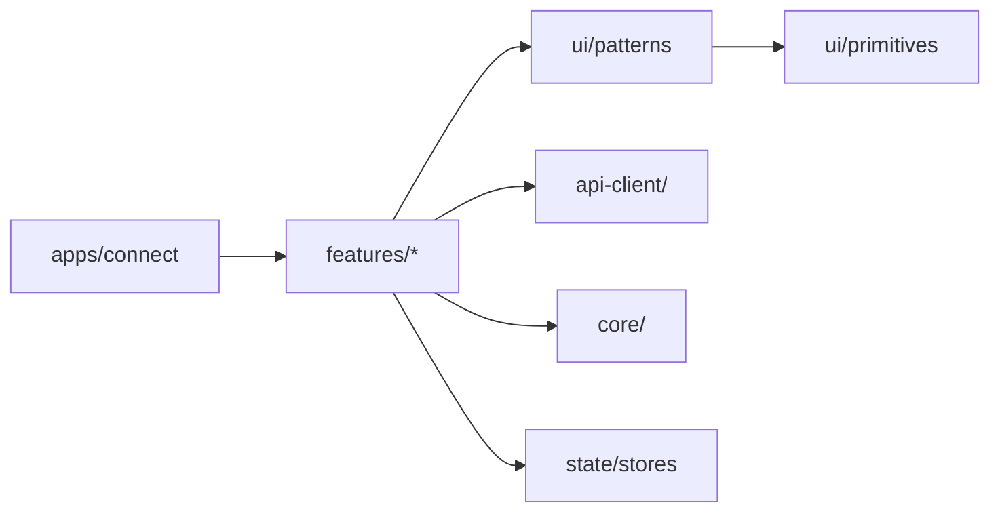
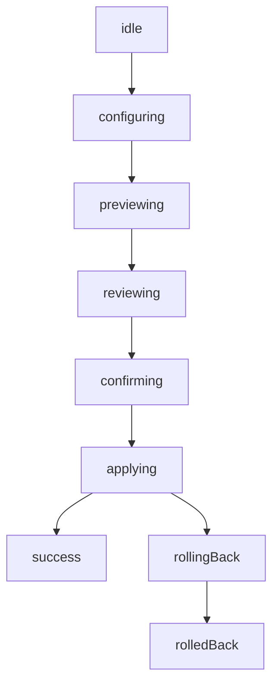

# Architecture Overview

This document describes the structural conventions, dependency rules, Platform Presenter pattern,
naming conventions, and file organization that govern every module in `libs/features/`.

---

## 1. What Is a Feature Module?

A **Feature Module** is Layer 3 in NasNetConnect's three-tier component architecture:

```
Layer 1: libs/ui/primitives    — Atomic building blocks (Button, Card, Input, Badge, Dialog…)
Layer 2: libs/ui/patterns      — Composite reusables (DataTable, ResourceCard, WizardStep…)
Layer 3: libs/features/*/      — Domain business logic (THIS LAYER)
```

Feature modules encode product behavior. They answer questions like:

- How do firewall rules get filtered and paginated?
- What XState machine governs template application with rollback?
- How does the alert notification form differ between mobile and desktop?

Feature modules are **not reusable design components**. They are domain boundaries that happen to
export React components. A component inside `libs/features/firewall/` knows about firewall rule
types, chain names, GraphQL mutations, and Zod schemas. It composes Layer 2 patterns and Layer 1
primitives to render that knowledge.

### The Dependency Direction



This is a strict one-way dependency. Features may never import from other features.

---

## 2. Standard Module Anatomy

Every feature module follows the same directory layout. Optional directories are marked with
`(optional)`.

```
libs/features/<name>/
└── src/
    ├── index.ts              # Public API — only file consumers import from
    ├── components/           # Domain components (Layer 3)
    │   ├── index.ts          # Barrel export for all components
    │   ├── MyComponent.tsx   # Headless wrapper with platform dispatch
    │   ├── MyComponentDesktop.tsx   # Desktop presenter
    │   ├── MyComponentMobile.tsx    # Mobile presenter
    │   └── SubFeature/       # Subfolder when component has sub-parts (max 10 files/folder)
    ├── pages/                # Full-page components (routed by apps/connect)
    │   └── FeaturePage.tsx
    ├── hooks/                # Feature-specific React hooks
    │   ├── index.ts
    │   └── useFeatureData.ts
    ├── schemas/              # Zod validation schemas and TypeScript types
    │   └── feature.schema.ts
    ├── machines/ (optional)  # XState machines for complex flows
    │   └── feature.machine.ts
    ├── services/ (optional)  # Non-React business logic, storage helpers
    │   └── featureService.ts
    ├── utils/ (optional)     # Pure utility functions
    │   └── featureUtils.ts
    ├── types/ (optional)     # Shared TypeScript interfaces for this domain
    │   └── feature.types.ts
    ├── graphql/ (optional)   # Inline GraphQL operation definitions
    │   └── feature.graphql.ts
    ├── i18n/ (optional)      # Message constants (no i18n framework, just typed strings)
    │   └── messages.ts
    ├── data/ (optional)      # Static option data (channel lists, country codes, etc.)
    │   └── options.ts
    └── constants/ (optional) # Feature-specific constants
        └── registry.ts
```

### Real Directory Tree: firewall

```
libs/features/firewall/src/
├── index.ts
├── components/
│   ├── index.ts
│   ├── FilterRulesTable.tsx            # headless wrapper
│   ├── FilterRulesTableDesktop.tsx     # desktop presenter
│   ├── FilterRulesTableMobile.tsx      # mobile presenter
│   ├── MangleRulesTable.tsx
│   ├── MangleRulesTableDesktop.tsx
│   ├── MangleRulesTableMobile.tsx
│   ├── RawRulesTable.tsx
│   ├── RawRulesTableDesktop.tsx
│   ├── RawRulesTableMobile.tsx
│   ├── NATRulesTable.tsx
│   ├── NATRulesTableMobile.tsx
│   ├── PortKnockSequenceManager.tsx
│   ├── PortKnockSequenceManagerDesktop.tsx
│   ├── PortKnockSequenceManagerMobile.tsx
│   ├── ServicePortsTable.tsx
│   ├── ServicePortsTableDesktop.tsx
│   ├── ServicePortsTableMobile.tsx
│   ├── FirewallStatusHero.tsx
│   ├── FirewallQuickStats.tsx
│   ├── ChainSummaryCards.tsx
│   ├── TrafficFlowDiagram.tsx
│   ├── RecentFirewallActivity.tsx
│   ├── FirewallDetailTabs.tsx
│   ├── ConnectionsPage.tsx
│   ├── PortForwardWizardDialog.tsx
│   ├── MasqueradeQuickDialog.tsx
│   ├── PortKnockingPage.tsx
│   ├── PortKnockLogViewer.tsx
│   ├── AddressListEntryForm.tsx
│   ├── AddressListImportDialog.tsx
│   ├── AddressListExportDialog.tsx
│   ├── IPAddressDisplay.tsx
│   ├── AddToAddressListContextMenu.tsx
│   ├── RuleSearchFilters.tsx
│   ├── ReadOnlyNotice.tsx
│   ├── ServicesStatus.tsx
│   ├── RoutingTable.tsx
│   ├── SaveTemplateDialog.tsx
│   ├── ImportTemplateDialog.tsx
│   ├── TemplateApplyFlow.tsx
│   └── UndoFloatingButton.tsx
├── pages/
│   ├── AddressListView.tsx
│   ├── FirewallLogsPage.tsx
│   ├── ManglePage.tsx
│   ├── NATRulesPage.tsx
│   ├── RateLimitingPage.tsx
│   ├── RawPage.tsx
│   ├── ServicePortsPage.tsx
│   └── TemplatesPage.tsx
├── hooks/
│   ├── index.ts
│   ├── useChainSummary.ts
│   ├── useRuleFilters.ts
│   ├── useCounterSettingsStore.ts
│   ├── useCustomServices.ts
│   ├── useCustomTemplates.ts
│   └── use-rule-navigation.ts
├── schemas/
│   └── templateSchemas.ts
├── machines/
│   └── template-apply.machine.ts
└── services/
    ├── index.ts
    ├── counterHistoryStorage.ts
    └── rate-limit-alert.stub.ts
```

### Real Directory Tree: services

```
libs/features/services/src/
├── index.ts
├── components/
│   ├── InstallDialog.tsx
│   ├── GatewayStatusCard.tsx
│   ├── GatewayStatusCardDesktop.tsx
│   ├── GatewayStatusCardMobile.tsx
│   ├── PortRegistryView.tsx
│   ├── PortRegistryViewDesktop.tsx
│   ├── PortRegistryViewMobile.tsx
│   ├── VLANPoolConfig.tsx
│   ├── StopDependentsDialog.tsx
│   ├── UpdateAllPanel.tsx
│   ├── ChangelogModal.tsx
│   ├── ResourceLimitsForm.tsx
│   ├── ServiceAlertsTab.tsx
│   ├── ServiceAlertsTabDesktop.tsx
│   ├── ServiceAlertsTabMobile.tsx
│   ├── ServiceConfigForm/
│   │   ├── ServiceConfigForm.tsx
│   │   ├── ServiceConfigFormDesktop.tsx
│   │   ├── ServiceConfigFormMobile.tsx
│   │   ├── DynamicField.tsx
│   │   └── fields/
│   │       ├── TextField.tsx
│   │       ├── TextArea.tsx
│   │       ├── NumberField.tsx
│   │       ├── PasswordField.tsx
│   │       ├── Select.tsx
│   │       ├── MultiSelect.tsx
│   │       └── ArrayField.tsx
│   ├── ServiceLogViewer/
│   │   ├── ServiceLogViewer.tsx
│   │   ├── ServiceLogViewerDesktop.tsx
│   │   └── ServiceLogViewerMobile.tsx
│   ├── DiagnosticsPanel/
│   │   ├── DiagnosticsPanel.tsx
│   │   ├── DiagnosticsPanelDesktop.tsx
│   │   └── DiagnosticsPanelMobile.tsx
│   ├── service-traffic/
│   │   ├── ServiceTrafficPanel.tsx
│   │   ├── ServiceTrafficPanelDesktop.tsx
│   │   ├── ServiceTrafficPanelMobile.tsx
│   │   └── QuotaSettingsForm.tsx
│   ├── storage/
│   │   ├── StorageSettings.tsx
│   │   ├── StorageSettingsDesktop.tsx
│   │   ├── StorageSettingsMobile.tsx
│   │   ├── StorageUsageBar.tsx
│   │   └── StorageDisconnectBanner.tsx
│   └── templates/
│       ├── TemplatesBrowser.tsx
│       ├── TemplatesBrowserDesktop.tsx
│       ├── TemplatesBrowserMobile.tsx
│       ├── TemplateFilters.tsx
│       ├── TemplateInstallWizard.tsx
│       ├── TemplateInstallWizardDesktop.tsx
│       ├── TemplateInstallWizardMobile.tsx
│       └── wizard-steps/
│           ├── VariablesStep.tsx
│           ├── ReviewStep.tsx
│           ├── InstallingStep.tsx
│           └── RoutingStep.tsx
├── pages/
│   ├── ServicesPage.tsx
│   ├── ServiceDetailPage.tsx
│   ├── VLANSettingsPage.tsx
│   └── DeviceRoutingPage.tsx
├── hooks/
│   ├── useServiceConfigForm.ts
│   ├── useServiceAlertsTab.ts
│   └── useServiceAlertToasts.ts
├── machines/
│   └── update-machine.ts
├── schemas/
│   └── (service config schemas)
└── utils/
    └── (dynamic schema builders)
```

---

## 3. All 11 Feature Modules

| Module                  | Import Alias                            | Key Exports                                                                                                                                                                                                                                                                                               |
| ----------------------- | --------------------------------------- | --------------------------------------------------------------------------------------------------------------------------------------------------------------------------------------------------------------------------------------------------------------------------------------------------------- |
| `alerts`                | `@nasnet/features/alerts`               | Alert rules CRUD hooks, notification channel forms (email, webhook, ntfy), quiet hours, template browser, `NotificationSettingsPage`, Zod schemas                                                                                                                                                         |
| `configuration-import`  | `@nasnet/features/configuration-import` | `ConfigurationImportWizard`, `useConfigurationCheck`                                                                                                                                                                                                                                                      |
| `dashboard`             | `@nasnet/features/dashboard`            | `DashboardPage`, `ResourceGauges`, `BandwidthChart`, `RecentLogs`, `InterfaceGrid`, `RouterHealthSummaryCard`, `ConnectedDevices`, `LogViewer`                                                                                                                                                            |
| `diagnostics`           | `@nasnet/features/diagnostics`          | `PingTool`, `TracerouteTool`, `DnsLookupTool`, `TroubleshootWizard`, `DeviceScanTool`, XState ping machine, ISP detection utils                                                                                                                                                                           |
| `firewall`              | `@nasnet/features/firewall`             | Filter/NAT/mangle/raw/rate-limit rule tables, address lists, port knocking, service ports, template apply machine with undo, firewall logs and pages                                                                                                                                                      |
| `logs`                  | `@nasnet/features/logs`                 | Log action menu, log bookmarks, log correlation, log settings/alert dialogs, cache utilities                                                                                                                                                                                                              |
| `network`               | `@nasnet/features/network`              | `InterfaceList`, `InterfaceDetail`, bridges, IP addresses, static routes, DHCP lease management, VLANs, DNS configuration, WAN management, interface statistics                                                                                                                                           |
| `router-discovery`      | `@nasnet/features/router-discovery`     | `NetworkScanner`, `ManualRouterEntry`, `CredentialDialog`, `RouterCard`, `RouterList`, scan service, credential service                                                                                                                                                                                   |
| `services`              | `@nasnet/features/services`             | `ServicesPage`, `ServiceDetailPage`, `ServiceConfigForm`, `ServiceTrafficPanel`, `TemplatesBrowser`, `TemplateInstallWizard`, `ServiceLogViewer`, `DiagnosticsPanel`, storage sub-module, update machine                                                                                                  |
| `wireless`              | `@nasnet/features/wireless`             | `WirelessInterfaceCard`, `WirelessInterfaceList`, `WirelessInterfaceDetail`, `WirelessSettingsForm`, `WirelessSettingsModal`, channel/security option data, validation schemas                                                                                                                            |
| `network` (sub-modules) | —                                       | The `network` module is further organized into: `bridges`, `dhcp`, `dns`, `vlans`, `wan`, `interface-stats`, `components/interface-list`, `components/interface-detail`, `components/interface-edit`, `components/routes`, `components/ip-address`, `components/DnsBenchmark`, `components/DnsCachePanel` |

---

## 4. Public API Contract: The `src/index.ts` Barrel

Each module exposes exactly one public surface: `src/index.ts`. Consumers must never import from
internal paths.

```typescript
// Correct
import { FilterRulesTable, useRuleFilters } from '@nasnet/features/firewall';

// Wrong — never import from internal paths
import { FilterRulesTable } from '@nasnet/features/firewall/src/components/FilterRulesTable';
```

### What Belongs in `src/index.ts`

The barrel exports everything consumers legitimately need:

- **Components** — headless wrappers and any presenter components that callers configure explicitly
- **Pages** — top-level page components routed by `apps/connect`
- **Hooks** — headless hooks that callers may use standalone (e.g., `useRuleFilters` for embedding
  filter logic)
- **Schemas** — Zod schemas and their inferred TypeScript types (for form validation in consumer
  pages)
- **Machines** — XState machine factories (when callers need to compose machines)
- **Types** — domain TypeScript interfaces needed by consumers
- **Constants and utilities** — when callers need them for display logic

What does NOT belong in `src/index.ts`:

- Internal sub-components that are only composed inside this module
- Implementation details of machines or services
- Test utilities (these go in `src/__test-utils__/`)

### Real Example: `libs/features/firewall/src/index.ts`

```typescript
/**
 * @nasnet/features/firewall
 * Firewall viewing feature library
 * Epic 0.6: Firewall & Routing Viewer
 */

// Components
export * from './components';

// Pages
export * from './pages';

// Hooks
export * from './hooks';

// Services
export * from './services';

// Schemas
export * from './schemas/templateSchemas';

// Machines
export * from './machines/template-apply.machine';
```

### Real Example: `libs/features/alerts/src/index.ts` (granular named exports)

Some modules prefer granular named exports instead of re-exporting barrel files. This improves
tree-shaking and makes the public API explicit:

```typescript
// Hooks — named individually so callers know exactly what's available
export {
  useAlertRules,
  useAlertRule,
  useCreateAlertRule,
  useUpdateAlertRule,
  useDeleteAlertRule,
} from './hooks/useAlertRules';
export { useAlerts, useAcknowledgeAlert, useUnacknowledgedAlertCount } from './hooks/useAlerts';
export {
  useAlertRuleTemplates,
  useApplyAlertRuleTemplate,
  useSaveCustomAlertRuleTemplate,
} from './hooks/useAlertRuleTemplates';

// Components — including platform-specific presenters that callers may use directly
export { AlertRuleForm } from './components/AlertRuleForm';
export { AlertBadge } from './components/AlertBadge';
export { EmailChannelFormDesktop } from './components/EmailChannelFormDesktop';
export { EmailChannelFormMobile } from './components/EmailChannelFormMobile';

// Pages
export { NotificationSettingsPage } from './pages/NotificationSettingsPage';

// Schemas + types together
export {
  alertRuleFormSchema,
  defaultAlertRule,
  SEVERITY_CONFIG,
} from './schemas/alert-rule.schema';
export type { AlertRuleFormData, QuietHoursConfigData } from './schemas/alert-rule.schema';
```

---

## 5. Platform Presenter Pattern

NasNetConnect runs on three device classes with fundamentally different interaction models:

| Platform | Breakpoint | Paradigm                               | Key Differences                                                     |
| -------- | ---------- | -------------------------------------- | ------------------------------------------------------------------- |
| Mobile   | `<640px`   | Touch-first, consumer-grade simplicity | Card lists, bottom action bars, 44px touch targets, no dense tables |
| Tablet   | 640-1024px | Hybrid                                 | Collapsible panels, medium density                                  |
| Desktop  | `>1024px`  | Keyboard-first, power-user density     | Dense data tables, multi-column layouts, hover actions              |

The pattern solves this with three collaborating files per component:

1. **Headless wrapper** — owns all logic, delegates rendering to a platform presenter
2. **Desktop presenter** — dense table/form layout for large screens
3. **Mobile presenter** — card/list layout for small touch screens

### Real Example: `InterfaceList` (complete three-file implementation)

**`InterfaceList.tsx` — headless wrapper**

```tsx
import { useState, useMemo, useCallback } from 'react';
import { usePlatform } from '@nasnet/ui/layouts';
import { useInterfaceList } from '@nasnet/api-client/queries';
import type { InterfaceType, InterfaceStatus } from '@nasnet/api-client/generated';
import { InterfaceListDesktop } from './InterfaceListDesktop';
import { InterfaceListMobile } from './InterfaceListMobile';
import { InterfaceDetail } from '../interface-detail';

export interface InterfaceFilters {
  type: InterfaceType | null;
  status: InterfaceStatus | null;
  search: string;
}

export function InterfaceList({ routerId, className }: InterfaceListProps) {
  const platform = usePlatform();

  // All business logic lives here — shared by both presenters
  const { interfaces, loading, error, refetch } = useInterfaceList(routerId);
  const [selectedIds, setSelectedIds] = useState<Set<string>>(new Set());
  const [filters, setFilters] = useState<InterfaceFilters>({
    type: null,
    status: null,
    search: '',
  });
  const [selectedInterfaceId, setSelectedInterfaceId] = useState<string | null>(null);

  const filteredInterfaces = useMemo(() => {
    return interfaces
      .filter((iface: any) => !filters.type || iface.type === filters.type)
      .filter((iface: any) => !filters.status || iface.status === filters.status)
      .filter(
        (iface: any) =>
          !filters.search || iface.name.toLowerCase().includes(filters.search.toLowerCase())
      );
  }, [interfaces, filters]);

  const handleSelectChange = useCallback((ids: Set<string>) => setSelectedIds(ids), []);
  const handleFilterChange = useCallback(
    (newFilters: InterfaceFilters) => setFilters(newFilters),
    []
  );
  const handleOpenDetail = useCallback((id: string | null) => setSelectedInterfaceId(id), []);

  // sharedProps contains everything both presenters need — no logic duplication
  const sharedProps = {
    interfaces: filteredInterfaces,
    allInterfaces: interfaces,
    loading,
    error,
    selectedIds,
    onSelect: handleSelectChange,
    filters,
    onFilterChange: handleFilterChange,
    onRefresh: refetch,
    routerId,
    onOpenDetail: handleOpenDetail,
    className,
  };

  return (
    <div className="category-networking">
      {platform === 'mobile' ?
        <InterfaceListMobile {...sharedProps} />
      : <InterfaceListDesktop {...sharedProps} />}
      <InterfaceDetail
        routerId={routerId}
        interfaceId={selectedInterfaceId}
        open={selectedInterfaceId !== null}
        onClose={() => handleOpenDetail(null)}
      />
    </div>
  );
}
```

**`InterfaceListDesktop.tsx` — data table for power users**

```tsx
import { memo } from 'react';
import { DataTable } from '@nasnet/ui/patterns';
import { Badge, Button } from '@nasnet/ui/primitives';
import { InterfaceListFilters } from './InterfaceListFilters';
import { BatchActionsToolbar } from './BatchActionsToolbar';

export const InterfaceListDesktop = memo(function InterfaceListDesktop({
  interfaces,
  allInterfaces,
  loading,
  error,
  selectedIds,
  onSelect,
  filters,
  onFilterChange,
  onRefresh,
  routerId,
  onOpenDetail,
}: InterfaceListDesktopProps) {
  const selectedInterfaces = allInterfaces.filter((iface) => selectedIds.has(iface.id));

  const columns = [
    {
      key: 'name',
      header: 'Name',
      cell: (row: any) => (
        <span className="category-networking font-mono font-medium">{row.name}</span>
      ),
    },
    {
      key: 'type',
      header: 'Type',
      cell: (row: any) => <Badge variant="outline">{row.type}</Badge>,
    },
    {
      key: 'status',
      header: 'Status',
      cell: (row: any) => {
        const variant =
          row.status === 'UP' ? 'success'
          : row.status === 'DOWN' ? 'error'
          : 'secondary';
        return <Badge variant={variant}>{row.status}</Badge>;
      },
    },
    // … ip, mtu, comment columns
  ];

  return (
    <div className="space-y-component-md category-networking">
      <div className="flex items-center justify-between">
        <InterfaceListFilters
          filters={filters}
          onChange={onFilterChange}
        />
        {selectedIds.size > 0 && (
          <BatchActionsToolbar
            routerId={routerId}
            selectedIds={selectedIds}
            selectedInterfaces={selectedInterfaces}
            onClearSelection={() => onSelect(new Set())}
          />
        )}
      </div>
      <DataTable
        columns={columns}
        data={interfaces}
        isLoading={loading}
        onRowClick={(row: any) => onOpenDetail(row.id)}
        emptyMessage="No interfaces found"
      />
    </div>
  );
});
```

**`InterfaceListMobile.tsx` — touch-optimized card list**

```tsx
import { memo } from 'react';
import { Button, Badge, Card, CardHeader, CardTitle, CardContent, Checkbox } from '@nasnet/ui/primitives';

export const InterfaceListMobile = memo(function InterfaceListMobile({
  interfaces, allInterfaces, loading, error, selectedIds, onSelect,
  filters, onFilterChange, onRefresh, routerId, onOpenDetail,
}: InterfaceListMobileProps) {
  const toggleSelection = (interfaceId: string) => {
    const newSelection = new Set(selectedIds);
    newSelection.has(interfaceId) ? newSelection.delete(interfaceId) : newSelection.add(interfaceId);
    onSelect(newSelection);
  };

  return (
    <div className="space-y-component-md p-component-md category-networking">
      <InterfaceListFilters filters={filters} onChange={onFilterChange} />

      <div className="space-y-component-sm">
        {interfaces.map((iface) => (
          <Card
            key={iface.id}
            className={`cursor-pointer ${selectedIds.has(iface.id) ? 'border-primary bg-primary/5' : ''}`}
            onClick={() => onOpenDetail(iface.id)}
            role="button"
            tabIndex={0}
            aria-label={`View details for ${iface.name} interface`}
          >
            <CardHeader className="flex-row items-start justify-between space-y-0 pb-2">
              <div className="flex items-start gap-3 flex-1">
                <Checkbox
                  checked={selectedIds.has(iface.id)}
                  onCheckedChange={() => toggleSelection(iface.id)}
                  onClick={(e) => e.stopPropagation()}
                  aria-label={`Select ${iface.name}`}
                />
                <div className="flex-1 min-w-0">
                  <CardTitle className="text-base font-mono">{iface.name}</CardTitle>
                  {/* status badge, type badge */}
                </div>
              </div>
            </CardHeader>
            <CardContent className="space-y-component-sm text-sm">
              {/* ip, mtu, comment rows */}
            </CardContent>
          </Card>
        ))}
      </div>

      {/* Bottom action bar — fixed above the bottom navigation */}
      {selectedIds.size > 0 && (
        <div className="fixed bottom-4 left-4 right-4 z-10">
          <Card className="shadow-lg">
            <CardContent className="p-component-md">
              <BatchActionsToolbar … />
            </CardContent>
          </Card>
        </div>
      )}
    </div>
  );
});
```

### The Three Invariants

Every Platform Presenter implementation must satisfy:

1. **All logic in the headless wrapper.** Presenters receive only data and callbacks via
   `sharedProps`. No `useQuery`, `useState` for business data, or `useMemo` for computed values
   belongs in a presenter.

2. **Mobile uses 44px touch targets.** Buttons, checkboxes, and interactive cards must have
   `min-h-[44px]` (or equivalent padding) in Mobile presenters.

3. **Desktop uses Layer 2 `DataTable`.** Where mobile shows cards, desktop shows `<DataTable>` from
   `@nasnet/ui/patterns`. This contrast is intentional and required.

---

## 6. Headless Hook Pattern

Some components are large enough that the headless logic is extracted into a dedicated hook rather
than living inside the wrapper component. The `useTemplateBrowser` in the alerts module is an
example:

```typescript
// Hook: owns all filtering, sorting, selection state
export function useTemplateBrowser(options: UseTemplateBrowserOptions): UseTemplateBrowserReturn {
  const { templates, loading } = useAlertRuleTemplates();
  const [filters, setFilters] = useState<TemplateFilter>({ category: null, search: '' });
  const [sort, setSort] = useState<TemplateSort>({ field: 'name', direction: 'asc' });
  const [selection, setSelection] = useState<TemplateSelection>(null);

  const filteredTemplates = useMemo(() => applyFilters(templates, filters), [templates, filters]);
  const sortedTemplates = useMemo(() => applySort(filteredTemplates, sort), [filteredTemplates, sort]);

  return { templates: sortedTemplates, loading, filters, sort, selection, setFilters, setSort, setSelection };
}

// Wrapper: dispatches to platform
export function AlertTemplateBrowserNew(props: AlertTemplateBrowserNewProps) {
  const platform = usePlatform();
  const hookReturn = useTemplateBrowser(props);

  return platform === 'mobile'
    ? <AlertTemplateBrowserMobile {...hookReturn} />
    : <AlertTemplateBrowserDesktop {...hookReturn} />;
}
```

This pattern is preferred when the hook needs to be tested independently or when multiple components
share the same logic slice.

---

## 7. XState Machines

Feature modules that implement multi-step workflows with rollback use XState v5 machines. These live
in `src/machines/`.

### Firewall Template Apply Machine

The `template-apply.machine.ts` in `libs/features/firewall/` implements the Safety Pipeline pattern:



Any state transition that contacts the router goes through a `fromPromise` actor. The machine is
invoked in `TemplateApplyFlow.tsx` via `createActor(machine).start()` and sends events like
`SELECT_TEMPLATE`, `CONFIRM_APPLY`, `UNDO`. The 10-second undo window is modeled as a delayed
transition in the `success` state.

### Services Update Machine

`libs/features/services/src/machines/update-machine.ts` governs the service update lifecycle (check
→ download → verify → install → restart).

### Ping Machine

`libs/features/diagnostics/src/machines/ping-machine.ts` governs the ping tool: idle → running
(periodic) → stopped, with abort and error handling.

---

## 8. Zod Schemas

All form data in feature modules is validated with Zod. Schemas live in `src/schemas/` and are
exported from `src/index.ts`.

```typescript
// libs/features/alerts/src/schemas/alert-rule.schema.ts
export const alertRuleFormSchema = z.object({
  name: z.string().min(1, 'Name is required').max(100),
  condition: alertConditionSchema,
  throttle: throttleConfigSchema,
  quietHours: quietHoursConfigSchema.optional(),
  channels: z.array(z.string()).min(1, 'At least one channel required'),
});

export type AlertRuleFormData = z.infer<typeof alertRuleFormSchema>;
```

Forms bind schemas via `zodResolver`:

```typescript
const form = useForm<AlertRuleFormData>({
  resolver: zodResolver(alertRuleFormSchema),
  defaultValues: defaultAlertRule,
});
```

---

## 9. Dependency Rules

### Allowed Imports

```typescript
// From @nasnet/ui/primitives — atomic components
import { Button, Badge, Card, Input, Dialog } from '@nasnet/ui/primitives';

// From @nasnet/ui/patterns — composite patterns
import { DataTable, ResourceCard, WizardStep } from '@nasnet/ui/patterns';

// From @nasnet/ui/layouts — usePlatform and layout shells
import { usePlatform } from '@nasnet/ui/layouts';

// From @nasnet/ui/utils — cn() and other utilities
import { cn } from '@nasnet/ui/utils';

// From @nasnet/api-client/queries — Apollo hooks per domain
import { useInterfaceList, useFirewallRules } from '@nasnet/api-client/queries';

// From @nasnet/api-client/generated — generated types
import type { InterfaceType, FirewallRule } from '@nasnet/api-client/generated';

// From @nasnet/core/types — shared TypeScript interfaces
import type { LogEntry } from '@nasnet/core/types';

// From @nasnet/core/utils — pure utility functions
import { formatBytes } from '@nasnet/core/utils';

// From @nasnet/state/stores — Zustand stores
import { useThemeStore } from '@nasnet/state/stores';
```

### Forbidden Imports

```typescript
// Never import from another feature module
import { AlertBadge } from '@nasnet/features/alerts'; // in libs/features/firewall/ — FORBIDDEN

// Never import from internal paths of another module
import { useAlertRules } from '../../alerts/src/hooks/useAlertRules'; // FORBIDDEN

// Never import from apps/
import { RouterPanel } from '../../../apps/connect/src/routes/router-panel/RouterPanel'; // FORBIDDEN
```

---

## 10. Import Aliases

Defined in `apps/connect/vite.config.ts` and `tsconfig.json` at the workspace root. All aliases use
the `@nasnet/` namespace.

| Alias                                   | Resolves To                              | Usage                                   |
| --------------------------------------- | ---------------------------------------- | --------------------------------------- |
| `@nasnet/features/alerts`               | `libs/features/alerts/src`               | Import from alerts module               |
| `@nasnet/features/dashboard`            | `libs/features/dashboard/src`            | Import from dashboard module            |
| `@nasnet/features/diagnostics`          | `libs/features/diagnostics/src`          | Import from diagnostics module          |
| `@nasnet/features/firewall`             | `libs/features/firewall/src`             | Import from firewall module             |
| `@nasnet/features/logs`                 | `libs/features/logs/src`                 | Import from logs module                 |
| `@nasnet/features/network`              | `libs/features/network/src`              | Import from network module              |
| `@nasnet/features/router-discovery`     | `libs/features/router-discovery/src`     | Import from router-discovery module     |
| `@nasnet/features/services`             | `libs/features/services/src`             | Import from services module             |
| `@nasnet/features/wireless`             | `libs/features/wireless/src`             | Import from wireless module             |
| `@nasnet/features/configuration-import` | `libs/features/configuration-import/src` | Import from configuration-import module |
| `@nasnet/ui/primitives`                 | `libs/ui/primitives/src`                 | Layer 1 components                      |
| `@nasnet/ui/patterns`                   | `libs/ui/patterns/src`                   | Layer 2 components                      |
| `@nasnet/ui/layouts`                    | `libs/ui/layouts/src`                    | `usePlatform`, layout shells            |
| `@nasnet/ui/utils`                      | `libs/ui/utils/src`                      | `cn()` and shared utilities             |
| `@nasnet/api-client/queries`            | `libs/api-client/queries/src`            | Apollo hooks                            |
| `@nasnet/api-client/generated`          | `libs/api-client/generated`              | Codegen output                          |
| `@nasnet/core/types`                    | `libs/core/types/src`                    | Shared TypeScript types                 |
| `@nasnet/core/utils`                    | `libs/core/utils/src`                    | Pure utility functions                  |
| `@nasnet/state/stores`                  | `libs/state/stores/src`                  | Zustand stores                          |

---

## 11. Naming Conventions

### Files

| Type                       | Convention                                          | Example                                                   |
| -------------------------- | --------------------------------------------------- | --------------------------------------------------------- |
| Headless wrapper component | `PascalCase.tsx`                                    | `InterfaceList.tsx`                                       |
| Desktop presenter          | `PascalCaseDesktop.tsx` or `PascalCase.Desktop.tsx` | `InterfaceListDesktop.tsx` or `InterfaceGrid.Desktop.tsx` |
| Mobile presenter           | `PascalCaseMobile.tsx` or `PascalCase.Mobile.tsx`   | `InterfaceListMobile.tsx` or `InterfaceGrid.Mobile.tsx`   |
| Tablet presenter (rare)    | `PascalCase.Tablet.tsx`                             | `InterfaceGrid.Tablet.tsx`                                |
| React hook                 | `useFeatureName.ts`                                 | `useInterfaceList.ts`, `use-rule-navigation.ts`           |
| XState machine             | `feature.machine.ts`                                | `template-apply.machine.ts`, `update-machine.ts`          |
| Zod schema file            | `feature.schema.ts`                                 | `alert-rule.schema.ts`, `wirelessSettings.schema.ts`      |
| Storybook file             | `Component.stories.tsx`                             | `InterfaceList.stories.tsx`                               |
| Unit test file             | `Component.test.tsx` or `hook.test.ts`              | `InterfaceList.test.tsx`                                  |
| Integration test           | `Component.integration.test.tsx`                    | `ServiceConfigForm.integration.test.tsx`                  |
| Accessibility test         | `Component.a11y.test.tsx`                           | `StorageSettings.a11y.test.tsx`                           |
| Barrel export              | `index.ts`                                          | All sub-directories have an `index.ts`                    |

### Components and Hooks

- **Components**: `PascalCase`. Exported with the same name as the file minus extension.
- **Hooks**: `camelCase` with `use` prefix. `useAlertRules`, `useChainSummary`, `useRuleNavigation`.
- **Machine factories**: `createMachineName` or exported directly as `machineName`. Machine types
  use `PascalCase`: `TemplateApplyMachine`, `TemplateApplyEvent`, `TemplateApplyContext`.
- **Schema objects**: `camelCase` with `Schema` suffix. `alertRuleFormSchema`,
  `wirelessSettingsSchema`.
- **Schema TypeScript types**: `PascalCase`. `AlertRuleFormData`, `WirelessSettingsFormData`.

### Props Interfaces

Every component has a co-located `Props` interface named `ComponentNameProps`:

```typescript
export interface InterfaceListProps {
  routerId: string;
  className?: string;
}

export interface InterfaceListDesktopProps {
  interfaces: any[];
  loading: boolean;
  // … all the sharedProps
}
```

Presenter `Props` interfaces are also exported so callers can compose presenters directly when
needed.

---

## 12. File and Folder Size Limits

These limits are enforced in code review and exist to prevent cognitive overload and merge
conflicts.

| File type                               | Limit                           |
| --------------------------------------- | ------------------------------- |
| TypeScript source files (`.ts`, `.tsx`) | 300–500 lines                   |
| Test files (`.test.ts`, `.test.tsx`)    | 800 lines                       |
| Generated files                         | No limit (excluded from review) |

| Folder           | Limit      |
| ---------------- | ---------- |
| Files per folder | 10 maximum |

When a component folder approaches 10 files, move related sub-components into a named subfolder. The
`services` module's `components/ServiceConfigForm/fields/` subfolder is a real example of this rule
in action.

When a file approaches 500 lines, split by concern:

```
// Before: 800-line MonolithicForm.tsx
// After:
MonolithicForm/
├── index.ts
├── MonolithicForm.tsx       # wrapper only, <100 lines
├── MonolithicFormDesktop.tsx
├── MonolithicFormMobile.tsx
├── MonolithicFormSchema.ts  # validation only
└── MonolithicFormUtils.ts   # utilities only
```

---

## 13. Storybook Integration

Every domain component must have a `.stories.tsx` file. Stories serve as:

- Living documentation
- Visual regression baselines
- Accessibility testing targets (via the Storybook a11y addon)
- Platform presenter visual comparison (each story has Mobile and Desktop variants)

```typescript
// Example from InterfaceList.stories.tsx pattern
const meta: Meta<typeof InterfaceList> = {
  title: 'Features/Network/InterfaceList',
  component: InterfaceList,
  parameters: {
    layout: 'fullscreen',
  },
};

export const Desktop: Story = {
  parameters: { viewport: { defaultViewport: 'desktop' } },
  args: { routerId: 'r1' },
};

export const Mobile: Story = {
  parameters: { viewport: { defaultViewport: 'mobile1' } },
  args: { routerId: 'r1' },
};
```

Storybook is available per library:

```bash
npx nx run ui-primitives:storybook    # Layer 1 (port 4400)
npx nx run ui-patterns:storybook      # Layer 2 (port 4401)
```

Feature module stories are included in the connect app's Storybook configuration.

---

## 14. Cross-References

| Topic                                       | Document                                                                 |
| ------------------------------------------- | ------------------------------------------------------------------------ |
| This index                                  | `libs/features/docs/index.md`                                            |
| Platform Presenter implementation guide     | `Docs/design/PLATFORM_PRESENTER_GUIDE.md`                                |
| 56-component pattern catalog (Layer 2)      | `Docs/design/ux-design/6-component-library.md`                           |
| Design tokens (200+, semantic usage)        | `Docs/design/DESIGN_TOKENS.md`                                           |
| Accessibility requirements (WCAG AAA)       | `Docs/design/ux-design/8-responsive-design-accessibility.md`             |
| Frontend architecture (20 principles)       | `Docs/architecture/frontend-architecture.md`                             |
| Universal State v2 and Apply-Confirm-Merge  | `Docs/architecture/data-architecture.md`                                 |
| Novel patterns (VIF, Safety Pipeline, etc.) | `Docs/architecture/novel-pattern-designs.md`                             |
| GraphQL schema patterns                     | `Docs/architecture/api-contracts.md`                                     |
| Testing strategy                            | `Docs/architecture/implementation-patterns/testing-strategy-patterns.md` |
| ADR-018 (Platform Presenters decision)      | `Docs/architecture/adrs/`                                                |
| All architecture docs                       | `Docs/architecture/index.md`                                             |
