# Routing and Navigation Architecture

**Document Status:** Comprehensive reference **Last Updated:** 2026-02 **Scope:** TanStack Router
file-based routing, code splitting, lazy loading, guards, error handling, app-level hooks

## 1. Overview

NasNetConnect uses **TanStack Router** with a **file-based routing convention**. Every route is
defined as a file in `apps/connect/src/routes/` that exports a route configuration. The router
automatically discovers and registers all routes, providing type-safe navigation, code splitting by
default, and nested route hierarchies.

Key architecture principles:

- **File-based routing** — Files map to routes automatically (no route registry)
- **Code splitting by default** — Heavy route components are lazy-loaded with skeleton fallbacks
- **Nested layouts** — Parent routes can wrap child routes
- **Type-safe params** — Dynamic route params are type-checked (`$id`, `$serverId`)
- **App-level integration** — Global hooks manage heartbeat, authentication, notifications,
  shortcuts

## 2. Complete Route Tree

The application has 40+ routes organized into five main categories:

```mermaid
graph TD
    root["/ Root Layout (__root.tsx)"]

    root --> home["/ Home / Discovery (index.tsx)"]
    root --> dashboard["🏠 /dashboard Dashboard (dashboard.tsx)"]
    dashboard --> db_network["📊 /dashboard?tab=network Dashboard Network Tab"]
    dashboard --> db_routes["🛣️ /dashboard?tab=routes Dashboard Routes Tab"]
    dashboard --> db_dns["🔍 /dashboard?tab=dns-lookup Dashboard DNS Lookup"]
    dashboard --> db_troubleshoot["🔧 /dashboard?tab=troubleshoot Dashboard Troubleshoot"]

    root --> discover["🔎 /discover Router Discovery (discover.tsx)"]
    root --> routers["📋 /routers Router List (routers.tsx)"]

    root --> network["🌐 /network Network Hub (network.tsx)"]
    network --> dhcp["📡 /network/dhcp"]
    dhcp --> dhcp_overview["📡 /network/dhcp/ DHCP Overview (index.tsx)"]
    dhcp --> dhcp_leases["🏷️ /network/dhcp/leases DHCP Leases (leases.tsx)"]
    dhcp --> dhcp_server["⚙️ /network/dhcp/$serverId DHCP Server Detail"]
    dhcp --> dhcp_new["➕ /network/dhcp/new Create DHCP Server (new.tsx)"]

    network --> dns["🌍 /network/dns"]
    dns --> dns_diag["🔍 /network/dns/diagnostics DNS Diagnostics (diagnostics.tsx)"]

    root --> wifi["📶 /wifi WiFi Hub (wifi.tsx)"]

    root --> settings["⚙️ /settings Settings Layout (settings.tsx)"]
    settings --> notif["🔔 /settings/notifications Notification Settings (notifications.tsx)"]
    notif --> webhooks["🪝 /settings/notifications/webhooks Webhooks (webhooks.tsx)"]

    root --> router["🖥️ /router/$id Router Panel Layout (route.tsx)"]

    router --> router_overview["📊 /router/$id/ Overview Tab (index.tsx)"]
    router --> router_network["🌐 /router/$id/network Network Tab (network.tsx)"]
    router --> router_dhcp["📡 /router/$id/dhcp DHCP Tab (dhcp.tsx)"]
    router --> router_dns["🌍 /router/$id/dns DNS Tab (dns.tsx)"]
    router --> router_logs["📝 /router/$id/logs Logs Tab (logs.tsx)"]
    router --> router_plugins["🔌 /router/$id/plugins Plugins Tab (plugins.tsx)"]
    router --> router_routing["🛣️ /router/$id/routing Routing Tab (routing.tsx)"]
    router --> router_vlans["🏷️ /router/$id/vlans VLANs Tab (vlans.tsx)"]

    router --> firewall["🚨 /router/$id/firewall Firewall Parent (firewall.tsx)"]
    firewall --> fw_addrlists["📋 /router/$id/firewall/address-lists Address Lists"]
    firewall --> fw_conn["🔗 /router/$id/firewall/connections Connections"]
    firewall --> fw_logs["📝 /router/$id/firewall/logs Firewall Logs"]
    firewall --> fw_mangle["📦 /router/$id/firewall/mangle Mangle Rules"]
    firewall --> fw_pk["🔐 /router/$id/firewall/port-knocking Port Knocking"]
    firewall --> fw_rate["⏱️ /router/$id/firewall/rate-limiting Rate Limiting"]
    firewall --> fw_raw["🔧 /router/$id/firewall/raw Raw Rules"]
    firewall --> fw_sport["🔌 /router/$id/firewall/service-ports Service Ports"]
    firewall --> fw_templates["📋 /router/$id/firewall/templates Templates"]

    router --> vpn["🔒 /router/$id/vpn VPN Parent (index.tsx)"]
    vpn --> vpn_clients["👥 /router/$id/vpn/clients VPN Clients (clients.tsx)"]
    vpn --> vpn_servers["🖥️ /router/$id/vpn/servers VPN Servers (servers.tsx)"]

    router --> wifi_panel["📶 /router/$id/wifi WiFi Parent (index.tsx)"]
    wifi_panel --> wifi_detail["📶 /router/$id/wifi/$interfaceName WiFi Detail"]

    router --> services["🛠️ /router/$id/services Services Parent (index.tsx)"]
    services --> svc_templates["📋 /router/$id/services/templates Service Templates"]
    services --> svc_detail["⚙️ /router/$id/services/$instanceId Service Detail"]

    style root fill:#7c3aed,color:#fff
    style dashboard fill:#2563eb,color:#fff
    style network fill:#2563eb,color:#fff
    style settings fill:#2563eb,color:#fff
    style router fill:#7c3aed,color:#fff
```



### Routing Conventions

**Flat routes (dashboard.\*):** Multiple routes at root level using dot notation

- `dashboard.tsx` → `/dashboard`
- `dashboard.network.tsx` → `/dashboard?tab=network` or nested route
- These keep the root level clean while grouping related pages

**Nested directories (router/$id/\*):** Deep nesting for contextual hierarchies

- Parent routes use `route.tsx` to define the layout
- Child routes inherit the parent's layout wrapper
- Dynamic segments use `$name` convention

**Dynamic params:** Enclosed in `$` for automatic type inference

- `$id` — Router ID param (e.g., `/router/abc123`)
- `$serverId` — DHCP server ID
- `$interfaceName` — WiFi interface name
- `$instanceId` — Service instance ID

## 3. File-Based Routing Convention

TanStack Router automatically maps files to routes using these rules:

| File Name                      | Route                         |
| ------------------------------ | ----------------------------- |
| `index.tsx`                    | `/` or parent path            |
| `dashboard.tsx`                | `/dashboard`                  |
| `dashboard.network.tsx`        | `/dashboard/network` (nested) |
| `router/$id/index.tsx`         | `/router/:id`                 |
| `router/$id/dhcp.tsx`          | `/router/:id/dhcp`            |
| `router/$id/firewall/logs.tsx` | `/router/:id/firewall/logs`   |
| `$id.tsx`                      | `/:id` (dynamic param)        |

**Key patterns:**

1. **Dot notation creates nested groups** — `dashboard.network.tsx` creates a logical grouping
   without deep nesting
2. **`route.tsx` is a layout file** — Defines parent layout without its own route
3. **Dynamic params with `$`** — `$id`, `$name` are automatically typed
4. **Index files define default child** — `router/$id/index.tsx` renders when no child tab is active

### Creating a New Route

**Simple page route:**

```tsx
// apps/connect/src/routes/mypage.tsx
import { createFileRoute } from '@tanstack/react-router';

export const Route = createFileRoute('/mypage')({
  component: MyPage,
});

function MyPage() {
  return <div>My Page Content</div>;
}
```

**Route with dynamic param:**

```tsx
// apps/connect/src/routes/items/$id.tsx
import { createFileRoute } from '@tanstack/react-router';

export const Route = createFileRoute('/items/$id')({
  component: ItemDetail,
});

function ItemDetail() {
  const { id } = Route.useParams(); // Typed as string | undefined
  return <div>Item {id}</div>;
}
```

**Nested layout route:**

```tsx
// apps/connect/src/routes/admin/route.tsx
import { createFileRoute, Outlet } from '@tanstack/react-router';

export const Route = createFileRoute('/admin')({
  component: AdminLayout,
});

function AdminLayout() {
  return (
    <div className="admin-sidebar">
      <Outlet /> {/* Child routes render here */}
    </div>
  );
}
```

## 4. Root Layout (`__root.tsx`)

The root layout wraps the entire application. It provides:

- **Providers** — All context providers (Apollo Client, Zustand stores, theme)
- **ResponsiveShell** — App shell with header, sidebar, banner
- **App-level hooks** — Heartbeat, notifications, shortcuts, auth
- **Error/NotFound components** — Fallbacks for errors and 404s

### Root Layout Structure

From `apps/connect/src/routes/__root.tsx`:

```tsx
function RootInner() {
  const { t } = useTranslation('common');
  const { desktopCollapsed, toggle } = useSidebarStore();

  // Enable connection toast notifications
  useConnectionToast();

  // Enable connection heartbeat monitoring
  useConnectionHeartbeat();

  // Register default commands and shortcuts
  useDefaultCommands();

  // Enable global keyboard shortcuts (Cmd+K, ?, etc.)
  useGlobalShortcuts();

  // Enable alert notifications subscription with toast + sound playback
  useAlertNotifications();

  return (
    <ResponsiveShell
      header={<AppHeader />}
      banner={<ConnectionBanner />}
      sidebar={
        <CollapsibleSidebarProvider
          isCollapsed={desktopCollapsed}
          toggle={toggle}
        >
          <AppSidebar />
        </CollapsibleSidebarProvider>
      }
      sidebarCollapsed={desktopCollapsed}
      onSidebarToggle={toggle}
    >
      {/* Skip to main content link for keyboard/screen reader users */}
      <a
        href="#main-content"
        className="sr-only focus:not-sr-only ..."
      >
        {t('a11y.skipToMainContent')}
      </a>
      <main
        id="main-content"
        className="animate-fade-in-up ..."
      >
        <Outlet /> {/* Child routes render here */}
      </main>
      <Toaster />
      <CommandPalette />
      <ShortcutsOverlay />
      <SearchFAB />
    </ResponsiveShell>
  );
}

function RootComponent() {
  return (
    <Providers>
      <RootInner />
      {import.meta.env.DEV && <TanStackRouterDevtools position="bottom-right" />}
    </Providers>
  );
}

// Root-level error boundary
function RootErrorComponent({ error }: { error: Error }) {
  // Centered error card with reload button + stack trace (dev only)
  return <div>Application Error: {error.message}</div>;
}

// 404 Not Found component
function NotFoundComponent() {
  // Centered "page not found" message with home button
  return <div>Page Not Found</div>;
}

export const Route = createRootRoute({
  component: RootComponent,
  errorComponent: RootErrorComponent,
  notFoundComponent: NotFoundComponent,
});
```

### App-Level Hooks in Root

All of these hooks are called in `RootInner()`:

1. **`useConnectionToast()`** — Shows reconnection toast notifications
2. **`useConnectionHeartbeat()`** — Monitors router connection every 30 seconds
3. **`useDefaultCommands()`** — Registers navigation + action + resource commands
4. **`useGlobalShortcuts()`** — Enables Cmd+K (command palette) and ? (shortcuts help)
5. **`useAlertNotifications()`** — Subscribes to alert notifications with toast + sound

These run exactly once (on mount) and manage their own cleanup.

### UI Components in Root

| Component          | Purpose                                | File                                             |
| ------------------ | -------------------------------------- | ------------------------------------------------ |
| `ResponsiveShell`  | App layout shell (header/sidebar/main) | `@nasnet/ui/layouts`                             |
| `AppHeader`        | Header with user menu, status          | `apps/connect/src/app/components/AppHeader.tsx`  |
| `AppSidebar`       | Navigation sidebar                     | `apps/connect/src/app/components/AppSidebar.tsx` |
| `ConnectionBanner` | Connection status banner               | `@nasnet/ui/patterns`                            |
| `CommandPalette`   | Cmd+K command palette                  | `@nasnet/ui/patterns`                            |
| `ShortcutsOverlay` | ? key shortcuts help overlay           | `@nasnet/ui/patterns`                            |
| `SearchFAB`        | Mobile search floating action button   | `@nasnet/ui/patterns`                            |
| `Toaster`          | Toast notification container           | `@nasnet/ui/primitives`                          |

## 5. Router Panel Layout (`router/$id/route.tsx`)

The router panel is the main container for all router-specific management. It uses a parent layout
pattern:

```tsx
// apps/connect/src/routes/router/$id/route.tsx
import { createFileRoute, Outlet } from '@tanstack/react-router';
import { RouterPanel } from '@/app/routes/router-panel/RouterPanel';

export const Route = createFileRoute('/router/$id')({
  component: RouterPanelLayout,
});

function RouterPanelLayout() {
  const { id } = Route.useParams();

  return (
    <RouterPanel routerId={id}>
      <Outlet /> {/* Child routes (dhcp, firewall, etc.) render here */}
    </RouterPanel>
  );
}
```

### How `$id` Flows to Child Routes

1. Parent route defines dynamic param `$id`
2. `Route.useParams()` accesses it: `{ id: string }`
3. RouterPanel receives `routerId={id}` and manages:
   - Router connection context
   - Tab navigation state
   - Breadcrumbs
4. Child routes (like `/router/$id/dhcp.tsx`) can also call `Route.useParams()` to access `$id`

All child routes at `/router/$id/*` automatically inherit the parent layout.

## 6. Code Splitting & Lazy Loading

NasNetConnect uses **code splitting by default** for route components. Heavy components like
firewalls and DHCP management are split into separate bundles and loaded on-demand.

### LazyBoundary Component

Located at `libs/ui/patterns/src/suspense/LazyBoundary.tsx`, it provides:

- **Suspense fallback** — Custom skeleton UI during load
- **Error boundary** — Catches component errors, shows retry button
- **Auto-skeleton** — Default skeleton variants (lines, card, table, chart)

```tsx
// Usage in a route
import { LazyBoundary } from '@nasnet/ui/patterns';

export const Route = createFileRoute('/router/$id/dhcp')({
  component: () => (
    <LazyBoundary fallback={<DHCPTabSkeleton />}>
      <LazyDHCPTab />
    </LazyBoundary>
  ),
});
```

### Example: DHCP Route

From `apps/connect/src/routes/router/$id/dhcp.tsx`:

```tsx
import { createFileRoute } from '@tanstack/react-router';
import { LazyBoundary } from '@nasnet/ui/patterns';
import { LazyDHCPTab } from '@/app/routes/router-panel/tabs/lazy';

function DHCPTabSkeleton() {
  return (
    <div
      className="animate-fade-in-up space-y-4 p-4 md:p-6"
      aria-busy="true"
      aria-label="Loading DHCP configuration"
    >
      {/* Header skeleton */}
      <div className="flex items-center gap-3 border-b pb-2">
        <div className="bg-dhcp h-8 w-1 rounded" />
        <Skeleton className="h-6 w-40" />
      </div>

      {/* Pool config grids */}
      <div className="grid grid-cols-1 gap-4 md:grid-cols-2">
        <div className="space-y-2">
          <Skeleton className="h-4 w-20" />
          <Skeleton className="h-40 w-full" />
        </div>
        {/* ... more skeleton rows */}
      </div>

      {/* Leases table skeleton */}
      <div className="space-y-2">
        <Skeleton className="h-4 w-32" />
        <Skeleton className="h-64 w-full" />
      </div>
    </div>
  );
}

export const Route = createFileRoute('/router/$id/dhcp')({
  component: () => (
    <LazyBoundary fallback={<DHCPTabSkeleton />}>
      <LazyDHCPTab />
    </LazyBoundary>
  ),
});
```

### Lazy Loading Utilities

From `libs/ui/patterns/src/suspense/LazyRoute.tsx`:

**`createLazyRoute()`** — Creates lazy route config with preload

```tsx
const dashboardRoute = createLazyRoute({
  importFn: () => import('./pages/Dashboard'),
  skeleton: <DashboardSkeleton />,
});

// Returns: { Component, pendingComponent, preload }
export const Route = createFileRoute('/dashboard')({
  component: dashboardRoute.Component,
  pendingComponent: dashboardRoute.pendingComponent,
});

// Preload on hover: <Link ... onMouseEnter={dashboardRoute.preload} />
```

**`preloadRoutes()`** — Preload multiple routes after initial render

```tsx
useEffect(() => {
  preloadRoutes([
    () => import('./pages/Dashboard'),
    () => import('./pages/Settings'),
    () => import('./pages/Network'),
  ]);
}, []);
```

**`createPreloadHandlers()`** — Create hover/focus preload handlers

```tsx
const preloadHandlers = createPreloadHandlers(() => import('./pages/Settings'));

<Link
  to="/settings"
  {...preloadHandlers}
>
  Settings
</Link>;
```

### SuspenseBoundary Component

Route-level Suspense wrapper with integrated error boundary:

```tsx
import { SuspenseBoundary } from '@nasnet/ui/patterns';

export const Route = createFileRoute('/firewall')({
  component: () => (
    <SuspenseBoundary
      name="Firewall"
      fallback={<FirewallSkeleton />}
      errorFallback={(error, reset) => (
        <div>
          <p>Failed to load firewall: {error?.message}</p>
          <button onClick={reset}>Retry</button>
        </div>
      )}
    >
      <LazyFirewall />
    </SuspenseBoundary>
  ),
});
```

### Preloading Strategy

Routes are preloaded **on hover** in the sidebar navigation:

1. User hovers over "DHCP" in sidebar
2. `onMouseEnter` handler calls `preloadDHCPTab()`
3. DHCP component bundle starts downloading in background
4. User clicks DHCP → component is already loaded (or loading)
5. Skeleton appears while Suspense resolves

This provides near-instant navigation without blocking the UI.

## 7. Route Guards & Authentication

Route guards protect routes from unauthorized access using `beforeLoad` hooks.

### TanStack Router Guards

From `libs/state/stores/src/hooks/useRouteGuard.ts`:

**`requireAuth()`** — Protects authenticated-only routes

```tsx
// In route definition
export const dashboardRoute = createFileRoute('/dashboard')({
  beforeLoad: requireAuth,
  component: Dashboard,
});

// What happens:
// - If authenticated with valid token → route loads
// - If not authenticated → redirects to /login?redirect=/dashboard
// - If token expired → redirects to /login
```

**`requirePermission(permission)`** — Checks specific permissions

```tsx
export const adminRoute = createFileRoute('/admin')({
  beforeLoad: requirePermission('admin'),
  component: AdminPanel,
});

// Redirects to /unauthorized if permission missing
```

**`requireGuest()`** — Login/signup routes (redirects away if already authenticated)

```tsx
export const loginRoute = createFileRoute('/login')({
  beforeLoad: requireGuest,
  component: LoginPage,
});
```

### Component-Level Auth Checks

**`useRequireAuth()`** — Check auth status in component

```tsx
function ProtectedContent() {
  const { isAuthenticated, isExpired, isExpiringSoon } = useRequireAuth();

  if (!isAuthenticated) {
    return <Navigate to="/login" />;
  }

  if (isExpiringSoon) {
    return <SessionExpiringDialog />;
  }

  return <Content />;
}
```

**`useHasPermission(permission)`** — Check specific permission

```tsx
function AdminButton() {
  const hasAdminAccess = useHasPermission('admin');
  if (!hasAdminAccess) return null;
  return <Button>Admin Panel</Button>;
}
```

**`useCurrentUser()`** — Get user info

```tsx
function Profile() {
  const user = useCurrentUser();
  return <div>Welcome, {user?.username}!</div>;
}
```

**`useAuthActions()`** — Login/logout functions

```tsx
function LogoutButton() {
  const { logout } = useAuthActions();
  return <Button onClick={logout}>Logout</Button>;
}
```

## 8. Token Refresh Hook

From `libs/state/stores/src/hooks/useTokenRefresh.ts`:

Proactively refreshes JWT tokens **5 minutes before expiry** to maintain seamless user sessions.

```tsx
/**
 * Monitors token expiry and auto-refreshes every minute:
 * - If token expires in < 5 minutes → attempt refresh
 * - Max 3 refresh attempts before re-auth required
 * - Proactive refresh prevents session drops
 */
export function useTokenRefresh(options: UseTokenRefreshOptions): void {
  const {
    refreshTokenFn, // Callback to refresh token
    onReauthRequired, // Callback if refresh fails 3x
    showNotifications, // Show error toasts (default: true)
    checkInterval, // Check every 60s (default)
  } = options;

  // Runs every 60 seconds
  // If token expires in < 5 minutes, calls refreshTokenFn()
  // Updates store with new token
}
```

**Usage in app:**

```tsx
useTokenRefresh({
  refreshTokenFn: async () => {
    const response = await apolloClient.mutate({
      mutation: REFRESH_TOKEN_MUTATION,
    });
    return {
      token: response.data.token,
      expiresAt: new Date(response.data.expiresAt),
    };
  },
  onReauthRequired: () => {
    navigate({ to: '/login' });
  },
});
```

Key behavior:

- Checks every 60 seconds (configurable)
- Refreshes 5 minutes before expiry (proactive)
- Retries up to 3 times on failure
- Shows notification + calls re-auth callback if 3 attempts fail
- Prevents token from ever expiring mid-session

## 9. Error Handling at Route Level

TanStack Router provides error boundaries at route and root level.

### Root Error Handling

From `__root.tsx`:

```tsx
function RootErrorComponent({ error }: { error: Error }) {
  const { t } = useTranslation('common');

  return (
    <div
      className="bg-background flex min-h-screen items-center justify-center"
      role="alert"
      aria-live="assertive"
    >
      <div className="bg-card border-border max-w-md rounded-lg border p-8 shadow-lg">
        <h1 className="text-error mb-4 text-2xl font-bold">{t('errors.applicationError')}</h1>
        <p className="text-muted-foreground mb-4">{error.message}</p>
        <button
          onClick={() => window.location.reload()}
          className="min-h-[44px] ..."
        >
          {t('actions.reloadApplication')}
        </button>
        {import.meta.env.DEV && (
          <pre className="bg-muted mt-4 overflow-auto rounded p-4 text-xs">{error.stack}</pre>
        )}
      </div>
    </div>
  );
}

function NotFoundComponent() {
  const { t } = useTranslation('common');
  return (
    <div className="flex min-h-screen items-center justify-center">
      <div className="text-center">
        <h1 className="text-muted text-6xl font-bold">{t('errors.notFound')}</h1>
        <p className="text-muted-foreground mt-4 text-xl">{t('errors.pageNotFound')}</p>
        <a
          href="/"
          className="mt-6 inline-block min-h-[44px] ..."
        >
          {t('actions.goHome')}
        </a>
      </div>
    </div>
  );
}

export const Route = createRootRoute({
  component: RootComponent,
  errorComponent: RootErrorComponent,
  notFoundComponent: NotFoundComponent,
});
```

### Per-Route Error Boundaries

Routes can define their own error components:

```tsx
export const Route = createFileRoute('/firewall')({
  errorComponent: FirewallErrorComponent,
  component: FirewallPage,
});

function FirewallErrorComponent({ error }: { error: Error }) {
  return (
    <div className="error-container">
      <h2>Firewall Configuration Error</h2>
      <p>{error.message}</p>
      <button onClick={() => window.location.reload()}>Reload</button>
    </div>
  );
}
```

### Lazy Loading Error Handling

`LazyBoundary` catches Suspense errors automatically:

```tsx
<LazyBoundary
  fallback={<FirewallSkeleton />}
  errorFallback={(error, reset) => (
    <div>
      <p>Failed to load firewall: {error?.message}</p>
      <button onClick={reset}>Try again</button>
    </div>
  )}
>
  <LazyFirewall />
</LazyBoundary>
```

## 10. App-Level Hooks

These hooks run in the root layout and manage app-wide behavior.

### useConnectionHeartbeat()

From `apps/connect/src/app/hooks/useConnectionHeartbeat.ts`:

```tsx
/**
 * Periodically checks router connection every 30 seconds.
 * Sends lightweight request to RouterOS API (system/identity).
 * Updates connection state in store based on success/failure.
 *
 * Configuration:
 * - Interval: 30 seconds
 * - Timeout: 5 seconds
 *
 * Only runs if currentRouterIp is set in store.
 */
export function useConnectionHeartbeat() {
  // Reads fresh store state each invocation (avoids stale closures)
  // On success → sets state to 'connected'
  // On failure → sets state to 'disconnected'
}
```

### useConnectionToast()

From `apps/connect/src/app/hooks/useConnectionToast.tsx`:

```tsx
/**
 * Automatically shows toast notification when connection state changes.
 * Specifically triggers success toast on reconnecting → connected transition.
 *
 * Features:
 * - Watches connection state
 * - Shows success message + description
 * - Auto-dismisses after 3 seconds
 * - Only triggers on reconnecting → connected (not on initial connect)
 */
export function useConnectionToast() {
  // Listens to connection state
  // Shows toast only on reconnecting → connected transition
  // Uses translation i18n strings
}
```

### useDefaultCommands()

From `apps/connect/src/app/hooks/useDefaultCommands.ts`:

Registers all default commands and keyboard shortcuts for the command palette.

**Navigation Commands (with keyboard shortcuts):**

- `g h` → Home
- `g d` → Dashboard
- `g r` → Routers
- `g n` → Network
- `g f` → Firewall
- `g w` → WiFi
- No shortcut → Discover Routers

**Action Commands:**

- Add Router (Cmd+N concept)
- Create Backup (Cmd+S concept)
- Refresh Data (R key)

**Resource Commands (with requiresNetwork flag):**

- DHCP Leases (keywords: lease, ip, clients)
- System Logs (keywords: log, events, history)
- Interfaces (keywords: port, eth, wan, lan)
- Storage (keywords: disk, space, files)

### useGlobalShortcuts()

Enables global keyboard shortcuts:

- **Cmd+K** (or Ctrl+K) → Open command palette
- **?** (question mark) → Show shortcuts overlay
- Vim-style navigation (g h, g d, etc.) via command palette

### useAlertNotifications()

From `@nasnet/features/alerts`:

```tsx
/**
 * Subscribes to alert notifications from the backend.
 * Automatically shows:
 * - Toast notifications
 * - Sound alerts (configurable)
 * - In-app notification badge
 *
 * Integration with alert system (Watermill pub/sub).
 */
export function useAlertNotifications() {
  // Subscriptions to alert events
  // Shows toast + plays sound on alerts
}
```

## 11. Navigation Patterns

### Link Navigation

Using TanStack Router Link component:

```tsx
import { Link } from '@tanstack/react-router';

// Simple navigation
<Link to="/dashboard">Dashboard</Link>

// With dynamic route params
<Link to="/router/$id" params={{ id: 'abc123' }}>
  Router Details
</Link>

// With search params (query string)
<Link to="/network/dhcp" search={{ page: 2, sort: 'name' }}>
  Page 2
</Link>

// Preload on hover (before commit)
<Link
  to="/firewall"
  onMouseEnter={() => preloadFirewall()}
  preload="intent"
>
  Firewall Rules
</Link>
```

### Programmatic Navigation

Using `useNavigate()` hook:

```tsx
import { useNavigate } from '@tanstack/react-router';

function SubmitButton() {
  const navigate = useNavigate();

  const handleSubmit = async (data) => {
    await api.createRouter(data);
    // Navigate after success
    navigate({
      to: '/router/$id',
      params: { id: newRouterId },
    });
  };

  return <Button onClick={handleSubmit}>Create Router</Button>;
}
```

### Route Params

Access route params with `Route.useParams()`:

```tsx
// In /router/$id/dhcp.tsx
export const Route = createFileRoute('/router/$id/dhcp')({
  component: DHCPTab,
});

function DHCPTab() {
  const { id } = Route.useParams(); // id: string
  const { serverId } = Route.useSearch(); // Search params

  return <div>Router {id} DHCP Configuration</div>;
}
```

### Route Preloading

Routes can be preloaded before navigation:

```tsx
function NavigationMenu() {
  const navigate = useNavigate();
  const router = useRouter();

  return (
    <button
      onMouseEnter={() => router.preloadRoute({ to: '/settings' })}
      onClick={() => navigate({ to: '/settings' })}
    >
      Settings
    </button>
  );
}
```

### Navigation History

Back/forward navigation:

```tsx
function BackButton() {
  const router = useRouter();

  return <button onClick={() => router.history.back()}>Go Back</button>;
}
```

## 12. Cross-References

Related documentation:

| Topic                                   | Document                                                                 |
| --------------------------------------- | ------------------------------------------------------------------------ |
| State Management (Zustand, Apollo)      | `architecture-overview.md`, `state-management.md`                        |
| Component Architecture (3-layer)        | `architecture-overview.md`                                               |
| Design System & Tokens                  | `Docs/design/DESIGN_TOKENS.md`                                           |
| Error Handling & Reporting              | `error-handling.md`                                                      |
| Testing Routes & Navigation             | `Docs/architecture/implementation-patterns/testing-strategy-patterns.md` |
| Responsive Design & Platform Presenters | `Docs/design/PLATFORM_PRESENTER_GUIDE.md`                                |
| Command Palette & Shortcuts             | `@nasnet/ui/patterns`                                                    |
| TypeScript Router Types                 | `apps/connect/src/routes/__root.tsx` type exports                        |

---

**Summary:** NasNetConnect's routing system combines TanStack Router's file-based convention with
code splitting, error boundaries, auth guards, and app-level integration hooks. Every route
automatically benefits from lazy loading with skeleton fallbacks, type-safe params, and nested
layout support. The architecture prioritizes fast navigation with preloading on hover while
maintaining security through token refresh and auth guards.
