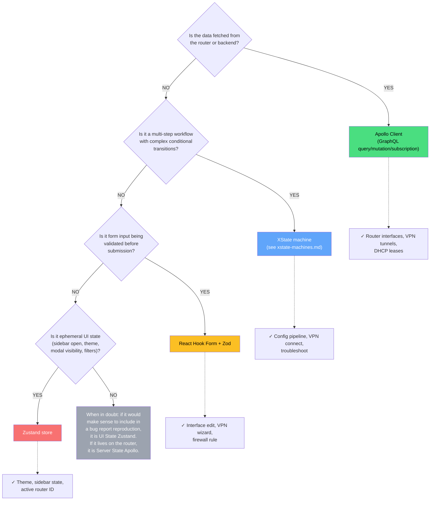

# State Management Guide

This document covers all state management patterns used in NasNetConnect. The application uses four
distinct tools, each with a well-defined role. Choosing the wrong tool for a given situation is the
most common source of bugs and unnecessary re-renders.

## Table of Contents

1. [Decision Tree](#decision-tree)
2. [Apollo Client — Server State](#apollo-client--server-state)
3. [Zustand Stores — UI State](#zustand-stores--ui-state)
4. [React Hook Form + Zod — Form State](#react-hook-form--zod--form-state)
5. [Drift Detection](#drift-detection)
6. [History and Undo/Redo](#history-and-undoredo)
7. [Cross-Layer Integration Patterns](#cross-layer-integration-patterns)

---

## Decision Tree

Before writing any state code, answer these questions in order:



| State Type        | Tool            | Examples                                    |
| ----------------- | --------------- | ------------------------------------------- |
| Server state      | Apollo Client   | Router interfaces, VPN tunnels, DHCP leases |
| UI preferences    | Zustand         | Theme, sidebar state, active router ID      |
| Transient UI      | Zustand         | Search filters, selected rows, modal open   |
| Complex workflows | XState          | Config pipeline, VPN connect, troubleshoot  |
| Form data         | React Hook Form | Interface edit, VPN wizard, firewall rule   |
| Form validation   | Zod             | Schema definitions, runtime type guards     |

---

## Apollo Client — Server State

All data that originates from the router or backend is managed through Apollo Client's normalized
cache. Query hooks live in `libs/api-client/queries/src/` organized by domain.

### Cache Architecture

Apollo stores all query results in a normalized in-memory cache keyed by `__typename + id`. This
means that when a mutation returns updated data for a `WireGuardPeer` with `id: "peer-1"`, every
query that included that peer automatically receives the update — no manual state synchronization
required.

### Query Hook Pattern

Every domain has its own query file. The pattern is consistent:

```typescript
// libs/api-client/queries/src/change-set/useChangeSetQueries.ts

import { useQuery, useLazyQuery, type ApolloError } from '@apollo/client';
import { gql } from '@apollo/client';
import { CHANGE_SET_FULL_FRAGMENT } from './fragments';

const GET_CHANGE_SET_QUERY = gql`
  query GetChangeSet($id: ID!, $routerId: ID!) {
    changeSet(id: $id, routerId: $routerId) {
      ...ChangeSetFull
    }
  }
  ${CHANGE_SET_FULL_FRAGMENT}
`;

export function useChangeSet(
  routerId: string | undefined,
  changeSetId: string | undefined,
  options: GetChangeSetOptions = {}
): {
  changeSet: ChangeSet | undefined;
  loading: boolean;
  error: ApolloError | undefined;
  refetch: () => Promise<void>;
} {
  const { skip = false, pollInterval, fetchPolicy = 'cache-first' } = options;

  const { data, loading, error, refetch } = useQuery(GET_CHANGE_SET_QUERY, {
    variables: { id: changeSetId, routerId },
    skip: skip || !routerId || !changeSetId,
    pollInterval,
    fetchPolicy,
  });

  return {
    changeSet: data?.changeSet,
    loading,
    error,
    refetch: async () => {
      await refetch();
    },
  };
}
```

Key conventions:

- Variables that may be undefined use `skip: skip || !variable` to prevent firing with incomplete
  input.
- The return shape always unwraps the `data?.field` accessor so callers never deal with the Apollo
  `data` wrapper.
- `fetchPolicy` defaults to `'cache-first'` for read queries. Use `'network-only'` when you must
  guarantee fresh data (e.g., after a mutation that may have been applied by another session).

### Lazy Query Pattern

For on-demand fetching (search, click-to-expand), use `useLazyQuery`:

```typescript
export function useLazyChangeSet(): {
  fetch: (routerId: string, changeSetId: string) => Promise<ChangeSet | undefined>;
  changeSet: ChangeSet | undefined;
  loading: boolean;
  error: ApolloError | undefined;
} {
  const [fetchQuery, { data, loading, error }] = useLazyQuery(GET_CHANGE_SET_QUERY);

  const fetch = async (routerId: string, changeSetId: string) => {
    const result = await fetchQuery({ variables: { id: changeSetId, routerId } });
    return result.data?.changeSet;
  };

  return { fetch, changeSet: data?.changeSet, loading, error };
}
```

### Convenience Wrapper Pattern

Thin wrappers add domain logic without duplicating query plumbing:

```typescript
// Adds hasActive boolean derived from the list result
export function useActiveChangeSets(routerId, options) {
  const result = useChangeSets(routerId, { ...options, includeCompleted: false });
  return { ...result, hasActive: result.changeSets.length > 0 };
}

// Badge counter — computes pending count from shared query
export function usePendingChangeSetsCount(routerId) {
  const { changeSets, loading } = useChangeSets(routerId, { includeCompleted: false });
  const pendingCount = changeSets.filter(
    (cs) => cs.status === 'DRAFT' || cs.status === 'READY'
  ).length;
  return { count: pendingCount, isLoading: loading };
}
```

### Subscription Pattern

GraphQL subscriptions are used for real-time data: log streaming, update progress, alert
notifications. The subscription hook wraps `useSubscription` and feeds events into XState machines
or Zustand stores:

```typescript
// Pattern used in service update and alert streams
useEffect(() => {
  if (progressEvent) {
    send({ type: 'PROGRESS', stage: progressEvent.stage, progress: progressEvent.progress });
    if (progressEvent.stage === 'COMPLETE') {
      send({ type: 'COMPLETE', toVersion: progressEvent.newVersion });
    }
  }
}, [progressEvent, send]);
```

### Cache Policies Reference

| Policy              | When to Use                                                |
| ------------------- | ---------------------------------------------------------- |
| `cache-first`       | Default. Read from cache, fetch only on miss.              |
| `cache-and-network` | Show cached data immediately, refresh in background.       |
| `network-only`      | Always fetch fresh. Use after writes or for critical data. |
| `no-cache`          | Never cache. Diagnostics, one-shot operations.             |

### Apollo Query Domains

Queries are organized under `libs/api-client/queries/src/`:

| Directory        | Domain                                           |
| ---------------- | ------------------------------------------------ |
| `alerts/`        | Alert rules, templates, digest queue, history    |
| `batch/`         | Batch job status polling                         |
| `change-set/`    | Change set CRUD and status                       |
| `dhcp/`          | DHCP servers and lease queries                   |
| `diagnostics/`   | Ping, traceroute, circuit breaker                |
| `discovery/`     | Router connection testing                        |
| `dns/`           | DNS settings and cache operations                |
| `firewall/`      | Filter, mangle, NAT, raw rules, templates        |
| `network/`       | Interfaces, bridges, VLANs, IP addresses, routes |
| `notifications/` | In-app notification channels                     |
| `oui/`           | OUI vendor lookup                                |
| `resources/`     | Universal State v2 resource model operations     |
| `services/`      | Feature marketplace, instances, VLANs, traffic   |
| `storage/`       | Storage config, usage, info                      |
| `system/`        | IP services, system notes                        |
| `vpn/`           | PPP/IPsec active connections                     |
| `wan/`           | WAN interface queries and mutations              |

---

## Zustand Stores — UI State

Zustand stores hold ephemeral UI state: things that do not exist on the router and are not tracked
in Apollo's cache. All stores use `devtools` middleware for Redux DevTools integration and `persist`
middleware for selective localStorage persistence.

### Performance-Critical Selector Pattern

**Always use selectors** to avoid unnecessary re-renders. Subscribing to the entire store causes the
component to re-render on any state change:

```typescript
// BAD - re-renders on any change to the store
const { wsStatus, routers } = useConnectionStore();

// GOOD - re-renders only when wsStatus changes
const wsStatus = useConnectionStore((state) => state.wsStatus);

// GOOD - multiple fields with shallow comparison
import { useShallow } from 'zustand/react/shallow';
const { wsStatus, isReconnecting } = useConnectionStore(
  useShallow((state) => ({ wsStatus: state.wsStatus, isReconnecting: state.isReconnecting }))
);
```

### Store Inventory

#### useAuthStore

**File:** `libs/state/stores/src/auth/auth.store.ts` **Purpose:** JWT tokens, user session,
proactive token refresh. **Persisted:** `token`, `tokenExpiry`, `refreshToken`, `user`,
`isAuthenticated` **Not persisted:** `isRefreshing`, `refreshAttempts`

Key state fields:

```typescript
interface AuthState {
  token: string | null; // JWT access token
  tokenExpiry: Date | null; // Expiration timestamp
  refreshToken: string | null; // For token renewal
  user: User | null; // Profile: id, username, email, permissions[]
  isAuthenticated: boolean;
  isRefreshing: boolean; // Refresh in progress
  refreshAttempts: number; // Max 3 before re-login required
  lastActivity: Date | null;
}
```

Token refresh flow: `useTokenRefresh` hook polls `isTokenExpiringSoon()` every minute. When it
returns `true` and `shouldAttemptRefresh()` is `true`, the hook calls the refresh API. On success,
`setAuth()` is called with the new token. On failure, `incrementRefreshAttempts()` is called. After
3 failures, the session expiry dialog is shown.

Key actions: `setAuth(token, user, expiresAt, refreshToken?)`, `clearAuth()`,
`isTokenExpiringSoon()`, `shouldAttemptRefresh()`.

#### useConnectionStore

**File:** `libs/state/stores/src/connection/connection.store.ts` **Purpose:** WebSocket status,
per-router connections, reconnection state. **Persisted:** `activeRouterId` only.

Key state fields:

```typescript
interface ConnectionState {
  wsStatus: 'connecting' | 'connected' | 'disconnected' | 'error';
  wsError: string | null;
  routers: Record<string, RouterConnection>; // Per-router connection info
  activeRouterId: string | null;
  reconnectAttempts: number;
  maxReconnectAttempts: number; // Default: 10
  isReconnecting: boolean;
}

interface RouterConnection {
  routerId: string;
  status: WebSocketStatus;
  protocol: 'rest' | 'api' | 'ssh';
  latencyMs: number | null;
  lastConnected: Date | null;
  lastError: string | null;
}
```

Key actions: `setWsStatus(status, error?)`, `setRouterConnection(routerId, connection)`,
`setActiveRouter(routerId)`, `updateLatency(routerId, ms)`, `incrementReconnectAttempts()`,
`resetReconnection()`, `hasExceededMaxAttempts()`.

#### useThemeStore

**File:** `libs/state/stores/src/ui/theme.store.ts` **Purpose:** Theme mode with localStorage
persistence and system preference sync. **Persisted:** `theme` (the user preference). **localStorage
key:** `nasnet-theme`

```typescript
interface ThemeState {
  theme: 'light' | 'dark' | 'system';
  resolvedTheme: 'light' | 'dark'; // Computed from theme + OS preference
}
```

The `resolvedTheme` is always `'light'` or `'dark'`. When `theme === 'system'`, `resolvedTheme` is
computed from `window.matchMedia('(prefers-color-scheme: dark)')`. The `initThemeListener()`
function sets up a `MediaQueryList` listener to update `resolvedTheme` when the OS preference
changes. The `syncThemeToDOM()` function subscribes to store changes and toggles the `dark` class on
`document.documentElement`.

#### useChangeSetStore

**File:** `libs/state/stores/src/change-set/change-set.store.ts` **Purpose:** Atomic multi-resource
operation batches — the core of the Apply-Confirm-Merge pattern. **Persisted:** Draft and READY
change sets only (applying and completed change sets are not persisted). **localStorage key:**
`nasnet-change-sets`

This store is covered in depth in the [Change Set Store Deep Dive](#change-set-store-deep-dive)
section below.

#### useHistoryStore

**File:** `libs/state/stores/src/history/history.store.ts` **Purpose:** Undo/redo history with
command pattern (max 50 actions). **Persisted:** Global-scope actions only (page-scope actions are
ephemeral).

#### useServiceUIStore

**File:** `libs/state/stores/src/service-ui.store.ts` **Purpose:** Feature marketplace UI state:
search filters, installation wizard draft, view preferences. **Persisted:** `wizardDraft`,
`viewMode`, `showResourceMetrics`, `showAdvancedConfig`.

```typescript
interface ServiceUIState {
  // NOT persisted (ephemeral)
  serviceSearch: string;
  categoryFilter: ServiceCategory; // 'all' | 'privacy' | 'proxy' | 'dns' | 'security' | 'monitoring'
  statusFilter: ServiceStatusFilter; // 'all' | 'available' | 'installed' | 'running' | 'stopped' | 'failed'
  selectedServices: string[];
  wizardStep: number;
  updateInProgress: Record<string, boolean>;
  updateStage: Record<string, UpdateStage>;
  showUpdateAll: boolean;

  // PERSISTED (survive page refresh)
  wizardDraft: ServiceInstallWizardDraft | null; // Recovery after accidental close
  viewMode: 'grid' | 'list';
  showResourceMetrics: boolean;
  showAdvancedConfig: boolean;
}
```

The `wizardDraft` is persisted explicitly to support crash recovery: if the user was mid-way through
a four-step installation wizard and refreshes the page, the wizard can restore their progress from
the draft.

#### Firewall UI Stores

Domain-specific filter/sort state stores for each firewall subsection:

| Store File                  | Purpose                                        |
| --------------------------- | ---------------------------------------------- |
| `nat-ui.store.ts`           | NAT rule table search, sort, column visibility |
| `mangle-ui.store.ts`        | Mangle rule filters and expanded state         |
| `raw-ui.store.ts`           | Raw rule table filters                         |
| `firewall-log-ui.store.ts`  | Log viewer filters and scroll position         |
| `port-knock-ui.store.ts`    | Port knocking UI panel state                   |
| `rate-limiting-ui.store.ts` | Rate limit rule filter/search                  |
| `dhcp-ui.store.ts`          | DHCP lease filter and expanded pools           |

#### Alert and Notification Stores

| Store File                        | Purpose                                        |
| --------------------------------- | ---------------------------------------------- |
| `alert-notification.store.ts`     | In-app notification queue and read state       |
| `alert-rule-template-ui.store.ts` | Alert template browser selection/preview state |

#### UI Infrastructure Stores

| Store File                           | Purpose                                           |
| ------------------------------------ | ------------------------------------------------- |
| `ui/ui.store.ts`                     | Application-wide UI state (loading overlay, etc.) |
| `ui/sidebar.store.ts`                | Sidebar open/collapsed, pinned state              |
| `ui/modal.store.ts`                  | Modal stack management                            |
| `ui/notification.store.ts`           | Toast notification queue                          |
| `ui/help-mode.store.ts`              | Contextual help mode toggle                       |
| `command/command-registry.store.ts`  | Command palette command registration              |
| `command/shortcut-registry.store.ts` | Keyboard shortcut registration                    |
| `router/router.store.ts`             | Router list and selected router metadata          |

---

### Change Set Store Deep Dive

The change set store is the frontend implementation of the Apply-Confirm-Merge pattern. It holds
batches of pending configuration changes that are validated, previewed, and applied atomically to
the router.

#### Data Model

```typescript
interface ChangeSet {
  id: string;
  name: string;
  description?: string;
  routerId: string;
  items: ChangeSetItem[];
  status: ChangeSetStatus; // DRAFT | READY | APPLYING | ROLLING_BACK | COMPLETED | FAILED | ROLLED_BACK | CANCELLED
  validation: ChangeSetValidationResult | null;
  rollbackPlan: RollbackStep[];
  error: ChangeSetError | null;
  createdAt: Date;
  applyStartedAt: Date | null;
  completedAt: Date | null;
  source?: string; // Which feature created this (e.g., 'lan-wizard')
  version: number; // Incremented on every mutation for optimistic locking
}

interface ChangeSetItem {
  id: string;
  resourceType: string; // e.g., 'network.bridge', 'vpn.wireguard-peer'
  resourceCategory: string;
  resourceUuid: string | null;
  name: string;
  operation: 'CREATE' | 'UPDATE' | 'DELETE';
  configuration: Record<string, unknown>;
  previousState: Record<string, unknown> | null; // For rollback
  dependencies: string[]; // Item IDs that must be applied first
  status: ChangeSetItemStatus; // PENDING | APPLYING | APPLIED | FAILED | ROLLED_BACK
  applyOrder: number; // Computed by topological sort
}
```

#### Dependency Ordering

When `addItem()` or `setItemDependencies()` is called, the store automatically calls
`recalculateApplyOrder()`. This runs a topological sort on the dependency graph using
`buildDependencyGraph()` and `computeApplyOrder()` from `@nasnet/core/utils`. The result is stored
as `item.applyOrder`, which the XState `changeSetMachine` reads when applying items in sequence.

```typescript
// Example: Creating a LAN network requires bridge → IP address → DHCP server, in that order
const id = createChangeSet({ name: 'New LAN', routerId: 'router-1', source: 'lan-wizard' });

const bridgeId = addItem(id, {
  name: 'Bridge Interface',
  resourceType: 'network.bridge',
  operation: 'CREATE',
  configuration: { name: 'bridge-lan', vlanFiltering: true },
  dependencies: [],
});

const ipId = addItem(id, {
  name: 'IP Address',
  resourceType: 'network.ip-address',
  operation: 'CREATE',
  configuration: { address: '192.168.10.1/24', interface: 'bridge-lan' },
  dependencies: [bridgeId], // Bridge must exist first
});

addItem(id, {
  name: 'DHCP Server',
  resourceType: 'network.dhcp-server',
  operation: 'CREATE',
  configuration: { interface: 'bridge-lan', poolRange: '192.168.10.100-200' },
  dependencies: [bridgeId, ipId], // Both must exist first
});
```

#### Status Lifecycle

```
DRAFT → READY (after validation passes)
READY → APPLYING (user confirms)
APPLYING → COMPLETED (all items applied)
APPLYING → FAILED (item failed, rollback not available)
APPLYING → ROLLING_BACK (item failed, rollback executing)
ROLLING_BACK → ROLLED_BACK (all applied items reversed)
ROLLING_BACK → FAILED (rollback partially failed)
```

#### Persistence Strategy

```typescript
// Only DRAFT and READY change sets survive page refresh
partialize: (state) => ({
  changeSets: Object.fromEntries(
    Object.entries(state.changeSets).filter(
      ([, cs]) => cs.status === CS.DRAFT || cs.status === CS.READY
    )
  ),
  activeChangeSetId: state.activeChangeSetId,
}),
```

APPLYING, COMPLETED, FAILED, and ROLLED_BACK states are not persisted. If the page refreshes
mid-apply, the backend is responsible for completing or rolling back the operation; the frontend
reloads and shows the final state from the server.

#### Selectors

```typescript
import {
  selectActiveChangeSet,
  createSelectChangeSetsForRouter,
  createSelectDraftChangeSets,
  selectApplyingChangeSets,
  selectIsAnyApplying,
} from '@nasnet/state/stores';

// In a component
const activeChangeSet = useChangeSetStore(selectActiveChangeSet);
const isApplying = useChangeSetStore(selectIsAnyApplying);

// Router-specific (use factory selectors to avoid recreating on each render)
const selectRouterChangeSets = useMemo(() => createSelectChangeSetsForRouter(routerId), [routerId]);
const changeSets = useChangeSetStore(selectRouterChangeSets);
```

---

## React Hook Form + Zod — Form State

All forms in NasNetConnect use React Hook Form (RHF) with Zod schema validation. RHF manages field
state, dirty tracking, and submission. Zod provides runtime validation and TypeScript type
inference.

### Standard Form Pattern

```typescript
import { useForm } from 'react-hook-form';
import { zodResolver } from '@hookform/resolvers/zod';
import { z } from 'zod';

// Step 1: Define schema (this is the single source of truth for types AND validation)
const interfaceSchema = z.object({
  name: z.string().min(1, 'Name is required').max(15, 'Max 15 characters'),
  address: z.string().ip({ version: 'v4', message: 'Must be a valid IPv4 address' }),
  mtu: z.number().min(68).max(9000).default(1500),
  disabled: z.boolean().default(false),
  comment: z.string().max(255).optional(),
});

type InterfaceFormValues = z.infer<typeof interfaceSchema>;

// Step 2: Initialize form
function InterfaceEditForm({ initialValues, onSubmit }) {
  const form = useForm<InterfaceFormValues>({
    resolver: zodResolver(interfaceSchema),
    defaultValues: initialValues,
    mode: 'onBlur',  // Validate on blur for better UX
  });

  const handleSubmit = form.handleSubmit(async (values) => {
    // values is fully typed as InterfaceFormValues
    // Zod has already validated and coerced all fields
    await onSubmit(values);
  });

  return (
    <Form {...form}>
      <form onSubmit={handleSubmit}>
        <FormField
          control={form.control}
          name="name"
          render={({ field }) => (
            <FormItem>
              <FormLabel>Interface Name</FormLabel>
              <FormControl>
                <Input {...field} />
              </FormControl>
              <FormMessage />  {/* Automatically shows Zod error */}
            </FormItem>
          )}
        />
        {/* ... */}
      </form>
    </Form>
  );
}
```

### Zod Schema Patterns

```typescript
// IPv4 CIDR address (e.g., "192.168.1.1/24")
const cidrSchema = z
  .string()
  .regex(/^(\d{1,3}\.){3}\d{1,3}\/\d{1,2}$/, 'Must be valid CIDR notation');

// Port number
const portSchema = z.number().int().min(1).max(65535);

// MAC address
const macSchema = z
  .string()
  .regex(/^([0-9A-Fa-f]{2}:){5}[0-9A-Fa-f]{2}$/, 'Must be valid MAC address');

// MikroTik interface name (alphanumeric with hyphens, max 15 chars)
const interfaceNameSchema = z
  .string()
  .min(1)
  .max(15)
  .regex(/^[a-zA-Z0-9\-\.\/]+$/, 'Only letters, numbers, hyphens, dots, and slashes');

// VPN peer configuration
const wireguardPeerSchema = z.object({
  publicKey: z.string().length(44, 'WireGuard public key must be 44 characters'),
  presharedKey: z.string().length(44).optional(),
  allowedAddresses: z.array(cidrSchema).min(1, 'At least one allowed address required'),
  endpoint: z.string().optional(),
  persistentKeepalive: z.number().min(0).max(65535).optional(),
});

// Discriminated union for different WAN types
const wanConfigSchema = z.discriminatedUnion('type', [
  z.object({ type: z.literal('dhcp'), interface: interfaceNameSchema }),
  z.object({ type: z.literal('pppoe'), username: z.string(), password: z.string() }),
  z.object({ type: z.literal('static'), address: cidrSchema, gateway: z.string().ip() }),
]);
```

### Multi-Step Wizard with RHF

For wizards, each step has its own Zod schema. The wizard accumulates partial data across steps:

```typescript
// Step 1 schema
const step1Schema = z.object({
  featureId: z.string().min(1),
  instanceName: z.string().min(1).max(30),
});

// Step 2 schema
const step2Schema = z.object({
  vlanId: z.number().int().min(2).max(4094),
  bindIp: z.string().ip({ version: 'v4' }),
});

// Combined (for final submission validation)
const fullWizardSchema = step1Schema.merge(step2Schema).merge(step3Schema);

// In the wizard component, validate only the current step's fields
const form = useForm({ resolver: zodResolver(currentStepSchema) });
```

### Integration with XState Wizards

When using the `createWizardMachine` from `libs/state/machines/src/wizardMachine.ts`, the
`validateStep` callback bridges RHF with XState:

```typescript
const machine = createWizardMachine({
  id: 'service-install',
  totalSteps: 4,
  validateStep: async (step, data) => {
    // Use Zod to validate the step-specific fields
    const stepSchema = STEP_SCHEMAS[step];
    const result = stepSchema.safeParse(data);
    if (!result.success) {
      const errors: Record<string, string> = {};
      result.error.issues.forEach((issue) => {
        errors[issue.path.join('.')] = issue.message;
      });
      return { valid: false, errors };
    }
    return { valid: true };
  },
  onSubmit: async (data) => {
    await installService(data);
  },
});
```

---

## Drift Detection

Drift detection compares the **configuration layer** (what the user has set) against the
**deployment layer** (what is actually running on the router). This is part of the Universal State
v2 8-layer resource model.

### Core Hook

```typescript
// libs/state/stores/src/drift-detection/useDriftDetection.ts

const { hasDrift, status, driftCount, result } = useDriftDetection({
  configuration: resource.configuration,
  deployment: resource.deployment, // Contains generatedFields from router
});

// Status values
type DriftStatus = 'PENDING' | 'SYNCED' | 'DRIFTED' | 'ERROR';
```

The hook is memoized — drift is only recomputed when `configuration` or `deployment` changes (by
reference). The computation hashes both objects and does an early exit on hash equality, making it
cheap in list views.

### Drift Result Shape

```typescript
interface DriftResult {
  hasDrift: boolean;
  status: DriftStatus;
  driftedFields: DriftedField[]; // Field-level diff for UI display
  configurationHash: string;
  deploymentHash: string;
  lastChecked: Date;
  isStale?: boolean; // Deployment is older than staleThreshold
  errorMessage?: string;
}
```

### Performance-Optimized Variant

For list views where you only need to know _if_ drift exists (not _what_ drifted), use the hash-only
check:

```typescript
const { hasDrift, status } = useQuickDriftCheck(resource.configuration, resource.deployment);
```

This skips the expensive field-level diff computation. Use `useDriftDetection` only in detail views
where you render which fields drifted.

### Batch Drift Status

For tables showing many resources:

```typescript
const driftStatusMap = useBatchDriftStatus(resources);

// In table row render
const status = driftStatusMap.get(resource.uuid);
```

### Apply-Confirm Drift

The `useApplyConfirmDrift` hook specifically handles the case where the user is in the middle of
applying a change set and the deployment layer reports a different state than expected. This
triggers an alert to the user that the router state may have changed since the change set was
created.

---

## History and Undo/Redo

The history store (`useHistoryStore`) implements the command pattern for undo/redo. It keeps two
stacks: `past` (executed actions) and `future` (undone actions).

### Pushing an Action

```typescript
import { useHistoryStore } from '@nasnet/state/stores';

const { pushAction } = useHistoryStore();

// Before making a change, register undo/redo handlers
const actionId = pushAction({
  type: 'edit',
  description: 'Edit interface MTU',
  scope: 'page', // 'page' | 'global'
  resourceId: 'iface-1',
  resourceType: 'network.interface',
  execute: async () => {
    await updateInterface({ id: 'iface-1', mtu: newMtu });
  },
  undo: async () => {
    await updateInterface({ id: 'iface-1', mtu: previousMtu });
  },
});
```

### Performing Undo/Redo

```typescript
const { undo, redo } = useHistoryStore();

// Returns true if successful
const didUndo = await undo();
const didRedo = await redo();
```

### Scope Rules

- `'page'` scope: cleared when navigating away (via `clearPageScopedHistory()`). Use for form edits.
- `'global'` scope: persisted across navigation. Use for significant configuration changes.

### Keyboard Shortcuts

The `useHistoryShortcuts` hook registers `Ctrl+Z` (undo) and `Ctrl+Y` / `Ctrl+Shift+Z` (redo)
globally. It integrates with the `shortcut-registry.store.ts` to avoid conflicts with textarea and
input elements.

### History Limits

- Maximum 50 actions total (oldest are dropped when the limit is exceeded).
- Functions (`execute` and `undo` callbacks) are **not** persisted to localStorage. Persisted
  actions (global scope only) display in the history panel as read-only entries but cannot be
  re-executed after a page reload.

### Convenience Functions

For use outside React components:

```typescript
import { undoLast, redoLast, pushHistoryAction, clearAllHistory } from '@nasnet/state/stores';

await undoLast();
await redoLast();
pushHistoryAction({ type: 'edit', description: '...', scope: 'global', execute, undo });
clearAllHistory();
```

---

## Cross-Layer Integration Patterns

### Apollo Mutation + Zustand Update

When a mutation changes data that is also tracked in a Zustand store, update both:

```typescript
const [applyChangeSet] = useMutation(APPLY_CHANGE_SET_MUTATION);
const { markApplying, markCompleted, markFailed } = useChangeSetStore();

const handleApply = async (changeSetId: string) => {
  markApplying(changeSetId); // Optimistic update
  try {
    await applyChangeSet({ variables: { id: changeSetId } });
    markCompleted(changeSetId);
  } catch (error) {
    markFailed(changeSetId, error.message, /* failedItemId */ 'unknown');
  }
};
```

### XState + Apollo Subscription Bridge

XState machines receive data from Apollo subscriptions via `send()`:

```typescript
// libs/features/services/src/machines/update-machine.ts pattern
const [state, send] = useMachine(updateMachine);
const { data: progressData } = useSubscription(UPDATE_PROGRESS_SUBSCRIPTION, {
  variables: { instanceId },
});

useEffect(() => {
  if (!progressData?.updateProgress) return;
  const event = progressData.updateProgress;

  send({ type: 'PROGRESS', stage: event.stage, progress: event.progress, message: event.message });

  if (event.stage === 'COMPLETE') {
    send({ type: 'COMPLETE', toVersion: event.newVersion });
  } else if (event.rolledBack) {
    send({ type: 'ROLLED_BACK', error: event.error });
  } else if (event.stage === 'FAILED') {
    send({ type: 'FAILED', error: event.error });
  }
}, [progressData, send]);
```

### Form Data → Change Set

The typical flow for a wizard that creates a change set:

```typescript
const form = useForm({ resolver: zodResolver(createLANSchema) });
const { createChangeSet, addItem } = useChangeSetStore();

const handleSubmit = form.handleSubmit((values) => {
  // Create a change set from validated form data
  const csId = createChangeSet({
    name: `Create LAN: ${values.networkName}`,
    routerId,
    source: 'lan-wizard',
  });

  addItem(csId, {
    name: 'Bridge Interface',
    resourceType: 'network.bridge',
    operation: 'CREATE',
    configuration: { name: values.bridgeName },
    dependencies: [],
  });

  // Navigate to change set review page
  navigate(`/router/${routerId}/change-sets/${csId}`);
});
```

---

## Cross-References

- For XState machine details: `libs/features/docs/xstate-machines.md`
- For GraphQL schema patterns: `Docs/architecture/api-contracts.md`
- For the 8-layer resource model (deployment vs. configuration layers):
  `Docs/architecture/data-architecture.md`
- For component patterns that consume these stores: `Docs/design/PLATFORM_PRESENTER_GUIDE.md`
