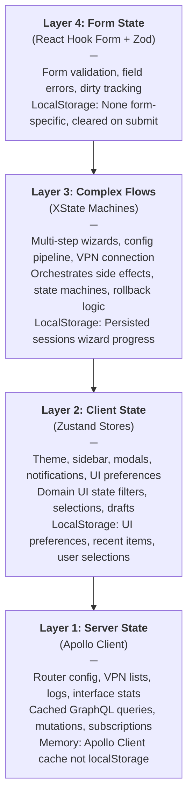
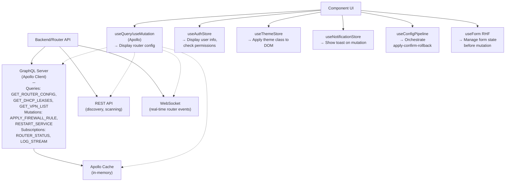
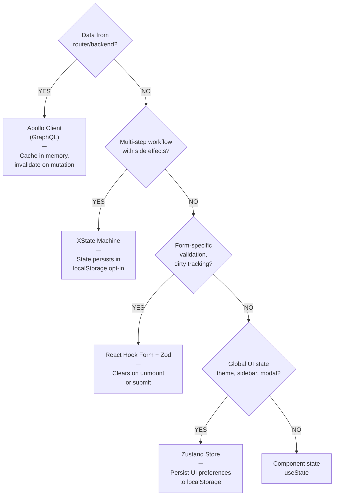

# State Architecture

The `@nasnet/state` library implements a **four-layer state model** that separates concerns by data origin, update frequency, and complexity.

## Four-Layer State Model



## Data Flow Diagram



## Decision Tree



## Zustand Pattern: Singleton Stores with Persist Middleware

All Zustand stores follow the **singleton + middleware** pattern:

```typescript
// 1. Define state + action types
interface ThemeState {
  theme: ThemeMode;
  resolvedTheme: 'light' | 'dark';
}

interface ThemeActions {
  setTheme: (theme: ThemeMode) => void;
  toggleTheme: () => void;
}

// 2. Create store with middleware stack
export const useThemeStore = create<ThemeState & ThemeActions>()(
  devtools(           // Layer 3: DevTools debugging (outermost)
    persist(          // Layer 2: localStorage persistence
      (set, get) => ({ // Layer 1: Reducer logic (innermost)
        // State
        theme: 'system',
        resolvedTheme: getSystemTheme(),

        // Actions
        setTheme: (theme) => {
          set({ theme, resolvedTheme: theme === 'system' ? getSystemTheme() : theme });
        },
        toggleTheme: () => {
          const current = get().resolvedTheme;
          set({ resolvedTheme: current === 'dark' ? 'light' : 'dark' });
        },
      }),
      {
        name: 'nasnet-theme',  // localStorage key
        version: 1,
        partialize: (state) => ({ theme: state.theme }), // Only persist theme mode
      }
    ),
    { name: 'theme-store' }  // DevTools store name
  )
);

// 3. Use in components with selectors
function ThemeToggle() {
  const theme = useThemeStore(state => state.theme);
  const toggleTheme = useThemeStore(state => state.toggleTheme);
  return <button onClick={toggleTheme}>{theme}</button>;
}

// 4. Access outside React
const { theme } = useThemeStore.getState();
const unsubscribe = useThemeStore.subscribe(
  (state) => state.theme,
  (theme) => console.log('Theme changed:', theme)
);
```

**Middleware order matters:**
1. **devtools (outermost)** - Intercepts all mutations for debugging
2. **persist (middle)** - Saves to localStorage on mutations
3. **Reducer (innermost)** - Core state logic

**Source:** `libs/state/stores/src/ui/theme.store.ts`

## Custom Storage Handlers

Some stores require custom serialization for JSON:

### 1. Auth Store: Date Object Rehydration

**Problem:** `new Date()` → JSON → `"2025-02-27T12:00:00Z"` (lost instanceof check)

**Solution:** Custom storage handler that converts ISO strings back to Date objects:

```typescript
const authStorage: StateStorage = {
  getItem: (name: string) => {
    const str = localStorage.getItem(name);
    if (!str) return null;

    const parsed = JSON.parse(str);

    // Rehydrate Date objects
    if (parsed.state?.tokenExpiry) {
      parsed.state.tokenExpiry = new Date(parsed.state.tokenExpiry);
    }
    if (parsed.state?.lastActivity) {
      parsed.state.lastActivity = new Date(parsed.state.lastActivity);
    }

    return JSON.stringify(parsed);
  },
  setItem: (name, value) => localStorage.setItem(name, value),
  removeItem: (name) => localStorage.removeItem(name),
};

export const useAuthStore = create<AuthState & AuthActions>()(
  persist(
    (set, get) => ({ /* ... */ }),
    {
      name: 'auth-storage',
      storage: createJSONStorage(() => authStorage),  // Use custom handler
    }
  )
);
```

**Usage:** Auth store now preserves Date semantics for expiry checks:

```typescript
const { tokenExpiry } = useAuthStore.getState();
const isExpired = tokenExpiry.getTime() <= Date.now();  // Works correctly
```

**Source:** `libs/state/stores/src/auth/auth.store.ts:191-230`

### 2. History Store: Function Serialization (No-op on Rehydration)

**Problem:** `execute()` and `undo()` functions can't serialize to JSON

**Solution:** Custom storage that converts functions to no-ops on rehydration:

```typescript
storage: {
  getItem: (name) => {
    const str = localStorage.getItem(name);
    if (!str) return null;

    const data = JSON.parse(str);

    // Convert persisted actions back to full UndoableAction type
    // Functions are provided as no-ops (can't execute after reload)
    data.state.past = (data.state.past || []).map((a: SerializedAction) => ({
      ...a,
      timestamp: new Date(a.timestamp),
      execute: () => console.warn('Cannot re-execute persisted action'),
      undo: () => console.warn('Cannot undo persisted action'),
    }));

    return data;
  },
  setItem: (name, value) => localStorage.setItem(name, JSON.stringify(value)),
  removeItem: (name) => localStorage.removeItem(name),
}
```

**Why:** Only action metadata is persisted (for display in history UI), not the actual execute/undo logic.

**Source:** `libs/state/stores/src/history/history.store.ts:293-335`

### 3. Command Registry: Map ↔ Record Serialization

**Problem:** `Map<string, Command>` and `Map<string, number>` don't JSON serialize

**Solution:** Custom `merge` function converts Record back to Map on rehydration:

```typescript
// In command-registry.store.ts
export const useCommandRegistry = create<CommandRegistryState & CommandRegistryActions>()(
  persist(
    (set, get) => ({ /* ... */ }),
    {
      name: 'nasnet-command-registry',
      partialize: (state) => ({
        recentIds: state.recentIds,
        usageCount: Object.fromEntries(state.usageCount), // Map → Record
      }),
      merge: (persistedState, currentState) => {
        // Convert Record back to Map on rehydration
        return {
          ...currentState,
          recentIds: persistedState.recentIds || [],
          usageCount: new Map(Object.entries(persistedState.usageCount || {})),
        };
      },
    }
  )
);
```

**Data flow:**
1. **Persist:** `usageCount: Map<string, number>` → `Object.fromEntries()` → `{ "cmd-1": 3, "cmd-2": 5 }`
2. **Rehydrate:** `{ "cmd-1": 3, "cmd-2": 5 }` → `new Map(Object.entries(...))` → `Map<string, number>`

**Source:** `libs/state/stores/src/command/command-registry.store.ts:280-300`

## Selector Patterns: Optimized Re-renders

Selectors are **critical** for performance. Without them, components re-render on ANY store mutation.

### Basic Selector: Primitive Value

```typescript
// ✅ BEST: Only re-renders when isAuthenticated changes
const isAuthenticated = useAuthStore(state => state.isAuthenticated);
```

### Shallow Comparison: Multiple Fields

```typescript
import { shallow } from 'zustand/shallow';

// ✅ GOOD: Re-renders only when user OR token changes
const { user, token } = useAuthStore(
  state => ({ user: state.user, token: state.token }),
  shallow  // Prevents re-render if same object reference
);
```

### Memoized Selector: Computed Values

```typescript
// Cache computed results based on dependency changes
const selectUIPreferencesMemoized = createMemoizedSelector(
  (state: UIState) => [
    state.compactMode,
    state.animationsEnabled,
    state.defaultNotificationDuration,
  ] as const,
  ([compactMode, animationsEnabled, duration]) => ({
    compactMode,
    animationsEnabled,
    duration,
  })
);

// Usage
const prefs = useUIStore(selectUIPreferencesMemoized);
```

### Parameterized Selector: ID-based Lookups

```typescript
// Create selector factory for searching by parameter
const selectNotificationById = createParameterizedSelector(
  (state: NotificationState, id: string) =>
    state.notifications.find(n => n.id === id) ?? null
);

// Each ID gets its own cached selector
const notification = useNotificationStore(selectNotificationById('abc-123'));
```

**Source:** `libs/state/stores/src/ui/selectors.ts:25-112`

## XState v5 Pattern: Actor Model

XState machines use the **setup() factory** for cleaner type safety and async handling:

```typescript
// 1. Define context and event types
interface WizardContext {
  currentStep: number;
  formData: Record<string, unknown>;
  error?: string;
}

type WizardEvent =
  | { type: 'NEXT' }
  | { type: 'BACK' }
  | { type: 'SUBMIT'; data: Record<string, unknown> };

// 2. Create machine with setup()
export const wizardMachine = setup({
  types: {
    context: {} as WizardContext,
    events: {} as WizardEvent,
  },
  actions: {
    recordFormData: assign({
      formData: ({ event }) => {
        if (event.type === 'SUBMIT') {
          return event.data;
        }
        return {};
      },
    }),
  },
}).createMachine({
  id: 'wizard',
  initial: 'step1',
  context: {
    currentStep: 1,
    formData: {},
  },
  states: {
    step1: {
      on: {
        NEXT: { target: 'step2' },
      },
    },
    step2: {
      on: {
        BACK: { target: 'step1' },
        SUBMIT: {
          target: 'success',
          actions: 'recordFormData',
        },
      },
    },
    success: {
      type: 'final',
    },
  },
});
```

**Key differences from XState v4:**
- `setup()` wraps machine definition for better type inference
- Actions have direct access to `event` and `context`
- No need for `assign()` function at top level (inside actions only)

**Source:** `libs/state/machines/src/wizardMachine.ts`

## Machine Persistence: Session Recovery

Machines support localStorage-based session recovery for long-running operations:

```typescript
import { persistMachineState, restoreMachineState } from '@nasnet/state/machines';

// On machine transition: persist context
function handleStateChange(state) {
  persistMachineState('vpn-wizard', state.value, state.context);
}

// On app load: restore if available
function App() {
  const saved = restoreMachineState('vpn-wizard');
  if (saved) {
    // Resume wizard from saved context
    send({ type: 'RESTORE', data: saved.context });
  }
}
```

**Persistence API:**
- `persistMachineState(id, stateValue, context)` - Save to localStorage
- `restoreMachineState(id, maxAge?)` - Restore from localStorage (24hr timeout by default)
- `hasSavedSession(id)` - Check if session exists
- `cleanupStaleSessions()` - Remove sessions older than maxAge
- `clearMachineState(id)` - Manually clear a session

**Storage key format:** `nasnet-machine-{machineId}`

**Source:** `libs/state/machines/src/persistence.ts`

## Cross-Layer Integration

### Example: Configuration Pipeline (All 4 Layers)

```
Layer 1 (Apollo):
  useQuery(GET_CURRENT_CONFIG) → { currentConfig: {...} }

Layer 2 (Zustand):
  useUIStore() → { pendingChanges: {...} }
  useNotificationStore() → show("Applying config...")

Layer 3 (XState):
  useConfigPipeline() → {
    state: 'applying',
    send: (event) => void,
  }

Layer 4 (RHF):
  useForm() → {
    formState: { errors, isDirty },
    watch: (field) => value,
  }

Flow:
  User fills form (RHF) → Clicks "Apply" →
  Trigger config pipeline (XState) →
  Validate + Preview (show in UI with Zustand) →
  Show countdown confirm (Zustand modal) →
  Send mutation to backend (Apollo) →
  Verify result (Apollo requery) →
  Show success toast (Zustand notification)
```

### Example: VPN Connection (Layers 1, 2, 3)

```
Layer 1 (Apollo):
  useMutation(CONNECT_VPN) → mutation function

Layer 2 (Zustand):
  useConnectionStore() → {
    isConnected: boolean,
    status: string,
    connectionStrength: number,
  }

Layer 3 (XState):
  useVPNConnection() → {
    state: 'idle' | 'connecting' | 'connected' | 'error',
    send: (event) => void,
  }

Machine orchestrates:
  1. CONNECT event → state: 'connecting'
  2. Call Apollo mutation
  3. Update Zustand store with progress
  4. On success → state: 'connected', update store
  5. Start health check polling
  6. On failure → state: 'error', show toast notification
```

## Summary

| Aspect | Zustand | XState | Apollo | RHF |
|--------|---------|--------|--------|-----|
| **Data Origin** | Client | Client | Server | Form |
| **Update Frequency** | On user action | On state transition | On mutation/query | On field change |
| **Side Effects** | Imperative | Declarative (actions/guards) | Async mutations | On form submit |
| **Persistence** | localStorage (optional) | localStorage (opt-in) | Apollo cache (memory) | None |
| **Debugging** | Redux DevTools | XState visualizer | Apollo DevTools | React DevTools |

---

**Next Steps:**
- Read [Persistence](./persistence.md) for localStorage key reference and custom handlers
- Read [Performance](./performance.md) for selector patterns and re-render optimization
