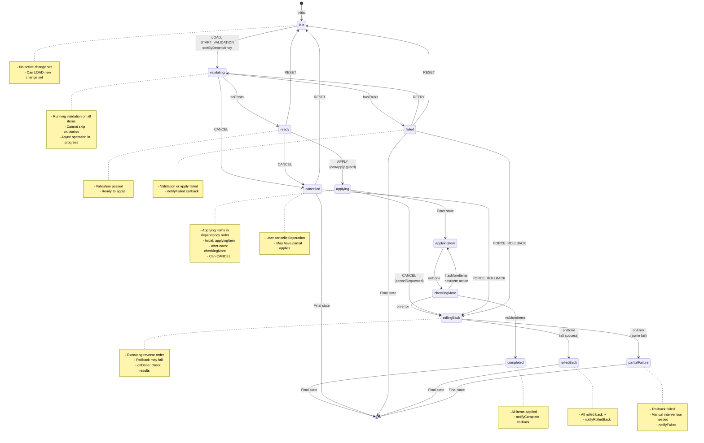

# Change Set Machine (Atomic Multi-Resource Operations)

The **Change Set Machine** orchestrates **atomic multi-resource operations** with dependency-aware apply ordering and rollback on failure. It ensures that complex configurations involving multiple resources are either fully applied or fully rolled back—no partial states.

**Source:** `libs/state/machines/src/changeSetMachine.ts`

## Complete State Chart



## States Reference

| State | Purpose | Sub-states | Transitions |
|-------|---------|-----------|---|
| **idle** | Initial state | None | LOAD → idle (setup), START_VALIDATION → validating |
| **validating** | Validating all items | None | onDone → idle\|ready, onError → failed, CANCEL → cancelled |
| **ready** | Validation passed | None | APPLY → applying (if canApply), RESET → idle, CANCEL → cancelled |
| **applying** | Applying in order | applyingItem, checkingMore | Nested states handle iteration, CANCEL → cancellation on next check |
| **completed** | All items applied | None | (Terminal - no transitions) |
| **rollingBack** | Rolling back applied | None | onDone → rolledBack\|partialFailure, onError → partialFailure |
| **rolledBack** | Rollback successful | None | (Terminal - no transitions) |
| **failed** | Validation or apply failed | None | RETRY → validating, FORCE_ROLLBACK → rollingBack (if has applied), RESET → idle |
| **partialFailure** | Rollback partially failed | None | (Terminal - manual intervention needed) |
| **cancelled** | User cancelled | None | FORCE_ROLLBACK → rollingBack (if has applied), RESET → idle, (else Terminal) |

## Context

```typescript
interface ChangeSetMachineContext {
  /** The change set being processed */
  changeSet: ChangeSet | null;

  /** Router ID for the operation */
  routerId: string | null;

  /** Validation result */
  validationResult: ChangeSetValidationResult | null;

  /** Current item index in sorted apply order */
  currentItemIndex: number;

  /** Items in apply order (topologically sorted) */
  sortedItems: ChangeSetItem[];

  /** Items that have been applied */
  appliedItems: ChangeSetItem[];

  /** Rollback plan (populated as items are applied) */
  rollbackPlan: RollbackStep[];

  /** Error information */
  error: ChangeSetError | null;

  /** Error message for simple errors */
  errorMessage: string | null;

  /** Whether cancellation was requested */
  cancelRequested: boolean;

  /** Apply start time */
  applyStartedAt: number | null;

  /** Progress callbacks */
  onProgress?: (event: ChangeSetProgressEvent) => void;
}
```

### ChangeSetProgressEvent

```typescript
interface ChangeSetProgressEvent {
  changeSetId: string;
  status: 'validating' | 'applying' | 'completed' | 'rolling_back' | 'failed';
  currentItem: {
    id: string;
    name: string;
    index: number;
  } | null;
  appliedCount: number;
  totalCount: number;
  progressPercent: number;
  error: string | null;
}
```

### RollbackStep

```typescript
interface RollbackStep {
  itemId: string;                              // Which item to rollback
  operation: 'DELETE' | 'REVERT' | 'RESTORE'; // What operation to do
  restoreState: unknown;                       // Data to restore to
  resourceUuid: string;                        // Resource to target
  success: boolean;                            // Did rollback succeed?
  error: string | null;                        // If failed, why?
  rollbackOrder: number;                       // Order in rollback sequence
}
```

## Events

```typescript
type ChangeSetMachineEvent =
  | { type: 'LOAD'; changeSet: ChangeSet; routerId: string }  // Load change set
  | { type: 'START_VALIDATION' }                              // Start validation
  | { type: 'APPLY' }                                         // Start applying
  | { type: 'CANCEL' }                                        // User cancellation
  | { type: 'RETRY' }                                         // Retry after error
  | { type: 'RESET' }                                         // Reset to idle
  | { type: 'FORCE_ROLLBACK' };                               // Force rollback
```

## Guards

```typescript
{
  hasMoreItems: boolean;              // currentItemIndex < sortedItems.length
  noMoreItems: boolean;               // currentItemIndex >= sortedItems.length
  canApply: boolean;                  // validationResult.canApply && items exist
  hasAppliedItems: boolean;           // appliedItems.length > 0
  isCancelled: boolean;               // cancelRequested === true
  hasValidationErrors: boolean;       // validationResult.errors.length > 0
}
```

## Actions

```typescript
{
  loadChangeSet();                    // Store changeSet and sort by dependency
  setValidationResult();              // Store validation result
  notifyValidationComplete();         // onValidationComplete callback
  startApply();                       // Set applyStartedAt timestamp
  recordApplied();                    // Add item to appliedItems, create rollback step
  nextItem();                         // Increment currentItemIndex
  setError();                         // Store error from apply failure
  setValidationError();               // Store validation error message
  markCancelRequested();              // Set cancelRequested flag
  checkRollbackResults();             // Check rollback success/failure
  notifyProgress();                   // onProgress callback with current status
  notifyComplete();                   // onComplete callback
  notifyFailed();                     // onFailed callback
  notifyRolledBack();                 // onRolledBack callback
  resetMachine();                     // Clear all context
}
```

## Actors

```typescript
actors: {
  validateAll(changeSet: ChangeSet): Promise<ChangeSetValidationResult>;

  applyCurrentItem(params: {
    item: ChangeSetItem;
    routerId: string;
  }): Promise<{
    confirmedState: Record<string, unknown>;
    resourceUuid?: string;
  }>;

  executeRollback(params: {
    rollbackPlan: RollbackStep[];
    routerId: string;
  }): Promise<void>;
}
```

## Topological Sort (Dependency Ordering)

```typescript
// Example: WireGuard VPN → Network Interface → Firewall Rule
// Dependencies: Firewall depends on Network, Network depends on WireGuard
//
// Apply Order (forward): WireGuard → Network → Firewall
// Rollback Order (reverse): Firewall → Network → WireGuard

function sortItemsByDependency(items: ChangeSetItem[]): ChangeSetItem[] {
  const nodes = buildDependencyGraph(items);
  const result = topologicalSort(nodes);
  if (!result.success) {
    // Cycle detected - validation should catch this
    return items;
  }
  return result.sortedIds.map(id => itemMap.get(id));
}
```

## Rollback on Failure

When apply fails at item N:

```
Items applied: 1, 2, ..., N-1
Create rollback plan in REVERSE order:
  1. Undo item N-1 (if partial apply)
  2. Undo item N-2
  ...
  N-1. Undo item 1

Execute each rollback:
  - If rollback fails → mark as failed, continue with rest
  - Track success/failure for each step
  - Transition to partialFailure if any rollback fails
  - Transition to rolledBack if all succeed
```

## Usage with `createChangeSetMachine`

```typescript
import { createChangeSetMachine } from '@nasnet/state/machines';

const changeSetMachine = createChangeSetMachine({
  validateChangeSet: async (changeSet) => {
    const response = await api.validateChangeSet(changeSet);
    return {
      canApply: response.valid,
      errors: response.errors || [],
    };
  },
  applyItem: async ({ item, routerId }) => {
    const response = await api.applyResource({
      routerId,
      resourceType: item.resourceType,
      operation: item.operation,
      configuration: item.configuration,
    });
    return {
      confirmedState: response.confirmedState,
      resourceUuid: response.resourceUuid,
    };
  },
  rollbackItem: async ({ rollbackStep, routerId }) => {
    await api.rollbackResource({
      routerId,
      itemId: rollbackStep.itemId,
      operation: rollbackStep.operation,
      restoreState: rollbackStep.restoreState,
    });
  },
  onComplete: (changeSet) => {
    toast.success(`Applied ${changeSet.items.length} changes`);
  },
  onFailed: (error) => {
    toast.error(`Change set failed: ${error.message}`);
  },
  onRolledBack: () => {
    toast.info('All changes rolled back');
  },
});
```

## Code Examples

### Applying Multi-Resource Change Set

```typescript
interface WireGuardChangeSet extends ChangeSet {
  items: [
    {
      id: 'wg-client';
      operation: 'CREATE';
      resourceType: 'wireguard-client';
      configuration: WireGuardConfig;
      dependencies: [];
    },
    {
      id: 'route';
      operation: 'CREATE';
      resourceType: 'static-route';
      configuration: RouteConfig;
      dependencies: ['wg-client'];  // Depends on WireGuard
    },
    {
      id: 'firewall';
      operation: 'UPDATE';
      resourceType: 'firewall-rule';
      configuration: FirewallConfig;
      dependencies: ['route'];      // Depends on Route
    },
  ];
}

// Apply order: wg-client → route → firewall
// If firewall fails: rollback firewall → rollback route → rollback wg-client
```

### Progress Tracking

```tsx
const [progress, setProgress] = useState<ChangeSetProgressEvent | null>(null);

const machine = createChangeSetMachine({
  // ... config ...
  onProgress: (event) => {
    setProgress(event);
    console.log(
      `Applying ${event.currentItem?.name} ` +
      `(${event.appliedCount}/${event.totalCount}, ${event.progressPercent}%)`
    );
  },
});

// In UI:
{progress && (
  <div>
    <ProgressBar value={progress.progressPercent} />
    <p>Applying: {progress.currentItem?.name}</p>
    <p>{progress.appliedCount} / {progress.totalCount}</p>
  </div>
)}
```

### Error Handling

```typescript
const [state, send] = useActor(changeSetMachine);

if (state.matches('failed')) {
  const error = state.context.error;
  return (
    <ErrorPanel
      error={error?.message}
      failedItem={error?.failedItemId}
      partiallyApplied={error?.partiallyAppliedItemIds}
      onRetry={() => send({ type: 'RETRY' })}
      onRollback={() => send({ type: 'FORCE_ROLLBACK' })}
    />
  );
}

if (state.matches('partialFailure')) {
  const failedRollbacks = state.context.error?.failedRollbackItemIds || [];
  return (
    <ManualInterventionPanel
      failedRollbacks={failedRollbacks}
      message="Some changes could not be rolled back. Manual intervention required."
      contactSupport={() => api.openSupportTicket()}
    />
  );
}
```

## Atomic Guarantees

The change set machine provides **all-or-nothing semantics**:

- ✓ All items validated before any apply
- ✓ All items applied in dependency order
- ✓ Rollback happens in reverse dependency order
- ✓ Partial applies tracked for rollback
- ✓ Failures detected and reported
- ✓ Manual intervention available if rollback fails

## Performance Considerations

1. **Batch Validation:** All items validated in parallel (if API supports)
2. **Sequential Apply:** Applied one-by-one in dependency order (can't parallelize due to dependencies)
3. **Async Rollback:** Rollback items can be parallel (they're reverse-ordered)
4. **Progress Reporting:** Per-item progress for UI feedback

## Comparing with Config Pipeline

| Feature | Config Pipeline | Change Set |
|---------|-----------------|-----------|
| **Scope** | Single resource | Multiple resources |
| **Order** | N/A | Dependency-ordered (topological sort) |
| **Validation** | Single validation | Batch validation of all items |
| **Apply** | Single apply | Per-item apply in order |
| **Rollback** | Whole config | Per-item rollback in reverse |
| **High-risk** | Yes (with confirm) | No (just validation) |
| **Use case** | WireGuard config edit | Multi-service setup wizard |

## Related Documentation

- **Overview:** See `overview.md` for machine catalog
- **Resource Lifecycle:** See `resource-lifecycle.md` for individual resource management
- **Config Pipeline:** See `config-pipeline.md` for single-resource safety flow
