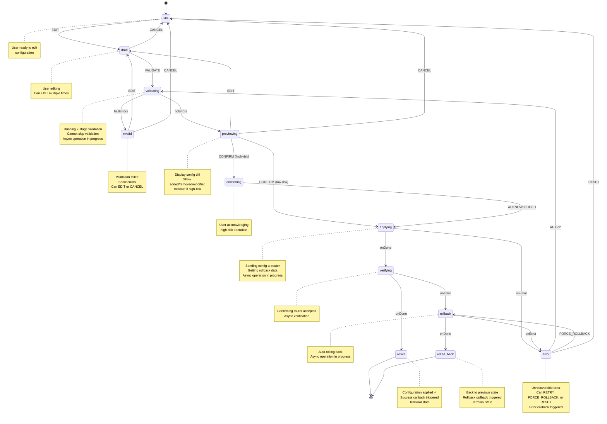

# Configuration Pipeline Machine (Safety Flow)

The **Config Pipeline Machine** implements the **Apply-Confirm-Merge pattern** for safe
configuration changes. It prevents accidental network lockouts through explicit state modeling,
guards, and automatic rollback on failure.

**Source:** `libs/state/machines/src/configPipelineMachine.ts` **Hook:**
`libs/state/machines/src/hooks/useConfigPipeline.ts`

## Complete State Chart



## States Reference

| State           | Duration   | Purpose                                          | Entry Actions        | On Events                                                         |
| --------------- | ---------- | ------------------------------------------------ | -------------------- | ----------------------------------------------------------------- |
| **idle**        | Indefinite | Initial state, waiting for user to start editing | None                 | `EDIT` → draft                                                    |
| **draft**       | Indefinite | User editing configuration                       | None                 | `EDIT` (stay), `VALIDATE` → validating, `CANCEL` → idle (reset)   |
| **validating**  | 5-30s      | Running 7-stage validation pipeline              | None                 | onDone → invalid\|previewing, onError → error                     |
| **invalid**     | Indefinite | Validation failed, showing errors                | None                 | `EDIT` → draft (reset), `CANCEL` → idle (reset)                   |
| **previewing**  | Indefinite | Showing configuration diff                       | None                 | `CONFIRM` → applying\|confirming, `EDIT` → draft, `CANCEL` → idle |
| **confirming**  | Indefinite | User acknowledging high-risk operation           | None                 | `ACKNOWLEDGED` → applying, `CANCEL` → previewing                  |
| **applying**    | 5-60s      | Sending config to router, getting rollback data  | None                 | onDone → verifying, onError → error                               |
| **verifying**   | 5-30s      | Confirming router accepted changes               | None                 | onDone → active, onError → rollback                               |
| **active**      | N/A        | Configuration successfully applied               | `notifySuccess()`    | (Terminal - no transitions)                                       |
| **rollback**    | 5-30s      | Auto-rolling back due to verification failure    | None                 | onDone → rolled_back, onError → error                             |
| **rolled_back** | N/A        | Rollback completed, back to safe state           | `notifyRolledBack()` | (Terminal - no transitions)                                       |
| **error**       | Indefinite | Unrecoverable error                              | `notifyError()`      | `RETRY` → validating, `FORCE_ROLLBACK` → rollback, `RESET` → idle |

## Events

### External Events (sent by user/UI)

```typescript
type ConfigPipelineEvent<TConfig> =
  | { type: 'EDIT'; config: TConfig } // Start/update editing
  | { type: 'VALIDATE' } // Trigger validation
  | { type: 'CONFIRM' } // Confirm preview
  | { type: 'ACKNOWLEDGED' } // Acknowledge high-risk
  | { type: 'CANCEL' } // Cancel pipeline
  | { type: 'RETRY' } // Retry after error
  | { type: 'RESET' } // Reset to idle
  | { type: 'FORCE_ROLLBACK' }; // Force rollback from error
```

## Context

```typescript
interface ConfigPipelineContext<TConfig = unknown> {
  /** Resource ID being configured */
  resourceId: string | null;

  /** Original configuration (before user changes) */
  originalConfig: TConfig | null;

  /** Pending configuration (being edited) */
  pendingConfig: TConfig | null;

  /** Validation errors from validation stage */
  validationErrors: ValidationError[];

  /** Configuration diff (added/removed/modified) */
  diff: ConfigDiff | null;

  /** Data needed for rollback if apply fails */
  rollbackData: TConfig | null;

  /** Timestamp when apply started (for timeout) */
  applyStartedAt: number | null;

  /** Error message if in error state */
  errorMessage: string | null;
}
```

### ValidationError

```typescript
interface ValidationError {
  field: string; // Field that failed
  message: string; // Human-readable message
  severity: 'error' | 'warning'; // Error severity
  code?: string; // Programmatic error code
}
```

### ConfigDiff

```typescript
interface ConfigDiff {
  added: Array<{ path: string; value: unknown }>; // New entries
  removed: Array<{ path: string; value: unknown }>; // Deleted entries
  modified: Array<{
    // Changed entries
    path: string;
    oldValue: unknown;
    newValue: unknown;
  }>;
  isHighRisk: boolean; // Requires confirmation
  riskExplanation?: string; // Why it's high-risk
}
```

## Guards (Transition Conditions)

```typescript
{
  hasValidationErrors: boolean; // Validation produced errors
  noValidationErrors: boolean; // Validation passed (no errors)
  isHighRisk: boolean; // diff.isHighRisk === true
  isNotHighRisk: boolean; // diff.isHighRisk === false
  hasResourceId: boolean; // resourceId !== null
  hasRollbackData: boolean; // rollbackData !== null
}
```

## Actions (Side Effects)

```typescript
{
  updatePendingConfig(); // Set pending config from EDIT event
  setValidationResults(); // Store validation errors & diff
  setRollbackData(); // Store rollback data from apply
  setErrorMessage(); // Store error from failure
  clearErrors(); // Reset validation errors
  resetPipeline(); // Clear all data (idle on cancel)
  notifySuccess(); // Callback: apply succeeded
  notifyRolledBack(); // Callback: rollback completed
  notifyError(); // Callback: error occurred
}
```

## Actors (Async Operations)

```typescript
actors: {
  runValidationPipeline(config: TConfig): Promise<{
    errors: ValidationError[];
    diff: ConfigDiff;
  }>;

  applyConfig(params: {
    resourceId: string;
    config: TConfig;
  }): Promise<{
    rollbackData: TConfig;
  }>;

  verifyApplied(resourceId: string): Promise<void>;

  executeRollback(rollbackData: TConfig): Promise<void>;
}
```

## Integration with Apply-Confirm-Merge Flow

The config pipeline implements the **Apply-Confirm-Merge** pattern:

```
1. DRAFT          - User edits configuration
2. VALIDATE       - 7-stage validation pipeline checks:
                    - Schema validation
                    - Dependency validation
                    - Security checks
                    - Compatibility checks
                    - Resource constraints
                    - Network impact
                    - Rollback feasibility
3. PREVIEW        - Show diff of changes (added/modified/removed)
4. CONFIRM        - User confirms (or acknowledges high-risk)
5. APPLY          - Apply config to router, capture rollback
6. VERIFY         - Confirm router accepted changes
7. SUCCESS/FAIL   - Final state or auto-rollback on verification fail
```

## Error Handling and Auto-Rollback

```
Verification Failure (during VERIFYING)
├─ Router rejected changes
└─ Transition to ROLLBACK:
   ├─ Execute rollback in reverse order
   ├─ Router returns to previous state
   └─ Transition to ROLLED_BACK (final)

Failed Rollback
├─ Rollback actor throws error
└─ Transition to ERROR:
   ├─ User can FORCE_ROLLBACK (manual retry)
   ├─ User can RETRY validation
   └─ User can RESET to idle
```

## Usage with `useConfigPipeline` Hook

```tsx
import { useConfigPipeline } from '@nasnet/state/machines';

function WireGuardEditor({ resourceId, initialConfig }) {
  const pipeline = useConfigPipeline<WireGuardConfig>(
    {
      runValidationPipeline: async (config) => {
        const response = await api.validateWireGuard(config);
        return {
          errors: response.validationErrors,
          diff: response.diff,
        };
      },
      applyConfig: async ({ resourceId, config }) => {
        // Capture rollback data (previous config)
        const backup = await api.getBackup(resourceId);
        // Apply new config
        await api.applyWireGuard(resourceId, config);
        return { rollbackData: backup };
      },
      verifyApplied: async (resourceId) => {
        const status = await api.getWireGuardStatus(resourceId);
        if (!status.running) {
          throw new Error('WireGuard failed to start');
        }
      },
      executeRollback: async (rollbackData) => {
        await api.restoreWireGuard(rollbackData);
      },
    },
    {
      resourceId,
      onSuccess: () => toast.success('Configuration applied!'),
      onRollback: () => toast.warning('Configuration rolled back'),
      onError: (error) => toast.error(error),
    }
  );

  // Handle validation phase
  if (pipeline.state === 'validating') {
    return <LoadingSpinner message="Validating configuration..." />;
  }

  // Handle validation errors
  if (pipeline.state === 'invalid') {
    return (
      <ValidationErrorDisplay
        errors={pipeline.validationErrors}
        onEdit={() => pipeline.edit(formData)}
        onCancel={pipeline.cancel}
      />
    );
  }

  // Handle preview
  if (pipeline.state === 'previewing') {
    return (
      <ConfigPreview
        diff={pipeline.diff}
        isHighRisk={pipeline.isHighRisk}
        onConfirm={pipeline.confirm}
        onEdit={() => pipeline.edit(formData)}
        onCancel={pipeline.cancel}
      />
    );
  }

  // Handle high-risk confirmation
  if (pipeline.state === 'confirming') {
    return (
      <HighRiskWarning
        explanation={pipeline.diff?.riskExplanation}
        onAcknowledge={pipeline.acknowledge}
        onCancel={pipeline.cancel}
      />
    );
  }

  // Handle applying/verifying
  if (pipeline.isProcessing) {
    return <LoadingSpinner message={pipeline.stateDescription} />;
  }

  // Handle error
  if (pipeline.state === 'error') {
    return (
      <ErrorPanel
        error={pipeline.errorMessage}
        onRetry={pipeline.retry}
        onForceRollback={pipeline.forceRollback}
        onReset={pipeline.reset}
      />
    );
  }

  // Handle success
  if (pipeline.state === 'active') {
    return <SuccessPanel message="Configuration applied successfully" />;
  }

  // Handle rollback
  if (pipeline.state === 'rolled_back') {
    return <RolledBackPanel message="Configuration rolled back" />;
  }

  // Edit form
  return (
    <ConfigForm
      config={initialConfig}
      errors={pipeline.validationErrors}
      disabled={pipeline.isProcessing}
      onSave={(config) => pipeline.editAndValidate(config)}
      onCancel={pipeline.cancel}
    />
  );
}
```

## Code Examples

### Creating a Simple Pipeline Machine

```typescript
import { createConfigPipelineMachine } from '@nasnet/state/machines';

interface DHCPConfig {
  enabled: boolean;
  startAddress: string;
  endAddress: string;
  leaseTime: number;
}

const dhcpPipeline = createConfigPipelineMachine<DHCPConfig>({
  id: 'dhcp-pipeline',
  runValidationPipeline: async (config) => {
    // Validate DHCP config
    const errors: ValidationError[] = [];

    if (!config.startAddress.match(/^\d+\.\d+\.\d+\.\d+$/)) {
      errors.push({
        field: 'startAddress',
        message: 'Invalid IP address format',
        severity: 'error',
      });
    }

    // Compute diff
    const diff: ConfigDiff = {
      added: config.enabled ? [{ path: 'dhcp', value: config }] : [],
      removed: [],
      modified: [],
      isHighRisk: false,
    };

    return { errors, diff };
  },
  applyConfig: async ({ resourceId, config }) => {
    const currentConfig = await api.getDHCPConfig(resourceId);
    await api.applyDHCPConfig(resourceId, config);
    return { rollbackData: currentConfig };
  },
  verifyApplied: async (resourceId) => {
    const result = await api.checkDHCPStatus(resourceId);
    if (!result.running) {
      throw new Error('DHCP service failed to start');
    }
  },
  executeRollback: async (rollbackData) => {
    await api.restoreDHCPConfig(rollbackData);
  },
});
```

### High-Risk Operation Detection

```typescript
// In validation pipeline:
const isHighRisk = JSON.stringify(config) !== JSON.stringify(originalConfig);

const diff: ConfigDiff = {
  // ... computed additions/deletions/modifications
  isHighRisk,
  riskExplanation: isHighRisk ? 'This change will restart all services on the router' : undefined,
};
```

### Quick Apply (Non-High-Risk)

```tsx
const pipeline = useQuickConfigPipeline(config, options);

// Auto-confirms non-high-risk changes, skips preview
pipeline.quickApply(newConfig); // Automatically proceeds to apply
```

## Safety Features

1. **Cannot Skip Validation:** VALIDATE is mandatory before CONFIRM
2. **High-Risk Acknowledgment:** High-risk operations require explicit ACKNOWLEDGED event
3. **Automatic Rollback:** Verification failure triggers automatic rollback to previous state
4. **Manual Rollback Available:** User can force rollback from error state
5. **Error Recovery:** Multiple retry paths from error state
6. **Reset Available:** Can reset to idle from any cancellable state

## Related Documentation

- **Overview:** See `overview.md` for machine catalog and factory pattern
- **State Management:** See `overview.md` for decision tree (when to use XState)
- **Persistence:** See `persistence.md` for session recovery
- **Resource Lifecycle:** See `resource-lifecycle.md` for individual resource management
