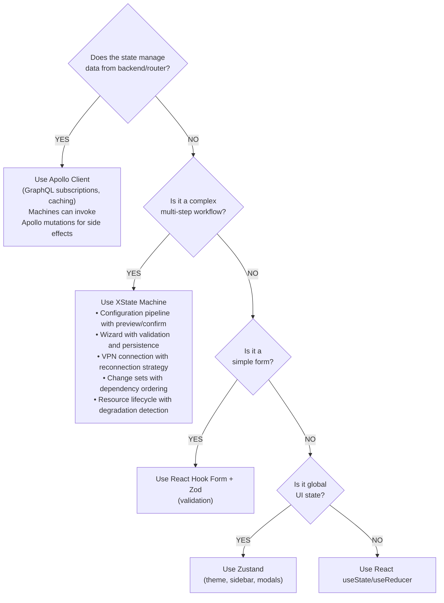

# XState Machines Overview

**XState v5** is a robust state management library for orchestrating complex multi-step workflows in NasNetConnect. This overview catalogs all available machines, the factory pattern used to create them, and when to use XState versus other state management tools.

**Source:** `libs/state/machines/src/`

## Machine Catalog

NasNetConnect provides **5 core XState machines** for different use cases:

| Machine | Purpose | States | Key Features |
|---------|---------|--------|--------------|
| **Wizard Machine** | Multi-step form wizards with validation and session recovery | `step`, `validating`, `submitting`, `completed`, `cancelled` | Step navigation, async validation, localStorage persistence |
| **Config Pipeline Machine** | Safety-first configuration changes with preview and rollback | 12 states: `idle`, `draft`, `validating`, `invalid`, `previewing`, `confirming`, `applying`, `verifying`, `active`, `rollback`, `rolled_back`, `error` | Validation pipeline, diff preview, high-risk acknowledgment, auto-rollback on failure |
| **Resource Lifecycle Machine** | Universal State v2 resource management (apply, verify, degrade, archive) | 9 states: `draft`, `validating`, `valid`, `applying`, `active`, `degraded`, `error`, `deprecated`, `archived` | Async validation, apply with rollback, degradation detection, sync from router |
| **Change Set Machine** | Atomic multi-resource operations with dependency-ordered apply | 10 states: `idle`, `validating`, `ready`, `applying` (with sub-states), `completed`, `rollingBack`, `rolledBack`, `failed`, `partialFailure`, `cancelled` | Topological sort, progress tracking, reverse-order rollback, partial failure handling |
| **VPN Connection Machine** | VPN lifecycle management (connect, disconnect, reconnect with backoff) | 6 states: `disconnected`, `connecting`, `connected`, `reconnecting`, `disconnecting`, `error` | Connection timeout, exponential backoff reconnection, metrics collection, graceful disconnect |

## Factory Pattern

All machines use **XState's `setup()` factory pattern** for type-safe, composable state machines:

```typescript
// 1. Define types
interface MyContext {
  data: string;
  error: string | null;
}

type MyEvent =
  | { type: 'LOAD'; data: string }
  | { type: 'RESET' };

// 2. Create machine with setup()
const myMachine = setup({
  types: {} as {
    context: MyContext;
    events: MyEvent;
  },
  actors: {
    loadData: fromPromise<string, string>(async ({ input }) => {
      return await fetchData(input);
    }),
  },
  guards: {
    hasData: ({ context }) => context.data.length > 0,
  },
  actions: {
    setData: assign({ data: ({ event }) => event.type === 'LOAD' ? event.data : '' }),
  },
}).createMachine({
  id: 'myMachine',
  initial: 'idle',
  context: { data: '', error: null },
  states: {
    idle: {
      on: { LOAD: { target: 'loading', actions: 'setData' } },
    },
    // ... more states
  },
});
```

**Key benefits:**
- **Type-safe:** Full TypeScript support for context, events, and guards
- **Composable:** Actors (async operations) are invoked with input and type-checked
- **Testable:** Pure state transitions, no side effects in state definitions
- **Reusable:** Create multiple instances of the same machine with different inputs

## State Management Decision Tree

Use this decision tree to choose the right tool for your state management needs:



**Real-world examples:**

- **Config Pipeline:** User edits WireGuard settings → validates → previews changes → confirms → applies → verifies → auto-rollback on failure ✓ **Use XState**
- **Wizard:** Multi-step VPN setup with per-step validation and session recovery ✓ **Use XState**
- **User Login Form:** Simple email/password form ✓ **Use React Hook Form + Zod**
- **Theme Toggle:** Global dark/light mode state ✓ **Use Zustand**
- **Fetch Router Configs:** Get router interface list from API ✓ **Use Apollo Client**

## Actor Model Basics

XState v5 uses an **actor model** where machines are actors that:

1. **Receive events** from the outside world
2. **Update internal state** based on guards and actions
3. **Invoke async operations** (actors) for side effects
4. **Emit new events** based on actor results

### Invoking Async Operations (Actors)

```typescript
const machine = setup({
  actors: {
    // Async operation that returns data
    fetchData: fromPromise<DataType, InputType>(
      async ({ input }) => {
        const response = await api.getData(input);
        return response; // Auto-resolves to onDone
      }
    ),
  },
}).createMachine({
  // ... setup ...
  states: {
    fetching: {
      invoke: {
        src: 'fetchData',
        input: ({ context }) => context.resourceId,
        onDone: {
          target: 'success',
          actions: assign({ data: ({ event }) => event.output }),
        },
        onError: {
          target: 'error',
          actions: assign({ error: ({ event }) => event.error.message }),
        },
      },
    },
  },
});
```

### Emitting Events

```typescript
const machine = setup({
  types: {} as {
    emitted: { type: 'updated'; value: number };
  },
  actions: {
    notifyUpdate: emit(({ context }) => ({
      type: 'updated' as const,
      value: context.count,
    })),
  },
}).createMachine({
  states: {
    active: {
      entry: 'notifyUpdate', // Emits 'updated' event
    },
  },
});

// Listen to emitted events
const actor = createActor(machine).start();
actor.subscribe((snapshot) => {
  if (snapshot.event?.type === 'updated') {
    console.log('Machine emitted:', snapshot.event.value);
  }
});
```

## Import Paths and Barrel Exports

All machine utilities are exported from `@nasnet/state/machines`:

```typescript
// Machines (factories)
import {
  createWizardMachine,
  createConfigPipelineMachine,
  createResourceLifecycleMachine,
  createChangeSetMachine,
  createVPNConnectionMachine,
} from '@nasnet/state/machines';

// Hooks (React convenience wrappers)
import {
  useWizard,
  useWizardSession,
  useConfigPipeline,
  useQuickConfigPipeline,
  useResourceLifecycle,
  useResourceLifecycleWithApollo,
} from '@nasnet/state/machines';

// Persistence utilities
import {
  persistMachineState,
  restoreMachineState,
  clearMachineState,
  hasSavedSession,
  getSessionAge,
  formatSessionAge,
  cleanupStaleSessions,
  STORAGE_KEY_PREFIX,
  SESSION_TIMEOUT_MS,
} from '@nasnet/state/machines';

// Types
import type {
  WizardContext,
  WizardEvent,
  WizardConfig,
  ConfigPipelineContext,
  ConfigPipelineEvent,
  ConfigDiff,
  ValidationError,
  ResourceLifecycleContext,
  ResourceLifecycleEvent,
  ChangeSetMachineContext,
  ChangeSetProgressEvent,
  VPNConnectionContext,
  VPNConnectionEvent,
  ConnectionMetrics,
  PersistedMachineState,
} from '@nasnet/state/machines';
```

## Debugging XState

### XState Inspector

The XState Inspector provides real-time visualization of state transitions:

```bash
# Install
npm install @xstate/inspect

# In your code
import { inspect } from '@xstate/inspect';

inspect({
  url: 'https://stately.ai/viz',
});

const actor = createActor(myMachine).start();
```

Visit **https://stately.ai/viz** to see live state transitions.

### Console Logging

```typescript
// Log all transitions
actor.subscribe((snapshot) => {
  console.log('State:', snapshot.value);
  console.log('Context:', snapshot.context);
  console.log('Event:', snapshot.event);
});
```

### Devtools Integration

For React components, use `@xstate/react` with browser devtools:

```tsx
import { useMachine } from '@xstate/react';

function MyComponent() {
  const [state, send] = useMachine(myMachine, {
    // Enable logging in development
    devTools: process.env.NODE_ENV === 'development',
  });

  return <div>{/* ... */}</div>;
}
```

## Common Patterns

### Error Handling and Retry

```typescript
const machine = setup({
  actors: {
    riskyOperation: fromPromise<Result, Input>(
      async ({ input }) => {
        try {
          return await operation(input);
        } catch (error) {
          throw new Error(`Operation failed: ${error.message}`);
        }
      }
    ),
  },
}).createMachine({
  states: {
    executing: {
      invoke: {
        src: 'riskyOperation',
        input: ({ context }) => context.input,
        onError: 'error',
      },
    },
    error: {
      on: {
        RETRY: 'executing',
        RESET: 'idle',
      },
    },
  },
});
```

### Timeout Handling

```typescript
const machine = setup({
  delays: {
    TIMEOUT: 5000, // 5 seconds
  },
}).createMachine({
  states: {
    loading: {
      invoke: {
        src: 'fetchData',
        onDone: 'success',
        onError: 'error',
      },
      after: {
        TIMEOUT: 'timedOut',
      },
    },
    timedOut: {
      type: 'final',
    },
  },
});
```

### Concurrent Operations

```typescript
type ProcessStatus = 'pending' | 'running' | 'success' | 'error' | 'cancelled';

interface ConcurrentProcess {
  id: string;
  name: string;
  status: ProcessStatus;
  progress: number;
  error?: string;
}

// Context holds array of processes
interface Context {
  processes: ConcurrentProcess[];
}

// Can spawn multiple actor instances, each tracking one process
```

## Performance Considerations

1. **Machine Creation:** Create machines once (in `useMemo`) and reuse instances
2. **Context Size:** Keep context minimal; don't store large objects
3. **Event Queue:** XState batches events - no need to debounce
4. **Memory:** Machines automatically clean up actors on state exit

## Related Documentation

- **Config Pipeline Deep Dive:** See `config-pipeline.md` for safety flow details
- **Resource Lifecycle:** See `resource-lifecycle.md` for Universal State v2 integration
- **Change Sets:** See `change-set-machine.md` for atomic operations
- **Wizard Pattern:** See `wizard.md` for multi-step form implementation
- **VPN Lifecycle:** See `vpn-connection.md` for connection management example
- **Persistence:** See `persistence.md` for localStorage recovery

## Quick Reference

| Need | See |
|------|-----|
| Multi-step wizard | `wizard.md` + `useWizard()` hook |
| Config changes with validation | `config-pipeline.md` + `useConfigPipeline()` hook |
| Resource CRUD lifecycle | `resource-lifecycle.md` + `useResourceLifecycle()` hook |
| Multi-resource atomic operations | `change-set-machine.md` + `createChangeSetMachine()` |
| VPN connect/disconnect | `vpn-connection.md` + `useVPNConnection()` hook |
| Save wizard progress | `persistence.md` + `persistMachineState()` |
| Real-time state updates | Emit events with `emit()` action |
| Async API calls | Invoke actors with `fromPromise()` |
