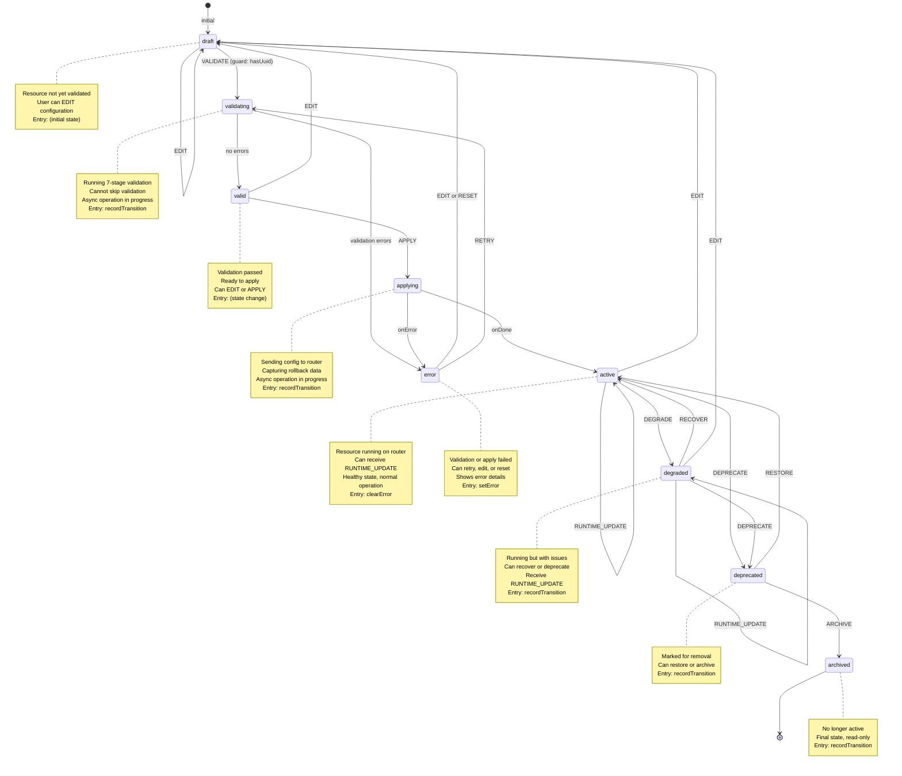

# Resource Lifecycle Machine (Universal State v2)

The **Resource Lifecycle Machine** implements the **9-state Universal State v2 lifecycle** for managing individual resources (WireGuard clients, VPNs, DNS services, etc.). It handles validation, application, degradation detection, and archival with proper rollback mechanics.

**Source:** `libs/state/machines/src/resourceLifecycleMachine.ts`
**Hook:** `libs/state/machines/src/hooks/useResourceLifecycle.ts`

## Complete State Chart



## 9 Lifecycle States

| State | Purpose | Key Features | Transitions |
|-------|---------|--------------|-------------|
| **draft** | Initial creation or edit mode | Not yet validated, user editable | EDIT (stay), VALIDATE → validating |
| **validating** | Running validation pipeline | 7-stage validation, async, read-only | onDone → error\|valid, onError → error |
| **valid** | Passed validation, ready to apply | Valid configuration, can apply | APPLY → applying, EDIT → draft |
| **applying** | Being applied to router | Async operation, capturing rollback | onDone → active, onError → error |
| **active** | Successfully running on router | Healthy state, normal operation | EDIT → draft, DEGRADE → degraded, DEPRECATE → deprecated, SYNC → syncing, RUNTIME_UPDATE |
| **degraded** | Running but with issues | Has problems, can recover | RUNTIME_UPDATE, RECOVER → active, DEPRECATE → deprecated, EDIT → draft |
| **error** | Failed validation or apply | Validation/apply error, can retry | RETRY → validating, EDIT → draft, RESET |
| **deprecated** | Marked for removal | Awaiting archive decision | RESTORE → active, ARCHIVE → archived |
| **archived** | No longer active | Final state, read-only | (no transitions) |

Plus **syncing** (transient state for router sync).

## Complete State Reference

```typescript
export type ResourceLifecycleStateValue =
  | 'draft'
  | 'validating'
  | 'valid'
  | 'applying'
  | 'active'
  | 'degraded'
  | 'error'
  | 'deprecated'
  | 'archived'
  | 'syncing';
```

## Context

```typescript
interface ResourceLifecycleContext<TConfig = unknown> {
  /** Resource UUID from database */
  uuid: string | null;

  /** Router ID this resource belongs to */
  routerId: string | null;

  /** Resource type (e.g., 'wireguard-client') */
  resourceType: string | null;

  /** Current configuration (what's on the router) */
  configuration: TConfig | null;

  /** Pending configuration (being edited) */
  pendingConfiguration: TConfig | null;

  /** Validation result from last validation */
  validationResult: ValidationResult | null;

  /** Current runtime state from router */
  runtime: RuntimeState | null;

  /** Error message if in error state */
  errorMessage: string | null;

  /** Error code for programmatic handling */
  errorCode: string | null;

  /** Rollback data for recovery */
  rollbackData: TConfig | null;

  /** Timestamp of last state change */
  lastTransitionAt: number | null;

  /** Number of apply retries */
  retryCount: number;

  /** Maximum retries before giving up */
  maxRetries: number;

  /** Degradation reason if degraded */
  degradationReason: string | null;
}
```

## Events

```typescript
export type ResourceLifecycleEvent<TConfig = unknown> =
  | { type: 'EDIT'; configuration: TConfig }    // Edit configuration
  | { type: 'VALIDATE' }                         // Trigger validation
  | { type: 'VALIDATION_SUCCESS'; result: ValidationResult }
  | { type: 'VALIDATION_FAILURE'; result: ValidationResult }
  | { type: 'APPLY'; force?: boolean }           // Apply to router
  | { type: 'APPLY_SUCCESS'; generatedFields?: Record<string, unknown> }
  | { type: 'APPLY_FAILURE'; error: string; code?: string }
  | { type: 'RUNTIME_UPDATE'; runtime: RuntimeState }  // From subscription
  | { type: 'DEGRADE'; reason: string }          // Mark as degraded
  | { type: 'RECOVER' }                          // Recover from degraded
  | { type: 'DEPRECATE' }                        // Mark for removal
  | { type: 'RESTORE' }                          // Undo deprecation
  | { type: 'ARCHIVE' }                          // Move to archived
  | { type: 'RETRY' }                            // Retry failed operation
  | { type: 'RESET' }                            // Reset to draft
  | { type: 'SYNC' }                             // Sync from router
  | { type: 'SYNC_COMPLETE'; configuration: TConfig };
```

## Guards

```typescript
{
  hasValidationErrors: boolean;      // validationResult.errors.length > 0
  noValidationErrors: boolean;       // no validation errors
  canApply: boolean;                 // validationResult.canApply && no errors
  canRetry: boolean;                 // retryCount < maxRetries
  hasRollbackData: boolean;          // rollbackData !== null
  isHealthy: boolean;                // runtime.health === 'HEALTHY'
  isDegraded: boolean;               // runtime.health in ['DEGRADED', 'CRITICAL']
  hasUuid: boolean;                  // uuid !== null (required for validate)
}
```

## Actions

```typescript
{
  updateConfiguration();            // Set pending config from EDIT
  setValidationResult();             // Store validation result
  setRollbackData();                 // Store rollback data from apply
  updateRuntime();                   // Update runtime state from subscription
  setError();                        // Store error message and code
  clearError();                      // Clear error state
  setDegradation();                  // Mark as degraded with reason
  clearDegradation();                // Clear degradation
  incrementRetry();                  // Increment retry count
  resetRetry();                      // Reset retry count to 0
  recordTransition();                // Timestamp state change
  applyGeneratedFields();            // Merge generated fields into config
  syncConfiguration();               // Update from sync result
  notifyStateChange();               // Emit state change event
  notifyError();                     // Callback on error
  resetContext();                    // Clear all pending state
}
```

## Actors

```typescript
actors: {
  validateResource(uuid: string): Promise<ValidationResult>;

  applyResource(uuid: string, force?: boolean): Promise<{
    rollbackData: TConfig;
    generatedFields?: Record<string, unknown>;
  }>;

  syncResource(uuid: string): Promise<TConfig>;

  executeRollback(uuid: string, rollbackData: TConfig): Promise<void>;
}
```

## Integration with Universal State v2

The **8-layer resource model** maps to machine states:

```
Layer 1: Metadata          → resourceType, uuid, routerId
Layer 2: Configuration     → configuration (current), pendingConfiguration
Layer 3: Validation        → validationResult, status (draft/validating/valid)
Layer 4: Applied State     → active/degraded/error (runtime status)
Layer 5: Derived Data      → generated fields (computed on apply)
Layer 6: Lifecycle         → deprecated/archived states
Layer 7: Relationships     → routerId (parent router)
Layer 8: Audit Trail       → lastTransitionAt, retryCount
```

## State Predicates

Helper functions for conditional UI rendering:

```typescript
import {
  isResourcePending,      // validating | applying | syncing
  isResourceActive,       // active | degraded
  isResourceEditable,     // draft | valid | active | degraded | error
  isResourceAppliable,    // state === 'valid'
  isResourceTerminal,     // state === 'archived'
  getResourceStateDisplayInfo,
} from '@nasnet/state/machines';

// Returns: { label, description, color, showSpinner }
const info = getResourceStateDisplayInfo(state);
```

## Display Info Colors

```typescript
{
  draft: { color: 'gray', label: 'Draft', showSpinner: false },
  validating: { color: 'blue', label: 'Validating', showSpinner: true },
  valid: { color: 'green', label: 'Valid', showSpinner: false },
  applying: { color: 'amber', label: 'Applying', showSpinner: true },
  active: { color: 'green', label: 'Active', showSpinner: false },
  degraded: { color: 'amber', label: 'Degraded', showSpinner: false },
  error: { color: 'red', label: 'Error', showSpinner: false },
  deprecated: { color: 'gray', label: 'Deprecated', showSpinner: false },
  archived: { color: 'gray', label: 'Archived', showSpinner: false },
  syncing: { color: 'blue', label: 'Syncing', showSpinner: true },
}
```

## Usage with `useResourceLifecycle` Hook

```tsx
import { useResourceLifecycle } from '@nasnet/state/machines';

function WireGuardResourceDetail({ resource }: Props) {
  const {
    state,
    context,
    displayInfo,
    isPending,
    isActive,
    isEditable,
    isAppliable,
    validationErrors,
    edit,
    validate,
    apply,
    updateRuntime,
    degrade,
    deprecate,
    sync,
  } = useResourceLifecycle<WireGuardConfig>({
    initialResource: resource,
    validateResource: async (uuid) => {
      const response = await api.validateWireGuardResource(uuid);
      return response.data.validation;
    },
    applyResource: async (uuid, force) => {
      const backup = await api.getBackup(uuid);
      await api.applyWireGuardResource(uuid, { force });
      return { rollbackData: backup };
    },
    syncResource: async (uuid) => {
      const response = await api.syncWireGuardResource(uuid);
      return response.data.configuration;
    },
    onStateChange: (newState, ctx) => {
      console.log(`Resource ${ctx.uuid} transitioned to ${newState}`);
    },
  });

  // Setup runtime subscription
  useEffect(() => {
    const subscription = subscribeToResourceRuntime(resource.uuid, (runtime) => {
      updateRuntime(runtime);
    });
    return () => subscription.unsubscribe();
  }, [resource.uuid]);

  return (
    <div>
      {/* Status badge */}
      <StatusBadge
        status={displayInfo.color}
        label={displayInfo.label}
        showSpinner={displayInfo.showSpinner}
      />

      {/* Validation errors */}
      {validationErrors.length > 0 && (
        <ErrorList errors={validationErrors} />
      )}

      {/* Config form */}
      <ConfigForm
        config={context.configuration}
        disabled={isPending}
        onSave={(config) => {
          edit(config);
          validate();
        }}
      />

      {/* Action buttons */}
      {isAppliable && (
        <Button onClick={() => apply()} disabled={isPending}>
          Apply
        </Button>
      )}
      {isActive && (
        <Button onClick={() => deprecate()}>
          Deprecate
        </Button>
      )}
      {isActive && (
        <Button onClick={() => sync()} disabled={isPending}>
          Sync from Router
        </Button>
      )}
    </div>
  );
}
```

## Code Examples

### Create Machine

```typescript
import { createResourceLifecycleMachine } from '@nasnet/state/machines';

const wireguardMachine = createResourceLifecycleMachine<WireGuardConfig>({
  id: 'wireguard-lifecycle',
  initialResource: {
    uuid: 'wg-001',
    type: 'wireguard-client',
    configuration: {
      privateKey: '...',
      publicKey: '...',
      listenPort: 51820,
    },
  },
  validateResource: async (uuid) => {
    const response = await api.validateWireGuard(uuid);
    return {
      canApply: response.valid,
      errors: response.errors || [],
      warnings: response.warnings || [],
    };
  },
  applyResource: async (uuid) => {
    const previous = await api.getWireGuardBackup(uuid);
    await api.applyWireGuard(uuid);
    return { rollbackData: previous };
  },
  syncResource: async (uuid) => {
    const response = await api.getWireGuardConfig(uuid);
    return response.data.configuration;
  },
  onStateChange: (state, context) => {
    console.log(`WireGuard ${context.uuid}: ${state}`);
  },
});
```

### Degradation Handling

```tsx
useEffect(() => {
  // Subscribe to router health updates
  const unsubscribe = subscribeToHealth(resource.routerId, (health) => {
    if (health.resources[resource.uuid]?.status === 'unhealthy') {
      degrade(`CPU usage above 90%`);
    } else if (state === 'degraded') {
      recover();
    }
  });
  return unsubscribe;
}, [resource.uuid]);
```

### Retry with Exponential Backoff

```typescript
const machine = createResourceLifecycleMachine({
  // ... config ...
  maxRetries: 3,  // 3 attempts
});

// Manual retry with backoff
let retryDelay = 1000;
const retryWithBackoff = () => {
  setTimeout(() => {
    send({ type: 'RETRY' });
    retryDelay *= 2;  // Exponential backoff
  }, retryDelay);
};
```

## Comparing States

| State | Editable | Validated | On Router | Can Apply |
|-------|----------|-----------|-----------|-----------|
| draft | ✓ | ✗ | ✗ | ✗ |
| valid | ✗ | ✓ | ✗ | ✓ |
| applying | ✗ | ✓ | ⏳ | ✗ |
| active | ✓ | ✓ | ✓ | ✗ |
| degraded | ✓ | ✓ | ✓ | ✗ |
| error | ✓ | ✗ | ✗ | ✗ |
| deprecated | ✓ | ✓ | ✓ | ✗ |
| archived | ✗ | ✓ | ✗ | ✗ |

## Related Documentation

- **Overview:** See `overview.md` for machine catalog
- **Config Pipeline:** See `config-pipeline.md` for configuration change safety flow
- **Change Sets:** See `change-set-machine.md` for multi-resource atomic operations
- **Persistence:** See `persistence.md` for state recovery
