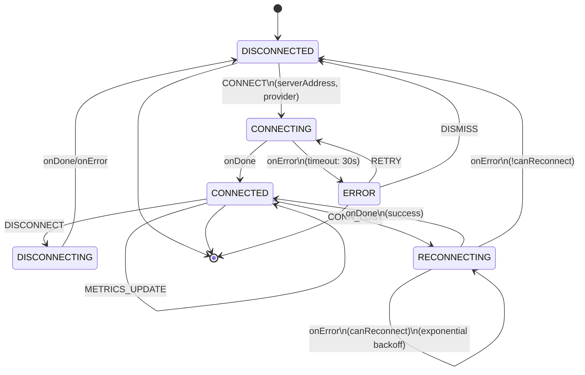

# VPN Connection Machine (Feature Example)

The **VPN Connection Machine** demonstrates a practical XState machine for VPN lifecycle management. It handles connection, disconnection, automatic reconnection with exponential backoff, and real-time metrics collection.

This is an **example implementation** showing how to build feature-specific machines. In a real project, this would be located in `libs/features/vpn/src/machines/`.

**Source:** `libs/state/machines/src/vpnConnectionMachine.ts`
**Hook:** `libs/state/machines/src/vpnConnectionMachine.ts` (exported as `useVPNConnection`)

## Complete State Chart



## States Reference

| State | Purpose | Duration | Transitions |
|-------|---------|----------|---|
| **disconnected** | Not connected to VPN | Indefinite | CONNECT → connecting |
| **connecting** | Establishing VPN connection | 30s timeout | onDone → connected, onError/timeout → error |
| **connected** | Active VPN connection | Indefinite | DISCONNECT → disconnecting, METRICS_UPDATE (stay), CONNECTION_LOST → reconnecting |
| **reconnecting** | Attempting to reconnect | 10s timeout + backoff | onDone → connected, onError (retry or give up) |
| **disconnecting** | Gracefully closing connection | 5-10s | onDone/onError → disconnected |
| **error** | Connection error | Indefinite | RETRY → connecting, DISMISS → disconnected |

## Context

```typescript
interface VPNConnectionContext {
  /** Connection ID (if connected) */
  connectionId: string | null;

  /** VPN provider name (wireguard, openvpn, etc.) */
  provider: string | null;

  /** Server address */
  serverAddress: string | null;

  /** Real-time connection metrics */
  metrics: ConnectionMetrics | null;

  /** Error message if in error state */
  error: string | null;

  /** Reconnection attempt count */
  reconnectAttempts: number;

  /** Maximum reconnection attempts before giving up */
  maxReconnectAttempts: number;
}

interface ConnectionMetrics {
  uploadSpeed: number;              // bytes/sec
  downloadSpeed: number;            // bytes/sec
  bytesUploaded: number;
  bytesDownloaded: number;
  latencyMs: number;
  uptimeSeconds: number;
  serverLocation?: string;
}
```

## Events

```typescript
type VPNConnectionEvent =
  | { type: 'CONNECT'; serverAddress: string; provider: string }
  | { type: 'DISCONNECT' }
  | { type: 'METRICS_UPDATE'; metrics: ConnectionMetrics }
  | { type: 'CONNECTION_LOST' }
  | { type: 'RETRY' }
  | { type: 'DISMISS' };
```

## Guards

```typescript
{
  canReconnect: boolean;    // reconnectAttempts < maxReconnectAttempts
  hasConnectionId: boolean; // connectionId !== null
}
```

## Configuration

```typescript
interface VPNConnectionServices {
  /** Establish VPN connection */
  establishConnection: (params: {
    serverAddress: string;
    provider: string;
    attempt?: number;
  }) => Promise<{ connectionId: string }>;

  /** Attempt to reconnect */
  attemptReconnect: (params: {
    serverAddress: string;
    provider: string;
    attempt?: number;
  }) => Promise<{ connectionId: string }>;

  /** Close VPN connection */
  closeConnection: (connectionId: string) => Promise<void>;
}
```

## Constants

```typescript
const CONNECTION_TIMEOUT_MS = 30000;       // 30 seconds to establish
const RECONNECTION_TIMEOUT_MS = 10000;     // 10 seconds per reconnect attempt
const MAX_RECONNECT_ATTEMPTS = 3;          // Try up to 3 times
const BACKOFF_BASE_MS = 1000;              // 1s, 2s, 4s, 8s...
```

## Usage with `useVPNConnection` Hook

```tsx
import { useVPNConnection } from '@nasnet/state/machines';

function VPNStatus() {
  const vpn = useVPNConnection({
    establishConnection: async ({ serverAddress, provider }) => {
      const response = await api.connectVPN(serverAddress, provider);
      return { connectionId: response.id };
    },
    attemptReconnect: async ({ serverAddress, provider, attempt }) => {
      const response = await api.reconnectVPN(serverAddress, provider);
      return { connectionId: response.id };
    },
    closeConnection: async (connectionId) => {
      await api.disconnectVPN(connectionId);
    },
  });

  // Subscribe to metrics updates
  useEffect(() => {
    if (!vpn.isConnected) return;

    const interval = setInterval(() => {
      const metrics = getMetrics(vpn.connectionId!);
      vpn.updateMetrics(metrics);
    }, 1000);

    return () => clearInterval(interval);
  }, [vpn.isConnected, vpn.connectionId]);

  // Subscribe to connection status
  useEffect(() => {
    if (!vpn.isConnected) return;

    const unsubscribe = subscribeToConnectionStatus(
      vpn.connectionId!,
      (status) => {
        if (status === 'lost') {
          vpn.reportConnectionLost();
        }
      }
    );

    return unsubscribe;
  }, [vpn.isConnected, vpn.connectionId]);

  return (
    <div className="vpn-status">
      <StatusBadge
        status={vpn.state}
        label={vpn.isConnected ? 'Connected' : 'Disconnected'}
        spinner={vpn.isConnecting}
      />

      {vpn.isConnected && vpn.metrics && (
        <MetricsDisplay
          uploadSpeed={vpn.metrics.uploadSpeed}
          downloadSpeed={vpn.metrics.downloadSpeed}
          latency={vpn.metrics.latencyMs}
          uptime={vpn.metrics.uptimeSeconds}
          location={vpn.metrics.serverLocation}
        />
      )}

      {vpn.isError && (
        <ErrorPanel
          error={vpn.error}
          attempts={vpn.reconnectAttempts}
          maxAttempts={3}
          onRetry={vpn.retry}
          onDismiss={vpn.dismissError}
        />
      )}

      <VPNControls
        onConnect={() =>
          vpn.connect('vpn.example.com', 'wireguard')
        }
        onDisconnect={vpn.disconnect}
        disabled={vpn.isConnecting}
        connected={vpn.isConnected}
      />
    </div>
  );
}
```

## Hook Return Type

```typescript
interface UseVPNConnectionReturn {
  // State
  state: 'disconnected' | 'connecting' | 'connected' | 'reconnecting' | 'disconnecting' | 'error';
  connectionId: string | null;
  provider: string | null;
  serverAddress: string | null;
  metrics: ConnectionMetrics | null;
  error: string | null;
  reconnectAttempts: number;

  // Predicates
  isConnected: boolean;
  isConnecting: boolean;
  isError: boolean;

  // Actions
  connect: (serverAddress: string, provider: string) => void;
  disconnect: () => void;
  retry: () => void;
  dismissError: () => void;
  updateMetrics: (metrics: ConnectionMetrics) => void;
  reportConnectionLost: () => void;
}
```

## Code Examples

### Connect to VPN

```tsx
const handleConnect = () => {
  vpn.connect('vpn.example.com', 'wireguard');
  // Transitions: disconnected → connecting
  // After 30s: → connected (on success) or error (on failure)
};
```

### Automatic Reconnection with Backoff

```
Attempt 1: delay = 1000ms (1s)
├─ After delay, invoke attemptReconnect
├─ If fails and attempts < 3 → Attempt 2

Attempt 2: delay = 2000ms (2s)
├─ After delay, invoke attemptReconnect
├─ If fails and attempts < 3 → Attempt 3

Attempt 3: delay = 4000ms (4s)
├─ After delay, invoke attemptReconnect
├─ If fails → Give up, transition to disconnected
```

### Real-time Metrics

```tsx
// Metrics update while connected (every 1s)
useEffect(() => {
  if (!vpn.isConnected) return;

  const updateMetrics = async () => {
    const metrics = await api.getVPNMetrics();
    vpn.updateMetrics({
      uploadSpeed: metrics.upload_bps,
      downloadSpeed: metrics.download_bps,
      bytesUploaded: metrics.bytes_sent,
      bytesDownloaded: metrics.bytes_recv,
      latencyMs: metrics.ping_ms,
      uptimeSeconds: metrics.uptime_s,
      serverLocation: metrics.location,
    });
  };

  const interval = setInterval(updateMetrics, 1000);
  return () => clearInterval(interval);
}, [vpn.isConnected]);

// Display metrics
{vpn.isConnected && (
  <MetricsPanel
    download={`${(vpn.metrics.downloadSpeed / 1e6).toFixed(1)} Mbps`}
    upload={`${(vpn.metrics.uploadSpeed / 1e6).toFixed(1)} Mbps`}
    latency={`${vpn.metrics.latencyMs} ms`}
  />
)}
```

### Handle Connection Loss with Auto-Reconnect

```tsx
// Subscribe to connection health
useEffect(() => {
  if (!vpn.isConnected) return;

  const unsubscribe = vpnService.onConnectionStatus(
    vpn.connectionId!,
    (status) => {
      if (status.type === 'connection_lost') {
        // Trigger reconnection with backoff
        vpn.reportConnectionLost();
        // Transitions: connected → reconnecting
        // Auto-attempts up to 3 times with exponential backoff
      }
    }
  );

  return unsubscribe;
}, [vpn.isConnected]);
```

## Error Scenarios

### Scenario 1: Connection Timeout
```
User clicks Connect
→ CONNECTING (30s timeout)
→ Server doesn't respond
→ ERROR (timeout error)
→ User can RETRY or DISMISS
```

### Scenario 2: Connection Lost (Auto-Reconnect)
```
CONNECTED (stable for 60s)
→ Connection drops (router restart, network issue)
→ CONNECTION_LOST event
→ RECONNECTING (backoff 1s)
  → Failed, retry
→ RECONNECTING (backoff 2s)
  → Failed, retry
→ RECONNECTING (backoff 4s)
  → Succeeded!
→ CONNECTED (reset attempts)
```

### Scenario 3: Max Reconnect Attempts Exceeded
```
CONNECTED
→ CONNECTION_LOST
→ RECONNECTING (attempt 1) → fail
→ RECONNECTING (attempt 2) → fail
→ RECONNECTING (attempt 3) → fail
→ canReconnect guard fails
→ DISCONNECTED (give up)
```

## Comparing with Other State Management

| Aspect | VPN Machine | Zustand Store | Apollo Client |
|--------|------------|---------------|---------------|
| **State** | connection + metrics | ✓ Can store | N/A |
| **Async Operations** | Built-in (actors) | Need middleware | Built-in (mutations) |
| **Auto-Reconnect** | ✓ Built-in backoff | Manual logic | N/A |
| **Metrics Updates** | Real-time | Manual updates | Subscriptions |
| **Persistence** | Via persistence.ts | Built-in | N/A |
| **Use Case** | VPN connection lifecycle | Global UI state | Backend data sync |

## Building Your Own Feature Machine

This VPN example shows the pattern for building feature-specific machines:

1. **Define Context** - What data does this feature hold?
2. **Define Events** - What can the user/system do?
3. **Define States** - What states can the feature be in?
4. **Define Transitions** - How do events move between states?
5. **Define Actors** - What async operations are needed?
6. **Create Hook** - Wrap machine in a React hook for easy use

Apply this pattern to build machines for:
- DNS configuration
- Firewall rules
- Service mesh networking
- Backup/restore operations

## Related Documentation

- **Overview:** See `overview.md` for machine catalog and factory pattern
- **Persistence:** See `persistence.md` for saving connection state
- **Hooks Pattern:** See `wizard.md` for useWizard hook pattern (similar structure)
