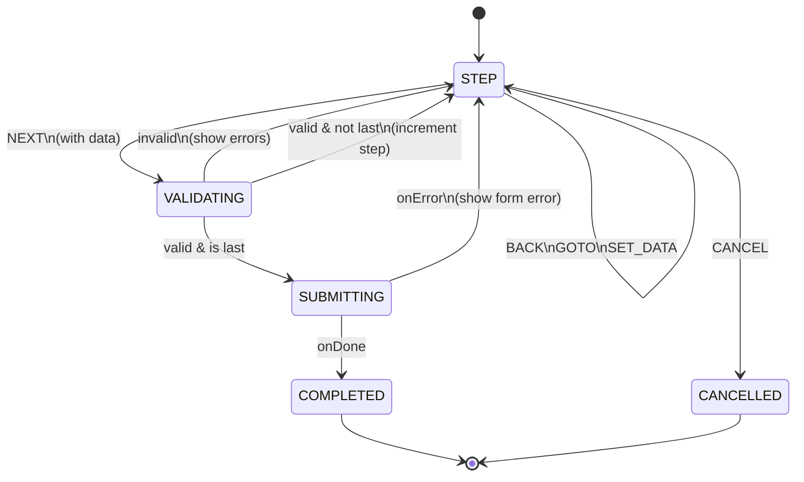

# Wizard Machine (Multi-Step Flows)

The **Wizard Machine** provides a reusable pattern for multi-step form wizards with per-step
validation, session persistence, and recovery. It's ideal for complex setup flows like VPN
configuration, device pairing, or service installation.

**Source:** `libs/state/machines/src/wizardMachine.ts` **Hook:**
`libs/state/machines/src/hooks/useWizard.ts`

## Complete State Chart



## States Reference

| State          | Purpose                      | Transitions                                                                                                                                 |
| -------------- | ---------------------------- | ------------------------------------------------------------------------------------------------------------------------------------------- |
| **step**       | Active wizard step           | NEXT → validating (with step data), BACK → decrementStep, GOTO → goToStep (if allowed), SET_DATA (stay), CANCEL → cancelled, RESTORE        |
| **validating** | Running step validation      | onDone (valid & last) → submitting, onDone (valid & not last) → step (incrementStep), onDone (invalid) → step (show errors), onError → step |
| **submitting** | Executing wizard onSubmit    | onDone → completed, onError → step (show form error)                                                                                        |
| **completed**  | Wizard finished successfully | (Terminal - no transitions)                                                                                                                 |
| **cancelled**  | Wizard cancelled by user     | (Terminal - no transitions)                                                                                                                 |

## Context

```typescript
interface WizardContext<TData = Record<string, unknown>> {
  /** Current step number (1-indexed) */
  currentStep: number;

  /** Total number of steps in the wizard */
  totalSteps: number;

  /** Collected wizard data (partial until completion) */
  data: Partial<TData>;

  /** Validation errors by field name */
  errors: Record<string, string>;

  /** Unique session ID for persistence */
  sessionId: string;

  /** Whether the wizard can skip to arbitrary steps */
  canSkip?: boolean;
}
```

## Events

```typescript
type WizardEvent<TData = Record<string, unknown>> =
  | { type: 'NEXT'; data?: Partial<TData> } // Advance with data
  | { type: 'BACK' } // Go back
  | { type: 'GOTO'; step: number } // Jump to step
  | { type: 'VALIDATE' } // Manual validation
  | { type: 'SUBMIT' } // Submit (internal)
  | { type: 'CANCEL' } // Cancel wizard
  | { type: 'RESTORE'; savedContext: WizardContext<TData> } // Resume from session
  | { type: 'SET_DATA'; data: Partial<TData> } // Update data without advancing
  | { type: 'CLEAR_ERRORS' }; // Clear validation errors
```

## Guards

```typescript
{
  canGoBack: boolean; // currentStep > 1
  canGoForward: boolean; // currentStep < totalSteps
  isLastStep: boolean; // currentStep === totalSteps
  isNotLastStep: boolean; // currentStep < totalSteps
  canGoToStep: boolean; // targetStep valid and allowed (targetStep <= currentStep or canSkip)
  validationPassed: boolean; // Validation succeeded
}
```

## Actions

```typescript
{
  incrementStep(); // currentStep++, clear errors
  decrementStep(); // currentStep--, clear errors
  goToStep(step); // currentStep = step, clear errors
  mergeData(data); // Merge NEXT/SET_DATA into data
  setValidationErrors(); // Store validation errors from validation result
  clearErrors(); // Clear errors object
  restoreContext(); // Restore saved session (currentStep, data, sessionId)
}
```

## Configuration

```typescript
interface WizardConfig<TData = Record<string, unknown>> {
  /** Unique machine ID */
  id: string;

  /** Total number of steps */
  totalSteps: number;

  /** Step validation function */
  validateStep: (
    step: number,
    data: Partial<TData>
  ) => Promise<{ valid: boolean; errors?: Record<string, string> }>;

  /** Submit handler called when wizard completes */
  onSubmit: (data: TData) => Promise<void>;

  /** Initial data for the wizard (optional) */
  initialData?: Partial<TData>;

  /** Whether to persist wizard state to localStorage @default true */
  persist?: boolean;
}
```

## Usage with `useWizard` Hook

```tsx
import { useWizard } from '@nasnet/state/machines';

interface VPNSetupData {
  provider: 'wireguard' | 'openvpn' | 'ikev2';
  serverAddress: string;
  serverPort: number;
  credentials: {
    username: string;
    password: string;
  };
}

function VPNSetupWizard() {
  const wizard = useWizard<VPNSetupData>(
    {
      id: 'vpn-setup',
      totalSteps: 3,
      validateStep: async (step, data) => {
        if (step === 1 && !data.provider) {
          return {
            valid: false,
            errors: { provider: 'Select a VPN provider' },
          };
        }
        if (step === 2 && !data.serverAddress) {
          return {
            valid: false,
            errors: { serverAddress: 'Server address is required' },
          };
        }
        if (step === 3 && (!data.credentials?.username || !data.credentials?.password)) {
          return {
            valid: false,
            errors: { credentials: 'Username and password required' },
          };
        }
        return { valid: true };
      },
      onSubmit: async (data) => {
        await api.createVPNConnection(data);
      },
    },
    {
      autoPersist: true,
      autoRestore: false, // Show restore prompt
      onComplete: () => {
        toast.success('VPN configured successfully!');
        navigate('/vpn');
      },
      onCancel: () => {
        toast.info('VPN setup cancelled');
      },
    }
  );

  // Show resume prompt if session available
  if (wizard.canRestore) {
    return (
      <ResumePrompt
        age={wizard.savedSessionAge}
        onResume={wizard.restore}
        onDiscard={wizard.discardSession}
      />
    );
  }

  // Render steps
  const renderStep = () => {
    switch (wizard.currentStep) {
      case 1:
        return (
          <ProviderSelection
            selected={wizard.data.provider}
            onSelect={(provider) => wizard.setData({ provider })}
            onNext={(provider) => wizard.next({ provider })}
          />
        );
      case 2:
        return (
          <ServerConfig
            address={wizard.data.serverAddress}
            port={wizard.data.serverPort}
            errors={wizard.errors}
            onNext={(config) => wizard.next(config)}
          />
        );
      case 3:
        return (
          <CredentialsForm
            credentials={wizard.data.credentials}
            errors={wizard.errors}
            onNext={(creds) => wizard.next({ credentials: creds })}
          />
        );
      default:
        return null;
    }
  };

  return (
    <WizardContainer>
      <StepIndicator
        current={wizard.currentStep}
        total={wizard.totalSteps}
        progress={wizard.progress}
      />

      {wizard.isValidating && <LoadingSpinner />}
      {!wizard.isValidating && renderStep()}

      <WizardNavigation
        onBack={wizard.back}
        onNext={() => wizard.next(wizard.data)}
        onCancel={wizard.cancel}
        canGoBack={!wizard.isFirstStep && !wizard.isValidating}
        canGoNext={!wizard.isValidating}
        canCancel={true}
      />
    </WizardContainer>
  );
}
```

## Hook Return Type

```typescript
interface UseWizardReturn<TData> {
  // State
  currentStep: number;
  totalSteps: number;
  data: Partial<TData>;
  errors: Record<string, string>;
  sessionId: string;
  progress: number; // 0-100

  // Status
  isValidating: boolean;
  isSubmitting: boolean;
  isCompleted: boolean;
  isCancelled: boolean;
  isFirstStep: boolean;
  isLastStep: boolean;
  canRestore: boolean;
  savedSessionAge: string | null;

  // Actions
  next: (data?: Partial<TData>) => void;
  back: () => void;
  goToStep: (step: number) => void;
  setData: (data: Partial<TData>) => void;
  clearErrors: () => void;
  cancel: () => void;
  restore: () => void;
  discardSession: () => void;
  canAccessStep: (step: number) => boolean;
}
```

## Code Examples

### Multi-step Device Pairing

```typescript
interface DevicePairingData {
  deviceType: 'router' | 'ap' | 'switch';
  macAddress: string;
  friendlyName: string;
  location: string;
  vlan: number;
}

const pairingWizard = useWizard<DevicePairingData>(
  {
    id: 'device-pairing',
    totalSteps: 4,
    validateStep: async (step, data) => {
      const errors: Record<string, string> = {};

      if (step === 1 && !data.deviceType) {
        errors.deviceType = 'Select device type';
      }
      if (step === 2 && !data.macAddress?.match(/^([0-9A-Fa-f]{2}[:]){5}([0-9A-Fa-f]{2})$/)) {
        errors.macAddress = 'Invalid MAC address format';
      }
      if (step === 3 && !data.friendlyName?.trim()) {
        errors.friendlyName = 'Device name is required';
      }
      if (step === 4 && !data.vlan) {
        errors.vlan = 'VLAN is required';
      }

      return { valid: Object.keys(errors).length === 0, errors };
    },
    onSubmit: async (data) => {
      await api.pairDevice(data);
    },
  },
  { autoPersist: true }
);
```

### Validate Entire Form

```tsx
// Option 1: Validate on each step advance
wizard.next(stepData); // Validation happens automatically

// Option 2: Manual validation (for preview)
const validateAll = async () => {
  for (let step = 1; step <= wizard.totalSteps; step++) {
    const result = await config.validateStep(step, wizard.data);
    if (!result.valid) {
      toast.error(`Step ${step} has validation errors`);
      return false;
    }
  }
  return true;
};
```

### Step-to-Step with Custom Logic

```tsx
function ProviderStep() {
  const wizard = useContext(WizardContext);

  const handleProviderSelect = async (provider: string) => {
    wizard.setData({ provider });

    // If switching providers, fetch available servers
    if (provider !== wizard.data.provider) {
      const servers = await api.getServersForProvider(provider);
      wizard.setData({ availableServers: servers });
    }

    wizard.next({ provider });
  };

  return (
    <ProviderSelector
      onSelect={handleProviderSelect}
      disabled={wizard.isValidating}
    />
  );
}
```

## Session Persistence

The wizard automatically persists state to localStorage:

```typescript
// Storage structure
localStorage['nasnet-machine-vpn-setup'] = JSON.stringify({
  state: 'step',
  context: {
    currentStep: 2,
    totalSteps: 3,
    data: { provider: 'wireguard' /* ... */ },
    errors: {},
    sessionId: 'uuid-123',
  },
  timestamp: 1234567890,
  machineId: 'vpn-setup',
});
```

Session recovery:

```tsx
// Hook detects saved session on mount
if (wizard.canRestore) {
  // Show resume prompt
  return (
    <ResumePrompt
      onResume={wizard.restore} // Resume from step 2
      onDiscard={wizard.discardSession} // Start over
      age={wizard.savedSessionAge} // "2 hours ago"
    />
  );
}
```

## Auto-Skip on Validation

If all steps are pre-validated, wizard can auto-advance:

```typescript
const wizardWithSkip = useWizard(config, {
  autoPersist: true,
});

useEffect(() => {
  // Auto-advance if current step is valid
  if (wizard.data.provider) {
    wizard.next();
  }
}, [wizard.data.provider]);
```

## Comparing Wizard Versions

The library exports two versions:

- **v1 (`createWizardMachine`):** Simpler, direct state management
- **v2 (`createWizardMachineV2`):** Explicit last-step handling (default export)

Both are identical in behavior; v2 is recommended for clarity.

## Related Documentation

- **Overview:** See `overview.md` for machine catalog and decision tree
- **Config Pipeline:** See `config-pipeline.md` for single-resource validation flow
- **Persistence:** See `persistence.md` for session recovery details
- **Hooks:** `useWizard` exports from `@nasnet/state/machines`
