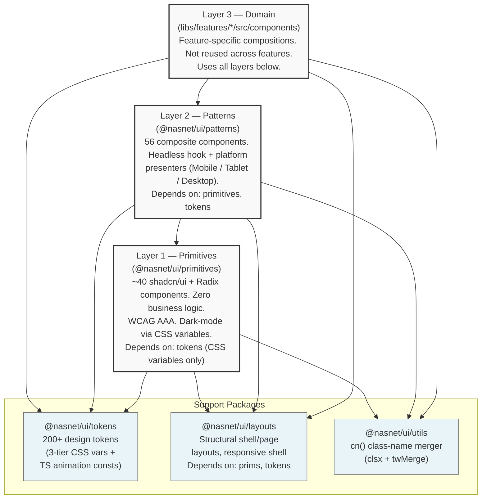
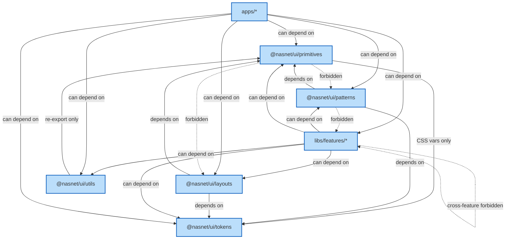

# NasNetConnect UI Library — Developer Reference

`libs/ui/` is the shared component and styling system for NasNetConnect. It is organized as five
focused Nx libraries that form a strict dependency hierarchy. Every component in the application
must originate from or compose these libraries — never from ad-hoc inline implementations.

---

## Three-Layer Architecture



---

## Package Map

| Package              | Nx project      | Import alias            | Storybook port    | Contents                                                                                                                                           |
| -------------------- | --------------- | ----------------------- | ----------------- | -------------------------------------------------------------------------------------------------------------------------------------------------- |
| `libs/ui/primitives` | `ui-primitives` | `@nasnet/ui/primitives` | **4400**          | Button, Card, Input, Dialog, Table, Skeleton, Toast, Badge, Form, Icon, hooks — ~40 exports                                                        |
| `libs/ui/patterns`   | `ui-patterns`   | `@nasnet/ui/patterns`   | **4401**          | StatusBadge, DataTable, StatusIndicator, ConnectionIndicator, ServiceCard, ValidationProgress, ResourceUsageBar, ResourceBudgetPanel, and 50+ more |
| `libs/ui/layouts`    | `ui-layouts`    | `@nasnet/ui/layouts`    | (via ui-patterns) | AppShell, PageContainer, SidebarLayout, ResponsiveShell, BottomNavigation, MobileAppShell, CardLayout, CollapsibleSidebar                          |
| `libs/ui/tokens`     | `ui-tokens`     | `@nasnet/ui/tokens`     | —                 | Animation tokens (TypeScript), CSS custom properties via `@nasnet/ui/tokens/variables.css`                                                         |
| `libs/ui/utils`      | `ui-utils`      | `@nasnet/ui/utils`      | —                 | `cn()` — re-exports the merger from primitives                                                                                                     |

---

## Dependency Rules

These rules are enforced by ESLint `@nx/enforce-module-boundaries`. Violations cause CI failure.



Any component or hook that belongs to a feature must live in `libs/features/<name>/src/`, not inside
`libs/ui/`.

---

## Storybook

```bash
# Primitives — port 4400
npx nx run ui-primitives:storybook

# Patterns — port 4401
npx nx run ui-patterns:storybook

# Build all Storybooks (static output)
npx nx run-many -t build-storybook
```

Storybook version: **10.2.7** (ESM-only). Config lives at `libs/ui/primitives/.storybook/` and
`libs/ui/patterns/.storybook/`.

---

## Document Series

| #   | File                                                             | Contents                                                            |
| --- | ---------------------------------------------------------------- | ------------------------------------------------------------------- |
| 01  | [quick-start.md](./quick-start.md)                               | Install, first component, import rules, Storybook setup, glossary   |
| 02  | [primitives-reference.md](./primitives-reference.md)             | Full catalog of primitive components, props, accessibility notes    |
| 03  | [layouts-and-platform.md](./layouts-and-platform.md)             | Shell and page layouts, platform presenters, responsive behavior    |
| 04  | [tokens-and-animation.md](./tokens-and-animation.md)             | Three-tier token system, CSS variables, TypeScript animation tokens |
| 05  | [patterns-status-and-data.md](./patterns-status-and-data.md)     | Status badges, data tables, indicators, data display patterns       |
| 06  | [patterns-forms-and-inputs.md](./patterns-forms-and-inputs.md)   | RHFFormField, Zod integration, field modes, validation pipeline     |
| 07  | [patterns-domain-components.md](./patterns-domain-components.md) | Domain-specific pattern components, service cards, VPN panels       |
| 08  | [shared-hooks.md](./shared-hooks.md)                             | Shared hooks API, `usePlatform`, `useTheme`, utility hooks          |
| 09  | [multi-package-flows.md](./multi-package-flows.md)               | Cross-package integration patterns, provider composition            |
| 10  | [testing-and-accessibility.md](./testing-and-accessibility.md)   | Test utilities API, a11y testing, WCAG AAA compliance checklist     |
| 11  | [error-handling.md](./error-handling.md)                         | Error boundaries hierarchy, error UI components, recovery patterns  |
| 12  | [contributing-and-storybook.md](./contributing-and-storybook.md) | New component checklist, Storybook guide, PR review process         |

---

## Related Design System Docs

These documents live in `Docs/design/` and are the authoritative design-side references:

| Document                                                         | Purpose                                                                             |
| ---------------------------------------------------------------- | ----------------------------------------------------------------------------------- |
| See `Docs/design/README.md`                                      | Master navigation for the entire design system                                      |
| See `Docs/design/DESIGN_TOKENS.md`                               | Complete 200+ token reference — use this before choosing any color or spacing value |
| See `Docs/design/PLATFORM_PRESENTER_GUIDE.md`                    | Full implementation guide for the Headless + Platform Presenters pattern            |
| See `Docs/design/ux-design/6-component-library.md`               | Catalog of all 56 pattern components with usage guidelines                          |
| See `Docs/design/ux-design/1-design-system-foundation.md`        | Architecture overview: tokens, theming, layer rationale                             |
| See `Docs/design/ux-design/8-responsive-design-accessibility.md` | Responsive breakpoints and WCAG AAA requirements                                    |

---

## Critical Constraints

| Constraint           | Target                                                                       |
| -------------------- | ---------------------------------------------------------------------------- |
| Frontend bundle      | `<3 MB` gzipped                                                              |
| WCAG level           | AAA (7:1 contrast for normal text)                                           |
| Minimum touch target | 44 × 44 px                                                                   |
| Layer dependency     | Strictly bottom-up; enforced by `@nx/enforce-module-boundaries`              |
| Token usage          | Always Tier 2 semantic tokens — never primitive hex values in component code |
