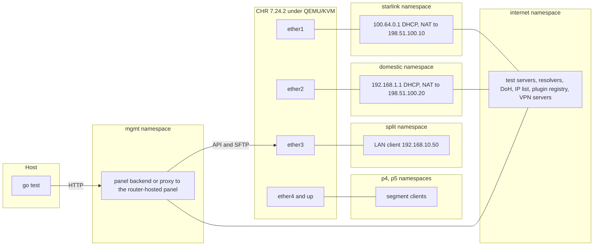

# test-lab

Live verification lab for Nasnet Panel. It boots a disposable MikroTik CHR virtual router, wires it to a simulated Starlink upstream, a simulated domestic upstream, an internet with test servers and LAN clients, drives the real installers and the real panel backend against it, and checks both the config that lands on the router and the traffic that actually flows.

The scenario list and expected behavior live in the RFC:

https://github.com/nasnet-community/nasnet-panel/issues/688

## Run it

### Requirements

- Linux x86_64 with KVM (`/dev/kvm`). arm64 profiles additionally need an arm64 KVM host
- Root, because the lab creates network namespaces, bridges and tap devices
- Go 1.26

On Ubuntu:

```sh
sudo apt-get install -y qemu-system-x86 qemu-utils iproute2 nftables dnsmasq-base \
  wireguard-tools xl2tpd ppp openvpn openssh-client curl
```

`wireguard-tools`, `xl2tpd`, `ppp`, `openvpn` and `openssh-client` are only needed by the scenarios that use them. Scenarios whose tools are missing are skipped with the reason.

macOS and Windows cannot run the lab. Use CI or a Linux VM with nested virtualization. `npm run lab:check` works everywhere.

### Commands

Run from the repository root. `sudo -E env "PATH=$PATH"` keeps your Go toolchain and caches visible to root.

```sh
# validate every profile and scenario file, no VM needed
npm run lab:check

# one stage on one profile
sudo -E env "PATH=$PATH" npm run lab -- -run TestStage2 -profile chr-x86

# one scenario
sudo -E env "PATH=$PATH" npm run lab -- -run TestStage2 -scenario 2.4-dual-link -profile chr-x86

# install and plugin scenarios need the panel image built from this checkout
sudo -E env "PATH=$PATH" npm run lab -- -run TestStage1 -profile chr-x86 \
  -image-tar /path/to/nasnet-panel-lab-amd64.tar

# keep the lab running after a failure to poke at it
sudo -E env "PATH=$PATH" npm run lab -- -run TestStage3 -scenario 3.3 -profile chr-x86 -keep
```

Build the image tar the same way CI does:

```sh
docker buildx build --platform linux/amd64 --load -t nasnet-panel:lab .
skopeo copy docker-daemon:nasnet-panel:lab docker-archive:nasnet-panel-lab-amd64.tar:nasnet-panel:lab
```

The first run downloads CHR 7.24.2 and the matching container package into the cache directory and builds the panel backend, the lab helper and the headless installer. Later runs reuse them.

### Flags

| Flag                  | Default                      | Meaning                                                            |
| --------------------- | ---------------------------- | ------------------------------------------------------------------ |
| `-run`                | all                          | Go test filter: `TestStage1`, `TestStage2` or `TestStage3`         |
| `-scenario`           | all                          | Only scenarios whose id starts with this prefix                    |
| `-profile`            | all                          | Only this device profile                                           |
| `-image-tar`          | none                         | Panel image tar from this checkout, needed by install and plugins  |
| `-previous-image-tar` | none                         | Previous release image tar, needed by update scenarios             |
| `-chr`                | download                     | Raw CHR x86 image to use instead of downloading                    |
| `-chr-sha256`         | none                         | Expected sha256 of the downloaded CHR zip                          |
| `-chr-arm64`          | none                         | CHR arm64 image, runs arm64 profiles natively on an arm64 KVM host |
| `-efi`                | none                         | UEFI firmware for the arm64 CHR                                    |
| `-internet`           | `false`                      | Real internet for scenarios that pull real plugin images           |
| `-keep`               | `false`                      | Leave the VM and namespaces running when a test fails              |
| `-cache`              | user cache `nasnet-test-lab` | Where images, packages and built binaries are kept                 |
| `-artifacts`          | `artifacts`                  | Where logs of failed tests are copied                              |

### Reading results

- `PASS` the scenario behaves as agreed in the RFC
- `FAIL` a regression, the message names the scenario, the profile and the failed expectation
- `SKIP` with `not applicable` the profile lacks what the scenario needs, for example radios or an LTE modem
- `SKIP` with `needs` a lab input or tool is missing, for example `-image-tar` or `xl2tpd`
- `KNOWN BUG` in the log: agreed behavior the product does not have yet, logged without failing the run

Logs of a failed test are copied to `test-lab/artifacts/<test name>/`:

| File                                     | Content                                  |
| ---------------------------------------- | ---------------------------------------- |
| `console.log`                            | Router serial console                    |
| `router.log`                             | QEMU output                              |
| `router-log.log`                         | RouterOS log read over the API           |
| `panel.log`                              | Panel backend running on the host        |
| `install-cli.log`, `install-gui.log`     | Installer output                         |
| `internet.log`                           | Test servers, DNS queries with source IP |
| `starlink-dhcp.log`, `domestic-dhcp.log` | Simulated upstream DHCP                  |
| `l2tp.log`, `openvpn.log`                | VPN servers and clients                  |

## Scenarios

Every scenario file, grouped by stage. Run one with `-scenario <id>`.

### Stage 1: Install

| ID                                | Scenario                                                                           | Profiles           |
| --------------------------------- | ---------------------------------------------------------------------------------- | ------------------ |
| `1.1-preconditions`               | Router matches the install preconditions                                           | all                |
| `1.2-cli-install`                 | CLI installer happy path with the image built from this checkout                   | all                |
| `1.3-gui-install`                 | Graphical installer engine reaches the same end state as the CLI installer         | all                |
| `1.4-device-mode`                 | Installer enables container mode and resumes after the physical confirmation       | all                |
| `1.5-install-remit`               | Nothing outside the install's remit changes                                        | all                |
| `1.6a-missing-package`            | Missing container package fails clearly and leaves the router clean                | all                |
| `1.6b-low-memory`                 | Too little free memory fails clearly                                               | all                |
| `1.6c-corrupt-image`              | Corrupt image fails and rolls back everything it created                           | all                |
| `1.6d-reinstall`                  | Running the installer twice is idempotent                                          | all                |
| `1.7-container-networking`        | Panel container has its network, reaches the router API and is only exposed to LAN | all                |
| `1.8-container-runtime`           | Panel container survives a stop and start with the same settings                   | all                |
| `D1.1-install-dns`                | Installing the panel does not touch DNS                                            | all                |
| `D1.2-container-dns`              | Panel container resolves names and reaches the internet through the router         | chr-x86, chr-arm64 |
| `P1.1-plugin-catalog`             | Plugin catalog loads after the panel is set up                                     | all                |
| `P1.2-plugin-catalog-unavailable` | Unreachable plugin registry gives a clear error and changes nothing                | all                |

### Stage 2: Wizard and steady state

| ID                              | Scenario                                                                                           | Profiles |
| ------------------------------- | -------------------------------------------------------------------------------------------------- | -------- |
| `2.1-dual-link`                 | Dual-link wizard applies the expected config                                                       | all      |
| `2.1-dual-link-l2tp`            | Dual-link with an L2TP client applies the expected config                                          | all      |
| `2.1-dual-link-ovpn-server`     | Dual-link with the OpenVPN server applies the expected config                                      | all      |
| `2.1-dual-link-wireguard`       | Dual-link with a WireGuard client applies the expected config                                      | all      |
| `2.1-starlink-only`             | Starlink-only wizard applies the expected config                                                   | all      |
| `2.1-wifi-split`                | WiFi split puts each band on its own SSID in the Split bridge                                      | all      |
| `2.2-applied-report`            | Every config section is applied                                                                    | all      |
| `2.2-detector-proof`            | A broken template line is reported with the section it stopped in                                  | chr-x86  |
| `2.3-lan-clients`               | Clients on each segment get a lease and reach the internet through their link                      | all      |
| `2.4-domestic-only`             | Domestic-only setup gives internet over the domestic link                                          | all      |
| `2.4-dual-link`                 | Dual-link setup gives internet on both links                                                       | all      |
| `2.4-starlink-only`             | Starlink-only setup gives internet over Starlink                                                   | all      |
| `2.5-egress-split`              | Foreign and domestic destinations leave through their intended links                               | all      |
| `2.6-starlink-leak`             | The Starlink IP is never seen by domestic destinations                                             | all      |
| `2.7-l2tp`                      | Internet works through an L2TP client and tunnel traffic shows the VPN IP                          | all      |
| `2.7-openvpn-client`            | Internet works through an OpenVPN client                                                           | all      |
| `2.7-wireguard`                 | Internet works through a WireGuard client and tunnel traffic shows the VPN IP                      | all      |
| `2.8-ovpn-server`               | OpenVPN server accepts a real client from the domestic side                                        | all      |
| `2.9-management`                | Management is reachable from LAN only                                                              | all      |
| `2.9-wireless`                  | Wireless clients get the same routing as wired ones                                                | all      |
| `2.10-easy-setup`               | Minimal wizard inputs give a working, leak-free setup                                              | all      |
| `2.11-overlap`                  | Wizard refuses an upstream subnet that overlaps the LAN                                            | all      |
| `2.11-two-vpn-clients`          | Wizard refuses two VPN clients at once                                                             | all      |
| `D2.1-forwarders-dual`          | Dual-link has all four DNS forwarder types                                                         | all      |
| `D2.1-forwarders-starlink-only` | Starlink-only has no Domestic forwarder                                                            | all      |
| `D2.2-domestic-type`            | Domestic names use the domestic resolver over the domestic link only                               | all      |
| `D2.3-foreign-type`             | Foreign-forwarded names resolve over Starlink                                                      | all      |
| `D2.4-vpn-type`                 | VPN segment lookups go through the tunnel                                                          | all      |
| `D2.5-general-doh`              | General lookups use Cloudflare DoH over the VPN or Starlink, never the domestic link               | all      |
| `D2.6-client-dns`               | LAN clients use the router for DNS and cannot bypass it                                            | all      |
| `D2.7-dynamic-servers`          | Upstream DNS servers learned over DHCP are never used                                              | all      |
| `D2.8-edit-dns`                 | DNS edits from the panel apply, and invalid input changes nothing                                  | all      |
| `D2.9-change-validation`        | Changing a type's DNS IP is validated against the domestic IP list                                 | all      |
| `D2.10-change-dns-only`         | Changing a DNS IP changes DNS only, not failover                                                   | all      |
| `D2.11-reset`                   | DNS reset restores defaults and leaves no Domestic forwarder without a domestic link               | all      |
| `D2.12-suggestions`             | DNS suggestions come back per type with no duplicates                                              | chr-x86  |
| `E01-bridges-split-only`        | Only the Split bridge gets ports by default                                                        | all      |
| `E02-dhcp-gateway`              | Routes follow the gateway learned over DHCP                                                        | all      |
| `E05-interface-lists`           | Each uplink is in the WAN list and its own per-link list                                           | all      |
| `E06-router-traffic`            | The router's own traffic uses the VPN or Starlink, and domestic destinations use the domestic link | all      |
| `E07-empty-domestic-list`       | Split internet is blocked until the domestic IP list loads                                         | all      |
| `E07-mangle-overrides`          | User override lists win over the domestic IP list                                                  | all      |
| `E08-firewall-default-drop`     | Everything from WAN that is not explicitly allowed is dropped                                      | all      |
| `E10-ovpn-ciphers`              | OpenVPN server allows modern ciphers only                                                          | all      |
| `E11-wifi-country`              | WiFi regulatory country defaults to Iran                                                           | all      |
| `E12-schedules`                 | IP list refreshes weekly and the VPNE manager runs every minute                                    | all      |
| `E12-user-id`                   | Both IP list scripts send the router's own random id                                               | all      |
| `E13-mgmt-port-dhcp`            | The management port hands out addresses over DHCP                                                  | chr-x86  |
| `E-ddns-starlink-only`          | Cloud DDNS is off without a domestic link                                                          | all      |
| `E-upnp`                        | UPnP and NAT-PMP are off                                                                           | all      |
| `P2.1-install-plugin`           | Plugin installs with its network link, mounts and settings                                         | all      |
| `P2.2-plugin-works`             | Installed plugin answers on its published port                                                     | all      |
| `P2.2-real-plugins`             | Real community plugins install and run                                                             | chr-x86  |
| `P2.3-architecture`             | Plugin without support for the router architecture fails early and creates nothing                 | all      |
| `P2.4-exposure`                 | Plugin ports open only on the domestic link and never expose the Starlink IP                       | all      |
| `P2.5-concurrency`              | Duplicate installs and uninstall during install are refused                                        | all      |
| `P2.6-failed-image`             | Image pull failure ends in an error and leaves nothing behind                                      | all      |
| `P2.6-failed-script`            | Failing install script ends in an error and leaves nothing behind                                  | all      |
| `P2.7-uninstall`                | Uninstall fully undoes the install                                                                 | all      |
| `P2.8-already-installed`        | Installing an installed plugin is refused and the list matches the router                          | all      |

### Stage 3: Resilience

| ID                             | Scenario                                                                           | Profiles |
| ------------------------------ | ---------------------------------------------------------------------------------- | -------- |
| `3.1-reboot`                   | Config, lists and traffic survive a reboot                                         | all      |
| `3.2-starlink-down-carrier`    | Starlink down (carrier) blocks foreign traffic within 15s and recovers within 30s  | all      |
| `3.2-starlink-down-upstream`   | Starlink down (upstream) blocks foreign traffic within 15s and recovers within 30s | all      |
| `3.3-domestic-down`            | Domestic down blocks domestic traffic, never over Starlink, and recovers           | all      |
| `3.4-l2tp-down`                | VPN tunnel down (l2tp) blocks VPN traffic and recovers                             | all      |
| `3.4-wireguard-down`           | VPN tunnel down (wireguard) blocks VPN traffic and recovers                        | all      |
| `3.5-filtered-target`          | One filtered health-check target does not take a healthy link down                 | all      |
| `3.6-change-wan`               | Changing the domestic WAN re-points its uplink                                     | chr-x86  |
| `3.6-rerun-wizard`             | Re-running the wizard with other inputs leaves no stale config                     | all      |
| `3.7-list-source-down`         | Unreachable IP list source keeps the last good list                                | all      |
| `3.7-mid-apply-disconnect`     | Losing the panel connection mid-apply still ends with a complete config            | all      |
| `3.7-panel-update`             | Updating the panel keeps the applied config                                        | all      |
| `D3.1-domestic-down-dns`       | Domestic down blocks domestic names while foreign names still resolve              | all      |
| `D3.2-starlink-down-dns`       | Starlink down blocks foreign DNS while domestic names still resolve                | all      |
| `D3.3-vpn-down-dns`            | VPN down blocks VPN segment lookups with no fallback                               | all      |
| `D3.4-resolver-filtered`       | A filtered resolver on a healthy link does not break the link                      | all      |
| `D3.5-reboot-dns`              | DNS config survives a reboot                                                       | all      |
| `D3.6-change-then-fault`       | Failover still works on its own targets after a DNS IP change                      | all      |
| `D3.7-rerun-dns`               | Re-running the wizard restores DNS defaults                                        | all      |
| `P3.1-reboot`                  | Installed plugins start on boot                                                    | all      |
| `P3.2-wizard-rerun`            | Plugins keep running and stay reachable after re-running the wizard                | all      |
| `P3.3-panel-restart`           | Panel restart mid-install converges to the real router state                       | all      |
| `P3.4-link-faults`             | Plugin traffic follows the same link rules as everything else                      | all      |
| `P3.5-panel-update`            | Plugins and their settings survive a panel update                                  | all      |
| `P3.6-registry-down-uninstall` | Uninstall with the registry unreachable fails clearly and removes nothing          | all      |

## How it works

### Layout

```
test-lab/
  profiles/          one YAML per container-capable device
  scenarios/
    install/         stage 1: installers, panel container, DNS and plugin catalog after install
    wizard/          stage 2: wizard, steady state, DNS types, plugins, expected-config decisions
    resilience/      stage 3: reboot, link and tunnel faults, re-runs, updates
  fixtures/plugins/  plugin registry served by the lab
  cmd/labsvc/        helper run inside the lab: DNS, DoH, test servers, registry, probes
  cmd/labcheck/      validates profiles and scenarios without a VM
  internal/
    env/             network, VM lifecycle, snapshots, services, installers, faults
    runner/          runs scenario steps and gates on requirements
    expect/          all checks and the known bug reporting
    drive/           panel API client and RouterOS API client
    probe/           traffic, DNS, DHCP and port probes from lab clients
    scenario/        scenario schema
    profile/         profile schema
  stage1_test.go     install
  stage2_test.go     wizard and steady state
  stage3_test.go     resilience
```

The headless installer used for the graphical installer parity scenario lives in `graphical-installer/headless`, because the installer engine is internal to that module.

### Lab topology

Every run gets a short random id, and every namespace, bridge and tap device carries it, so labs never collide.



| Piece             | Address                                          | Role                                                                 |
| ----------------- | ------------------------------------------------ | -------------------------------------------------------------------- |
| Starlink upstream | `100.64.0.1`, public `198.51.100.10`             | DHCP on the foreign link, NAT to the Starlink IP                     |
| Domestic upstream | `192.168.1.1`, public `198.51.100.20`            | DHCP on the domestic link, NAT to the domestic IP, subnet can change |
| Test servers      | `203.0.113.80` foreign, `5.160.0.80` domestic    | Answer with the source IP they see                                   |
| Resolvers         | `4.2.2.1`, `4.2.2.2`, `217.218.127.127` and more | Answer TXT queries with their own identity and the source IP         |
| DoH               | `1.1.1.1:443`, `8.8.8.8:443`                     | DNS over HTTPS with the same answers                                 |
| IP list source    | `203.0.113.44:443` as `s4i.co`                   | Domestic IP list including `5.160.0.0/24`                            |
| Plugin registry   | `185.199.108.133:443`                            | Catalog from `fixtures/plugins` and a lab container image            |
| WireGuard server  | `203.0.113.51:51820`, tunnel `10.66.0.0/24`      | VPN client scenarios                                                 |
| L2TP server       | `203.0.113.52:1701`, tunnel `10.67.0.0/24`       | VPN client scenarios                                                 |
| LAN client        | `192.168.10.50`                                  | Traffic and DNS probes on Split                                      |
| Segment clients   | DHCP                                             | Moved onto other segment bridges by `segment_client`                 |

Traffic is proven by observation. "exits starlink" means a test server saw the request from `198.51.100.10`, "exits vpn" means it came from a tunnel address. Leak checks count packets in the internet namespace: anything from the Starlink link to a domestic destination, or from the domestic link to a foreign destination.

### Starting states and snapshots

| Start             | Router state                                                                    |
| ----------------- | ------------------------------------------------------------------------------- |
| `fresh`           | MikroTik default-like config at `192.168.88.1`                                  |
| `bootstrapped`    | Split LAN baseline at `192.168.10.1`, default for stages 2 and 3                |
| `container-ready` | Bootstrapped plus the container package and container mode, default for stage 1 |
| `installed`       | Container-ready plus the panel installed by the CLI installer                   |

Each state is built once per profile per run and saved as a disk snapshot. Later scenarios clone the snapshot instead of repeating the setup.

The panel runs on the host by default so tests start fast. `panel: router` talks to the panel container installed on the router instead.

### Scenario format

```yaml
id: '3.3-domestic-down'
stage: resilience
title: Domestic down blocks domestic traffic, never over Starlink, and recovers
profiles: [all]
requires: { roles: [starlink, domestic, split] }
wizard:
  foreign: starlink
  domestic: domestic
  wait_domestic_list: true
steps:
  - do: link_down
    with: { link: domestic }
    expect:
      traffic:
        - { from: split, to: domestic-host, exits: blocked, within: 15s }
  - do: link_up
    with: { link: domestic }
    expect:
      traffic:
        - { from: split, to: domestic-host, exits: domestic, within: 30s }
```

Top level fields: `id`, `stage`, `title`, `profiles` (names or `all`), `requires` (`roles`, `capabilities`, `lab`, `live_arch`), `start`, `panel`, `panel_patch`, `domestic_subnet`, `wizard`, `steps`, `expect`, `known_bug`.

Wizard inputs: `foreign`, `domestic` (port roles), `wireguard_client`, `l2tp_client`, `openvpn_client`, `ovpn_server`, `wifi`, `wait_domestic_list`, `expect_error`, `expect_incomplete`, `timeout`, `known_bug`.

Actions:

| Action                                          | With                                                                            |
| ----------------------------------------------- | ------------------------------------------------------------------------------- | --- |
| `wizard`, `wizard_start`, `wizard_wait`         | `wizard:` block                                                                 |
| `api`                                           | `api:` method, path, query, body, status, contains, json, unique                |
| `install`, `uninstall`                          | `installer` cli or gui, `image` pr, previous or corrupt, `expect_fail`, `error` |
| `reboot`, `power_cycle`                         |                                                                                 |
| `link_down`, `link_up`                          | `link` starlink or domestic, `mode` upstream or carrier                         |
| `filter`, `clear_filters`                       | `link`, `target` address or alias                                               |
| `vpn_server_down`, `vpn_server_up`              | `type` wireguard or l2tp                                                        |
| `disconnect_panel`                              | `for`                                                                           |
| `restart_panel`                                 |                                                                                 |
| `plugin_install`, `plugin_uninstall`            | `id`, `phase`, `status`                                                         |
| `lab_registry`                                  | trusts the lab CA and points the router at the lab registry                     |
| `segment_client`                                | `client` such as p4, `bridge`                                                   |
| `openvpn_connect`                               | exports the client config and connects from the domestic side                   |
| `container_mode`                                | `value` on or off                                                               |
| `container_restart`                             | `name`                                                                          |
| `config_snapshot`                               | `name`, `paths` comma separated                                                 |
| `router`                                        | `cmd`, `words` separated by `                                                   | `   |
| `change_wan`                                    | `role`, `type`                                                                  |
| `wait_domestic_list`, `reset_counters`, `sleep` | `for` on sleep                                                                  |

Checks under `expect`:

| Check       | Meaning                                                                           |
| ----------- | --------------------------------------------------------------------------------- |
| `sections`  | Entries under a config path must or must not exist                                |
| `values`    | Entries matching `where` exist, are absent, have a count or field values          |
| `applied`   | Named config sections are applied, with the stop point and script errors when not |
| `traffic`   | Which link a request leaves through, or that it is blocked, within a time bound   |
| `dns`       | Which resolver type answered and which link the query used, or blocked            |
| `leak`      | No Starlink-to-domestic or domestic-to-foreign packets                            |
| `ports`     | TCP port open or closed from a side of the router                                 |
| `files`     | Files present or absent, no file contains the router password                     |
| `container` | Container present, running and field values                                       |
| `tunnels`   | WireGuard handshake or L2TP connection up                                         |
| `dhcp`      | Lease offered with the expected gateway and DNS                                   |
| `plugins`   | Plugin list reports installed and running                                         |
| `panel`     | Panel healthy                                                                     |
| `unchanged` | Config paths match a `config_snapshot`                                            |

Field matchers: exact value, `~text` contains, `!~text` does not contain, `!value` differs, `!empty`, `yes` and `no` also match `true` and `false`.

### Known bugs

Expectations the product does not meet yet carry `known_bug` with a short reason. A failing check with the marker is logged as `KNOWN BUG` and does not fail the run. A passing check with the marker fails the run, so the marker is removed when the fix lands and the check becomes a gate.

### Profiles

29 profiles cover the container-capable models: CHR x86 and arm64, hAP ax lite, ax2, ax3, ac2 and ac3, cAP ax, wAP ax, hEX refresh, hEX S, L009, RB5009 and its PoE variant, RB4011 and its WiFi variant, RB1100AHx4, Chateau LTE12, LTE18 ax and 5G ax, CCR2004 variants, CCR2116, CCR2216, CRS504, CRS510, CRS518, CRS520 and LtAP ax.

A profile lists the ports in interface order with a role for each (`starlink`, `domestic`, `split`, `spare`) and the capabilities the model has. The virtual router gets one NIC per port, named `ether1` and up in that order.

### What a virtual router cannot cover

- Radios, LTE and 5G modems, SFP modules and PoE: scenarios that need them report not applicable
- Real hardware port names: ports are always `ether1` and up on CHR
- The armv7 image: no virtual RouterOS runs it, so install scenarios skip armv7 profiles
- arm64 images: need `-chr-arm64` and `-efi` on an arm64 KVM host, otherwise arm64 profiles run as an x86 CHR and skip install scenarios
- Low memory: CHR needs more memory than the smallest models, so the low memory scenario is not applicable
- Real plugin behavior beyond running: needs `-internet`, and protocol clients for each plugin are not part of the lab

### Adding a scenario

1. Pick the stage folder under `scenarios/`
2. Copy an existing file, give it the RFC id, list the profiles and requirements
3. Describe the wizard inputs, steps and checks
4. Run `npm run lab:check`, then run it with `-scenario <id>`

### Adding a profile

1. Add `profiles/<name>.yaml` with the ports in interface order, a role per port and the capabilities
2. Run `npm run lab:check`

## CI

`.github/workflows/lab.yml` runs on pull requests that touch the wizard, DNS, plugins, installers or the lab, nightly, and on demand.

- `check` vets the lab code and validates every profile and scenario
- `image` builds the panel image and the RouterOS tar from the checkout and fetches the previous snapshot tar
- `lab` runs each stage per profile on GitHub-hosted Linux runners with KVM. Pull requests run `chr-x86`, nightly, manual runs and pull requests labeled `lab:full` run every profile
- Logs of failed tests are uploaded as artifacts
